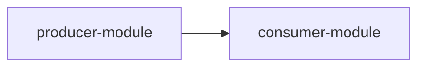

# Module Contract Output Format Template

> 状態: Draft for review  
> 目的: 次の `/goal` で `discussion/design/module-contracts/` に作成する module contract design 成果物の共通書式、ファイル別必須セクション、TypeScript / Zod code block の書き方を定義する。

## 1. 位置付け

この文書は、module contract design の成果物が抽象方針に留まらず、後続実装エージェントが使える contract-first 設計になるための出力テンプレートである。

Mermaid図は、依存方向、処理順序、状態遷移、artifact生成flowの読み違いを防ぐために積極的に使う。ただし、契約の正は TypeScript / Zod code block、表、明示された source-of-truth に置く。図だけを source of truth にしない。

参照関係:

- 到達目標: [module-contract-design-goal.md](module-contract-design-goal.md)
- 合意済み判断: [module-contract-design-decisions.md](module-contract-design-decisions.md)
- 出力先: [module-contracts/](module-contracts/_map.md)

## 2. 全成果物共通ヘッダー

各成果物は、先頭に次の情報を持つ。

```markdown
# <Document Title>

> 状態: Draft / Review ready / Accepted
> 出力先: discussion/design/module-contracts/<file-name>.md
> 主な読者: <後続実装エージェント / reviewer / user>
> 主な所有module: <module name or cross-cutting>
> Source of truth: zod / typescript / generated-json-schema / mixed
> 根拠: <AC, scenario, prior design, report links>
```

`Source of truth` は必ず明記する。複数ある場合は `mixed` とし、本文の source-of-truth table で契約ごとに分ける。

## 3. 全成果物共通セクション

各成果物は、少なくとも次のセクションを持つ。

### 3.1 Purpose and Scope

書くこと:

- この文書が固定する contract。
- 誰が読むか。
- どのmodule実装をブロック解除するか。
- MVP内に含めるもの、含めないもの。

### 3.2 Basis Separation

公式事実、リポジトリ事実、設計判断、仮定を分ける。

最小テンプレート:

```markdown
## Basis Separation

### Repository Facts

- ...

### Prior Design Decisions

- ...

### Assumptions

- ...
```

外部公式資料を使う場合は `Official / Reference Facts` を追加する。

### 3.3 Contract Summary

この文書で定義する契約を表で要約する。

```markdown
| Contract | Owner module | Consumers | Source of truth | Artifact |
|----------|--------------|-----------|-----------------|----------|
| ... | ... | ... | zod / typescript | DTO / API / report / fixture |
```

### 3.4 TypeScript / Zod Sketches

TypeScript / Zod の code block を必ず含める。実装コードではなく contract sketch として書く。

外部境界DTOの場合:

```ts
import { z } from "zod";

export const ExampleDtoSchema = z.object({
  schemaVersion: z.literal("example-v1"),
  id: z.string(),
});

export type ExampleDto = z.infer<typeof ExampleDtoSchema>;
```

内部ドメイン型の場合:

```ts
export interface ExampleInternalState {
  readonly id: ExampleId;
  readonly revision: number;
}
```

Rules:

- `ts` code fence を使う。
- 可能な限り `readonly` を付け、mutation責務を曖昧にしない。
- stable ID は branded type として表現する。
- 外部境界DTOは Zod schema + `z.infer` を基本にする。
- 内部型は TypeScript `type` / `interface` を基本にする。
- algorithm実装、UI実装、ファイルI/O実装は書かない。
- import path は実装前の仮名でよいが、module boundary と矛盾させない。

### 3.5 Diagram Requirements

依存方向、処理順序、状態遷移、artifact flow がある成果物では Mermaid 図を使う。

共通ルール:

- Mermaid code fence を使う。
- 図の直前または直後に、図が何を表すかを1から3文で説明する。
- 依存方向、処理順序、状態遷移を矢印で明示する。
- 複雑な1枚図にしすぎず、必要なら複数図に分ける。
- 図と表/TypeScript/Zodが矛盾する場合は、表/TypeScript/Zod/source-of-truth tableを正とする。
- 図はレビュー補助であり、contractの正は code block と表に置く。

使い分け:

| 図にしたいもの | Mermaid種別 |
|----------------|-------------|
| module dependency / layer relation | `flowchart` |
| operation / AI dry-run / validation の手順 | `sequenceDiagram` |
| Editor mode / operation lifecycle | `stateDiagram-v2` |
| DTO / schema / file reference relation | `flowchart` または `classDiagram` |
| fixture -> expected artifact flow | `flowchart` |

最小テンプレート:



### 3.6 Traceability

上位AC、scenario、既存Draft、fixtureとの対応を持つ。

```markdown
| Requirement | Contract element | Verification |
|-------------|------------------|--------------|
| AC-MVP-... | ... | fixture / check / snapshot |
```

### 3.7 Verification and Fixtures

この契約をどう検証するかを書く。

```markdown
| Fixture / Test | Purpose | Expected artifact |
|----------------|---------|-------------------|
| ... | ... | validation report / runtime snapshot / diff |
```

### 3.8 Open Questions

未決事項を `implementation-blocking` と `can-defer` に分ける。

```markdown
| Question | Impact | Status |
|----------|--------|--------|
| ... | implementation-blocking / can-defer | ... |
```

### 3.9 Handoff Checklist

後続実装エージェントが使える状態かを確認する。

```markdown
- [ ] Public API / DTO が示されている
- [ ] Source of truth が契約ごとに明記されている
- [ ] 依存方向、処理順序、状態遷移が必要な箇所に Mermaid 図がある
- [ ] AC / scenario traceability がある
- [ ] Fixture または expected output がある
- [ ] 未決事項が implementation-blocking / can-defer に分かれている
```

### 3.10 Review Requirements

初稿作成後、可能であれば次の3観点で独立レビューを行う。

| Review lane | Required focus | Output |
|-------------|----------------|--------|
| AC / Scenario Traceability Review | ACだけでなく、シナリオの操作列、期待結果、operation flow、fixture、expected output へ trace がつながっているか | findings, missing links, required fixes |
| TypeScript / Zod Contract Consistency Review | branded ID、DTO、内部型、Zod schema、sourceOfTruth、module dependency、Mermaid図と表が矛盾していないか | findings, conflicting contracts, required fixes |
| Fixture / Verification Review | fixtureとexpected validation report / runtime snapshot / diff がcontractを固定できるか | findings, missing fixtures, required fixes |

レビュー結果は `discussion/design/module-contracts/review-summary.md` に集約する。

レビュー担当はユーザーへ直接質問しない。判断待ちは担当エージェントが集約する。

## 4. ファイル別テンプレート

### 4.1 `module-boundaries.md`

目的: module責務、所有state、禁止依存、public API、サブエージェントwrite ownershipを固定する。

必須セクション:

- Module list
- Dependency direction
- Mermaid dependency graph
- Owned state / forbidden state
- Public API overview
- Subagent implementation ownership
- Traceability

必須 Mermaid 図:

- module dependency graph
- forbidden dependency overview, if useful
- implementation layer graph

必須表:

```markdown
| Module | Owns | Must not know | Public API | Primary consumers |
|--------|------|---------------|------------|-------------------|
| ... | ... | ... | ... | ... |
```

```markdown
| Implementer slice | Owned files / modules | May read | Must not edit |
|-------------------|-----------------------|----------|---------------|
| ... | ... | ... | ... |
```

### 4.2 `typescript-contracts.md`

目的: 全moduleで共有する branded ID、primitive、enum、DTO index、diff型、diagnostic型をまとめる。

必須セクション:

- Branded IDs
- Common scalar / vector types
- Common enums
- Shared diagnostic types
- Shared diff types
- DTO index
- Source-of-truth table

推奨 Mermaid 図:

- shared DTO relation overview, if it reduces ambiguity
- ID ownership / reference relation overview, if useful

必須 code block:

```ts
export type Brand<T, BrandName extends string> = T & { readonly __brand: BrandName };

export type DrawableId = Brand<string, "DrawableId">;
export type MeshId = Brand<string, "MeshId">;
```

### 4.3 `package-file-format-contract.md`

目的: Open Model Package のファイル構成と TypeScript/Zod DTO の対応を固定する。

必須セクション:

- Package directory layout
- File responsibility table
- PSD primary source asset contract
- Split PNG fallback source asset contract
- Source asset provenance mapping
- DTO schema sketches
- Cross-file reference rules
- Versioning / migration hooks
- Schema validation vs runtime validation boundary

必須 Mermaid 図:

- package file reference graph
- package load -> DTO parse -> normalized graph flow
- PSD layer tree -> package DTO mapping flow

必須で明示すること:

- PSDを primary source asset として扱うこと
- split PNGを fallback / debug / compatibility 入口として扱うこと
- PSD layer tree、group、layer name、bounds、visibility、opacity、raster pixel data、mask をどのDTOへ写像するか
- unsupported PSD feature の diagnostic と provenance
- PSD / split PNG の source asset が runtime-visible graph と混同されない境界

必須表:

```markdown
| Package file | DTO / Schema | Required | References | Validated by |
|--------------|--------------|----------|------------|--------------|
| manifest.json | ... | yes | ... | package-format |
```

### 4.4 `operation-contracts.md`

目的: GUI、AI、migration、repair candidate が共有する operation contract を固定する。

必須セクション:

- Operation registry
- Common operation request / response
- Operation log entry
- Dry-run and commit behavior
- Per-operation payloads
- PSD import operation
- Split PNG fallback import operation
- Undo / redo policy
- Diff outputs

必須 Mermaid 図:

- operation lifecycle state diagram
- dry-run vs commit sequence

必須表:

```markdown
| Operation | Payload | Preconditions | Produces | Related AC / scenario |
|-----------|---------|---------------|----------|-----------------------|
| importPsdSourceAsset | ... | ... | source asset diff, model diff, validation report | AC-MVP-... |
```

### 4.5 `runtime-core-contract.md`

目的: Shared Runtime evaluation core の純粋入力/出力、snapshot、evaluator version、deterministic比較を固定する。

必須セクション:

- Runtime API
- Normalized runtime graph
- Parameter / keyform evaluation semantics
- Cubism-like 2-axis keyform grid semantics
- Evaluation input / options
- Runtime snapshot
- Diagnostics phases
- Epsilon policy
- Snapshot comparison rule
- Disabled future layers

必須 Mermaid 図:

- runtime evaluation pipeline
- snapshot generation flow

必須で明示すること:

- 1軸 keyform 評価と `parameter-grid-2d-v1` の切り分け
- `parameter-grid-2d-v1` の key coordinate、欠損key、補間method、clamp policy
- 親子デフォーマ階層の parent-before-child 評価順序
- 3軸以上を同一対象に割り当てた場合の validator diagnostic

必須 code block:

```ts
export interface RuntimeCore {
  evaluateRuntime(
    graph: NormalizedRuntimeGraph,
    input: RuntimeEvaluationInput,
    options: RuntimeEvaluationOptions
  ): RuntimeSnapshot;
}
```

### 4.6 `validator-contract.md`

目的: check registry、severity/status、profile、validation report、repair candidate を固定する。

必須セクション:

- Check ID naming
- Validation profiles
- Severity / status
- Report schema
- Repair candidate schema
- Editor warning / Viewer diagnostics / Acceptance Runner relation

必須 Mermaid 図:

- validation phase flow
- profile-specific report flow

必須表:

```markdown
| Check ID | Phase | Severity default | Profile behavior | Related AC |
|----------|-------|------------------|------------------|------------|
| ... | ... | warning | strict: fail | AC-MVP-... |
```

### 4.7 `gui-operation-contract.md`

目的: GUI操作を operation-core へ接続し、Canvas操作やPlaywright/AI観測面がcoreを迂回しないようにする。

必須セクション:

- Screen / panel state contract
- Editor semantic state contract
- Selection / canvas viewport / hit-test contract
- UI event -> operation mapping
- Canvas interaction payloads
- 1-axis keyform and 2-axis keyform grid editing surface
- Stable test id / role / label policy
- GUI authoring evidence
- Operation log as required evidence
- Playwright trace / screenshot / session metadata as supplemental evidence
- Editor-only vs runtime-visible state

必須 Mermaid 図:

- UI event -> operation core -> preview/runtime sequence
- Editor mode state diagram

必須表:

```markdown
| UI surface | User action | Operation | Evidence | Test id policy |
|------------|-------------|-----------|----------|----------------|
| Parameter panel | Add keyform | addKeyform | operation log | ... |
```

Angle X / Y のような2軸キー形状編集は、Cubism Editor 準拠の操作概念として扱い、GUI操作が必ず operation-core の `parameter-grid-2d-v1` 相当operationへ落ちるように書く。

GUI authoring evidence は、operation log を必須証拠として扱う。Playwright trace、screenshot、video、session metadata は補助証拠であり、contract の正は operation log、validation report、runtime snapshot に置く。

AI Agent がスクリーンショットを参照しながら作業するケースでは、画面ピクセルだけで対象特定しない。`getEditorState`、`getSelection`、`getCanvasViewport`、`hitTestCanvas` などの semantic state / hit-test API を通じて正確な対象IDを取得できるように書く。

### 4.8 `ai-command-contract.md`

目的: AI Agent Interface の command request/response、dry-run、diff、approval、revalidation を固定する。

必須セクション:

- Command registry
- Scenario-driven command derivation
- Transport-independent request / response
- Editor semantic state API
- Operation command API
- Runtime / Validator read API
- Dry-run result
- Model / runtime / validation diff
- Repair candidate
- Approval boundary
- Revalidation procedure

必須 Mermaid 図:

- AI dry-run -> diff -> approval -> commit -> revalidation sequence
- command flow between AI interface, operation core, runtime core, validator core

必須表:

```markdown
| Command | Request schema | Response schema | Mutates package | Requires approval |
|---------|----------------|-----------------|-----------------|-------------------|
| dryRunOperation | ... | ... | no | no |
```

必須で明示すること:

- ユースケースシナリオごとに、AI Agent が必要とする observe / inspect / hit-test / dry-run / commit / validate / snapshot / evidence の口。
- 代表シナリオ「スクリーンショットを見ながらデフォーマへパラメータを設定する」の操作stepとAPI呼び出し。
- API口を Editor semantic state API、Operation command API、Runtime / Validator read API に分類すること。
- transport-independent contract を正とし、HTTP JSON / WebSocket / MCP は adapter候補としてMVP必須、MVP任意、post-MVPに分類すること。

### 4.9 `fixtures-and-contract-tests.md`

目的: contractをfixtureとexpected outputで固定し、module並列実装のずれを検出できるようにする。

必須セクション:

- Fixture list
- Expected validation reports
- Expected runtime snapshots
- Expected diffs
- Contract test matrix
- Fixture ownership and update rules
- PSD import happy path fixture
- PSD unsupported layer fixture
- Split PNG fallback fixture
- Cubism-like 2-axis keyform grid fixture
- Parent-child deformer diagonal expression fixture

必須 Mermaid 図:

- fixture -> expected artifacts -> covered modules flow

必須表:

```markdown
| Fixture | Covers | Expected artifacts | Blocks which modules |
|---------|--------|--------------------|----------------------|
| minimal-valid | package load | validation report, snapshot | package-format, runtime-core |
```

### 4.10 `traceability-matrix.md`

目的: AC / scenario / module / API / DTO / fixture の対応を一箇所で追跡する。

必須セクション:

- AC -> module/API/type/test
- Scenario -> operation flow
- Diagnostic -> AC/scenario
- Fixture -> expected output
- Gaps and missing contracts

推奨 Mermaid 図:

- high-level AC -> module coverage overview, if useful
- scenario operation flow for the main MVP happy path

必須表:

```markdown
| AC / Scenario | Module | Contract element | Fixture / Test | Status |
|---------------|--------|------------------|----------------|--------|
| AC-MVP-012 | runtime-core | RuntimeSnapshot | tutorial-like | draft |
```

## 5. `/goal` 完了条件

次の `/goal` は、成果物作成後に次を自己確認する。

- すべての予定成果物が `discussion/design/module-contracts/` にある。
- 各成果物が共通ヘッダーと共通セクションを持つ。
- TypeScript / Zod code block が必要箇所にある。
- `sourceOfTruth` が契約ごとに明記されている。
- Mermaid 図が、依存方向、処理順序、状態遷移、artifact flow の読み違いを防ぐ箇所にある。
- AC / Scenario Traceability、TypeScript / Zod Contract Consistency、Fixture / Verification のレビューが行われ、結果が `review-summary.md` に記録されている。
- AC / scenario / fixture traceability がある。
- 実装前に決めるべき未決事項が、設計内で解消済みまたは明示的な判断待ちに分類されている。
- `module-contracts/_map.md` が更新されている。
