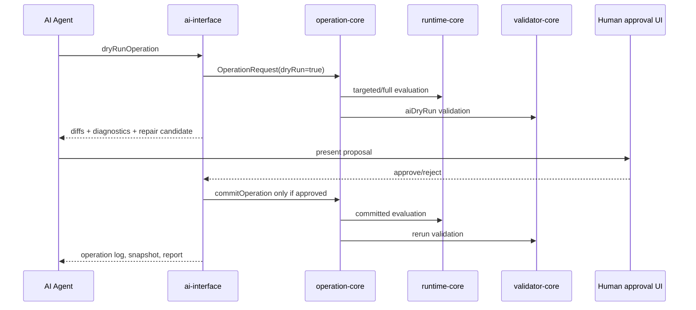
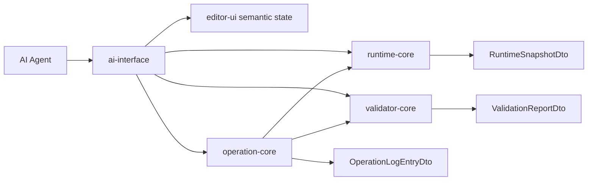

# AI Command Contract

> 状態: Draft / Review ready
> 出力先: discussion/design/module-contracts/ai-command-contract.md
> 主な読者: ai-interface implementer / operation-core implementer / validator implementer / GUI automation reviewer
> 主な所有module: `ai-interface`
> Source of truth: zod
> 根拠: [../mvp-authoring-runtime/05-ai-agent-interface-design.md](../mvp-authoring-runtime/05-ai-agent-interface-design.md), [../../scenarios/02_DomainAcceptanceCriteria/213_AI-native_Operation.md](../../scenarios/02_DomainAcceptanceCriteria/213_AI-native_Operation.md), [../../scenarios/02_DomainAcceptanceCriteria/222_Open_AI_Agent_Interface.md](../../scenarios/02_DomainAcceptanceCriteria/222_Open_AI_Agent_Interface.md), [gui-operation-contract.md](gui-operation-contract.md)

## Purpose and Scope

This document fixes transport-independent AI Agent Interface commands for observing, inspecting, dry-running, committing with approval, validating, diffing, and collecting evidence.

It derives command groups from scenarios instead of starting from fixed HTTP endpoints.

It covers:

- command registry,
- scenario-driven command derivation,
- transport-independent request/response envelope,
- Editor semantic state API,
- Operation command API,
- Runtime / Validator read API,
- dry-run result,
- model/runtime/validation diff,
- repair candidate,
- approval boundary,
- revalidation procedure,
- transport adapter classification.

It does not define prompt format, model provider, or external hosted agent authorization.

## AI Negative Requirements

AI assistant must not perform:

- automatic complete rig generation.
- image-to-rig generation.
- control point distribution inference.
- Cubism-like auto-rigging.
- existing model conversion.
- third-party model repair.
- Cubism / Live2D model learning.
- Cubism model structure reconstruction.
- rights / legal safety determination.
- automatic physics or dynamics parameter tuning.

AI assistant may perform:

- inspect.
- explain.
- validate.
- dry-run operation.
- diff.
- repair suggestion.
- provenance summary.
- demo-safe classification based on metadata.
- Dynamics group inspection, dry-run operation proposals, deterministic preview sequence checks, and demo-safe secondary motion explanation.

## Basis Separation

### Repository Facts

- `SC-AI-002` requires stable ID selection independent from UI coordinates.
- `SC-AGENT-002` requires structured operation commands that preview, validate, and create save candidates without overwriting the package.
- `SC-MVP-004` requires AI dry-run, model diff, runtime diff, validation diff, repair candidate, and revalidation.

### Prior Design Decisions

- Structured API command list is derived from use-case scenarios.
- API categories are Editor semantic state API, Operation command API, and Runtime / Validator read API.
- Transport-independent contract is the source of truth.
- HTTP JSON, WebSocket, and MCP are adapters, not source of truth.
- Representative required scenario: using a screenshot while setting parameters on a selected or specified rigControl.

### Assumptions

- AI sessions have scoped capabilities such as read, dry-run edit, commit after approval, and validation.
- MVP can start with an in-process command bus adapter and still satisfy the semantic contract.

## Contract Summary

| Contract | Owner module | Consumers | Source of truth | Artifact |
|----------|--------------|-----------|-----------------|----------|
| AI command request/response envelope | `ai-interface` | AI agents, tests, adapters | zod | DTO |
| Editor semantic state commands | `editor-ui` via `ai-interface` | AI observe tools | zod | read DTO |
| Operation command API | `operation-core` via `ai-interface` | AI edit tools | zod | request/result |
| Runtime/Validator read API | `runtime-core`, `validator-core` via `ai-interface` | AI review tools | zod | snapshot/report/diff |
| Approval/revalidation workflow | `ai-interface` | GUI/AI/validator | zod + sequence | workflow |

## TypeScript / Zod Sketches

## Scenario-driven Command Derivation

| Scenario | Needed observe / inspect / hit-test / dry-run / commit / validate / snapshot / evidence |
|----------|-----------------------------------------------------------------------------------------|
| SC-AI-001 | inspect model, evaluate runtime, validate package, aggregate operation report |
| SC-AI-002 | search editable targets, select by stable ID, dry-run vertex/keyform edit, confirm runtime target |
| SC-AI-003 | dry-run repair, runtime evaluate, validate, return impact and repair candidate |
| SC-AI-004 | retrieve AC/scenario/check constraints, generate constrained diff proposal |
| SC-AI-005 | compare human/AI operation provenance, model/runtime/validation diffs |
| SC-AGENT-001 | inspect model structure, runtime state, validation diagnostics |
| SC-AGENT-002 | create operation command, preview, validate, save candidate without overwrite |
| SC-AGENT-003 | extract model/runtime/validation diffs |
| SC-AGENT-004 | run scenario-based test and save evidence |
| SC-AGENT-005 | generate repair suggestions with provenance |

## Representative Scenario: Screenshot-assisted RigControl Parameter Setting

User intent: "Look at the screenshot and set the selected or named rig control to respond to face yaw / pitch."

Required operation flow:

1. `getEditorState` to obtain mode, selection, current package revision, latest snapshot/report.
2. `getCanvasViewport` and optional screenshot reference to understand visual context.
3. `hitTestCanvas` if the rig control was pointed to visually, returning a `RigControlId`.
4. `inspectModel` or `inspectTarget` for the selected rig control, children, connected parameters, and existing keyforms.
5. `getSelection` if the user said "selected rig control".
6. `dryRunOperation` with `addKeyformGrid2d` or `addKeyform` payload.
7. `getRuntimeSnapshot` for targeted face yaw / pitch values.
8. `validatePackage` or `validateDraft` with `aiDryRun` profile.
9. Present model/runtime/validation diffs and request approval if committing.
10. `commitOperation` only after approval.
11. `getOperationLog`, `getRuntimeSnapshot`, and `validatePackage` again for revalidation evidence.

This scenario must not rely on screenshot pixels alone for target identity.

## Command Catalog

| Command | Group | Request schema | Response schema | Mutates package | Requires approval |
|---------|-------|----------------|-----------------|-----------------|-------------------|
| `getEditorState` | Editor semantic state API | `GetEditorStateRequest` | `EditorSemanticStateDto` | no | no |
| `getSelection` | Editor semantic state API | `GetSelectionRequest` | selection DTO | no | no |
| `getCanvasViewport` | Editor semantic state API | `GetCanvasViewportRequest` | viewport DTO | no | no |
| `hitTestCanvas` | Editor semantic state API | `HitTestRequest` | `HitTestResultDto` | no | no |
| `inspectModel` | Runtime / Validator read API | `InspectModelRequest` | structure DTO | no | no |
| `inspectTarget` | Runtime / Validator read API | `InspectTargetRequest` | target details | no | no |
| `getRuntimeSnapshot` | Runtime / Validator read API | authored parameter values + previous `RuntimeStateDto` or state ref | `RuntimeSnapshotDto` + next `RuntimeStateDto` or state ref | no | no |
| `runDynamicsPreviewSequence` | Runtime / Validator read API | `RuntimeSequenceFrameDto[]` + initial `RuntimeStateDto` or state ref + fixed timestep for initial state creation | snapshot sequence summary + final `RuntimeStateDto` or state ref | no | no |
| `validatePackage` | Runtime / Validator read API | `ValidatePackageRequest` | `ValidationReportDto` | no | no |
| `dryRunOperation` | Operation command API | `OperationRequest(dryRun=true)` | `OperationResultDto` | no | no |
| `commitOperation` | Operation command API | `OperationRequest(dryRun=false)` | `OperationResultDto` | yes | yes |
| `getOperationLog` | Operation command API | `GetOperationLogRequest` | log entry list | no | no |
| `createRepairCandidate` | Runtime / Validator read API | report/check/target refs | `RepairCandidateDto` | no | no |
| `getDiff` | Runtime / Validator read API | diff refs | model/runtime/validation diff | no | no |
| `rerunValidation` | Runtime / Validator read API | report/profile refs | `ValidationReportDto` | no | no |

## Transport-independent Request / Response

```ts
import { z } from "zod";
import {
  DiagnosticSchema,
  ModelDiffSchema,
  OperationIdSchema,
  RuntimeDiffSchema,
  RuntimeResetReasonSchema,
  RuntimeSnapshotIdSchema,
  RuntimeStateDtoSchema,
  RuntimeSequenceFrameSchema,
  TargetRefSchema,
  ValidationDiffSchema,
  ValidationReportIdSchema,
} from "./contracts";
import { OperationRequestSchema, OperationResultSchema } from "./operation-contracts";

export const AiCapabilitySchema = z.enum(["read", "dryRunEdit", "commitWithApproval", "validate", "runScenario"]);

export const AiCommandNameSchema = z.enum([
  "getEditorState",
  "getSelection",
  "getCanvasViewport",
  "hitTestCanvas",
  "inspectModel",
  "inspectTarget",
  "getRuntimeSnapshot",
  "runDynamicsPreviewSequence",
  "validatePackage",
  "dryRunOperation",
  "commitOperation",
  "getOperationLog",
  "createRepairCandidate",
  "getDiff",
  "rerunValidation",
]);

export const RuntimeStatePayloadSchema = RuntimeStateDtoSchema;

export const AiCommandPayloadSchema = z.discriminatedUnion("command", [
  z.object({ command: z.literal("getEditorState"), payload: z.object({ detail: z.enum(["summary", "full"]).default("summary") }) }),
  z.object({ command: z.literal("getSelection"), payload: z.object({ kinds: z.array(z.string()).optional() }) }),
  z.object({ command: z.literal("getCanvasViewport"), payload: z.object({}) }),
  z.object({ command: z.literal("hitTestCanvas"), payload: z.object({ pointCssPx: z.object({ x: z.number(), y: z.number() }), includeLocked: z.boolean().default(false) }) }),
  z.object({ command: z.literal("inspectModel"), payload: z.object({ includeEditorOnly: z.boolean().default(false), includeRuntimeOnly: z.boolean().default(true) }) }),
  z.object({ command: z.literal("inspectTarget"), payload: z.object({ target: TargetRefSchema, includeReferences: z.boolean().default(true) }) }),
  z.object({ command: z.literal("getRuntimeSnapshot"), payload: z.object({ authoredParameterValues: z.record(z.string(), z.number()).default({}), previousState: RuntimeStatePayloadSchema.optional(), previousStateRef: z.string().optional(), frameIndex: z.number().int().nonnegative().default(0), deltaTimeMs: z.number().finite().nonnegative().default(16.6666667), resetReasons: z.array(RuntimeResetReasonSchema).default([]), targetIds: z.array(z.string()).default([]), detail: z.enum(["summary", "targeted", "full"]) }) }),
  z.object({ command: z.literal("runDynamicsPreviewSequence"), payload: z.object({ frames: z.array(RuntimeSequenceFrameSchema).min(1), initialState: RuntimeStatePayloadSchema.optional(), initialStateRef: z.string().optional(), fixedStepMs: z.number().positive().default(16.6666667), maxSubSteps: z.number().int().min(1).max(16).default(4), detail: z.enum(["summary", "targeted", "full"]).default("targeted") }) }),
  z.object({ command: z.literal("validatePackage"), payload: z.object({ profile: z.enum(["editorIncremental", "viewer", "strict", "acceptance", "aiDryRun"]), packageRevision: z.number().int().nonnegative().optional() }) }),
  z.object({ command: z.literal("dryRunOperation"), payload: OperationRequestSchema.refine((request) => request.dryRun === true, "dryRunOperation requires dryRun=true") }),
  z.object({ command: z.literal("commitOperation"), payload: z.object({ approvedDryRunCommandId: z.string(), operation: OperationRequestSchema.refine((request) => request.dryRun === false, "commitOperation requires dryRun=false") }) }),
  z.object({ command: z.literal("getOperationLog"), payload: z.object({ operationIds: z.array(OperationIdSchema).optional(), targetIds: z.array(z.string()).optional(), surface: z.string().optional() }) }),
  z.object({ command: z.literal("createRepairCandidate"), payload: z.object({ reportId: ValidationReportIdSchema, checkIds: z.array(z.string()), targetIds: z.array(z.string()) }) }),
  z.object({ command: z.literal("getDiff"), payload: z.object({ modelDiffRef: z.string().optional(), runtimeSnapshotIds: z.tuple([RuntimeSnapshotIdSchema, RuntimeSnapshotIdSchema]).optional(), validationReportIds: z.tuple([ValidationReportIdSchema, ValidationReportIdSchema]).optional() }) }),
  z.object({ command: z.literal("rerunValidation"), payload: z.object({ previousReportId: ValidationReportIdSchema.optional(), profile: z.enum(["viewer", "strict", "acceptance", "aiDryRun"]) }) }),
]);

export const EditorStatePayloadSchema = z.object({ schemaVersion: z.literal("editor-semantic-state-v1") }).passthrough();
export const CanvasViewportPayloadSchema = z.object({ coordinateSystem: z.literal("canvas-y-down-v1") }).passthrough();
export const HitTestPayloadSchema = z.object({ schemaVersion: z.literal("canvas-hit-test-result-v1") }).passthrough();
export const RuntimeSnapshotPayloadSchema = z.object({ schemaVersion: z.literal("runtime-snapshot-v1") }).passthrough();
export const ValidationReportPayloadSchema = z.object({ schemaVersion: z.literal("validation-report-v1") }).passthrough();
export const OperationLogEntryPayloadSchema = z.object({ schemaVersion: z.literal("operation-log-entry-v1") }).passthrough();
export const RepairCandidatePayloadSchema = z.object({ schemaVersion: z.literal("repair-candidate-v1") }).passthrough();

export const AiCommandResponsePayloadSchema = z.discriminatedUnion("command", [
  z.object({ command: z.literal("getEditorState"), payload: z.object({ editorState: EditorStatePayloadSchema }) }),
  z.object({ command: z.literal("getSelection"), payload: z.object({ selection: z.array(TargetRefSchema) }) }),
  z.object({ command: z.literal("getCanvasViewport"), payload: z.object({ viewport: CanvasViewportPayloadSchema }) }),
  z.object({ command: z.literal("hitTestCanvas"), payload: z.object({ hitTest: HitTestPayloadSchema }) }),
  z.object({ command: z.literal("inspectModel"), payload: z.object({ targets: z.array(TargetRefSchema), editableTargets: z.array(TargetRefSchema).default([]) }) }),
  z.object({ command: z.literal("inspectTarget"), payload: z.object({ target: TargetRefSchema, references: z.array(TargetRefSchema).default([]) }) }),
  z.object({ command: z.literal("getRuntimeSnapshot"), payload: z.object({ snapshotId: RuntimeSnapshotIdSchema, nextState: RuntimeStatePayloadSchema.optional(), nextStateRef: z.string().optional(), snapshot: RuntimeSnapshotPayloadSchema }) }),
  z.object({ command: z.literal("runDynamicsPreviewSequence"), payload: z.object({ snapshotIds: z.array(RuntimeSnapshotIdSchema), generatedRuntimeStateRefs: z.array(z.string()).default([]), finalState: RuntimeStatePayloadSchema.optional(), finalStateRef: z.string().optional(), summary: z.object({ deterministic: z.boolean(), diagnostics: z.array(DiagnosticSchema).default([]) }) }) }),
  z.object({ command: z.literal("validatePackage"), payload: z.object({ reportId: ValidationReportIdSchema, report: ValidationReportPayloadSchema }) }),
  z.object({ command: z.literal("dryRunOperation"), payload: z.object({ operationResult: OperationResultSchema }) }),
  z.object({ command: z.literal("commitOperation"), payload: z.object({ operationResult: OperationResultSchema }) }),
  z.object({ command: z.literal("getOperationLog"), payload: z.object({ entries: z.array(OperationLogEntryPayloadSchema) }) }),
  z.object({ command: z.literal("createRepairCandidate"), payload: z.object({ repairCandidate: RepairCandidatePayloadSchema }) }),
  z.object({ command: z.literal("getDiff"), payload: z.object({ modelDiff: ModelDiffSchema.optional(), runtimeDiff: RuntimeDiffSchema.optional(), validationDiff: ValidationDiffSchema.optional() }) }),
  z.object({ command: z.literal("rerunValidation"), payload: z.object({ reportId: ValidationReportIdSchema, report: ValidationReportPayloadSchema }) }),
]);

export const AiCommandRequestSchema = z.object({
  schemaVersion: z.literal("ai-command-request-v1"),
  commandId: z.string(),
  session: z.object({
    agentId: z.string(),
    capabilities: z.array(AiCapabilitySchema),
  }),
  basis: z.object({
    packageRevision: z.number().int().nonnegative().optional(),
    relatedAC: z.array(z.string()).default([]),
    relatedScenarios: z.array(z.string()).default([]),
    screenshotRef: z.string().optional(),
  }).default({ relatedAC: [], relatedScenarios: [] }),
}).and(AiCommandPayloadSchema);
export type AiCommandRequestDto = z.infer<typeof AiCommandRequestSchema>;

export const AiCommandResponseSchema = z.object({
  schemaVersion: z.literal("ai-command-response-v1"),
  commandId: z.string(),
  status: z.enum(["ok", "needs_approval", "rejected", "failed", "not_implemented", "permission_denied"]),
  diagnostics: z.array(DiagnosticSchema).default([]),
  modelDiff: ModelDiffSchema.optional(),
  runtimeDiff: RuntimeDiffSchema.optional(),
  validationDiff: ValidationDiffSchema.optional(),
  operationResult: OperationResultSchema.optional(),
  evidenceRefs: z.array(z.string()).default([]),
}).and(AiCommandResponsePayloadSchema);
export type AiCommandResponseDto = z.infer<typeof AiCommandResponseSchema>;
```

## Editor Semantic State API

| Command | Required payload | Required response |
|---------|------------------|-------------------|
| `getEditorState` | optional target detail level | `EditorSemanticStateDto` |
| `getSelection` | none or selection kind filter | selection list with stable IDs |
| `getCanvasViewport` | none | viewport DTO with model/canvas transform |
| `hitTestCanvas` | point in CSS pixels and mode | stable target hits and operation targets |

These commands are read-only. They may be implemented by `editor-ui` but exposed through `ai-interface`.

## Operation Command API

| Command | Rule |
|---------|------|
| `dryRunOperation` | always passes `OperationRequestSchema` with `dryRun: true`; never writes package |
| `commitOperation` | requires prior approval and `commitWithApproval` capability; appends operation log |
| `getOperationLog` | can filter by operation ID, actor, surface, target ID, scenario |

`commitOperation` must reject requests that were not previously dry-run when the command is AI-originated, unless a user explicitly overrides policy.

## Runtime / Validator Read API

| Command | Rule |
|---------|------|
| `inspectModel` | returns package/authoring/runtime IDs and editable target graph |
| `inspectTarget` | returns target detail, references, existing keyform/rig control connections |
| `getRuntimeSnapshot` | delegates to `evaluateRuntimeFrame` with previous `RuntimeStateDto` and requested profile/detail |
| `runDynamicsPreviewSequence` | delegates to `evaluateRuntimeSequence` with `RuntimeSequenceFrameDto[]`, initial `RuntimeStateDto`, and fixed timestep only for initial state creation; used for deterministic Dynamics preview and RuntimeState evidence |
| `validatePackage` | delegates to validator-core profile |
| `getDiff` | returns model/runtime/validation diff by stable IDs |
| `createRepairCandidate` | creates proposal only; no package mutation |
| `rerunValidation` | produces new report and links previous report |

## Dry-run Result

Dry-run response must include:

- temporary revision,
- precondition result,
- model diff,
- runtime diff when runtime-visible,
- validation diff for AI/repair scenarios,
- diagnostics,
- repair candidate ID when generated,
- revalidation command or steps.

## Approval Boundary



## Command Flow Between Modules



## Revalidation Procedure

1. Read baseline validation report and runtime snapshot.
2. Dry-run operation.
3. Compare model/runtime/validation diffs.
4. Request approval for package mutation.
5. Commit operation and append operation log.
6. Reload or rebuild normalized graph.
7. Evaluate representative runtime snapshots.
8. Run validation profile.
9. Save report and link provenance to operation IDs and source reports.

## Transport Adapter Classification

| Adapter | MVP classification | Rationale |
|---------|--------------------|-----------|
| In-process command bus | MVP必須 | simplest Web app integration and tests; semantic source stays DTO |
| HTTP JSON local adapter | MVP任意 | useful for external automation but not needed to define contract |
| WebSocket adapter | MVP任意 | useful for live events and GUI observe streams |
| MCP adapter | post-MVP | useful for external agents after local semantics stabilize |

HTTP/WebSocket/MCP must not introduce endpoint-specific semantics that contradict command DTOs.

## Diagram Requirements

The approval and module flow diagrams define command ordering and dependency direction. The command schemas and registry table remain the source of truth.

## Traceability

| Requirement | Contract element | Verification |
|-------------|------------------|--------------|
| AC-MVP-014, SC-MVP-004 | dry-run, diff, validation, repair candidate | `ai-repair-dry-run` |
| AC-MVP-010, AC-PHYS-001..006, SC-DYN-001..004 | Dynamics inspect, dry-run, preview sequence, validation | `minimal-dynamics-hairSway`, `dynamics-reset-determinism` |
| AC-AI-002, SC-AI-002 | stable ID target selection | `gui-hit-test-rigControl`, `ai-screenshot-rigControl-parameter` |
| AC-AGENT-001, SC-AGENT-001 | `inspectModel`, `getRuntimeSnapshot`, `validatePackage` | model inspection fixture |
| AC-AGENT-002, SC-AGENT-002 | `dryRunOperation`, `commitOperation` approval | repair dry-run fixture |
| AC-AGENT-003, SC-AGENT-003 | `getDiff` | expected model/runtime/validation diffs |
| AC-API-004, SC-API-004 | automation command grouping | command registry contract |

## Verification and Fixtures

| Fixture / Test | Purpose | Expected artifact |
|----------------|---------|-------------------|
| `ai-repair-dry-run` | AI dry-run creates candidate and diffs without commit | command transcript, diff, report |
| `minimal-dynamics-hairSway` | AI inspects dynamics group and runs deterministic preview sequence | command transcript + snapshot sequence |
| `ai-screenshot-rigControl-parameter` | screenshot-assisted rig control edit uses semantic APIs | command sequence + operation dry-run |
| `out-of-range-parameter-dry-run` | AI input outside parameter range returns clamp warning and validation diff | response + snapshot |
| `script-generated-minimal` | AI/acceptance does not accept no-GUI evidence package as MVP | acceptance report |

## Open Questions

| Question | Impact | Status |
|----------|--------|--------|
| Exact user approval UI layout | can-defer | approval state and commit boundary fixed |
| Whether prompt text is stored or summarized/hash-only | can-defer | provenance must record instruction summary and agent ID |
| First external adapter after in-process command bus | can-defer | HTTP/WebSocket/MCP classification fixed |

## Handoff Checklist

- [x] Public API / DTO が示されている
- [x] Source of truth が契約ごとに明記されている
- [x] 依存方向、処理順序、状態遷移が必要な箇所に Mermaid 図がある
- [x] AC / scenario traceability がある
- [x] Fixture または expected output がある
- [x] 未決事項が implementation-blocking / can-defer に分かれている

## Review Requirements

Review this file for:

- scenario-derived command coverage,
- clear separation of observe/read commands and mutating operation commands,
- approval boundary before commit,
- transport adapter classification without endpoint-driven semantics.
