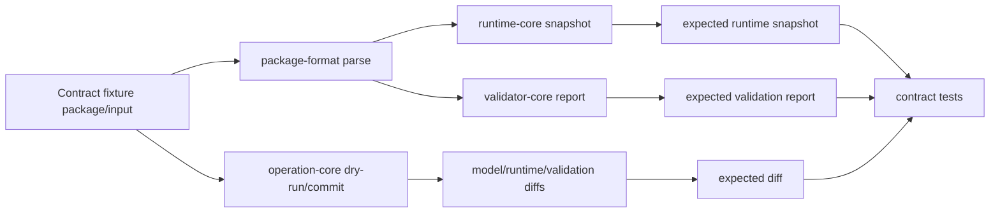

# Fixtures and Contract Tests

> 状態: Draft / Review ready
> 出力先: discussion/design/module-contracts/fixtures-and-contract-tests.md
> 主な読者: fixtures implementer / all module implementers / reviewer
> 主な所有module: `fixtures-contract-tests`
> Source of truth: zod
> 根拠: [module-boundaries.md](module-boundaries.md), [typescript-contracts.md](typescript-contracts.md), [package-file-format-contract.md](package-file-format-contract.md), [operation-contracts.md](operation-contracts.md), [runtime-core-contract.md](runtime-core-contract.md), [validator-contract.md](validator-contract.md), [ai-command-contract.md](ai-command-contract.md)

## Purpose and Scope

This document fixes fixture names, expected artifacts, contract test ownership, and update rules. Its purpose is to prevent parallel implementation agents from creating compatible-looking but incompatible modules.

It covers:

- fixture list,
- expected validation reports,
- expected runtime snapshots,
- expected model/runtime/validation diffs,
- contract test matrix,
- fixture ownership/update rules,
- PSD happy path,
- PSD unsupported layer,
- split PNG fallback,
- Cubism-like two-axis keyform grid,
- parent-child deformer diagonal expression.

It does not create actual fixture files yet.

## Basis Separation

### Repository Facts

- MVP requires AC/scenario traceability down to operation flow, fixtures, and expected output.
- Module contracts are design artifacts; production `.ts` and fixture JSON files are not being created in this task.

### Prior Design Decisions

- PSD primary source asset fixture is required.
- Split PNG fallback fixture remains for compatibility/debug.
- GUI operation log is required expected evidence.
- Expected runtime snapshots and validation reports are contract outputs.

### Assumptions

- Future fixture files live under a path such as `fixtures/contracts/<fixture-id>/`, but the exact implementation path can be decided during scaffolding.
- Expected artifacts are checked semantically with epsilon policies, not by brittle textual equality where ordering is irrelevant.

## Contract Summary

| Contract | Owner module | Consumers | Source of truth | Artifact |
|----------|--------------|-----------|-----------------|----------|
| Fixture manifest | `fixtures-contract-tests` | all tests | zod | manifest JSON |
| Expected validation report | `validator-core` + fixtures | validator, AI, acceptance | zod | report JSON |
| Expected runtime snapshot | `runtime-core` + fixtures | runtime, renderer, AI | zod | snapshot JSON |
| Expected operation log | `operation-core` + fixtures | GUI, AI, acceptance | zod | JSONL |
| Expected diffs | `operation-core` + AI | AI, validator | zod | diff JSON |

## TypeScript / Zod Sketches

## Fixture Manifest Schema

```ts
import { z } from "zod";
import {
  ValidationReportIdSchema,
  RuntimeSnapshotIdSchema,
  OperationIdSchema,
} from "./contracts";

export const ContractFixtureIdSchema = z.enum([
  "minimal-valid-package",
  "psd-import-happy-path",
  "psd-unsupported-layer",
  "split-png-fallback",
  "tutorial-like-authoring",
  "angle-xy-grid-2d",
  "keyform-grid-invalid",
  "keyform-missing-endpoint",
  "parent-child-deformer-diagonal",
  "invalid-mesh-triangle",
  "invalid-missing-texture",
  "invalid-deformer-cycle",
  "invalid-mask-reference",
  "rights-provenance-missing",
  "keyform-grid-overdimension",
  "parent-child-out-of-domain",
  "runtime-load-blocking",
  "ai-invalid-mutation",
  "out-of-range-parameter-dry-run",
  "ai-repair-dry-run",
  "script-generated-minimal",
  "gui-hit-test-deformer",
  "ai-screenshot-deformer-parameter",
]);
export type ContractFixtureId = z.infer<typeof ContractFixtureIdSchema>;

export const ExpectedArtifactSchema = z.object({
  kind: z.enum(["package", "operationLog", "validationReport", "runtimeSnapshot", "modelDiff", "runtimeDiff", "validationDiff", "commandTranscript"]),
  path: z.string(),
  id: z.union([ValidationReportIdSchema, RuntimeSnapshotIdSchema, OperationIdSchema, z.string()]).optional(),
  comparison: z.enum(["exact-json", "semantic-json", "snapshot-epsilon", "jsonl-sequence"]),
});

export const ContractFixtureManifestSchema = z.object({
  schemaVersion: z.literal("contract-fixture-manifest-v1"),
  fixtureId: ContractFixtureIdSchema,
  title: z.string(),
  coversAC: z.array(z.string()),
  coversScenarios: z.array(z.string()),
  modulesBlocked: z.array(z.string()),
  inputArtifacts: z.array(z.string()),
  expectedArtifacts: z.array(ExpectedArtifactSchema),
  updateRule: z.enum(["requires-contract-review", "allowed-with-snapshot-regeneration", "generated"]),
});
export type ContractFixtureManifestDto = z.infer<typeof ContractFixtureManifestSchema>;
```

## Fixture List

| Fixture | Covers | Expected artifacts | Blocks which modules |
|---------|--------|--------------------|----------------------|
| `minimal-valid-package` | package load, runtime non-empty, base validation pass | package, validation report, summary snapshot | package-format, runtime-core, validator-core |
| `psd-import-happy-path` | PSD layer/group import, provenance, drawable/part/texture creation | operation result, model diff, validation report | package-format, operation-core, editor-ui |
| `psd-unsupported-layer` | unsupported smart/text/effect/fill handling | validation report with unsupported diagnostics | package-format, validator-core |
| `split-png-fallback` | fallback source asset path | provenance warning, package diff | package-format, operation-core |
| `tutorial-like-authoring` | GUI authoring MVP flow | operation log, full snapshot, validation report | editor-ui, operation-core, validator-core |
| `angle-xy-grid-2d` | `parameter-grid-2d-v1` Angle X/Y grid | full runtime snapshot, validation report | runtime-core, operation-core |
| `keyform-grid-invalid` | missing/duplicate two-axis grid coordinates | validation fail report | runtime-core, validator-core |
| `keyform-missing-endpoint` | one-axis keyform lacks required endpoint | validation warning/fail report | operation-core, validator-core |
| `parent-child-deformer-diagonal` | parent-child deformer diagonal expression | targeted snapshot, runtime diff | runtime-core, validator-core |
| `invalid-mesh-triangle` | triangle index out of range / degenerate triangle | validation fail report with mesh target | validator-core, runtime-core |
| `invalid-missing-texture` | visible drawable missing texture | validation fail report | package-format, validator-core |
| `invalid-deformer-cycle` | hierarchy cycle | blocking validation report | runtime-core, validator-core |
| `invalid-mask-reference` | missing/invalid mask relation | validation report + snapshot diagnostic | validator-core, runtime-core |
| `rights-provenance-missing` | missing source provenance / blocked rights | validation fail report | package-format, validator-core |
| `keyform-grid-overdimension` | three or more parameters on one target grid | validation needs_review/fail report | operation-core, runtime-core, validator-core |
| `parent-child-out-of-domain` | child vertex outside parent warp domain | warning/needs_review report | runtime-core, validator-core |
| `runtime-load-blocking` | normalized graph cannot produce deterministic snapshot | blocking report | package-format, runtime-core, validator-core |
| `ai-invalid-mutation` | AI dry-run incorrectly mutates package | acceptance fail report | ai-interface, operation-core, validator-core |
| `out-of-range-parameter-dry-run` | AI/API range clamp and strict fail | operation result, snapshot, validation diff | operation-core, runtime-core, validator-core |
| `ai-repair-dry-run` | AI repair proposal and no commit | command transcript, diffs, repair candidate | ai-interface, operation-core, validator-core |
| `script-generated-minimal` | no GUI authoring evidence | acceptance fail / auxiliary status | validator-core, acceptance runner |
| `gui-hit-test-deformer` | semantic canvas hit-test target resolution | hit-test response | editor-ui, ai-interface |
| `ai-screenshot-deformer-parameter` | screenshot-assisted AI still uses semantic APIs | command sequence, dry-run diff | editor-ui, ai-interface |

## Expected Validation Reports

| Fixture | Required checks |
|---------|-----------------|
| `minimal-valid-package` | `pkg.schema.requiredFileMissing` absent, `runtime.drawListEmpty` absent, summary `status=pass`, highest severity <= `info` |
| `psd-import-happy-path` | `rights.provenanceMissing` absent, source asset provenance linked to every created drawable |
| `psd-unsupported-layer` | `asset.psd.unsupportedFeature` with `severity=warning` or `error`, target kind `sourceAsset`, related scenario `SC-IN-003` |
| `rights-provenance-missing` | `rights.provenanceMissing` with `severity=error`, acceptance `status=fail`, target kind `sourceAsset` |
| `keyform-missing-endpoint` | `keyform.missingEndpoint` with `severity=warning`; strict profile `status=fail` when interpolation needs both endpoints |
| `keyform-grid-invalid` | `keyform.grid2dMissingKey` or `keyform.grid2dDuplicateKey` with `severity=error/blocking`, target keyform set ID |
| `invalid-mesh-triangle` | `mesh.triangleIndexOutOfRange` with `severity=blocking`; optional `mesh.degenerateTriangle` warning on second mesh |
| `invalid-missing-texture` | `ref.drawableTextureMissing` with `severity=error`, target visible drawable ID, acceptance `status=fail` |
| `invalid-deformer-cycle` | `deformer.cycle` with `severity=blocking`, target kind `deformer`, no successful topological order |
| `parent-child-out-of-domain` | `deformer.childOutsideWarpDomain` with `severity=warning`, acceptance `status=needs_review` |
| `invalid-mask-reference` | `mask.sourceMissing` or `mask.drawableMissing` with `severity=blocking`, target mask relation ID |
| `keyform-grid-overdimension` | `keyform.tooManyParametersForMvp` with `severity=warning`, acceptance `status=needs_review` |
| `runtime-load-blocking` | `runtime.loadBlocking` with `severity=blocking`; no accepted viewer snapshot |
| `script-generated-minimal` | `evidence.guiOperationLogMissing` with `severity=blocking`, acceptance `status=fail` |
| `ai-invalid-mutation` | `ai.dryRunMutatedPackage` with `severity=blocking`, acceptance `status=fail` |
| `ai-repair-dry-run` | baseline problem check remains linked, repair candidate present, no `ai.dryRunMutatedPackage` |

## Expected Runtime Snapshots

| Fixture | Snapshot detail | Required assertions |
|---------|-----------------|---------------------|
| `minimal-valid-package` | `summary` | non-empty draw list, no blocking diagnostics |
| `tutorial-like-authoring` | `full` | `ParamEyeOpen`, `ParamMouthOpenY`, `ParamHairSway`, `ParamAngleX`, `ParamAngleY` representative inputs change drawable bounds/hash without blocking diagnostics |
| `angle-xy-grid-2d` | `full` | `ParamAngleX/Y` at `(-30,-30)`, `(0,0)`, `(30,30)`, `(-30,30)`, `(30,-30)` produce deterministic vertex hashes under declared epsilon |
| `parent-child-deformer-diagonal` | `targeted` | parent rotation and child warp states are both present; child final bounds differ from parent-only baseline |
| `out-of-range-parameter-dry-run` | `targeted` | raw input recorded, value clamped to range, `runtime.parameterClamped` warning emitted |

## Expected Diffs

| Fixture | Diff types | Required assertions |
|---------|------------|---------------------|
| `psd-import-happy-path` | model diff | source asset, parts, drawables, textures added |
| `moveMeshVertex` slice inside `ai-repair-dry-run` | model/runtime/validation diff | vertex field changes include mesh ID and vertex ID; runtime hash changes; validation has no new `blocking` |
| `out-of-range-parameter-dry-run` | runtime/validation diff | `runtime.parameterClamped` diagnostic added, base package revision unchanged |
| `parent-child-deformer-diagonal` | runtime diff | targeted deformer local state and child drawable bounds/hash change |
| `ai-invalid-mutation` | model/validation diff | package revision changed during dry-run is detected as invalid mutation |

## Contract Test Matrix

| Test | Reads | Asserts |
|------|-------|---------|
| package schema roundtrip | fixture package DTOs | Zod parse and stable ID prefixes |
| load to runtime graph | package fixture | package-format can build normalized graph |
| runtime snapshot compare | package + inputs | snapshot matches expected under epsilon |
| validator expected report | package + profile | check IDs/status/severity match |
| operation dry-run | package + operation request | diffs generated, no revision mutation |
| operation commit | package + operation request | operation log entry and revision update |
| AI command transcript | command sequence | approval boundary, evidence refs, revalidation |
| GUI evidence acceptance | operation log + supplemental refs | GUI log required; screenshots not sufficient |

## Fixture Ownership and Update Rules

| Artifact | Owner | Update rule |
|----------|-------|-------------|
| fixture manifest | fixtures implementer | requires contract review |
| package DTO fixture | package-format implementer | requires contract review |
| expected runtime snapshot | runtime implementer | regenerate only with evaluator version bump or approved epsilon change |
| expected validation report | validator implementer | update only with check registry change |
| operation log fixture | operation/editor implementers | update only with operation schema change |
| AI command transcript | AI implementer | update only with command contract change |

## Diagram Requirements

The fixture flow diagram defines expected artifact production and consumption. Fixture manifests and expected artifact schemas remain the source of truth.

## Fixture -> Expected Artifact Flow



## Traceability

| Requirement | Contract element | Verification |
|-------------|------------------|--------------|
| AC-MVP-003, SC-IN-002 | `psd-import-happy-path` | import operation + package diff |
| AC-MVP-008, SC-PARAM-004 | `angle-xy-grid-2d` | runtime snapshot and validation report |
| AC-MVP-009, SC-DEF-003 | `parent-child-deformer-diagonal` | runtime snapshot/diff |
| AC-MVP-013, SC-MVP-004 | expected validation reports | validator contract tests |
| AC-MVP-014, SC-AGENT-002 | `ai-repair-dry-run` | command transcript + diffs |
| SC-MVP-005 | `script-generated-minimal` | acceptance profile expected fail |

## Verification and Fixtures

This entire document defines the verification strategy. Each fixture must include:

- manifest,
- source/input artifacts,
- operation sequence where relevant,
- expected validation report,
- expected runtime snapshot where runtime-visible,
- expected model/runtime/validation diffs where operation/AI-visible,
- traceability to AC and scenario IDs.

## Open Questions

| Question | Impact | Status |
|----------|--------|--------|
| Exact repository fixture path | can-defer | recommended path is `fixtures/contracts/<fixture-id>/` |
| Whether expected artifacts are checked by Vitest snapshots or custom semantic comparator | can-defer | comparator semantics are fixed by this document |
| Actual source art creation method for rights-clean PSD | can-defer | provenance/rights contract already defines required metadata |

## Handoff Checklist

- [x] Public API / DTO が示されている
- [x] Source of truth が契約ごとに明記されている
- [x] 依存方向、処理順序、状態遷移が必要な箇所に Mermaid 図がある
- [x] AC / scenario traceability がある
- [x] Fixture または expected output がある
- [x] 未決事項が implementation-blocking / can-defer に分かれている

## Review Requirements

Review this file for:

- fixture coverage across happy path, unsupported input, invalid graph, GUI evidence, and AI dry-run,
- expected artifact sufficiency,
- consistency with check IDs, snapshot detail, and operation request contracts.
