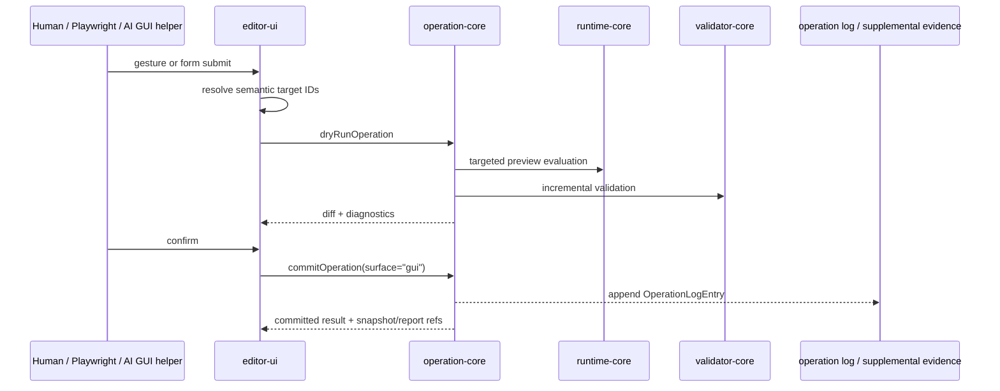
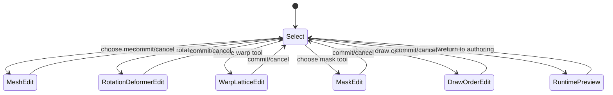

# GUI Operation Contract

> 状態: Draft / Review ready
> 出力先: discussion/design/module-contracts/gui-operation-contract.md
> 主な読者: editor-ui implementer / operation-core implementer / e2e implementer / AI GUI automation reviewer
> 主な所有module: `editor-ui`
> Source of truth: mixed
> 根拠: [../mvp-authoring-runtime/02-gui-editor-screen-spec.md](../mvp-authoring-runtime/02-gui-editor-screen-spec.md), [operation-contracts.md](operation-contracts.md), [ai-command-contract.md](ai-command-contract.md), [../../scenarios/03_MVP_Acceptance_Criteria.md](../../scenarios/03_MVP_Acceptance_Criteria.md)

## Purpose and Scope

This document fixes how GUI Editor operations map to operation-core and how humans, Playwright, and AI helpers observe editor semantic state without bypassing core contracts.

It covers:

- screen/panel state contract,
- Editor semantic state API,
- selection, canvas viewport, and hit-test contract,
- UI event to operation mapping,
- canvas interaction payloads,
- one-axis and two-axis keyform editing surfaces,
- stable test ID / role / label policy,
- GUI authoring evidence,
- operation log as required evidence,
- Playwright trace / screenshot / session metadata as supplemental evidence,
- Editor-only vs runtime-visible state.

It does not define visual styling or a complete component hierarchy.

## Basis Separation

### Repository Facts

- MVP requires GUI Editor as authoring entry point.
- `SC-MVP-001` and `SC-MVP-002` require import, part/drawable organization, mesh, mask, parameter, keyform, deformer, Angle X/Y, preview, save.
- `SC-MVP-005` requires GUI authoring evidence to prevent script-only packages from being accepted as MVP.

### Prior Design Decisions

- GUI operations must pass through operation-core.
- Operation log is required GUI authoring evidence.
- Playwright trace, screenshot, video, and session metadata are supplemental.
- Canvas pixels alone are not a reliable target selector for AI. Semantic state and hit-test APIs must return stable IDs.

### Assumptions

- The first implementation is a Web app with accessible roles/labels and stable `data-testid` for critical controls.
- Editor preview uses runtime-core snapshots plus editor-only overlays.

## Contract Summary

| Contract | Owner module | Consumers | Source of truth | Artifact |
|----------|--------------|-----------|-----------------|----------|
| Editor semantic state | `editor-ui` | AI, Playwright, tests | zod | read DTO |
| Selection/viewport/hit-test | `editor-ui` | AI, Playwright, operation payload builders | zod | read DTO |
| UI event -> operation mapping | `editor-ui` + `operation-core` | GUI implementer | table | behavior |
| GUI operation evidence | `editor-ui` + `operation-core` | validator, acceptance runner | zod + operation log | evidence |
| Editor-only state | `editor-ui` | package editor state, AI observe | typescript/zod boundary | UI state |

## TypeScript / Zod Sketches

## Screen / Panel State Contract

| UI surface | State it owns | Runtime-visible? |
|------------|---------------|------------------|
| App bar | package name, dirty flag, save/reload, mode, validation status | no, except package revision display |
| Project tree | selected/locked/editor-hidden nodes, expanded tree | no |
| Canvas | viewport, active canvas mode, hover target, overlays | no |
| Inspector | selected target details and editable form draft | mixed; commits through operation-core |
| Parameter/keyform panel | parameter current preview, keyform editing draft | current preview no; parameter/keyform definitions yes after commit |
| Diagnostics drawer | report/check selection, jump target, repair candidate refs | report artifacts yes |
| Viewer tab | saved package load state, runtime snapshot | runtime snapshot yes |
| AI/report tab | dry-run diff, repair candidate, approval state | artifacts yes, approval UI no |

## Editor Semantic State Contract

```ts
import { z } from "zod";
import {
  DrawableIdSchema,
  DeformerIdSchema,
  MeshIdSchema,
  ParameterIdSchema,
  OperationIdSchema,
  RuntimeSnapshotIdSchema,
  ValidationReportIdSchema,
  TargetRefSchema,
  Vec2Schema,
  RectSchema,
} from "./contracts";

export const EditorModeSchema = z.enum([
  "select",
  "meshEdit",
  "rotationDeformerEdit",
  "warpLatticeEdit",
  "maskEdit",
  "drawOrderEdit",
  "runtimePreview",
]);

export const SelectionItemSchema = TargetRefSchema.extend({
  displayName: z.string(),
  editable: z.boolean().default(true),
});

export const CanvasViewportSchema = z.object({
  canvasRectCssPx: RectSchema,
  modelBounds: RectSchema,
  zoom: z.number().positive(),
  pan: Vec2Schema,
  coordinateSystem: z.literal("canvas-y-down-v1"),
});

export const EditorSemanticStateSchema = z.object({
  schemaVersion: z.literal("editor-semantic-state-v1"),
  packageRevision: z.number().int().nonnegative(),
  authoringRevision: z.number().int().nonnegative(),
  mode: EditorModeSchema,
  activeToolId: z.string(),
  selection: z.array(SelectionItemSchema),
  lockedIds: z.array(z.string()).default([]),
  editorHiddenIds: z.array(z.string()).default([]),
  currentPreviewParameterValues: z.record(ParameterIdSchema, z.number()).default({}),
  canvasViewport: CanvasViewportSchema,
  lastOperationId: OperationIdSchema.optional(),
  latestRuntimeSnapshotId: RuntimeSnapshotIdSchema.optional(),
  latestValidationReportId: ValidationReportIdSchema.optional(),
});
export type EditorSemanticStateDto = z.infer<typeof EditorSemanticStateSchema>;
```

## Selection / Canvas Viewport / Hit-test Contract

```ts
export const HitTestRequestSchema = z.object({
  schemaVersion: z.literal("canvas-hit-test-request-v1"),
  viewport: CanvasViewportSchema.optional(),
  pointCssPx: Vec2Schema,
  includeLocked: z.boolean().default(false),
  includeEditorHidden: z.boolean().default(false),
  modes: z.array(EditorModeSchema).default(["select"]),
});

export const HitTestResultSchema = z.object({
  schemaVersion: z.literal("canvas-hit-test-result-v1"),
  hits: z.array(z.object({
    target: SelectionItemSchema,
    distanceCssPx: z.number().nonnegative(),
    zOrder: z.number().int(),
    confidence: z.enum(["exact", "near", "ambiguous"]),
    operationTargets: z.array(TargetRefSchema).default([]),
  })),
  diagnostics: z.array(z.string()).default([]),
});
export type HitTestResultDto = z.infer<typeof HitTestResultSchema>;
```

AI or Playwright may use screenshots for visual context, but must use `getEditorState`, `getSelection`, `getCanvasViewport`, and `hitTestCanvas` to obtain stable IDs before operation-core mutation.

## UI Event -> Operation Mapping

| UI surface | User action | Operation | Evidence | Test id policy |
|------------|-------------|-----------|----------|----------------|
| Import panel | import PSD | `importPsdSourceAsset` | operation log + import diagnostics | `import.psd.open`, `import.psd.confirm` |
| Import panel | import split PNG | `importSplitPngSourceAsset` | operation log + fallback warning | `import.splitPng.open` |
| Project tree | create drawable from source layer | `createDrawable` | operation log | `project.sourceLayer.<id>.createDrawable` |
| Mesh mode canvas | generate/edit mesh | `generateMesh`, `moveMeshVertex` | operation log + targeted snapshot | `canvas.mesh.vertex.<id>` |
| Parameter panel | create parameter | `createParameter` | operation log | `parameter.create`, `parameter.row.<id>` |
| Keyform panel | add one-axis keyform | `addKeyform` | operation log + preview snapshot | `keyform.add.1d` |
| Keyform grid panel | add Angle X/Y grid | `addKeyformGrid2d` | operation log + grid snapshot | `keyform.grid2d.add` |
| Deformer panel | create rotation deformer | `createRotation2dDeformer` | operation log | `deformer.rotation.create` |
| Deformer panel | create warp lattice | `createWarpLattice2dDeformer` | operation log | `deformer.warp.create` |
| Project/deformer tree | bind parent/child | `bindDeformerChild` | operation log + hierarchy diff | `deformer.tree.bind` |
| Mask panel | set mask relation | `setMaskRelation` | operation log + validation diagnostics | `mask.setRelation` |
| Draw order panel | reorder drawables | `setDrawOrder` | operation log + snapshot | `drawOrder.reorder` |
| Inspector | runtime visibility toggle | `setRuntimeVisibility` | operation log | `inspector.runtimeVisibility` |
| Inspector | rights/provenance edit | `setRightsMetadata` | operation log | `rights.edit` |

Selection, lock, editor hide, active tool, and viewport changes are editor state events. They may be recorded in session metadata but are not runtime-visible mutations unless committed through an explicit operation affecting package DTOs.

## Canvas Interaction Payloads

| Mode | Canvas gesture | Payload builder requirement |
|------|----------------|-----------------------------|
| `meshEdit` | drag vertex/control selection | resolves `MeshId` and `VertexId[]` before `moveMeshVertex` |
| `rotationDeformerEdit` | move pivot/handle | resolves `DeformerId`; payload stores pivot/rest angle in model coordinates |
| `warpLatticeEdit` | drag lattice control point | resolves `DeformerId` and control point stable ID |
| `maskEdit` | click mask source/target | resolves drawable IDs through hit-test and tree selection |
| `drawOrderEdit` | reorder list or canvas labels | resolves drawable IDs; numeric draw order is explicit |
| `runtimePreview` | parameter slider | preview-only until keyform or parameter definition is committed |

## 1-axis and 2-axis Keyform Grid Editing Surface

Angle X/Y editing is a first-class `parameter-grid-2d-v1` surface:

- The UI must expose the two parameter IDs, typically `ParamAngleX` and `ParamAngleY` aliases.
- The grid must write through `addKeyformGrid2d`.
- Grid coordinates must be stored as parameter values, not screen cells.
- Missing diagonal/corner keys must be visible as validator diagnostics.
- Parent/child deformer hierarchy remains a valid complementary approach for diagonal expression.

## Stable Test ID / Role / Label Policy

| UI kind | Rule |
|---------|------|
| command buttons | stable `data-testid` using `<surface>.<command>` |
| repeated model rows | include stable ID suffix when safe: `parameter.row.param_x` |
| canvas internal targets | expose semantic IDs through hit-test/overlay metadata, not DOM-per-vertex requirement |
| accessible names | human-readable labels may change but tests should prefer role + stable ID where model-specific |
| screenshots | supplemental only; cannot be sole target identification |

## GUI Authoring Evidence

```ts
export const GuiOperationEvidenceSchema = z.object({
  schemaVersion: z.literal("gui-operation-evidence-v1"),
  operationId: OperationIdSchema,
  source: z.literal("gui"),
  uiSurface: z.string(),
  toolId: z.string(),
  testId: z.string().optional(),
  pointerGesture: z.object({
    kind: z.enum(["click", "drag", "keyboard", "formSubmit", "menuCommand"]),
    startCssPx: Vec2Schema.optional(),
    endCssPx: Vec2Schema.optional(),
  }).optional(),
  semanticTargets: z.array(TargetRefSchema),
  supplementalEvidenceRefs: z.array(z.string()).default([]),
});
export type GuiOperationEvidenceDto = z.infer<typeof GuiOperationEvidenceSchema>;
```

Required evidence:

- committed `OperationLogEntryDto` with `surface: "gui"`,
- target IDs in operation log,
- validation report and runtime snapshot when the operation affects runtime behavior.

Supplemental evidence:

- Playwright trace,
- screenshot,
- video,
- browser/session metadata,
- raw pointer samples.

Supplemental evidence cannot replace operation log.

## Diagram Requirements

The following diagrams show event-to-operation ordering and editor mode transitions. Operation DTOs and evidence schemas remain the source of truth.

## UI Event -> Operation Core -> Preview Sequence



## Editor Mode State Diagram



## Editor-only vs Runtime-visible State

| State | Editor-only | Runtime-visible | Contract owner |
|-------|-------------|-----------------|----------------|
| selection | yes | no | `editor-ui` |
| lock | yes | no | `editor-ui` / `editor-state.json` |
| editor hide | yes | no | `editor-ui` / `editor-state.json` |
| active tool | yes | no | `editor-ui` |
| drawable opacity | no | yes | package/operation/runtime |
| runtime visibility | no | yes | package/operation/runtime |
| draw order | no | yes | package/operation/runtime |
| mesh rest vertices | no | yes | package/runtime |
| deformer graph | no | yes | package/runtime |
| parameter current preview | mixed temporary | not package default | editor preview/runtime input |

## Traceability

| Requirement | Contract element | Verification |
|-------------|------------------|--------------|
| AC-MVP-001, SC-MVP-001 | GUI UI event mapping + operation log | `tutorial-like-authoring` |
| AC-MVP-006 | editor-only lock/hide/select separation | GUI state fixture |
| AC-MVP-008, SC-PARAM-002 | parameter/keyform panel mappings | operation log + runtime snapshot |
| AC-MVP-010, SC-MVP-002, SC-PARAM-004 | `parameter-grid-2d-v1` GUI surface | `angle-xy-grid-2d` |
| AC-MVP-014, SC-AI-002 | semantic state + hit-test APIs | AI screenshot/deformer parameter scenario |
| SC-MVP-005 | `evidence.guiOperationLogMissing` prevention | script-only fixture |

## Verification and Fixtures

| Fixture / Test | Purpose | Expected artifact |
|----------------|---------|-------------------|
| `tutorial-like-authoring` | full GUI operation path evidence | operation log, validation report, snapshots |
| `angle-xy-grid-2d` | grid UI maps to `addKeyformGrid2d` | operation entry + expected snapshot |
| `gui-hit-test-deformer` | hit-test returns `DeformerId` and operation targets | hit-test response fixture |
| `script-generated-minimal` | no GUI log is acceptance fail | acceptance report |
| `ai-screenshot-deformer-parameter` | screenshot assisted AI uses semantic APIs before operation | command transcript + dry-run diff |

## Open Questions

| Question | Impact | Status |
|----------|--------|--------|
| Exact visual layout and component library | can-defer | contract fixes behavior and semantic APIs |
| Raw pointer sample retention duration | can-defer | supplemental evidence only |
| Whether mask preview shows alpha composition in MVP | can-defer | relation overlay plus runtime snapshot is sufficient for contract |

## Handoff Checklist

- [x] Public API / DTO が示されている
- [x] Source of truth が契約ごとに明記されている
- [x] 依存方向、処理順序、状態遷移が必要な箇所に Mermaid 図がある
- [x] AC / scenario traceability がある
- [x] Fixture または expected output がある
- [x] 未決事項が implementation-blocking / can-defer に分かれている

## Review Requirements

Review this file for:

- no GUI mutation bypassing operation-core,
- semantic state coverage for AI/Playwright observation,
- operation log as required GUI authoring evidence,
- Angle X/Y grid UI mapping to `parameter-grid-2d-v1`.
