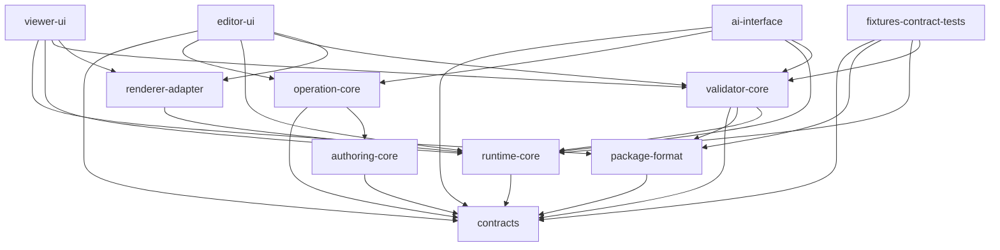
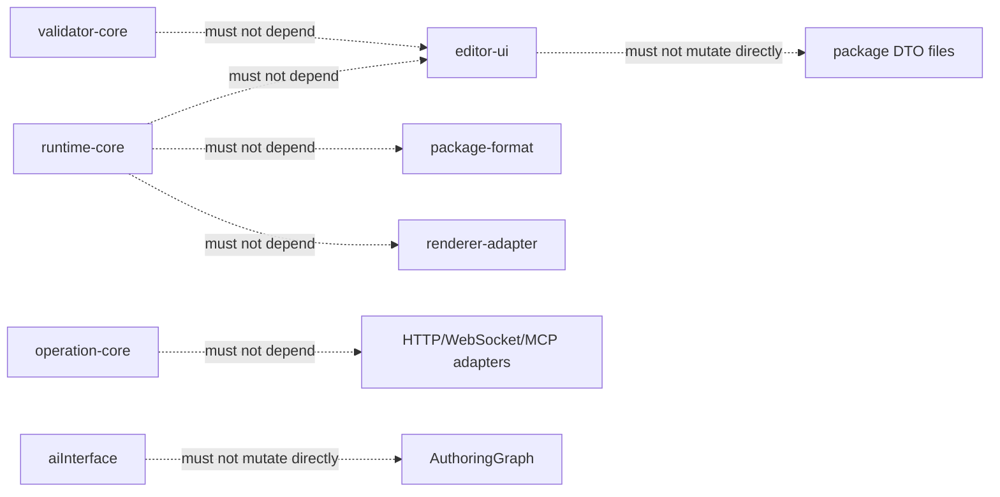

# Module Boundaries

> 状態: Draft / Review ready
> 出力先: discussion/design/module-contracts/module-boundaries.md
> 主な読者: 後続実装エージェント / reviewer
> 主な所有module: cross-cutting
> Source of truth: mixed
> 根拠: [../module-contract-design-goal.md](../module-contract-design-goal.md), [../module-contract-design-decisions.md](../module-contract-design-decisions.md), [../mvp-authoring-runtime/_map.md](../mvp-authoring-runtime/_map.md), [../../acceptance-criteria/03_MVP_Acceptance_Criteria.md](../../acceptance-criteria/03_MVP_Acceptance_Criteria.md), [../../scenarios/03_MVP_Acceptance_Criteria.md](../../scenarios/03_MVP_Acceptance_Criteria.md)

## Purpose and Scope

This document fixes the MVP module boundaries for a TypeScript + Web implementation before any `.ts` production files are created.

It blocks implementation confusion for:

- `contracts`, `package-format`, `authoring-core`, `operation-core`, `runtime-core`, `validator-core`, `renderer-adapter`, `editor-ui`, `viewer-ui`, `ai-interface`, and `fixtures-contract-tests`.
- ownership of authoring state, runtime-visible state, editor-only state, operation logs, validation reports, runtime snapshots, and fixture expected outputs.
- forbidden dependencies that would make GUI, AI, runtime, and validator implementations disagree.

MVP scope includes GUI authoring, PSD primary import, split PNG fallback import, Open Model Package save/reload, runtime evaluation, validator reports, AI dry-run/commit contracts, and contract fixtures. It excludes Cubism `.cmo3` reconstruction, `.moc3` compatibility export, animation timeline, full physics, and production renderer optimization.

## Basis Separation

### Repository Facts

- `discussion/design/module-contracts/` currently contains the module contract design outputs for the next implementation phase.
- MVP AC requires GUI Editor as the authoring entry point, Open Model Package save/reload, Runtime / Viewer evaluation, Validator structured report, and AI Agent structured operations.
- The existing MVP authoring-runtime draft separates dirty authoring graph, normalized runtime graph, runtime snapshot, validation report, and AI dry-run diff.

### Prior Design Decisions

- External boundary DTOs use Zod as source of truth. Internal domain state uses TypeScript `type` / `interface` as source of truth.
- PSD import is the primary source asset flow. Split PNG import is fallback / debug / compatibility.
- Angle X / Y uses Cubism Editor-aligned `parameter-grid-2d-v1`, one-axis keyforms, and parent-before-child deformer hierarchy.
- GUI authoring evidence requires operation log entries. Playwright traces, screenshots, video, and session metadata are supplemental evidence.
- AI API contracts are transport-independent and grouped into Editor semantic state API, Operation command API, and Runtime / Validator read API.

### Assumptions

- Initial implementation can use an in-process command bus. HTTP JSON, WebSocket, and MCP adapters must not define the semantic contract.
- Package directory names and future npm package names may change, but module responsibility and public contracts in this document should not change without updating traceability and fixtures.

## Contract Summary

| Contract | Owner module | Consumers | Source of truth | Artifact |
|----------|--------------|-----------|-----------------|----------|
| Shared branded IDs and DTO vocabulary | `contracts` | all modules | mixed | TS types, Zod schemas |
| Open Model Package parse/load/write | `package-format` | `editor-ui`, `viewer-ui`, `validator-core`, `ai-interface` | zod | package DTOs |
| Dirty authoring graph | `authoring-core` | `operation-core`, `editor-ui`, adapter to `runtime-core` | typescript | internal state |
| Mutating operation boundary | `operation-core` | `editor-ui`, `ai-interface`, migration, repair | zod | request/response/log |
| Deterministic evaluation boundary | `runtime-core` | preview, viewer, validator, AI dry-run | mixed | TS API, snapshot DTO |
| Validation check registry/report | `validator-core` | editor warnings, viewer diagnostics, AI, acceptance runner | zod | report DTO |
| Runtime drawing input | `renderer-adapter` | editor preview, viewer UI | typescript | renderer input |
| GUI authoring surface | `editor-ui` | human author, Playwright, AI GUI helper | mixed | UI state, evidence DTO |
| Saved package inspection surface | `viewer-ui` | human reviewer, AI observer | mixed | viewer state |
| AI command boundary | `ai-interface` | agents, automation, tests | zod | command DTOs |
| Contract fixtures | `fixtures-contract-tests` | every implementation slice | zod | fixture manifests, expected artifacts |

## Module List

| Module | Owns | Must not know | Public API | Primary consumers |
|--------|------|---------------|------------|-------------------|
| `contracts` | branded IDs, DTO schemas, common enums, diagnostic/diff vocabulary | concrete file IO, DOM, renderer handles | `ids`, DTO schemas, diff/report/snapshot types | all |
| `package-format` | package file layout, DTO parsing, schema validation, package hash, PSD/split PNG provenance mapping | dirty editor UI state beyond `editor-state.json`, renderer internals | `readPackage`, `writePackage`, `parsePackageDto`, `normalizePackage` | editor, viewer, validator, AI |
| `authoring-core` | `AuthoringGraph`, editor-visible model state, dirty revision, undo model state | DOM, HTTP, raw PSD parser, renderer handles | `createAuthoringSession`, `applyCommittedOperation`, `toRuntimeGraph` | editor, operation |
| `operation-core` | operation registry, preconditions, dry-run, commit, undo/redo, operation log entries | canvas event details, transport details, renderer handles | `dryRunOperation`, `commitOperation`, `undoOperation`, `redoOperation` | editor, AI, migration |
| `runtime-core` | `NormalizedRuntimeGraph`, parameter evaluation, keyform/deformer evaluation, snapshots | package file IO, editor selection, operation approval, DOM | `evaluateRuntime`, `compareRuntimeSnapshots` | preview, viewer, validator, AI |
| `validator-core` | check registry, profiles, validation report, repair candidate contracts | GUI workflow replacement, renderer drawing, transport details | `validatePackage`, `validateAuthoringGraph`, `validateRuntimeSnapshot` | editor, viewer, AI, acceptance |
| `renderer-adapter` | canvas/WebGL binding, texture handles, viewport presentation | package schema, operation mutation, validator policy | `renderSnapshot`, `createRendererBackend` | editor preview, viewer |
| `editor-ui` | panels, canvas modes, selection, lock, editor hide, active tool, stable test IDs, GUI evidence | package mutation bypassing operation-core, runtime internals | UI event handlers, semantic state API | human, Playwright, AI observe |
| `viewer-ui` | saved package load UI, parameter sliders, runtime snapshot inspection | authoring edits, selection, operation commit | viewer load/inspect state | human, AI observe |
| `ai-interface` | agent sessions, command schemas, approval boundary, dry-run orchestration, transport adapters | direct model mutation without operation-core | `executeAiCommand`, adapter bindings | AI agents, automation |
| `fixtures-contract-tests` | fixture manifest, sample packages, expected reports/snapshots/diffs | production mutation code | fixture registry, expected artifact loaders | all test suites |

## Diagram Requirements

The following diagrams define dependency direction and forbidden dependency classes. The tables and TypeScript sketch remain the source of truth when diagram wording is abbreviated.

## Dependency Direction

The dependency graph is intentionally one-way. UI and AI layers call core modules; core modules do not call UI or transport adapters.



Forbidden dependencies:



## Owned State / Forbidden State

| State | Owner | Readable by | Forbidden owner |
|-------|-------|-------------|-----------------|
| package DTO files | `package-format` | validator, viewer, AI, editor save/load | `runtime-core`, renderer |
| dirty authoring graph | `authoring-core` | operation-core, editor UI semantic state | runtime-core, viewer |
| selection / lock / editor hide | `editor-ui` + authoring session | AI semantic read, editor tests | runtime-core, viewer runtime state |
| runtime-visible graph | `runtime-core` input adapter result | runtime, validator, AI | editor UI direct mutation |
| operation log | `operation-core` | validator, AI, acceptance runner | renderer, runtime-core |
| validation report | `validator-core` | editor, viewer, AI, acceptance runner | operation-core mutation logic |
| runtime snapshot | `runtime-core` | renderer, viewer, validator, AI | package-format source files |
| supplemental GUI evidence | `editor-ui` / e2e harness | acceptance runner | core contract source of truth |

## TypeScript / Zod Sketches

### Public API Overview

```ts
import { z } from "zod";

export type SourceOfTruth = "zod" | "typescript" | "generated-json-schema" | "mixed";

export const ModuleIdSchema = z.enum([
  "contracts",
  "package-format",
  "authoring-core",
  "operation-core",
  "runtime-core",
  "validator-core",
  "renderer-adapter",
  "editor-ui",
  "viewer-ui",
  "ai-interface",
  "fixtures-contract-tests",
]);
export type ModuleId = z.infer<typeof ModuleIdSchema>;

export interface ModuleBoundary {
  readonly moduleId: ModuleId;
  readonly owns: readonly string[];
  readonly publicApis: readonly string[];
  readonly allowedDependencies: readonly ModuleId[];
  readonly forbiddenDependencies: readonly ModuleId[];
  readonly sourceOfTruth: SourceOfTruth;
}
```

Source-of-truth rule:

| Boundary | Source of truth |
|----------|-----------------|
| Module dependency and forbidden dependency tables | this document + TypeScript `ModuleBoundary` sketch |
| External request/response/log/report/snapshot DTOs | Zod schemas in downstream contract documents |
| Internal graph/evaluator/UI view state | TypeScript interfaces in downstream contract documents |

## Subagent Implementation Ownership

| Implementer slice | Owned files / modules | May read | Must not edit |
|-------------------|-----------------------|----------|---------------|
| Contracts implementer | `packages/contracts/**` | all module-contract docs | UI/runtime implementation |
| Package implementer | `packages/package-format/**` | contracts, fixtures, package contract | renderer, editor panels |
| Operation implementer | `packages/operation-core/**` | contracts, authoring-core docs, operation contract | AI transport adapters, renderer |
| Runtime implementer | `packages/runtime-core/**` | contracts, runtime contract, fixtures | package IO, editor state |
| Validator implementer | `packages/validator-core/**` | contracts, validator, runtime, fixtures | editor UI mutation |
| GUI implementer | `apps/editor/**` | GUI/operation/AI contracts | operation-core internals except public APIs |
| AI interface implementer | `packages/ai-interface/**` | AI/operation/runtime/validator contracts | operation internals, direct package mutation |
| Fixtures implementer | `fixtures/contracts/**`, expected artifacts | all contracts | production core logic |

## Traceability

| Requirement | Contract element | Verification |
|-------------|------------------|--------------|
| AC-MVP-001, SC-MVP-001, SC-MVP-005 | `editor-ui -> operation-core -> operation log` boundary | `tutorial-like-authoring` fixture requires GUI operation log |
| AC-MVP-003, AC-IN-001, SC-IN-002, SC-IN-003 | `package-format` + PSD importer boundary | `psd-import-happy-path`, `psd-unsupported-layer` |
| AC-MVP-008, AC-PARAM-005, SC-PARAM-004 | `runtime-core` owns `parameter-grid-2d-v1` evaluation | `angle-xy-grid-2d` expected snapshot |
| AC-MVP-009, AC-DEF-004, SC-DEF-003 | `runtime-core` parent-before-child evaluation | `parent-child-deformer-diagonal` expected snapshot |
| AC-MVP-013, AC-VALIDATOR-005, SC-VALIDATOR-005 | `validator-core` report DTO | expected validation reports |
| AC-MVP-014, AC-AGENT-002, SC-AGENT-002, SC-AI-002 | `ai-interface` calls operation-core, runtime-core, validator-core | `ai-repair-dry-run` expected diff |

## Verification and Fixtures

| Fixture / Test | Purpose | Expected artifact |
|----------------|---------|-------------------|
| `minimal-valid-package` | proves package/runtime/validator boundary can meet on stable IDs | validation report, summary snapshot |
| `psd-import-happy-path` | proves PSD source asset boundary and provenance | operation diff, validation report |
| `psd-unsupported-layer` | proves unsupported PSD features do not leak into runtime-core | diagnostic report |
| `tutorial-like-authoring` | proves GUI operations cover MVP authoring flow | operation log, full snapshot, validation report |
| `angle-xy-grid-2d` | proves `parameter-grid-2d-v1` boundary | targeted/full runtime snapshot |
| `parent-child-deformer-diagonal` | proves parent-before-child hierarchy | runtime snapshot and runtime diff |
| `ai-repair-dry-run` | proves AI does not bypass operation-core | model/runtime/validation diff |

## Open Questions

| Question | Impact | Status |
|----------|--------|--------|
| Exact npm package names and import paths | can-defer | keep module IDs stable; decide during implementation scaffolding |
| Whether `acceptance-runner` becomes a separate package or validator profile | can-defer | contract treats it as `validator-core` profile plus fixture consumer |
| Whether HTTP JSON adapter is implemented in MVP | can-defer | semantic contract is transport-independent; in-process adapter is enough for first implementation |

## Handoff Checklist

- [x] Public API / DTO が示されている
- [x] Source of truth が契約ごとに明記されている
- [x] 依存方向、処理順序、状態遷移が必要な箇所に Mermaid 図がある
- [x] AC / scenario traceability がある
- [x] Fixture または expected output がある
- [x] 未決事項が implementation-blocking / can-defer に分かれている

## Review Requirements

Review this file for:

- AC / Scenario Traceability: every module boundary must support at least one MVP AC or be clearly supporting infrastructure.
- TypeScript / Zod Contract Consistency: no core module should import UI, renderer, transport, or package IO against the dependency graph.
- Fixture / Verification: every high-risk boundary must be covered by a named fixture and expected artifact.
