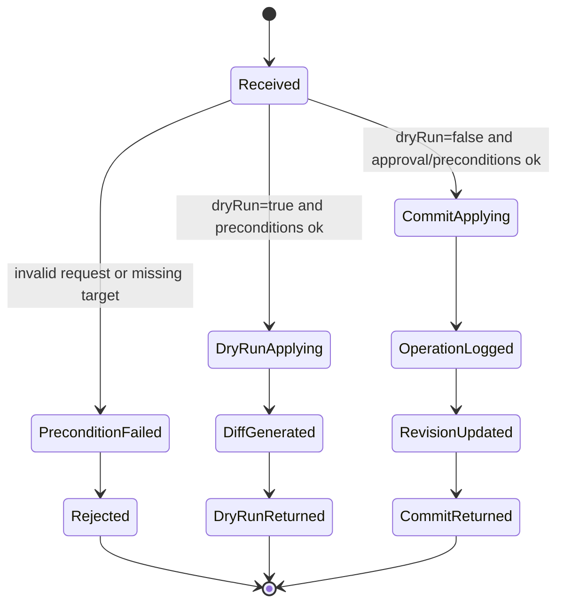
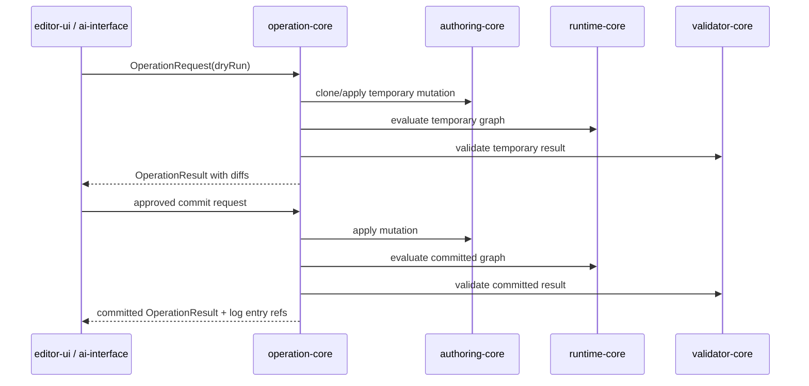

# Operation Contracts

> 状態: Draft / Review ready
> 出力先: discussion/design/module-contracts/operation-contracts.md
> 主な読者: operation-core implementer / editor-ui implementer / ai-interface implementer
> 主な所有module: `operation-core`
> Source of truth: zod
> 根拠: [module-boundaries.md](module-boundaries.md), [package-file-format-contract.md](package-file-format-contract.md), [../mvp-authoring-runtime/00-mvp-vertical-slice-architecture.md](../mvp-authoring-runtime/00-mvp-vertical-slice-architecture.md), [../mvp-authoring-runtime/05-ai-agent-interface-design.md](../mvp-authoring-runtime/05-ai-agent-interface-design.md)

## Purpose and Scope

This document fixes the mutating operation contract shared by GUI, AI structured commands, migration, import, and validator repair proposals.

It covers:

- operation catalog,
- common request/response envelope,
- preconditions,
- dry-run vs commit behavior,
- operation log entry,
- undo/redo policy,
- model/runtime/validation diff outputs,
- required layered character PSD and split PNG import operations,
- keyform, rig control, Minimum Open Dynamics v1, mask, draw order, and rights operations.

It does not implement mutation algorithms or UI event handlers.

## Basis Separation

### Repository Facts

- MVP requires GUI authoring operations to be evidence via operation log.
- AI dry-run must not overwrite package files before approval.
- Validator repair candidates must be proposals until explicitly committed.

### Prior Design Decisions

- GUI and AI edits must pass through operation-core.
- Operation log is the required GUI authoring evidence.
- Operation requests/responses/log entries are external boundary DTOs, so Zod is the source of truth.

### Assumptions

- Operation-core works against an `AuthoringGraph` session and returns diffs plus generated report/snapshot references.
- Drag gestures may be compressed into a single committed operation while raw samples remain supplemental GUI evidence.

## Contract Summary

| Contract | Owner module | Consumers | Source of truth | Artifact |
|----------|--------------|-----------|-----------------|----------|
| Operation request/response | `operation-core` | editor, AI, migration | zod | DTO |
| Operation log entry | `operation-core` | validator, AI, acceptance runner | zod | JSONL entry |
| Operation catalog | `operation-core` | editor, AI, tests | zod + table | operation schemas |
| Dry-run/commit lifecycle | `operation-core` | AI, GUI preview, validator | zod + Mermaid | state/sequence |
| Undo/redo policy | `operation-core` | editor UI | typescript internal, log DTO external | API |

## Operation Catalog

| Operation | Payload | Preconditions | Produces | Related AC / scenario |
|-----------|---------|---------------|----------|-----------------------|
| `importPsdSourceAsset` | PSD file ref, layered character import profile, rights/provenance | package open, source file readable | source asset diff, drawable/part/texture candidates, diagnostics | AC-MVP-003, SC-IN-002 |
| `importSplitPngSourceAsset` | split PNG manifest, placement metadata | package open, files readable | source asset diff, drawable candidates, fallback warning | AC-MVP-003 |
| `createDrawable` | source layer/texture/part refs | source asset exists | drawable + mesh placeholder diff | AC-MVP-004 |
| `generateMesh` | drawable ID, method, density hints | drawable/texture exists | mesh diff, validation diagnostics | AC-MVP-005 |
| `moveMeshVertex` | mesh ID, vertex IDs, delta or absolute positions, keyform scope | mesh exists, vertex IDs exist | model diff, runtime diff | SC-AGENT-002 |
| `createParameter` | display name, range, semantic role, private `projectPresetAlias` | ID unique, min <= max, default in range | parameter diff | AC-MVP-008 |
| `addKeyform` | target, parameter, key value, target state | parameter and target exist | keyform diff, runtime diff | SC-PARAM-002 |
| `addKeyformGrid2d` | target, two parameters, grid coordinates, key states | exactly two parameters; target exists | `parameter-grid-2d-v1` keyform diff | SC-PARAM-004 |
| `createDynamicsGroup` | display name, solver kind, reset policy, initial settings | package open; solver kind is `scalarDampedFollowV1` | dynamics group diff | SC-DYN-001 |
| `updateDynamicsGroup` | group metadata, enabled flag, reset policy | dynamics group exists | dynamics group diff | SC-DYN-001 |
| `deleteDynamicsGroup` | dynamics group ID | group exists; no required output-only dependency remains | dynamics group diff | SC-DYN-001 |
| `bindDynamicsDriver` | group ID, authoredInput parameter, scale/offset/invert | parameter exists and `valueSource="authoredInput"` | dynamics driver diff | SC-DYN-001 |
| `bindDynamicsOutput` | group ID, computedDynamics parameter, range/clamp | parameter exists and `valueSource="computedDynamics"` | dynamics output diff | SC-DYN-001 |
| `setDynamicsSettings` | stiffness, damping, amplitude/velocity limits | group exists; settings finite and stable | dynamics settings diff | SC-DYN-003 |
| `resetDynamicsPreviewState` | group IDs or all groups, reason | preview/runtime session exists | runtime state reset evidence, no package mutation | SC-DYN-002 |
| `runDynamicsPreviewSequence` | Runtime sequence frames, initial RuntimeStateDto or state ref, fixed timestep for initial state creation, detail | runtime graph exists; no package mutation | snapshot sequence + final RuntimeStateDto/state ref + runtime diff evidence | SC-DYN-002 |
| `createRotation2dRigControl` | part, children, pivot/rest transform | children exist and not cyclic | rig control diff | SC-DEF-002 |
| `createWarpLattice2dRigControl` | part, children, domain, rows/cols | rows/cols valid, children exist | rig control diff | SC-DEF-001 |
| `bindRigControlChild` | parent rig control, child drawable/rig control | no cycle | hierarchy diff | SC-DEF-003 |
| `setMaskRelation` | mask sources, targets | drawable refs exist | mask diff, validation diagnostics | AC-MVP-007 |
| `setDrawOrder` | drawable order changes | drawable refs exist | draw order diff | AC-MVP-006 |
| `setRuntimeVisibility` | drawable/part visibility | target exists | drawable/part diff | AC-MVP-006 |
| `setRightsMetadata` | asset/rights/provenance fields | asset exists | rights/provenance diff | AC-MVP-002 |

## TypeScript / Zod Sketches

```ts
import { z } from "zod";
import {
  ActorSchema,
  DiagnosticSchema,
  ModelDiffSchema,
  RuntimeDiffSchema,
  RuntimeResetReasonSchema,
  RuntimeStateDtoSchema,
  RuntimeSequenceFrameSchema,
  ValidationDiffSchema,
  OperationIdSchema,
  TransactionIdSchema,
  RuntimeSnapshotIdSchema,
  ValidationReportIdSchema,
  SourceAssetIdSchema,
  DrawableIdSchema,
  MeshIdSchema,
  VertexIdSchema,
  ParameterIdSchema,
  RigControlIdSchema,
  DynamicsGroupIdSchema,
  PartIdSchema,
  MaskRelationIdSchema,
  ProvenanceIdSchema,
  SurfaceSchema,
  TargetRefSchema,
  Vec2Schema,
  RectSchema,
} from "./contracts";

export const OperationTypeSchema = z.enum([
  "importPsdSourceAsset",
  "importSplitPngSourceAsset",
  "createDrawable",
  "generateMesh",
  "moveMeshVertex",
  "createParameter",
  "addKeyform",
  "addKeyformGrid2d",
  "createDynamicsGroup",
  "updateDynamicsGroup",
  "deleteDynamicsGroup",
  "bindDynamicsDriver",
  "bindDynamicsOutput",
  "setDynamicsSettings",
  "resetDynamicsPreviewState",
  "runDynamicsPreviewSequence",
  "createRotation2dRigControl",
  "createWarpLattice2dRigControl",
  "bindRigControlChild",
  "setMaskRelation",
  "setDrawOrder",
  "setRuntimeVisibility",
  "setRightsMetadata",
]);
export type OperationType = z.infer<typeof OperationTypeSchema>;

export const ImportPsdSourceAssetPayloadSchema = z.object({
  sourceAssetId: SourceAssetIdSchema.optional(),
  fileRef: z.object({
    packageRelativePath: z.string(),
    contentHash: z.string().optional(),
  }),
  importProfile: z.literal("layered-character-psd-profile-v1"),
  requestedLayerRoles: z.record(z.string(), z.enum(["editableLayer", "guideImage", "referenceOnly"])).default({}),
  rights: z.object({
    creator: z.string(),
    license: z.string(),
    redistributionAllowed: z.boolean(),
    aiUsed: z.boolean(),
  }),
});

// Generic layered character art import only.
// This is not a Live2D / Cubism import profile and must not read, infer, or convert Cubism model structures.

export const StatePatchValueSchema = z.union([
  z.number().finite(),
  z.boolean(),
  z.string(),
  Vec2Schema,
  RectSchema,
  z.array(Vec2Schema),
  z.record(z.string(), z.number().finite()),
]);

export const AddKeyformGrid2dPayloadSchema = z.object({
  target: TargetRefSchema,
  targetProperty: z.string(),
  parameterX: ParameterIdSchema,
  parameterY: ParameterIdSchema,
  evaluator: z.literal("parameter-grid-2d-v1"),
  interpolation: z.literal("bilinear-grid-v1"),
  clampPolicy: z.literal("clamp-to-parameter-range"),
  keys: z.array(z.object({
    x: z.number().finite(),
    y: z.number().finite(),
    statePatch: StatePatchValueSchema,
  })).min(1),
});

export const CreateDynamicsGroupPayloadSchema = z.object({
  dynamicsGroupId: DynamicsGroupIdSchema.optional(),
  displayName: z.string(),
  enabled: z.boolean().default(true),
  solverKind: z.literal("scalarDampedFollowV1"),
  resetPolicy: z.enum(["reset-on-load", "reset-on-manual-command", "reset-on-large-input-jump"]),
  settings: z.object({
    stiffness: z.number().finite().nonnegative(),
    damping: z.number().finite().nonnegative(),
    maxVelocity: z.number().finite().positive().optional(),
    maxAmplitude: z.number().finite().positive().optional(),
  }),
});

export const UpdateDynamicsGroupPayloadSchema = z.object({
  dynamicsGroupId: DynamicsGroupIdSchema,
  displayName: z.string().optional(),
  enabled: z.boolean().optional(),
  resetPolicy: z.enum(["reset-on-load", "reset-on-manual-command", "reset-on-large-input-jump"]).optional(),
});

export const DeleteDynamicsGroupPayloadSchema = z.object({
  dynamicsGroupId: DynamicsGroupIdSchema,
});

export const BindDynamicsDriverPayloadSchema = z.object({
  dynamicsGroupId: DynamicsGroupIdSchema,
  driverId: z.string().optional(),
  sourceParameterId: ParameterIdSchema,
  inputScale: z.number().finite().default(1),
  inputOffset: z.number().finite().default(0),
  invert: z.boolean().default(false),
});

export const BindDynamicsOutputPayloadSchema = z.object({
  dynamicsGroupId: DynamicsGroupIdSchema,
  outputId: z.string().optional(),
  targetParameterId: ParameterIdSchema,
  outputScale: z.number().finite().default(1),
  outputOffset: z.number().finite().default(0),
  min: z.number().finite(),
  max: z.number().finite(),
  clampPolicy: z.literal("clamp-to-output-range"),
});

export const SetDynamicsSettingsPayloadSchema = z.object({
  dynamicsGroupId: DynamicsGroupIdSchema,
  stiffness: z.number().finite().nonnegative(),
  damping: z.number().finite().nonnegative(),
  maxVelocity: z.number().finite().positive().optional(),
  maxAmplitude: z.number().finite().positive().optional(),
});

export const ResetDynamicsPreviewStatePayloadSchema = z.object({
  dynamicsGroupIds: z.array(DynamicsGroupIdSchema).optional(),
  reason: RuntimeResetReasonSchema,
});

export const RuntimeStatePayloadSchema = RuntimeStateDtoSchema;

export const RunDynamicsPreviewSequencePayloadSchema = z.object({
  frames: z.array(RuntimeSequenceFrameSchema).min(1),
  initialState: RuntimeStatePayloadSchema.optional(),
  initialStateRef: z.string().optional(),
  fixedStepMs: z.number().positive().default(16.6666667),
  maxSubSteps: z.number().int().min(1).max(16).default(4),
  detail: z.enum(["summary", "targeted", "full"]).default("targeted"),
});

export const MoveMeshVertexPayloadSchema = z.object({
  meshId: MeshIdSchema,
  vertexDeltas: z.array(z.object({
    vertexId: VertexIdSchema,
    delta: Vec2Schema,
  })).min(1),
  keyformScope: z.object({
    parameterId: ParameterIdSchema,
    keyValue: z.number().finite(),
  }).optional(),
  intent: z.string().max(500),
});

export const SplitPngSourceAssetPayloadSchema = z.object({
  sourceAssetId: SourceAssetIdSchema.optional(),
  manifestPath: z.string(),
  importProfile: z.literal("split-png-fallback-v1"),
  defaultPartId: PartIdSchema.optional(),
  placementPolicy: z.enum(["use-metadata", "origin-with-warning"]),
});

export const CreateDrawablePayloadSchema = z.object({
  sourceAssetId: SourceAssetIdSchema,
  sourceLayerId: z.string().optional(),
  textureId: z.string().optional(),
  partId: PartIdSchema,
  displayName: z.string(),
  initialBounds: RectSchema.optional(),
});

export const GenerateMeshPayloadSchema = z.object({
  drawableId: DrawableIdSchema,
  method: z.enum(["manual-empty", "auto-grid-v1", "auto-outline-v1"]),
  densityHint: z.enum(["low", "medium", "high"]).optional(),
});

// auto-grid-v1 and auto-outline-v1 are deterministic geometry helpers.
// They are not ML inference outputs and do not infer Cubism-like control point distributions.

export const CreateParameterPayloadSchema = z.object({
  displayName: z.string(),
  semanticRole: z.enum(["eye", "brow", "mouth", "face", "body", "arm", "hair", "dynamics", "custom"]).optional(),
  projectPresetAlias: z.string().optional(),
  valueSource: z.enum(["authoredInput", "computedDynamics", "debugOverride"]).default("authoredInput"),
  min: z.number().finite(),
  max: z.number().finite(),
  default: z.number().finite(),
  recommendedUiStep: z.number().positive(),
});

// projectPresetAlias is a private project/editor preset label.
// It is not a Live2D / Cubism / VTube Studio compatible parameter ID.

export const KeyformStatePatchSchema = z.object({
  propertyPath: z.string(),
  value: StatePatchValueSchema,
  valueSchemaHint: z.string().optional(),
});

export const AddKeyformPayloadSchema = z.object({
  target: TargetRefSchema,
  targetProperty: z.string(),
  parameterId: ParameterIdSchema,
  keyValue: z.number().finite(),
  interpolation: z.literal("linear-1d-v1"),
  statePatch: KeyformStatePatchSchema,
});

export const CreateRotation2dRigControlPayloadSchema = z.object({
  partId: PartIdSchema,
  displayName: z.string(),
  childDrawableIds: z.array(DrawableIdSchema).default([]),
  childRigControlIds: z.array(RigControlIdSchema).default([]),
  pivot: Vec2Schema,
  restAngleDegrees: z.number().finite(),
});

export const CreateWarpLattice2dRigControlPayloadSchema = z.object({
  partId: PartIdSchema,
  displayName: z.string(),
  childDrawableIds: z.array(DrawableIdSchema).default([]),
  childRigControlIds: z.array(RigControlIdSchema).default([]),
  domainBounds: RectSchema,
  latticeColumns: z.number().int().min(2),
  latticeRows: z.number().int().min(2),
  interpolationMethod: z.literal("bilinear-grid-v1"),
});

export const BindRigControlChildPayloadSchema = z.object({
  parentRigControlId: RigControlIdSchema,
  child: TargetRefSchema,
});

export const SetMaskRelationPayloadSchema = z.object({
  maskRelationId: MaskRelationIdSchema.optional(),
  maskDrawableIds: z.array(DrawableIdSchema).min(1),
  targetDrawableIds: z.array(DrawableIdSchema).min(1),
  enabled: z.boolean(),
});

export const SetDrawOrderPayloadSchema = z.object({
  entries: z.array(z.object({
    drawableId: DrawableIdSchema,
    baseDrawOrder: z.number().int(),
  })).min(1),
});

export const SetRuntimeVisibilityPayloadSchema = z.object({
  target: TargetRefSchema,
  runtimeVisibility: z.boolean(),
});

export const SetRightsMetadataPayloadSchema = z.object({
  assetId: z.string(),
  rightsStatus: z.enum(["cleared", "needs_review", "blocked"]),
  license: z.string(),
  redistributionAllowed: z.boolean(),
  provenanceId: ProvenanceIdSchema.optional(),
});

export const OperationPayloadSchema = z.discriminatedUnion("operationType", [
  z.object({ operationType: z.literal("importPsdSourceAsset"), payload: ImportPsdSourceAssetPayloadSchema }),
  z.object({ operationType: z.literal("importSplitPngSourceAsset"), payload: SplitPngSourceAssetPayloadSchema }),
  z.object({ operationType: z.literal("createDrawable"), payload: CreateDrawablePayloadSchema }),
  z.object({ operationType: z.literal("generateMesh"), payload: GenerateMeshPayloadSchema }),
  z.object({ operationType: z.literal("moveMeshVertex"), payload: MoveMeshVertexPayloadSchema }),
  z.object({ operationType: z.literal("createParameter"), payload: CreateParameterPayloadSchema }),
  z.object({ operationType: z.literal("addKeyform"), payload: AddKeyformPayloadSchema }),
  z.object({ operationType: z.literal("addKeyformGrid2d"), payload: AddKeyformGrid2dPayloadSchema }),
  z.object({ operationType: z.literal("createDynamicsGroup"), payload: CreateDynamicsGroupPayloadSchema }),
  z.object({ operationType: z.literal("updateDynamicsGroup"), payload: UpdateDynamicsGroupPayloadSchema }),
  z.object({ operationType: z.literal("deleteDynamicsGroup"), payload: DeleteDynamicsGroupPayloadSchema }),
  z.object({ operationType: z.literal("bindDynamicsDriver"), payload: BindDynamicsDriverPayloadSchema }),
  z.object({ operationType: z.literal("bindDynamicsOutput"), payload: BindDynamicsOutputPayloadSchema }),
  z.object({ operationType: z.literal("setDynamicsSettings"), payload: SetDynamicsSettingsPayloadSchema }),
  z.object({ operationType: z.literal("resetDynamicsPreviewState"), payload: ResetDynamicsPreviewStatePayloadSchema }),
  z.object({ operationType: z.literal("runDynamicsPreviewSequence"), payload: RunDynamicsPreviewSequencePayloadSchema }),
  z.object({ operationType: z.literal("createRotation2dRigControl"), payload: CreateRotation2dRigControlPayloadSchema }),
  z.object({ operationType: z.literal("createWarpLattice2dRigControl"), payload: CreateWarpLattice2dRigControlPayloadSchema }),
  z.object({ operationType: z.literal("bindRigControlChild"), payload: BindRigControlChildPayloadSchema }),
  z.object({ operationType: z.literal("setMaskRelation"), payload: SetMaskRelationPayloadSchema }),
  z.object({ operationType: z.literal("setDrawOrder"), payload: SetDrawOrderPayloadSchema }),
  z.object({ operationType: z.literal("setRuntimeVisibility"), payload: SetRuntimeVisibilityPayloadSchema }),
  z.object({ operationType: z.literal("setRightsMetadata"), payload: SetRightsMetadataPayloadSchema }),
]);
export type OperationPayloadDto = z.infer<typeof OperationPayloadSchema>;

export const OperationPreconditionResultSchema = z.object({
  ok: z.boolean(),
  diagnostics: z.array(DiagnosticSchema),
  checkedTargetRefs: z.array(TargetRefSchema).default([]),
});

export const OperationRequestSchema = z.object({
  schemaVersion: z.literal("operation-request-v1"),
  operationId: OperationIdSchema.optional(),
  actor: ActorSchema,
  surface: SurfaceSchema,
  dryRun: z.boolean(),
  basePackageRevision: z.number().int().nonnegative(),
  idempotencyKey: z.string().optional(),
  trace: z.object({
    relatedAC: z.array(z.string()).default([]),
    relatedScenarios: z.array(z.string()).default([]),
  }).default({ relatedAC: [], relatedScenarios: [] }),
}).and(OperationPayloadSchema);
export type OperationRequestDto = z.infer<typeof OperationRequestSchema>;

export const OperationResultSchema = z.object({
  schemaVersion: z.literal("operation-result-v1"),
  operationId: OperationIdSchema,
  status: z.enum(["accepted", "rejected", "dry_run", "committed", "rolled_back"]),
  precondition: z.object({
    ok: z.boolean(),
    diagnostics: z.array(DiagnosticSchema),
  }),
  modelDiff: ModelDiffSchema.optional(),
  runtimeDiff: RuntimeDiffSchema.optional(),
  validationDiff: ValidationDiffSchema.optional(),
  diagnostics: z.array(DiagnosticSchema).default([]),
  generatedRuntimeSnapshotIds: z.array(RuntimeSnapshotIdSchema).default([]),
  generatedRuntimeStateRefs: z.array(z.string()).default([]),
  finalRuntimeState: RuntimeStatePayloadSchema.optional(),
  finalRuntimeStateRef: z.string().optional(),
  generatedValidationReportIds: z.array(ValidationReportIdSchema).default([]),
  reversible: z.boolean(),
});
export type OperationResultDto = z.infer<typeof OperationResultSchema>;

export const OperationLogEntrySchema = z.object({
  schemaVersion: z.literal("operation-log-entry-v1"),
  operationId: OperationIdSchema,
  transactionId: TransactionIdSchema,
  timestamp: z.string().datetime(),
  actor: ActorSchema,
  surface: SurfaceSchema,
  operationType: OperationTypeSchema,
  targetIds: z.array(z.string()),
  precondition: OperationPreconditionResultSchema,
  payload: OperationPayloadSchema,
  result: OperationResultSchema,
  provenanceId: ProvenanceIdSchema,
  validationReportIds: z.array(ValidationReportIdSchema).default([]),
  runtimeSnapshotIds: z.array(RuntimeSnapshotIdSchema).default([]),
  reversible: z.boolean(),
});
export type OperationLogEntryDto = z.infer<typeof OperationLogEntrySchema>;

export interface OperationCore {
  dryRunOperation(request: OperationRequestDto): Promise<OperationResultDto>;
  commitOperation(request: OperationRequestDto): Promise<OperationResultDto>;
  runDynamicsPreviewSequence(request: OperationRequestDto): Promise<OperationResultDto>;
  undoOperation(operationId: string): Promise<OperationResultDto>;
  redoOperation(operationId: string): Promise<OperationResultDto>;
}
```

## Dynamics Reset Reason Mapping

`resetDynamicsPreviewState` and `runDynamicsPreviewSequence` are runtime / preview evidence commands. They do not mutate package files and do not change package `resetPolicy`.

| Runtime reason | Package reset policy relationship | Operation behavior |
|----------------|-----------------------------------|--------------------|
| `packageLoad` | applies `reset-on-load` | initialize runtime state after package load |
| `manualCommand` | applies `reset-on-manual-command` | explicit reset command evidence |
| `previewRestart` | session reset; treated like manual preview reset | reset preview state only |
| `largeInputJump` | applies `reset-on-large-input-jump` | reset after detected authored input jump |
| `validationRunStart` | validator-only reset | deterministic validation sequence start |
| `demoCaptureStart` | demo-only reset | deterministic and visually stable capture start |

## Runtime State Evidence Policy

`runDynamicsPreviewSequence` uses `frames: RuntimeSequenceFrameDto[]` as the operation and acceptance source of truth. Each frame carries `frameIndex`, `deltaTimeMs`, per-frame `resetReasons`, `authoredParameterValues`, and `targetIds`. Any UI or adapter convenience shape such as `authoredParameterFrames` must be lowered to `frames` before it reaches the operation contract and must not be used as contract-test evidence.

`RuntimeStateDto.fixedStepMs` is the active timestep. `RunDynamicsPreviewSequencePayloadSchema.fixedStepMs` is used only when `operation-core` must call `createInitialRuntimeState` because neither `initialState` nor `initialStateRef` was supplied. If a supplied initial state has a different timestep from the request, `operation-core` must preserve the evidence and surface `dynamics.timestepMismatch` in strict / acceptance profiles.

Sequence operations must return or reference the final state. `OperationResultSchema.generatedRuntimeStateRefs` lists generated state artifacts, and `finalRuntimeState` / `finalRuntimeStateRef` identify the final state after the last frame. Runtime state evidence is generated under `runtime/states/*.runtime-state.json`; it is not an authored package body file.

## Diagram Requirements

The lifecycle and sequence diagrams define dry-run, approval, commit, and evidence ordering. The Zod schemas above are the DTO source of truth.

## Dry-run and Commit Behavior



Dry-run must evaluate the temporary revision and return model/runtime/validation diffs without writing package files or appending a committed log entry. Commit must append `OperationLogEntryDto`, update `packageRevision`, and produce revalidation/snapshot references when the profile requires them.



## Operation Log Entry

`operations/log.jsonl` is the required GUI authoring evidence for MVP candidates.

Minimum evidence fields:

- `operationId`
- `transactionId`
- `timestamp`
- `actor`
- `surface`
- `operationType`
- `targetIds`
- `payload`
- `result`
- `provenanceId`
- `validationReportIds`
- `runtimeSnapshotIds`
- `reversible`

GUI supplemental evidence may point to the operation ID, but operation log remains the contract source of truth.

## Undo / Redo Policy

| Operation class | Reversible | Rule |
|-----------------|------------|------|
| pure model edits | yes | inverse operation or snapshot checkpoint allowed |
| import operations | yes if source asset retained | undo removes created package objects but does not delete source evidence unless explicit cleanup |
| rights metadata | yes | previous metadata must be restored |
| migration | conditional | must produce migration report and may require checkpoint |
| validator repair commit | yes if operation payload supports inverse | never auto-apply without approval |

Undo/redo creates new operation log entries or transaction records. It must not erase prior log evidence.

## Diff Outputs

| Diff | Required for dry-run | Required for commit | Purpose |
|------|----------------------|---------------------|---------|
| `modelDiff` | yes | yes | stable ID model changes |
| `runtimeDiff` | yes for runtime-affecting operations | yes for runtime-affecting operations | preview/viewer/AI comparison |
| `validationDiff` | yes for AI/repair/acceptance profiles | yes for acceptance profiles | detect new/resolved diagnostics |

## Traceability

| Requirement | Contract element | Verification |
|-------------|------------------|--------------|
| AC-MVP-001, SC-MVP-005 | `OperationLogEntryDto.surface = "gui"` | `tutorial-like-authoring` operation log |
| AC-MVP-003, SC-IN-002, SC-IN-003 | `importPsdSourceAsset` | `psd-import-happy-path`, `psd-unsupported-layer` |
| AC-MVP-008, SC-PARAM-002 | `createParameter`, `addKeyform` | `tutorial-like-authoring` |
| AC-PARAM-005, SC-PARAM-004 | `addKeyformGrid2d` | `manual-face-grid-2d` |
| AC-MVP-009, SC-DEF-001, SC-DEF-003 | rig control operations | `parent-child-rigControl-diagonal` |
| AC-MVP-010, AC-PHYS-001..006, SC-DYN-001..004 | dynamics operations | `minimal-dynamics-hairSway`, `dynamics-reset-determinism` |
| AC-MVP-014, SC-AGENT-002 | dry-run operation result with diffs | `ai-repair-dry-run` |

## Verification and Fixtures

| Fixture / Test | Purpose | Expected artifact |
|----------------|---------|-------------------|
| `psd-import-happy-path` | `importPsdSourceAsset` creates source/drawable/part/texture candidates | operation result + model diff |
| `manual-face-grid-2d` | `addKeyformGrid2d` is accepted and evaluable | operation log + runtime snapshot |
| `minimal-dynamics-hairSway` | Dynamics group creation, driver/output binding, settings update, preview reset, preview sequence run | operation log + snapshot sequence + generated runtime state refs + final RuntimeStateDto |
| `out-of-range-parameter-dry-run` | dry-run clamps/warns without committing | operation result + validation diff |
| `ai-repair-dry-run` | AI repair candidate returns diffs and no package mutation | dry-run result, repair candidate |
| `tutorial-like-authoring` | GUI operation evidence covers MVP authoring steps | JSONL operation log |

## Open Questions

| Question | Impact | Status |
|----------|--------|--------|
| Raw drag sample storage format | can-defer | committed operation is source of truth; raw samples are supplemental GUI evidence |
| Exact undo implementation strategy | can-defer | reversible contract fixed; implementation can choose inverse op or checkpoint |
| Whether import operations emit all drawable candidates or require explicit `createDrawable` per layer | can-defer | result must expose candidates and provenance either way |

## Handoff Checklist

- [x] Public API / DTO が示されている
- [x] Source of truth が契約ごとに明記されている
- [x] 依存方向、処理順序、状態遷移が必要な箇所に Mermaid 図がある
- [x] AC / scenario traceability がある
- [x] Fixture または expected output がある
- [x] 未決事項が implementation-blocking / can-defer に分かれている

## Review Requirements

Review this file for:

- operation-core as the only mutation boundary,
- dry-run not mutating package state,
- operation log sufficiency as GUI authoring evidence,
- payload coverage for PSD import, `parameter-grid-2d-v1`, and parent/child rig controls.
