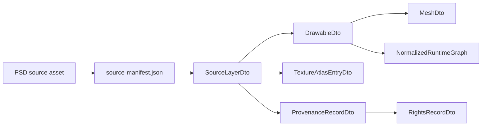
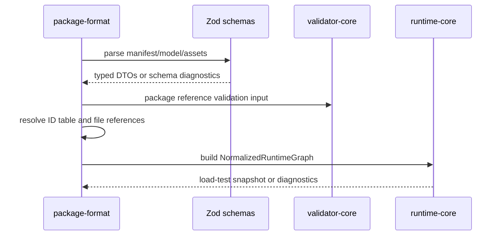
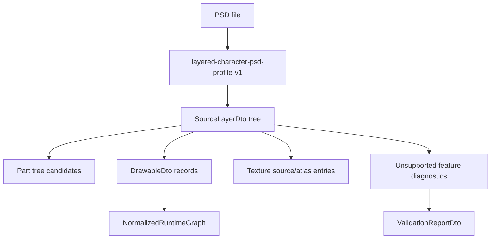

# Package File Format Contract

> 状態: Draft / Review ready
> 出力先: discussion/design/module-contracts/package-file-format-contract.md
> 主な読者: package-format implementer / import implementer / validator implementer
> 主な所有module: `package-format`
> Source of truth: zod
> 根拠: [../mvp-authoring-runtime/01-open-model-package-design.md](../mvp-authoring-runtime/01-open-model-package-design.md), [../module-contract-design-decisions.md](../module-contract-design-decisions.md), [../../scenarios/02_DomainAcceptanceCriteria/201_Input_Asset_and_Model_Intake.md](../../scenarios/02_DomainAcceptanceCriteria/201_Input_Asset_and_Model_Intake.md)

## Purpose and Scope

This document fixes the project-defined model package directory layout, file responsibilities, package DTO schemas, layered character PSD primary source asset profile, split PNG fallback profile, source provenance mapping, cross-file reference rules, version fields, and schema/runtime validation boundary.

It unblocks `package-format`, `source import adapter`, `validator-core`, `operation-core`, `editor-ui`, `viewer-ui`, and `ai-interface` implementation.

MVP includes `layered-character-psd-profile-v1` for generic layered character source art. This profile is not a Live2D / Cubism import profile. It does not read, write, infer, or convert Cubism model structures.

MVP includes `Minimum Open Dynamics v1` as parameter-driven deterministic secondary motion. Package dynamics definitions generate computed output parameters; they do not directly mutate mesh vertices or rigControl properties.

The contract does not aim for full Photoshop compatibility, PSB primary support, Cubism `.cmo3` reconstruction, Cubism model loading, Cubism SDK/Core use, or `.moc3` compatibility export.

## Basis Separation

### Official / Reference Facts

- Adobe publishes a Photoshop File Formats Specification for PSD / PSB, but it is a proprietary format specification rather than an open public standard.
- The specification describes data structures and not complete Photoshop rendering behavior for every layer feature.
- Layered source art workflows treat PSD layer/group structure as a practical source for model authoring.

### Repository Facts

- MVP AC requires layer source or split image input, drawable/texture/part creation, save/reload, provenance, rights metadata, and validator reports.
- `SC-IN-002` requires PSD group/layer structure to become editable parts and drawables.
- `SC-IN-003` requires problematic PSD attributes to produce warnings and retained/lost information.

### Prior Design Decisions

- PSD is the primary source asset.
- Split PNG is fallback / debug / compatibility.
- Source assets and provenance are not runtime-visible model graph nodes.
- Unsupported PSD features produce diagnostics and optional repair/rasterize candidates.

### Assumptions

- Package files are stored as an unpacked directory in MVP. Zip/registry packaging is post-MVP.
- Zod schemas are the package DTO source of truth. JSON Schema can be generated later.

## Contract Summary

| Contract | Owner module | Consumers | Source of truth | Artifact |
|----------|--------------|-----------|-----------------|----------|
| Package directory layout | `package-format` | editor, viewer, validator, AI | zod + this document | package files |
| PSD source asset profile | `package-format` / import adapter | editor, validator, operation-core | zod | source manifest |
| Split PNG fallback profile | `package-format` / import adapter | fixtures, editor | zod | source manifest |
| Cross-file reference rules | `package-format` + `validator-core` | validator, AI | zod + registry | diagnostics |
| Versioning/migration hooks | `package-format` + `operation-core` | migration, validator | zod | manifest/log/report |

## Package Directory Layout

```text
MVPAvatar_Clean.openpackage/
  manifest.json
  model/
    graph.json
    drawables.json
    meshes.json
    parameters.json
    keyforms.json
    rig-controls.json
    dynamics.json
    masks.json
    draw-order.json
    editor-state.json
  assets/
    sources/
      source-manifest.json
      *.psd
      *.png
    textures/
      texture-atlas.json
      *.png
    thumbnails/
      *.png
    provenance.json
    rights.json
  operations/
    log.jsonl
    checkpoints/
      checkpoint-manifest.json
  validation/
    reports/
      *.validation.json
  runtime/
    snapshots/
      *.runtime-snapshot.json
```

## File Responsibility Table

| Package file | DTO / Schema | Required | References | Validated by |
|--------------|--------------|----------|------------|--------------|
| `manifest.json` | `PackageManifestDto` | yes | all model/asset/log/report paths | schema + package validator |
| `model/graph.json` | `ModelGraphDto` | yes | part tree, drawable membership, rig control roots | package + semantic validator |
| `model/drawables.json` | `DrawablesFileDto` | yes | source asset, texture, mesh, part, mask | package + runtime validator |
| `model/meshes.json` | `MeshesFileDto` | yes | drawable IDs, vertex IDs | semantic + runtime validator |
| `model/parameters.json` | `ParametersFileDto` | yes | parameter IDs and aliases | semantic + runtime validator |
| `model/keyforms.json` | `KeyformsFileDto` | yes | target IDs, parameter IDs | semantic + runtime validator |
| `model/rig-controls.json` | `RigControlsFileDto` | yes | child drawable/rig control IDs | semantic + runtime validator |
| `model/dynamics.json` | `DynamicsFileDto` | yes | driver authored parameters, computed output parameters, solver settings, reset policy | semantic + runtime validator |
| `model/masks.json` | `MasksFileDto` | yes | mask/target drawable IDs | semantic + runtime validator |
| `model/draw-order.json` | `DrawOrderFileDto` | yes | drawable IDs | semantic + runtime validator |
| `model/editor-state.json` | `EditorStateFileDto` | optional | selection/lock/editor hide | editor profile only |
| `assets/sources/source-manifest.json` | `SourceManifestDto` | yes | PSD/split PNG source assets | package + rights validator |
| `assets/provenance.json` | `ProvenanceFileDto` | yes | source/texture/operation IDs | rights validator |
| `assets/rights.json` | `RightsFileDto` | yes | asset IDs | rights validator |
| `operations/log.jsonl` | `OperationLogEntryDto` | yes for GUI-authored MVP candidates | operation IDs, report/snapshot IDs | acceptance validator |
| `validation/reports/*.validation.json` | `ValidationReportDto` | generated | check IDs, targets | report schema |
| `runtime/snapshots/*.runtime-snapshot.json` | `RuntimeSnapshotDto` | generated | package revision, snapshot IDs | snapshot schema |
| `runtime/states/*.runtime-state.json` | `RuntimeStateDto` | generated | package identity, final/initial state refs | runtime state schema |

Generated `runtime/snapshots/` and `runtime/states/` files are evidence artifacts. They are not authoritative authored package body files and may be regenerated by runtime / validator fixtures when evaluator versions or approved epsilon policies change. `RuntimeStateDto` stored here is used for operation, test, and deterministic replay evidence such as `initial-runtime-state.json`, `expected-next-runtime-state.json`, and `expected-runtime-state-sequence.json`.

## Layered Character PSD Primary Source Asset Contract

`layered-character-psd-profile-v1` is a generic layered character art import profile.

It is not a Live2D / Cubism import profile. It does not read `.model3.json`, `.moc3`, `.cmo3`, `.physics3.json`, `.motion3.json`, or `.pose3.json`; it does not infer Cubism authoring structures; and it does not convert Cubism model data into this project-defined package.

MVP PSD import profile:

| PSD feature | MVP handling |
|-------------|--------------|
| layer tree | preserve in `source-manifest.json`; map editable layers to parts/drawables |
| group | map to candidate part tree nodes |
| layer name | preserve original name and normalized display name |
| bounds / canvas position | preserve in source layer and initial drawable placement |
| visibility | preserve as source visibility; do not confuse with runtime visibility |
| opacity | map to drawable default opacity when supported; record source opacity |
| raster pixel data | rasterize or extract to texture source with provenance |
| mask / clipping data | map simple source mask metadata; complex source masks may require manual confirmation |
| duplicate layer names | allowed with warning; stable ID disambiguates |
| fill, adjustment layer, smart object, text layer, effects, vector shape, complex blend | unsupported or rasterize-required diagnostic |
| PSB | not MVP primary; can be post-MVP optional import |

PSD is a source asset, not a runtime graph. Runtime core sees only normalized drawables, meshes, rig controls, dynamics groups, keyforms, masks, draw order, and textures.

## Split PNG Fallback Source Asset Contract

Split PNG import is allowed when PSD is unavailable or for compatibility/debug fixtures.

| Aspect | Contract |
|--------|----------|
| source kind | `split-png-set-v1` |
| grouping | explicit manifest or folder naming maps to parts |
| placement | explicit metadata required; if absent, importer can place at origin with warning |
| provenance | must record that PSD source tree is absent |
| debug use | acceptable for minimal runtime and validator fixtures |
| MVP primary status | fallback, not primary |

## Source Asset Provenance Mapping



The mapping flow keeps source provenance reachable from runtime-visible objects while preventing PSD-specific structures from leaking into `runtime-core`.

## Package Load Flow



## TypeScript / Zod Sketches

## DTO Schema Sketches

```ts
import { z } from "zod";
import {
  DrawableIdSchema,
  MeshIdSchema,
  PackageIdSchema,
  PartIdSchema,
  ParameterIdSchema,
  DynamicsGroupIdSchema,
  SourceAssetIdSchema,
  TextureIdSchema,
  RigControlIdSchema,
  KeyformSetIdSchema,
  MaskRelationIdSchema,
  OperationIdSchema,
  ProvenanceIdSchema,
  RectSchema,
  Vec2Schema,
} from "./contracts";

export const PackageManifestSchema = z.object({
  schemaVersion: z.literal("open-model-package-manifest-v1"),
  packageId: PackageIdSchema,
  packageDisplayName: z.string(),
  formatVersion: z.literal("open-model-package-v1"),
  packageRevision: z.number().int().nonnegative(),
  createdAt: z.string().datetime(),
  updatedAt: z.string().datetime(),
  schemaVersions: z.record(z.string(), z.string()),
  evaluatorVersions: z.record(z.string(), z.string()),
  modelFiles: z.object({
    graph: z.literal("model/graph.json"),
    drawables: z.literal("model/drawables.json"),
    meshes: z.literal("model/meshes.json"),
    parameters: z.literal("model/parameters.json"),
    keyforms: z.literal("model/keyforms.json"),
    rigControls: z.literal("model/rig-controls.json"),
    dynamics: z.literal("model/dynamics.json"),
    masks: z.literal("model/masks.json"),
    drawOrder: z.literal("model/draw-order.json"),
    editorState: z.literal("model/editor-state.json").optional(),
  }),
  assetIndex: z.literal("assets/sources/source-manifest.json"),
  operationLog: z.literal("operations/log.jsonl"),
  rightsSummary: z.object({ status: z.enum(["cleared", "needs_review", "blocked"]) }),
  provenanceSummary: z.object({ sourceAssetCount: z.number().int().nonnegative() }),
  packageStableOrderVersion: z.literal("stable-order-v1"),
});
export type PackageManifestDto = z.infer<typeof PackageManifestSchema>;

export const SourceAssetKindSchema = z.enum(["psd-source-v1", "split-png-set-v1", "generated-fixture-v1"]);

export const SourceLayerSchema = z.object({
  sourceLayerId: z.string(),
  sourceAssetId: SourceAssetIdSchema,
  originalName: z.string(),
  normalizedName: z.string(),
  groupPath: z.array(z.string()),
  bounds: RectSchema,
  visibleInSource: z.boolean(),
  opacityInSource: z.number().min(0).max(1),
  role: z.enum(["editableLayer", "guideImage", "referenceOnly", "unsupported"]),
  unsupportedFeatures: z.array(z.string()).default([]),
  mappedDrawableIds: z.array(DrawableIdSchema).default([]),
});
export type SourceLayerDto = z.infer<typeof SourceLayerSchema>;

export const SourceManifestSchema = z.object({
  schemaVersion: z.literal("source-manifest-v1"),
  sourceAssets: z.array(z.object({
    sourceAssetId: SourceAssetIdSchema,
    kind: SourceAssetKindSchema,
    filePath: z.string(),
    contentHash: z.string(),
    importProfile: z.enum(["layered-character-psd-profile-v1", "split-png-fallback-v1"]),
    layers: z.array(SourceLayerSchema).default([]),
    diagnostics: z.array(z.string()).default([]),
  })),
});
export type SourceManifestDto = z.infer<typeof SourceManifestSchema>;

export const DrawableSchema = z.object({
  drawableId: DrawableIdSchema,
  displayName: z.string(),
  partId: PartIdSchema,
  sourceAssetId: SourceAssetIdSchema,
  textureId: TextureIdSchema,
  meshId: MeshIdSchema,
  defaultOpacity: z.number().min(0).max(1),
  runtimeVisibility: z.boolean(),
  baseDrawOrder: z.number().int(),
  sourceProvenanceId: ProvenanceIdSchema,
});
export type DrawableDto = z.infer<typeof DrawableSchema>;

export const MeshSchema = z.object({
  meshId: MeshIdSchema,
  drawableId: DrawableIdSchema,
  vertices: z.array(Vec2Schema),
  uvs: z.array(Vec2Schema),
  triangles: z.array(z.tuple([z.number().int().nonnegative(), z.number().int().nonnegative(), z.number().int().nonnegative()])),
  vertexStableIds: z.array(z.string()),
  bounds: RectSchema,
  generationProvenanceId: ProvenanceIdSchema,
});
export type MeshDto = z.infer<typeof MeshSchema>;

export const ParameterSchema = z.object({
  parameterId: ParameterIdSchema,
  displayName: z.string(),
  semanticRole: z.enum(["eye", "brow", "mouth", "face", "body", "arm", "hair", "dynamics", "custom"]).optional(),
  projectPresetAlias: z.string().optional(),
  valueSource: z.enum(["authoredInput", "computedDynamics", "debugOverride"]).default("authoredInput"),
  min: z.number().finite(),
  max: z.number().finite(),
  default: z.number().finite(),
  recommendedUiStep: z.number().positive(),
});
export type ParameterDto = z.infer<typeof ParameterSchema>;

// projectPresetAlias is a private project/editor preset label.
// It is not a Live2D / Cubism / VTube Studio compatible parameter ID.

export const PackageStatePatchValueSchema = z.union([
  z.number().finite(),
  z.boolean(),
  z.string(),
  Vec2Schema,
  RectSchema,
  z.array(Vec2Schema),
  z.record(z.string(), z.number().finite()),
]);

export const ModelGraphSchema = z.object({
  schemaVersion: z.literal("model-graph-v1"),
  coordinateSystem: z.literal("canvas-y-down-v1"),
  canvasSize: z.object({ width: z.number().positive(), height: z.number().positive() }),
  parts: z.array(z.object({
    partId: PartIdSchema,
    displayName: z.string(),
    parentPartId: PartIdSchema.optional(),
    childPartIds: z.array(PartIdSchema).default([]),
    drawableIds: z.array(DrawableIdSchema).default([]),
  })),
  rigControlRootIds: z.array(RigControlIdSchema).default([]),
  stableOrder: z.array(z.string()),
});
export type ModelGraphDto = z.infer<typeof ModelGraphSchema>;

export const KeyformTargetSchema = z.object({
  kind: z.enum(["mesh", "rigControl", "drawable", "opacity", "visibility", "drawOrder"]),
  id: z.string(),
  property: z.string(),
});

export const Linear1dKeyformSetSchema = z.object({
  keyformSetId: KeyformSetIdSchema,
  target: KeyformTargetSchema,
  parameterId: ParameterIdSchema,
  evaluator: z.literal("linear-1d-v1"),
  interpolation: z.literal("linear-1d-v1"),
  compositionMode: z.enum(["replace", "additiveDelta", "multiplyOpacity"]),
  compositionOrder: z.number().int(),
  keys: z.array(z.object({
    value: z.number().finite(),
    statePatch: PackageStatePatchValueSchema,
  })),
});

export const ParameterGrid2dKeyformSetSchema = z.object({
  keyformSetId: KeyformSetIdSchema,
  target: KeyformTargetSchema,
  parameterX: ParameterIdSchema,
  parameterY: ParameterIdSchema,
  evaluator: z.literal("parameter-grid-2d-v1"),
  interpolation: z.literal("bilinear-grid-v1"),
  clampPolicy: z.literal("clamp-to-parameter-range"),
  missingKeyPolicy: z.literal("diagnostic-error"),
  compositionMode: z.enum(["replace", "additiveDelta"]),
  compositionOrder: z.number().int(),
  keys: z.array(z.object({
    x: z.number().finite(),
    y: z.number().finite(),
    statePatch: PackageStatePatchValueSchema,
  })),
});

export const KeyformSetSchema = z.discriminatedUnion("evaluator", [
  Linear1dKeyformSetSchema,
  ParameterGrid2dKeyformSetSchema,
]);
export type KeyformSetDto = z.infer<typeof KeyformSetSchema>;

export const DynamicsSolverKindSchema = z.enum(["scalarDampedFollowV1"]);

export const DynamicsDriverSchema = z.object({
  driverId: z.string(),
  sourceParameterId: ParameterIdSchema,
  inputScale: z.number().finite().default(1),
  inputOffset: z.number().finite().default(0),
  invert: z.boolean().default(false),
});

export const DynamicsOutputSchema = z.object({
  outputId: z.string(),
  targetParameterId: ParameterIdSchema,
  outputScale: z.number().finite().default(1),
  outputOffset: z.number().finite().default(0),
  min: z.number().finite(),
  max: z.number().finite(),
  clampPolicy: z.literal("clamp-to-output-range"),
});

export const ScalarDampedFollowSettingsV1Schema = z.object({
  stiffness: z.number().finite().nonnegative(),
  damping: z.number().finite().nonnegative(),
  maxVelocity: z.number().finite().positive().optional(),
  maxAmplitude: z.number().finite().positive().optional(),
});

export const DynamicsGroupSchema = z.object({
  dynamicsGroupId: DynamicsGroupIdSchema,
  displayName: z.string(),
  enabled: z.boolean().default(true),
  solverKind: z.literal("scalarDampedFollowV1"),
  drivers: z.array(DynamicsDriverSchema).min(1),
  output: DynamicsOutputSchema,
  settings: ScalarDampedFollowSettingsV1Schema,
  resetPolicy: z.enum(["reset-on-load", "reset-on-manual-command", "reset-on-large-input-jump"]),
});
export type DynamicsGroupDto = z.infer<typeof DynamicsGroupSchema>;

// Dynamics package invariants:
// - solverKind is fixed to scalarDampedFollowV1 for MVP.
// - settings is the runtime source of truth and contains stiffness, damping,
//   optional maxVelocity, and optional maxAmplitude. response is not saved as
//   runtime evaluator input; GUI may expose it only as a UI-only preset or
//   derived description.
// - one dynamics group has exactly one output.
// - one computedDynamics parameter may be produced by zero or one dynamics
//   group; duplicate output.targetParameterId values are invalid.
// - drivers must reference valueSource="authoredInput" parameters.
// - output.targetParameterId must reference a valueSource="computedDynamics"
//   parameter.
// - output.min/output.max must be inside the target parameter range.

export const RigControlSchema = z.discriminatedUnion("kind", [
  z.object({
    kind: z.literal("rotation2d"),
    rigControlId: RigControlIdSchema,
    displayName: z.string(),
    partId: PartIdSchema,
    parentId: RigControlIdSchema.optional(),
    childDrawableIds: z.array(DrawableIdSchema).default([]),
    childRigControlIds: z.array(RigControlIdSchema).default([]),
    pivot: Vec2Schema,
    restAngleDegrees: z.number().finite(),
    restTranslation: Vec2Schema,
    restScale: Vec2Schema,
    enabled: z.boolean(),
  }),
  z.object({
    kind: z.literal("warpLattice2d"),
    rigControlId: RigControlIdSchema,
    displayName: z.string(),
    partId: PartIdSchema,
    parentId: RigControlIdSchema.optional(),
    childDrawableIds: z.array(DrawableIdSchema).default([]),
    childRigControlIds: z.array(RigControlIdSchema).default([]),
    bindSpace: z.literal("rigControlLocalRest"),
    domainBounds: RectSchema,
    latticeColumns: z.number().int().min(2),
    latticeRows: z.number().int().min(2),
    restControlPoints: z.array(Vec2Schema),
    interpolationMethod: z.literal("bilinear-grid-v1"),
    enabled: z.boolean(),
  }),
]);
export type RigControlDto = z.infer<typeof RigControlSchema>;

export const MaskRelationSchema = z.object({
  maskRelationId: MaskRelationIdSchema,
  maskDrawableIds: z.array(DrawableIdSchema).min(1),
  targetDrawableIds: z.array(DrawableIdSchema).min(1),
  maskGroupHint: z.string().optional(),
  enabled: z.boolean(),
});
export type MaskRelationDto = z.infer<typeof MaskRelationSchema>;

export const DrawOrderEntrySchema = z.object({
  drawableId: DrawableIdSchema,
  baseDrawOrder: z.number().int(),
  stableOrder: z.number().int().nonnegative(),
  keyformSetId: KeyformSetIdSchema.optional(),
});
export type DrawOrderEntryDto = z.infer<typeof DrawOrderEntrySchema>;

export const EditorStateFileSchema = z.object({
  schemaVersion: z.literal("editor-state-v1"),
  selection: z.array(z.string()).default([]),
  lockedIds: z.array(z.string()).default([]),
  editorHiddenIds: z.array(z.string()).default([]),
  activeTool: z.string().optional(),
  canvas: z.object({ zoom: z.number().positive(), pan: Vec2Schema }).optional(),
});
export type EditorStateFileDto = z.infer<typeof EditorStateFileSchema>;

export const ProvenanceRecordSchema = z.object({
  provenanceId: ProvenanceIdSchema,
  assetId: z.string(),
  assetKind: z.enum(["source", "texture", "thumbnail", "generatedFixture", "aiEdit"]),
  filePath: z.string(),
  contentHash: z.string().optional(),
  creator: z.string(),
  sourceUrl: z.string().optional(),
  license: z.string(),
  redistributionAllowed: z.boolean(),
  aiUsed: z.boolean(),
  transformHistory: z.array(z.string()).default([]),
  relatedOperationIds: z.array(OperationIdSchema).default([]),
});
export type ProvenanceRecordDto = z.infer<typeof ProvenanceRecordSchema>;

export const RightsRecordSchema = z.object({
  assetId: z.string(),
  rightsStatus: z.enum(["cleared", "needs_review", "blocked"]),
  license: z.string(),
  redistributionAllowed: z.boolean(),
  notes: z.string().optional(),
});
export type RightsRecordDto = z.infer<typeof RightsRecordSchema>;

export const DrawablesFileSchema = z.object({ schemaVersion: z.literal("drawables-file-v1"), drawables: z.array(DrawableSchema) });
export const MeshesFileSchema = z.object({ schemaVersion: z.literal("meshes-file-v1"), meshes: z.array(MeshSchema) });
export const ParametersFileSchema = z.object({ schemaVersion: z.literal("parameters-file-v1"), parameters: z.array(ParameterSchema) });
export const KeyformsFileSchema = z.object({ schemaVersion: z.literal("keyforms-file-v1"), keyformSets: z.array(KeyformSetSchema) });
export const RigControlsFileSchema = z.object({ schemaVersion: z.literal("rig-controls-file-v1"), rigControls: z.array(RigControlSchema) });
export const DynamicsFileSchema = z.object({ schemaVersion: z.literal("dynamics-file-v1"), dynamicsGroups: z.array(DynamicsGroupSchema) });
export const MasksFileSchema = z.object({ schemaVersion: z.literal("masks-file-v1"), masks: z.array(MaskRelationSchema) });
export const DrawOrderFileSchema = z.object({ schemaVersion: z.literal("draw-order-file-v1"), entries: z.array(DrawOrderEntrySchema) });
export const ProvenanceFileSchema = z.object({ schemaVersion: z.literal("provenance-file-v1"), records: z.array(ProvenanceRecordSchema) });
export const RightsFileSchema = z.object({ schemaVersion: z.literal("rights-file-v1"), records: z.array(RightsRecordSchema) });
```

## Cross-file Reference Rules

| Reference | Rule | Invalid diagnostic |
|-----------|------|--------------------|
| drawable -> source asset | must exist in `source-manifest.json` | `ref.drawableSourceMissing` |
| drawable -> texture | must exist in `texture-atlas.json` | `ref.drawableTextureMissing` |
| drawable -> mesh | must exist in `meshes.json` and point back to drawable | `ref.drawableMeshMissing` |
| drawable -> part | must exist in `graph.json` part tree | `ref.drawablePartMissing` |
| mesh -> drawable | must exist in `drawables.json` | `ref.meshDrawableMissing` |
| keyform -> parameter | all parameter IDs must exist | `keyform.parameterMissing` |
| keyform -> target | target ID must exist for target kind | `keyform.targetMissing` |
| rigControl -> child | child drawable/rigControl IDs must exist and be acyclic | `rigControl.childMissing`, `rigControl.cycle` |
| dynamics -> driver | driver parameter must exist and have `valueSource="authoredInput"` | `dynamics.driverMissing`, `dynamics.driverMustBeAuthoredInput` |
| dynamics -> output | output parameter must exist and have `valueSource="computedDynamics"` | `dynamics.outputMissing`, `dynamics.outputMustBeComputedParameter` |
| dynamics dependency | computed dynamics output cannot drive dynamics; group dependencies are prohibited | `dynamics.outputUsedAsDriver`, `dynamics.groupCycle` |
| mask -> drawable | source and target IDs must exist | `mask.drawableMissing` |
| operation log -> reports/snapshots | referenced generated artifacts may be absent while dirty, but acceptance profile requires them | `evidence.operationArtifactMissing` |

## Versioning / Migration Hooks

| Field | Owner | Rule |
|-------|-------|------|
| `formatVersion` | `package-format` | bump only for incompatible package layout/semantics |
| `schemaVersions` | `contracts` + `package-format` | per-file schema names |
| `evaluatorVersions` | `runtime-core` | records runtime semantics used to generate snapshots |
| `packageRevision` | `operation-core` | increments on committed operation or migration |
| `operationLogVersion` | `operation-core` | entry schema version |
| `migrationHistory` | `package-format` | every migration must produce diff and validation report |

Migration must go through operation-core or a migration operation adapter. Silent file rewrite is forbidden for MVP package candidates.

## Schema Validation vs Runtime Validation Boundary

| Layer | Validates | Does not validate |
|-------|-----------|-------------------|
| Zod schema parse | field types, enum values, required fields, version literals | cross-file references, runtime evaluability |
| Package reference validation | file existence, ID table, duplicate IDs, references | parameter-dependent final vertices |
| Semantic validation | drawable/mesh/keyform/rig control/mask consistency | renderer-specific appearance |
| Runtime validation | normalized graph load, representative evaluation, snapshot diagnostics | GUI authoring evidence |
| Acceptance validation | GUI evidence, scenario coverage, report/snapshot/diff presence | commercial art quality |

## Diagram Requirements

The PSD layer mapping below is normative for ownership, not a full Photoshop feature implementation.



## Traceability

| Requirement | Contract element | Verification |
|-------------|------------------|--------------|
| AC-MVP-002, AC-RIGHTS-001, SC-RIGHTS-002 | `assets/provenance.json`, `assets/rights.json` | `psd-import-happy-path` rights expected report |
| AC-MVP-003, AC-IN-001, AC-IN-002, SC-IN-002 | PSD `SourceManifestDto` and `SourceLayerDto` | `psd-import-happy-path` operation result |
| AC-IN-006, SC-IN-003 | unsupported/lost source info diagnostics | `psd-unsupported-layer` validation report |
| AC-MVP-004, AC-DRAW-001 | `DrawableDto`, `MeshDto`, texture refs | `minimal-valid-package` |
| AC-MVP-010, AC-PHYS-001..006, SC-DYN-001 | `model/dynamics.json`, `DynamicsGroupSchema`, `Parameter.valueSource` | `minimal-dynamics-hairSway` |
| AC-MVP-011, SC-MVP-003 | package layout + save/reload references | `tutorial-like-authoring` roundtrip |
| AC-MVP-015, SC-MVP-005 | demo-safe capture separation and hidden internal names | demo-safe preflight fixture |
| AC-MVP-016, SC-MVP-006 | no Cubism SDK/Core package dependency | package manifest check |

## Verification and Fixtures

| Fixture / Test | Purpose | Expected artifact |
|----------------|---------|-------------------|
| `minimal-valid-package` | proves mandatory files, IDs, and references parse | `minimal.validation.json`, summary snapshot |
| `psd-import-happy-path` | maps PSD groups/layers to parts/drawables/textures/provenance | operation result, package diff |
| `psd-unsupported-layer` | surfaces smart object/text/effect/fill warnings | validation report with `asset.psd.unsupportedFeature` |
| `split-png-fallback` | proves fallback import records absent PSD layer tree | provenance and warning report |
| `minimal-dynamics-hairSway` | proves dynamics group, authored driver, computed output parameter, and fixed solver settings parse | package parse + summary snapshot |
| `invalid-missing-texture` | proves missing visible texture is detected | validation fail report |

## Open Questions

| Question | Impact | Status |
|----------|--------|--------|
| Exact PSD parser library | can-defer | parser is an adapter behind `layered-character-psd-profile-v1` |
| Whether package stores source PSD bytes or only references in all modes | can-defer | MVP fixtures should store local package-contained source assets |
| Exact JSON Schema generation target | can-defer | Zod schema remains source of truth |

## Handoff Checklist

- [x] Public API / DTO が示されている
- [x] Source of truth が契約ごとに明記されている
- [x] 依存方向、処理順序、状態遷移が必要な箇所に Mermaid 図がある
- [x] AC / scenario traceability がある
- [x] Fixture または expected output がある
- [x] 未決事項が implementation-blocking / can-defer に分かれている

## Review Requirements

Review this file for:

- PSD primary / split PNG fallback consistency,
- absence of PSD-specific structures in runtime-core contracts,
- cross-file reference coverage in validator and fixtures.
