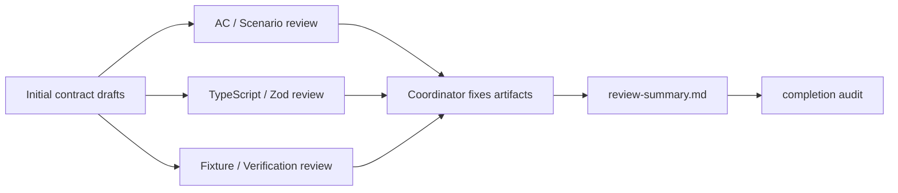

# Review Summary

> 状態: Draft / Review ready
> 出力先: discussion/design/module-contracts/review-summary.md
> 主な読者: user / implementation coordinator / later reviewers
> 主な所有module: cross-cutting
> Source of truth: mixed
> 根拠: [module-boundaries.md](module-boundaries.md), [typescript-contracts.md](typescript-contracts.md), [package-file-format-contract.md](package-file-format-contract.md), [operation-contracts.md](operation-contracts.md), [runtime-core-contract.md](runtime-core-contract.md), [validator-contract.md](validator-contract.md), [gui-operation-contract.md](gui-operation-contract.md), [ai-command-contract.md](ai-command-contract.md), [fixtures-and-contract-tests.md](fixtures-and-contract-tests.md), [traceability-matrix.md](traceability-matrix.md)

## Purpose and Scope

This document records the independent review results for the module contract design and the fixes applied afterward.

It covers the three required review lanes:

- AC / Scenario Traceability,
- TypeScript / Zod Contract Consistency,
- Fixture / Verification.

It does not replace the detailed contract documents. It records review outcomes, required fixes, response status, and unresolved items.

## Basis Separation

### Repository Facts

- The contract artifacts are Markdown design files under `discussion/design/module-contracts/`.
- No production `.ts` implementation files were created.
- Independent reviews were requested from separate subagents after the initial draft set was created.

### Prior Design Decisions

- Review results must be recorded in this file.
- Required fixes must be reflected in the contract artifacts before the goal can be considered complete.
- Remaining unresolved items must be classified as `implementation-blocking` or `can-defer`.

### Assumptions

- Review status names are `pass`, `needs_changes`, and `escalate`.
- After fixes, a finding can be marked `addressed` when the relevant artifact now contains the required contract.

## Contract Summary

| Contract | Owner module | Consumers | Source of truth | Artifact |
|----------|--------------|-----------|-----------------|----------|
| Review lane outcome | cross-cutting | coordinator, user | this document | review table |
| Finding response status | cross-cutting | later reviewers | this document + edited artifacts | response table |
| Remaining unresolved item classification | cross-cutting | implementers | this document | open question table |

## TypeScript / Zod Sketches

```ts
import { z } from "zod";

export const ReviewLaneSchema = z.enum([
  "ac-scenario-traceability",
  "typescript-zod-consistency",
  "fixture-verification",
]);

export const ReviewFindingStatusSchema = z.enum([
  "addressed",
  "can-defer",
  "implementation-blocking",
  "not-applicable",
]);

export const ReviewFindingSchema = z.object({
  lane: ReviewLaneSchema,
  summary: z.string(),
  affectedFiles: z.array(z.string()),
  status: ReviewFindingStatusSchema,
  response: z.string(),
});
export type ReviewFindingDto = z.infer<typeof ReviewFindingSchema>;
```

## Diagram Requirements

The review flow below records the create-review-fix loop used for these artifacts.



## Review Lane Outcomes

| Review lane | Reviewer status | Main result | Response |
|-------------|-----------------|-------------|----------|
| AC / Scenario Traceability | `needs_changes` | Central trace omitted several supplied scenarios, compressed domain AC ranges, missed diagnostic and fixture rows | addressed in [traceability-matrix.md](traceability-matrix.md) |
| TypeScript / Zod Contract Consistency | `needs_changes` | Operation payloads/logs used `z.unknown`, package DTO sketches were incomplete, branded schemas were missing, GUI/AI target schemas could drift | addressed in [typescript-contracts.md](typescript-contracts.md), [package-file-format-contract.md](package-file-format-contract.md), [operation-contracts.md](operation-contracts.md), [gui-operation-contract.md](gui-operation-contract.md), [ai-command-contract.md](ai-command-contract.md) |
| Fixture / Verification | `needs_changes` | Fixture IDs were inconsistent, expected outputs were too high-level, diagnostic registry drift existed, `review-summary.md` was absent | addressed in [fixtures-and-contract-tests.md](fixtures-and-contract-tests.md), [validator-contract.md](validator-contract.md), [traceability-matrix.md](traceability-matrix.md), this file |

## Findings and Responses

| Lane | Finding | Affected files | Status | Response |
|------|---------|----------------|--------|----------|
| AC / Scenario Traceability | Missing scenario rows for supplied basis scenarios such as `SC-IN-001`, `SC-IN-004`-`SC-IN-008`, `SC-DEF-002`, `SC-DEF-004`, `SC-PARAM-001`, `SC-PARAM-005`-`SC-PARAM-007`, `SC-AI-001`, `SC-AI-003`-`SC-AI-005`, `SC-AGENT-004` | `traceability-matrix.md` | addressed | Added explicit scenario operation-flow rows and marked migration/reference-only cases as `can-defer` where not MVP implementation gates |
| AC / Scenario Traceability | Domain AC coverage used broad ranges that hid weak per-ID links | `traceability-matrix.md` | addressed | Added per-ID Domain AC audit supplement for the reviewed gaps |
| AC / Scenario Traceability | Diagnostic trace omitted several validator checks | `validator-contract.md`, `traceability-matrix.md` | addressed | Added/check-aligned `runtime.parameterClamped`, `keyform.grid2dDuplicateKey`, and full diagnostic trace rows |
| AC / Scenario Traceability | Fixture trace omitted some fixture IDs | `traceability-matrix.md` | addressed | Added all registered fixture IDs to Fixture -> Expected Output |
| TypeScript / Zod Consistency | Operation-specific payload branches and operation log payload used `z.unknown()` | `operation-contracts.md` | addressed | Added concrete payload schemas for every registered operation and typed operation log `payload`, `precondition`, `transactionId`, and `provenanceId` |
| TypeScript / Zod Consistency | Package file table listed DTOs that lacked schema sketches | `package-file-format-contract.md` | addressed | Added graph, keyform, deformer, mask, draw-order, editor-state, provenance, rights, and file wrapper schema sketches |
| TypeScript / Zod Consistency | `ProvenanceIdSchema` and branded `CheckIdSchema` were missing/inconsistent | `typescript-contracts.md`, package/operation contracts | addressed | Added `TransactionIdSchema`, `ProvenanceIdSchema`, branded `CheckIdSchema`, and switched provenance fields to the schema |
| TypeScript / Zod Consistency | GUI selection/evidence target refs duplicated shared target refs | `gui-operation-contract.md` | addressed | Reused `TargetRefSchema` for selection, hit-test operation targets, and GUI evidence semantic targets |
| TypeScript / Zod Consistency | AI command schemas were generic instead of per-command | `ai-command-contract.md` | addressed | Added discriminated per-command payload/response schemas and retained the transport-independent envelope |
| Fixture / Verification | `invalid-mesh-triangle` was referenced but not registered | `fixtures-and-contract-tests.md`, `traceability-matrix.md` | addressed | Added fixture ID, fixture list row, expected report row, and trace row |
| Fixture / Verification | Several variant references were not registered fixture IDs | `fixtures-and-contract-tests.md`, `traceability-matrix.md` | addressed | Added `rights-provenance-missing`, `keyform-grid-invalid`, `keyform-missing-endpoint`, `keyform-grid-overdimension`, `parent-child-out-of-domain`, `runtime-load-blocking`, and `ai-invalid-mutation` |
| Fixture / Verification | Expected outputs were too high-level | `fixtures-and-contract-tests.md` | addressed | Added exact check IDs, severity/status expectations, representative parameter inputs, comparator expectations, and required diff fields |
| Fixture / Verification | `tutorial-like-authoring` did not explicitly lock eye/mouth/hair/face-angle coverage | `fixtures-and-contract-tests.md` | addressed | Added required representative parameters and expected runtime changes for `ParamEyeOpen`, `ParamMouthOpenY`, `ParamHairSway`, `ParamAngleX`, and `ParamAngleY` |

## Traceability

| Requirement | Contract element | Verification |
|-------------|------------------|--------------|
| Review requirement: AC / Scenario Traceability | Review lane and fixes | [traceability-matrix.md](traceability-matrix.md) |
| Review requirement: TypeScript / Zod Contract Consistency | Review lane and fixes | [typescript-contracts.md](typescript-contracts.md), [operation-contracts.md](operation-contracts.md) |
| Review requirement: Fixture / Verification | Review lane and fixes | [fixtures-and-contract-tests.md](fixtures-and-contract-tests.md) |
| Objective completion condition: review recorded | this file | current review tables |

## Verification and Fixtures

| Fixture / Test | Purpose | Expected artifact |
|----------------|---------|-------------------|
| contract-doc-section-check | verify required template sections exist | section audit result |
| fixture-registry-trace-check | verify fixture IDs appear in traceability | trace audit result |
| review-finding-response-check | verify every review lane has response status | this file |

## Open Questions

| Question | Impact | Status |
|----------|--------|--------|
| Exact repository fixture path | can-defer | `fixtures/contracts/<fixture-id>/` is recommended but not fixed |
| Vitest snapshots vs custom semantic comparator | can-defer | comparator semantics are specified in fixture contract |
| Actual rights-clean PSD art bytes | can-defer | provenance/rights metadata contract is fixed; source art can be created during fixture implementation |
| Exact HTTP/WebSocket/MCP endpoint paths | can-defer | transport-independent AI command contract is source of truth |
| Implementation package import paths | can-defer | module IDs and ownership are fixed |

No unresolved item is currently classified as `implementation-blocking` for starting module scaffolding from these contracts.

## Handoff Checklist

- [x] Public API / DTO が示されている
- [x] Source of truth が契約ごとに明記されている
- [x] 依存方向、処理順序、状態遷移が必要な箇所に Mermaid 図がある
- [x] AC / scenario traceability がある
- [x] Fixture または expected output がある
- [x] 未決事項が implementation-blocking / can-defer に分かれている

## Review Requirements

This document is the review record. A later review should confirm:

- every finding row remains addressed after future edits,
- no new artifact bypasses Zod/source-of-truth rules,
- fixture registry, validator checks, and traceability remain synchronized.
