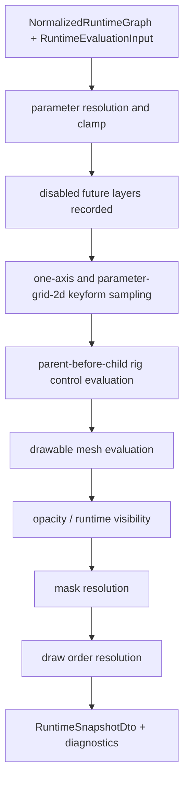

# Runtime Core Contract

> 状態: Draft / Review ready
> 出力先: discussion/design/module-contracts/runtime-core-contract.md
> 主な読者: runtime-core implementer / validator implementer / renderer-adapter implementer
> 主な所有module: `runtime-core`
> Source of truth: mixed
> 根拠: [../mvp-authoring-runtime/03-runtime-evaluation-semantics.md](../mvp-authoring-runtime/03-runtime-evaluation-semantics.md), [../module-contract-design-decisions.md](../module-contract-design-decisions.md), [../../scenarios/02_DomainAcceptanceCriteria/205_Parameter_and_Keyform_Semantics.md](../../scenarios/02_DomainAcceptanceCriteria/205_Parameter_and_Keyform_Semantics.md), [../../scenarios/02_DomainAcceptanceCriteria/204_Deformation_Control_Structure.md](../../scenarios/02_DomainAcceptanceCriteria/204_Deformation_Control_Structure.md)

## Purpose and Scope

This document fixes the Shared Runtime evaluation core contract:

- pure `evaluateRuntime(...)` API,
- `NormalizedRuntimeGraph` input shape,
- parameter input and clamp policy,
- one-axis keyform semantics,
- project-defined `parameter-grid-2d-v1` semantics,
- parent-before-child rig control hierarchy,
- runtime snapshot DTO,
- diagnostics phases,
- epsilon and deterministic comparison policy,
- disabled future layers.

It does not define renderer implementation, package file IO, or editor UI state.

## Basis Separation

### Repository Facts

- MVP requires Preview and Viewer to share runtime evaluation semantics.
- Runtime snapshots must expose evaluated drawable state, vertex/bounds/hash, opacity, visibility, draw order, mask state, and diagnostics.
- face yaw / pitch diagonal behavior is required by `AC-MVP-010`, `SC-MVP-002`, and `SC-PARAM-004`.

### Prior Design Decisions

- `parameter-grid-2d-v1` is MVP contract for two-axis keyform grids.
- One-axis keyforms remain a separate evaluator.
- Parent-before-child rig control evaluation is required.
- `rotation2d` and `warpLattice2d` are MVP runtime-visible rig control nodes.
- Arbitrary N-dimensional keyform grids are not MVP.

### Assumptions

- CPU TypeScript evaluator is the first semantic source. Renderer/GPU paths must match snapshots within epsilon.
- Runtime core may return summary snapshots by default and full vertices for strict/contract tests.

## Contract Summary

| Contract | Owner module | Consumers | Source of truth | Artifact |
|----------|--------------|-----------|-----------------|----------|
| `RuntimeCore.evaluateRuntime` | `runtime-core` | editor preview, viewer, validator, AI | typescript | API |
| `NormalizedRuntimeGraph` | `runtime-core` | runtime evaluator | typescript | internal graph |
| `RuntimeEvaluationInput/Options` | `runtime-core` | viewer, validator, AI | zod | DTO |
| `RuntimeSnapshotDto` | `runtime-core` | renderer, validator, AI, fixtures | zod | snapshot JSON |
| keyform/rig control semantics | `runtime-core` | operation, validator, fixtures | mixed | evaluator contract |

## TypeScript / Zod Sketches

## Runtime API

```ts
import { z } from "zod";
import {
  DiagnosticSchema,
  DrawableId,
  DrawableIdSchema,
  MeshId,
  ParameterId,
  ParameterIdSchema,
  RigControlId,
  RigControlIdSchema,
  RuntimeSnapshotIdSchema,
  PackageIdSchema,
  Vec2,
  Vec2Schema,
  RectSchema,
  RuntimeEvaluationProfileSchema,
  SnapshotDetailSchema,
} from "./contracts";

export interface RuntimeCore {
  evaluateRuntime(
    graph: NormalizedRuntimeGraph,
    input: RuntimeEvaluationInputDto,
    options: RuntimeEvaluationOptionsDto
  ): RuntimeSnapshotDto;

  compareRuntimeSnapshots(
    before: RuntimeSnapshotDto,
    after: RuntimeSnapshotDto,
    policy: SnapshotComparisonPolicy
  ): RuntimeComparisonResult;
}
```

## Normalized Runtime Graph

`NormalizedRuntimeGraph` is internal and TypeScript-owned. It is produced by package loader or authoring graph adapter.

```ts
export interface NormalizedRuntimeGraph {
  readonly packageId: string;
  readonly packageRevision: number;
  readonly packageHash?: string;
  readonly coordinateSystem: "canvas-y-down-v1";
  readonly parameters: ReadonlyMap<ParameterId, NormalizedParameter>;
  readonly drawables: ReadonlyMap<DrawableId, NormalizedDrawable>;
  readonly rigControls: ReadonlyMap<RigControlId, NormalizedRigControlNode>;
  readonly keyformBindings: readonly KeyformBinding[];
  readonly masks: readonly NormalizedMaskRelation[];
  readonly drawOrder: readonly NormalizedDrawOrderEntry[];
  readonly disabledFutureLayers: readonly DisabledFutureLayer[];
}

export interface NormalizedParameter {
  readonly id: ParameterId;
  readonly displayName: string;
  readonly semanticRole?: "eye" | "brow" | "mouth" | "face" | "body" | "arm" | "hair" | "dynamics" | "custom";
  readonly projectPresetAlias?: string;
  readonly min: number;
  readonly max: number;
  readonly default: number;
}

export type KeyformBinding =
  | Linear1dKeyformBinding
  | ParameterGrid2dKeyformBinding;

export interface Linear1dKeyformBinding {
  readonly evaluator: "linear-1d-v1";
  readonly targetId: string;
  readonly targetKind: "mesh" | "rig control" | "drawable";
  readonly targetProperty: string;
  readonly parameterId: ParameterId;
  readonly keys: readonly OneAxisKey[];
  readonly compositionMode: "replace" | "additiveDelta" | "multiplyOpacity";
  readonly compositionOrder: number;
}

export interface ParameterGrid2dKeyformBinding {
  readonly evaluator: "parameter-grid-2d-v1";
  readonly targetId: string;
  readonly targetKind: "mesh" | "rig control" | "drawable";
  readonly targetProperty: string;
  readonly parameterX: ParameterId;
  readonly parameterY: ParameterId;
  readonly interpolation: "bilinear-grid-v1";
  readonly clampPolicy: "clamp-to-parameter-range";
  readonly missingKeyPolicy: "diagnostic-error";
  readonly keys: readonly Grid2dKey[];
  readonly compositionMode: "replace" | "additiveDelta";
  readonly compositionOrder: number;
}

export interface OneAxisKey {
  readonly value: number;
  readonly statePatch: unknown;
}

export interface Grid2dKey {
  readonly x: number;
  readonly y: number;
  readonly statePatch: unknown;
}

export type NormalizedRigControlNode =
  | NormalizedRotation2dRigControl
  | NormalizedWarpLattice2dRigControl;
```

## Evaluation Input / Options

```ts
export const RuntimeEvaluationInputSchema = z.object({
  schemaVersion: z.literal("runtime-evaluation-input-v1"),
  parameters: z.record(ParameterIdSchema, z.number().finite()).default({}),
  source: z.object({
    surface: z.enum(["preview", "viewer", "validator", "aiDryRun"]),
    operationId: z.string().optional(),
  }),
  targetIds: z.array(z.string()).default([]),
});
export type RuntimeEvaluationInputDto = z.infer<typeof RuntimeEvaluationInputSchema>;

export const EpsilonPolicySchema = z.object({
  vertexPositionEpsilon: z.number().positive().default(0.0001),
  boundsEpsilon: z.number().positive().default(0.0001),
  opacityEpsilon: z.number().positive().default(0.000001),
  hashPrecisionDecimals: z.number().int().min(3).max(8).default(5),
});
export type EpsilonPolicyDto = z.infer<typeof EpsilonPolicySchema>;

export const RuntimeEvaluationOptionsSchema = z.object({
  schemaVersion: z.literal("runtime-evaluation-options-v1"),
  profile: RuntimeEvaluationProfileSchema,
  snapshotDetail: SnapshotDetailSchema,
  evaluatorVersions: z.object({
    keyform1d: z.literal("linear-1d-v1"),
    keyformGrid2d: z.literal("parameter-grid-2d-v1"),
    warpLattice: z.literal("bilinear-grid-v1"),
    rigControlHierarchy: z.literal("parent-before-child-v1"),
  }),
  epsilonPolicy: EpsilonPolicySchema,
  includeTrace: z.boolean().default(false),
});
export type RuntimeEvaluationOptionsDto = z.infer<typeof RuntimeEvaluationOptionsSchema>;
```

## Parameter / Keyform Evaluation Semantics

1. Initialize each declared parameter to default.
2. Apply input overrides.
3. Clamp out-of-range input for preview/viewer/AI dry-run and emit `runtime.parameterClamped`.
4. Validator strict may report range violations as fail while still producing diagnostic evidence.
5. Evaluate one-axis bindings before `parameter-grid-2d-v1` only when `compositionOrder` says so. The order is numeric and deterministic.
6. Same target property with multiple writers requires explicit `compositionMode` and `compositionOrder`.

## Project-defined 2-axis Keyform Grid Semantics

`parameter-grid-2d-v1` represents the two-axis grid used for face yaw / pitch or eyeball X/Y style combinations.

| Rule | Contract |
|------|----------|
| axis count | exactly two parameters |
| key coordinate | `{ x: parameterXValue, y: parameterYValue }` |
| recommended MVP grid | 3 x 3, typically min/default/max on each axis |
| interpolation | `bilinear-grid-v1` |
| input outside range | clamp to parameter range and emit diagnostic |
| missing surrounding key | emit `keyform.grid2dMissingKey` error; strict profile fails |
| duplicate coordinate | emit `keyform.grid2dDuplicateKey` blocking diagnostic |
| 3+ parameters on same target grid | emit `keyform.tooManyParametersForMvp` warning/error by profile |

face yaw / pitch diagonal expression may be represented by:

- one `parameter-grid-2d-v1` binding on a target, or
- parent-child rig control hierarchy where one axis is on a parent and another is on a child.

Both must be visible in runtime snapshot and traceability.

### Negative Requirements

`parameter-grid-2d-v1` is not:

- view direction model.
- output view direction calculation.
- angle-based multi-view synthesis.
- influence degree calculation.
- rotation reference curve evaluation.
- automatic diagonal face generation.
- Cubism face-turn behavior reproduction.
- Cubism parameter semantics.

`faceYaw` and `facePitch` are project-defined scalar parameters. They do not imply camera direction, rendering direction, or view direction.

## RigControl Evaluation Semantics

```ts
export interface NormalizedRotation2dRigControl {
  readonly kind: "rotation2d";
  readonly rigControlId: RigControlId;
  readonly parentId?: RigControlId;
  readonly childDrawableIds: readonly DrawableId[];
  readonly childRigControlIds: readonly RigControlId[];
  readonly pivot: Vec2;
  readonly restAngleDegrees: number;
  readonly restTranslation: Vec2;
  readonly restScale: Vec2;
  readonly enabled: boolean;
}

export interface NormalizedWarpLattice2dRigControl {
  readonly kind: "warpLattice2d";
  readonly rigControlId: RigControlId;
  readonly parentId?: RigControlId;
  readonly childDrawableIds: readonly DrawableId[];
  readonly childRigControlIds: readonly RigControlId[];
  readonly bindSpace: "rigControlLocalRest";
  readonly domainBounds: { readonly x: number; readonly y: number; readonly width: number; readonly height: number };
  readonly latticeColumns: number;
  readonly latticeRows: number;
  readonly restControlPoints: readonly Vec2[];
  readonly interpolationMethod: "bilinear-grid-v1";
  readonly enabled: boolean;
}
```

RigControl rules:

- Topologically sort by parent-before-child.
- Cycle or missing child/parent is `blocking`.
- Child deformation never mutates parent state.
- `rotation2d` evaluates to a local affine transform.
- `warpLattice2d` evaluates control points and maps child vertices in `rigControlLocalRest`.
- Child vertex outside warp domain is `warning` unless strict profile escalates.

## Runtime Snapshot

```ts
export const EvaluatedParameterSchema = z.object({
  parameterId: ParameterIdSchema,
  rawInput: z.number().finite().optional(),
  value: z.number().finite(),
  clamped: z.boolean(),
  source: z.enum(["default", "viewerOverride", "editorPreviewOverride", "operationDryRun"]),
});

export const EvaluatedDrawableSchema = z.object({
  drawableId: DrawableIdSchema,
  meshId: z.string(),
  visible: z.boolean(),
  opacity: z.number().min(0).max(1),
  baseDrawOrder: z.number().int(),
  evaluatedDrawOrder: z.number().int(),
  bounds: RectSchema,
  vertexCount: z.number().int().nonnegative(),
  vertexHash: z.string(),
  vertices: z.array(Vec2Schema).optional(),
  diagnostics: z.array(DiagnosticSchema).default([]),
});

export const KeyformSampleSchema = z.object({
  keyformSetId: z.string(),
  evaluator: z.enum(["linear-1d-v1", "parameter-grid-2d-v1"]),
  sampledCoordinates: z.record(z.string(), z.number().finite()),
  target: z.string(),
}).passthrough();

export const EvaluatedRigControlSchema = z.object({
  rigControlId: RigControlIdSchema,
  kind: z.enum(["rotation2d", "warpLattice2d"]),
  enabled: z.boolean(),
  parentId: RigControlIdSchema.optional(),
  bounds: RectSchema.optional(),
}).passthrough();

export const EvaluatedMaskSchema = z.object({
  maskRelationId: z.string(),
  targetDrawableIds: z.array(DrawableIdSchema),
  resolved: z.boolean(),
}).passthrough();

export const RuntimeTraceSchema = z.object({
  phases: z.array(z.string()),
  evaluatorVersionSummary: z.record(z.string(), z.string()),
}).passthrough();

export const RuntimeSnapshotSchema = z.object({
  schemaVersion: z.literal("runtime-snapshot-v1"),
  runtimeCoreVersion: z.string(),
  snapshotId: RuntimeSnapshotIdSchema,
  source: z.object({
    surface: z.enum(["preview", "viewer", "validator", "aiDryRun"]),
    operationId: z.string().optional(),
  }),
  packageId: PackageIdSchema,
  packageRevision: z.number().int().nonnegative(),
  packageHash: z.string().optional(),
  authoringRevision: z.number().int().nonnegative().optional(),
  dirty: z.boolean(),
  evaluation: z.object({
    profile: RuntimeEvaluationProfileSchema,
    snapshotDetail: SnapshotDetailSchema,
    evaluatorVersions: z.record(z.string(), z.string()),
  }),
  parameters: z.array(EvaluatedParameterSchema),
  keyformSamples: z.array(KeyformSampleSchema).default([]),
  rigControls: z.array(EvaluatedRigControlSchema).default([]),
  drawables: z.array(EvaluatedDrawableSchema),
  masks: z.array(EvaluatedMaskSchema).default([]),
  drawList: z.array(DrawableIdSchema),
  disabledFutureLayers: z.array(z.string()).default([]),
  diagnostics: z.array(DiagnosticSchema),
  trace: RuntimeTraceSchema.optional(),
});
export type RuntimeSnapshotDto = z.infer<typeof RuntimeSnapshotSchema>;
```

## Diagram Requirements

The runtime pipeline diagram fixes evaluation order. Snapshot comparison remains defined by the tables and Zod sketch.

## Runtime Evaluation Pipeline



## Diagnostics Phases

| Phase | Example checks |
|-------|----------------|
| `parameter_resolution` | out-of-range raw input, missing parameter |
| `keyform_sampling` | missing endpoint, grid2d missing key, duplicate coordinate |
| `rig control_evaluation` | cycle, missing child, child outside warp domain, NaN transform |
| `mesh_evaluation` | triangle out of range, degenerate triangle, NaN vertex |
| `opacity_visibility` | opacity out of range, editor hide leak |
| `mask_resolution` | missing mask source, visibility false mask source, zero-area mask |
| `draw_order_resolution` | unstable tie, missing draw order |
| `render_preparation` | missing texture for visible drawable |

## Epsilon Policy

| Comparison | Default |
|------------|---------|
| vertex position | `0.0001` canvas units |
| bounds | `0.0001` canvas units |
| opacity | `0.000001` |
| hash precision | round to 5 decimal places before vertex hash |

Strict fixtures that compare full vertices must specify the epsilon policy used to create expected snapshots.

## Snapshot Comparison Rule

| Snapshot detail | Comparison |
|-----------------|------------|
| `summary` | package ID/revision, parameter values, draw list, bounds, vertex hashes, diagnostics |
| `targeted` | summary + full details for target IDs |
| `full` | all vertices, masks, rig control states, diagnostics, and trace |

Preview and Viewer equivalence in MVP can use `summary` for routine checks and `full` for contract tests.

## Disabled Future Layers

Motion, expression assets, full physics, pose, timeline, full Open Dynamics, dynamics group, and secondary motion solver are represented as disabled future layers in MVP snapshots if package metadata includes them. Presence alone is `info` / `not_applicable`; declaring them as required for MVP rendering is a warning/error by profile.

MVP hair/cloth/accessory sway is represented by ordinary project-defined parameters, keyforms, and rig controls. Open Dynamics can be reopened only as Private Optional / Post-MVP after package, operation, runtime, and validator contracts are added.

## Traceability

| Requirement | Contract element | Verification |
|-------------|------------------|--------------|
| AC-MVP-008, SC-PARAM-003 | one-axis keyform interpolation | `tutorial-like-authoring` snapshot |
| AC-PARAM-005, SC-PARAM-004 | `parameter-grid-2d-v1` | `manual-face-grid-2d` full snapshot |
| AC-MVP-009, SC-DEF-003 | parent-before-child rig control hierarchy | `parent-child-rig control-diagonal` snapshot |
| AC-MVP-012, SC-MVP-003 | `RuntimeSnapshotDto` | viewer snapshot expected output |
| AC-MVP-015 | demo-safe capture separation, hidden internal names | demo-safe preflight fixture |
| AC-MVP-016 | disabled future layers + no Cubism Core dependency | package/runtime smoke fixture |

## Verification and Fixtures

| Fixture / Test | Purpose | Expected artifact |
|----------------|---------|-------------------|
| `minimal-valid-package` | load graph and produce non-empty snapshot | summary runtime snapshot |
| `manual-face-grid-2d` | verify diagonal interpolation and key coordinate handling | full runtime snapshot |
| `parent-child-rig control-diagonal` | verify parent and child axis composition | targeted snapshot + runtime diff |
| `invalid-rig control-cycle` | cycle blocks deterministic evaluation | validation report + no snapshot or blocking snapshot |
| `invalid-mask-reference` | mask diagnostics appear in runtime phase | snapshot diagnostics |
| `out-of-range-parameter-dry-run` | clamp warning and strict validation behavior | dry-run snapshot + report |

## Open Questions

| Question | Impact | Status |
|----------|--------|--------|
| Exact target-property patch representation for mesh/rig control states | can-defer | operation/runtime implementers must keep patch schemas aligned before coding |
| Whether child vertex outside warp domain escalates to fail in acceptance profile | can-defer | validator profile table decides severity |
| Full vertex storage size for snapshot artifacts | can-defer | `summary/targeted/full` contract allows selective storage |

## Handoff Checklist

- [x] Public API / DTO が示されている
- [x] Source of truth が契約ごとに明記されている
- [x] 依存方向、処理順序、状態遷移が必要な箇所に Mermaid 図がある
- [x] AC / scenario traceability がある
- [x] Fixture または expected output がある
- [x] 未決事項が implementation-blocking / can-defer に分かれている

## Review Requirements

Review this file for:

- `parameter-grid-2d-v1` consistency with operation and fixture contracts,
- parent-before-child rig control semantics,
- runtime-core isolation from package IO, renderer, editor-only state, and transport adapters.
