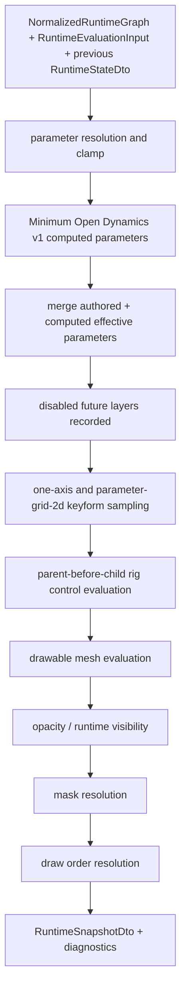

# Runtime Core Contract

> 状態: Draft / Review ready
> 出力先: discussion/design/module-contracts/runtime-core-contract.md
> 主な読者: runtime-core implementer / validator implementer / renderer-adapter implementer
> 主な所有module: `runtime-core`
> Source of truth: mixed
> 根拠: [../mvp-authoring-runtime/03-runtime-evaluation-semantics.md](../mvp-authoring-runtime/03-runtime-evaluation-semantics.md), [../module-contract-design-decisions.md](../module-contract-design-decisions.md), [../../scenarios/02_DomainAcceptanceCriteria/205_Parameter_and_Keyform_Semantics.md](../../scenarios/02_DomainAcceptanceCriteria/205_Parameter_and_Keyform_Semantics.md), [../../scenarios/02_DomainAcceptanceCriteria/204_Deformation_Control_Structure.md](../../scenarios/02_DomainAcceptanceCriteria/204_Deformation_Control_Structure.md)

## Purpose and Scope

This document fixes the Shared Runtime evaluation core contract:

- pure `evaluateRuntimeFrame(...)` / `evaluateRuntimeSequence(...)` API with explicit `RuntimeStateDto` input/output,
- `NormalizedRuntimeGraph` input shape,
- parameter input and clamp policy,
- one-axis keyform semantics,
- project-defined `parameter-grid-2d-v1` semantics,
- Minimum Open Dynamics v1 evaluation before keyform sampling,
- parent-before-child rig control hierarchy,
- runtime snapshot DTO,
- diagnostics phases,
- epsilon and deterministic comparison policy,
- disabled future layers.

It does not define renderer implementation, package file IO, or editor UI state.

## Basis Separation

### Repository Facts

- MVP requires Preview and Viewer to share runtime evaluation semantics.
- Runtime snapshots must expose evaluated drawable state, vertex/bounds/hash, opacity, visibility, draw order, mask state, and diagnostics.
- face yaw / pitch diagonal behavior is required by `AC-MVP-010`, `SC-MVP-002`, and `SC-PARAM-004`.
- Minimum Open Dynamics v1 is required for MVP secondary motion and must generate computed output parameters instead of directly changing mesh, rig control, or drawable state.

### Prior Design Decisions

- `parameter-grid-2d-v1` is MVP contract for two-axis keyform grids.
- Minimum Open Dynamics v1 is limited to `scalarDampedFollowV1` groups that read authoredInput parameters and write computedDynamics parameters.
- One-axis keyforms remain a separate evaluator.
- Parent-before-child rig control evaluation is required.
- `rotation2d` and `warpLattice2d` are MVP runtime-visible rig control nodes.
- Arbitrary N-dimensional keyform grids are not MVP.

### Assumptions

- CPU TypeScript evaluator is the first semantic source. Renderer/GPU paths must match snapshots within epsilon.
- Runtime core may return summary snapshots by default and full vertices for strict/contract tests.

## Contract Summary

| Contract | Owner module | Consumers | Source of truth | Artifact |
|----------|--------------|-----------|-----------------|----------|
| `RuntimeCore.evaluateRuntimeFrame` | `runtime-core` | editor preview, viewer, validator, AI | typescript | API |
| `RuntimeCore.evaluateRuntimeSequence` | `runtime-core` | validator, AI, fixtures | typescript | helper API |
| `NormalizedRuntimeGraph` | `runtime-core` | runtime evaluator | typescript | internal graph |
| `RuntimeEvaluationInput/Options/State` | `runtime-core` | viewer, validator, AI | zod | DTO |
| `RuntimeSnapshotDto` | `runtime-core` | renderer, validator, AI, fixtures | zod | snapshot JSON |
| keyform/rig control semantics | `runtime-core` | operation, validator, fixtures | mixed | evaluator contract |

## TypeScript / Zod Sketches

## Runtime API

```ts
import { z } from "zod";
import {
  DiagnosticSchema,
  DrawableId,
  DrawableIdSchema,
  MeshId,
  ParameterId,
  ParameterIdSchema,
  DynamicsGroupId,
  DynamicsGroupIdSchema,
  RigControlId,
  RigControlIdSchema,
  RuntimeSnapshotIdSchema,
  PackageIdSchema,
  Vec2,
  Vec2Schema,
  RectSchema,
  SnapshotDetailSchema,
  RuntimeEvaluationContextSchema,
  RuntimeResetReasonSchema,
  RuntimeStateDtoSchema,
  RuntimeSequenceFrameSchema,
} from "./contracts";

export const RuntimeInitialStateRequestSchema = z.object({
  packageId: PackageIdSchema,
  packageRevision: z.number().int().nonnegative(),
  packageHash: z.string().optional(),
  frameIndex: z.number().int().nonnegative().default(0),
  fixedStepMs: z.number().positive().default(16.6666667),
  authoredParameterValues: z.record(ParameterIdSchema, z.number().finite()).default({}),
  resetReasons: z.array(RuntimeResetReasonSchema).min(1),
});
export type RuntimeInitialStateRequestDto = z.infer<typeof RuntimeInitialStateRequestSchema>;

export interface RuntimeCore {
  createInitialRuntimeState(
    graph: NormalizedRuntimeGraph,
    request: RuntimeInitialStateRequestDto
  ): RuntimeStateDto;

  evaluateRuntimeFrame(
    graph: NormalizedRuntimeGraph,
    input: RuntimeEvaluationInputDto,
    previousState: RuntimeStateDto,
    options: RuntimeEvaluationOptionsDto,
    context: RuntimeEvaluationContextDto
  ): {
    snapshot: RuntimeSnapshotDto;
    nextState: RuntimeStateDto;
  };

  evaluateRuntimeSequence(
    graph: NormalizedRuntimeGraph,
    frames: readonly RuntimeSequenceFrameDto[],
    initialState: RuntimeStateDto,
    options: RuntimeEvaluationOptionsDto,
    context: RuntimeEvaluationContextDto
  ): {
    snapshots: readonly RuntimeSnapshotDto[];
    finalState: RuntimeStateDto;
  };

  compareRuntimeSnapshots(
    before: RuntimeSnapshotDto,
    after: RuntimeSnapshotDto,
    policy: SnapshotComparisonPolicy
  ): RuntimeComparisonResult;
}
```

## Normalized Runtime Graph

`NormalizedRuntimeGraph` is internal and TypeScript-owned. It is produced by package loader or authoring graph adapter.

```ts
export interface NormalizedRuntimeGraph {
  readonly packageId: string;
  readonly packageRevision: number;
  readonly packageHash?: string;
  readonly coordinateSystem: "canvas-y-down-v1";
  readonly parameters: ReadonlyMap<ParameterId, NormalizedParameter>;
  readonly dynamicsGroups: ReadonlyMap<DynamicsGroupId, NormalizedDynamicsGroup>;
  readonly drawables: ReadonlyMap<DrawableId, NormalizedDrawable>;
  readonly rigControls: ReadonlyMap<RigControlId, NormalizedRigControlNode>;
  readonly keyformBindings: readonly KeyformBinding[];
  readonly masks: readonly NormalizedMaskRelation[];
  readonly drawOrder: readonly NormalizedDrawOrderEntry[];
  readonly disabledFutureLayers: readonly DisabledFutureLayer[];
}

export interface NormalizedParameter {
  readonly id: ParameterId;
  readonly displayName: string;
  readonly semanticRole?: "eye" | "brow" | "mouth" | "face" | "body" | "arm" | "hair" | "dynamics" | "custom";
  readonly projectPresetAlias?: string;
  readonly valueSource: "authoredInput" | "computedDynamics" | "debugOverride";
  readonly min: number;
  readonly max: number;
  readonly default: number;
}

export interface NormalizedDynamicsGroup {
  readonly dynamicsGroupId: DynamicsGroupId;
  readonly displayName: string;
  readonly enabled: boolean;
  readonly solverKind: "scalarDampedFollowV1";
  readonly drivers: readonly {
    readonly driverId: string;
    readonly sourceParameterId: ParameterId;
    readonly inputScale: number;
    readonly inputOffset: number;
    readonly invert: boolean;
  }[];
  readonly output: {
    readonly outputId: string;
    readonly targetParameterId: ParameterId;
    readonly outputScale: number;
    readonly outputOffset: number;
    readonly min: number;
    readonly max: number;
    readonly clampPolicy: "clamp-to-output-range";
  };
  readonly settings: {
    readonly stiffness: number;
    readonly damping: number;
    readonly maxVelocity?: number;
    readonly maxAmplitude?: number;
  };
  readonly resetPolicy: "reset-on-load" | "reset-on-manual-command" | "reset-on-large-input-jump";
}

export type KeyformBinding =
  | Linear1dKeyformBinding
  | ParameterGrid2dKeyformBinding;

export interface Linear1dKeyformBinding {
  readonly evaluator: "linear-1d-v1";
  readonly targetId: string;
  readonly targetKind: "mesh" | "rigControl" | "drawable";
  readonly targetProperty: string;
  readonly parameterId: ParameterId;
  readonly keys: readonly OneAxisKey[];
  readonly compositionMode: "replace" | "additiveDelta" | "multiplyOpacity";
  readonly compositionOrder: number;
}

export interface ParameterGrid2dKeyformBinding {
  readonly evaluator: "parameter-grid-2d-v1";
  readonly targetId: string;
  readonly targetKind: "mesh" | "rigControl" | "drawable";
  readonly targetProperty: string;
  readonly parameterX: ParameterId;
  readonly parameterY: ParameterId;
  readonly interpolation: "bilinear-grid-v1";
  readonly clampPolicy: "clamp-to-parameter-range";
  readonly missingKeyPolicy: "diagnostic-error";
  readonly keys: readonly Grid2dKey[];
  readonly compositionMode: "replace" | "additiveDelta";
  readonly compositionOrder: number;
}

export interface OneAxisKey {
  readonly value: number;
  readonly statePatch: unknown;
}

export interface Grid2dKey {
  readonly x: number;
  readonly y: number;
  readonly statePatch: unknown;
}

export type NormalizedRigControlNode =
  | NormalizedRotation2dRigControl
  | NormalizedWarpLattice2dRigControl;
```

## Evaluation Input / Options

```ts
export const RuntimeEvaluationInputSchema = z.object({
  schemaVersion: z.literal("runtime-evaluation-input-v1"),
  frameIndex: z.number().int().nonnegative(),
  deltaTimeMs: z.number().finite().nonnegative(),
  resetReasons: z.array(RuntimeResetReasonSchema).default([]),
  authoredParameterValues: z.record(ParameterIdSchema, z.number().finite()).default({}),
  targetIds: z.array(z.string()).default([]),
});
export type RuntimeEvaluationInputDto = z.infer<typeof RuntimeEvaluationInputSchema>;

export const EpsilonPolicySchema = z.object({
  vertexPositionEpsilon: z.number().positive().default(0.0001),
  boundsEpsilon: z.number().positive().default(0.0001),
  opacityEpsilon: z.number().positive().default(0.000001),
  hashPrecisionDecimals: z.number().int().min(3).max(8).default(5),
});
export type EpsilonPolicyDto = z.infer<typeof EpsilonPolicySchema>;

export const RuntimeEvaluationOptionsSchema = z.object({
  schemaVersion: z.literal("runtime-evaluation-options-v1"),
  snapshotDetail: SnapshotDetailSchema,
  evaluatorVersions: z.object({
    dynamics: z.literal("scalarDampedFollowV1"),
    keyform1d: z.literal("linear-1d-v1"),
    keyformGrid2d: z.literal("parameter-grid-2d-v1"),
    warpLattice: z.literal("bilinear-grid-v1"),
    rigControlHierarchy: z.literal("parent-before-child-v1"),
  }),
  epsilonPolicy: EpsilonPolicySchema,
  includeTrace: z.boolean().default(false),
  maxSubSteps: z.number().int().min(1).max(16).default(4),
});
export type RuntimeEvaluationOptionsDto = z.infer<typeof RuntimeEvaluationOptionsSchema>;

// RuntimeStateDtoSchema, RuntimeDynamicsGroupStateSchema,
// RuntimeResetReasonSchema, RuntimeSequenceFrameSchema, and
// RuntimeEvaluationContextSchema are defined in typescript-contracts.md.
// Runtime Core owns the semantics below, not a second DTO definition.
export type RuntimeStateDto = z.infer<typeof RuntimeStateDtoSchema>;
export type RuntimeSequenceFrameDto = z.infer<typeof RuntimeSequenceFrameSchema>;
export type RuntimeEvaluationContextDto = z.infer<typeof RuntimeEvaluationContextSchema>;
```

`RuntimeStateDtoSchema` is defined in [typescript-contracts.md](typescript-contracts.md). This document is the semantic contract for how Runtime Core creates, accepts, repairs, and returns that DTO.

| RuntimeState field | Runtime Core semantic |
|--------------------|-----------------------|
| `schemaVersion` | Must be `"runtime-state-v1"`. |
| `packageId`, `packageRevision`, `packageHash` | State identity for the package graph that produced the state. Used to reject or reset stale state. |
| `frameIndex` | Last evaluated frame index represented by the state. Initial state uses the request frame or `0`. |
| `fixedStepMs` | Active Dynamics timestep. See Timestep policy below. |
| `accumulatorMs` | Unprocessed variable delta carried between fixed substeps. Initial state starts at `0`. |
| `dynamicsGroups` | One entry per active Dynamics group in the graph. Each group stores `position`, `velocity`, `tick`, and `resetCounter`. |

`RuntimeSequenceFrameDto` is the source-of-truth input for sequence preview, Dynamics sequence tests, acceptance runner playback, and `evaluateRuntimeSequence`. It contains only frame-local input. Runtime Core normalizes each frame into an internal `RuntimeEvaluationInputDto` by combining it with `RuntimeEvaluationContextDto`.

`RuntimeEvaluationContextDto` carries runtime execution context for both frame and sequence evaluation:

- `source.surface`
- `source.operationId`
- `policy.strictness`

Source surface, operation ID, caller identity, runtime mode, and profile must not be duplicated into `RuntimeSequenceFrameDto` or `RuntimeEvaluationInputDto`. This keeps one frame list reusable across preview, viewer, validator, AI dry-run, fixtures, and acceptance runs.

`RuntimeEvaluationContextSchema.policy` defaults to `{ strictness: "interactive" }`. A context such as `{ source: { surface: "preview" } }` is valid and means interactive preview evaluation.

`RuntimeEvaluationOptionsDto` is limited to technical evaluation options such as `snapshotDetail`, evaluator versions, epsilon policy, trace inclusion, and `maxSubSteps`. It must not define a competing runtime profile. During migration, any legacy `options.profile` must be derived from `RuntimeEvaluationContextDto`; if legacy profile and context conflict, Runtime Core emits `runtime.profileMismatch`. `RuntimeEvaluationProfileSchema` is deprecated and must not be used by new runtime, operation, AI, fixture, validator, or acceptance contracts; remove it once legacy `options.profile` and `runtime.profileMismatch` references disappear.

`RuntimeStateSequenceArtifact` represents replay evidence for a frame list. `states[0]` is the initial state before the first frame; for frame `i`, `states[i + 1]` is the state after evaluating `frames[i]`. `frameCount` is the number of evaluated `RuntimeSequenceFrameDto` entries, so `states.length = frameCount + 1` is a semantic rule. Runtime Core, validator, and fixtures must treat a mismatch as incomplete deterministic replay evidence and surface `runtime.stateSequenceLengthMismatch`.

For acceptance and exact deterministic replay, sequence artifacts should include `inputFramesHash`, `runtimeEvaluationContext`, and `evaluatorVersionSummary`. Interactive preview artifacts may omit those fields.

## Parameter / Keyform Evaluation Semantics

Runtime uses three parameter layers:

| Layer | Meaning |
|-------|---------|
| `authoredParameterValues` | Values directly supplied by user, Viewer, Editor preview, API, or AI dry-run. Only parameters with `valueSource="authoredInput"` are accepted here by default. |
| `computedParameterValues` | Values produced by Minimum Open Dynamics v1. Only parameters with `valueSource="computedDynamics"` may be written here. |
| `effectiveParameterValues` | Final values used by keyforms, `parameter-grid-2d-v1`, rigControl hierarchy, mesh, opacity, visibility, draw order, and mask evaluation. |

Evaluation rules:

1. Initialize each declared parameter to default.
2. Apply authored input overrides into `authoredParameterValues`.
3. Clamp authored values to parameter ranges for preview/viewer/AI dry-run and emit `runtime.parameterClamped`.
4. Evaluate Minimum Open Dynamics v1 from authored values, previous `RuntimeStateDto`, fixed timestep, and reset reasons.
5. Produce and clamp `computedParameterValues` for `computedDynamics` parameters.
6. Merge authored + computed values into `effectiveParameterValues`; debugOverride may override only in debug profiles and must be trace-visible.
7. Validator strict may report range violations as fail while still producing diagnostic evidence.
8. Evaluate one-axis bindings before `parameter-grid-2d-v1` only when `compositionOrder` says so. The order is numeric and deterministic.
9. Same target property with multiple writers requires explicit `compositionMode` and `compositionOrder`.

## Minimum Open Dynamics v1 Semantics

Minimum Open Dynamics v1 is a parameter-driven deterministic secondary motion layer. It uses `scalarDampedFollowV1` only in MVP.

Minimum Open Dynamics v1 is stateful, but Runtime Core must not own hidden mutable state. Every frame evaluation receives a previous `RuntimeStateDto` and returns both a `RuntimeSnapshotDto` and a next `RuntimeStateDto`. Editor preview, Private Viewer, Validator, and AI sequence preview must produce the same snapshot sequence for the same package, initial state, `RuntimeSequenceFrameDto[]`, fixedStepMs, options, and `RuntimeEvaluationContextDto`.

### Initial RuntimeState Creation

Runtime Core must expose `createInitialRuntimeState(graph, request)` for package load, preview restart, validation run start, and demo capture start. Operation and AI adapters may call the same function before `evaluateRuntimeFrame` / `evaluateRuntimeSequence` when no previous state is supplied.

`RuntimeInitialStateRequestSchema.resetReasons` requires at least one reason because initial state creation is always an explicit reset boundary. Regular `RuntimeSequenceFrameDto.resetReasons` defaults to `[]` because most frames continue from the previous `RuntimeStateDto` without resetting Dynamics.

Inputs:

- current `NormalizedRuntimeGraph`;
- package identity: `packageId`, `packageRevision`, and optional `packageHash`;
- `fixedStepMs`;
- reset reason(s), normally one of `packageLoad`, `previewRestart`, `validationRunStart`, or `demoCaptureStart`;
- initial `authoredParameterValues` used to compute each group target.

Creation rules:

- `schemaVersion = "runtime-state-v1"`.
- `frameIndex` is the request frame index, or `0`.
- `accumulatorMs = 0`.
- For every active dynamics group, compute `currentTarget` from the current authored driver values and output range.
- Each group state starts with `position = currentTarget`, `velocity = 0`, `tick = 0`, and `resetCounter = 1`.
- The initial state must include all dynamics groups in the current graph and no unknown groups.

State compatibility rules:

- If `previousState` is absent, callers must create an initial state before evaluation.
- If both `graph.packageHash` and `previousState.packageHash` exist, they must match exactly. Mismatch emits `runtime.statePackageMismatch`; strict / acceptance strictness fails or requires reset before using the stale state.
- If either package hash is missing, Runtime falls back to `packageId + packageRevision` comparison. If either fallback field differs, Runtime emits `runtime.statePackageMismatch`.
- If package hash is missing but `packageId + packageRevision` match, Runtime emits `runtime.statePackageHashUnavailable`. Interactive strictness may treat it as info; strict strictness warns; exact deterministic replay fixtures may make missing hash an acceptance failure unless the fixture explicitly declares hashless replay.
- If a graph group is missing from `previousState.dynamicsGroups`, Runtime initializes that group from `currentTarget` and emits `runtime.stateMissingDynamicsGroup`.
- If `previousState.dynamicsGroups` contains a group not present in the graph, Runtime ignores the unknown state and emits `runtime.stateUnknownDynamicsGroup`; strict strictness warns or fails when replay evidence depends on exact state equality.

Rules:

- One dynamics group produces exactly one computed output parameter in MVP.
- A computedDynamics parameter may have zero or one producer dynamics group. Duplicate output target parameter IDs across groups are invalid.
- Drivers may read only parameters whose `valueSource` is `authoredInput`.
- Outputs may write only parameters whose `valueSource` is `computedDynamics`.
- Dynamics output parameters cannot be drivers for the same or another dynamics group in MVP.
- Dynamics group dependencies are prohibited.
- Dynamics must not read mesh, rigControl, drawable, mask, or renderer state.
- Dynamics must not directly write mesh vertices, rigControl properties, drawable visibility, opacity, draw order, or mask state.
- Computed output parameters such as `hairSway`, `clothSway`, `ribbonSwing`, and `accessorySwing` feed ordinary keyform and rigControl evaluation.

Driver target computation:

```text
source = authoredParameterValues[sourceParameterId]
signed = invert ? -source : source
contribution = signed * inputScale + inputOffset
targetInput = sum(contribution for all drivers in declaration order)
rawTarget = targetInput * output.outputScale + output.outputOffset
target = clamp(rawTarget, output.min, output.max)
```

The output range must be inside the target parameter range:

```text
output.min >= targetParameter.min
output.max <= targetParameter.max
```

Solver settings:

```ts
{
  stiffness: number;
  damping: number;
  maxVelocity?: number;
  maxAmplitude?: number;
}
```

`response` is not runtime evaluator input and must not be saved as solver source of truth. A GUI may expose response only as a UI-only preset or derived description that writes concrete stiffness/damping/limit values.

Fixed `scalarDampedFollowV1` step:

```text
dt = fixedStepMs / 1000
acceleration = stiffness * (target - position) - damping * velocity
velocity = velocity + acceleration * dt

if maxVelocity is set:
  velocity = clamp(velocity, -maxVelocity, maxVelocity)

position = position + velocity * dt

if maxAmplitude is set:
  neutral = targetParameter.default
  position = clamp(position, neutral - maxAmplitude, neutral + maxAmplitude)

position = clamp(position, output.min, output.max)
position = clamp(position, targetParameter.min, targetParameter.max)

if position was clamped:
  velocity = 0

computedParameterValues[targetParameterId] = position
```

Clamp diagnostics:

- `dynamics.outputClamped` is emitted when runtime output, solver position, or final computed value is clamped.
- `dynamics.outputParameterOutOfRange` is emitted when the declared output range is outside the target parameter range.
- `dynamics.nanState` is blocking if position, velocity, target, or acceleration becomes NaN/Infinity.

Reset behavior:

```text
position = currentTarget
velocity = 0
tick = 0
resetCounter += 1
```

Dynamics reset snaps the group state to the target computed from current driver values. This avoids an artificial initial swing at preview start, validation run start, or demo capture start.

Reset reason mapping:

| Runtime reason | Applies package policy | Notes |
|----------------|------------------------|-------|
| `packageLoad` | `reset-on-load` | initial package/runtime load |
| `manualCommand` | `reset-on-manual-command` | explicit user or operation command |
| `previewRestart` | session reset | treated as manual preview reset; does not mutate package resetPolicy |
| `largeInputJump` | `reset-on-large-input-jump` | applies after configured large authored input jump detection |
| `validationRunStart` | validator-only reset | deterministic validation sequence start |
| `demoCaptureStart` | demo-only reset | visually stable deterministic capture start |

Timestep policy:

- Runtime uses fixed timestep for Dynamics. Raw variable `deltaTimeMs` is accumulated into fixed steps and is never passed directly to the solver.
- `RuntimeStateDto.fixedStepMs` is the active timestep for evaluation.
- Sequence or operation payload `fixedStepMs` is used only when creating an initial `RuntimeStateDto`.
- If `initialState` / `previousState` is supplied and its `fixedStepMs` differs from the request `fixedStepMs`, Runtime emits `dynamics.timestepMismatch`; strict / acceptance strictness fails when deterministic replay evidence is required.
- Default `fixedStepMs` is `16.6666667`.
- Default `maxSubSteps` is `4`.
- `RuntimeStateDto.accumulatorMs` stores remaining unprocessed time.

```text
accumulatorMs += deltaTimeMs
subSteps = floor(accumulatorMs / fixedStepMs)
actualSubSteps = min(subSteps, maxSubSteps)

for each actual substep:
  run scalarDampedFollowV1 step

accumulatorMs -= actualSubSteps * fixedStepMs
```

If `subSteps > maxSubSteps`, interactive preview emits `runtime.timestepOverflow` and processes only `maxSubSteps`; strict validator may fail deterministic replay with `runtime.timestepOverflow` or `dynamics.timestepMismatch`.

## Project-defined 2-axis Keyform Grid Semantics

`parameter-grid-2d-v1` represents the two-axis grid used for face yaw / pitch or eyeball X/Y style combinations.

| Rule | Contract |
|------|----------|
| axis count | exactly two parameters |
| key coordinate | `{ x: parameterXValue, y: parameterYValue }` |
| recommended MVP grid | 3 x 3, typically min/default/max on each axis |
| interpolation | `bilinear-grid-v1` |
| input outside range | clamp to parameter range and emit diagnostic |
| missing surrounding key | emit `keyform.grid2dMissingKey` error; strict profile fails |
| duplicate coordinate | emit `keyform.grid2dDuplicateKey` blocking diagnostic |
| 3+ parameters on same target grid | emit `keyform.tooManyParametersForMvp` warning/error by profile |

face yaw / pitch diagonal expression may be represented by:

- one `parameter-grid-2d-v1` binding on a target, or
- parent-child rig control hierarchy where one axis is on a parent and another is on a child.

Both must be visible in runtime snapshot and traceability.

### Negative Requirements

`parameter-grid-2d-v1` is not:

- view direction model.
- output view direction calculation.
- angle-based multi-view synthesis.
- influence degree calculation.
- rotation reference curve evaluation.
- automatic diagonal face generation.
- Cubism face-turn behavior reproduction.
- Cubism parameter semantics.

`faceYaw` and `facePitch` are project-defined scalar parameters. They do not imply camera direction, rendering direction, or view direction.

## RigControl Evaluation Semantics

```ts
export interface NormalizedRotation2dRigControl {
  readonly kind: "rotation2d";
  readonly rigControlId: RigControlId;
  readonly parentId?: RigControlId;
  readonly childDrawableIds: readonly DrawableId[];
  readonly childRigControlIds: readonly RigControlId[];
  readonly pivot: Vec2;
  readonly restAngleDegrees: number;
  readonly restTranslation: Vec2;
  readonly restScale: Vec2;
  readonly enabled: boolean;
}

export interface NormalizedWarpLattice2dRigControl {
  readonly kind: "warpLattice2d";
  readonly rigControlId: RigControlId;
  readonly parentId?: RigControlId;
  readonly childDrawableIds: readonly DrawableId[];
  readonly childRigControlIds: readonly RigControlId[];
  readonly bindSpace: "rigControlLocalRest";
  readonly domainBounds: { readonly x: number; readonly y: number; readonly width: number; readonly height: number };
  readonly latticeColumns: number;
  readonly latticeRows: number;
  readonly restControlPoints: readonly Vec2[];
  readonly interpolationMethod: "bilinear-grid-v1";
  readonly enabled: boolean;
}
```

RigControl rules:

- Topologically sort by parent-before-child.
- Cycle or missing child/parent is `blocking`.
- Child deformation never mutates parent state.
- `rotation2d` evaluates to a local affine transform.
- `warpLattice2d` evaluates control points and maps child vertices in `rigControlLocalRest`.
- Child vertex outside warp domain is `warning` unless strict profile escalates.

## Runtime Snapshot

```ts
export const EvaluatedParameterSchema = z.object({
  parameterId: ParameterIdSchema,
  valueSource: z.enum(["authoredInput", "computedDynamics", "debugOverride"]),
  authoredValue: z.number().finite().optional(),
  computedValue: z.number().finite().optional(),
  effectiveValue: z.number().finite(),
  clamped: z.boolean(),
  source: z.enum(["default", "viewerOverride", "editorPreviewOverride", "operationDryRun", "dynamicsComputed", "debugOverride"]),
});

export const EvaluatedDrawableSchema = z.object({
  drawableId: DrawableIdSchema,
  meshId: z.string(),
  visible: z.boolean(),
  opacity: z.number().min(0).max(1),
  baseDrawOrder: z.number().int(),
  evaluatedDrawOrder: z.number().int(),
  bounds: RectSchema,
  vertexCount: z.number().int().nonnegative(),
  vertexHash: z.string(),
  vertices: z.array(Vec2Schema).optional(),
  diagnostics: z.array(DiagnosticSchema).default([]),
});

export const KeyformSampleSchema = z.object({
  keyformSetId: z.string(),
  evaluator: z.enum(["linear-1d-v1", "parameter-grid-2d-v1"]),
  sampledCoordinates: z.record(z.string(), z.number().finite()),
  target: z.string(),
}).passthrough();

export const EvaluatedRigControlSchema = z.object({
  rigControlId: RigControlIdSchema,
  kind: z.enum(["rotation2d", "warpLattice2d"]),
  enabled: z.boolean(),
  parentId: RigControlIdSchema.optional(),
  bounds: RectSchema.optional(),
}).passthrough();

export const EvaluatedDynamicsGroupSchema = z.object({
  dynamicsGroupId: DynamicsGroupIdSchema,
  enabled: z.boolean(),
  solverKind: z.literal("scalarDampedFollowV1"),
  driverValues: z.record(ParameterIdSchema, z.number().finite()),
  outputParameterId: ParameterIdSchema,
  outputValue: z.number().finite(),
  stateSummary: z.object({
    position: z.number().finite(),
    velocity: z.number().finite(),
  }),
  tick: z.number().int().nonnegative(),
  fixedStepMs: z.number().positive(),
  resetCounter: z.number().int().nonnegative(),
  debug: z.object({
    rawTarget: z.number().finite().optional(),
    clampedTarget: z.number().finite().optional(),
    outputClamped: z.boolean().optional(),
    resetApplied: z.boolean().optional(),
    resetReasons: z.array(RuntimeResetReasonSchema).default([]),
  }).optional(),
  diagnostics: z.array(DiagnosticSchema).default([]),
});

export const EvaluatedMaskSchema = z.object({
  maskRelationId: z.string(),
  targetDrawableIds: z.array(DrawableIdSchema),
  resolved: z.boolean(),
}).passthrough();

export const RuntimeTraceSchema = z.object({
  phases: z.array(z.string()),
  evaluatorVersionSummary: z.record(z.string(), z.string()),
}).passthrough();

export const RuntimeSnapshotSchema = z.object({
  schemaVersion: z.literal("runtime-snapshot-v1"),
  runtimeCoreVersion: z.string(),
  snapshotId: RuntimeSnapshotIdSchema,
  context: RuntimeEvaluationContextSchema,
  packageId: PackageIdSchema,
  packageRevision: z.number().int().nonnegative(),
  packageHash: z.string().optional(),
  authoringRevision: z.number().int().nonnegative().optional(),
  dirty: z.boolean(),
  evaluation: z.object({
    snapshotDetail: SnapshotDetailSchema,
    evaluatorVersions: z.record(z.string(), z.string()),
  }),
  parameters: z.array(EvaluatedParameterSchema),
  dynamics: z.array(EvaluatedDynamicsGroupSchema).default([]),
  keyformSamples: z.array(KeyformSampleSchema).default([]),
  rigControls: z.array(EvaluatedRigControlSchema).default([]),
  drawables: z.array(EvaluatedDrawableSchema),
  masks: z.array(EvaluatedMaskSchema).default([]),
  drawList: z.array(DrawableIdSchema),
  disabledFutureLayers: z.array(z.string()).default([]),
  diagnostics: z.array(DiagnosticSchema),
  trace: RuntimeTraceSchema.optional(),
});
export type RuntimeSnapshotDto = z.infer<typeof RuntimeSnapshotSchema>;
```

For `targeted` and `full` snapshot detail, each evaluated dynamics group should include `debug.rawTarget`, `debug.clampedTarget`, `debug.outputClamped`, `debug.resetApplied`, and `debug.resetReasons` when the value is relevant to the requested target. `summary` snapshots may omit the `debug` object, but diagnostics must still explain clamping, timestep mismatch, missing state, or reset behavior.

`RuntimeDiffSchema` is defined in [typescript-contracts.md](typescript-contracts.md). Runtime Core must populate `dynamicsChanges` when comparing snapshots or stateful sequence results:

```ts
dynamicsChanges: Array<{
  dynamicsGroupId: DynamicsGroupId;
  outputParameterId?: ParameterId;
  stateChanged: boolean;
  outputChanged: boolean;
  positionBefore?: number;
  positionAfter?: number;
  velocityBefore?: number;
  velocityAfter?: number;
  tickBefore?: number;
  tickAfter?: number;
  resetCounterBefore?: number;
  resetCounterAfter?: number;
}>
```

## Diagram Requirements

The runtime pipeline diagram fixes evaluation order. Snapshot comparison remains defined by the tables and Zod sketch.

## Runtime Evaluation Pipeline



## Diagnostics Phases

| Phase | Example checks |
|-------|----------------|
| `parameter_resolution` | out-of-range raw input, missing parameter |
| `dynamics_evaluation` | missing driver/output, output used as driver, unstable setting, non-deterministic output |
| `keyform_sampling` | missing endpoint, grid2d missing key, duplicate coordinate |
| `rigControl_evaluation` | cycle, missing child, child outside warp domain, NaN transform |
| `mesh_evaluation` | triangle out of range, degenerate triangle, NaN vertex |
| `opacity_visibility` | opacity out of range, editor hide leak |
| `mask_resolution` | missing mask source, visibility false mask source, zero-area mask |
| `draw_order_resolution` | unstable tie, missing draw order |
| `render_preparation` | missing texture for visible drawable |

## Epsilon Policy

| Comparison | Default |
|------------|---------|
| vertex position | `0.0001` canvas units |
| bounds | `0.0001` canvas units |
| opacity | `0.000001` |
| hash precision | round to 5 decimal places before vertex hash |

Strict fixtures that compare full vertices must specify the epsilon policy used to create expected snapshots.

## Snapshot Comparison Rule

| Snapshot detail | Comparison |
|-----------------|------------|
| `summary` | package ID/revision, parameter values, draw list, bounds, vertex hashes, diagnostics |
| `targeted` | summary + full details for target IDs and selected dynamics groups |
| `full` | all vertices, masks, rig control states, dynamics driver/output/state/diagnostics, and trace |

Preview and Viewer equivalence in MVP can use `summary` for routine checks and `full` for contract tests.

## Disabled Future Layers

Motion, expression assets, full physics, pose, timeline, direct vertex physics, direct rigControl physics output, cloth simulation, collision, IK, and timeline bake are represented as disabled future layers in MVP snapshots if package metadata includes them. Presence alone is `info` / `not_applicable`; declaring them as required for MVP rendering is a warning/error by profile.

MVP hair/cloth/accessory sway is represented by Minimum Open Dynamics v1 computed output parameters plus ordinary keyforms and rigControls. Cubism Physics compatibility, `.physics3.json`, external solver compatibility, and Cubism Viewer matching remain outside MVP.

## Traceability

| Requirement | Contract element | Verification |
|-------------|------------------|--------------|
| AC-MVP-008, SC-PARAM-003 | one-axis keyform interpolation | `tutorial-like-authoring` snapshot |
| AC-PARAM-005, SC-PARAM-004 | `parameter-grid-2d-v1` | `manual-face-grid-2d` full snapshot |
| AC-MVP-009, SC-DEF-003 | parent-before-child rig control hierarchy | `parent-child-rigControl-diagonal` snapshot |
| AC-MVP-010, AC-PHYS-001..006, SC-DYN-001..004 | Minimum Open Dynamics v1 | `minimal-dynamics-hairSway`, `dynamics-reset-determinism` |
| AC-MVP-012, SC-MVP-003 | `RuntimeSnapshotDto` | viewer snapshot expected output |
| AC-MVP-015 | demo-safe capture separation, hidden internal names | demo-safe preflight fixture |
| AC-MVP-016 | disabled future layers + no Cubism Core dependency | package/runtime smoke fixture |

## Verification and Fixtures

| Fixture / Test | Purpose | Expected artifact |
|----------------|---------|-------------------|
| `minimal-valid-package` | load graph and produce non-empty snapshot | summary runtime snapshot |
| `manual-face-grid-2d` | verify diagonal interpolation and key coordinate handling | full runtime snapshot |
| `parent-child-rigControl-diagonal` | verify parent and child axis composition | targeted snapshot + runtime diff |
| `minimal-dynamics-hairSway` | faceYaw input sequence produces delayed/clamped hairSway output | snapshot sequence + runtime diff |
| `dynamics-reset-determinism` | reset policy and fixed timestep produce identical replay | paired `RuntimeStateSequenceArtifact` evidence with `states[0]` as initial state |
| `invalid-rigControl-cycle` | cycle blocks deterministic evaluation | validation report + no snapshot or blocking snapshot |
| `invalid-mask-reference` | mask diagnostics appear in runtime phase | snapshot diagnostics |
| `out-of-range-parameter-dry-run` | clamp warning and strict validation behavior | dry-run snapshot + report |

## Open Questions

| Question | Impact | Status |
|----------|--------|--------|
| Exact target-property patch representation for mesh/rig control states | can-defer | operation/runtime implementers must keep patch schemas aligned before coding |
| Whether child vertex outside warp domain escalates to fail in acceptance profile | can-defer | validator profile table decides severity |
| Full vertex storage size for snapshot artifacts | can-defer | `summary/targeted/full` contract allows selective storage |

## Handoff Checklist

- [x] Public API / DTO が示されている
- [x] Source of truth が契約ごとに明記されている
- [x] 依存方向、処理順序、状態遷移が必要な箇所に Mermaid 図がある
- [x] AC / scenario traceability がある
- [x] Fixture または expected output がある
- [x] 未決事項が implementation-blocking / can-defer に分かれている

## Review Requirements

Review this file for:

- `parameter-grid-2d-v1` consistency with operation and fixture contracts,
- parent-before-child rig control semantics,
- runtime-core isolation from package IO, renderer, editor-only state, and transport adapters.
