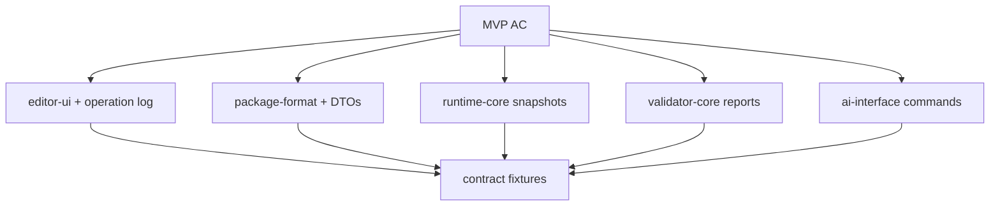

# Traceability Matrix

> 状態: Draft / Review ready
> 出力先: discussion/design/module-contracts/traceability-matrix.md
> 主な読者: implementation coordinator / reviewers / acceptance runner implementer
> 主な所有module: cross-cutting
> Source of truth: mixed
> 根拠: [../../acceptance-criteria/03_MVP_Acceptance_Criteria.md](../../acceptance-criteria/03_MVP_Acceptance_Criteria.md), [../../scenarios/03_MVP_Acceptance_Criteria.md](../../scenarios/03_MVP_Acceptance_Criteria.md), [../../scenarios/02_DomainAcceptanceCriteria/_map.md](../../scenarios/02_DomainAcceptanceCriteria/_map.md), all module contract files in this directory

## Purpose and Scope

This document maps MVP AC, domain AC, scenarios, modules, APIs, DTOs, diagnostics, fixtures, and expected outputs.

It is the first place a later implementer should check when asking: "Why does this type/API/fixture exist, and what proves it?"

## Basis Separation

### Repository Facts

- MVP AC defines 15 acceptance criteria for GUI authoring-to-runtime completion.
- Domain scenarios provide detailed operation examples for input, drawable, mesh, rig control, parameter, validator, Future integration surface, and AI agent interfaces.
- Contract documents in this directory define module boundaries and TypeScript/Zod sketches but do not implement code.

### Prior Design Decisions

- Traceability must connect AC, scenarios, operation flow, fixtures, and expected outputs.
- AC-only traceability is insufficient.
- Diagnostics and fixtures must be traceable to scenario expectations.

### Assumptions

- Traceability IDs may be expanded as new fixtures or implementation packages are created.
- Status `draft-covered` means the contract design covers the item; it does not mean implementation is complete.

## Contract Summary

| Contract | Owner module | Consumers | Source of truth | Artifact |
|----------|--------------|-----------|-----------------|----------|
| AC to module/API/type/test map | cross-cutting | implementation planner | this document | matrix |
| Scenario to operation flow | cross-cutting | GUI/AI/operation implementers | this document + scenario docs | matrix |
| Diagnostic to AC/scenario | `validator-core` | validator implementer | validator contract + this document | matrix |
| Fixture to expected output | `fixtures-contract-tests` | test implementer | fixture contract + this document | matrix |

## TypeScript / Zod Sketches

```ts
import { z } from "zod";

export const TraceStatusSchema = z.enum(["draft-covered", "gap", "implementation-blocking", "can-defer"]);

export const TraceabilityEntrySchema = z.object({
  requirementId: z.string(),
  requirementKind: z.enum(["mvp-ac", "domain-ac", "scenario", "diagnostic", "fixture"]),
  modules: z.array(z.string()),
  contractElements: z.array(z.string()),
  fixtures: z.array(z.string()).default([]),
  expectedOutputs: z.array(z.string()).default([]),
  status: TraceStatusSchema,
  notes: z.string().optional(),
});
export type TraceabilityEntryDto = z.infer<typeof TraceabilityEntrySchema>;
```

## Traceability

## AC -> Module / API / Type / Test

| AC / Scenario | Module | Contract element | Fixture / Test | Status |
|---------------|--------|------------------|----------------|--------|
| AC-MVP-001 | `editor-ui`, `operation-core`, `validator-core` | GUI event mapping, `OperationLogEntryDto`, `evidence.guiOperationLogMissing` | `tutorial-like-authoring`, `script-generated-minimal` | draft-covered |
| AC-MVP-002 | `package-format`, `validator-core` | provenance/rights DTOs, `setRightsMetadata` | `psd-import-happy-path` | draft-covered |
| AC-MVP-003 | `package-format`, `operation-core`, `editor-ui` | `importPsdSourceAsset`, `SourceManifestDto` | `psd-import-happy-path`, `psd-unsupported-layer`, `split-png-fallback` | draft-covered |
| AC-MVP-004 | `package-format`, `authoring-core`, `runtime-core` | `DrawableDto`, `MeshDto`, part/drawable refs | `minimal-valid-package` | draft-covered |
| AC-MVP-005 | `operation-core`, `runtime-core`, `validator-core` | `generateMesh`, `moveMeshVertex`, mesh checks | `invalid-mesh-triangle`, `ai-repair-dry-run` | draft-covered |
| AC-MVP-006 | `editor-ui`, `package-format`, `runtime-core` | editor-only state table, `setDrawOrder`, `setRuntimeVisibility` | `tutorial-like-authoring` | draft-covered |
| AC-MVP-007 | `operation-core`, `runtime-core`, `validator-core` | `setMaskRelation`, mask snapshot, mask checks | `invalid-mask-reference` | draft-covered |
| AC-MVP-008 | `operation-core`, `runtime-core` | `createParameter`, `addKeyform`, one-axis evaluator | `tutorial-like-authoring` | draft-covered |
| AC-MVP-009 | `operation-core`, `runtime-core`, `validator-core` | rig control operations, parent-before-child eval | `parent-child-rigControl-diagonal`, `invalid-rigControl-cycle` | draft-covered |
| AC-MVP-010 | `editor-ui`, `runtime-core`, `fixtures-contract-tests` | project-defined params, `parameter-grid-2d-v1`, Minimum Open Dynamics v1 computed output parameters | `tutorial-like-authoring`, `manual-face-grid-2d`, `minimal-dynamics-hairSway` | draft-covered |
| AC-MVP-011 | `editor-ui`, `package-format`, `runtime-core` | save/reload layout, preview snapshot | `tutorial-like-authoring` | draft-covered |
| AC-MVP-012 | `viewer-ui`, `runtime-core`, `renderer-adapter` | `RuntimeSnapshotDto`, parameter input | `minimal-valid-package`, `manual-face-grid-2d` | draft-covered |
| AC-MVP-013 | `validator-core` | `ValidationReportDto`, check registry | all invalid fixtures | draft-covered |
| AC-MVP-014 | `ai-interface`, `operation-core`, `runtime-core`, `validator-core` | AI command registry, dry-run, diffs, repair candidate | `ai-repair-dry-run`, `ai-screenshot-rigControl-parameter` | draft-covered |
| AC-MVP-015 | `validator-core`, `viewer-ui`, `ai-interface` | demo-safe capture separation, hidden internal names, rights/provenance display filter | `demo-safe-preflight` | draft-covered |
| AC-MVP-016 | all core modules | no Cubism required dependency, disabled future layers | `minimal-valid-package`, `script-generated-minimal` | draft-covered |

## Domain AC -> Contract Coverage

| Domain AC | Contract coverage | Fixture / expected output |
|-----------|-------------------|---------------------------|
| AC-IN-001/002/006 | PSD source profile, split PNG fallback, source provenance | `psd-import-happy-path`, `psd-unsupported-layer` |
| AC-DRAW-001..004 | drawable/part/mask/draw order DTOs and operations | `minimal-valid-package`, `invalid-mask-reference` |
| AC-MESH-001..004 | mesh DTO, mesh operation, mesh validator checks | `invalid-mesh-triangle`, `ai-repair-dry-run` |
| AC-DEF-001..005 | rig control operation/graph/runtime/validator contracts | `parent-child-rigControl-diagonal`, `invalid-rigControl-cycle` |
| AC-PARAM-001..007 | parameter DTO, one-axis keyform, grid2d evaluator | `tutorial-like-authoring`, `manual-face-grid-2d` |
| AC-PART-001/002/004 | editor-only/runtime-visible split and draw order | `tutorial-like-authoring` |
| AC-FACE-001/003/004/007/008 | project-defined params, keyforms, manual face grid | `tutorial-like-authoring`, `manual-face-grid-2d` |
| AC-BODY-001/002/003/005 | body/arm/hair rig control/keyform flow | `tutorial-like-authoring`, `parent-child-rigControl-diagonal` |
| AC-PHYS-001..006 | Minimum Open Dynamics v1 package/runtime/validator/demo contract | `minimal-dynamics-hairSway`, `invalid-dynamics-cycle`, `dynamics-output-range-clamp`, `dynamics-reset-determinism`, `demo-safe-dynamics-capture` |
| AC-EXPORT-001/002/004/005/006 | package layout, save/reload, Cubism non-dependency | `minimal-valid-package` |
| AC-VERIFY-001..006 | inspect, snapshot, diff, AI-readable report | `ai-repair-dry-run` |
| AC-AI-001..007 | operation command, stable ID, response, provenance | `ai-screenshot-rigControl-parameter`, `ai-repair-dry-run` |
| AC-FORMAT-001..005 | Zod DTOs, package layout, versioning, refs | `minimal-valid-package` |
| AC-RUNTIME-001..005 | runtime API, parameter state, snapshot | `minimal-valid-package`, `manual-face-grid-2d` |
| AC-RUNTIME-001..005 + AC-PHYS-003/004 | fixed timestep dynamics evaluation and snapshot sequence | `minimal-dynamics-hairSway`, `dynamics-reset-determinism` |
| AC-VALIDATOR-001..005 | check registry, report schema | all invalid fixtures |
| AC-API-001/002/004/005 | command grouping and adapter classification | AI command transcript fixtures |
| AC-AGENT-001..005 | AI inspect/operation/diff/test/repair contracts | `ai-repair-dry-run` |
| AC-SAMPLE-001/004/005 | rights-clean fixture and failure samples | fixture manifest |
| AC-RIGHTS-001..005 | rights/provenance metadata and public artifact hygiene | `psd-import-happy-path` |

### Per-ID Domain AC Audit Supplement

| Domain AC | Contract element | Fixture / expected output | Status |
|-----------|------------------|---------------------------|--------|
| AC-RIGHTS-002 | provenance/rights DTOs | `psd-import-happy-path` | draft-covered |
| AC-RIGHTS-003 | Cubism/proprietary compatibility excluded from MVP success | `script-generated-minimal`, `minimal-valid-package` | draft-covered |
| AC-IN-003 | project-defined model package load path | `minimal-valid-package` | draft-covered |
| AC-IN-004 | Cubism runtime package excluded from input/analysis scope | no MVP fixture; documented out-of-scope rule | satisfied-by-policy |
| AC-IN-005 | `.cmo3` independent read/write excluded | no MVP fixture; acceptance non-goal check | draft-covered |
| AC-DEF-002 | local/global deformation split | `parent-child-rigControl-diagonal` | draft-covered |
| AC-DEF-003 | rotation vs warp distinction | `parent-child-rigControl-diagonal` | draft-covered |
| AC-PARAM-002 | parameter min/max/default | `tutorial-like-authoring` | draft-covered |
| AC-PARAM-003 | keyform persistence | `tutorial-like-authoring`, `manual-face-grid-2d` | draft-covered |
| AC-PARAM-004 | interpolation/intermediate state | `tutorial-like-authoring` | draft-covered |
| AC-PARAM-007 | parameter-driven validation | `out-of-range-parameter-dry-run`, `keyform-grid-overdimension` | draft-covered |
| AC-AI-003 | structured operation response | `ai-repair-dry-run` | draft-covered |
| AC-AI-004 | AC/scenario constrained search | `ai-repair-dry-run`, trace matrix itself | draft-covered |
| AC-AI-005 | AI review support | `ai-repair-dry-run` | draft-covered |
| AC-AI-006 | human/AI convergence through operation-core | `tutorial-like-authoring`, `ai-repair-dry-run` | draft-covered |
| AC-AI-007 | AI provenance | `ai-repair-dry-run` | draft-covered |
| AC-AGENT-004 | scenario-based test execution | traceability-lint, command transcript fixture | draft-covered |
| AC-AGENT-005 | repair suggestion and provenance | `ai-repair-dry-run` | draft-covered |
| AC-VALIDATOR-002 | asset reference validation | `invalid-missing-texture` | draft-covered |
| AC-VALIDATOR-003 | mesh/drawable validation | `invalid-mesh-triangle` | draft-covered |
| AC-VALIDATOR-004 | runtime load test | `runtime-load-blocking`, `minimal-valid-package` | draft-covered |

## Scenario -> Operation Flow

| Scenario | Operation flow | Runtime / validation output |
|----------|----------------|-----------------------------|
| SC-MVP-001 | `importPsdSourceAsset` -> `createDrawable` -> `generateMesh` -> `setDrawOrder` -> `setMaskRelation` | package diff, validation report |
| SC-MVP-002 | `createParameter` -> `addKeyform` -> rig control operations -> `addKeyformGrid2d` -> dynamics operations | preview/full snapshots |
| SC-MVP-003 | save package -> reload -> viewer `getRuntimeSnapshot` | viewer snapshot, no Cubism dependency |
| SC-MVP-004 | `validatePackage` -> `inspectModel` -> `dryRunOperation` -> `getDiff` -> `createRepairCandidate` | report + model/runtime/validation diffs |
| SC-MVP-005 | acceptance validation over package/evidence | `evidence.guiOperationLogMissing` for script-only package |
| SC-IN-001 | `importPsdSourceAsset` single-layer profile -> `createDrawable` -> `generateMesh` | source layer mapping + mesh placeholder |
| SC-IN-002 | PSD import mapping to parts/drawables | source manifest + package diff |
| SC-IN-003 | PSD unsupported features | diagnostic report |
| SC-IN-004 | `.cmo3` input attempt is rejected or classified as unsupported non-MVP input | no load/inspect/convert/migrate path |
| SC-IN-005 | Cubism runtime package is not loaded, inspected, registered, converted, or migrated | unsupported input diagnostics only |
| SC-IN-006 | PSD add/replace keeps source asset correspondence | source manifest revision + provenance diff |
| SC-IN-007 | texture atlas metadata checked before package output | asset/texture validation report |
| SC-IN-008 | existing project-defined model package load/inspect | package load report + runtime snapshot |
| SC-PARAM-001 | `createParameter` with private `projectPresetAlias`, `semanticRole`, and min/default/max | parameter DTO validation |
| SC-PARAM-005 | evaluate multiple parameter overrides together | runtime snapshot and parameter state |
| SC-PARAM-006 | inspect private `projectPresetAlias` and semantic role | model inspection response |
| SC-PARAM-007 | detect single-key/endpoint-missing keyform | `keyform.missingEndpoint` report |
| SC-PARAM-004 | `addKeyformGrid2d` for two parameters and 3x3 grid | full snapshot at diagonal/corner points |
| SC-DYN-001 | `createDynamicsGroup` -> `bindDynamicsDriver` -> `bindDynamicsOutput` -> `setDynamicsSettings` | package diff + validation report |
| SC-DYN-002 | `resetDynamicsPreviewState` -> `runDynamicsPreviewSequence` with initial RuntimeStateDto -> run `RuntimeSequenceFrameDto[]` fixed-step input sequence in Editor preview and Viewer using `RuntimeEvaluationContextDto` | matching snapshot sequence + `RuntimeStateArtifactRefSchema` refs + optional `RuntimeStateSequenceArtifactRefSchema` refs with `states[0]` initial / `states[i + 1]` post-frame semantics + `finalRuntimeState` |
| SC-DYN-003 | validate dynamics graph and sequence | dynamics check report |
| SC-DYN-004 | demo-safe preflight for secondary motion | demo-safe report |
| SC-DEF-002 | `createRotation2dRigControl` for head pivot | operation result + snapshot |
| SC-DEF-003 | `bindRigControlChild` then evaluate parent/child | targeted runtime snapshot |
| SC-DEF-004 | rotation parent plus warp child | parent-before-child runtime snapshot |
| SC-AI-001 | `inspectModel` -> `getRuntimeSnapshot` -> `validatePackage` | operation report / command transcript |
| SC-AI-002 | inspect/search target -> dry-run stable ID edit -> runtime check | operation result + runtime diff |
| SC-AI-003 | dry-run repair -> evaluate -> validate -> explain impact | repair candidate + diffs |
| SC-AI-004 | retrieve AC/scenario/check constraints before edit proposal | traceability report + repair rationale |
| SC-AI-005 | compare GUI and AI operations by diff/provenance | operation log + AI command transcript |
| SC-AGENT-001 | `inspectModel` + `getRuntimeSnapshot` + `validatePackage` | model inspection response |
| SC-AGENT-002 | AI operation command -> preview -> validation -> save candidate | dry-run response + report |
| SC-AGENT-003 | `getDiff` for model/runtime/validation | expected diff artifacts |
| SC-AGENT-004 | scenario-based test execution command | scenario evidence report |
| SC-AGENT-005 | `createRepairCandidate` with provenance | repair candidate artifact |

## Diagnostic -> AC / Scenario

| Diagnostic check | Related AC / Scenario | Expected fixture |
|------------------|-----------------------|------------------|
| `pkg.schema.requiredFileMissing` | AC-MVP-013, SC-VALIDATOR-001 | `runtime-load-blocking` |
| `asset.psd.unsupportedFeature` | AC-MVP-003, SC-IN-003 | `psd-unsupported-layer` |
| `rights.provenanceMissing` | AC-MVP-002, AC-RIGHTS-002, SC-RIGHTS-002 | `rights-provenance-missing` |
| `ref.drawableTextureMissing` | AC-MVP-004, AC-VALIDATOR-002, SC-VALIDATOR-002 | `invalid-missing-texture` |
| `mesh.triangleIndexOutOfRange` | AC-MVP-005, SC-MESH-006 | `invalid-mesh-triangle` |
| `mesh.degenerateTriangle` | AC-MVP-005, SC-MESH-006 | `invalid-mesh-triangle` |
| `runtime.parameterClamped` | AC-MVP-012, SC-RUNTIME-002 | `out-of-range-parameter-dry-run` |
| `keyform.missingEndpoint` | AC-MVP-008, SC-PARAM-007 | `keyform-missing-endpoint` |
| `keyform.grid2dMissingKey` | AC-PARAM-005, SC-PARAM-004 | `keyform-grid-invalid` |
| `keyform.grid2dDuplicateKey` | AC-PARAM-005, SC-PARAM-004 | `keyform-grid-invalid` |
| `keyform.tooManyParametersForMvp` | AC-MVP-010, SC-PARAM-005 | `keyform-grid-overdimension` |
| `rigControl.cycle` | AC-MVP-009, SC-DEF-006 | `invalid-rigControl-cycle` |
| `rigControl.childOutsideWarpDomain` | AC-DEF-005, SC-DEF-005 | `parent-child-out-of-domain` |
| `dynamics.driverMissing` | AC-PHYS-002, SC-DYN-003 | `invalid-dynamics-missing-driver` |
| `dynamics.outputMissing` | AC-PHYS-002, SC-DYN-003 | `invalid-dynamics-missing-output` |
| `dynamics.outputTargetDuplicate` | AC-PHYS-002, SC-DYN-003 | `invalid-dynamics-output-target-duplicate` |
| `dynamics.driverMustBeAuthoredInput` | AC-PHYS-002, SC-DYN-003 | `invalid-dynamics-missing-driver` |
| `dynamics.outputMustBeComputedParameter` | AC-PHYS-002, SC-DYN-003 | `invalid-dynamics-missing-output` |
| `dynamics.computedParameterProducerMissing` | AC-PHYS-002, SC-DYN-003 | `invalid-dynamics-missing-output` |
| `dynamics.outputParameterOutOfRange` | AC-PHYS-003, SC-DYN-003 | `dynamics-output-range-clamp` |
| `dynamics.outputClamped` | AC-PHYS-003, SC-DYN-003 | `dynamics-output-range-clamp` |
| `dynamics.outputUsedAsDriver` | AC-PHYS-002, SC-DYN-003 | `invalid-dynamics-cycle` |
| `dynamics.groupCycle` | AC-PHYS-002, SC-DYN-003 | `invalid-dynamics-cycle` |
| `dynamics.nanState` | AC-PHYS-003, SC-DYN-003 | `invalid-dynamics-cycle` |
| `dynamics.unstableSettings` | AC-PHYS-003, SC-DYN-003 | `dynamics-output-range-clamp` |
| `dynamics.excessiveAmplitude` | AC-PHYS-003, SC-DYN-003 | `dynamics-output-range-clamp` |
| `dynamics.nonDeterministicSnapshot` | AC-PHYS-004, SC-DYN-002 | `dynamics-reset-determinism` |
| `dynamics.resetPolicyMissing` | AC-PHYS-001, SC-DYN-001 | `invalid-dynamics-missing-output` |
| `runtime.statePackageMismatch` | AC-PHYS-004, SC-DYN-002 | `dynamics-fixed-step-replay` stale state case |
| `runtime.statePackageHashUnavailable` | AC-PHYS-004, SC-DYN-002 | `dynamics-fixed-step-replay` hashless replay case |
| `runtime.stateMissingDynamicsGroup` | AC-PHYS-004, SC-DYN-002 | `dynamics-reset-determinism` missing group case |
| `runtime.stateUnknownDynamicsGroup` | AC-PHYS-004, SC-DYN-002 | `dynamics-reset-determinism` stale group case |
| `dynamics.timestepMismatch` | AC-PHYS-004, SC-DYN-002 | `dynamics-reset-determinism` |
| `runtime.timestepOverflow` | AC-PHYS-004, SC-DYN-002 | `dynamics-fixed-step-replay` |
| `dynamics.requiredGroupMissing` | AC-PHYS-001, SC-DYN-003 | `minimal-dynamics-hairSway` acceptance metadata |
| `dynamics.demoUnsafeInternalName` | AC-PHYS-006, SC-DYN-004 | `demo-safe-dynamics-capture` |
| `mask.sourceMissing` | AC-MVP-007, SC-PART-004 | `invalid-mask-reference` |
| `mask.opacityZeroSource` | AC-MVP-007, SC-DRAW-005 | `invalid-mask-reference` |
| `runtime.loadBlocking` | AC-MVP-012, SC-RUNTIME-001 | `runtime-load-blocking` |
| `runtime.drawListEmpty` | AC-MVP-012, SC-MVP-003 | `runtime-load-blocking` |
| `evidence.guiOperationLogMissing` | AC-MVP-001, SC-MVP-005 | `script-generated-minimal` |
| `ai.dryRunMutatedPackage` | AC-MVP-014, SC-AGENT-002 | `ai-invalid-mutation` |

## Fixture -> Expected Output

| Fixture | Expected output | Contract proving |
|---------|-----------------|------------------|
| `minimal-valid-package` | pass report, summary snapshot | package/runtime/validator handshake |
| `psd-import-happy-path` | operation result, package diff, rights/provenance report | PSD primary source import |
| `psd-unsupported-layer` | unsupported feature diagnostic | PSD profile boundaries |
| `split-png-fallback` | fallback provenance warning | split PNG non-primary compatibility |
| `tutorial-like-authoring` | GUI operation log, full snapshot, validation report | MVP GUI authoring evidence |
| `manual-face-grid-2d` | full snapshot at 2D parameter values | manual face grid semantics |
| `minimal-dynamics-hairSway` | snapshot sequence + initial/final runtime state refs showing delayed/clamped computed output parameter | Minimum Open Dynamics v1 |
| `invalid-dynamics-missing-driver` | error report | dynamics driver reference/type validation |
| `invalid-dynamics-missing-output` | error report | dynamics computed output validation |
| `invalid-dynamics-cycle` | blocking report | dynamics dependency validation |
| `invalid-dynamics-output-target-duplicate` | error report | one computed output producer rule |
| `dynamics-output-range-clamp` | clamped output snapshot + diagnostic | dynamics output range validation |
| `dynamics-reset-determinism` | paired snapshot/runtime state sequence equality report | fixed timestep/reset determinism |
| `dynamics-fixed-step-replay` | `runtime/states/initial.runtime-state.json`, `runtime/state-sequences/expected.runtime-state-sequence.json`, final RuntimeStateDto, no `runtime.stateSequenceLengthMismatch`, and snapshot sequence | explicit runtime state replay |
| `demo-safe-dynamics-capture` | demo preflight report | dynamics demo hygiene |
| `keyform-grid-invalid` | missing/duplicate grid key validation report | two-axis grid validation |
| `keyform-missing-endpoint` | endpoint warning/fail validation report | one-axis keyform validation |
| `parent-child-rigControl-diagonal` | targeted snapshot/diff | parent-child diagonal expression |
| `invalid-mesh-triangle` | `mesh.triangleIndexOutOfRange` blocking report | mesh validation |
| `invalid-missing-texture` | validation fail | asset reference validation |
| `invalid-rigControl-cycle` | blocking report | rig control topology validation |
| `invalid-mask-reference` | fail report | mask validation |
| `rights-provenance-missing` | rights/provenance fail report | rights hygiene validation |
| `keyform-grid-overdimension` | too-many-parameters needs_review/fail report | MVP grid limitation |
| `parent-child-out-of-domain` | warp-domain warning / needs_review report | rig control quality validation |
| `runtime-load-blocking` | runtime load blocking report | runtime validator gate |
| `ai-invalid-mutation` | AI dry-run mutation fail report | AI safety gate |
| `out-of-range-parameter-dry-run` | clamped snapshot + validation diff | external input handling |
| `ai-repair-dry-run` | command transcript, diffs, repair candidate | AI dry-run/approval |
| `script-generated-minimal` | acceptance fail for missing GUI operation log | GUI evidence requirement |
| `gui-hit-test-rigControl` | hit-test response with stable `RigControlId` target | GUI semantic target selection |
| `ai-screenshot-rigControl-parameter` | command sequence using screenshot plus semantic APIs | AI observe/inspect/dry-run flow |

## High-level Coverage Overview



## Gaps and Missing Contracts

| Gap | Impact | Status |
|-----|--------|--------|
| Exact implementation package paths | can-defer | module ownership is fixed; paths can be set during scaffolding |
| Exact source art bytes for PSD fixtures | can-defer | fixture manifest/provenance contract fixed |
| Full JSON Schema publication | can-defer | Zod source-of-truth fixed |
| Transport endpoint paths | can-defer | command DTOs are transport-independent |

No current gap is classified as `implementation-blocking` for starting module scaffolding, provided implementers treat these documents as the contract source.

## Diagram Requirements

The coverage diagram summarizes high-level AC-to-module coverage. Detailed traceability is defined by the matrices above.

## Verification and Fixtures

| Fixture / Test | Purpose | Expected artifact |
|----------------|---------|-------------------|
| traceability-lint | every fixture and check has at least one AC/scenario link | generated trace report |
| contract-doc-lint | every contract document has mandatory sections | review checklist |
| check-registry-lint | every diagnostic in fixtures exists in validator registry | registry report |

## Open Questions

| Question | Impact | Status |
|----------|--------|--------|
| Whether Domain AC changes proposed in MVP AC should be applied before implementation | can-defer | current matrix references existing MVP AC/domain AC IDs |
| Whether acceptance runner gets its own contract doc later | can-defer | validator contract includes acceptance profile |

## Handoff Checklist

- [x] Public API / DTO が示されている
- [x] Source of truth が契約ごとに明記されている
- [x] 依存方向、処理順序、状態遷移が必要な箇所に Mermaid 図がある
- [x] AC / scenario traceability がある
- [x] Fixture または expected output がある
- [x] 未決事項が implementation-blocking / can-defer に分かれている

## Review Requirements

Review this file for:

- AC/scenario links that stop at AC only and miss operation/fixture output,
- diagnostics without scenario coverage,
- fixtures without expected output,
- missing MVP AC coverage.
