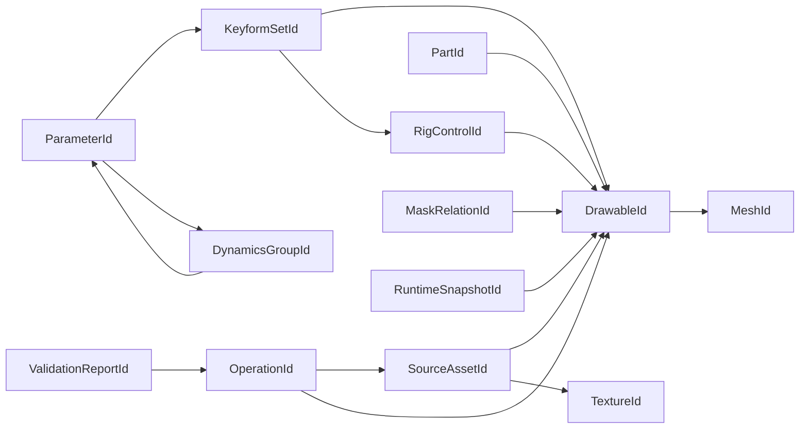
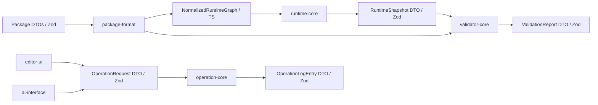

# TypeScript Contracts

> 状態: Draft / Review ready
> 出力先: discussion/design/module-contracts/typescript-contracts.md
> 主な読者: contracts implementer / all module implementers / reviewer
> 主な所有module: `contracts`
> Source of truth: mixed
> 根拠: [module-boundaries.md](module-boundaries.md), [../module-contract-design-decisions.md](../module-contract-design-decisions.md), [../mvp-authoring-runtime/01-open-model-package-design.md](../mvp-authoring-runtime/01-open-model-package-design.md), [../mvp-authoring-runtime/03-runtime-evaluation-semantics.md](../mvp-authoring-runtime/03-runtime-evaluation-semantics.md)

## Purpose and Scope

This document fixes shared TypeScript and Zod contract sketches used by the rest of `module-contracts/`.

It covers:

- branded stable IDs,
- scalar/vector/rect primitives,
- common enums,
- shared diagnostics,
- shared model/runtime/validation diff envelopes,
- DTO index names used by package, operation, runtime, validator, GUI, and AI contracts.

It does not implement algorithms, Zod refinements, JSON Schema generation, renderer backends, or file IO.

## Basis Separation

### Repository Facts

- MVP package, operation log, validation report, runtime snapshot, and AI command artifacts must all reference the same stable IDs.
- Runtime-visible state and Editor-only state are intentionally different.
- Validator, Viewer, AI Agent, and Acceptance Runner need the same diagnostic vocabulary.

### Prior Design Decisions

- External boundary DTOs use Zod as source of truth.
- Internal domain types use TypeScript `type` / `interface` as source of truth.
- JSON Schema is generated or post-MVP/public-spec support, not the MVP source of truth.

### Assumptions

- Branded IDs are strings at runtime and should validate by prefix at external boundaries.
- ID generation must be collision-safe, but the generator implementation is outside this document.

## Contract Summary

| Contract | Owner module | Consumers | Source of truth | Artifact |
|----------|--------------|-----------|-----------------|----------|
| Branded IDs | `contracts` | all | typescript + zod prefix schemas | type/schema |
| Geometry primitives | `contracts` | package, runtime, renderer | zod for DTO, typescript for internal math | DTO/internal |
| Common diagnostic vocabulary | `contracts` | runtime, validator, editor, AI | zod | DTO |
| Model/runtime/validation diff envelopes | `contracts` | operation, AI, validator | zod | DTO |
| DTO index names | `contracts` | all | this document | naming contract |

## TypeScript / Zod Sketches

## Branded IDs

```ts
import { z } from "zod";

export type Brand<T, BrandName extends string> = T & { readonly __brand: BrandName };

export type PackageId = Brand<string, "PackageId">;
export type SourceAssetId = Brand<string, "SourceAssetId">;
export type TextureId = Brand<string, "TextureId">;
export type PartId = Brand<string, "PartId">;
export type DrawableId = Brand<string, "DrawableId">;
export type MeshId = Brand<string, "MeshId">;
export type VertexId = Brand<string, "VertexId">;
export type ParameterId = Brand<string, "ParameterId">;
export type KeyformSetId = Brand<string, "KeyformSetId">;
export type RigControlId = Brand<string, "RigControlId">;
export type DynamicsGroupId = Brand<string, "DynamicsGroupId">;
export type MaskRelationId = Brand<string, "MaskRelationId">;
export type OperationId = Brand<string, "OperationId">;
export type TransactionId = Brand<string, "TransactionId">;
export type ValidationReportId = Brand<string, "ValidationReportId">;
export type RuntimeSnapshotId = Brand<string, "RuntimeSnapshotId">;
export type RepairCandidateId = Brand<string, "RepairCandidateId">;
export type ProvenanceId = Brand<string, "ProvenanceId">;

export const PackageIdSchema = z.string().regex(/^pkg_[A-Za-z0-9_-]+$/) as z.ZodType<PackageId>;
export const SourceAssetIdSchema = z.string().regex(/^src_[A-Za-z0-9_-]+$/) as z.ZodType<SourceAssetId>;
export const TextureIdSchema = z.string().regex(/^tex_[A-Za-z0-9_-]+$/) as z.ZodType<TextureId>;
export const PartIdSchema = z.string().regex(/^part_[A-Za-z0-9_-]+$/) as z.ZodType<PartId>;
export const DrawableIdSchema = z.string().regex(/^draw_[A-Za-z0-9_-]+$/) as z.ZodType<DrawableId>;
export const MeshIdSchema = z.string().regex(/^mesh_[A-Za-z0-9_-]+$/) as z.ZodType<MeshId>;
export const VertexIdSchema = z.string().regex(/^vtx_[A-Za-z0-9_-]+$/) as z.ZodType<VertexId>;
export const ParameterIdSchema = z.string().regex(/^param_[A-Za-z0-9_-]+$/) as z.ZodType<ParameterId>;
export const KeyformSetIdSchema = z.string().regex(/^keyset_[A-Za-z0-9_-]+$/) as z.ZodType<KeyformSetId>;
export const RigControlIdSchema = z.string().regex(/^rig_[A-Za-z0-9_-]+$/) as z.ZodType<RigControlId>;
export const DynamicsGroupIdSchema = z.string().regex(/^dyn_[A-Za-z0-9_-]+$/) as z.ZodType<DynamicsGroupId>;
export const MaskRelationIdSchema = z.string().regex(/^maskrel_[A-Za-z0-9_-]+$/) as z.ZodType<MaskRelationId>;
export const OperationIdSchema = z.string().regex(/^op_[A-Za-z0-9_-]+$/) as z.ZodType<OperationId>;
export const TransactionIdSchema = z.string().regex(/^txn_[A-Za-z0-9_-]+$/) as z.ZodType<TransactionId>;
export const ValidationReportIdSchema = z.string().regex(/^val_[A-Za-z0-9_-]+$/) as z.ZodType<ValidationReportId>;
export const RuntimeSnapshotIdSchema = z.string().regex(/^snap_[A-Za-z0-9_-]+$/) as z.ZodType<RuntimeSnapshotId>;
export const RepairCandidateIdSchema = z.string().regex(/^repair_[A-Za-z0-9_-]+$/) as z.ZodType<RepairCandidateId>;
export const ProvenanceIdSchema = z.string().regex(/^prov_[A-Za-z0-9_-]+$/) as z.ZodType<ProvenanceId>;
```

ID ownership:



## Common Scalar / Vector Types

```ts
export const FiniteNumberSchema = z.number().finite();

export const Vec2Schema = z.object({
  x: FiniteNumberSchema,
  y: FiniteNumberSchema,
});
export type Vec2Dto = z.infer<typeof Vec2Schema>;

export const RectSchema = z.object({
  x: FiniteNumberSchema,
  y: FiniteNumberSchema,
  width: FiniteNumberSchema.nonnegative(),
  height: FiniteNumberSchema.nonnegative(),
});
export type RectDto = z.infer<typeof RectSchema>;

export const Transform2DSchema = z.object({
  translation: Vec2Schema,
  rotationDegrees: FiniteNumberSchema,
  scale: Vec2Schema,
});
export type Transform2DDto = z.infer<typeof Transform2DSchema>;

export interface Vec2 {
  readonly x: number;
  readonly y: number;
}

export interface Bounds2D {
  readonly min: Vec2;
  readonly max: Vec2;
}
```

`Vec2Dto` and `RectDto` are external boundary DTOs. Runtime math may use optimized internal `Vec2` or arrays, but snapshots and package files use the DTO schemas.

## Common Enums

```ts
export const SurfaceSchema = z.enum([
  "gui",
  "file",
  "structuredApi",
  "schemaMigration",
  "validatorRepair",
  "testFixture",
]);
export type Surface = z.infer<typeof SurfaceSchema>;

export const ActorSchema = z.enum(["human", "ai", "importer", "schemaMigration", "validatorRepairCandidate", "test"]);
export type Actor = z.infer<typeof ActorSchema>;

export const SeveritySchema = z.enum(["info", "warning", "error", "blocking"]);
export type Severity = z.infer<typeof SeveritySchema>;

export const CheckStatusSchema = z.enum(["pass", "warning", "fail", "needs_review", "not_applicable"]);
export type CheckStatus = z.infer<typeof CheckStatusSchema>;

export const ValidationProfileSchema = z.enum(["editorIncremental", "viewer", "strict", "acceptance", "aiDryRun"]);
export type ValidationProfile = z.infer<typeof ValidationProfileSchema>;

export const RuntimeEvaluationProfileSchema = z.enum(["preview", "viewer", "validatorStrict", "aiDryRun"]);
export type RuntimeEvaluationProfile = z.infer<typeof RuntimeEvaluationProfileSchema>;

export const SnapshotDetailSchema = z.enum(["summary", "targeted", "full"]);
export type SnapshotDetail = z.infer<typeof SnapshotDetailSchema>;
```

## Shared Diagnostic Types

Check IDs are strings with dot-separated namespaces. Concrete check registry entries live in [validator-contract.md](validator-contract.md).

```ts
export type CheckId = Brand<string, "CheckId">;
export const CheckIdSchema = z.string().regex(/^[a-z][A-Za-z0-9]*(\.[a-z][A-Za-z0-9]*)+$/) as z.ZodType<CheckId>;

export const TargetKindSchema = z.enum([
  "package",
  "sourceAsset",
  "texture",
  "part",
  "drawable",
  "mesh",
  "vertex",
  "parameter",
  "keyformSet",
  "rigControl",
  "dynamicsGroup",
  "maskRelation",
  "operation",
  "runtimeSnapshot",
  "validationReport",
  "guiEvidence",
]);
export type TargetKind = z.infer<typeof TargetKindSchema>;

export const TargetRefSchema = z.object({
  kind: TargetKindSchema,
  id: z.string(),
  path: z.string().optional(),
});
export type TargetRefDto = z.infer<typeof TargetRefSchema>;

export const DiagnosticSchema = z.object({
  checkId: CheckIdSchema,
  status: CheckStatusSchema,
  severity: SeveritySchema,
  phase: z.string(),
  target: TargetRefSchema,
  message: z.string(),
  evidence: z.array(z.string()).default([]),
  relatedAC: z.array(z.string()).default([]),
  relatedScenarios: z.array(z.string()).default([]),
  repairCandidateIds: z.array(z.string()).default([]),
});
export type DiagnosticDto = z.infer<typeof DiagnosticSchema>;
```

## Shared Diff Types

```ts
export const JsonPointerSchema = z.string().regex(/^($|\/)/);

export type JsonValue = null | boolean | number | string | readonly JsonValue[] | { readonly [key: string]: JsonValue };
export const JsonValueSchema: z.ZodType<JsonValue> = z.lazy(() =>
  z.union([
    z.null(),
    z.boolean(),
    z.number(),
    z.string(),
    z.array(JsonValueSchema),
    z.record(JsonValueSchema),
  ])
);

export const FieldChangeSchema = z.object({
  path: JsonPointerSchema,
  before: JsonValueSchema,
  after: JsonValueSchema,
});
export type FieldChangeDto = z.infer<typeof FieldChangeSchema>;

export const ModelDiffSchema = z.object({
  schemaVersion: z.literal("model-diff-v1"),
  baseRevision: z.number().int().nonnegative(),
  candidateRevision: z.number().int().nonnegative(),
  added: z.array(TargetRefSchema).default([]),
  removed: z.array(TargetRefSchema).default([]),
  changed: z.array(z.object({
    target: TargetRefSchema,
    fields: z.array(FieldChangeSchema),
  })).default([]),
  operationIds: z.array(OperationIdSchema).default([]),
});
export type ModelDiffDto = z.infer<typeof ModelDiffSchema>;

export const RuntimeDiffSchema = z.object({
  schemaVersion: z.literal("runtime-diff-v1"),
  beforeSnapshotId: RuntimeSnapshotIdSchema,
  afterSnapshotId: RuntimeSnapshotIdSchema,
  parameterChanges: z.array(FieldChangeSchema).default([]),
  dynamicsChanges: z.array(z.object({
    dynamicsGroupId: DynamicsGroupIdSchema,
    outputParameterId: ParameterIdSchema.optional(),
    stateChanged: z.boolean(),
    outputChanged: z.boolean(),
    positionBefore: z.number().finite().optional(),
    positionAfter: z.number().finite().optional(),
    velocityBefore: z.number().finite().optional(),
    velocityAfter: z.number().finite().optional(),
    tickBefore: z.number().int().nonnegative().optional(),
    tickAfter: z.number().int().nonnegative().optional(),
    resetCounterBefore: z.number().int().nonnegative().optional(),
    resetCounterAfter: z.number().int().nonnegative().optional(),
  })).default([]),
  drawableChanges: z.array(z.object({
    drawableId: DrawableIdSchema,
    boundsChanged: z.boolean(),
    vertexHashBefore: z.string().optional(),
    vertexHashAfter: z.string().optional(),
    fullVertexDeltaRef: z.string().optional(),
  })).default([]),
  diagnosticDelta: z.array(DiagnosticSchema).default([]),
});
export type RuntimeDiffDto = z.infer<typeof RuntimeDiffSchema>;

export const RuntimeDynamicsGroupStateSchema = z.object({
  position: z.number().finite(),
  velocity: z.number().finite(),
  tick: z.number().int().nonnegative(),
  resetCounter: z.number().int().nonnegative(),
});

export const RuntimeResetReasonSchema = z.enum([
  "packageLoad",
  "manualCommand",
  "previewRestart",
  "largeInputJump",
  "validationRunStart",
  "demoCaptureStart",
]);
export type RuntimeResetReason = z.infer<typeof RuntimeResetReasonSchema>;

export const RuntimeSourceSurfaceSchema = z.enum(["preview", "viewer", "validator", "aiDryRun"]);
export type RuntimeSourceSurface = z.infer<typeof RuntimeSourceSurfaceSchema>;

export const RuntimeSequenceEvaluationProfileSchema = z.enum(["interactive", "strict", "acceptance", "demoSafe"]);
export type RuntimeSequenceEvaluationProfile = z.infer<typeof RuntimeSequenceEvaluationProfileSchema>;

export const RuntimeStateArtifactRefSchema = z.string().regex(
  /^runtime\/states\/[A-Za-z0-9_.-]+\.runtime-state\.json$/
);
export type RuntimeStateArtifactRef = z.infer<typeof RuntimeStateArtifactRefSchema>;

export const RuntimeStateDtoSchema = z.object({
  schemaVersion: z.literal("runtime-state-v1"),
  packageId: PackageIdSchema,
  packageRevision: z.number().int().nonnegative(),
  packageHash: z.string().optional(),
  frameIndex: z.number().int().nonnegative(),
  fixedStepMs: z.number().positive(),
  accumulatorMs: z.number().nonnegative(),
  dynamicsGroups: z.record(DynamicsGroupIdSchema, RuntimeDynamicsGroupStateSchema),
});
export type RuntimeStateDto = z.infer<typeof RuntimeStateDtoSchema>;

export const RuntimeSequenceFrameSchema = z.object({
  frameIndex: z.number().int().nonnegative(),
  deltaTimeMs: z.number().finite().nonnegative(),
  resetReasons: z.array(RuntimeResetReasonSchema).default([]),
  authoredParameterValues: z.record(ParameterIdSchema, z.number().finite()).default({}),
  targetIds: z.array(z.string()).default([]),
});
export type RuntimeSequenceFrameDto = z.infer<typeof RuntimeSequenceFrameSchema>;

export const RuntimeSequenceEvaluationContextSchema = z.object({
  source: z.object({
    surface: RuntimeSourceSurfaceSchema,
    operationId: z.string().optional(),
  }),
  profile: RuntimeSequenceEvaluationProfileSchema.default("interactive"),
});
export type RuntimeSequenceEvaluationContextDto = z.infer<typeof RuntimeSequenceEvaluationContextSchema>;

export const ValidationDiffSchema = z.object({
  schemaVersion: z.literal("validation-diff-v1"),
  beforeReportId: ValidationReportIdSchema,
  afterReportId: ValidationReportIdSchema,
  newFailures: z.array(DiagnosticSchema).default([]),
  resolvedFailures: z.array(DiagnosticSchema).default([]),
  severityChanges: z.array(z.object({
    checkId: CheckIdSchema,
    target: TargetRefSchema,
    before: SeveritySchema,
    after: SeveritySchema,
  })).default([]),
});
export type ValidationDiffDto = z.infer<typeof ValidationDiffSchema>;
```

## Runtime Sequence DTO Ownership

`RuntimeSequenceFrameDto` represents only frame-local input:

- `frameIndex`
- `deltaTimeMs`
- `resetReasons`
- `authoredParameterValues`
- `targetIds`

It must not carry source surface, operation ID, caller identity, or profile. Sequence execution context is represented by `RuntimeSequenceEvaluationContextDto`, so the same frame list can be reused by preview, viewer, validator, AI dry-run, fixtures, and acceptance runners.

`RuntimeStateArtifactRefSchema` constrains RuntimeState evidence references to generated `runtime/states/*.runtime-state.json` artifacts. These refs must not point to authored package source files.

## DTO Index

| DTO / Type | Defining contract | Source of truth |
|------------|-------------------|-----------------|
| `ManifestDto`, `GraphDto`, `DrawableDto`, `MeshDto`, `ParameterDto` | [package-file-format-contract.md](package-file-format-contract.md) | zod |
| `AuthoringGraph`, `EditorSessionState` | [operation-contracts.md](operation-contracts.md), [gui-operation-contract.md](gui-operation-contract.md) | typescript |
| `OperationRequestDto`, `OperationResultDto`, `OperationLogEntryDto` | [operation-contracts.md](operation-contracts.md) | zod |
| `RuntimeStateDto`, `RuntimeSequenceFrameDto`, `RuntimeSequenceEvaluationContextDto`, `RuntimeStateArtifactRef`, `RuntimeDiffDto` | this file | zod source of truth |
| `NormalizedRuntimeGraph`, `RuntimeCore` | [runtime-core-contract.md](runtime-core-contract.md) | typescript |
| `RuntimeSnapshotDto` | [runtime-core-contract.md](runtime-core-contract.md) | zod; imports shared RuntimeState / sequence DTOs from this file |
| `ValidationReportDto`, `RepairCandidateDto` | [validator-contract.md](validator-contract.md) | zod |
| `EditorSemanticStateDto`, `GuiOperationEvidenceDto` | [gui-operation-contract.md](gui-operation-contract.md) | zod |
| `AiCommandRequestDto`, `AiCommandResponseDto` | [ai-command-contract.md](ai-command-contract.md) | zod |
| `ContractFixtureManifestDto` | [fixtures-and-contract-tests.md](fixtures-and-contract-tests.md) | zod |

## Source-of-Truth Table

| Contract area | Source of truth | Rule |
|---------------|-----------------|------|
| External command, package, report, snapshot, fixture manifests | zod | TypeScript types derive with `z.infer` |
| Internal evaluator and graph state | typescript | Zod only at boundary conversion |
| Public JSON Schema | generated-json-schema | Generated from Zod or documented after MVP |
| Mermaid diagrams | mixed / explanatory | Never overrides tables or code sketches |

## Diagram Requirements

The relation below shows how DTOs cross module boundaries without sharing internal state objects.



## Traceability

| Requirement | Contract element | Verification |
|-------------|------------------|--------------|
| AC-MVP-004, AC-DRAW-001 | `DrawableId`, `PartId`, `TextureId`, `MeshId` | `minimal-valid-package` references |
| AC-MVP-008, AC-PARAM-006 | `ParameterId`, `semanticRole`, private `projectPresetAlias` fields in downstream DTOs | `tutorial-like-authoring` |
| AC-MVP-010, AC-PHYS-001 | `DynamicsGroupId`, `TargetKindSchema = "dynamicsGroup"` | `minimal-dynamics-hairSway` |
| AC-MVP-013, AC-VALIDATOR-005 | `DiagnosticSchema`, `CheckIdSchema` | expected validation reports |
| AC-MVP-012, AC-PHYS-004 | `RuntimeStateDtoSchema`, `RuntimeSequenceFrameSchema`, `RuntimeSequenceEvaluationContextSchema`, `RuntimeStateArtifactRefSchema`, `RuntimeDiffSchema.dynamicsChanges` | `dynamics-fixed-step-replay`, `dynamics-reset-determinism` |
| AC-MVP-014, AC-AI-002, AC-AGENT-003 | `ModelDiffSchema`, `RuntimeDiffSchema`, `ValidationDiffSchema` | `ai-repair-dry-run` |
| SC-PARAM-004, SC-MVP-002 | `ParameterId` + keyform DTO index | `manual-face-grid-2d` |

## Verification and Fixtures

| Fixture / Test | Purpose | Expected artifact |
|----------------|---------|-------------------|
| shared-schema-roundtrip | every Zod DTO can parse and emit its fixture JSON | parsed DTO snapshot |
| branded-id-prefix-validation | invalid ID prefixes fail at external boundaries | validation diagnostics |
| diff-envelope-contract | model/runtime/validation diff shapes stay stable | expected diff JSON |

## Open Questions

| Question | Impact | Status |
|----------|--------|--------|
| Exact runtime representation of branded Zod schemas | can-defer | implementer may choose helper factory if inferred type stays branded |
| JSON Schema generator choice | can-defer | not required for MVP implementation start |
| Whether target IDs use discriminated typed schemas instead of string ID in `TargetRef` | can-defer | current contract keeps generic `TargetRef` for report portability |

## Handoff Checklist

- [x] Public API / DTO が示されている
- [x] Source of truth が契約ごとに明記されている
- [x] 依存方向、処理順序、状態遷移が必要な箇所に Mermaid 図がある
- [x] AC / scenario traceability がある
- [x] Fixture または expected output がある
- [x] 未決事項が implementation-blocking / can-defer に分かれている

## Review Requirements

Review this file for:

- branded ID coverage against all downstream DTOs,
- Zod vs TypeScript source-of-truth separation,
- diff and diagnostic vocabulary consistency with operation, runtime, validator, and AI contracts.
