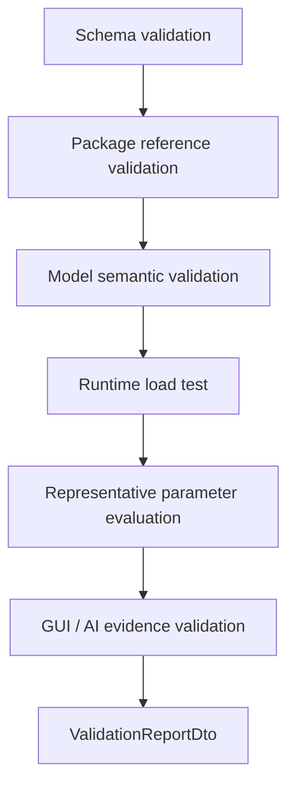
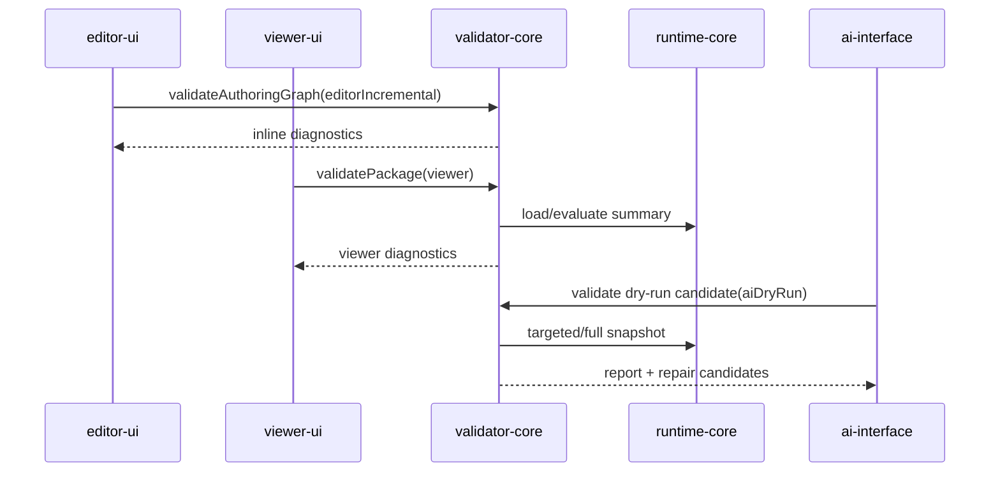

# Validator Contract

> 状態: Draft / Review ready
> 出力先: discussion/design/module-contracts/validator-contract.md
> 主な読者: validator-core implementer / editor-ui implementer / ai-interface implementer / acceptance reviewer
> 主な所有module: `validator-core`
> Source of truth: zod
> 根拠: [../mvp-authoring-runtime/04-validator-acceptance-runner-design.md](../mvp-authoring-runtime/04-validator-acceptance-runner-design.md), [typescript-contracts.md](typescript-contracts.md), [runtime-core-contract.md](runtime-core-contract.md), [../../scenarios/03_MVP_Acceptance_Criteria.md](../../scenarios/03_MVP_Acceptance_Criteria.md)

## Purpose and Scope

This document fixes the validator contract for schema, package reference, model semantic, runtime load, representative evaluation, GUI authoring evidence, and AI-readable report checks.

It covers:

- check ID naming and registry,
- validation profiles,
- severity/status vocabulary,
- validation report schema,
- repair candidate schema,
- relation between Editor warnings, Viewer diagnostics, Acceptance Runner, and AI reports.

It does not define UI rendering of diagnostics, automatic repair algorithms, or commercial art quality metrics.

## Basis Separation

### Repository Facts

- MVP AC requires package schema, asset reference, rights/provenance, texture/drawable/part, mesh, draw order, mask, parameter, keyform, rig control, Minimum Open Dynamics v1, runtime load test, and representative parameter evaluation.
- `SC-MVP-005` requires script-only generated packages to fail or be classified as auxiliary fixtures when GUI authoring evidence is absent.

### Prior Design Decisions

- Validator report is an external boundary DTO with Zod as source of truth.
- GUI operation log is required evidence; Playwright trace/screenshot/session metadata are supplemental.
- Diagnostics vocabulary is shared by Editor warnings, Viewer diagnostics, Validator reports, AI diffs, and Acceptance Runner.

### Assumptions

- Editor warning profile is a subset or incremental profile of validator-core.
- Acceptance Runner can be implemented as a validator profile plus evidence aggregation for MVP.

## Contract Summary

| Contract | Owner module | Consumers | Source of truth | Artifact |
|----------|--------------|-----------|-----------------|----------|
| Check registry | `validator-core` | all diagnostics consumers | table + zod ID format | registry |
| Validation profiles | `validator-core` | editor/viewer/AI/acceptance | zod | profile DTO |
| Validation report | `validator-core` | editor, viewer, AI, fixtures | zod | JSON report |
| Repair candidate | `validator-core` + `operation-core` | AI, diagnostics UI | zod | candidate DTO |
| Acceptance evidence classification | `validator-core` | MVP reviewer | zod + table | report section |

## TypeScript / Zod Sketches

## Check ID Naming

Check IDs use dot-separated namespaces. Namespace segments start with lowercase letters and may use camelCase to match implementation-facing diagnostics:

```text
pkg.schema.requiredFileMissing
asset.psd.unsupportedFeature
rights.provenanceMissing
ref.drawableTextureMissing
mesh.triangleIndexOutOfRange
keyform.grid2dMissingKey
rigControl.cycle
dynamics.driverMissing
mask.sourceMissing
runtime.loadBlocking
evidence.guiOperationLogMissing
```

## Check Catalog

| Check ID | Phase | Severity default | Profile behavior | Related AC |
|----------|-------|------------------|------------------|------------|
| `pkg.schema.requiredFileMissing` | package_schema | blocking | all: fail | AC-MVP-013 |
| `asset.psd.unsupportedFeature` | source_import | warning | strict: needs_review/fail by feature | AC-MVP-003 |
| `rights.provenanceMissing` | rights | error | acceptance: fail | AC-MVP-002 |
| `ref.drawableTextureMissing` | reference | error | acceptance: fail if visible drawable | AC-MVP-004 |
| `mesh.triangleIndexOutOfRange` | mesh_semantic | blocking | all: fail | AC-MVP-005 |
| `mesh.degenerateTriangle` | mesh_semantic | warning | strict: fail or needs_review | AC-MVP-005 |
| `runtime.parameterClamped` | parameter_resolution | warning | strict: fail for invalid external input tests | AC-MVP-012 |
| `runtime.profileMismatch` | runtime_context | warning | strict/acceptance: fail during legacy migration | AC-PHYS-004 |
| `runtime.stateSequenceLengthMismatch` | runtime_state | warning | context strictness interactive: warning; strict/acceptance/demoSafe: fail | AC-PHYS-004 |
| `runtime.statePackageMismatch` | runtime_state | error | strict/acceptance: fail or reset required | AC-PHYS-004 |
| `runtime.statePackageHashUnavailable` | runtime_state | info | strictness=strict: warning; exact replay fixture may fail acceptance | AC-PHYS-004 |
| `runtime.stateMissingDynamicsGroup` | runtime_state | warning | strict: fail when exact replay evidence is required | AC-PHYS-004 |
| `runtime.stateUnknownDynamicsGroup` | runtime_state | warning | strict: fail when exact replay evidence is required | AC-PHYS-004 |
| `keyform.missingEndpoint` | keyform_semantic | warning | strict: fail when target requires interpolation | AC-MVP-008 |
| `keyform.grid2dMissingKey` | keyform_sampling | error | strict: fail | AC-PARAM-005 |
| `keyform.grid2dDuplicateKey` | keyform_sampling | blocking | all: fail | AC-PARAM-005 |
| `keyform.tooManyParametersForMvp` | keyform_semantic | warning | acceptance: needs_review | AC-MVP-010 |
| `rigControl.cycle` | rigControl_semantic | blocking | all: fail | AC-MVP-009 |
| `rigControl.childOutsideWarpDomain` | rigControl_evaluation | warning | acceptance: needs_review | AC-DEF-005 |
| `dynamics.requiredGroupMissing` | dynamics_semantic | error | acceptance fixture / metadata requiring Dynamics: fail | AC-PHYS-001 |
| `dynamics.driverMissing` | dynamics_semantic | error | acceptance: fail | AC-PHYS-002 |
| `dynamics.outputMissing` | dynamics_semantic | error | acceptance: fail | AC-PHYS-002 |
| `dynamics.outputTargetDuplicate` | dynamics_semantic | error | acceptance: fail | AC-PHYS-002 |
| `dynamics.driverMustBeAuthoredInput` | dynamics_semantic | error | all: fail | AC-PHYS-002 |
| `dynamics.outputMustBeComputedParameter` | dynamics_semantic | error | all: fail | AC-PHYS-002 |
| `dynamics.computedParameterProducerMissing` | dynamics_semantic | error | acceptance: fail | AC-PHYS-002 |
| `dynamics.outputParameterOutOfRange` | dynamics_evaluation | error | strict: fail | AC-PHYS-003 |
| `dynamics.outputClamped` | dynamics_evaluation | warning | strict: needs_review/fail by fixture | AC-PHYS-003 |
| `dynamics.outputUsedAsDriver` | dynamics_semantic | error | all: fail | AC-PHYS-002 |
| `dynamics.groupCycle` | dynamics_semantic | blocking | all: fail | AC-PHYS-002 |
| `dynamics.nanState` | dynamics_evaluation | blocking | all: fail | AC-PHYS-003 |
| `dynamics.unstableSettings` | dynamics_semantic | warning | acceptance: needs_review | AC-PHYS-003 |
| `dynamics.excessiveAmplitude` | dynamics_evaluation | warning | acceptance: needs_review | AC-PHYS-003 |
| `dynamics.nonDeterministicSnapshot` | representative_evaluation | error | strict/acceptance: fail | AC-PHYS-004 |
| `dynamics.resetPolicyMissing` | dynamics_semantic | error | acceptance: fail | AC-PHYS-001 |
| `dynamics.timestepMismatch` | representative_evaluation | warning | strict: fail when replay evidence is required | AC-PHYS-004 |
| `runtime.timestepOverflow` | representative_evaluation | warning | strict: fail when replay evidence is required | AC-PHYS-004 |
| `dynamics.demoUnsafeInternalName` | demo_preflight | warning | demo profile: needs_review | AC-PHYS-006 |
| `mask.sourceMissing` | mask_resolution | blocking | all: fail | AC-MVP-007 |
| `mask.opacityZeroSource` | mask_resolution | warning | strict: needs_review | AC-MVP-007 |
| `runtime.loadBlocking` | runtime_load | blocking | all: fail | AC-MVP-012 |
| `runtime.drawListEmpty` | runtime_load | blocking | acceptance: fail | AC-MVP-012 |
| `ai.dryRunMutatedPackage` | ai_evidence | blocking | acceptance: fail | AC-MVP-014 |
| `evidence.guiOperationLogMissing` | acceptance_evidence | blocking | acceptance: fail | AC-MVP-001 |
| `evidence.playwrightSupplementMissing` | acceptance_evidence | info | acceptance: pass with note | SC-MVP-005 |

`dynamics.requiredGroupMissing` is not a general package error. Static models and fixtures that do not require Minimum Open Dynamics v1 remain valid. It fires only when an acceptance fixture requires Dynamics, model metadata declares `dynamicsRequired=true`, or a `computedDynamics` parameter exists without a producer group. The last case must also emit `dynamics.computedParameterProducerMissing`.

Dynamics output validation rules:

- `dynamics.outputTargetDuplicate` fires when more than one group targets the same computed output parameter.
- `dynamics.outputMustBeComputedParameter` fires when a group writes to `authoredInput` or `debugOverride`.
- `dynamics.outputParameterOutOfRange` fires when output min/max is outside the target parameter range.
- `dynamics.outputClamped` is runtime evidence that clamping occurred; it is not by itself a package schema failure unless a fixture/profile requires exact unclamped output.

Runtime state validation rules:

- `runtime.profileMismatch` is a migration-only diagnostic. It fires only if a legacy `options.profile` is supplied and conflicts with `RuntimeEvaluationContextDto.source.surface` or `policy.strictness`. New operation, AI, runtime, fixture, validator, and acceptance contracts must use `RuntimeEvaluationContextDto` as the source of truth and should not supply `options.profile`. Remove this diagnostic once legacy `options.profile` is no longer accepted or documented.
- `runtime.stateSequenceLengthMismatch` fires when a `RuntimeStateSequenceArtifact` has `states.length !== frameCount + 1`. `states[0]` must be the initial state before the first frame, and `states[i + 1]` must be the post-frame state after `RuntimeSequenceFrameDto` frame `i`. A mismatch means the artifact is incomplete deterministic replay evidence. `policy.strictness="interactive"` may record a warning; `strict`, `acceptance`, and `demoSafe` strictness fail the evidence.
- `runtime.statePackageMismatch` fires when package identity does not match the package graph used for evaluation. If both `graph.packageHash` and `previousState.packageHash` exist, they must match exactly. If either hash is missing, validator falls back to `packageId + packageRevision`; mismatch in either fallback field is still `runtime.statePackageMismatch`.
- `runtime.statePackageHashUnavailable` fires when one or both package hashes are missing but `packageId + packageRevision` match. `policy.strictness="interactive"` may record info, `policy.strictness="strict"` warns, and exact deterministic replay fixtures may fail acceptance unless they explicitly declare hashless replay.
- `runtime.stateMissingDynamicsGroup` fires when the graph contains a dynamics group that is absent from `previousState.dynamicsGroups`; Runtime may initialize that group from `currentTarget`, but strict replay fixtures must record the reset.
- `runtime.stateUnknownDynamicsGroup` fires when `previousState.dynamicsGroups` contains a group that is not present in the graph; Runtime ignores that stale group state.
- `dynamics.timestepMismatch` fires when supplied `RuntimeStateDto.fixedStepMs` differs from the evaluation request timestep in a strict / acceptance replay context.

## Validation Profiles

| Profile | Purpose | Inputs | Blocking behavior |
|---------|---------|--------|-------------------|
| `editorIncremental` | fast authoring warnings while editing | dirty authoring graph, target IDs | warns; blocks only destructive invalid commits |
| `viewer` | saved package load/inspect diagnostics | package + runtime snapshot | blocks non-loadable package |
| `strict` | full package validation | package + representative runtime eval | fails on blocking/error |
| `acceptance` | MVP scenario evidence | operation log, reports, snapshots, package, supplemental evidence | fails missing GUI evidence or blocking checks |
| `aiDryRun` | AI proposed operation review | baseline/temp graph, diffs, report | blocks mutation without approval or target ambiguity |

## Severity / Status

```ts
import { z } from "zod";
import {
  CheckStatusSchema,
  SeveritySchema,
  DiagnosticSchema,
  ValidationReportIdSchema,
  PackageIdSchema,
  OperationIdSchema,
  RuntimeSnapshotIdSchema,
  RepairCandidateIdSchema,
  ModelDiffSchema,
  RuntimeDiffSchema,
  ValidationDiffSchema,
  ValidationProfileSchema,
} from "./contracts";

export const ValidationSummarySchema = z.object({
  status: CheckStatusSchema,
  highestSeverity: SeveritySchema,
  counts: z.record(SeveritySchema, z.number().int().nonnegative()),
});
```

Severity describes impact. Status describes outcome in a profile. They must remain separate.

## Report Schema

```ts
export const ValidationCheckResultSchema = DiagnosticSchema.extend({
  targetPath: z.string().optional(),
  impact: z.string(),
  repairCandidateIds: z.array(RepairCandidateIdSchema).default([]),
  snapshotIds: z.array(RuntimeSnapshotIdSchema).default([]),
  operationIds: z.array(OperationIdSchema).default([]),
});

export const RepairCandidateSchema = z.object({
  schemaVersion: z.literal("repair-candidate-v1"),
  candidateId: RepairCandidateIdSchema,
  createdBy: z.enum(["validator", "ai", "human"]),
  problemCheckIds: z.array(z.string()),
  targetIds: z.array(z.string()),
  rationale: z.string(),
  operationDraft: z.object({
    operationType: z.string(),
    payload: z.object({}).passthrough(),
  }),
  expectedModelDiff: ModelDiffSchema.optional(),
  expectedRuntimeDiff: RuntimeDiffSchema.optional(),
  expectedValidationDiff: ValidationDiffSchema.optional(),
  risk: z.enum(["low", "medium", "high", "unknown"]),
  requiresUserApproval: z.literal(true),
  provenance: z.object({
    sourceReportId: ValidationReportIdSchema.optional(),
    sourceOperationIds: z.array(OperationIdSchema).default([]),
  }),
  revalidationSteps: z.array(z.string()),
});
export type RepairCandidateDto = z.infer<typeof RepairCandidateSchema>;

export const ValidationReportSchema = z.object({
  schemaVersion: z.literal("validation-report-v1"),
  reportId: ValidationReportIdSchema,
  createdAt: z.string().datetime(),
  packageId: PackageIdSchema,
  packageRevision: z.number().int().nonnegative(),
  packageHash: z.string().optional(),
  validatorVersion: z.string(),
  profile: ValidationProfileSchema,
  relatedScenarios: z.array(z.string()).default([]),
  summary: ValidationSummarySchema,
  checks: z.array(ValidationCheckResultSchema),
  repairCandidates: z.array(RepairCandidateSchema).default([]),
  evidence: z.object({
    operationLogPresent: z.boolean(),
    operationLogPath: z.string().optional(),
    runtimeSnapshotIds: z.array(RuntimeSnapshotIdSchema).default([]),
    supplementalGuiEvidenceRefs: z.array(z.string()).default([]),
  }),
});
export type ValidationReportDto = z.infer<typeof ValidationReportSchema>;
```

## Diagram Requirements

The validation flow diagrams define phase order and profile-specific call paths. Report schemas and check registry tables remain the source of truth.

## Validation Phase Flow



## Profile-specific Report Flow



## Editor Warning / Viewer Diagnostics / Acceptance Runner Relation

| Consumer | Uses | Must include |
|----------|------|--------------|
| Editor warnings | `editorIncremental` checks | check ID, target ID, jump target, severity |
| Viewer diagnostics | `viewer` profile | runtime load diagnostics, package references, snapshot ID |
| AI-readable report | `strict` or `aiDryRun` | stable IDs, diff refs, repair candidates, provenance |
| Acceptance Runner | `acceptance` profile | GUI operation log evidence, AC/scenario links, pass/fail status |

## Traceability

| Requirement | Contract element | Verification |
|-------------|------------------|--------------|
| AC-MVP-005, SC-MESH-006 | mesh checks | `invalid-mesh-triangle` expected report |
| AC-MVP-007, SC-DRAW-005, SC-PART-004 | mask checks | `invalid-mask-reference` expected report |
| AC-MVP-009, SC-DEF-006 | rig control checks | `invalid-rigControl-cycle`, `parent-child-rigControl-diagonal` |
| AC-MVP-010, AC-PHYS-001..006, SC-DYN-001..004 | dynamics checks | `minimal-dynamics-hairSway`, `invalid-dynamics-cycle`, `dynamics-reset-determinism`, `demo-safe-dynamics-capture` |
| AC-MVP-013, SC-MVP-004 | `ValidationReportDto` | all validation fixtures |
| AC-MVP-014, SC-AGENT-005 | `RepairCandidateDto` | `ai-repair-dry-run` |
| AC-MVP-001, SC-MVP-005 | `evidence.guiOperationLogMissing` | script-only fixture classification |

## Verification and Fixtures

| Fixture / Test | Purpose | Expected artifact |
|----------------|---------|-------------------|
| `minimal-valid-package` | no blocking diagnostics | pass validation report |
| `psd-unsupported-layer` | unsupported PSD layer diagnostic | report with `asset.psd.unsupportedFeature` |
| `invalid-missing-texture` | visible drawable missing texture | fail report |
| `invalid-rigControl-cycle` | rig control hierarchy cycle | blocking report |
| `invalid-dynamics-missing-driver` | missing or wrong-source dynamics driver | error report |
| `invalid-dynamics-missing-output` | missing or wrong-source dynamics output parameter | error report |
| `invalid-dynamics-cycle` | computed output used as dynamics driver or group dependency | blocking report |
| `dynamics-output-range-clamp` | output clamp and range diagnostic | report + snapshot |
| `dynamics-reset-determinism` | fixed timestep replay equality | paired strict report |
| `demo-safe-dynamics-capture` | demo profile hides unsafe names and solver details | demo preflight report |
| `invalid-mask-reference` | missing mask source/target | fail report |
| `script-generated-minimal` | viewer-loadable but no GUI evidence | acceptance fail / auxiliary fixture status |
| `ai-repair-dry-run` | repair candidate and validation diff | report + candidate |

## Open Questions

| Question | Impact | Status |
|----------|--------|--------|
| Exact warning-to-fail thresholds for commercial quality checks | can-defer | MVP focuses structural checks |
| Whether `mask.opacityZeroSource` is warning or error in strict profile | can-defer | default warning; acceptance may need review |
| Whether Acceptance Runner is separate package | can-defer | report/evidence contract stable either way |

## Handoff Checklist

- [x] Public API / DTO が示されている
- [x] Source of truth が契約ごとに明記されている
- [x] 依存方向、処理順序、状態遷移が必要な箇所に Mermaid 図がある
- [x] AC / scenario traceability がある
- [x] Fixture または expected output がある
- [x] 未決事項が implementation-blocking / can-defer に分かれている

## Review Requirements

Review this file for:

- check ID coverage against MVP AC and scenarios,
- severity/status separation,
- GUI operation log evidence as required MVP evidence,
- repair candidate consistency with operation-core and AI contracts.
