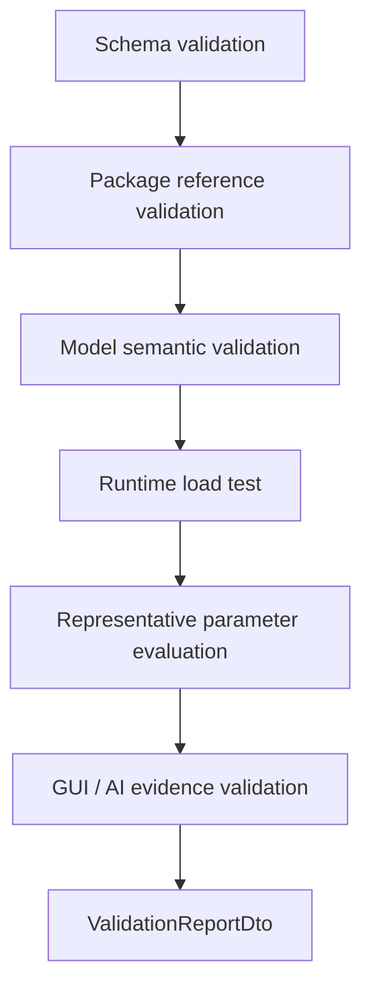
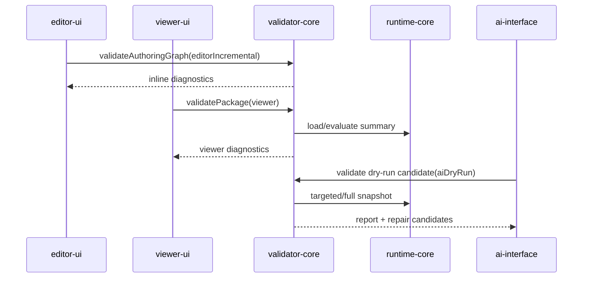

# Validator Contract

> 状態: Draft / Review ready
> 出力先: discussion/design/module-contracts/validator-contract.md
> 主な読者: validator-core implementer / editor-ui implementer / ai-interface implementer / acceptance reviewer
> 主な所有module: `validator-core`
> Source of truth: zod
> 根拠: [../mvp-authoring-runtime/04-validator-acceptance-runner-design.md](../mvp-authoring-runtime/04-validator-acceptance-runner-design.md), [typescript-contracts.md](typescript-contracts.md), [runtime-core-contract.md](runtime-core-contract.md), [../../scenarios/03_MVP_Acceptance_Criteria.md](../../scenarios/03_MVP_Acceptance_Criteria.md)

## Purpose and Scope

This document fixes the validator contract for schema, package reference, model semantic, runtime load, representative evaluation, GUI authoring evidence, and AI-readable report checks.

It covers:

- check ID naming and registry,
- validation profiles,
- severity/status vocabulary,
- validation report schema,
- repair candidate schema,
- relation between Editor warnings, Viewer diagnostics, Acceptance Runner, and AI reports.

It does not define UI rendering of diagnostics, automatic repair algorithms, or commercial art quality metrics.

## Basis Separation

### Repository Facts

- MVP AC requires package schema, asset reference, rights/provenance, texture/drawable/part, mesh, draw order, mask, parameter, keyform, rig control, Minimum Open Dynamics v1, runtime load test, and representative parameter evaluation.
- `SC-MVP-005` requires script-only generated packages to fail or be classified as auxiliary fixtures when GUI authoring evidence is absent.

### Prior Design Decisions

- Validator report is an external boundary DTO with Zod as source of truth.
- GUI operation log is required evidence; Playwright trace/screenshot/session metadata are supplemental.
- Diagnostics vocabulary is shared by Editor warnings, Viewer diagnostics, Validator reports, AI diffs, and Acceptance Runner.

### Assumptions

- Editor warning profile is a subset or incremental profile of validator-core.
- Acceptance Runner can be implemented as a validator profile plus evidence aggregation for MVP.

## Contract Summary

| Contract | Owner module | Consumers | Source of truth | Artifact |
|----------|--------------|-----------|-----------------|----------|
| Check registry | `validator-core` | all diagnostics consumers | table + zod ID format | registry |
| Validation profiles | `validator-core` | editor/viewer/AI/acceptance | zod | profile DTO |
| Validation report | `validator-core` | editor, viewer, AI, fixtures | zod | JSON report |
| Repair candidate | `validator-core` + `operation-core` | AI, diagnostics UI | zod | candidate DTO |
| Acceptance evidence classification | `validator-core` | MVP reviewer | zod + table | report section |

## TypeScript / Zod Sketches

## Check ID Naming

Check IDs use dot-separated namespaces. Namespace segments start with lowercase letters and may use camelCase to match implementation-facing diagnostics:

```text
pkg.schema.requiredFileMissing
asset.psd.unsupportedFeature
rights.provenanceMissing
ref.drawableTextureMissing
mesh.triangleIndexOutOfRange
keyform.grid2dMissingKey
rigControl.cycle
rigControl.parentChildMismatch
dynamics.driverMissing
mask.sourceMissing
runtime.loadBlocking
evidence.guiOperationLogMissing
demo.unsafeDependencyClaim
```

## Check Catalog

| Check ID | Phase | Severity default | Profile behavior | Related AC |
|----------|-------|------------------|------------------|------------|
| `pkg.schema.requiredFileMissing` | package_schema | blocking | all: fail | AC-MVP-013 |
| `byteIntake.unsupportedClaim` | source_import | blocking | all: fail unless the claim is truthfully recorded as unsupported/not applicable | AC-MVP-015, AC-MVP-016 |
| `transportCapability.evidenceMissing` | source_import | blocking | all: fail only when transport capability evidence is explicitly required and absent | AC-MVP-013, AC-MVP-015, AC-MVP-016 |
| `transportCapability.schemaInvalid` | source_import | blocking | all: fail when supplied transport capability evidence does not match the Domain A DTO contract | AC-MVP-013, AC-MVP-015, AC-MVP-016 |
| `transportCapability.unsupported` | source_import | blocking | all: fail when transport capability evidence records an unsupported transport boundary | AC-MVP-013, AC-MVP-015, AC-MVP-016 |
| `transportCapability.futureGated` | source_import | blocking | all: fail when transport capability evidence records a future-gated transport boundary | AC-MVP-013, AC-MVP-015, AC-MVP-016 |
| `transportCapability.dependencyGated` | source_import | blocking | all: fail when transport capability evidence records a dependency-gated transport boundary | AC-MVP-013, AC-MVP-015, AC-MVP-016 |
| `asset.psd.unsupportedFeature` | source_import | warning | strict: needs_review/fail by feature | AC-MVP-003 |
| `rights.provenanceMissing` | rights | error | acceptance: fail | AC-MVP-002 |
| `ref.drawableTextureMissing` | reference | error | acceptance: fail if visible drawable | AC-MVP-004 |
| `ref.drawablePartMissing` | reference | error | all: fail | AC-MVP-004, AC-MVP-013 |
| `mesh.triangleIndexOutOfRange` | mesh_semantic | blocking | all: fail | AC-MVP-005 |
| `mesh.degenerateTriangle` | mesh_semantic | warning | strict: fail or needs_review | AC-MVP-005 |
| `mesh.duplicateTriangle` | mesh_semantic | error | all: fail | AC-MVP-005, AC-MVP-013 |
| `mesh.orphanedVertex` | mesh_semantic | error | all: fail | AC-MVP-005, AC-MVP-013 |
| `mesh.vertexStableIdsLengthMismatch` | mesh_semantic | error | all: fail | AC-MVP-005, AC-MVP-013 |
| `mesh.uvCountMismatch` | mesh_semantic | error | all: fail | AC-MVP-005, AC-MVP-013 |
| `mesh.triangleStableIdsLengthMismatch` | mesh_semantic | error | all: fail when optional `triangleStableIds` evidence is present and not aligned with `triangles[]` | AC-MVP-005, AC-MVP-013 |
| `mesh.uvCoordinateOutOfBounds` | mesh_semantic | error | all: fail | AC-MVP-005, AC-MVP-013 |
| `mesh.runtimeEvidenceMissing` | representative_evaluation | error | viewer/strict/acceptance: fail when required mesh runtime or viewer snapshot evidence is absent or incomplete | AC-MVP-005, AC-MVP-012, AC-MVP-013 |
| `mesh.runtimeEvidenceMismatch` | representative_evaluation | error | viewer/strict/acceptance: fail when supplied runtime/viewer mesh evidence identity, topology counts, booleans, bounds, hash, or exposed vertex evidence disagrees with package/runtime evidence | AC-MVP-005, AC-MVP-012, AC-MVP-013 |
| `part.parentMissing` | reference | error | all: fail | AC-MVP-004, AC-MVP-013 |
| `part.childMissing` | reference | error | all: fail | AC-MVP-004, AC-MVP-013 |
| `part.duplicateChild` | reference | error | all: fail | AC-MVP-004, AC-MVP-013 |
| `part.parentChildMismatch` | reference | error | all: fail | AC-MVP-004, AC-MVP-013 |
| `part.cycle` | reference | blocking | all: fail | AC-MVP-004, AC-MVP-013 |
| `part.drawableMembershipMismatch` | reference | error | all: fail | AC-MVP-004, AC-MVP-013 |
| `part.deleteNonEmpty` | reference | blocking | all: fail for delete candidate evidence | AC-MVP-004, AC-MVP-013 |
| `part.runtimeEvidenceMismatch` | representative_evaluation | error | viewer/strict/acceptance: fail when supplied part hierarchy or drawable layer evidence disagrees with package graph | AC-MVP-004, AC-MVP-012, AC-MVP-013 |
| `editorState.staleReference` | reference | warning | editor/viewer/strict: warning; acceptance: needs_review by scenario | AC-MVP-004, AC-MVP-011, AC-MVP-013 |
| `runtime.parameterClamped` | parameter_resolution | warning | strict: fail for invalid external input tests | AC-MVP-012 |
| `runtime.profileMismatch` | runtime_context | warning | strict/acceptance: fail during legacy migration | AC-PHYS-004 |
| `runtime.stateSequenceLengthMismatch` | runtime_state | warning | context strictness interactive: warning; strict/acceptance/demoSafe: fail | AC-PHYS-004 |
| `runtime.statePackageMismatch` | runtime_state | error | strict/acceptance: fail or reset required | AC-PHYS-004 |
| `runtime.statePackageHashUnavailable` | runtime_state | info | strictness=strict: warning; exact replay fixture may fail acceptance | AC-PHYS-004 |
| `runtime.stateMissingDynamicsGroup` | runtime_state | warning | strict: fail when exact replay evidence is required | AC-PHYS-004 |
| `runtime.stateUnknownDynamicsGroup` | runtime_state | warning | strict: fail when exact replay evidence is required | AC-PHYS-004 |
| `keyform.missingEndpoint` | keyform_semantic | warning | strict: fail when target requires interpolation | AC-MVP-008 |
| `keyform.grid2dMissingKey` | keyform_sampling | error | strict: fail | AC-PARAM-005 |
| `keyform.grid2dDuplicateKey` | keyform_sampling | error | strict/acceptance: fail | AC-PARAM-005 |
| `keyform.tooManyParametersForMvp` | keyform_semantic | warning | acceptance: needs_review | AC-MVP-010 |
| `rigControl.cycle` | rigControl_semantic | blocking | all: fail | AC-MVP-009 |
| `rigControl.parentMissing` | rigControl_semantic | error | all: fail | AC-MVP-009 |
| `rigControl.childMissing` | rigControl_semantic | error | all: fail | AC-MVP-009 |
| `rigControl.invalidChildTargetKind` | rigControl_semantic | error | all: fail | AC-MVP-009 |
| `rigControl.parentChildMismatch` | rigControl_semantic | error | all: fail | AC-MVP-009 |
| `rigControl.runtimeEvidenceMissing` | rigControl_evaluation | error | strict/acceptance: fail when enabled rig controls cannot be matched to current runtime snapshot evidence, including keyform-driven rig-control sample and transform evidence | AC-MVP-009, AC-MVP-012 |
| `rigControl.warpLatticeCardinalityMismatch` | rigControl_semantic | error | all: fail | AC-MVP-009, AC-MVP-010 |
| `rigControl.warpLatticeDomainBoundsInvalid` | rigControl_semantic | error | all: fail | AC-MVP-009 |
| `rigControl.warpLatticeRestControlPointMismatch` | rigControl_semantic | error | all: fail | AC-MVP-009 |
| `rigControl.warpLatticeUnsupportedProperty` | rigControl_semantic | error | all: fail | AC-MVP-009, AC-MVP-010 |
| `rigControl.warpLatticeMalformedPatch` | rigControl_semantic | error | all: fail | AC-MVP-009, AC-MVP-010 |
| `rigControl.warpLatticeRuntimeEvidenceMismatch` | rigControl_evaluation | error | strict/acceptance: fail when evaluated `warpLattice2d` runtime evidence disagrees with package lattice shape, domain, affected drawable refs, or keyform patch evidence | AC-MVP-009, AC-MVP-012 |
| `rigControl.childOutsideWarpDomain` | rigControl_evaluation | warning | acceptance: needs_review | AC-DEF-005 |
| `dynamics.requiredGroupMissing` | dynamics_semantic | error | acceptance fixture / metadata requiring Dynamics: fail | AC-PHYS-001 |
| `dynamics.driverMissing` | dynamics_semantic | error | acceptance: fail | AC-PHYS-002 |
| `dynamics.outputMissing` | dynamics_semantic | error | acceptance: fail | AC-PHYS-002 |
| `dynamics.outputTargetDuplicate` | dynamics_semantic | error | acceptance: fail | AC-PHYS-002 |
| `dynamics.driverMustBeAuthoredInput` | dynamics_semantic | error | all: fail | AC-PHYS-002 |
| `dynamics.outputMustBeComputedParameter` | dynamics_semantic | error | all: fail | AC-PHYS-002 |
| `dynamics.computedParameterProducerMissing` | dynamics_semantic | error | acceptance: fail | AC-PHYS-002 |
| `dynamics.outputParameterOutOfRange` | dynamics_evaluation | error | strict: fail | AC-PHYS-003 |
| `dynamics.outputClamped` | dynamics_evaluation | warning | strict: needs_review/fail by fixture | AC-PHYS-003 |
| `dynamics.outputUsedAsDriver` | dynamics_semantic | error | all: fail | AC-PHYS-002 |
| `dynamics.groupCycle` | dynamics_semantic | blocking | all: fail | AC-PHYS-002 |
| `dynamics.nanState` | dynamics_evaluation | blocking | all: fail | AC-PHYS-003 |
| `dynamics.unstableSettings` | dynamics_semantic | warning | acceptance: needs_review | AC-PHYS-003 |
| `dynamics.excessiveAmplitude` | dynamics_evaluation | warning | acceptance: needs_review | AC-PHYS-003 |
| `dynamics.nonDeterministicSnapshot` | representative_evaluation | error | strict/acceptance: fail | AC-PHYS-004 |
| `dynamics.runtimeEvidenceMissing` | representative_evaluation | error | strict/acceptance: fail when required or present dynamics cannot be matched to runtime snapshot evidence | AC-PHYS-004 |
| `viewer.runtimeEvidenceMissing` | representative_evaluation | error | viewer: fail when viewer runtime snapshot/evaluation evidence is absent or unparseable | AC-MVP-012 |
| `viewer.runtimeEvidenceStale` | representative_evaluation | error | viewer: fail when viewer evidence does not match the validated package or supplied runtime snapshot context | AC-MVP-012 |
| `dynamics.resetPolicyMissing` | dynamics_semantic | error | acceptance: fail | AC-PHYS-001 |
| `dynamics.timestepMismatch` | representative_evaluation | warning | strict: fail when replay evidence is required | AC-PHYS-004 |
| `runtime.timestepOverflow` | representative_evaluation | warning | strict: fail when replay evidence is required | AC-PHYS-004 |
| `dynamics.demoUnsafeInternalName` | demo_preflight | warning | demo profile: needs_review | AC-PHYS-006 |
| `demo.unsafeDependencyClaim` | demo_preflight | blocking | acceptance: fail | AC-MVP-015, AC-MVP-016 |
| `mask.sourceMissing` | mask_resolution | blocking | all: fail | AC-MVP-007 |
| `mask.targetMissing` | mask_resolution | blocking | all: fail | AC-MVP-007 |
| `mask.selfReference` | mask_resolution | error | all: fail | AC-MVP-007 |
| `mask.duplicateRelation` | mask_resolution | error | all: fail | AC-MVP-007 |
| `mask.runtimeEvidenceMissing` | mask_resolution | error | strict/acceptance: fail when an enabled mask relation cannot be matched to current runtime snapshot evidence, including stale snapshot identity mismatch | AC-MVP-007, AC-MVP-012 |
| `mask.runtimeEvidenceMismatch` | mask_resolution | error | strict/acceptance: fail when runtime mask evidence is disabled, unknown, unresolved, or source/target-mismatched | AC-MVP-007, AC-MVP-012 |
| `mask.opacityEvidenceMissing` | mask_resolution | error | strict/acceptance: fail when runtime drawable opacity evidence for a mask source or target is absent | AC-MVP-007, AC-MVP-012 |
| `mask.opacityZeroSource` | mask_resolution | warning | strict: needs_review | AC-MVP-007 |
| `runtime.loadBlocking` | runtime_load | blocking | all: fail | AC-MVP-012 |
| `runtime.drawListEmpty` | runtime_load | blocking | acceptance: fail | AC-MVP-012 |
| `ai.dryRunMutatedPackage` | ai_evidence | blocking | acceptance: fail | AC-MVP-014 |
| `evidence.guiOperationLogMissing` | acceptance_evidence | blocking | acceptance: fail | AC-MVP-001 |
| `evidence.playwrightSupplementMissing` | acceptance_evidence | info | acceptance: pass with note | SC-MVP-005 |

`dynamics.requiredGroupMissing` is not a general package error. Static models and fixtures that do not require Minimum Open Dynamics v1 remain valid. It fires only when an acceptance fixture requires Dynamics, model metadata declares `dynamicsRequired=true`, or a `computedDynamics` parameter exists without a producer group. The last case must also emit `dynamics.computedParameterProducerMissing`.

Dynamics output validation rules:

- `dynamics.outputTargetDuplicate` fires when more than one group targets the same computed output parameter.
- `dynamics.outputMustBeComputedParameter` fires when a group writes to `authoredInput` or `debugOverride`.
- `dynamics.outputParameterOutOfRange` fires when output min/max is outside the target parameter range.
- `dynamics.outputClamped` is runtime evidence that clamping occurred; it is not by itself a package schema failure unless a fixture/profile requires exact unclamped output.
- `dynamics.runtimeEvidenceMissing` fires when an enabled dynamics group is present but no runtime snapshot is supplied, the snapshot omits that group, or the snapshot lacks the computed output parameter evidence needed to prove deterministic replay.

Rig control validation rules:

- `rigControl.cycle` fires when parent/child rig control edges cannot be topologically ordered.
- `rigControl.parentMissing` fires when a rig control `parentId` does not resolve to a package rig control.
- `rigControl.childMissing` fires when a child drawable or child rig control reference does not resolve.
- `rigControl.invalidChildTargetKind` fires when a child ID is stored under the wrong child collection, for example a `rig_` ID in `childDrawableIds`.
- `rigControl.parentChildMismatch` fires when a parent's `childRigControlIds` entry and the child's `parentId` disagree.
- `rigControl.runtimeEvidenceMissing` fires when an enabled package rig control has no matching runtime snapshot evidence, the supplied snapshot identity is stale for the validated package, the snapshot disagrees on kind, enabled state, or parent relation, or keyform-driven rig-control evidence omits or mismatches target keyform sample refs, local/world transform evidence, affected target refs, or snapshot refs.
- `rigControl.warpLatticeCardinalityMismatch` fires when `latticeColumns * latticeRows !== restControlPoints.length`.
- `rigControl.warpLatticeDomainBoundsInvalid` fires when a `warpLattice2d` domain has non-positive width or height.
- `rigControl.warpLatticeRestControlPointMismatch` fires when `restControlPoints` do not fit inside the declared `domainBounds`.
- `rigControl.warpLatticeUnsupportedProperty` fires when a `warpLattice2d` keyform targets a property other than `controlPointOffsets`.
- `rigControl.warpLatticeMalformedPatch` fires when a `controlPointOffsets` keyform patch is not a `Vec2[]` with one offset per rest control point, or uses a composition mode outside `replace` / `additiveDelta`.
- `rigControl.warpLatticeRuntimeEvidenceMismatch` fires when current runtime evidence for an enabled `warpLattice2d` is present but does not prove evaluated project-defined warp lattice semantics, including stale unsupported/no-op status, domain bounds mismatch, affected target mismatch, missing affected drawable evidence, or mismatched runtime keyform patch shape.

Mesh validation rules:

- `mesh.triangleIndexOutOfRange` fires for each triangle corner whose vertex index is outside the mesh `vertices` array.
- `mesh.degenerateTriangle` fires for repeated-index or zero-area triangles after triangle indexes are proven in range. It is warning-level by default because it is a mesh-quality issue rather than an editor-selection or package-reference failure.
- `mesh.duplicateTriangle` fires when two in-range triangles contain the same normalized vertex index triplet, regardless of winding order.
- `mesh.orphanedVertex` fires when a stable vertex ID for an existing vertex is not referenced by any triangle.
- `mesh.vertexStableIdsLengthMismatch` fires when `vertexStableIds.length !== vertices.length`; stable vertex refs cannot be used safely for mesh edits until every vertex has one stable ID.
- `mesh.uvCountMismatch` fires when `uvs.length !== vertices.length`; texture projection evidence is not deterministic while vertex and UV counts disagree.
- `mesh.triangleStableIdsLengthMismatch` fires only when optional `triangleStableIds` package evidence is present and `triangleStableIds.length !== triangles.length`.
- `mesh.uvCoordinateOutOfBounds` fires when a UV coordinate is outside the project-defined semantic `[0, 1]` UV domain. This is semantic UV edit evidence only; it does not assert texture sampling or renderer correctness.
- `mesh.runtimeEvidenceMissing` fires only where runtime/viewer mesh evidence is required or supplied but incomplete: missing runtime snapshot, missing runtime drawable, or missing per-drawable mesh evidence for a runtime-visible package drawable.
- `mesh.runtimeEvidenceMismatch` fires when supplied runtime/viewer mesh evidence is stale or inconsistent with current package/runtime evidence, including package identity/revision mismatch, package/runtime mesh ID disagreement, package/runtime vertex count disagreement, topology `vertexCount`, `stableVertexIdCount`, `stableTriangleIdCount`, `uvCount`, `triangleCount`, `triangleIndexCount`, mesh-local `topologyRevision`, topology booleans including `hasStableTriangleIds`, runtime mesh bounds/hash self-consistency, or exposed `vertices.length`.
- Mesh-local `topologyRevision` stale comparison is performed only when package or runtime/viewer mesh topology evidence carries `topologyRevision`. Validator-core must not invent a packageRevision-to-topologyRevision rule; package identity/revision staleness remains separate runtime snapshot identity evidence.
- `editorState.staleReference` covers stale editor-only selected vertex refs. It remains warning-level and must not be promoted to runtime rendering failure just because the stale ref came from mesh selection state.

Viewer evidence validation rules:

- `viewer.runtimeEvidenceMissing` fires in viewer validation when the viewer runtime evaluation evidence wrapper is absent, unparseable, or references a snapshot that is not supplied for validation.
- `viewer.runtimeEvidenceStale` fires when supplied viewer evidence or runtime snapshot identity no longer matches the validated package, or when the runtime snapshot was not produced with `RuntimeEvaluationContextDto.source.surface = "viewer"`.

Mask validation rules:

- `mask.sourceMissing` and `mask.targetMissing` fire when a mask relation references a drawable ID absent from package drawables.
- `mask.selfReference` fires when the same drawable is both a mask source and target in one relation.
- `mask.duplicateRelation` fires for duplicate mask relation IDs or duplicate source-target relation semantics.
- `mask.runtimeEvidenceMissing` fires when an enabled, statically resolvable mask relation has no current runtime snapshot evidence, including when the supplied snapshot identity is stale for the validated package.
- `mask.runtimeEvidenceMismatch` fires when runtime mask evidence is present for a disabled or unknown relation, is unresolved, or has target drawable IDs that disagree with the package relation.
- `mask.opacityEvidenceMissing` fires only from existing runtime drawable evidence: if a matched runtime snapshot omits the evaluated drawable entry needed to inspect mask-source or target opacity. Out-of-range package or runtime opacity remains covered by package schema / runtime load diagnostics.

Demo-safe validation rules:

- `demo.unsafeDependencyClaim` fires when a demo, proposal, fixture metadata, or public-facing acceptance artifact claims dependency on forbidden proprietary formats, SDK/Core behavior, viewer matching, physics compatibility, or existing third-party model behavior.
- `demo.unsafeDependencyClaim` is a project-scope hygiene diagnostic. It is not an external compatibility oracle and must not inspect or compare proprietary runtime output.

Runtime state validation rules:

- `runtime.profileMismatch` is a migration-only diagnostic. It fires only if a legacy `options.profile` is supplied and conflicts with `RuntimeEvaluationContextDto.source.surface` or `policy.strictness`. New operation, AI, runtime, fixture, validator, and acceptance contracts must use `RuntimeEvaluationContextDto` as the source of truth and should not supply `options.profile`. Remove this diagnostic once legacy `options.profile` is no longer accepted or documented.
- `runtime.stateSequenceLengthMismatch` fires when a `RuntimeStateSequenceArtifact` has `states.length !== frameCount + 1`. `states[0]` must be the initial state before the first frame, and `states[i + 1]` must be the post-frame state after `RuntimeSequenceFrameDto` frame `i`. A mismatch means the artifact is incomplete deterministic replay evidence. `policy.strictness="interactive"` may record a warning; `strict`, `acceptance`, and `demoSafe` strictness fail the evidence.
- `runtime.statePackageMismatch` fires when package identity does not match the package graph used for evaluation. If both `graph.packageHash` and `previousState.packageHash` exist, they must match exactly. If either hash is missing, validator falls back to `packageId + packageRevision`; mismatch in either fallback field is still `runtime.statePackageMismatch`.
- `runtime.statePackageHashUnavailable` fires when one or both package hashes are missing but `packageId + packageRevision` match. `policy.strictness="interactive"` may record info, `policy.strictness="strict"` warns, and exact deterministic replay fixtures may fail acceptance unless they explicitly declare hashless replay.
- `runtime.stateMissingDynamicsGroup` fires when the graph contains a dynamics group that is absent from `previousState.dynamicsGroups`; Runtime may initialize that group from `currentTarget`, but strict replay fixtures must record the reset.
- `runtime.stateUnknownDynamicsGroup` fires when `previousState.dynamicsGroups` contains a group that is not present in the graph; Runtime ignores that stale group state.
- `dynamics.timestepMismatch` fires when supplied `RuntimeStateDto.fixedStepMs` differs from the evaluation request timestep in a strict / acceptance replay context.

Part / layer-tree validation rules:

- `ref.drawablePartMissing` fires when a drawable `partId` does not resolve to a package part.
- `part.parentMissing` and `part.childMissing` fire when part hierarchy references point at absent part IDs.
- `part.duplicateChild` fires when one part lists the same child part more than once in `childPartIds`.
- `part.parentChildMismatch` fires when `parentPartId` and reciprocal `childPartIds` disagree.
- `part.cycle` fires when package part hierarchy edges cannot be topologically ordered.
- `part.drawableMembershipMismatch` fires when `drawable.partId` and `part.drawableIds` disagree or a part lists a missing drawable.
- `part.deleteNonEmpty` fires for direct-manipulation delete candidate evidence when the target part is not an empty leaf: child parts, assigned drawables, mask-backed drawable evidence, or rig controls still reference the part. It does not authorize recursive delete or delete-with-reassign.
- `part.runtimeEvidenceMismatch` fires when supplied runtime snapshot or viewer evidence includes part hierarchy / drawable layer evidence but that evidence no longer matches the validated package identity/revision, package `parts`, `drawable.partId`, or `part.drawableIds`.
- `editorState.staleReference` fires only for stale editor-only `selection`, `lockedIds`, or `editorHiddenIds` references. It must not change runtime semantics, must not hide runtime/package failures, and should remain warning-level unless an acceptance scenario explicitly promotes stale editor evidence to `needs_review`.

Byte-intake preflight validation rules:

- `binary.bytesMissing`, `binary.byteLengthMismatch`, `binary.digestMismatch`, `binary.digestUnsupported`, and `binary.mediaTypeMismatch` may be emitted by byte-intake preflight when actual selected bytes are missing or disagree with recorded intake metadata. Media type comparison is declared file metadata only; it is not image decode or parser evidence.
- `rights.binaryProvenanceMissing` and `rights.binaryRightsMissing` fire when byte-intake metadata lacks provenance or rights identifiers before package-local binary asset registration.
- `byteIntake.unsupportedClaim` fires when byte-intake evidence claims parser, image decode, or archive import/export support. Truthfully recording those capabilities as unsupported may produce a non-applicable informational diagnostic instead of a failure.
- `persistentByteStorage.*` checks fire only when byte-intake preflight is given browser-local persistent storage evidence or an explicit persistent-storage expectation. Valid verified same-origin browser-local stored bytes produce no check and may satisfy byte availability without current-session raw bytes. Missing records, missing stored bytes, stale package identity/revision or binary reference evidence, digest/byteLength/mediaType mismatches, corrupt re-read bytes, unavailable/unsupported backend state, and unsupported digest verification are reported with deterministic `persistentByteStorage.*` check IDs and evidence. These diagnostics do not claim portable archive persistence, File System Access API support, parser support, or image decode support.
- `portableBundle.*` checks validate project-defined JSON portable bundle v0 evidence only. Valid verified bundle evidence produces no check. Unsupported bundle versions, malformed bundle schema, missing base64 payloads, missing required package binary payloads, digest mismatches, byteLength mismatches, availability metadata mismatches, and unsupported digest verification are reported with deterministic `portableBundle.*` check IDs and AI-readable evidence. These diagnostics do not claim ZIP/archive standard compatibility, File System Access API support, parser support, or image decode support.
- `transportCapability.*` checks validate Domain A package transport capability evidence only. Valid supported `projectDefinedJsonBundleV0` evidence with the portable package bundle v0 binding produces no check. Missing evidence produces `transportCapability.evidenceMissing` only when the caller explicitly requires transport evidence; malformed supplied evidence produces `transportCapability.schemaInvalid`; unsupported, future-gated, and dependency-gated capabilities produce deterministic boundary diagnostics with capability ID, kind, status, gates, and issue evidence. These diagnostics are separate from `portableBundle.*`, `byteAvailability.*`, and `persistentByteStorage.*` and do not claim ZIP/archive standard compatibility, File System Access API support, drag-drop support, native filesystem persistence, parser support, or image decode support.

## Validation Profiles

| Profile | Purpose | Inputs | Blocking behavior |
|---------|---------|--------|-------------------|
| `editorIncremental` | fast authoring warnings while editing | dirty authoring graph, target IDs | warns; blocks only destructive invalid commits |
| `viewer` | saved package load/inspect diagnostics | package + runtime snapshot | blocks non-loadable package |
| `strict` | full package validation | package + representative runtime eval | fails on blocking/error |
| `acceptance` | MVP scenario evidence | operation log, reports, snapshots, package, supplemental evidence | fails missing GUI evidence, acceptance-failing formal diagnostics, or blocking checks |
| `aiDryRun` | AI proposed operation review | baseline/temp graph, diffs, report | blocks mutation without approval or target ambiguity |

## Severity / Status

```ts
import { z } from "zod";
import {
  CheckStatusSchema,
  SeveritySchema,
  DiagnosticSchema,
  ValidationReportIdSchema,
  PackageIdSchema,
  OperationIdSchema,
  RuntimeSnapshotIdSchema,
  RepairCandidateIdSchema,
  ModelDiffSchema,
  RuntimeDiffSchema,
  ValidationDiffSchema,
  ValidationProfileSchema,
} from "./contracts";

export const ValidationSummarySchema = z.object({
  status: CheckStatusSchema,
  highestSeverity: SeveritySchema,
  counts: z.record(SeveritySchema, z.number().int().nonnegative()),
});
```

Severity describes impact. Status describes outcome in a profile. They must remain separate.

## Report Schema

```ts
export const ValidationCheckResultSchema = DiagnosticSchema.extend({
  targetPath: z.string().optional(),
  impact: z.string(),
  repairCandidateIds: z.array(RepairCandidateIdSchema).default([]),
  snapshotIds: z.array(RuntimeSnapshotIdSchema).default([]),
  operationIds: z.array(OperationIdSchema).default([]),
});

export const RepairCandidateSchema = z.object({
  schemaVersion: z.literal("repair-candidate-v1"),
  candidateId: RepairCandidateIdSchema,
  createdBy: z.enum(["validator", "ai", "human"]),
  problemCheckIds: z.array(z.string()),
  targetIds: z.array(z.string()),
  rationale: z.string(),
  operationDraft: z.object({
    operationType: z.string(),
    payload: z.object({}).passthrough(),
  }),
  expectedModelDiff: ModelDiffSchema.optional(),
  expectedRuntimeDiff: RuntimeDiffSchema.optional(),
  expectedValidationDiff: ValidationDiffSchema.optional(),
  risk: z.enum(["low", "medium", "high", "unknown"]),
  requiresUserApproval: z.literal(true),
  provenance: z.object({
    sourceReportId: ValidationReportIdSchema.optional(),
    sourceOperationIds: z.array(OperationIdSchema).default([]),
  }),
  revalidationSteps: z.array(z.string()),
});
export type RepairCandidateDto = z.infer<typeof RepairCandidateSchema>;

export const ValidationReportSchema = z.object({
  schemaVersion: z.literal("validation-report-v1"),
  reportId: ValidationReportIdSchema,
  createdAt: z.string().datetime(),
  packageId: PackageIdSchema,
  packageRevision: z.number().int().nonnegative(),
  packageHash: z.string().optional(),
  validatorVersion: z.string(),
  profile: ValidationProfileSchema,
  relatedScenarios: z.array(z.string()).default([]),
  summary: ValidationSummarySchema,
  checks: z.array(ValidationCheckResultSchema),
  repairCandidates: z.array(RepairCandidateSchema).default([]),
  evidence: z.object({
    operationLogPresent: z.boolean(),
    operationLogPath: z.string().optional(),
    runtimeSnapshotIds: z.array(RuntimeSnapshotIdSchema).default([]),
    supplementalGuiEvidenceRefs: z.array(z.string()).default([]),
  }),
});
export type ValidationReportDto = z.infer<typeof ValidationReportSchema>;
```

## Product Preflight Report v0 Hook

Wave39 adds an additive product-level preflight report contract. The authored source of truth is
`ProductPreflightReportDtoSchema` in `packages/contracts/src/product-preflight-report.ts`.

The product preflight report does not replace `ValidationReportDto` or targeted diagnostics. It
aggregates diagnostic refs and evidence refs into MVP-wide categories:

- `modelStructure`
- `authoringWorkflowEvidence`
- `runtimeViewerEvidence`
- `meshTopologyUv`
- `composition`
- `rigControlDynamics`
- `assetBytes`
- `persistenceTransport`
- `tutorialDemoReadiness`
- `unsupportedClaims`

Product preflight status uses product-level vocabulary:
`pass`, `warn`, `fail`, `not_supported`, and `not_evaluated`. `not_supported` and
`not_evaluated` are explicit outcomes and must not be mapped to `pass`.

The contract records blocking reasons and recommended next actions for human or deterministic
workflow follow-up. It does not define repair candidate generation, auto-fix, LLM provider use,
natural-language repair, parser/image decode, archive/filesystem implementation, renderer or pixel
oracle support, or Cubism compatibility.

## Diagram Requirements

The validation flow diagrams define phase order and profile-specific call paths. Report schemas and check registry tables remain the source of truth.

## Validation Phase Flow



## Profile-specific Report Flow



## Editor Warning / Viewer Diagnostics / Acceptance Runner Relation

| Consumer | Uses | Must include |
|----------|------|--------------|
| Editor warnings | `editorIncremental` checks | check ID, target ID, jump target, severity |
| Viewer diagnostics | `viewer` profile | runtime load diagnostics, package references, snapshot ID |
| AI-readable report | `strict` or `aiDryRun` | stable IDs, diff refs, repair candidates, provenance |
| Acceptance Runner | `acceptance` profile | GUI operation log evidence, AC/scenario links, pass/fail status |

## Traceability

| Requirement | Contract element | Verification |
|-------------|------------------|--------------|
| AC-MVP-005, SC-MESH-006 | mesh checks | `invalid-mesh-triangle` expected report |
| AC-MVP-007, SC-DRAW-005, SC-PART-004 | mask checks | `invalid-mask-reference` expected report |
| AC-MVP-009, SC-DEF-006 | rig control checks | `invalid-rigControl-cycle`, `parent-child-rigControl-diagonal` |
| AC-MVP-010, AC-PHYS-001..006, SC-DYN-001..004 | dynamics checks | `minimal-dynamics-hairSway`, `invalid-dynamics-missing-driver`, `invalid-dynamics-missing-output`, `invalid-dynamics-output-target-duplicate`, `invalid-dynamics-cycle`, `dynamics-output-range-clamp`, `dynamics-reset-determinism`, `demo-safe-dynamics-capture` |
| AC-MVP-013, SC-MVP-004 | `ValidationReportDto` | all validation fixtures |
| AC-MVP-014, SC-AGENT-002 | `RepairCandidateDto` | `ai-repair-dry-run` |
| AC-MVP-001, SC-MVP-005 | `evidence.guiOperationLogMissing` | script-only fixture classification |

## Verification and Fixtures

| Fixture / Test | Purpose | Expected artifact |
|----------------|---------|-------------------|
| `minimal-valid-package` | no blocking diagnostics | pass validation report |
| `psd-unsupported-layer` | unsupported PSD layer diagnostic | report with `asset.psd.unsupportedFeature` |
| `invalid-missing-texture` | visible drawable missing texture | fail report |
| `invalid-rigControl-cycle` | rig control hierarchy cycle | blocking report |
| `invalid-dynamics-missing-driver` | missing or wrong-source dynamics driver | error report |
| `invalid-dynamics-missing-output` | missing or wrong-source dynamics output parameter | error report |
| `invalid-dynamics-output-target-duplicate` | duplicate computed output target | error report |
| `invalid-dynamics-cycle` | computed output used as dynamics driver or group dependency | blocking report |
| `dynamics-output-range-clamp` | output clamp and range diagnostic | report + snapshot |
| `dynamics-reset-determinism` | fixed timestep replay equality | paired strict report |
| `demo-safe-dynamics-capture` | demo profile hides unsafe names and solver details | demo preflight report |
| `demo-unsafe-forbidden-term` | forbidden dependency or compatibility wording on public surfaces | fail report with `demo.unsafeDependencyClaim` |
| `invalid-mask-reference` | missing mask source/target | fail report |
| `script-generated-minimal` | viewer-loadable but no GUI evidence | acceptance fail / auxiliary fixture status |
| `ai-repair-dry-run` | repair candidate and validation diff | report + candidate |

## Open Questions

| Question | Impact | Status |
|----------|--------|--------|
| Exact warning-to-fail thresholds for commercial quality checks | can-defer | MVP focuses structural checks |
| Whether `mask.opacityZeroSource` is warning or error in strict profile | can-defer | default warning; acceptance may need review |
| Whether Acceptance Runner is separate package | can-defer | report/evidence contract stable either way |

## Handoff Checklist

- [x] Public API / DTO が示されている
- [x] Source of truth が契約ごとに明記されている
- [x] 依存方向、処理順序、状態遷移が必要な箇所に Mermaid 図がある
- [x] AC / scenario traceability がある
- [x] Fixture または expected output がある
- [x] 未決事項が implementation-blocking / can-defer に分かれている

## Review Requirements

Review this file for:

- check ID coverage against MVP AC and scenarios,
- severity/status separation,
- GUI operation log evidence as required MVP evidence,
- repair candidate consistency with operation-core and AI contracts.
