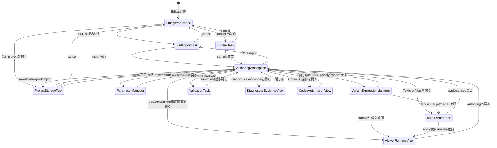

# Editor UX 画面設計 全体像

> 状態: Draft screen design。大まかな画面体系とGlobal UX Flowを定義する。各画面固有のレイアウト・内部遷移は `screens/*.md` に分ける。

## 1. 目的

この文書は、GUI Editor全体の画面体系を定義する。

扱うもの:

- Editor全体の作業文脈
- Global UX Flow
- 各画面の役割
- 画面別仕様ファイルへの入口
- 現行機能ID `UX-FEAT-001`〜`UX-FEAT-037` の大まかな配置

扱わないもの:

- 各画面内部の詳細レイアウト
- task-local flow
- ボタン単位の仕様
- CSSや最終コンポーネント設計
- wave別の詳細実装計画

## 1.1 実装状況メモ

Wave51 は、この画面設計を安全に実装していくための最初の負債解消waveとして final integration `pass` 記録済みである。Wave52 final integration report/review は、PSD Import Task Migration v0 の bounded implementation baseline として `pass` 記録済みである。

実装済み範囲:

- PSD import-plan / structural scaffold の production behavior が `data-testid` selector や fragile parent DOM traversal に依存しないよう、対象箇所を local approval binding に置き換えた。
- App Shell に Authoring Workspace、PSD Import Task、Source Intake Task、Project Storage Task、Validation Task、Tutorial Task、Viewer / Runtime View、Diagnostics / Evidence View、Codex / Automation View の minimal shell surface metadata を追加した。
- PSD Import Task 用の minimal structured observation projector を追加した。
- Wave52 で Generic Task Shell / Task Chrome と PSD Import Task Human UI を実装し、PSD Import は Empty / Authoring Workspace から Task Shell task として開けるようになった。default では常設の巨大 workspace panel として表示されない。
- Wave52 で PSD Import structured observation projector は Task Shell status、compact diagnostics summary、test-facing `data-*` summary へ狭く消費された。Codex-facing read API の最終surfaceではまだない。
- production `data-testid` behavior dependency guard は standalone script と fixture regression として追加された。Wave52 で `check:testids` が standard `check` に統合され、`check:testids:fixtures` は利用可能だが standard `check` には含めない。
- Wave53 final integration report/review `pass` により、Authoring Workspace v0 skeleton が live App Shell に統合され、App Bar / Toolbox / Structure・Parts Tree / Canvas・Preview / Inspector / Parameter Bar / Diagnostics Strip の基本配置ができた。PSD Import は Toolbox launcher から既存 Task Shell task として開ける。desktop/mobile smoke、既存 PSD focused paths、production `data-testid` guard、source/dependency guards は pass 記録済み。
- Wave54 Domains A-H reports/reviews と Domain H verification `pass` により、workspace-scoped Task Window Shell v0、Toolboxから開く PSD Import task window route、Diagnostics / Evidence skeleton route、Codex / Automation skeleton route、selector/test-facing scope hardening、`taskWindowRoutingFocused` が実装・検証済み。Codex / Automation skeleton は LLM/provider integration、repo-side proposal generation、semantic recognition、auto-fix、automatic commit、external transport を追加していない。Wave54 final / Domain J は未完了。

未実装範囲:

- この overview に描く final visual redesign、full panel migration、final toolbox polish、modal/window framework は未実装。Wave53 の workspace layout は v0 skeleton、Wave54 A-H の task window / separated surfaces は v0/skeleton に限る。
- Diagnostics / Evidence View と Codex / Automation View は skeleton route として到達可能だが、最終配置・full表示・legacy panel migration は未実装。
- Mesh generation/tool、Texture Atlas Task、Parameter Manager、Variant / Expression Manager のUI実装は進んでいない。
- Legacy support panels には旧 evidence/debug/Codex-heavy UI が primary skeleton の下/周辺に残っている。

## 2. 基本方針

- Editor起動直後は、PSD import画面ではなくauthoring workspaceとして見える。
- PSD importは通常workspaceから呼び出すtaskである。
- 人間向けUI、debug/evidence表示、Codex-facing surface、test-facing surfaceを分離する。
- 通常UIには、人間が判断・編集するための情報を出す。
- operation ID、digest、generated ref、evidence path、package file set、reload summaryなどは通常UIから分離する。
- Codexが必要とする情報は、可視DOM textではなくdeterministic API、operation evidence、validation report、command host、test-facing structured surfaceで扱う方向を優先する。
- PSD Import / structural scaffoldは、Human UI、Codex-facing surface、test-facing surface、Evidence surfaceを分ける。Human UIはPSD Import Task、Codexはdeterministic command / operation API、testはstable IDs / structured state、evidenceはDiagnostics / Evidence Viewを主に使う。

## 3. Global UX Flow

Global UX Flowは、ユーザーがどの作業文脈にいるかを表す。個別task内の状態遷移は各screen文書に委譲する。



## 4. 画面一覧

| Screen | 役割 | 詳細 |
|---|---|---|
| Empty / Authoring Workspace | 起動直後、import後、通常編集時の中心画面。parts tree、canvas、inspector、toolboxを持つ。 | [screens/authoring-workspace.md](screens/authoring-workspace.md) |
| PSD Import Task | PSD file選択、parse、tree inspection、preview、approval、commitを行うtask画面。 | [screens/psd-import-task.md](screens/psd-import-task.md) |
| Parameter Manager | parameter定義、stable id、display name、min/default/max、grouping、usage referenceを管理する専用画面。 | [screens/parameter-manager.md](screens/parameter-manager.md) |
| Variant / Expression Manager | 表情差分、パーツ差分、衣装差分のstate setとState Matrixを管理する専用画面。 | [screens/variant-expression-manager.md](screens/variant-expression-manager.md) |
| Texture Atlas Task | visible drawableを中心にtexture pageへ自動配置し、layout preview / applyを行うtask画面。 | [screens/texture-atlas-task.md](screens/texture-atlas-task.md) |
| Project Storage Task | save/load/export/import/resetを扱うtask画面。 | [screens/project-storage-task.md](screens/project-storage-task.md) |
| Validation Task | Product Preflightの実行、summary確認、details入口を扱うtask画面。 | [screens/validation-task.md](screens/validation-task.md) |
| Viewer / Runtime View | 編集overlayなしでruntime/viewer確認を行う専用画面。 | [screens/viewer-runtime-view.md](screens/viewer-runtime-view.md) |
| Diagnostics / Evidence View | operation log、generated evidence、package file set、reload summary、full diagnosticsを確認するview/drawer。 | [screens/diagnostics-evidence-view.md](screens/diagnostics-evidence-view.md) |
| Codex / Automation View | Codex proposal review、AI approval、AI transcript、structured command surface状態を扱うview。 | [screens/codex-automation-view.md](screens/codex-automation-view.md) |
| Tutorial Task | tutorial/sample workflowを扱うtask画面。 | [screens/tutorial-task.md](screens/tutorial-task.md) |

## 4.1 共有コンポーネント

| Component | 役割 | 詳細 |
|---|---|---|
| Toolbox | Authoring Workspace上でActive Tool、Task、Viewを起動・切り替えるicon launcher。 | [components/toolbox.md](components/toolbox.md) |
| Parts Tree | part / drawable hierarchy、drawable list、draw order、row操作を扱うStructure / Partsペイン。 | [components/parts-tree.md](components/parts-tree.md) |
| Drawable Inspector | 選択中drawableのdraw order、editor/runtime visibility、opacity、clipping / mask、texture / mesh / atlas summaryを扱うInspector。 | [components/drawable-inspector.md](components/drawable-inspector.md) |
| Mesh Tool | 選択中drawableのinitial mesh generation、mesh overlay編集、Topology / UV編集を扱うActive Tool。 | [components/mesh-tool.md](components/mesh-tool.md) |
| Rig Tool | 選択中part / drawable / meshに対するrig draft/preview、binding、parameter/keyform authoringを扱うActive Tool。 | [components/rig-tool.md](components/rig-tool.md) |
| Dynamics Tool | dynamics group、input / output binding、coefficient、lightweight previewを扱うActive Tool。 | [components/dynamics-tool.md](components/dynamics-tool.md) |
| Parameter / Keyform | active parameterの現在値操作、keyform authoring、Quick Create、全parameter確認用paletteを扱う横断UI。 | [components/parameter-keyform.md](components/parameter-keyform.md) |

## 5. 大まかな画面配置

```text
+--------------------------------------------------------------------------------+
| App Bar                                                                        |
| Project name / save state / mode / key actions / Viewer shortcut               |
+----------+---------------------+-----------------------+----------------------+
| Toolbox  | Structure / Parts   | Canvas / Preview      | Inspector            |
|          |                     |                       |                      |
| Import   | Parts tree          | Empty state or model  | Project / selection  |
| Select   | PSD group-derived   | preview               | details              |
| Mesh     | part containers     |                       | Part / Drawable /    |
| Rig      | drawables / hidden  |                       | Source details       |
| Dynamics | rows                |                       | Contextual controls  |
| Params   | rows                |                       | Contextual controls  |
| Variant  | rows                |                       | Contextual controls  |
| Atlas    | rows                |                       | Contextual controls  |
| Validate | rows                |                       | Contextual controls  |
| Automate |                     |                       |                      |
+----------+---------------------+-----------------------+----------------------+
| Parameter Bar: active parameter / value slider / key markers / key actions      |
+--------------------------------------------------------------------------------+
| Diagnostics Strip: blocking/warning summary only                               |
+--------------------------------------------------------------------------------+
```

## 6. 機能IDの大まかな配置

| 領域 / view | 配置候補の機能ID |
|---|---|
| App Bar | `UX-FEAT-001`, `UX-FEAT-026`, `UX-FEAT-027` |
| Toolbox | `UX-FEAT-006`, `UX-FEAT-013`〜`UX-FEAT-019`, `UX-FEAT-020`〜`UX-FEAT-025`, `UX-FEAT-028`〜`UX-FEAT-032`, `UX-FEAT-037` |
| Parts Tree | `UX-FEAT-008`, `UX-FEAT-009`, `UX-FEAT-010`, `UX-FEAT-019` |
| Canvas / Preview | `UX-FEAT-004`, `UX-FEAT-005`, `UX-FEAT-011`, `UX-FEAT-012` |
| Inspector / Context Panel | `UX-FEAT-002`, `UX-FEAT-003`, `UX-FEAT-010`〜`UX-FEAT-012`, `UX-FEAT-020`〜`UX-FEAT-025` |
| Dynamics Tool | `UX-FEAT-024`, `UX-FEAT-025`, 一部 `UX-FEAT-007`, `UX-FEAT-020`〜`UX-FEAT-023`, `UX-FEAT-028`, `UX-FEAT-029` |
| PSD Import Task | `UX-FEAT-013`〜`UX-FEAT-019` のHuman UI。Codex-facing / test-facing / evidence surfaceは分離 |
| Parameter Manager | `UX-FEAT-002`, `UX-FEAT-003`, 一部 `UX-FEAT-007`, `UX-FEAT-020`〜`UX-FEAT-025`, `UX-FEAT-028`, `UX-FEAT-029`, `UX-FEAT-034` |
| Drawable Inspector / Composition sections | `UX-FEAT-010`, `UX-FEAT-020`, `UX-FEAT-021`, 一部 `UX-FEAT-002`, `UX-FEAT-003`, `UX-FEAT-008`, `UX-FEAT-009` |
| Variant / Expression Manager | 専用IDは未採番。関連: `UX-FEAT-004`, `UX-FEAT-007`, `UX-FEAT-008`, `UX-FEAT-009`, 一部 `UX-FEAT-028`, `UX-FEAT-029`, `UX-FEAT-034` |
| Texture Atlas Task | 専用IDは未採番。関連: `UX-FEAT-004`, `UX-FEAT-008`, `UX-FEAT-009`, `UX-FEAT-019`, 一部 `UX-FEAT-028`, `UX-FEAT-029`, `UX-FEAT-034` |
| Project Storage Task | `UX-FEAT-026`, `UX-FEAT-027`, 一部 `UX-FEAT-035`, `UX-FEAT-036` |
| Validation Task | `UX-FEAT-028`, `UX-FEAT-029` |
| Diagnostics / Evidence View | `UX-FEAT-033`〜`UX-FEAT-036`, 一部 `UX-FEAT-007`, `UX-FEAT-014`, `UX-FEAT-018`, `UX-FEAT-019`, `UX-FEAT-025`, `UX-FEAT-028`〜`UX-FEAT-032` |
| Codex / Automation View | `UX-FEAT-030`, `UX-FEAT-031`, `UX-FEAT-032`, `UX-FEAT-037`, 一部 `UX-FEAT-018`, `UX-FEAT-019`, `UX-FEAT-028`, `UX-FEAT-029`。PSD ImportのCodex-facing operation availabilityを扱う |
| Tutorial Task | `UX-FEAT-006` |

## 7. 未決事項

- Toolboxは Wave53 v0 では左側 launcher として配置済み。Wave54 A-H では PSD Import / Diagnostics / Codex の task-window route が接続済み。最終の visual polish、icon/tooltip behavior、expanded label policy は未決。
- Tool起動時の最終表現は、Wave54 A-H の workspace-scoped task window v0 を前提にしつつ、modal、task window、side panel、dedicated viewのどれを各tool/viewの基本にするかは未決。
- PSD Import taskは Wave54 A-H では workspace-scoped task window として開く。final polish と全task/view共通の最終policyは未決。
- Product PreflightとCodex/Automationの通常UI上の位置付け。
- 通常UIから外したevidence情報を、どの構造化surfaceに残すか。
- Wave54 A-H後の残債として、PSD Import / structural scaffold の可視DOM/text oracleをさらに structured observation / deterministic API / evidence surface へ移し、Codex-facing read APIや最終test-facing surfaceをどう整理するか。
- `check:testids:fixtures` を標準 quality gate または CI-only guard path に広げるか。
