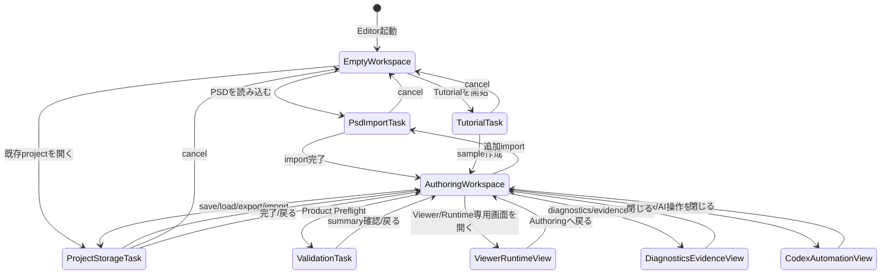

# Editor UX 画面設計 全体像

> 状態: Draft screen design。大まかな画面体系とGlobal UX Flowを定義する。各画面固有のレイアウト・内部遷移は `screens/*.md` に分ける。

## 1. 目的

この文書は、GUI Editor全体の画面体系を定義する。

扱うもの:

- Editor全体の作業文脈
- Global UX Flow
- 各画面の役割
- 画面別仕様ファイルへの入口
- 現行機能ID `UX-FEAT-001`〜`UX-FEAT-037` の大まかな配置

扱わないもの:

- 各画面内部の詳細レイアウト
- task-local flow
- ボタン単位の仕様
- CSSや最終コンポーネント設計
- Wave51の実装範囲

## 2. 基本方針

- Editor起動直後は、PSD import画面ではなくauthoring workspaceとして見える。
- PSD importは通常workspaceから呼び出すtaskである。
- 人間向けUI、debug/evidence表示、Codex-facing surface、test-facing surfaceを分離する。
- 通常UIには、人間が判断・編集するための情報を出す。
- operation ID、digest、generated ref、evidence path、package file set、reload summaryなどは通常UIから分離する。
- Codexが必要とする情報は、可視DOM textではなくdeterministic API、operation evidence、validation report、command host、test-facing structured surfaceで扱う方向を優先する。

## 3. Global UX Flow

Global UX Flowは、ユーザーがどの作業文脈にいるかを表す。個別task内の状態遷移は各screen文書に委譲する。



## 4. 画面一覧

| Screen | 役割 | 詳細 |
|---|---|---|
| Empty / Authoring Workspace | 起動直後、import後、通常編集時の中心画面。parts tree、canvas、inspector、toolboxを持つ。 | [screens/authoring-workspace.md](screens/authoring-workspace.md) |
| PSD Import Task | PSD file選択、parse、tree inspection、preview、approval、commitを行うtask画面。 | [screens/psd-import-task.md](screens/psd-import-task.md) |
| Project Storage Task | save/load/export/import/resetを扱うtask画面。 | [screens/project-storage-task.md](screens/project-storage-task.md) |
| Validation Task | Product Preflightの実行、summary確認、details入口を扱うtask画面。 | [screens/validation-task.md](screens/validation-task.md) |
| Viewer / Runtime View | 編集overlayなしでruntime/viewer確認を行う専用画面。 | [screens/viewer-runtime-view.md](screens/viewer-runtime-view.md) |
| Diagnostics / Evidence View | operation log、generated evidence、package file set、reload summary、full diagnosticsを確認するview/drawer。 | [screens/diagnostics-evidence-view.md](screens/diagnostics-evidence-view.md) |
| Codex / Automation View | Codex proposal review、AI approval、AI transcript、structured command surface状態を扱うview。 | [screens/codex-automation-view.md](screens/codex-automation-view.md) |
| Tutorial Task | tutorial/sample workflowを扱うtask画面。 | [screens/tutorial-task.md](screens/tutorial-task.md) |

## 4.1 共有コンポーネント

| Component | 役割 | 詳細 |
|---|---|---|
| Toolbox | Authoring Workspace上でActive Tool、Task、Viewを起動・切り替えるicon launcher。 | [components/toolbox.md](components/toolbox.md) |
| Mesh Tool | 選択中drawableのinitial mesh generation、mesh overlay編集、Topology / UV編集を扱うActive Tool。 | [components/mesh-tool.md](components/mesh-tool.md) |
| Rig Tool | 選択中part / drawable / meshに対するrig draft/preview、binding、parameter/keyform authoringを扱うActive Tool。 | [components/rig-tool.md](components/rig-tool.md) |
| Parameter / Keyform | active parameterの現在値操作、keyform authoring、全parameter確認用paletteを扱う横断UI。 | [components/parameter-keyform.md](components/parameter-keyform.md) |

## 5. 大まかな画面配置

```text
+--------------------------------------------------------------------------------+
| App Bar                                                                        |
| Project name / save state / mode / key actions / Viewer shortcut               |
+----------+---------------------+-----------------------+----------------------+
| Toolbox  | Structure / Parts   | Canvas / Preview      | Inspector            |
|          |                     |                       |                      |
| Import   | Parts tree          | Empty state or model  | Project / selection  |
| Select   | PSD group-derived   | preview               | details              |
| Mesh     | part containers     |                       | Part / Drawable /    |
| Rig      | drawables / hidden  |                       | Source details       |
| Validate | rows                |                       | Contextual controls  |
| Automate |                     |                       |                      |
+----------+---------------------+-----------------------+----------------------+
| Parameter Bar: active parameter / value slider / key markers / key actions      |
+--------------------------------------------------------------------------------+
| Diagnostics Strip: blocking/warning summary only                               |
+--------------------------------------------------------------------------------+
```

## 6. 機能IDの大まかな配置

| 領域 / view | 配置候補の機能ID |
|---|---|
| App Bar | `UX-FEAT-001`, `UX-FEAT-026`, `UX-FEAT-027` |
| Toolbox | `UX-FEAT-006`, `UX-FEAT-013`〜`UX-FEAT-019`, `UX-FEAT-020`〜`UX-FEAT-025`, `UX-FEAT-028`〜`UX-FEAT-032`, `UX-FEAT-037` |
| Parts Tree | `UX-FEAT-008`, `UX-FEAT-009`, `UX-FEAT-019` |
| Canvas / Preview | `UX-FEAT-004`, `UX-FEAT-005`, `UX-FEAT-011`, `UX-FEAT-012` |
| Inspector / Context Panel | `UX-FEAT-002`, `UX-FEAT-003`, `UX-FEAT-010`〜`UX-FEAT-012`, `UX-FEAT-020`〜`UX-FEAT-025` |
| PSD Import Task | `UX-FEAT-013`〜`UX-FEAT-019` |
| Project Storage Task | `UX-FEAT-026`, `UX-FEAT-027`, 一部 `UX-FEAT-035`, `UX-FEAT-036` |
| Validation Task | `UX-FEAT-028`, `UX-FEAT-029` |
| Diagnostics / Evidence View | `UX-FEAT-033`〜`UX-FEAT-036`, 一部 `UX-FEAT-007`, `UX-FEAT-014`, `UX-FEAT-025`, `UX-FEAT-028`〜`UX-FEAT-032` |
| Codex / Automation View | `UX-FEAT-030`, `UX-FEAT-031`, `UX-FEAT-032`, `UX-FEAT-037`, 一部 `UX-FEAT-018`, `UX-FEAT-019`, `UX-FEAT-028`, `UX-FEAT-029` |
| Tutorial Task | `UX-FEAT-006` |

## 7. 未決事項

- Toolboxは左端固定か、上部toolbarか。
- Tool起動時の表現はmodal、task window、side panel、dedicated viewのどれを基本にするか。
- PSD Import taskはmodalとしてworkspace上に重ねるか、dedicated task viewとして表示するか。
- Product PreflightとCodex/Automationの通常UI上の位置付け。
- 通常UIから外したevidence情報を、どの構造化surfaceに残すか。
- `UX-FEAT-018` / `UX-FEAT-019` のproduction `data-testid` couplingを画面分離前に解消する必要があるか。
