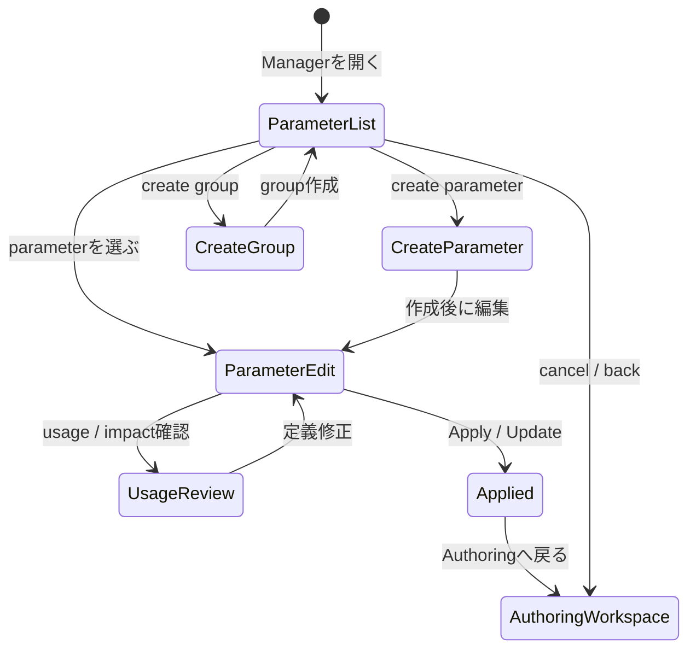

# Parameter Manager 画面仕様

> 状態: Draft screen spec。

## 1. 役割

Parameter Managerは、parameterそのものの定義、命名、min / default / max、grouping、usage reference、validationを扱う専用管理画面である。

この画面は、現在値を動かすParameter Barではない。Parameter Barは「今どのparameterのどの値を見ているか」を扱う。Parameter Managerは「どのparameterが存在し、それが何を意味し、どこで使われているか」を管理する。

基本方針:

- parameter definitionとcurrent value operationを分離する。
- stable idとdisplay nameを分ける。
- stable id変更は通常renameではなく、参照更新を伴うrefactor operationとして扱う。
- Rig ToolやParameter BarからはQuick Create / Selectを提供し、詳細整理はParameter Managerへ送る。
- Editorはsemantic templateや自動分類を持たない。必要ならユーザーまたはCodexが明示的に作成・分類する。

## 2. 開き方

Parameter Managerはmodalではなく、Authoring Workspaceから開く専用Manager / Task画面として扱う。

基本遷移:

```text
Authoring Workspace
  -> Toolbox / Task group / Parameter Manager
  -> Parameter Manager
  -> parameter / groupを作成・整理
  -> Apply / Update
  -> Authoring Workspace
```

Toolからの導線:

```text
Rig Tool / Dynamics Tool / Parameter Bar
  -> parameter selector
  -> Quick Create
  -> Open Parameter Manager
```

Quick Createは、作業を止めずに最低限のparameterを作る入口である。詳細な命名、grouping、usage整理、validationはParameter Managerで行う。

## 3. Task-Local Flow



状態:

| State | 内容 |
|---|---|
| Parameter List | parameter groupとparameter tableを確認する。 |
| Create Parameter | stable id、display name、min/default/max、groupを指定して作成する。 |
| Create Group | parameter groupを作成する。 |
| Parameter Edit | parameter定義を編集する。 |
| Usage Review | rig keyform、subtree opacity、dynamics、viewer usageなどの参照を確認する。 |
| Applied | 定義変更をproject stateへ反映した状態。 |

## 4. 画面配置

```text
+--------------------------------------------------------------------------------+
| Parameter Manager Header                                                        |
| create parameter / create group / validate / apply / back                       |
+----------------------+-------------------------------+-------------------------+
| Parameter Groups     | Parameter Table               | Parameter Inspector     |
|                      |                               |                         |
| Face                 | stable id / display name      | display name            |
| Eyes                 | group / type                  | stable id               |
| Mouth                | min / default / max           | min / default / max     |
| Hair                 | usage count / warnings        | group                   |
| Body                 |                               | type                    |
| Custom               |                               | usage references        |
+----------------------+-------------------------------+-------------------------+
| Usage / Impact Panel: rig keyforms / opacity effects / dynamics / viewer usage  |
+--------------------------------------------------------------------------------+
| Check Strip: duplicate id / unused parameter / out-of-range keyforms             |
+--------------------------------------------------------------------------------+
```

主領域:

| 領域 | 役割 |
|---|---|
| Parameter Manager Header | create、validate、apply、戻る導線を表示する。 |
| Parameter Groups | group一覧とfilterを表示する。 |
| Parameter Table | parameter定義を一覧し、選択・検索・sortを行う。 |
| Parameter Inspector | 選択parameterの詳細定義を編集する。 |
| Usage / Impact Panel | 参照箇所と変更影響を確認する。 |
| Check Strip | duplicate id、unused、out-of-range keyformなどのsummaryを出す。 |

## 5. Stable ID / Display Name

Parameterはstable idとdisplay nameを分ける。

| 項目 | 役割 |
|---|---|
| stable id | rig keyform、subtree opacity effect、dynamics、viewer controlsなどの参照に使うmachine-readable identifier。 |
| display name | 人間向けの表示名。作業中に変更しやすい。 |

方針:

- display name変更は軽いrenameとして扱う。
- stable id変更は、既存参照を更新するrefactor operationとして扱う。
- stable id変更時はUsage / Impact Panelで影響範囲を表示する。
- stable idは重複不可。

## 6. Parameter Definition

Parameter Inspectorに置くもの:

- stable id
- display name
- type
- min value
- default value
- max value
- group
- description / note
- usage references
- validation warnings
- refactor stable id action
- delete / archive action

初期type:

- scalar parameter

将来候補:

- 2D parameter pair
- vector / compound parameter
- enum-like state parameter

初期UIではscalar parameterを中心にする。2D / compound parameterはParameter Bar側のexpanded UIと将来のManager拡張で扱う。

## 7. Quick Create / Select

Quick Createは、Rig Tool、Dynamics Tool、Parameter Barなど、parameterを必要とする場所から呼び出せる軽量入口である。

Quick Createに置くもの:

- display name
- stable id auto suggestion
- min / default / max
- group
- create action
- open in Parameter Manager

Quick Createに置かないもの:

- full usage table
- refactor operation
- complex grouping management
- validation report全文

Quick Createはparameter作成の近道であり、Parameter Managerの代替ではない。

## 8. Usage / Impact

Usage / Impact Panelに表示するもの:

- rig keyform references
- subtree opacity effect references
- drawable opacity keyform references
- dynamics input / output references
- viewer parameter control usage
- variant / expression parameter-driven reference候補
- out-of-range keyform warnings
- unused parameter warning
- delete / stable id refactor impact

表示粒度:

- 通常UIではsummaryと参照先への導線を表示する。
- raw evidenceやoperation payloadは表示しない。

## 9. 他UIとの関係

| UI | Parameter Managerとの関係 |
|---|---|
| Parameter Bar | active parameterとcurrent valueを操作する。parameter定義の詳細管理はManagerで行う。 |
| Parameter Control Palette | 全parameterを動かして確認する。定義管理はManagerへ送る。 |
| Rig Tool | rig keyformやsubtree opacity effectでparameterを参照する。必要ならQuick Createを使う。 |
| Dynamics Tool | input / output parameterを参照する。必要ならQuick Createを使う。 |
| Drawable Inspector | opacity keyformでparameterを参照する可能性がある。 |
| Variant / Expression Manager | 将来parameter-driven switching / fadeを扱う場合、parameter参照を持つ可能性がある。 |
| Viewer / Runtime View | parameter controlsを表示し、定義されたmin/default/maxに従って操作する。 |
| Product Preflight | duplicate id、unused parameter、out-of-range keyform、missing referenceをwarning / blockingとして扱う。 |

## 10. 通常表示しないもの

- operation ID
- generated refs全文
- evidence path
- raw runtime evidence
- validator payload全文
- command result payload全文

これらは通常UIの視認性を悪化させるため、Diagnostics / Evidence ViewまたはCodex-facing structured surfaceへ分離する。

## 11. 関連機能ID

現行の `UX-FEAT-001`〜`UX-FEAT-037` の棚卸では、Parameter Manager専用の機能IDはまだ明示採番されていない。

関連する既存機能:

- 一部 `UX-FEAT-007`: Viewer / Runtime parameter controls
- 一部 `UX-FEAT-020`〜`UX-FEAT-025`: composition / rig / dynamics parameter references
- 一部 `UX-FEAT-028` / `UX-FEAT-029`: Product Preflight / validation
- 一部 `UX-FEAT-034`: runtime / package evidence summary

後続の棚卸またはwave計画では、Parameter Manager専用のUX feature IDを追加するか検討する。

## 12. 未決事項

- initial scalar parameter typeの具体schema。
- stable id auto suggestionの規則。
- groupの階層化を許可するか、flat groupに留めるか。
- parameter deleteを物理削除にするか、archive / unused扱いにするか。
- 2D / compound parameterをいつManager初期仕様に含めるか。
