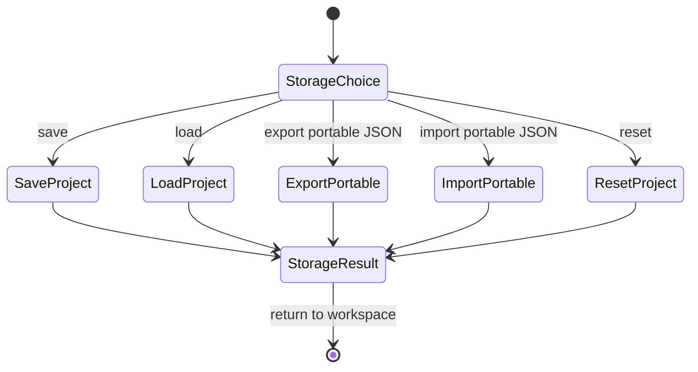

# Project Storage Task 画面仕様

> 状態: Superseded direction for Toolbox placement / Draft legacy screen spec。

## 1. 役割

Project Storage Taskは、save/load/export/import/resetを扱うtask画面として定義されていた。

Workspace-first UXでは、日常保存はWorkspace Save、共有・持ち運びはPortable JSON Exportとして分離する。これらはworkspace内部の編集toolではないため、Toolbox taskではなくHeaderのWorkspace menuまたはWorkspace detailsで扱う。新しい正の方針は [workspace-save-and-navigation.md](workspace-save-and-navigation.md) を参照する。

## 2. Task-Local Flow

## 3. 表示するもの

- 操作種別
- 成功/失敗
- project名 / revision
- source bytesやportable bundleに関する重要警告

## 4. 通常表示しないもの

- package file set詳細
- reload summary詳細
- file path一覧
- raw persistence evidence

詳細は [diagnostics-evidence-view.md](diagnostics-evidence-view.md) に寄せる。

## 5. 関連機能ID

- `UX-FEAT-026`
- `UX-FEAT-027`
- 一部 `UX-FEAT-035`, `UX-FEAT-036`

## 6. 後続方針

- Project StorageをToolboxから外す。
- Portable JSON Import / ExportはHeaderのWorkspace menuへ移す。
- Save / Save As / Open WorkspaceはHeaderのWorkspace menuへ移す。
- Workspaceを開いていない状態では編集UIを出さず、Workspace GateでCreate / Open / Import Portable JSONだけを提示する。
