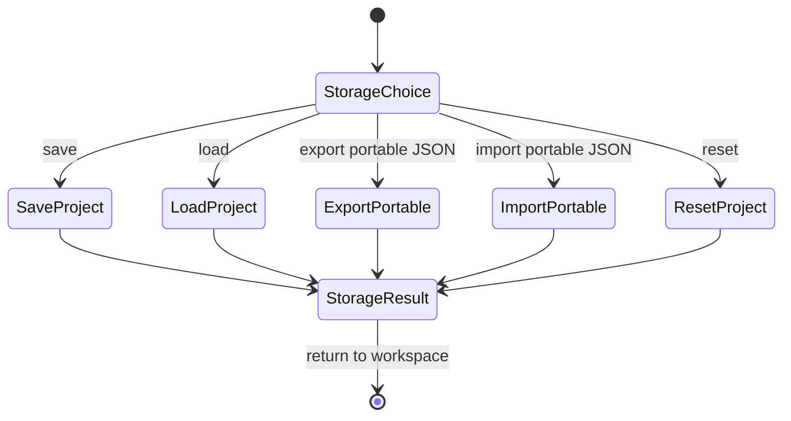

# Project Storage Task 画面仕様

> 状態: Draft screen spec。

## 1. 役割

Project Storage Taskは、save/load/export/import/resetを扱うtask画面である。

## 2. Task-Local Flow

## 3. 表示するもの

- 操作種別
- 成功/失敗
- project名 / revision
- source bytesやportable bundleに関する重要警告

## 4. 通常表示しないもの

- package file set詳細
- reload summary詳細
- file path一覧
- raw persistence evidence

詳細は [diagnostics-evidence-view.md](diagnostics-evidence-view.md) に寄せる。

## 5. 関連機能ID

- `UX-FEAT-026`
- `UX-FEAT-027`
- 一部 `UX-FEAT-035`, `UX-FEAT-036`
