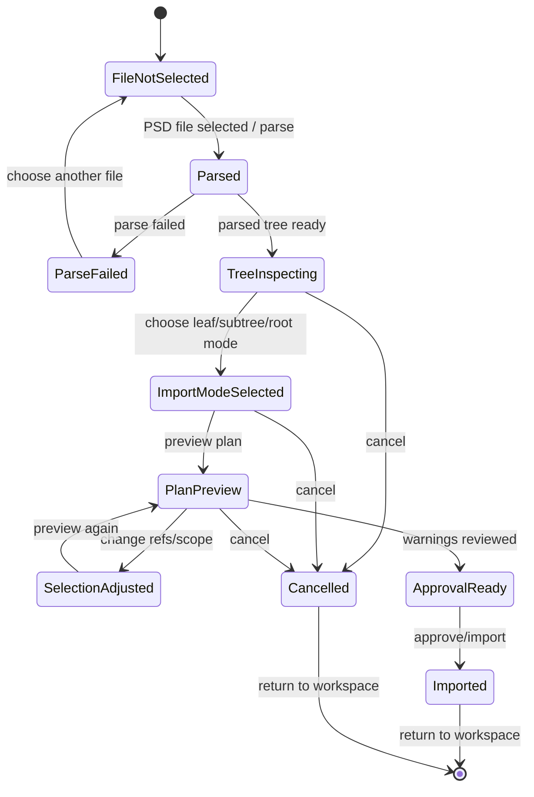

# PSD Import Task 画面仕様

> 状態: Draft screen spec。

## 1. 役割

PSD Import Taskは、PSD file選択、parse、tree inspection、import preview、approval、commitを行うtask画面である。

通常workspaceを埋め尽くす常設panelではなく、toolboxまたはempty stateから呼び出すtask window / modal / dedicated task panelとして扱う。

## 2. Task-Local Flow



## 3. レイアウト

```text
+--------------------------------------------------------------------------------+
| PSD Import Task: filename / parse status / cancel                               |
+-----------------------------+------------------------------+-------------------+
| PSD Tree                    | Import Preview               | Import Settings   |
| group/layer hierarchy       | selected layer/group preview | mode              |
| visibility / hidden         | bounds / opacity / warnings  | destination       |
| selected refs               | generated parts/drawables    | approval summary  |
| blocked/skipped markers     | hidden drawable count        | actions           |
+-----------------------------+------------------------------+-------------------+
| Warnings: blocking / warning summary only                                       |
+--------------------------------------------------------------------------------+
```

## 4. 表示するもの

- file summary: filename、parse status、layer/group数、hidden layer数
- PSD tree: group / layer階層、visibility、bounds有無、選択状態
- import mode: leaf import、selected subtree structural import、root import候補
- preview summary: 生成予定part数、drawable数、hidden drawable数、blocked/skipped数
- selected item preview: 選択中group/layerの簡易preview、bounds、visibility、opacity
- destination: どのproject/part配下へ入るか
- warnings: zero-size、materialize不可、source bytes不足、unsupported PSD features
- action summary: preview、approve/import、cancel

## 5. 通常表示しないもの

- approval digest
- operation ID
- generated ref全文
- raw parser payload
- evidence path
- parser内部オブジェクト

## 6. 関連機能ID

- `UX-FEAT-013`
- `UX-FEAT-014`
- `UX-FEAT-015`
- `UX-FEAT-016`
- `UX-FEAT-017`
- `UX-FEAT-018`
- `UX-FEAT-019`

## 7. 注意点

- `UX-FEAT-018` / `UX-FEAT-019` は現状production UIが `data-testid` selectorでapproved refsやsubmit disabled状態を同期している。
- このtask layoutへの移行は、単なるDOM移動ではなく、state synchronization境界の整理が必要になる可能性がある。
