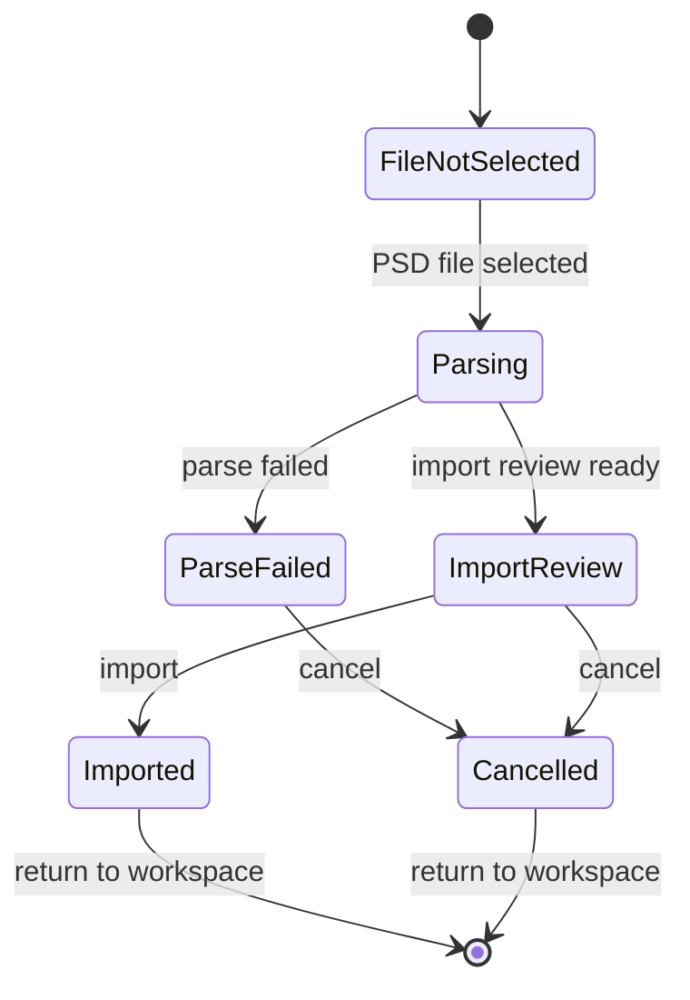

# PSD Import Task 画面仕様

> 状態: Draft screen spec。Wave54 Domains A-H `pass` / Domain H verification `pass` により、PSD Import の workspace-scoped task window route と bounded content polish を反映済み。Wave54 final / Domain J は未完了。

## 1. 役割

PSD Import Taskは、PSD file選択、parse、Import Review、commitを行うtask画面である。

通常workspaceを埋め尽くす常設panelではなく、Authoring Workspace上に重なる大きめのmodalとして扱う。Workspaceを背後に残しつつ、PSD importという一時taskへユーザーの注意を集中させる。

PSD import / structural scaffoldには、人間向けUI、Codex-facing surface、test-facing surface、evidence surfaceの4つの観測面がある。PSD Import Taskは人間向けUIの主画面であり、Codexやtestのためにverboseなdebug情報を常時表示しない。

## 2. Task-Local Flow



## 3. Surface分離

PSD Importまわりは次のsurfaceへ分離する。

```text
Human UI
  PSD Import Task

Codex-facing Surface
  deterministic command / operation API

Test-facing Surface
  stable test ids / structured state snapshots

Evidence Surface
  Diagnostics / Evidence View
```

| Surface | 役割 | 置くもの |
|---|---|---|
| Human UI | ユーザーがEditorに何が作られるか、選んだPSDが期待したものか、importしてよいかを判断する。 | 作成予定Parts構造、PSD単体preview、destination summary、行単位issue badge、import / cancel |
| Codex-facing Surface | Codexが人間操作と同等の処理をdeterministic APIで実行する。 | parse / plan / approve / preview / commit / latest result operations |
| Test-facing Surface | E2E / UI testが表示文言やDOM構造に過度依存せず状態を検証する。 | stable `data-testid`、structured state snapshot、status flags、hasIssues |
| Evidence Surface | operationや生成結果の詳細証拠を確認する。 | operation ID、approval ID、plan digest、generated refs、evidence path、raw diagnostics |

## 4. レイアウト

```text
+--------------------------------------------------------------------------------+
| PSD Import Modal Header                                                        |
| selected file (secondary) / destination / issue state / Import / Cancel         |
+-----------------------------------------+--------------------------------------+
| Planned Parts Structure                 | PSD Preview                           |
| Part Container / Drawable / Hidden rows  | selected PSD only                     |
| row-level Issue badge + tooltip          | visible layer/group preview           |
| destination context                      | no existing canvas composition        |
+-----------------------------------------+--------------------------------------+
| Footer: Import / Cancel                                                        |
+--------------------------------------------------------------------------------+
```

## 5. Human UIに表示するもの

- 作成予定Parts構造
  - PSD group由来のPart Container
  - PSD leaf layer由来のDrawable
  - hidden layer由来のHidden Drawable
  - hidden group由来のPart Container editor-hidden gate
  - group自体はDrawableにしない
- destination summary
  - 初回importまたは選択なし: project root直下
  - part選択中: 選択中part配下
  - drawable選択中: その親part配下
  - 初期UIではdestination pickerを置かず、決定されたdestinationだけを短く表示する
- PSD単体preview
  - 目的は「読み込もうとしているPSDが合っているか」を確認すること
  - 既存Canvas / 既存Parts / import先との合成はしない
  - visible layer / visible groupだけを対象にした簡易previewを理想形とする
  - hidden layerはpreview上では非表示にする
  - hidden group配下のlayerはpreview上では非表示にする
  - PSD canvas boundsに収めて表示する
  - layer opacityは可能なら反映する
  - clippingはImport Review previewの必須要件にしない
- issue表示
  - 問題の有無は二値で扱う
  - 問題のある行に `Issue` badgeを出す
  - 詳細はtooltipに閉じ、画面上に一覧やraw diagnosticsを常時表示しない
- action
  - `Import`
  - `Cancel`

## 6. Human UIに通常表示しないもの

- PSD canvas size
- layer / group / hidden count
- unsupported要素の一覧
- warning count
- choose another file action
- approval digest
- operation ID
- generated ref全文
- PSD node ref全文
- plan digest全文
- materialized bytes詳細
- raw parser payload
- evidence path
- parser内部オブジェクト
- command payload全文
- test selector都合の文字列

これらはDiagnostics / Evidence View、Codex-facing structured surface、test-facing structured surfaceへ分離する。

PSD canvas size、layer / group / hidden count、unsupported要素の詳細は、通常ユーザーの主判断材料にしない。必要な場合も、行単位issue tooltipやDiagnostics / Evidence Viewへ寄せる。

## 6.1 PSD Preview

PSD Previewは、これからimportするPSD単体がユーザーの意図したファイルかを確認するための表示である。

表示対象:

- 選択されたPSDファイルだけ。
- PSD内でeffective visibleなlayer。
- visible group配下のvisible layer。
- 可能ならlayer opacity。

表示対象にしないもの:

- 既存workspace model。
- import先との合成結果。
- hidden layer。
- hidden group配下のlayer。
- clipping再現。
- Photoshop pixel perfect parity。
- debug / evidence / parser detail。

このpreviewは、Workspace Canvasにimport後modelを描く機能とは別である。Workspace CanvasはEditor modelにcommitされたdrawableを描く。PSD Previewはimport前のファイル確認に限る。

## 6.2 Hidden Group Import Semantics

PSD groupがhiddenの場合、そのgroupに対応するPart Containerはeditor-only hidden gateを持つ。

```text
PSD hidden group
  -> Part Container editor-hidden
  -> descendants are effectively hidden in Editor Canvas
  -> child Drawable runtime visibility is not rewritten merely because the parent group was hidden
```

この挙動はWave60で定義したPart Container visibilityと同じ意味である。

- hidden groupはPart Containerとして作る。
- group自体をDrawableにはしない。
- hidden groupの子Drawable個別visibilityは破壊しない。
- parent containerをvisibleに戻すと、子Drawable個別visibilityに従って表示される。
- runtime / export初期状態には影響させない。
- runtimeに出る表示切替は、Variant / Expression、parameter-driven opacityなどの各機能で扱う。

leaf layer自体がhiddenの場合は、従来どおりHidden Drawableとして扱う。hidden group由来のeditor-hidden gateとは別概念である。

### 6.2.1 Parser Adapter Note

`@webtoon/psd` v0.4.0 の public APIでは、Layerは `isHidden` を公開しているが、Groupは `isHidden` を公開していない。したがって、public APIだけに依存するとPSD groupのhidden状態を取得できず、hidden groupがvisible groupとしてimportされる可能性がある。

実装でhidden groupを扱う場合、次のどちらかが必要になる。

1. PSD parser adapter内だけで、`@webtoon/psd` の runtime private shapeを限定的に読む。
2. 別のPSD layer record解析経路を追加し、group frameのhidden flagを取得する。

当面の現実的な方針は1である。`Group` instanceのruntime shapeには `layerFrame.layerProperties.hidden` が残っているため、adapter内に小さなcompatibility shimを置けば読める。

```ts
type WebtoonPsdGroupPrivateShape = {
  readonly layerFrame?: {
    readonly layerProperties?: {
      readonly hidden?: boolean;
    };
  };
};
```

このprivate shape参照は、PSD Import adapterの境界内に閉じ込める。UI、operation payload、package schema、validatorはprivate parser objectへ依存しない。

実装時の注意:

- public `Layer.isHidden` をLayer hiddenの第一候補にする。
- Group hiddenはadapter-local helperで `layerFrame.layerProperties.hidden === true` を読む。
- private fieldが存在しない場合はvisible扱いにfallbackし、parse全体を壊さない。
- fallbackが発生したことをDiagnostics / Evidence側に残すかは後続判断とする。Human UIにraw parser detailを常時表示しない。
- adapter unit testには、Group-like objectのprivate hidden shapeを読むケースと、shapeが欠落しても落ちないケースを入れる。
- このshimは `@webtoon/psd` versionに依存するため、parser version update時の確認対象にする。

## 7. Codex-facing Surface

Codex-facing Surfaceは、画面上の人間向けtextを読むのではなく、人間操作と同等の処理をdeterministic command / operation APIで実行する。

必要なoperation例:

```text
parsePsdSource(...)
getPsdImportPlan(...)
approvePsdImportPlan(...)
previewStructuralScaffold(...)
commitStructuralScaffold(...)
getLatestImportResult(...)
```

方針:

- CodexはPSD Import Taskに表示されるdebug textへ依存しない。
- Codexは構造的stateとoperation resultを読む。
- 人間向けUIをCodex観測用に過剰表示しない。
- Codex-facing structural command parityは、このsurfaceの充実として扱う。

## 8. Test-facing Surface

Test-facing Surfaceは、E2E / UI testが表示文言やDOM構造へ過度に依存しないための安定した観測面である。

想定するstructured state:

```text
importTask.state = {
  sourceLoaded,
  parseStatus,
  destination,
  importReviewStatus,
  commitEnabled,
  hasIssues
}
```

方針:

- stable `data-testid` は維持してよい。
- ただしtest oracleを人間向けdebug textや巨大DOMへ寄せない。
- approval refsやsubmit disabled状態の同期は、UI textではなくstructured state / status flagsで扱う方向を優先する。

## 9. Evidence Surface

PSD import / structural scaffoldの詳細証拠はDiagnostics / Evidence Viewへ置く。

Evidence Surfaceに置くもの:

- operation ID
- approval ID
- plan digest
- generated refs
- evidence path
- batch result
- raw parser diagnostics
- raw structural scaffold diagnostics
- materialized bytes詳細
- package-relative path

PSD Import Taskからは、必要に応じてDiagnostics / Evidence Viewを開く導線だけを持つ。

## 10. 関連機能ID

- `UX-FEAT-013`
- `UX-FEAT-014`
- `UX-FEAT-015`
- `UX-FEAT-016`
- `UX-FEAT-017`
- `UX-FEAT-018`
- `UX-FEAT-019`

## 11. 注意点

- `UX-FEAT-018` / `UX-FEAT-019` はWave51前の実装ではproduction UIが `data-testid` selectorでapproved refsやsubmit disabled状態を同期していた。
- Wave51 Domain Bで対象の production behavior coupling は local approval binding へ置き換え済み。stable `data-testid` はtest-facing observation hookとして維持されている。
- Wave51 Domain DでPSD Import Task structured observation projectorはpreparedになった。
- Wave52 Domain D/Eで、PSD Import は Empty / Authoring Workspace から Task Shell task として開けるようになり、default では常設の巨大 workspace panel ではなくなった。Generic Task Shell / Task Chrome と PSD Import Task Human UI が接続され、structured observation projector は Task Shell status、compact diagnostics summary、test-facing `data-*` summary へ狭く消費されている。
- Wave52 Domain Eで `psdStructuralInitialStateFocused`、`psdImportPlanCodexFocused`、`psdImportPlanFocused`、`psdMultiLayerBatchFocused`、`psdImportFocused` が pass し、production `data-testid` guard は `check:testids` として standard `check` に統合された。`check:testids:fixtures` は利用可能だが standard `check` には含めない。
- Wave54 A-H で、Generic workspace-scoped Task Window Shell v0、Toolboxからの PSD Import task-window route、Close / Back / Escape の workspace return、PSD-specific content polish、task-window scoped selector helper、`taskWindowRoutingFocused` と既存 PSD focused IDs の pass が記録済みである。
- このtask layoutへの移行は、まだ単なるDOM移動ではない。final task-window/dedicated-view policy、test-facing structured surfaceの完成、Diagnostics / Evidence Viewへの最終導線、mobile task-window routing の登録済み focused gate は後続waveで決める。
- 目指す姿は、PSD Import Taskを巨大なdebug panelにしないこと。Human UIは、作成予定Parts構造、PSD単体preview、行単位Issue badge、Import / Cancelへ絞る。Codex / test / evidenceはそれぞれ専用surfaceへ分離する。
