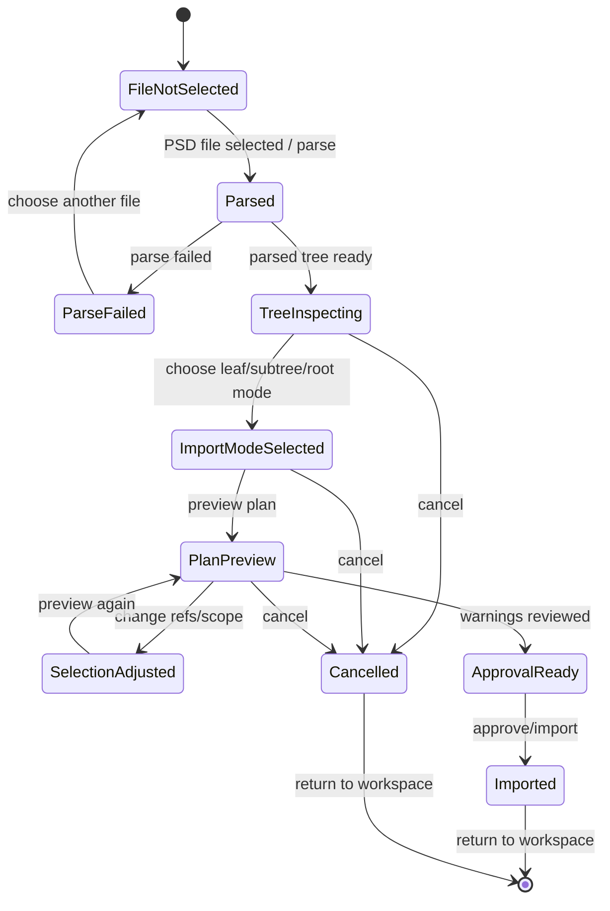

# PSD Import Task 画面仕様

> 状態: Draft screen spec。

## 1. 役割

PSD Import Taskは、PSD file選択、parse、tree inspection、import preview、approval、commitを行うtask画面である。

通常workspaceを埋め尽くす常設panelではなく、toolboxまたはempty stateから呼び出すtask window / modal / dedicated task panelとして扱う。

PSD import / structural scaffoldには、人間向けUI、Codex-facing surface、test-facing surface、evidence surfaceの4つの観測面がある。PSD Import Taskは人間向けUIの主画面であり、Codexやtestのためにverboseなdebug情報を常時表示しない。

## 2. Task-Local Flow



## 3. Surface分離

PSD Importまわりは次のsurfaceへ分離する。

```text
Human UI
  PSD Import Task

Codex-facing Surface
  deterministic command / operation API

Test-facing Surface
  stable test ids / structured state snapshots

Evidence Surface
  Diagnostics / Evidence View
```

| Surface | 役割 | 置くもの |
|---|---|---|
| Human UI | ユーザーが何を読み込み、どう展開され、承認してよいか判断する。 | source summary、rights/provenance確認、PSD tree、import scope、scaffold preview、warning summary、approve / commit state |
| Codex-facing Surface | Codexが人間操作と同等の処理をdeterministic APIで実行する。 | parse / plan / approve / preview / commit / latest result operations |
| Test-facing Surface | E2E / UI testが表示文言やDOM構造に過度依存せず状態を検証する。 | stable `data-testid`、structured state snapshot、status flags、warning count |
| Evidence Surface | operationや生成結果の詳細証拠を確認する。 | operation ID、approval ID、plan digest、generated refs、evidence path、raw diagnostics |

## 4. レイアウト

```text
+--------------------------------------------------------------------------------+
| PSD Import Header                                                              |
| source summary / rights check / parse / preview / approve / commit / cancel     |
+--------------------------+----------------------------+------------------------+
| PSD Structure Tree       | Import Preview             | Import Inspector       |
| groups / layers          | resulting parts/drawables  | selected node summary  |
| visible / hidden         | hierarchy scaffold preview | import mode            |
| selected scope           | warning highlights         | visibility behavior    |
| approval state           | hidden drawable count      | source summary         |
+-----------------------------+------------------------------+-------------------+
| Import Check Strip: hidden drawables / missing bounds / unapproved / stale plan |
+--------------------------------------------------------------------------------+
```

## 5. Human UIに表示するもの

- source summary: filename、parse status、layer/group数、hidden layer数
- rights / provenance 確認状態
- PSD tree: group / layer階層、visibility、bounds有無、選択状態
- import mode: leaf import、selected subtree structural import、root import候補
- scaffold preview summary: 生成予定part数、drawable数、texture scaffold数、mesh scaffold数、hidden drawable数、blocked/skipped数
- selected item preview: 選択中group/layerの簡易preview、bounds、visibility、opacity
- destination: どのproject/part配下へ入るか
- warnings: zero-size、materialize不可、source bytes不足、unsupported PSD features
- action summary: parse、preview、approve、commit、cancel
- approval / commit state

## 6. Human UIに通常表示しないもの

- approval digest
- operation ID
- generated ref全文
- PSD node ref全文
- plan digest全文
- materialized bytes詳細
- raw parser payload
- evidence path
- parser内部オブジェクト
- command payload全文
- test selector都合の文字列

これらはDiagnostics / Evidence View、Codex-facing structured surface、test-facing structured surfaceへ分離する。

## 7. Codex-facing Surface

Codex-facing Surfaceは、画面上の人間向けtextを読むのではなく、人間操作と同等の処理をdeterministic command / operation APIで実行する。

必要なoperation例:

```text
parsePsdSource(...)
getPsdImportPlan(...)
approvePsdImportPlan(...)
previewStructuralScaffold(...)
commitStructuralScaffold(...)
getLatestImportResult(...)
```

方針:

- CodexはPSD Import Taskに表示されるdebug textへ依存しない。
- Codexは構造的stateとoperation resultを読む。
- 人間向けUIをCodex観測用に過剰表示しない。
- Codex-facing structural command parityは、このsurfaceの充実として扱う。

## 8. Test-facing Surface

Test-facing Surfaceは、E2E / UI testが表示文言やDOM構造へ過度に依存しないための安定した観測面である。

想定するstructured state:

```text
importTask.state = {
  sourceLoaded,
  parseStatus,
  selectedScope,
  approvalStatus,
  scaffoldPreviewStatus,
  commitEnabled,
  warningCount
}
```

方針:

- stable `data-testid` は維持してよい。
- ただしtest oracleを人間向けdebug textや巨大DOMへ寄せない。
- approval refsやsubmit disabled状態の同期は、UI textではなくstructured state / status flagsで扱う方向を優先する。

## 9. Evidence Surface

PSD import / structural scaffoldの詳細証拠はDiagnostics / Evidence Viewへ置く。

Evidence Surfaceに置くもの:

- operation ID
- approval ID
- plan digest
- generated refs
- evidence path
- batch result
- raw parser diagnostics
- raw structural scaffold diagnostics
- materialized bytes詳細
- package-relative path

PSD Import Taskからは、必要に応じてDiagnostics / Evidence Viewを開く導線だけを持つ。

## 10. 関連機能ID

- `UX-FEAT-013`
- `UX-FEAT-014`
- `UX-FEAT-015`
- `UX-FEAT-016`
- `UX-FEAT-017`
- `UX-FEAT-018`
- `UX-FEAT-019`

## 11. 注意点

- `UX-FEAT-018` / `UX-FEAT-019` はWave51前の実装ではproduction UIが `data-testid` selectorでapproved refsやsubmit disabled状態を同期していた。
- Wave51 Domain Bで対象の production behavior coupling は local approval binding へ置き換え済み。stable `data-testid` はtest-facing observation hookとして維持されている。
- Wave51 Domain DでPSD Import Task structured observation projectorはpreparedになったが、現時点ではUI、E2E、Codex-facing read APIからは未使用。
- このtask layoutへの移行は、まだ単なるDOM移動ではない。final task shell placement、human summary、test-facing structured surface、Diagnostics / Evidence Viewへの導線は後続waveで決める。
- 目指す姿は、PSD Import Taskを巨大なdebug panelにしないこと。Human UIは判断に必要なsummaryへ絞り、Codex / test / evidenceはそれぞれ専用surfaceへ分離する。
