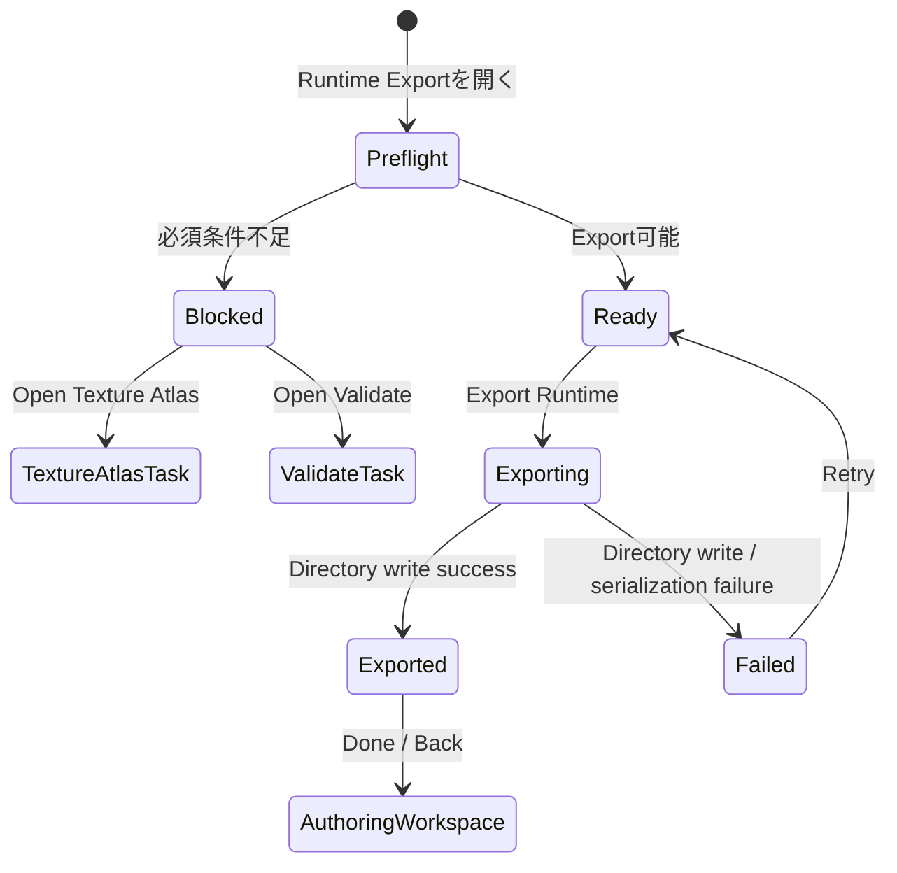

# Runtime Export Task v0 画面仕様

> 状態: Accepted direction / Draft screen spec。

## 1. 役割

Runtime Export Taskは、Editorで作成したモデルを外部runtime app向けの実行用成果物として書き出す専用Task画面である。

想定する将来利用は、camera capture / tracking appがparameter値を送り、外部runtime appが透明背景でキャラクターを描画し、その画面をOBSなどが取り込む流れである。

このTaskはruntime/playerを作らない。Editor内でexport bundleを再読み込み検証しない。Viewer / Runtime Viewの `Atlas Runtime` が、Editor内での現在の完成品確認を担う。

満たすべきUX:

- ユーザーが、Runtime Exportにはcurrent atlasが必須であることを理解できる。
- Texture Atlasが未生成またはstaleならExportに進めない。
- Export対象がruntime graph所属Drawableに限られ、Drawable Poolの未所属Drawableは対象外であることを理解できる。
- Validateに警告がある場合は、必要ならValidateを見るよう促される。
- Exportできる状態なら、directory runtime exportを作成できる。

## 2. 開き方

Runtime Export Taskは、Authoring Workspaceから開く専用Task画面として扱う。

基本遷移:

```text
Authoring Workspace
  -> Toolbox / Task group / Runtime Export
  -> Runtime Export Task
  -> Export Runtime
```

Workspace SaveやPortable JSON Exportとは別責務である。HeaderのSave操作やWorkspace menuの通常保存とは混ぜない。

## 3. Export前提

Runtime Export v0は、Editor側で必要な準備が終わっていることを前提にする。

必須:

- workspaceがopenしている。
- modelにruntime対象Drawableが存在する。
- Texture AtlasがApply済みである。
- Texture Atlasがcurrentである。
- atlas page binaryが存在し、byte length / digest / media type / dimensionsが正しい。
- atlas placementsがruntime対象Drawableを覆っている。
- runtime graph materializationに成功する。

Export不可の場合、Taskは理由を短く示し、必要なTaskへ進む導線を出す。

例:

| 状態 | 表示 | Primary action |
|---|---|---|
| Atlas未生成 | `Runtime Export requires an applied Texture Atlas.` | `Open Texture Atlas` |
| Atlas stale | `Texture Atlas is out of date.` | `Regenerate Atlas` / `Open Texture Atlas` |
| Atlas binary missing | `Atlas texture bytes are missing.` | `Open Texture Atlas` |
| runtime graph変換失敗 | `Runtime graph could not be built.` | `Open Validate` |

## 4. 対象選定

Runtime Exportの対象は、runtimeで使われるDrawableだけである。

### 含めるもの

| 対象 | 扱い |
|---|---|
| Deformer hierarchyに所属し、Texture Atlasに配置済みのDrawable | Export対象 |
| hiddenな所属済みDrawable | Export対象。runtimeで表示され得るため |
| keyform / dynamics / parameterで変化するDrawable | Export対象。所属済みかつatlas配置済みであること |
| mask source / clipping sourceとして使われるDrawable | Export対象。対象runtime drawableに必要であること |

### 除外するもの

| 対象 | 扱い |
|---|---|
| Drawable Pool上の未所属Drawable | 単純にExport対象外。warningではない |
| Parts Container | textureを持たない構造ノード |
| Deformer | textureを持たない変形ノード。ただしruntime graphにはrig controlとして含まれる |
| mesh preview / draft mesh | editor-only |
| selection overlay / handles / control points | editor-only |
| PSD import helper / source metadata | editor-only |
| uncommitted atlas preview | editor-only |

重要な判断:

- 「見えているか」ではなく「runtime graphで使われるか」を基準にする。
- Drawable Poolに残っているDrawableは、未使用素材としてruntime exportから除外する。警告扱いにしない。

## 5. Task-Local Flow



| State | 内容 |
|---|---|
| Preflight | atlas/current/binary/runtime graph readinessを確認する |
| Blocked | Export不可理由と次に行くべきTaskを表示する |
| Ready | Export対象summaryとformat summaryを表示する |
| Exporting | directory write中 |
| Exported | export完了。出力内容summaryを表示する |
| Failed | 書き出し失敗。再試行できる |

## 6. 画面配置

Runtime Export Taskは専用画面として、左にExport readinessと成果物summary、右に対象summaryとformat detailsを置く。

```text
+----------------------------------------------------------------------------------+
| <- Back   Runtime Export                                      Export Runtime      |
+-------------------------------------------------------------+--------------------+
| Runtime Export                                               | Target Summary     |
| READY / BLOCKED                                              | - Included         |
|                                                             | - Excluded         |
| [readiness message]                                          | - Validate warning |
|                                                             |                    |
| Output                                                      | Format             |
| - Directory export                                          | - Directory only   |
| - raw RGBA atlas page                                       | - raw RGBA         |
| - materialized runtime graph                                | - single atlas page|
|                                                             |                    |
| Preflight                                                   | Contents           |
| - Atlas current                                             | - model.json       |
| - Atlas bytes                                               | - atlas.json       |
| - Runtime graph                                             | - atlas_page_0     |
|                                                             |                    |
+-------------------------------------------------------------+--------------------+
```

主領域:

| 領域 | 役割 |
|---|---|
| Header | Back、画面名、Export Runtimeを置く |
| Readiness | Export可否、block理由、次に行くべきTaskを示す |
| Output Summary | directory export、raw RGBA、materialized runtime graphを説明する |
| Preflight | hard block項目の状態を簡潔に示す |
| Target Summary | Included count、Excluded count、Validate warning有無を示す |
| Format Details | 出力される主要ファイルとv0制約を示す |

## 7. 表示する情報

### Readiness

表示する:

- `Ready to export`
- `Texture Atlas required`
- `Texture Atlas is out of date`
- `Atlas texture bytes are missing`
- `Runtime graph could not be built`
- `Export failed`

表示しない:

- full diagnostics detail
- raw exception stack
- mesh generation debug payload
- atlas source signature全文

### Target Summary

表示する:

- Included runtime Drawable count
- Excluded unbound Drawable count
- Atlas page size
- Atlas page count
- Validate warning indicator

Unbound Drawableはwarningではない。数を出す場合も「Export対象外」として出す。

### Validate Warning

Validate warningsがある場合:

```text
Validate has warnings. Open Validate to inspect them before exporting.
```

Exportは続行可能にする。

### Format Details

表示する:

- `Directory export`
- `raw RGBA atlas page`
- `materialized runtime graph`
- `single atlas page in v0`

表示しない:

- future player implementation details
- OBS setup steps
- camera/tracker mapping UI

## 8. Export Output

v0の出力はdirectoryである。

```text
<model>.runtime-export/
  runtime-export.json
  runtime/
    model.json
    atlas.json
  assets/
    textures/
      atlas_page_0.raw-rgba
```

Task内では、この構造を簡潔に説明してよい。ただし、詳細schemaは [../../module-contracts/runtime-export-v0-contract.md](../../module-contracts/runtime-export-v0-contract.md) を正とする。

## 9. Actions

| Action | 有効条件 | 挙動 |
|---|---|---|
| `Export Runtime` | Ready時のみ | directory picker/writeを開始する |
| `Open Texture Atlas` | atlas未生成/stale/binary missing時 | Texture Atlas Taskへ移動する |
| `Open Validate` | Validate warningsあり、またはruntime graph変換失敗時 | Validate Taskへ移動する |
| `Back` | 常時 | Authoring Workspaceへ戻る |

## 10. Out of Scope

- Runtime/player app creation.
- OBS integration.
- camera capture / tracker setup.
- parameter mapping UI for external tracker channels.
- export bundle reload inside Editor.
- single-file export.
- ZIP/archive export.
- PNG texture export.
- automatic atlas generation inside Runtime Export Task.
- treating Drawable Pool entries as warnings.
- blocking export on non-fatal Validate warnings.

## 11. Relationship To Other Screens

| Screen | Relationship |
|---|---|
| Texture Atlas Task | Runtime Export requires a current applied atlas. Missing/stale atlas routes here. |
| Viewer / Runtime View | User checks visual result in `Atlas Runtime` before export. Runtime Export does not reload exported bundle. |
| Validate | Runtime Export may show warning presence and route user here for details. |
| Workspace Save | Editing continuation. Not an execution artifact. |
| Portable JSON Export | Sharing/backup authoring bundle. Not Runtime Export. |

## 12. Future Extensions

Future versions may add:

- PNG texture pages;
- ZIP/archive packaging;
- multi-page atlas export;
- external runtime loader validation;
- camera/tracker parameter mapping profiles;
- export-side compatibility report;
- optional license/rights notice sidecar.
