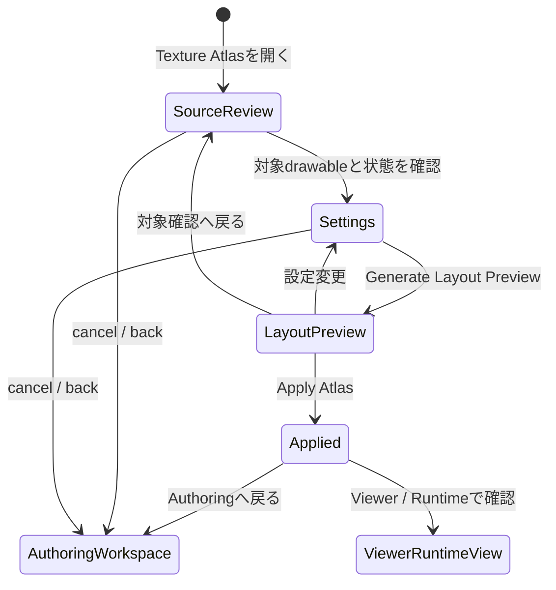

# Texture Atlas Task 画面仕様

> 状態: Draft screen spec。

## 1. 役割

Texture Atlas Taskは、drawable / mesh のtexture sourceをruntime用texture pageへ配置する専用Task画面である。

この画面は、選択中drawableを細かく編集するActive Toolではない。現在のproject stateをもとに、atlas対象drawable、page設定、padding、配置preview、未配置warningを確認し、Applyによってatlas配置をcommitする。

最低限求めること:

- visible drawableをtexture atlasへ配置する。
- drawable間に一定のpadding / marginを置く。
- 過度に賢い最適化ではなく、決定的なsimple packingで自動敷き詰めを行う。
- Generate Layout Previewまではproject stateを変更せず、Apply Atlasで確定する。

ここでいう自動敷き詰めは、semantic recognitionや提案UIではない。Editorが持つべき単純な決定的処理として、明示されたinclude scope、drawable bounds、texture source、page size、paddingに基づいて配置案を作る。

## 2. 開き方

Texture Atlas Taskはmodalではなく、Authoring Workspaceから開く専用Task画面として扱う。

基本遷移:

```text
Authoring Workspace
  -> Toolbox / Task group / Texture Atlas
  -> Texture Atlas Task
  -> Generate Layout Preview
  -> Apply Atlas
  -> Authoring Workspace
```

Apply後は、Viewer / Runtime Viewへ進む導線を置いてよい。

```text
Texture Atlas Task
  -> Viewer / Runtime View: Apply後にruntime表示を確認する
  -> Authoring Workspace: 戻って編集を続ける
```

## 3. Task-Local Flow



状態:

| State | 内容 |
|---|---|
| Source Review | atlas対象drawable、visible / excluded、mesh / texture状態、未配置状態を確認する。 |
| Settings | page size、padding、max pages、include mode、packing strategyを設定する。 |
| Layout Preview | uncommittedな配置案をAtlas Previewへ表示する。 |
| Applied | previewされた配置をproject stateへcommitした状態。 |

## 4. 画面配置

```text
+--------------------------------------------------------------------------------+
| Texture Atlas Header                                                           |
| source summary / atlas status / generate preview / apply / back                |
+------------------------+--------------------------------+----------------------+
| Drawable Source List   | Atlas Preview                  | Atlas Settings       |
|                        |                                |                      |
| visible drawables      | page tabs                      | page size            |
| placed / unplaced      | packed rectangles              | padding / margin     |
| excluded variants      | selected drawable highlight    | max pages            |
| warnings               | checker background             | include mode         |
| stale source summary   | zoom / pan                     | pack strategy        |
+------------------------+--------------------------------+----------------------+
| Atlas Check Strip: unplaced / overflow / stale layout / open diagnostics        |
+--------------------------------------------------------------------------------+
```

主領域:

| 領域 | 役割 |
|---|---|
| Texture Atlas Header | 対象summary、layout状態、Generate Layout Preview、Apply Atlas、戻る導線を表示する。 |
| Drawable Source List | atlas対象、除外、未配置、warningをdrawable単位で確認する。 |
| Atlas Preview | texture pageごとの配置案を視覚的に確認する。 |
| Atlas Settings | page size、padding、max pages、include mode、pack strategyを設定する。 |
| Atlas Check Strip | unplaced / overflow / stale layoutなどの重要summaryだけを表示する。 |

## 5. Include Scope

初期仕様の最低要件は `Visible drawables only` である。

| Include mode | 扱い |
|---|---|
| Visible drawables only | 初期仕様の必須scope。通常表示状態のdrawableだけをatlasへ配置する。 |
| Hidden variants | 将来候補。表情差分や衣装差分など、通常非表示だがruntime切り替え対象になるdrawableを含める。 |
| All exportable drawables | 将来候補。runtime packageに含める全drawableを対象にする。 |
| Selected subset | 将来候補。特定part / drawableだけを再配置する。 |

Hidden variantsは初期必須ではない。ただし、同一PSD内に表情差分や衣装差分が含まれる可能性が高いため、Source Listでは「今回は除外されるdrawable」として見える方がよい。将来のinclude拡張を忘れないためである。

## 6. Atlas Settings

表示する設定:

- page size
- padding
- page margin
- max pages
- include mode
- pack strategy
- regenerate preview
- apply atlas

初期のpack strategyは、simple deterministic packでよい。たとえば入力順またはstable sort順で、行単位に敷き詰める程度でもよい。重要なのは、同じproject stateと同じsettingsなら同じlayout previewになることである。

初期仕様で必須にしない候補:

- 回転配置
- 複数戦略の高度な最適化比較
- 手動ドラッグ再配置
- hidden variants / all exportable drawables の完全対応
- texture圧縮や最終export形式の詳細設定

## 7. Atlas Preview

Atlas Previewに表示するもの:

- texture page tabs
- page bounds
- packed drawable rectangle
- drawable thumbnailまたはsource boundsの簡易表示
- selected drawable highlight
- placed / unplaced status
- overflow warning
- stale layout warning
- zoom / pan

Atlas Previewに表示しないもの:

- raw texture byte情報
- generated refs全文
- operation ID
- evidence path
- packing algorithm internal trace

## 8. Commit / Stale State

Generate Layout Previewはuncommittedである。Apply Atlasを押すまでproject stateのatlas配置は変更しない。

Apply Atlasでcommitするもの:

- texture page定義
- drawableごとのatlas placement
- placement bounds / UV mappingに必要なsummary
- atlas layout settings summary

staleになる条件:

- drawableのvisible stateが変わった。
- drawable source texture / boundsが変わった。
- meshやUVにatlas配置へ影響する変更が入った。
- atlas settingsが変更された。

stale状態では、Viewer / Runtime ViewやProduct Preflightへ進む前にregenerate previewまたはapplyが必要であることを表示する。

## 9. 他UIとの関係

| UI | Texture Atlas Taskとの関係 |
|---|---|
| Authoring Workspace | Texture Atlas Taskの入口。Parts Tree / Canvasで編集したdrawable群がatlas対象になる。 |
| Mesh Tool | mesh作成後、texture source / bounds / UVの状態がatlas配置の入力になる。 |
| Parameter / Keyform | 直接の編集対象ではない。ただしruntime確認前のauthoring flow上はTexture Atlasより前に完了していることが多い。 |
| Viewer / Runtime View | Apply済みatlasを使ってruntime表示を確認する。 |
| Product Preflight | atlas未配置、overflow、stale layoutをblocking / warningとして扱う。 |
| Diagnostics / Evidence View | raw evidence、operation log、artifact path、packing detailを必要時に確認する。 |

## 10. 通常表示しないもの

- operation ID
- generated refs全文
- evidence path
- package file set
- raw texture byte情報
- packing algorithm internal trace
- validation report全文

これらは通常UIの視認性を悪化させるため、Diagnostics / Evidence ViewまたはCodex-facing structured surfaceへ分離する。

## 11. 関連機能ID

現行の `UX-FEAT-001`〜`UX-FEAT-037` の棚卸では、Texture Atlas専用の機能IDはまだ明示採番されていない。

関連する既存機能:

- `UX-FEAT-004`: preview / texture rendering
- `UX-FEAT-008`: Part / layer tree overview and part management
- `UX-FEAT-009`: drawable texture assignment / layer tree direct manipulation
- `UX-FEAT-019`: PSD structural scaffoldでのtexture scaffold
- 一部 `UX-FEAT-028` / `UX-FEAT-029`: Product Preflight / validation
- 一部 `UX-FEAT-034`: package / runtime evidence summary

後続の棚卸またはwave計画では、Texture Atlas Task専用のUX feature IDを追加するか検討する。

## 12. 未決事項

- `visible` の基準を、runtime-visible state、editor-visible state、part visibility継承のどれで定義するか。
- 初期実装でhidden variantsを完全に除外してよいか、warningとして扱うべきか。
- page sizeの初期値と選択肢。
- padding / page marginの初期値。
- initial pack strategyの具体アルゴリズム。
- Apply後にViewer / Runtime Viewへ自動で進める導線を置くか。
