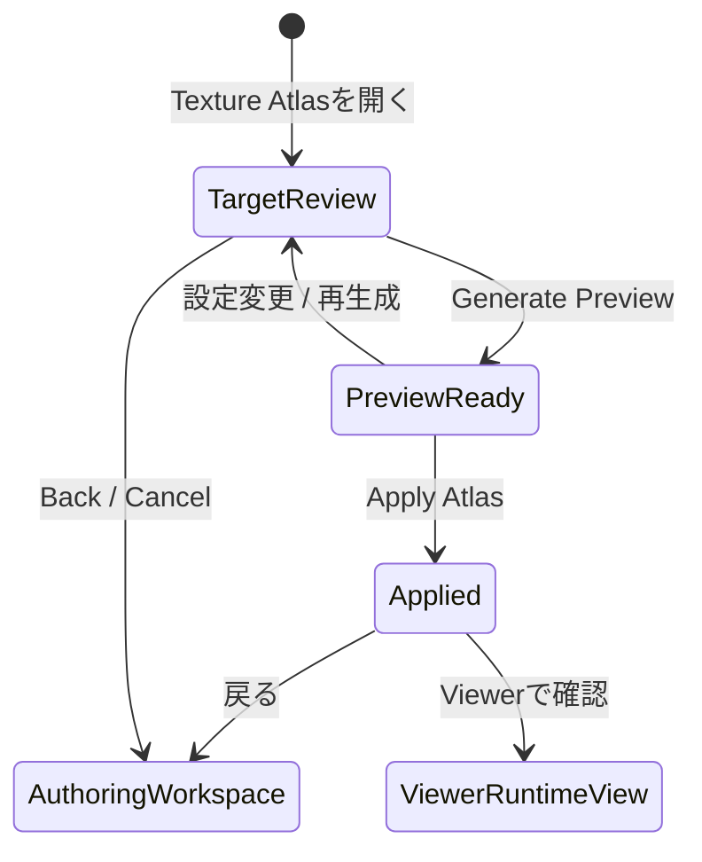

# Texture Atlas Task v0 画面仕様

> 状態: Accepted v0 direction / Draft screen spec。

## 1. 役割

Texture Atlas Taskは、現在の編集済みモデルをruntimeで描画しやすいtexture asset構造へ変換するための専用Task画面である。

このTaskの主目的は「今見えている絵を詰める」ことではなく、「runtimeで使われるDrawable textureをatlas artifactへまとめ、Viewer / 将来runtimeで同じ見た目を保てる状態にする」ことである。

Wave88以降、`Apply Atlas` はauthoring modelをatlas向けに破壊的に差し替える操作ではない。`Apply Atlas` はruntime atlas artifactをproject stateへcommitし、Authoring Workspace Canvasが使うoriginal texture / original UVを保持する。

満たすべきUX:

- ユーザーが、どのDrawableがruntime assetとしてatlas対象になるかを理解できる。
- Drawable Poolに残っている未所属Drawableが、runtime未使用として除外されることを理解できる。
- atlas previewを大きく見ながら、padding、page size、配置状態、warningを確認できる。
- Apply後、Canvasはoriginal texture / original UVのまま表示される。
- Apply後、Viewerでは `Original` と `Atlas Runtime` を切り替えて完成品表示を確認できる。

この画面はInspector内には置かない。Atlas previewは面積を必要とし、Inspectorに押し込むと対象一覧、警告、設定、previewが互いに圧迫し合うためである。

## 2. 開き方

Texture Atlas Taskは、Authoring Workspaceから開く専用Task画面として扱う。

基本遷移:

```text
Authoring Workspace
  -> Toolbox / Task group / Texture Atlas
  -> Texture Atlas Task
  -> Generate Preview
  -> Apply Atlas
  -> Authoring Workspace or Viewer / Runtime View
```

Apply後はViewer / Runtime Viewへ進む導線を置いてよい。ただし、Viewerでの確認は別責務であり、Texture Atlas Task自体はatlas生成と適用を担当する。

## 3. 対象選定の意味

v0の対象は「runtime graphで使われるtexture-backed Drawable」である。

### 含めるもの

| 対象 | 扱い |
|---|---|
| Deformer hierarchyに所属しているDrawable | atlas対象にする。 |
| Runtime描画順に参加しているDrawable | atlas対象にする。 |
| Drawable visibility off のDrawable | atlas対象に含める。現在見えていなくてもruntimeで表示され得るため。 |
| Parts Container visibility off 配下のDrawable | atlas対象に含める。現在見えていなくてもruntimeで表示され得るため。 |
| keyform / dynamics / parameterで将来表示される可能性があるDrawable | 所属済みDrawableであれば対象に含める。 |

### 除外するもの

| 対象 | 除外理由 |
|---|---|
| Drawable Pool上の未所属Drawable | runtime graphで使われていないため。v0では「未使用素材」として明示的に除外する。 |
| Parts Container | textureを持たない構造ノードであるため。 |
| Deformer | textureを持たない変形ノードであるため。 |
| mesh preview / draft mesh | editor-only previewであり、runtime assetではないため。 |
| selection overlay / mesh wire / handles / control points | editor-only overlayであり、完成品に含まれないため。 |
| PSD import helper / import plan / source metadata | editor-only情報であり、atlas textureではないため。 |
| どのruntime Drawableからも参照されないsource texture | runtime描画に使われていないため。 |

### 警告として扱うもの

| 対象 | 扱い |
|---|---|
| texture byteがないDrawable | atlasへ配置できないためwarningにする。 |
| texture boundsが空または不正なDrawable | atlasへ配置できないためwarningにする。 |
| meshが存在するがtexture参照が壊れているDrawable | atlasへ配置できないためwarningにする。 |
| 選択したpage sizeへ収まらないDrawable | preview generation failureまたはoverflow warningにする。 |

重要な判断:

- 表示/非表示は「今見えているか」の状態であり、「runtimeで使うか」の判断には使わない。
- v0でruntime未使用の判断として最も意味が強いのは、Drawable Pool上の未所属Drawableである。

## 4. Task-Local Flow



| State | 内容 |
|---|---|
| Target Review | atlas対象、除外、warning、settingsを確認する。 |
| Preview Ready | uncommittedなatlas配置案をpreviewする。 |
| Applied | previewされたatlas配置をproject stateへcommitした状態。 |

Generate Previewまではproject stateを変更しない。Apply Atlasで初めてruntime atlas artifactをproject stateへcommitする。authoring `Drawable.textureId`、`Mesh.uvs`、`Mesh.topologyRevision` は変更しない。

## 5. 画面配置

Texture Atlas Taskは専用画面として、中央に大きなAtlas Preview、右側に対象summary / blocking issues / settings / listsを置く。

```text
+----------------------------------------------------------------------------------+
| <- Back   Texture Atlas                                      Generate   Apply     |
+-------------------------------------------------------------+--------------------+
| Atlas Preview                         PREVIEW FAILED: ...   | Target Summary     |
|                                                             | - Included count   |
| [atlas page with packed rects]                              | - Excluded count   |
|                                                             | - Blocking count   |
| hover/select rect -> Drawable name                          |                    |
|                                                             | Blocking Issues    |
| [preview failure card when failed]                          | - Cannot fit ...   |
|                                                             |                    |
| zoom / pan                                                  | Settings           |
| page size / usage / padding guide                           | - Size             |
|                                                             | - Padding          |
|                                                             | - Edge extrusion   |
|                                                             |                    |
|                                                             | Lists              |
|                                                             | - Included         |
|                                                             | - Excluded         |
|                                                             | - Warnings         |
+-------------------------------------------------------------+--------------------+
```

主領域:

| 領域 | 役割 |
|---|---|
| Header | Back、画面名、Generate Preview、Apply Atlasを置く。 |
| Atlas Preview | atlas page、packed rect、hover/select feedback、usageを大きく表示する。 |
| Target Summary | Included / Excluded / Warningsの数と意味を表示する。 |
| Blocking Issues | Generate Preview失敗やApply不可の直接原因を、右ペイン上部で表示する。 |
| Settings | page size、padding、edge extrusionなどv0で必要な設定だけを置く。 |
| Target Lists | 対象Drawable、除外理由、警告理由を確認する。 |

## 6. 表示する情報

### Summary

- Included Drawable count
- Excluded Drawable count
- Warning count
- Blocking issue count
- Atlas page size
- Estimated usage
- Padding
- Edge extrusion on/off

### Blocking Issues

Blocking Issuesには、Generate Preview失敗またはApply不可の直接原因を表示する。

表示位置:

- 右ペインのTarget Summary直下。
- Settings、Included List、Excluded List、Warningsより上。

表示するもの:

- 失敗理由の短い見出し。
- 失敗対象Drawableの名前。
- 必要なら対象page sizeや現在設定の短い説明。
- 詳細確認に必要な最小限のsource ref。

例:

```text
Blocking Issues

Cannot fit in selected page size
Drawable draw_r0_... cannot fit in 4096 x 4096.
```

Blocking Issuesは、右ペイン下部のWarningsより優先される。Generate Previewを押した直後にユーザーが原因を見つけられることを重視する。

### Included List

Included Listにはatlas対象Drawableを表示する。

表示する情報:

- Drawable name
- 所属先のParts ContainerまたはDeformer path
- texture source summary
- 現在hiddenであれば `Currently hidden` 表示

### Excluded List

Excluded Listにはv0でatlas対象にしないものを表示する。

主な除外理由:

- `Unbound drawable in Drawable Pool`
- `Structure node without texture`
- `Editor-only preview`
- `Unreferenced source texture`

### Warnings

WarningsにはApply前にユーザーが確認すべき補助的な問題を表示する。

例:

- `Missing texture bytes`
- `Invalid texture bounds`
- `Cannot fit in selected page size`
- `Atlas preview is stale`

Generate Preview失敗やApply不可の直接原因は、Warnings下部だけに置かず、Blocking Issuesとして右ペイン上部にも表示する。

警告はDiagnostics一覧へ無理に集約しなくてよい。Texture Atlas Task内で発生し、Task内で解決する問題はこの画面に表示する。

## 7. v0 Settings

v0で扱う設定は小さく保つ。

| Setting | v0の扱い |
|---|---|
| Page size | `Auto` と固定候補を置く。例: 2048 / 4096。 |
| Padding | 4px / 8px程度の選択肢または数値入力。 |
| Edge extrusion | 初期ON。texture bleedingを避けるため。 |
| Generate Preview | 現在settingsでatlas layoutを再生成する。 |
| Apply Atlas | preview済みlayoutをruntime atlas artifactとしてproject stateへcommitする。 |

Packing algorithmの詳細は画面仕様ではなく、[../../texture-atlas/](../../texture-atlas/_map.md) に分離する。次の改善対象は、現行 `single-page-shelf-v1` の隙間の多さを解消する `single-page-skyline-v1` である。

v0では扱わない:

- 手動rect配置
- 複数packing algorithm比較
- 回転配置の細かな制御
- texture圧縮
- mipmap最適化
- multi-atlas最適化UI
- camera capture連携そのもの

## 8. Atlas Preview

Atlas Previewに表示するもの:

- atlas page bounds
- packed rectangle
- padding / extrusionの視覚的な余白
- hover/select中Drawableの名前
- atlas usage
- overflow / cannot fit warning
- Preview失敗時の失敗原因要約カード
- zoom / pan

表示しないもの:

- raw texture byte
- generated refs全文
- operation ID
- packing algorithm internal trace
- editor overlay
- mesh wire / deformer handles

Previewは、完成品のtexture asset確認に必要な情報へ絞る。MeshやDeformerの編集情報はここでは扱わない。

### Preview Failure Display

Generate Previewが失敗した場合、Atlas Preview中央に失敗原因の要約カードを表示する。

表示するもの:

- 失敗理由の短いtitle。例: `Cannot fit in selected page size`。
- 対象Drawable名または件数。
- 次に見るべき場所。例: `See Blocking Issues`。

表示しないもの:

- raw payload全文。
- operation ID。
- stack trace。
- 長いsource refの全文。

既存のTitle rowにある `PREVIEW FAILED` 表示は維持する。ただし、高さを増やす新しいheader rowは作らない。必要なら同じtitle row内に短い失敗要約を追加する。

重要:

- Generate Preview失敗時に画面全体の縦位置がずれないこと。
- Header / title rowの高さを失敗時だけ増やさないこと。
- 長い詳細はPreview中央カードと右ペイン上部のBlocking Issuesへ逃がすこと。

## 9. Apply Behavior

Apply Atlasで行うこと:

- generated atlas texture entryをproject stateへcommitする。
- generated atlas raw RGBA binary asset bytes / refをsession binary assetsへcommitする。
- atlas layout settings、page、placementsを含むlayout summaryをproject stateに保持する。
- source signature / freshness markerをlayout summaryへ保持する。
- 既存atlas artifactがある場合は、original authoring sourceから再生成したartifactで決定論的に置き換える。

Apply Atlasで行わないこと:

- authoring `Drawable.textureId` をatlas texture idへ差し替えない。
- authoring `Mesh.uvs` をatlas配置UVへ差し替えない。
- source texture assetを削除しない。
- mesh topologyを変更する。
- deformer hierarchyを変更する。
- keyform / dynamics / parameter設定を変更する。
- runtime表示状態を変更する。
- Drawable Pool上の未所属Drawableを削除する。
- Workspace Directory Exportを実装しない。

成功条件:

- Authoring Workspace CanvasはApply前後でoriginal texture / original UVの見た目を保持する。
- Viewer `Original` はApply前と同じoriginal texture / original UVで表示する。
- Viewer `Atlas Runtime` はcommitted atlas artifactを使い、authoring stateを変更せずに同等の完成品表示を行う。
- texture bleedingが明らかに悪化しない。
- hiddenだがruntime graphに所属しているDrawableが、後から表示されてもtexture missingにならない。
- Drawable Pool上の未所属Drawableは、atlas対象外として認識できる。

## 10. Stale State

Generate Preview後、以下が変わった場合はpreviewをstaleにする。

- atlas対象Drawableの追加/削除
- Drawableのtexture source / bounds変更
- Drawable Pool所属状態の変更
- page size / padding / edge extrusion変更
- atlas layoutに影響するmesh / UV入力変更

stale状態ではApplyをdisableするか、Apply前に再生成を要求する。

Apply済みartifactについても、layout summaryに保持したsource signatureと現在のsource inputsが一致しない場合はstaleとして扱う。Viewer `Atlas Runtime` は、atlas artifactがmissingまたはstaleの場合にdisabledになり、選択中なら `Original` へfallbackする。

## 11. Runtime / Camera Captureへの接続

将来のcamera capture runtimeでは、parameterやdynamicsによってDrawableの表示状態や変形が変わる。Texture Atlasが「現在見えているDrawable」だけを対象にすると、runtime中に表示されたDrawableのtextureが欠落する可能性がある。

そのため、v0から対象基準は「現在visible」ではなく「runtime graphに所属しているDrawable」とする。

また、Atlas化はruntime描画のtexture bindやasset管理を安定させるための前段である。camera capture自体、tracking input、motion playback、export app連携、Workspace Directory ExportはTexture Atlas Task v0 / Wave88の責務ではない。

## 12. 他UIとの関係

| UI | 関係 |
|---|---|
| Authoring Workspace | Texture Atlas Taskの入口。Parts / Mesh / Deformer編集の結果がatlas対象選定に影響する。 |
| Drawable Pool | 未所属Drawableはv0のatlas対象外として表示される。 |
| Mesh Tool | mesh / UVの入力元。ただしTexture Atlas Taskはmesh編集をしない。 |
| Viewer / Runtime View | `Original` / `Atlas Runtime` を切り替え、Apply済みatlas artifactが完成品表示で破綻しないか確認する場所。 |
| Validation / Diagnostics | project-wideな構造警告を扱う。atlas固有のpreview warningはTask内表示を主にする。 |

## 13. 未決事項

- v0のdefault page sizeを `Auto` のみで始めるか、固定候補を併置するか。
- 旧layout summaryにsource signatureがない場合、移行を用意するか、stale扱いで再生成を要求するか。
- single atlasで収まらない場合、v0ではwarningとして止める。multi-pageは将来scopeで再設計する。
- Texture Atlas TaskからViewer / Runtime Viewへ進む導線を、Apply後のprimary actionにするかsecondary actionにするか。
- Workspace Directory Export / AI-native structured workspace saveをいつ、どのartifact単位で設計するか。
- `single-page-skyline-v1` 導入後、usage表示をcontent面積基準のままにするか、packing効率を示す補助metricを追加するか。
