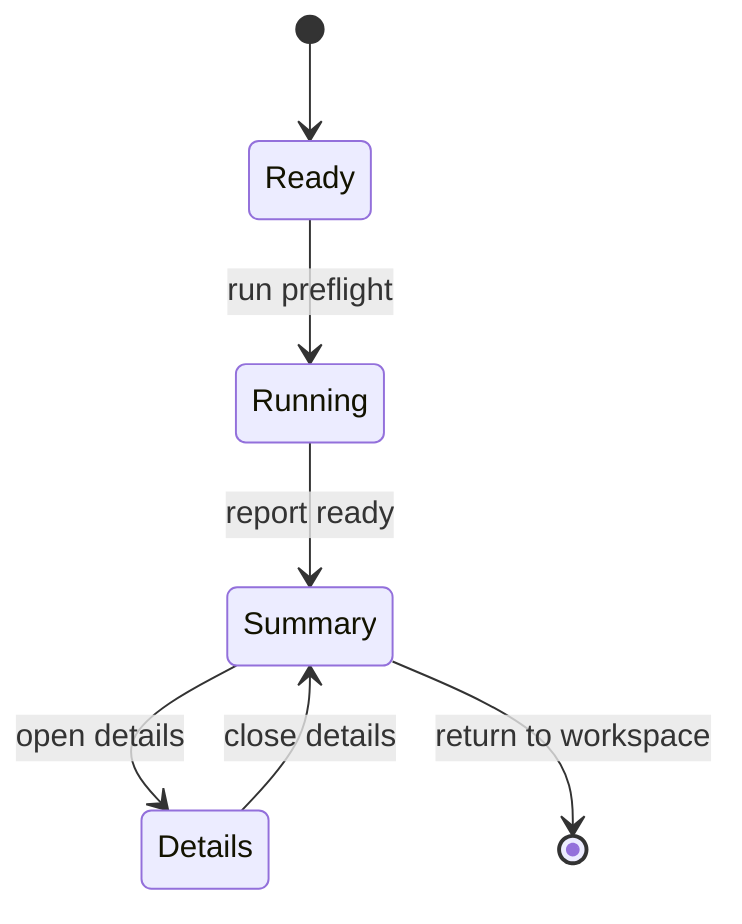

# Validation Task 画面仕様

> 状態: Draft screen spec。

## 1. 役割

Validation Taskは、Product Preflightの実行、summary確認、detail drilldown入口を扱うtask画面である。

## 2. Task-Local Flow

## 3. 表示するもの

- overall status
- blocking / warning / not supported / not evaluated の要約
- 修正が必要な対象
- 人間が次に取るべき操作
- full diagnosticsへの入口

## 4. 通常表示しないもの

- check ID詳細
- diagnostic ID一覧
- raw report payload
- evidence refs全文

## 5. 関連機能ID

- `UX-FEAT-028`
- `UX-FEAT-029`

## 6. 未決事項

- Product PreflightはValidation Taskとして扱うか、Diagnostics / Evidence Viewの一部として扱うか。
- current/comparison/rerun stateをEditor command hostからDOM非依存に読めるようにする必要があるか。
