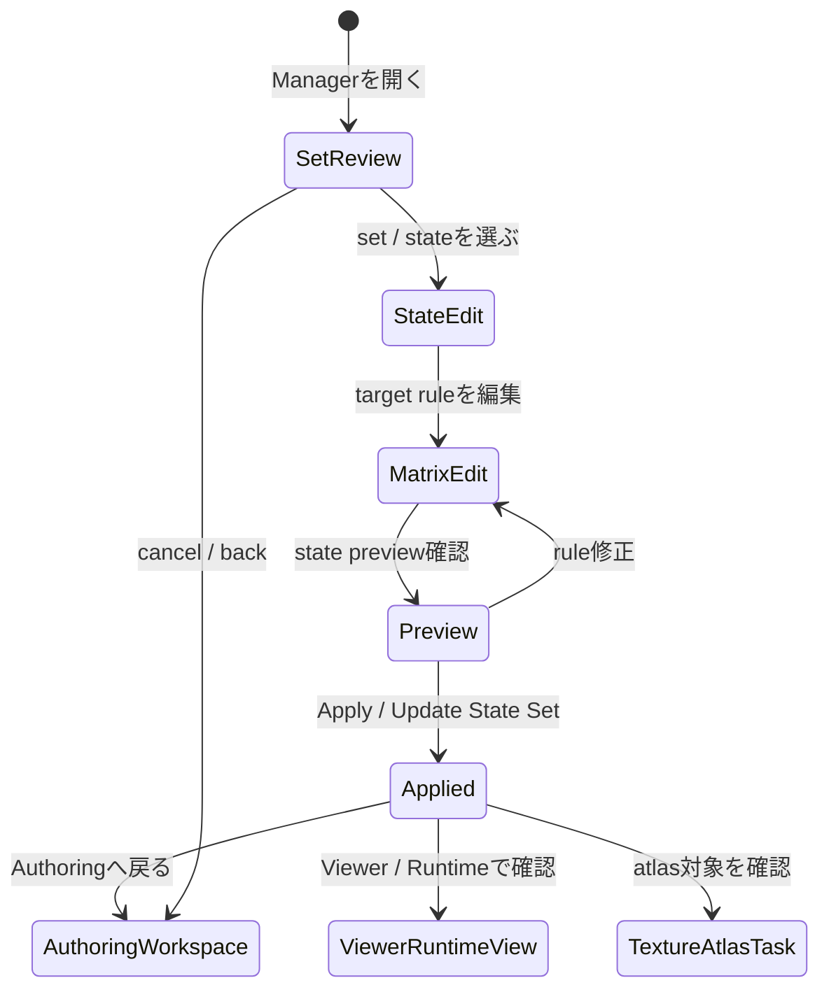

# Variant / Expression Manager 画面仕様

> 状態: Draft screen spec。

## 1. 役割

Variant / Expression Managerは、表情差分、パーツ差分、衣装差分など、複数drawable / part subtreeの表示状態をstateとして管理する専用管理画面である。

この画面は、単一drawableのvisibilityを編集するDrawable Inspectorではない。また、deformer配下をparameter値でfadeさせるRig Toolでもない。複数のhidden drawable、part subtree、runtime visibility、preview状態をまとめて扱い、ユーザーが「どの状態で何が見えるか」を一覧できるようにする。

初期方針:

- 初期は `exclusive set` を基本にする。
- 1つのset内では、同時にactiveになるstateは1つだけとする。
- `additive` / simultaneous applicationは将来候補として扱う。
- 表情差分とパーツ差分を主対象にする。
- 衣装差分も同じ機構で管理できるが、運用上は別モデルexportにつながる可能性が高い。

## 2. 開き方

Variant / Expression Managerはmodalではなく、Authoring Workspaceから開く専用Manager / Task画面として扱う。

基本遷移:

```text
Authoring Workspace
  -> Toolbox / Task group / Variant / Expression
  -> Variant / Expression Manager
  -> State Matrixで状態を編集
  -> Preview Canvasで確認
  -> Apply / Update State Set
  -> Authoring Workspace
```

Apply後は、Viewer / Runtime Viewでruntime相当の切り替え確認を行ってよい。

```text
Variant / Expression Manager
  -> Viewer / Runtime View: state切り替えをruntime相当で確認する
  -> Texture Atlas Task: hidden targetのatlas配置を確認する
  -> Authoring Workspace: 戻って編集を続ける
```

## 3. Task-Local Flow



状態:

| State | 内容 |
|---|---|
| Set Review | expression set、part variant set、export profile候補を確認する。 |
| State Edit | state名、default state、exclusive policy、説明を編集する。 |
| Matrix Edit | target part / drawable / subtreeごとのstate ruleを編集する。 |
| Preview | 選択中stateの結果をCanvasで確認する。 |
| Applied | state set変更をproject stateへ反映した状態。 |

## 4. 画面配置

```text
+--------------------------------------------------------------------------------+
| Variant / Expression Header                                                     |
| set selector / create set / create state / apply / open viewer / back           |
+----------------------+------------------------------+--------------------------+
| Set List             | Preview Canvas               | State Inspector          |
|                      |                              |                          |
| Expressions          | current state preview         | set type                 |
| Part Variants        | hidden / visible result       | policy: exclusive        |
| Costume Variants     | selected target highlight     | default state            |
| Export Profiles      | state switch preview          | state name / notes       |
+----------------------+------------------------------+--------------------------+
| State Matrix                                                                    |
| target part/drawable/subtree | default | smile | eyes_closed | costume_A         |
| headwear                    | visible | hide  | unchanged    | visible           |
| mouth_smile                 | hidden  | show  | hidden       | unchanged         |
| eye_closed                  | hidden  | hide  | show         | unchanged         |
+--------------------------------------------------------------------------------+
| Check Strip: no default / overlapping states / hidden target missing atlas       |
+--------------------------------------------------------------------------------+
```

主領域:

| 領域 | 役割 |
|---|---|
| Variant / Expression Header | set選択、state作成、Apply、Viewer、戻る導線を表示する。 |
| Set List | Expressions、Part Variants、Costume Variants、Export Profiles候補を一覧する。 |
| Preview Canvas | 選択中stateの表示結果を確認する。 |
| State Inspector | set type、exclusive policy、default state、state名、notesを編集する。 |
| State Matrix | targetごとにstate ruleを一覧・編集する中心UI。 |
| Check Strip | no default、missing target、atlas未配置、overlapなどのsummaryを出す。 |

## 5. Set / State Model

初期モデル:

```text
Variant / Expression Set
  type: expression | partVariant | costumeVariant | exportProfileCandidate
  policy: exclusive
  default state
  states
    - default
    - smile
    - eyes_closed
  targets
    - part subtree
    - drawable
    - hidden drawable
  rule
    - visible
    - hidden
    - opacity
    - unchanged
```

初期は `exclusive` を基本にする。同一set内で複数stateを同時適用しない。

将来候補:

- additive set
- simultaneous expression application
- state blend
- priority / conflict resolution
- multiple active sets

これらは初期仕様の必須範囲に含めない。

## 6. State Matrix

State Matrixは、この画面の中心UIである。

目的:

- どのstateでどのtargetが見えるかを一覧できる。
- hidden drawableがどの表情 / 差分で使われるかを見落とさない。
- default state、差分state、未設定targetを同時に確認できる。

行:

- part subtree
- drawable
- hidden drawable
- variant group候補

列:

- default
- expression state
- part variant state
- costume variant state

cell rule:

- `visible`
- `hidden`
- `opacity`
- `unchanged`
- `invalid / missing`

初期UIでは、すべてのstate compositionを高度に解く必要はない。まずはexclusive set内のstateごとに、targetの表示状態を明示できればよい。

## 7. 表情差分

表情差分は、Variant / Expression Managerの主対象である。

例:

```text
Expression Set: mouth
Policy: exclusive
States:
  default
  smile
  open

Targets:
  mouth_default
  mouth_smile
  mouth_open
```

期待される操作:

- PSD由来のhidden drawableをstate targetへ追加する。
- default stateを決める。
- smile stateで `mouth_default = hidden`、`mouth_smile = visible` のように設定する。
- Preview Canvasでstate切り替え結果を確認する。
- Viewer / Runtime Viewでruntime相当の切り替え確認を行う。

## 8. 衣装差分 / パーツ差分

衣装差分や大きなパーツ差分も、管理機構としてはVariant / Expression Setで扱える。

ただし運用上、衣装差分は別モデルとして出力する可能性が高い。そのため、この画面では次を分けて扱う。

- authoring中の差分管理
- runtime切り替え対象
- export profile候補
- 別モデルexport候補

初期UIでは、衣装差分を完全なexport workflowとして実装する必要はない。まずはstate setとして管理し、将来のProject Storage / Exportへ接続できるようにする。

## 9. 他UIとの関係

| UI | Variant / Expression Managerとの関係 |
|---|---|
| Drawable Inspector | 単一drawableのeditor/runtime visibility、opacity、maskを扱う。state setによる複数target管理はManagerで扱う。 |
| Parts Tree | state targetとなるpart / drawable / hidden drawableを選択・確認する入口になる。 |
| Rig Tool | deformer配下のparameter-driven subtree opacity effectを扱う。state setの一括表示管理とは分ける。 |
| Parameter / Keyform | parameter-driven切り替えやfadeが必要な場合に協調する可能性があるが、初期Managerはexclusive state管理を基本にする。 |
| Texture Atlas Task | hidden variant targetがatlas未配置の場合、warningとして連携する。 |
| Viewer / Runtime View | state切り替えをruntime相当で確認する。 |
| Project Storage / Export | 衣装差分を別モデルとして出力する場合の後続導線になる。 |
| Product Preflight | no default、missing target、hidden target missing atlas、conflicting rulesをwarning / blockingとして扱う。 |

## 10. 通常表示しないもの

- source refs全文
- generated refs全文
- operation ID
- evidence path
- raw runtime evidence
- validator payload全文
- state application trace全文

これらは通常UIの視認性を悪化させるため、Diagnostics / Evidence ViewまたはCodex-facing structured surfaceへ分離する。

## 11. 関連機能ID

現行の `UX-FEAT-001`〜`UX-FEAT-037` の棚卸では、Variant / Expression Manager専用の機能IDはまだ明示採番されていない。

関連する既存機能:

- `UX-FEAT-004`: Preview
- `UX-FEAT-008`: Part / layer tree overview and part management
- `UX-FEAT-009`: Layer tree direct manipulation
- 一部 `UX-FEAT-007`: Viewer / Runtime surface
- 一部 `UX-FEAT-028` / `UX-FEAT-029`: Product Preflight / validation
- 一部 `UX-FEAT-034`: package / runtime evidence summary

後続の棚卸またはwave計画では、Variant / Expression Manager専用のUX feature IDを追加するか検討する。

## 12. 未決事項

- expression / partVariant / costumeVariant / exportProfileCandidate の最小type set。
- target ruleで `opacity` を初期実装に含めるか、visible / hidden / unchanged だけにするか。
- additive / simultaneous applicationをいつ扱うか。初期は将来候補として保持する。
- 衣装差分を別モデルexportへ接続する具体導線。
- hidden targetがTexture Atlasに含まれない場合のwarning / blocking分類。
