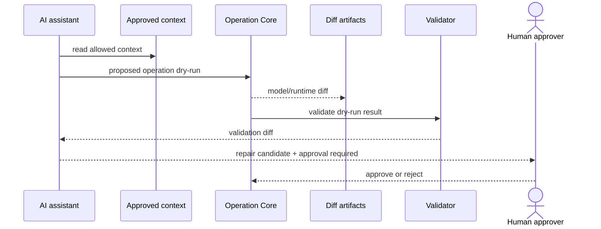
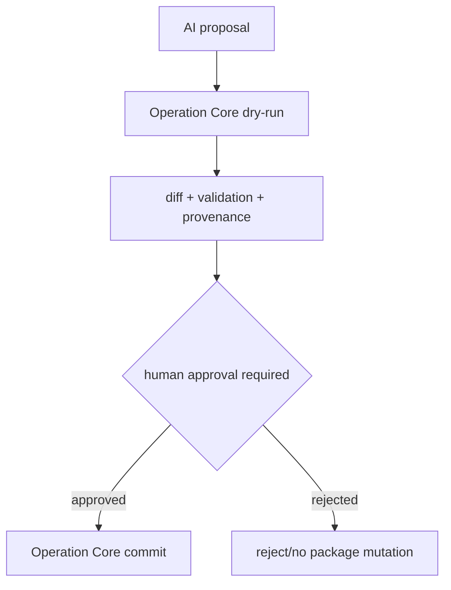
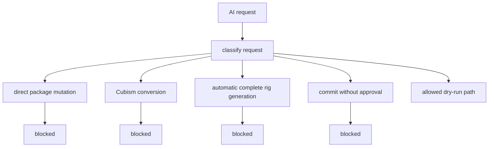

# AI Assistant Implementation Policy

## Status

Accepted

## Purpose

This policy defines what the AI assistant may read, propose, dry-run, and request for human approval in the Private 2D Rigging Lab / Prototype.

It prevents direct package mutation, approval bypass, unsupported auto-rigging, Cubism conversion or compatibility suggestions, untracked repair provenance, and confusion between dry-run output and committed model changes. The policy is required before AI assistant implementation begins because AI can otherwise become an unreviewable mutation path.

## Scope

### Applies to

- AI assistant commands and UI surfaces.
- AI context access.
- AI dry-run operation requests.
- AI repair suggestions.
- AI approval workflows.
- AI evidence and provenance artifacts.

### Actors

- AI assistant implementer.
- Operation Core implementer.
- Validator implementer.
- GUI implementer.
- Test author.
- Clean Context Reviewer.
- Human approver.

### Does not apply to

- General chat outside project command surfaces.
- Legal final judgment.
- Auto-rigging, image-to-rig generation, Cubism model conversion, Cubism compatibility implementation, or Cubism format import/export.

## Source Documents

### Primary

- `discussion/development_convention/basis/00_overview.md`
- `discussion/development_convention/basis/01_common_policy_template.md`
- `discussion/development_convention/basis/03_p1_policy_specs.md`
- `discussion/development_convention/basis/04_required_diagrams_and_tables.md`
- `discussion/_conventions.md`

### Supporting

- `discussion/acceptance-criteria/`
- `discussion/scenarios/`
- `discussion/design/module-contracts/`
- `discussion/tests/`
- `discussion/demo/streaming-demo-policy.md`
- `discussion/proposal/live2d-feature-proposal-template.md`

### Not implementation oracle

- `discussion/reports/**`
- Cubism SDK/Core behavior.
- Cubism Viewer output.
- Cubism Editor UI behavior.
- Cubism file formats.
- Cubism Physics compatibility.
- Existing Cubism models, third-party Live2D models, and official sample models.

## Required Decisions

### DEC-AI-001: AI command boundary

#### Question
Which commands may the AI assistant execute?

#### Decision
AI assistant MAY inspect, explain, validate, dry-run operation, propose repair, compare diff, summarize provenance, and request human approval. It MUST NOT directly mutate packages, commit without approval, generate a complete rig automatically, perform image-to-rig generation, convert Cubism models, implement Cubism-like auto rigging, or make final rights/legal judgments.

#### Rationale
AI must help review and propose changes while leaving mutation control and accountability to Operation Core and human approval.

#### Alternatives considered
Allowing AI to commit simple repairs automatically was rejected because it weakens the human approval boundary.

#### Impact
AI command APIs must distinguish read, dry-run, approval request, and commit delegation.

### DEC-AI-002: AI dry-run requirement

#### Question
What must happen before AI-proposed changes can be committed?

#### Decision
Every AI-proposed package mutation MUST be represented as a dry-run operation through Operation Core and MUST produce model diff, runtime diff when applicable, validation diff, affected target IDs, repair candidate provenance, and an approval required flag.

#### Rationale
Dry-run evidence lets humans and reviewers evaluate effects before any package mutation.

#### Alternatives considered
Natural-language repair suggestions without structured dry-run were rejected for mutation-capable actions.

#### Impact
AI repair UI and tests must include dry-run artifacts.

### DEC-AI-003: Human approval boundary

#### Question
Which actions require human approval?

#### Decision
Human approval is REQUIRED for package mutation, fixture update, golden update, validator repair commit, demo-safe publication action, dependency addition suggestion that changes project files, and any action that changes acceptance evidence.

#### Rationale
The assistant is advisory until a human approves a concrete operation and evidence bundle.

#### Alternatives considered
Approval only for large diffs was rejected because small changes can affect acceptance or rights.

#### Impact
Commit-capable AI flows must store approval evidence.

### DEC-AI-004: AI context access

#### Question
What context may the AI read or write?

#### Decision
AI MAY read accepted design, module contracts, current project-defined model package data, validation reports, runtime snapshots, operation logs, GUIEvidence, and rights/provenance summaries. AI MUST NOT treat research reports as implementation oracles, read hidden user data, process third-party models without provenance, inspect Cubism model internals, or write package data directly.

#### Rationale
Context access must be sufficient for useful suggestions but bounded by privacy, rights, and non-oracle requirements.

#### Alternatives considered
Allowing unrestricted workspace context was rejected.

#### Impact
AI context builders must filter sources and record provenance.

### DEC-AI-005: AI repair candidate provenance

#### Question
What provenance must repair candidates include?

#### Decision
AI repair candidates MUST include source diagnostic, target object, proposed operation, expected diff, confidence or risk, human approval requirement, and source documents used.

#### Rationale
Reviewers need to trace why a repair was proposed and what it affects.

#### Alternatives considered
Unstructured natural-language repair notes were rejected for operations that may be committed.

#### Impact
Repair candidate schema and tests must require these fields.

### DEC-AI-006: AI refusal / escalation cases

#### Question
When must the AI refuse or escalate instead of acting?

#### Decision
AI MUST refuse or escalate on ambiguous target, candidate diagnostic only, missing rights/provenance, request to import or convert Cubism format, request to bypass Operation Core, request to commit without approval, request for legal final judgment, or request to use proprietary/unlicensed binary dependencies.

#### Rationale
These cases are unsafe or outside project scope.

#### Alternatives considered
Proceeding with warnings was rejected for blocking boundary violations.

#### Impact
AI command responses must include refusal/escalation reason and blocking flag.

## Required Diagrams

### Diagram 1: AI Dry-run Flow

#### Mermaid type

sequenceDiagram

#### Purpose
Shows that AI proposals become dry-run operations before human approval.

#### Must include
- AI assistant.
- context.
- proposed operation.
- Operation Core dry-run.
- diff.
- validation.
- human approval.

#### Must not imply
- AI can commit without approval.



### Diagram 2: AI Approval Boundary

#### Mermaid type

flowchart TD

#### Purpose
Shows the boundary between proposal, dry-run, approval, commit, and reject.

#### Must include
- proposal.
- dry-run.
- approval required.
- commit.
- reject.

#### Must not imply
- Dry-run changes are committed changes.



### Diagram 3: AI Forbidden Flow

#### Mermaid type

flowchart TD

#### Purpose
Shows mandatory blocking of direct mutation, Cubism conversion, auto-rigging, and no-approval commits.

#### Must include
- direct package mutation blocked.
- Cubism conversion blocked.
- auto-rigging blocked.
- no approval blocked.

#### Must not imply
- A warning is enough for forbidden actions.



## Required Tables

### Table 1: AI Command Permission Table

This table defines command permissions.

| Command | Allowed? | Requires approval? | Evidence |
|---|---|---|---|
| inspect | yes | no | AI command response |
| explain | yes | no | AI command response |
| validate | yes | no | validation report |
| dryRunOperation | yes | no commit; approval required before commit | dry-run operation log, diffs |
| proposeRepair | yes | approval required before commit | repair candidate provenance |
| compareDiff | yes | no | model/runtime/validation diff |
| summarizeProvenance | yes | no | provenance summary |
| requestHumanApproval | yes | yes | approval request evidence |
| directPackageMutation | no | not applicable | refusal evidence |
| commitWithoutApproval | no | not applicable | refusal evidence |
| completeAutoRigGeneration | no | not applicable | refusal evidence |
| imageToRigGeneration | no | not applicable | refusal evidence |
| cubismModelConversion | no | not applicable | refusal evidence |
| rightsLegalFinalJudgment | no | not applicable | escalation evidence |

### Table 2: AI Context Access Table

This table defines allowed AI context.

| Context | Read allowed? | Write allowed? | Notes |
|---|---|---|---|
| accepted design | yes | no | source context only |
| module contract | yes | no | source context only |
| current package | yes | no direct write | mutation only through approved Operation Core commit |
| validation report | yes | no | may propose repair |
| runtime snapshot | yes | no | review context |
| operation log | yes | no | audit context |
| GUIEvidence | yes | no | GUI context |
| rights/provenance summary | yes | no | may escalate if missing |
| hidden user data | no | no | privacy boundary |
| third-party model without provenance | no | no | rights boundary |
| Cubism model internals | no | no | forbidden source |
| research reports as oracle | no | no | historical/risk context only if explicitly cited as non-oracle |

### Table 3: AI Repair Candidate Table

This table defines required repair candidate fields.

| Field | Required? | Meaning |
|---|---|---|
| repairCandidateId | yes | machine-readable candidate ID with no spaces |
| sourceDiagnostic | yes | formal diagnostic or explicitly marked candidate |
| targetObjectId | yes | affected package object ID |
| proposedOperation | yes | Operation Core request |
| expectedModelDiff | yes | expected package-level change |
| expectedRuntimeDiff | when applicable | expected preview/runtime change |
| expectedValidationDiff | yes | expected diagnostic change |
| confidence | yes | bounded confidence value or category |
| risk | yes | known risk and uncertainty |
| approvalRequired | yes | must be true for mutation |
| sourceDocuments | yes | accepted sources used |

### Table 4: AI Escalation Table

This table defines refusal and escalation handling.

| Case | Action | Blocking? |
|---|---|---|
| ambiguous target | ask for human clarification; no mutation | yes |
| candidate diagnostic only | escalate to test/design review before MVP-blocking use | yes for acceptance |
| rights/provenance missing | escalate to rights review; no demo/publication | yes |
| request to import Cubism format | refuse | yes |
| request to bypass Operation Core | refuse | yes |
| request to commit without approval | refuse | yes |
| request for legal final judgment | escalate to human/legal owner | yes for publication |
| request to use proprietary/unlicensed binary | refuse or dependency review | yes |

## Rules

### R-AI-001: AI must not mutate packages directly

AI assistant MUST NOT write package data, fixture data, golden data, or generated evidence directly.

#### Rationale
All mutation must be auditable through Operation Core.

#### Evidence
- AI command response.
- dry-run operation log.
- approval evidence.

### R-AI-002: AI mutation proposals must be dry-run first

AI mutation proposals MUST use Operation Core dry-run and produce diff, validation, affected target IDs, and provenance before approval.

#### Rationale
Humans need concrete evidence before approving package changes.

#### Evidence
- dry-run operation log.
- model diff.
- validation diff.
- repair candidate provenance.

### R-AI-003: AI commit requires human approval

Any AI-assisted commit MUST have explicit human approval evidence.

#### Rationale
The AI assistant is advisory and must not become an autonomous commit actor.

#### Evidence
- approval evidence.
- operation log.
- committed diff.

### R-AI-004: AI must refuse forbidden Cubism and auto-rigging requests

AI assistant MUST refuse requests for Cubism model conversion, Cubism compatibility implementation, Cubism-like auto-rigging, complete auto-rig generation, or image-to-rig generation.

#### Rationale
These are outside the project baseline and risk rights and compatibility confusion.

#### Evidence
- AI refusal response.
- escalation record when applicable.

## Forbidden

| Forbidden action | Applies to | Reason | Violation handling |
|---|---|---|---|
| AI directly mutates package, fixture, golden, or generated evidence | AI assistant | bypasses Operation Core and approval | blocking |
| AI commits without human approval | AI assistant | violates approval boundary | blocking |
| AI proposes or performs Cubism model conversion | AI assistant | forbidden project scope | blocking |
| AI uses Cubism SDK/Core, Cubism Viewer, Cubism formats, Cubism Physics, or existing Cubism models as oracle | AI assistant, tests | violates non-oracle requirement | blocking |
| AI performs complete auto-rigging or image-to-rig generation | AI assistant | outside MVP/prototype boundary | blocking |
| AI makes final rights/legal judgment | AI assistant | outside authority | blocking for publication |
| AI uses machine-readable IDs with spaces | AI command/evidence | violates ID requirement | blocking |

## Required Evidence

| Evidence | Producer | Consumer | Path / Ref | Required for |
|---|---|---|---|---|
| AI command request | AI surface | reviewer, tests | `generated/ai/*.ai-request.json` | command audit |
| AI command response | AI assistant | reviewer, tests | `generated/ai/*.ai-response.json` | command result |
| dry-run operation log | Operation Core | reviewer, acceptance runner | `generated/operations/*.dry-run-operation-log.json` | mutation proposal review |
| model diff | Operation Core | human approver, reviewer | `generated/diffs/*.model-diff.json` | approval review |
| runtime diff | Runtime Core / Operation Core | human approver, reviewer | `generated/diffs/*.runtime-diff.json` | preview impact |
| validation diff | Validator | human approver, reviewer | `generated/diffs/*.validation-diff.json` | diagnostic impact |
| approval evidence | human approver / GUI | reviewer | `generated/approvals/*.approval.json` | commit permission |
| repair candidate provenance | AI assistant | reviewer | `generated/ai/*.repair-candidate.json` | repair traceability |

## Review Checklist

### Blocking

- [ ] AI cannot directly mutate packages, fixtures, golden files, or generated evidence.
- [ ] AI-assisted commits require human approval evidence.
- [ ] AI dry-run evidence includes model diff, validation diff, affected target IDs, and provenance.
- [ ] AI refuses Cubism conversion, Cubism compatibility, Cubism-like auto-rigging, complete auto-rigging, and image-to-rig generation.
- [ ] AI does not treat research reports, Cubism SDK/Core, Cubism Viewer, Cubism file formats, Cubism Physics, or existing Cubism models as oracles.
- [ ] Machine-readable IDs in AI evidence contain no spaces.

### Warning

- [ ] AI context access is narrower than full workspace access.
- [ ] Candidate diagnostics are clearly marked and not used alone as MVP-blocking oracles.

### Suggestion

- [ ] AI responses include concise human-readable rationale and machine-readable evidence refs.
- [ ] Repair candidates include enough risk detail for Clean Context Review.

## Conflict Handling

Implementers and reviewers MUST NOT resolve conflicts by silent invention. Any conflict among AI behavior, operation contracts, validator diagnostics, tests, demo policy, rights policy, or this policy MUST be recorded before implementation proceeds when it affects behavior, tests, acceptance, approval, or publication.

```md
# Conflict Resolution Log

## CONFLICT-0001: <Short title>

### Status
Open / Resolved / Superseded

### Found by
Human / Agent name / Reviewer role

### Found in
- `path/to/file-a.md`
- `path/to/file-b.md`

### Conflict
A says ...
B says ...

### Impact
How this affects implementation, tests, acceptance, AI dry-run, approval, or review.

### Decision
Adopted interpretation or required document fix. Leave Open if not decided.

### Rationale
Why this decision is valid.

### Source of truth after resolution
File and section that become authoritative after resolution.

### Changed files
- `path/to/changed-file.md`

### Required follow-up
- [ ] ...

### Reviewer
- ...

### Resolved at
YYYY-MM-DD or commit / patch reference
```

### Current Conflict Resolution Log

#### CONFLICT-AI-001: P1 policy output path differs from task write scope

##### Status
Resolved for this task.

##### Found by
Surface/Safety Agent.

##### Found in
- `discussion/development_convention/basis/03_p1_policy_specs.md`
- Current task allowed write scope.

##### Conflict
The basis specs list P1 policy output paths under `discussion/development/`.
The current task allows writing only `discussion/development_convention/ai-assistant-implementation-policy.md`.

##### Impact
Writing to the basis path would violate the allowed write scope. Writing to the task path preserves the user-specified safety boundary but leaves the broader basis path mismatch unresolved outside this task.

##### Decision
For this task, write only to `discussion/development_convention/ai-assistant-implementation-policy.md`.

##### Rationale
The explicit task allowed write scope is the operative safety boundary for this agent run.

##### Source of truth after resolution
For this task only: current task allowed write scope.

##### Changed files
- `discussion/development_convention/ai-assistant-implementation-policy.md`

##### Required follow-up
- [ ] Decide separately whether the basis path references should be updated from `discussion/development/` to `discussion/development_convention/`.

##### Reviewer
- Not yet assigned.

##### Resolved at
2026-05-28.

## Change Process

### When this policy may change

- AI command set changes.
- Operation Core approval semantics change.
- Validator repair candidate semantics change.
- Rights/provenance requirements change.
- Accepted AC, scenarios, module contracts, or test design change.

### Required review

- Development Compliance Review for command boundary or mutation changes.
- Test Adequacy Review for AI evidence or dry-run tests.
- Clean Context Review for approval, acceptance, rights, or oracle changes.

### Required updates

- AI command permission table.
- AI context access table.
- Repair candidate schema and tests.
- Operation Core policy and contracts if mutation semantics change.
- Demo/rights policy when publication-related AI actions change.

## Completion Gate

- [ ] Status is set.
- [ ] Purpose is clear.
- [ ] Scope is clear.
- [ ] Source Documents are listed.
- [ ] Required Decisions are complete.
- [ ] Required Diagrams are present.
- [ ] Required Tables are present.
- [ ] Rules use MUST / SHOULD / MAY language.
- [ ] Forbidden actions are explicit.
- [ ] Required Evidence is defined.
- [ ] Review Checklist is present.
- [ ] Conflict Handling is defined.
- [ ] Change Process is defined.
