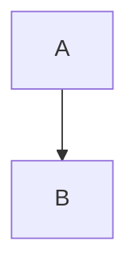

# Development Convention Basis: Common Policy Template

## Status

Draft

## Purpose

この文書は、`discussion/development/` 配下に作成する各開発規約ドキュメントの **共通フォーマット** を定義する。

開発規約ドキュメントは、単なる説明文ではない。  
各規約は、実装者、サブエージェント、レビュワー、acceptance runner、test author が同じ前提で作業できるように、以下を明確にしなければならない。

- その規約が何を保証するのか。
- その規約が何を禁止するのか。
- どの設計文書・テスト設計を正本として参照するのか。
- どのmodule / actor / file / test profileに適用されるのか。
- 何を必ず決定しなければならないのか。
- どのMermaid図・表・checklistを含めるべきか。
- 実装・テスト・レビュー時にどの証拠を残すべきか。
- 矛盾が見つかった場合にどう処理するのか。
- その規約自体をどう変更するのか。

このテンプレートは、P0 / P1 のすべての開発規約ドキュメントに適用する。

---

## Target Documents

この共通テンプレートは、少なくとも以下の開発規約に適用する。

### P0 Policies

```text
discussion/development/source-of-truth-policy.md
discussion/development/repository-structure-policy.md
discussion/development/module-boundary-policy.md
discussion/development/schema-and-id-conventions.md
discussion/development/runtime-and-dynamics-implementation-policy.md
discussion/development/operation-policy.md
discussion/development/testing-and-acceptance-policy.md
discussion/development/diagnostic-policy.md
````

### P1 Policies

```text
discussion/development/gui-implementation-policy.md
discussion/development/ai-assistant-implementation-policy.md
discussion/development/demo-rights-ip-policy.md
discussion/development/dependency-policy.md
discussion/development/review-and-pr-policy.md
discussion/development/subagent-workflow-policy.md
discussion/development/e2e-test-policy.md
```

---

## Policy Document Template

各開発規約ドキュメントは、原則として以下の構成を持つ。

```md
# <Policy Title>

## Status

## Purpose

## Scope

## Source Documents

## Required Decisions

## Required Diagrams

## Required Tables

## Rules

## Forbidden

## Required Evidence

## Review Checklist

## Conflict Handling

## Change Process

## Completion Gate
```

必要に応じて追加sectionを設けてもよい。
ただし、上記sectionを省略する場合は、その理由を明記すること。

---

# Section Requirements

## 1. Status

### Purpose

その規約文書の状態を示す。

### Allowed Values

```text
Draft
Accepted
Superseded
Deprecated
```

### Meaning

| Status     | Meaning                    |
| ---------- | -------------------------- |
| Draft      | 作成中。実装者は参考にしてよいが、最終正本ではない。 |
| Accepted   | 実装時に従うべき正式規約。              |
| Superseded | 別文書または新versionに置き換えられた。    |
| Deprecated | まだ参照可能だが、新規作業では使わない。削除予定。  |

### Required Format

```md
## Status

Accepted
```

または、置換先がある場合:

```md
## Status

Superseded by `discussion/development/<new-policy>.md`
```

---

## 2. Purpose

### Purpose

その規約が何を保証し、何を防ぐためのものかを説明する。

### Required Content

* この規約が解決する問題。
* この規約が防ぐ事故。
* この規約が保証する性質。
* この規約がなぜMVP実装前に必要か。

### Example

```md
## Purpose

この規約は、Runtime Core、Validator、Acceptance Runner が同じ RuntimeState / RuntimeSnapshot / RuntimeStateSequence の意味論を共有することを保証する。

特に、Minimum Open Dynamics v1 の deterministic replay において、hidden mutable state、曖昧なstate artifact、final stateのみの不十分な比較を防ぐ。
```

---

## 3. Scope

### Purpose

その規約がどこに適用されるかを定義する。

### Required Content

* 対象module。
* 対象actor。
* 対象file path。
* 対象test profile。
* 対象外のもの。

### Recommended Format

```md
## Scope

### Applies to

- `packages/runtime-core/**`
- `packages/validator/**`
- `discussion/design/module-contracts/runtime-core-contract.md`
- `discussion/tests/**`

### Actors

- Runtime implementer
- Validator implementer
- Acceptance runner implementer
- Clean Context Reviewer

### Does not apply to

- Historical research reports under `discussion/reports/**`
- Post-MVP direct vertex physics
```

---

## 4. Source Documents

### Purpose

その規約を作る際に参照する正本文書を列挙する。

### Required Content

* 必須参照ファイル。
* 補助参照ファイル。
* 実装oracleにしてはいけないもの。

### Required Rule

`discussion/reports/**` や Cubism関連資料を implementation oracle として扱ってはならない。

### Recommended Format

```md
## Source Documents

### Primary

- `discussion/acceptance-criteria/03_MVP_Acceptance_Criteria.md`
- `discussion/design/module-contracts/runtime-core-contract.md`
- `discussion/tests/strategy/epsilon-determinism-policy.md`

### Supporting

- `memo/gpt-5.5-pro-review/review_007.md`

### Not implementation oracle

- `discussion/reports/**`
- Cubism SDK/Core behavior
- Cubism Viewer output
- Cubism file formats
```

---

## 5. Required Decisions

### Purpose

その規約内で必ず決めるべき項目を列挙する。

これは、規約作成者が「何を書けばよいか」を明確にするためのsectionである。

### Required Format

各decisionは、以下の形で書く。

```md
### DEC-<POLICY>-001: <Decision title>

#### Question
何を決める必要があるか。

#### Decision
採用する方針。

#### Rationale
なぜその方針にするか。

#### Alternatives considered
検討した代替案。

#### Impact
module / test / fixture / review への影響。
```

### Example

```md
### DEC-RUNTIME-001: Runtime Core does not keep hidden mutable dynamics state

#### Question
Minimum Open Dynamics v1 のstateを Runtime Core 内部に保持してよいか。

#### Decision
保持しない。Runtime Core は previous RuntimeStateDto を受け取り、next RuntimeStateDto を返す。

#### Rationale
deterministic replay、acceptance evidence、AI dry-run、Validator比較を可能にするため。

#### Alternatives considered
Runtime Core内部にsession stateを持つ案。

#### Impact
Runtime API、fixture、RuntimeState artifact、acceptance runnerが明示stateを扱う必要がある。
```

---

## 6. Required Diagrams

### Purpose

自然言語では誤解しやすい構造を、Mermaid図として明示する。

### Required Content

* 図の名前。
* 図の目的。
* 推奨Mermaid種類。
* 図で必ず表すnode / edge / state。
* 図が確認すべき誤解防止ポイント。

### Required Format

```md
## Required Diagrams

### Diagram 1: <Diagram name>

#### Mermaid type
flowchart TD / graph TD / sequenceDiagram / stateDiagram-v2

#### Purpose
何を明確にする図か。

#### Must include
- node A
- node B
- dependency direction
- forbidden edge

#### Must not imply
- 誤解させてはいけない関係
```

### Example

```md
### Diagram 1: Runtime Evaluation Pipeline

#### Mermaid type
flowchart TD

#### Purpose
authored parameterからdraw list生成までの評価順序を明示する。

#### Must include
- authoredParameterValues
- Minimum Open Dynamics v1
- computedParameterValues
- effectiveParameterValues
- keyform evaluator
- rigControl evaluator
- draw list

#### Must not imply
- Dynamicsがmesh vertexを直接書き換えること
- Runtime Coreがhidden mutable stateを持つこと
```

---

## 7. Required Tables

### Purpose

責務、許可/禁止、profile差分、artifact一覧など、比較・網羅が必要な情報を表で明示する。

### Required Format

```md
## Required Tables

### Table 1: <Table name>

#### Purpose
表の目的。

#### Required columns
| Column | Meaning |
|---|---|
| ... | ... |
```

### Common Table Types

各規約は必要に応じて以下の表を持つ。

| Table Type                | Purpose                                             |
| ------------------------- | --------------------------------------------------- |
| Responsibility Table      | module / actor / file の責任を明確にする                     |
| Allowed / Forbidden Table | 許可される行為と禁止行為を対比する                                   |
| Profile Matrix            | interactive / strict / acceptance / demoSafe の差分を示す |
| Artifact Table            | 生成されるartifactと責務を示す                                 |
| Dependency Table          | module間の許可/禁止依存を示す                                  |
| Diagnostic Table          | diagnostic ID、severity、formal/candidateを示す          |
| Review Checklist Table    | レビュー項目とblocking条件を示す                                |

---

## 8. Rules

### Purpose

実装者・サブエージェント・レビュワーが従うべき規則を定義する。

### Language

規則は原則として以下を使う。

| Term       | Meaning            |
| ---------- | ------------------ |
| MUST       | 必須。違反はblocking。    |
| MUST NOT   | 禁止。違反はblocking。    |
| SHOULD     | 原則推奨。逸脱する場合は理由が必要。 |
| SHOULD NOT | 原則避ける。必要なら理由が必要。   |
| MAY        | 許可。必須ではない。         |

### Required Format

```md
## Rules

### R-<POLICY>-001: <Rule title>

<Actor> MUST ...

#### Rationale
...

#### Evidence
...
```

### Example

```md
### R-RUNTIME-001: Runtime Core must be deterministic

Runtime Core MUST produce the same RuntimeSnapshotDto and RuntimeStateDto sequence for the same NormalizedRuntimeGraph, RuntimeSequenceFrameDto[], RuntimeEvaluationContextDto, RuntimeEvaluationOptionsDto, and initial RuntimeStateDto.

#### Rationale
Exact deterministic replay and acceptance evidence require reproducible runtime output.

#### Evidence
- RuntimeStateSequenceArtifact
- RuntimeSnapshot sequence
- Acceptance runner result
```

---

## 9. Forbidden

### Purpose

特に禁止される行為を明示する。

### Required Content

* 禁止行為。
* 禁止理由。
* 違反時の扱い。
* 該当するmodule / actor。

### Required Format

```md
## Forbidden

| Forbidden action | Applies to | Reason | Violation handling |
|---|---|---|---|
| ... | ... | ... | blocking |
```

### Common Forbidden Items

多くの規約で、以下は明示的に禁止する。

```md
- Cubism SDK/Coreをoracleにすること。
- Cubism Viewer出力一致をacceptance条件にすること。
- Cubism形式を読み書きすること。
- Runtime CoreがGUI moduleに依存すること。
- GUIやAIがOperation Coreを通さずpackageを直接mutationすること。
- AI assistantがhuman approvalなしにcommitすること。
- machine-readable IDに空白を使うこと。
- MVP blocking testがcandidate diagnosticだけに依存すること。
```

---

## 10. Required Evidence

### Purpose

規約遵守を証明するために、実装・テスト・レビュー時に残すべき証拠を定義する。

### Required Content

* 必須artifact。
* 生成者。
* 消費者。
* 保存場所。
* acceptance runnerが読むかどうか。
* review時に確認するかどうか。

### Required Format

```md
## Required Evidence

| Evidence | Producer | Consumer | Path / Ref | Required for |
|---|---|---|---|---|
| RuntimeStateSequenceArtifact | runtime-core | acceptance-runner | `runtime/state-sequences/*.runtime-state-sequence.json` | exact replay |
```

### Common Evidence Types

* Operation log
* RuntimeSnapshotDto
* RuntimeStateDto
* RuntimeStateSequenceArtifact
* ValidationReport
* RuntimeDiff
* ModelDiff
* GUIEvidence
* AI dry-run response
* Demo-safe preflight report
* Rights/provenance report
* Conflict Resolution Log
* Test Adequacy Review
* Development Compliance Review

---

## 11. Review Checklist

### Purpose

PR、patch、subagent成果物をreviewするときの確認項目を定義する。

### Required Format

```md
## Review Checklist

### Blocking

- [ ] ...

### Warning

- [ ] ...

### Suggestion

- [ ] ...
```

### Required Categories

原則として、各規約には以下のreview categoryを含める。

```md
### Blocking
違反するとmerge / acceptance不可。

### Warning
理由があれば許容できるが記録が必要。

### Suggestion
改善提案。blockingではない。
```

### Example

```md
### Blocking

- [ ] Runtime Coreがhidden mutable Dynamics stateを持っていない。
- [ ] exact deterministic replayが全RuntimeState sequenceを比較している。
- [ ] Cubism Viewer一致をoracleにしていない。
```

---

## 12. Conflict Handling

### Purpose

文書間の矛盾、設計漏れ、traceability不整合、contract不一致を発見した場合の扱いを定義する。

### Required Rule

矛盾を発見した実装者・サブエージェント・レビュワーは、独自判断で黙って補完してはならない。

矛盾は以下のいずれかで処理する。

1. Conflict Resolution Log に記録する。
2. 修正対象文書を明示する。
3. blocking issue として作業を止める。
4. 明確な修正PR / patch に分離する。

---

# Conflict Resolution Log Format

各開発規約は、矛盾処理に以下の形式を使う。

```md
# Conflict Resolution Log

## CONFLICT-0001: <Short title>

### Status
Open / Resolved / Superseded

### Found by
Human / Agent name / Reviewer role

### Found in
- `path/to/file-a.md`
- `path/to/file-b.md`

### Conflict
A says ...
B says ...

### Impact
この矛盾が実装、テスト、acceptance、reviewにどう影響するか。

### Decision
採用した解釈または修正方針。

### Rationale
なぜその判断をしたか。

### Source of truth after resolution
修正後に正となるファイルまたはsection。

### Changed files
- `path/to/changed-file.md`

### Required follow-up
- [ ] ...
- [ ] ...

### Reviewer
- ...

### Resolved at
YYYY-MM-DD or commit / patch reference
```

---

## Conflict Severity

矛盾は以下のseverityに分類する。

| Severity   | Meaning                    | Required action |
| ---------- | -------------------------- | --------------- |
| blocking   | 実装・テスト・acceptanceが不可能または危険 | 作業停止、修正必須       |
| warning    | 直ちに破綻しないが誤解や後続不整合の可能性あり    | 記録し、修正または理由を明記  |
| suggestion | 改善提案                       | 任意対応            |

---

## Common Conflict Types

| Conflict type                  | Example                                              |
| ------------------------------ | ---------------------------------------------------- |
| AC vs Contract                 | ACではDynamics必須だがcontractにDTOがない                      |
| Contract vs Test               | testが参照するdiagnosticがvalidator contractにない            |
| Fixture vs Traceability        | `mvp-blocking` fixtureがTest IDに接続されていない              |
| Runtime vs Operation           | DTO名・payload形状が一致しない                                 |
| Schema vs Example              | artifact ref schemaと例示pathが一致しない                     |
| Review Memo vs Accepted Design | memoで決めた内容が本文に反映されていない                               |
| Candidate vs Formal Diagnostic | MVP blocking testがcandidate diagnosticのみをoracleにしている |

---

## 13. Change Process

### Purpose

開発規約自体を変更する方法を定義する。

### Required Content

* 変更できる条件。
* 変更時に必要なreview。
* 影響範囲の確認。
* 更新すべき関連文書。
* Superseded / Deprecated の扱い。

### Required Format

```md
## Change Process

### When this policy may change

- ...

### Required review

- Test Adequacy Review if tests are affected.
- Development Compliance Review if implementation boundaries are affected.
- Clean Context Review if MVP acceptance or oracle changes.

### Required updates

- ...
```

### Example

```md
## Change Process

This policy may change when RuntimeState artifact semantics, Dynamics evaluator behavior, or acceptance evidence requirements change.

Any change affecting exact deterministic replay MUST update:

- runtime-core contract
- fixtures-and-contract-tests
- validator contract
- testing-and-acceptance policy
- acceptance runner design
```

---

## 14. Completion Gate

### Purpose

その規約文書が完成したと判断する条件を定義する。

### Required Format

```md
## Completion Gate

- [ ] Statusが設定されている。
- [ ] Purposeが明確である。
- [ ] Scopeが明確である。
- [ ] Source Documentsが列挙されている。
- [ ] Required Decisionsがすべて埋まっている。
- [ ] Required Diagramsが作成されている。
- [ ] Required Tablesが作成されている。
- [ ] RulesがMUST / SHOULD / MAY形式で書かれている。
- [ ] Forbiddenが明示されている。
- [ ] Required Evidenceが定義されている。
- [ ] Review Checklistがある。
- [ ] Conflict Handlingが定義されている。
- [ ] Change Processが定義されている。
```

---

# Additional Formatting Rules

## Headings

* `#` は文書タイトルにのみ使う。
* `##` は主要section。
* `###` はsubsection。
* `####` は詳細項目。

## Lists

* MUST / SHOULD / MAY は箇条書きまたは個別ruleとして書く。
* 禁止事項は `Forbidden` sectionにも集約する。
* review checklistはcheckbox形式にする。

## Tables

表は、比較・網羅・責務分担が必要な場合に使う。
自然言語だけで列挙しない。

## Mermaid

Mermaid図は、以下の形式で記載する。

````md

````

Mermaid図には、図の前に必ず目的を書く。

````md
### Diagram: Runtime Evaluation Pipeline

This diagram shows the order of runtime evaluation and where Minimum Open Dynamics v1 produces computed parameter values.

```mermaid
flowchart TD
  A[authored parameters] --> B[Minimum Open Dynamics v1]
  B --> C[computed parameters]
````

````

## Examples

例は参考であり、規約本文の網羅ではない。  
例に含まれない項目でも、Required Decisionsに含まれている場合は必ず決定する。

---

# Global Requirements for All Policies

すべての開発規約は、以下を守る。

## Cubism Non-oracle Requirement

開発規約は、以下をimplementation / test / acceptance oracleとして使ってはならない。

```text
Cubism SDK/Core
Cubism Viewer
Cubism Editor behavior
Cubism file formats
Cubism Physics behavior
existing Cubism models
official Live2D/Cubism sample models
````

## Machine-readable ID Requirement

machine-readable IDに空白を使ってはならない。

Allowed:

```text
rigControl
runtime.stateSequenceLengthMismatch
invalid-rigControl-cycle
```

Forbidden:

```text
rig control
runtime state sequence mismatch
invalid-rig control-cycle
```

## Evidence-first Requirement

MVP acceptanceに関わる規約は、判断を自然言語だけに依存してはならない。
必ず以下のいずれかのevidenceを要求する。

* fixture
* operation log
* runtime snapshot
* runtime state
* runtime state sequence
* validation report
* diff
* GUI evidence
* AI dry-run response
* demo-safe preflight report
* rights/provenance report
* acceptance runner result

## Clean Context Review Requirement

MVP acceptance、test adequacy、development complianceに関わる規約は、Clean Context Reviewを要求できるようにする。

Clean Context Review は、作業担当者の会話文脈を共有していない別サブエージェントまたはreviewerが、成果物と正本文書だけを根拠に行う。
