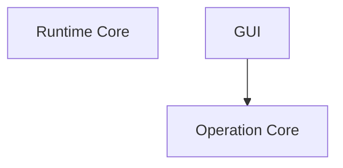
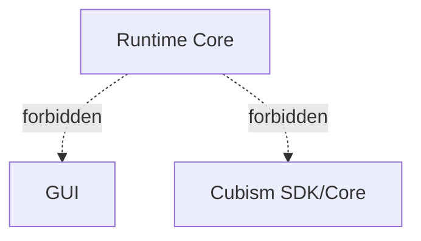

# Development Convention Basis: Required Diagrams and Tables

## Status

Draft

## Purpose

この文書は、P0 / P1 の各開発規約ドキュメントに含めるべき Mermaid 図と表を一覧化する。

開発規約は自然言語だけでは誤解が発生しやすい。
特に、このプロジェクトでは以下のような構造がある。

* module dependency
* operation mutation boundary
* Runtime / Dynamics evaluation flow
* RuntimeState sequence evidence
* acceptance runner pipeline
* GUI / AI / demo-safe / rights / dependency の境界
* formal / candidate diagnostic の区別
* clean context review
* subagent handoff

そのため、各規約ドキュメントは、必要に応じて Mermaid 図と表を含める。

この文書は、各規約に対して以下を定義する。

* 必須 Mermaid 図
* 推奨 Mermaid 種別
* 図の目的
* 図に必ず含める要素
* 必須表
* 表の目的
* 表に必ず含める列

---

## Scope

対象となる開発規約は以下である。

### P0 Policies

```text
discussion/development_convention/source-of-truth-policy.md
discussion/development_convention/repository-structure-policy.md
discussion/development_convention/module-boundary-policy.md
discussion/development_convention/schema-and-id-conventions.md
discussion/development_convention/runtime-and-dynamics-implementation-policy.md
discussion/development_convention/operation-policy.md
discussion/development_convention/testing-and-acceptance-policy.md
discussion/development_convention/diagnostic-policy.md
discussion/development_convention/implementation-orchestration-policy.md
```

### P1 Policies

```text
discussion/development_convention/gui-implementation-policy.md
discussion/development_convention/ai-assistant-implementation-policy.md
discussion/development_convention/demo-rights-ip-policy.md
discussion/development_convention/dependency-policy.md
discussion/development_convention/review-and-pr-policy.md
discussion/development_convention/subagent-workflow-policy.md
discussion/development_convention/e2e-test-policy.md
```

---

## General Diagram Rules

すべての Mermaid 図は、以下の規則に従う。

### Rule 1: 図の目的を先に書く

Mermaid図の前に、必ず図の目的を書く。

```md
### Diagram: Runtime Evaluation Pipeline

This diagram shows how authored parameters, Minimum Open Dynamics v1, computed parameters, keyforms, rigControl, and draw list generation are ordered.
```

### Rule 2: Mermaid種別を明記する

各図には、Mermaid種別を明記する。

```md
#### Mermaid type

flowchart TD
```

または、

```md
#### Mermaid type

sequenceDiagram
```

### Rule 3: 図が示してはいけない誤解を明記する

特に module boundary や Runtime / Dynamics では、「図が暗に示してはいけないこと」を書く。

例:

```md
#### Must not imply

- Runtime Core depends on GUI.
- Dynamics directly mutates mesh vertices.
- AI assistant can commit package mutation without approval.
```

### Rule 4: machine-readable IDに空白を使わない

Mermaid図のnode IDには空白を使わない。
表示labelに自然言語を使う場合は、node IDとlabelを分ける。

推奨:



避ける:

```mermaid
flowchart TD
  Runtime Core --> GUI
```

### Rule 5: 禁止依存は明示する

module boundary、dependency、AI、demo-safe、Cubism非依存に関する図では、禁止関係を必ず視覚化する。

例:



---

## General Table Rules

すべての表は、以下の規則に従う。

### Rule 1: 表の目的を明記する

表の前に、何を比較・整理する表かを書く。

```md
### Table: Module Responsibility Table

This table defines each module's responsibility, inputs, outputs, and forbidden dependencies.
```

### Rule 2: Required columnsを明記する

各表には、必ず含める列を定義する。

```md
#### Required columns

| Column | Meaning |
|---|---|
| Module | 対象module |
| Responsibility | 責務 |
| Inputs | 入力 |
| Outputs | 出力 |
```

### Rule 3: 許可/禁止の表を分ける

複雑な場合は、Allowed と Forbidden を同じ表に混ぜず、別表にする。

### Rule 4: Acceptanceに関わる表はblocking条件を含める

testing、diagnostic、review、dependency、demo-safe に関わる表は、どの条件がblockingかを明記する。

### Rule 5: formal / candidate を明示する

diagnosticやtest oracleに関わる表では、formal / candidate の区別を必ず持つ。

---

# Diagram and Table Matrix

## Overview Matrix

| Policy                                     | Required Diagrams                                                                   | Required Tables                                                                    |
| ------------------------------------------ | ----------------------------------------------------------------------------------- | ---------------------------------------------------------------------------------- |
| Source of Truth Policy                     | Source of Truth Relationship, Conflict Resolution Flow                              | Source Document Responsibility, Conflict Severity, Non-oracle Sources              |
| Repository Structure Policy                | Monorepo Layout, Generated Artifact Placement, Workspace Visibility for Agents      | Top-level Directory Responsibility, Package Responsibility, Generated Artifact     |
| Module Boundary Policy                     | Module Dependency DAG, Forbidden Dependency Diagram, Mutation Boundary Flow         | Module Responsibility, Allowed Dependency, Forbidden Dependency, Mutation Boundary |
| Schema and ID Conventions                  | Schema Ownership Flow, Artifact Reference Structure                                 | ID Naming, Artifact Ref, Deprecated Schema                                         |
| Runtime and Dynamics Implementation Policy | Runtime Evaluation Pipeline, RuntimeState Sequence, Dynamics Dataflow               | Runtime API, Parameter Layer, Dynamics Scope, Replay Evidence                      |
| Operation Policy                           | Operation Mutation Flow, AI Dry-run Flow                                            | Operation Type, Actor Permission, Operation Result Artifact                        |
| Testing and Acceptance Policy              | Acceptance Runner Pipeline, Test Evidence Graph, Review Gate Flow, E2E Journey Flow | Test Profile Matrix, Evidence Requirement, Review Requirement, E2E Test            |
| Diagnostic Policy                          | Diagnostic Lifecycle, Diagnostic Use in Acceptance                                  | Diagnostic Registry, Candidate Promotion, Profile Severity Matrix                  |
| Implementation Orchestration Policy        | Project-specific Orchestration Hierarchy, Wave Planning Flow, Domain Implementation Loop, Early Escape Flow, Review Artifact Flow | Agent Role, Review Lane, Wave Gate, Review Scope, Loop Control, Early Escape, Persistent Report |
| GUI Implementation Policy                  | GUI Mutation Flow, GUI Evidence Flow, Demo-safe GUI Capture Flow                    | GUI Panel Responsibility, GUI Evidence, Demo-safe Visibility, GUI Test ID          |
| AI Assistant Implementation Policy         | AI Dry-run Flow, AI Approval Boundary, AI Forbidden Flow                            | AI Command Permission, AI Context Access, AI Repair Candidate, AI Escalation       |
| Demo / Rights / IP Policy                  | Demo-safe Preflight Flow, Asset Provenance Flow, Proposal Boundary Flow             | Demo-safe Field, Forbidden Term, Rights Metadata, Proposal Boundary                |
| Dependency Policy                          | Dependency Approval Flow, Forbidden Dependency Boundary                             | Dependency Registry, License Policy, Forbidden Dependency, Binary Dependency       |
| Review and PR Policy                       | PR Review Pipeline, Clean Context Review Flow                                       | PR Required Field, Review Type, Merge Gate, Review Finding                         |
| Subagent Workflow Policy                   | Subagent Handoff Flow, Conflict Escalation Flow, Clean Context Review Boundary      | Agent Assignment, Handoff Artifact, Conflict Escalation, Concurrent Edit Rule      |
| E2E Test Policy                            | Authoring-to-Viewer E2E, AI Repair E2E, Demo-safe E2E, Deterministic Replay E2E     | E2E Journey, E2E Evidence Matrix, E2E Oracle, E2E Review                           |

---

# P0 Policy Diagram and Table Requirements

## 1. Source of Truth Policy

### Required Diagram 1: Source of Truth Relationship

#### Mermaid type

```text
graph TD
```

#### Purpose

各文書カテゴリの責務と、implementation / acceptance との関係を明確にする。

#### Must include

* AC / Scenario
* Module Contract
* Test Design
* Development Convention
* Review Memo / Fix Summary
* Research Reports
* Implementation
* Acceptance Runner
* Conflict Resolution Log

#### Must show

* AC / Scenario は要求の正本。
* Module Contract は実装契約の正本。
* Test Design は検証・証拠設計の正本。
* Development Convention は作業規約の正本。
* Review Memo は accepted design に反映されるまでは補助資料。
* Research Reports は implementation oracle ではない。

#### Must not imply

* Review Memo が直接実装正本になること。
* Research Reports が runtime / validator / test oracle になること。

---

### Required Diagram 2: Conflict Resolution Flow

#### Mermaid type

```text
flowchart TD
```

#### Purpose

文書間矛盾を発見したときの処理手順を示す。

#### Must include

* conflict detected
* classify severity
* create Conflict Resolution Log
* identify affected documents
* decide resolution
* update source documents
* clean context review
* close conflict

---

### Required Table 1: Source Document Responsibility Table

#### Purpose

文書カテゴリごとの責務を整理する。

#### Required columns

| Column                       | Meaning                  |
| ---------------------------- | ------------------------ |
| Document category            | AC、Contract、Test Design等 |
| Defines                      | 何を定義するか                  |
| Used by                      | 実装者、Validator、Runner等    |
| Can be implementation oracle | yes/no                   |
| Can be acceptance oracle     | yes/no                   |
| Conflict handling            | 矛盾時の処理                   |

---

### Required Table 2: Conflict Severity Table

#### Purpose

矛盾のseverityごとの処理を定義する。

#### Required columns

| Column                        | Meaning                         |
| ----------------------------- | ------------------------------- |
| Severity                      | blocking / warning / suggestion |
| Meaning                       | 影響                              |
| Required action               | 必要対応                            |
| Can implementation continue   | yes/no                          |
| Requires clean context review | yes/no                          |

---

### Required Table 3: Non-oracle Sources Table

#### Purpose

実装・テストのoracleにしてはいけない情報源を明示する。

#### Required columns

| Column                     | Meaning    |
| -------------------------- | ---------- |
| Source                     | 対象情報源      |
| Why not oracle             | oracle禁止理由 |
| Allowed usage              | 許可される用途    |
| Blocking if used as oracle | yes/no     |

---

## 2. Repository Structure Policy

### Required Diagram 1: Monorepo Layout

#### Mermaid type

```text
graph TD
```

#### Purpose

monorepo内の主要top-level directoryとその関係を示す。

#### Must include

* apps
* packages
* fixtures
* generated
* discussion
* tools / scripts
* memo
* tests if separate from fixtures

#### Must show

* `discussion/` は設計正本。
* `packages/` は実装module群。
* `generated/` はgenerated evidence。
* authored source と generated artifact は分離される。

---

### Required Diagram 2: Generated Artifact Placement

#### Mermaid type

```text
graph TD
```

#### Purpose

生成される証拠artifactの配置を示す。

#### Must include

* runtime snapshots
* runtime states
* runtime state sequences
* validation reports
* diffs
* GUI evidence
* AI dry-run evidence
* demo-safe preflight reports
* acceptance runner results

---

### Required Diagram 3: Workspace Visibility for Agents

#### Mermaid type

```text
flowchart TD
```

#### Purpose

エージェントが参照・編集・生成する対象の関係を示す。

#### Must include

* agent
* discussion documents
* packages
* fixtures
* generated artifacts
* review output
* conflict logs

---

### Required Table 1: Top-level Directory Responsibility Table

#### Required columns

| Column               | Meaning                               |
| -------------------- | ------------------------------------- |
| Directory            | top-level path                        |
| Purpose              | 目的                                    |
| Authored / Generated | authored source or generated artifact |
| Owner                | 管理主体                                  |
| Editable by agents   | yes/no/limited                        |
| Notes                | 補足                                    |

---

### Required Table 2: Package Responsibility Table

#### Required columns

| Column             | Meaning  |
| ------------------ | -------- |
| Package            | package名 |
| Responsibility     | 責務       |
| May depend on      | 依存可能     |
| Must not depend on | 禁止依存     |
| Primary tests      | 主なtest   |

---

### Required Table 3: Generated Artifact Table

#### Required columns

| Column                    | Meaning    |
| ------------------------- | ---------- |
| Artifact type             | artifact種別 |
| Path                      | 配置path     |
| Producer                  | 生成者        |
| Consumer                  | 消費者        |
| Authored source?          | yes/no     |
| Used by acceptance runner | yes/no     |

---

## 3. Module Boundary Policy

### Required Diagram 1: Module Dependency DAG

#### Mermaid type

```text
graph TD
```

#### Purpose

module間の許可された依存方向を示す。

#### Must include

* schema
* package-format
* operation-core
* runtime-core
* validator
* gui-core
* editor app
* viewer app
* ai-command
* fixture-tools
* acceptance-runner
* demo-safe tools

#### Must show

* dependency direction
* schema source of truth
* no cycles

---

### Required Diagram 2: Forbidden Dependency Diagram

#### Mermaid type

```text
graph TD
```

#### Purpose

禁止される依存を明示する。

#### Must include forbidden edges

* runtime-core -> gui
* runtime-core -> filesystem direct IO
* runtime-core -> Cubism SDK/Core
* validator -> GUI
* AI assistant -> direct package mutation
* GUI -> direct package mutation

---

### Required Diagram 3: Mutation Boundary Flow

#### Mermaid type

```text
sequenceDiagram
```

#### Purpose

GUI / AI / validator repair が model package を変更する際の境界を示す。

#### Must include

* GUI
* AI assistant
* validator repair candidate
* Operation Core
* dry-run
* diff
* human approval
* commit
* operation log

---

### Required Table 1: Module Responsibility Table

#### Required columns

| Column         | Meaning |
| -------------- | ------- |
| Module         | module名 |
| Responsibility | 責務      |
| Inputs         | 入力      |
| Outputs        | 出力      |
| Owns state?    | yes/no  |
| Notes          | 補足      |

---

### Required Table 2: Allowed Dependency Table

#### Required columns

| Column        | Meaning |
| ------------- | ------- |
| From          | 依存元     |
| May depend on | 依存先     |
| Reason        | 理由      |
| Conditions    | 条件      |

---

### Required Table 3: Forbidden Dependency Table

#### Required columns

| Column             | Meaning |
| ------------------ | ------- |
| From               | 依存元     |
| Must not depend on | 禁止依存先   |
| Reason             | 禁止理由    |
| Violation handling | 違反時の扱い  |

---

### Required Table 4: Mutation Boundary Table

#### Required columns

| Column                       | Meaning               |
| ---------------------------- | --------------------- |
| Actor                        | GUI / AI / validator等 |
| May mutate package directly? | yes/no                |
| Required path                | 必須経路                  |
| Evidence                     | 必要証拠                  |

---

## 4. Schema and ID Conventions

### Required Diagram 1: Schema Ownership Flow

#### Mermaid type

```text
graph TD
```

#### Purpose

schema定義の正本と、各moduleがどのschemaを消費するかを示す。

#### Must include

* schema package
* runtime-core
* operation-core
* validator
* AI command
* tests
* acceptance runner

---

### Required Diagram 2: Artifact Reference Structure

#### Mermaid type

```text
graph TD
```

#### Purpose

artifact ref schemaと実際のartifact pathの関係を示す。

#### Must include

* RuntimeStateArtifactRef
* RuntimeStateSequenceArtifactRef
* RuntimeSnapshotRef
* ValidationReportRef
* DiffRef
* GUIEvidenceRef
* DemoSafePreflightRef

---

### Required Table 1: ID Naming Table

#### Required columns

| Column            | Meaning              |
| ----------------- | -------------------- |
| ID type           | Test ID, Fixture ID等 |
| Format            | 形式                   |
| Valid example     | 正しい例                 |
| Forbidden example | 禁止例                  |
| Owning document   | 管理文書                 |

---

### Required Table 2: Artifact Ref Table

#### Required columns

| Column       | Meaning    |
| ------------ | ---------- |
| Artifact     | artifact種別 |
| Path pattern | path規約     |
| Points to    | 指す内容       |
| Generated?   | yes/no     |
| Used by      | 消費者        |

---

### Required Table 3: Deprecated Schema Table

#### Required columns

| Column            | Meaning      |
| ----------------- | ------------ |
| Deprecated schema | deprecated対象 |
| Replacement       | 置換先          |
| Allowed usage     | 許可用途         |
| Removal condition | 削除条件         |

---

## 5. Runtime and Dynamics Implementation Policy

### Required Diagram 1: Runtime Evaluation Pipeline

#### Mermaid type

```text
flowchart TD
```

#### Purpose

runtime evaluation の順序を示す。

#### Must include

* authoredParameterValues
* Minimum Open Dynamics v1
* computedParameterValues
* effectiveParameterValues
* keyform evaluator
* parameter-grid-2d evaluator
* rigControl evaluator
* mesh deformation
* draw list
* runtime snapshot

#### Must not imply

* Dynamicsがmesh vertexを直接書き換えること。
* Runtime Coreがhidden mutable stateを持つこと。

---

### Required Diagram 2: RuntimeState Sequence

#### Mermaid type

```text
sequenceDiagram
```

#### Purpose

RuntimeStateSequenceArtifact の state列意味論を示す。

#### Must include

* initial state
* frame 0
* post-frame state 1
* frame 1
* post-frame state 2
* final state

#### Must show

* `states[0] = initial state`
* `states[i + 1] = post-frame state`
* `states.length = frameCount + 1`

---

### Required Diagram 3: Dynamics Dataflow

#### Mermaid type

```text
flowchart TD
```

#### Purpose

Minimum Open Dynamics v1 の入力・計算・出力を示す。

#### Must include

* driver parameter
* weighted sum
* scalarDampedFollowV1
* output clamp
* computed output parameter
* effective parameter layer

---

### Required Table 1: Runtime API Table

#### Required columns

| Column         | Meaning  |
| -------------- | -------- |
| API            | API名     |
| Input          | 入力       |
| Output         | 出力       |
| State handling | stateの扱い |
| Deterministic? | yes/no   |

---

### Required Table 2: Parameter Layer Table

#### Required columns

| Column     | Meaning                     |
| ---------- | --------------------------- |
| Layer      | authored/computed/effective |
| Producer   | 生成者                         |
| Consumer   | 消費者                         |
| Mutable by | 変更可能主体                      |
| Evidence   | 証拠artifact                  |

---

### Required Table 3: Dynamics Scope Table

#### Required columns

| Column        | Meaning   |
| ------------- | --------- |
| Feature       | 機能        |
| MVP?          | yes/no    |
| Reason        | 理由        |
| Future status | Post-MVP等 |

---

### Required Table 4: Replay Evidence Table

#### Required columns

| Column                     | Meaning |
| -------------------------- | ------- |
| Evidence                   | 証拠      |
| Required for exact replay? | yes/no  |
| Purpose                    | 目的      |
| Path / field               | 保存場所    |

---

## 6. Operation Policy

### Required Diagram 1: Operation Mutation Flow

#### Mermaid type

```text
sequenceDiagram
```

#### Purpose

package mutation の正式経路を示す。

#### Must include

* GUI
* AI
* Operation Core
* dry-run
* model diff
* runtime diff
* validation diff
* human approval
* commit
* operation log

---

### Required Diagram 2: AI Dry-run Flow

#### Mermaid type

```text
sequenceDiagram
```

#### Purpose

AI提案がdry-runからapprovalへ進む流れを示す。

#### Must include

* AI request
* proposed operation
* Operation Core dry-run
* diff
* validation
* approval boundary
* commit or reject

---

### Required Table 1: Operation Type Table

#### Required columns

| Column             | Meaning |
| ------------------ | ------- |
| Operation type     | 操作種別    |
| Mutates package?   | yes/no  |
| Requires approval? | yes/no  |
| Evidence           | 必須証拠    |
| Actor allowed      | 実行可能主体  |

---

### Required Table 2: Actor Permission Table

#### Required columns

| Column      | Meaning                     |
| ----------- | --------------------------- |
| Actor       | GUI / AI / validator / test |
| May dry-run | yes/no                      |
| May commit  | yes/no                      |
| Conditions  | 条件                          |

---

### Required Table 3: Operation Result Artifact Table

#### Required columns

| Column      | Meaning    |
| ----------- | ---------- |
| Artifact    | artifact種別 |
| Produced by | 生成者        |
| Required?   | 必須か        |
| Used by     | 消費者        |

---

## 7. Testing and Acceptance Policy

### Required Diagram 1: Acceptance Runner Pipeline

#### Mermaid type

```text
flowchart TD
```

#### Purpose

fixtureからAC resultまでのacceptance実行流れを示す。

#### Must include

* fixture
* operation flow
* package
* validator
* runtime snapshot
* runtime state sequence
* diff
* GUI evidence
* AI dry-run evidence
* demo-safe preflight
* acceptance result

---

### Required Diagram 2: Test Evidence Graph

#### Mermaid type

```text
graph LR
```

#### Purpose

AC / Scenario / Test ID / Fixture / Expected Artifact / Oracle の関係を示す。

#### Must include

* MVP AC
* Domain AC
* Scenario
* Test ID
* Fixture
* Expected artifact
* Oracle
* Acceptance result

---

### Required Diagram 3: Review Gate Flow

#### Mermaid type

```text
flowchart TD
```

#### Purpose

実装からmergeまでのテスト・レビューgateを示す。

#### Must include

* implementation
* automated tests
* Test Adequacy Review
* Development Compliance Review
* Clean Context Review
* merge / reject

---

### Required Diagram 4: E2E Journey Flow

#### Mermaid type

```text
sequenceDiagram
```

#### Purpose

代表的なE2Eのmodule横断flowを示す。

#### Must include

* Editor
* Operation Core
* Runtime Core
* Validator
* Viewer
* Acceptance Runner

---

### Required Table 1: Test Profile Matrix

#### Required columns

| Column            | Meaning             |
| ----------------- | ------------------- |
| Profile           | dev-fast, contract等 |
| Runs              | 実行対象                |
| Blocking?         | yes/no              |
| Required evidence | 必須証拠                |

---

### Required Table 2: Evidence Requirement Table

#### Required columns

| Column            | Meaning |
| ----------------- | ------- |
| Test type         | test種別  |
| Required evidence | 必須証拠    |
| Optional evidence | 任意証拠    |
| Primary oracle    | 主oracle |

---

### Required Table 3: Review Requirement Table

#### Required columns

| Column           | Meaning  |
| ---------------- | -------- |
| Review           | review種別 |
| Reviewer         | reviewer |
| Required for     | 必須条件     |
| Evidence checked | 確認証拠     |

---

### Required Table 4: E2E Test Table

#### Required columns

| Column   | Meaning |
| -------- | ------- |
| E2E ID   | E2E識別子  |
| Journey  | シナリオ    |
| Evidence | 必須証拠    |
| Blocking | yes/no  |

---

## 8. Diagnostic Policy

### Required Diagram 1: Diagnostic Lifecycle

#### Mermaid type

```text
stateDiagram-v2
```

#### Purpose

diagnostic が candidate から formal へ昇格し、必要に応じてdeprecated/removalされる流れを示す。

#### Must include

* candidate
* formal
* deprecated
* removed

---

### Required Diagram 2: Diagnostic Use in Acceptance

#### Mermaid type

```text
flowchart TD
```

#### Purpose

diagnosticがacceptance oracleとして使われる条件を示す。

#### Must include

* validator diagnostic
* formal registry
* Test ID
* MVP blocking test
* acceptance result

#### Must show

* candidate diagnostic alone cannot be MVP blocking oracle

---

### Required Table 1: Diagnostic Registry Table

#### Required columns

| Column           | Meaning    |
| ---------------- | ---------- |
| Diagnostic ID    | ID         |
| Formal/Candidate | 分類         |
| Severity         | severity   |
| Profile behavior | profile別挙動 |
| Used by tests    | Test ID    |

---

### Required Table 2: Candidate Promotion Table

#### Required columns

| Column          | Meaning |
| --------------- | ------- |
| Step            | 昇格step  |
| Requirement     | 必要条件    |
| Required update | 更新対象    |

---

### Required Table 3: Profile Severity Matrix

#### Required columns

| Column      | Meaning       |
| ----------- | ------------- |
| Diagnostic  | diagnostic ID |
| interactive | 挙動            |
| strict      | 挙動            |
| acceptance  | 挙動            |
| demoSafe    | 挙動            |

---

# Additional P0 Policy Diagram and Table Requirements

## 9. Implementation Orchestration Policy

### Required Diagram 1: Project-specific Orchestration Hierarchy

#### Mermaid type

```text
graph TD
```

#### Purpose

`/goal` as Undine から domain-level agents、review lanes、Integrator までの階層を示す。

#### Must include

* `/goal` as Undine
* Orch-Sylph
* Gnome
* Review-Sylph
* Design / Development Compliance Review
* Test Adequacy Review
* Integrator

---

### Required Diagram 2: Wave Planning Flow

#### Mermaid type

```text
flowchart TD
```

#### Purpose

goal受領からwave計画、Wave 0、domain実行、integration、final reportまでの流れを示す。

#### Must include

* goal received
* dependency graph
* Wave 0
* wave gate
* domain launch
* domain review
* integration review
* final report

---

### Required Diagram 3: Domain Implementation Loop

#### Mermaid type

```text
flowchart TD
```

#### Purpose

Orch-Sylph domain cycle と fix loop を示す。

#### Must include

* context collection
* Gnome implementation
* tests
* Review-Sylph review
* Design / Development Compliance Review
* Test Adequacy Review
* fix loop
* domain completion report
* escalation to Undine

---

### Required Diagram 4: Early Escape Flow

#### Mermaid type

```text
flowchart TD
```

#### Purpose

安全に実装継続できない場合の停止、報告、decision flowを示す。

#### Must include

* ambiguity or conflict detected
* issue classification
* stop domain loop
* early escape report
* Undine
* user or source-of-truth decision

---

### Required Diagram 5: Review Artifact Flow

#### Mermaid type

```text
flowchart TD
```

#### Purpose

Review-Sylph report、domain completion、Integrator review、final reportの永続artifact flowを示す。

#### Must include

* Review-Sylph report
* Design / Development Compliance Review section
* Test Adequacy Review section
* domain completion report
* Integrator review
* wave summary
* Undine final report

---

### Required Table 1: Agent Role Table

#### Required columns

| Column       | Meaning |
| ------------ | ------- |
| Role         | agent role |
| Owns         | 責務範囲 |
| Must produce | 必須成果物 |
| Must not do  | 禁止事項 |

---

### Required Table 2: Review Lane Table

#### Required columns

| Column             | Meaning |
| ------------------ | ------- |
| Review lane        | review lane |
| Purpose            | 目的 |
| Blocking if fails? | yes/no |

---

### Required Table 3: Wave Gate Table

#### Required columns

| Column               | Meaning |
| -------------------- | ------- |
| Gate                 | gate |
| Required evidence    | 必須証拠 |
| Blocking if missing? | yes/no |

---

### Required Table 4: Review Scope Table

#### Required columns

| Column       | Meaning |
| ------------ | ------- |
| Review scope | review対象 |
| Checked by   | reviewer |
| Required for | 必須条件 |

---

### Required Table 5: Loop Control Table

#### Required columns

| Column | Meaning |
| ------ | ------- |
| Case   | 状態 |
| Action | 対応 |

---

### Required Table 6: Early Escape Table

#### Required columns

| Column          | Meaning |
| --------------- | ------- |
| Trigger         | 早期脱出条件 |
| Required report | 必須報告 |

---

### Required Table 7: Persistent Report Table

#### Required columns

| Column | Meaning |
| ------ | ------- |
| Report | report種別 |
| Path   | 永続化path |

---

# P1 Policy Diagram and Table Requirements

## 10. GUI Implementation Policy

### Required Diagram 1: GUI Mutation Flow

#### Mermaid type

```text
sequenceDiagram
```

#### Must include

* User
* GUI
* Operation Core
* dry-run
* diff
* commit
* operation log
* validation report

---

### Required Diagram 2: GUI Evidence Flow

#### Mermaid type

```text
flowchart TD
```

#### Must include

* GUI state
* semantic evidence
* operation log
* runtime snapshot
* validation report
* acceptance runner

---

### Required Diagram 3: Demo-safe GUI Capture Flow

#### Mermaid type

```text
flowchart TD
```

#### Must include

* GUI surface
* preflight scanner
* redaction
* allowed capture
* blocked capture

---

### Required Table 1: GUI Panel Responsibility Table

| Column            | Meaning   |
| ----------------- | --------- |
| Panel             | GUI panel |
| Responsibility    | 責務        |
| Produces evidence | yes/no    |
| Calls operation?  | yes/no    |

### Required Table 2: GUI Evidence Table

| Column       | Meaning |
| ------------ | ------- |
| Evidence     | 証拠      |
| Producer     | 生成者     |
| Consumer     | 消費者     |
| Required for | 用途      |

### Required Table 3: Demo-safe Visibility Table

| Column             | Meaning    |
| ------------------ | ---------- |
| Field / UI element | 対象         |
| Normal mode        | 通常表示       |
| Demo-safe mode     | demo-safe時 |
| Reason             | 理由         |

### Required Table 4: GUI Test ID Table

| Column          | Meaning         |
| --------------- | --------------- |
| GUI element     | UI要素            |
| Stable test ID  | test ID         |
| Semantic target | semantic target |

---

## 11. AI Assistant Implementation Policy

### Required Diagram 1: AI Dry-run Flow

#### Mermaid type

```text
sequenceDiagram
```

#### Must include

* AI assistant
* context
* proposed operation
* Operation Core dry-run
* diff
* validation
* human approval

---

### Required Diagram 2: AI Approval Boundary

#### Mermaid type

```text
flowchart TD
```

#### Must include

* proposal
* dry-run
* approval required
* commit
* reject

---

### Required Diagram 3: AI Forbidden Flow

#### Mermaid type

```text
flowchart TD
```

#### Must include

* direct package mutation blocked
* Cubism conversion blocked
* auto-rigging blocked
* no approval blocked

---

### Required Table 1: AI Command Permission Table

| Column             | Meaning    |
| ------------------ | ---------- |
| Command            | AI command |
| Allowed?           | yes/no     |
| Requires approval? | yes/no     |
| Evidence           | 必須証拠       |

### Required Table 2: AI Context Access Table

| Column         | Meaning   |
| -------------- | --------- |
| Context        | 対象context |
| Read allowed?  | yes/no    |
| Write allowed? | yes/no    |
| Notes          | 補足        |

### Required Table 3: AI Repair Candidate Table

| Column    | Meaning |
| --------- | ------- |
| Field     | field   |
| Required? | yes/no  |
| Meaning   | 意味      |

### Required Table 4: AI Escalation Table

| Column    | Meaning |
| --------- | ------- |
| Case      | ケース     |
| Action    | 対応      |
| Blocking? | yes/no  |

---

## 12. Demo / Rights / IP Policy

### Required Diagram 1: Demo-safe Preflight Flow

#### Mermaid type

```text
flowchart TD
```

#### Must include

* package
* GUI
* capture request
* forbidden term scan
* rights check
* redaction
* allow
* block

---

### Required Diagram 2: Asset Provenance Flow

#### Mermaid type

```text
flowchart TD
```

#### Must include

* source asset
* texture
* drawable
* package
* demo artifact
* provenance metadata

---

### Required Diagram 3: Proposal Boundary Flow

#### Mermaid type

```text
flowchart TD
```

#### Must include

* private prototype
* demo-safe output
* feature proposal
* forbidden implementation disclosure

---

### Required Table 1: Demo-safe Field Table

| Column                 | Meaning |
| ---------------------- | ------- |
| Field                  | 対象field |
| Show in normal mode    | yes/no  |
| Show in demo-safe mode | yes/no  |
| Reason                 | 理由      |

### Required Table 2: Forbidden Term Table

| Column    | Meaning   |
| --------- | --------- |
| Term      | 禁止語       |
| Surface   | 対象surface |
| Handling  | 対応        |
| Blocking? | yes/no    |

### Required Table 3: Rights Metadata Table

| Column    | Meaning        |
| --------- | -------------- |
| Field     | metadata field |
| Required? | yes/no         |
| Meaning   | 意味             |

### Required Table 4: Proposal Boundary Table

| Column               | Meaning |
| -------------------- | ------- |
| Content              | 内容      |
| Allowed in proposal? | yes/no  |
| Notes                | 補足      |

---

## 13. Dependency Policy

### Required Diagram 1: Dependency Approval Flow

#### Mermaid type

```text
flowchart TD
```

#### Must include

* dependency proposal
* license check
* forbidden dependency scan
* approval
* lockfile update
* registry update

---

### Required Diagram 2: Forbidden Dependency Boundary

#### Mermaid type

```text
graph TD
```

#### Must include

* project
* allowed dependency
* forbidden Cubism SDK/Core
* forbidden proprietary parser
* forbidden unlicensed binary

---

### Required Table 1: Dependency Registry Table

| Column     | Meaning                   |
| ---------- | ------------------------- |
| Dependency | 依存                        |
| Purpose    | 目的                        |
| License    | license                   |
| Scope      | runtime/editor/test/dev   |
| Status     | approved/review/forbidden |

### Required Table 2: License Policy Table

| Column           | Meaning                  |
| ---------------- | ------------------------ |
| License category | allowed/review/forbidden |
| Handling         | 対応                       |
| Notes            | 補足                       |

### Required Table 3: Forbidden Dependency Table

| Column          | Meaning |
| --------------- | ------- |
| Dependency type | 種別      |
| Reason          | 理由      |
| Handling        | 対応      |

### Required Table 4: Binary Dependency Table

| Column   | Meaning  |
| -------- | -------- |
| Binary   | binary名  |
| Source   | 入手元      |
| Checksum | checksum |
| License  | license  |
| Allowed? | yes/no   |

---

## 14. Review and PR Policy

### Required Diagram 1: PR Review Pipeline

#### Mermaid type

```text
flowchart TD
```

#### Must include

* implementation
* tests
* evidence
* Test Adequacy Review
* Development Compliance Review
* Clean Context Review
* merge
* reject

---

### Required Diagram 2: Clean Context Review Flow

#### Mermaid type

```text
sequenceDiagram
```

#### Must include

* implementer
* evidence bundle
* clean reviewer
* review result
* fix loop

---

### Required Table 1: PR Required Field Table

| Column    | Meaning  |
| --------- | -------- |
| Field     | PR field |
| Required? | yes/no   |
| Purpose   | 目的       |

### Required Table 2: Review Type Table

| Column        | Meaning  |
| ------------- | -------- |
| Review type   | 種別       |
| Reviewer      | reviewer |
| Required when | 必須条件     |

### Required Table 3: Merge Gate Table

| Column    | Meaning |
| --------- | ------- |
| Gate      | gate    |
| Blocking? | yes/no  |
| Evidence  | 必須証拠    |

### Required Table 4: Review Finding Table

| Column          | Meaning                     |
| --------------- | --------------------------- |
| Finding type    | blocking/warning/suggestion |
| Meaning         | 意味                          |
| Required action | 必要対応                        |

---

## 15. Subagent Workflow Policy

### Required Diagram 1: Subagent Handoff Flow

#### Mermaid type

```text
sequenceDiagram
```

#### Must include

* task owner
* subagent
* handoff artifact
* integrator
* reviewer

---

### Required Diagram 2: Conflict Escalation Flow

#### Mermaid type

```text
flowchart TD
```

#### Must include

* conflict found
* conflict log
* owner decision
* document update
* review

---

### Required Diagram 3: Clean Context Review Boundary

#### Mermaid type

```text
flowchart TD
```

#### Must include

* implementer context
* evidence bundle
* clean reviewer
* excluded conversation context

---

### Required Table 1: Agent Assignment Table

| Column          | Meaning  |
| --------------- | -------- |
| Agent role      | role     |
| Allowed paths   | 編集可能     |
| Forbidden paths | 編集禁止     |
| Reviewer        | reviewer |

### Required Table 2: Handoff Artifact Table

| Column    | Meaning       |
| --------- | ------------- |
| Field     | handoff field |
| Required? | yes/no        |
| Meaning   | 意味            |

### Required Table 3: Conflict Escalation Table

| Column    | Meaning |
| --------- | ------- |
| Case      | ケース     |
| Action    | 対応      |
| Blocking? | yes/no  |

### Required Table 4: Concurrent Edit Rule Table

| Column                   | Meaning |
| ------------------------ | ------- |
| File type                | 対象      |
| Concurrent edit allowed? | yes/no  |
| Required coordination    | 必要調整    |

---

## 16. E2E Test Policy

### Required Diagram 1: Authoring-to-Viewer E2E

#### Mermaid type

```text
sequenceDiagram
```

#### Must include

* Editor
* Operation Core
* package
* Runtime Core
* Viewer
* Validator
* Acceptance Runner

---

### Required Diagram 2: AI Repair E2E

#### Mermaid type

```text
sequenceDiagram
```

#### Must include

* invalid fixture
* Validator
* AI assistant
* dry-run
* human approval boundary
* acceptance runner

---

### Required Diagram 3: Demo-safe E2E

#### Mermaid type

```text
flowchart TD
```

#### Must include

* model
* GUI capture
* forbidden term scan
* rights check
* redaction
* allow / block

---

### Required Diagram 4: Deterministic Replay E2E

#### Mermaid type

```text
flowchart TD
```

#### Must include

* RuntimeSequenceFrameDto[]
* initial RuntimeState
* Runtime Core
* RuntimeStateSequenceArtifact
* full sequence comparison

---

### Required Table 1: E2E Journey Table

| Column    | Meaning      |
| --------- | ------------ |
| E2E ID    | ID           |
| Journey   | user journey |
| Modules   | 横断module     |
| Fixture   | fixture      |
| Blocking? | yes/no       |

### Required Table 2: E2E Evidence Matrix

| Column            | Meaning |
| ----------------- | ------- |
| E2E ID            | ID      |
| Required evidence | 必須証拠    |
| Optional evidence | 任意証拠    |

### Required Table 3: E2E Oracle Table

| Column             | Meaning |
| ------------------ | ------- |
| E2E ID             | ID      |
| Primary oracle     | 主oracle |
| Secondary evidence | 補助証拠    |

### Required Table 4: E2E Review Table

| Column                         | Meaning |
| ------------------------------ | ------- |
| E2E ID                         | ID      |
| Requires visual review?        | yes/no  |
| Requires clean context review? | yes/no  |

---

# Required Diagram Coverage Gate

開発規約作成後、以下を確認する。

```md
- [ ] Source of Truth Policyにsource relationship図がある。
- [ ] Source of Truth Policyにconflict resolution flowがある。
- [ ] Repository Structure Policyにmonorepo layout図がある。
- [ ] Module Boundary Policyにdependency DAGがある。
- [ ] Runtime Policyにruntime pipeline図がある。
- [ ] Runtime PolicyにRuntimeState sequence図がある。
- [ ] Operation Policyにmutation flow図がある。
- [ ] Testing Policyにacceptance runner pipeline図がある。
- [ ] Diagnostic Policyにdiagnostic lifecycle図がある。
- [ ] Implementation Orchestration Policyにproject-specific orchestration hierarchy図がある。
- [ ] Implementation Orchestration Policyにwave planning flow図がある。
- [ ] Implementation Orchestration Policyにdomain implementation loop図がある。
- [ ] Implementation Orchestration Policyにearly escape flow図がある。
- [ ] Implementation Orchestration Policyにreview artifact flow図がある。
- [ ] GUI PolicyにGUI evidence flow図がある。
- [ ] AI PolicyにAI dry-run flow図がある。
- [ ] Demo Policyにdemo-safe preflight図がある。
- [ ] Dependency Policyにdependency approval flow図がある。
- [ ] Review PolicyにPR review pipeline図がある。
- [ ] Subagent Policyにhandoff flow図がある。
- [ ] E2E Policyに主要E2E図がある。
```

---

# Required Table Coverage Gate

開発規約作成後、以下を確認する。

```md
- [ ] Source document responsibility tableがある。
- [ ] Conflict severity tableがある。
- [ ] Repository top-level directory responsibility tableがある。
- [ ] Package responsibility tableがある。
- [ ] Module responsibility tableがある。
- [ ] Allowed / forbidden dependency tableがある。
- [ ] ID naming tableがある。
- [ ] Artifact ref tableがある。
- [ ] Runtime API tableがある。
- [ ] Dynamics scope tableがある。
- [ ] Replay evidence tableがある。
- [ ] Operation type tableがある。
- [ ] Actor permission tableがある。
- [ ] Test profile matrixがある。
- [ ] Evidence requirement tableがある。
- [ ] Diagnostic registry tableがある。
- [ ] Formal / candidate diagnostic tableまたはregistry分類がある。
- [ ] Agent role tableがある。
- [ ] Review lane tableがある。
- [ ] Wave gate tableがある。
- [ ] Review scope tableがある。
- [ ] Loop control tableがある。
- [ ] Early escape tableがある。
- [ ] Persistent report tableがある。
- [ ] GUI evidence tableがある。
- [ ] AI command permission tableがある。
- [ ] Demo-safe field tableがある。
- [ ] Rights metadata tableがある。
- [ ] Dependency registry tableがある。
- [ ] Review type tableがある。
- [ ] Agent assignment tableがある。
- [ ] E2E journey tableがある。
