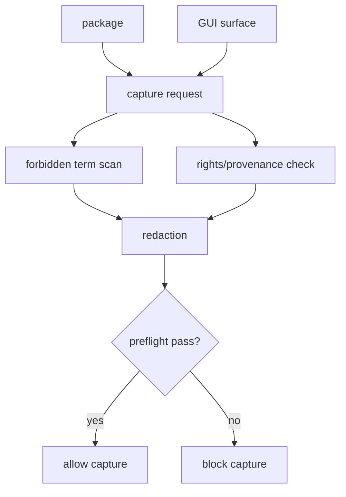
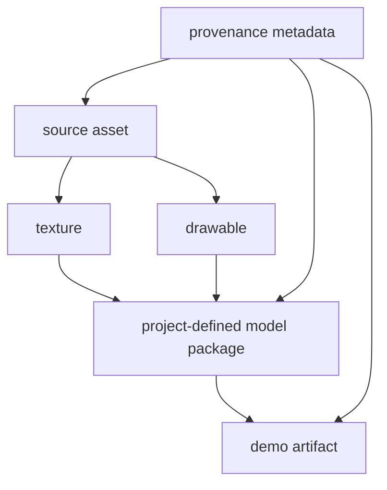
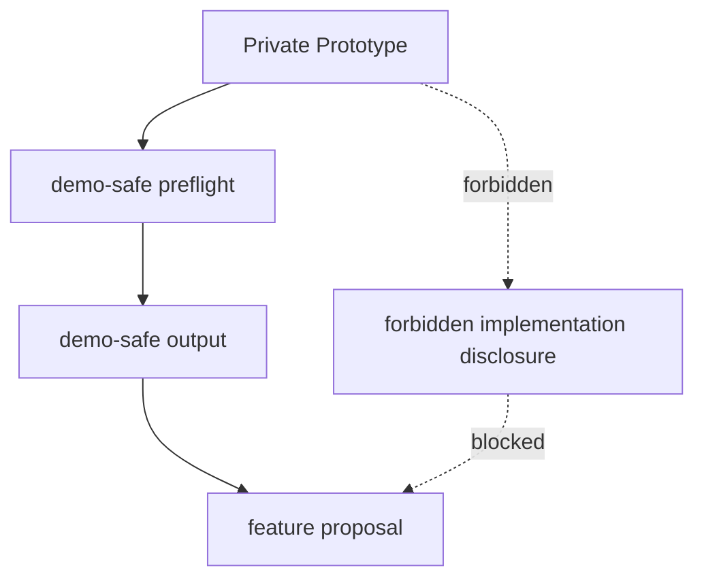

# Demo / Rights / IP Policy

## Status

Accepted

## Purpose

This policy defines demo-safe capture, rights/provenance metadata, forbidden terms, redaction, IP guardrails, and the boundary for Live2D feature proposal material.

It prevents internal schema, local paths, risky terms, third-party asset uncertainty, compatibility claims, and private implementation details from appearing in demo or proposal surfaces. The policy is required before demo capture, fixture publication, or proposal material creation begins.

## Scope

### Applies to

- Streaming Demo Surface.
- Demo-safe screenshots, captures, and videos.
- Fixture and demo assets.
- Rights/provenance reports.
- Redaction and forbidden-term scanning.
- Live2D Feature Proposal material.

### Actors

- Demo implementer.
- GUI implementer.
- Test author.
- Rights/provenance reviewer.
- Proposal author.
- Clean Context Reviewer.

### Does not apply to

- Private research archives except when they feed demo/proposal material.
- Legal final judgment by the AI assistant.
- Cubism-compatible tooling, Cubism format handling, Cubism SDK/Core integration, Cubism Physics compatibility, or existing Cubism model use.

## Source Documents

### Primary

- `discussion/development_convention/basis/00_overview.md`
- `discussion/development_convention/basis/01_common_policy_template.md`
- `discussion/development_convention/basis/03_p1_policy_specs.md`
- `discussion/development_convention/basis/04_required_diagrams_and_tables.md`
- `discussion/_conventions.md`

### Supporting

- `discussion/demo/streaming-demo-policy.md`
- `discussion/proposal/live2d-feature-proposal-template.md`
- `discussion/acceptance-criteria/`
- `discussion/scenarios/`
- `discussion/design/module-contracts/`
- `discussion/tests/`

### Not implementation oracle

- `discussion/reports/**`
- Cubism SDK/Core behavior.
- Cubism Viewer output.
- Cubism Editor UI behavior.
- Cubism file formats.
- Cubism Physics compatibility.
- Existing Cubism models, third-party Live2D models, official sample models, and unverified third-party model packs.

## Required Decisions

### DEC-DEMO-001: Demo-safe surface

#### Question
What may appear in public-facing demo surfaces?

#### Decision
Demo-safe surfaces MAY show self-authored or rights-clean model results, high-level GUI, parameter/dynamics result, validation summary, and AI dry-run summary after preflight. They MUST NOT show local source paths, internal schema dumps, solver implementation detail, Cubism-related format names, Cubism compatibility claims, third-party asset risk detail, hidden debug fields, or private research notes.

#### Rationale
The project is a private prototype, not a Cubism-compatible product or public clean subset.

#### Alternatives considered
Using normal private GUI captures as demo assets was rejected.

#### Impact
Demo capture must run preflight and redaction before allow/block.

### DEC-DEMO-002: Forbidden terms

#### Question
Which terms are blocked or restricted on demo surfaces?

#### Decision
Demo surfaces, generated demo artifacts, public-facing UI text, and proposal packages MUST scan for forbidden or restricted terms including `.moc3`, `.cmo3`, `model3.json`, `physics3.json`, `Cubism SDK`, `Cubism Core`, `Cubism Viewer`, `Cubism Physics`, `Live2D互換`, `Cubism互換`, `Live2D代替`, `Cubism replacement`, `Glue`, `ArtMesh`, and `Deformer`. Handling may differ by private policy document versus demo surface, but demo-safe capture MUST block or redact these terms unless a proposal template explicitly allows a non-implementation reference.

#### Rationale
Forbidden terms can imply compatibility, format support, or reliance on proprietary concepts.

#### Alternatives considered
Warning-only scanning was rejected for demo-safe capture.

#### Impact
Demo-safe preflight must include term scan evidence.

### DEC-DEMO-003: Redaction policy

#### Question
What must be redacted?

#### Decision
Demo-safe capture MUST redact local file paths, usernames and machine paths, sensitive package hashes, third-party asset risk details, raw schema/debug dumps, private research notes, and any field marked non-demo-safe.

#### Rationale
Redaction protects privacy, rights review details, and private implementation boundaries.

#### Alternatives considered
Manual-only redaction was rejected as insufficient for repeatable capture.

#### Impact
Capture tools must produce redaction reports.

### DEC-DEMO-004: Rights/provenance requirement

#### Question
What metadata is required for assets and fixtures?

#### Decision
Every source asset, texture, fixture, package asset, and demo artifact MUST have rights metadata for author, source, license, displayAllowed, redistributionAllowed, AI generated / AI edited flag, third-party source flag, and provenance chain.

#### Rationale
Demo and fixture use must be restricted to rights-clean material.

#### Alternatives considered
Allowing unknown provenance for private demos was rejected because recordings and screenshots can escape private context.

#### Impact
Rights/provenance reports are required before demo-safe capture and fixture/demo use.

### DEC-DEMO-005: Live2D proposal boundary

#### Question
What may be included in Live2D feature proposal material?

#### Decision
Proposal material MAY include problem statements, UX proposal, high-level demo video, before/after workflow, and feature request. It MUST NOT present this project as Cubism-compatible implementation, imply Cubism format support, disclose proprietary-style implementation detail, or show Cubism internal structure reproduction.

#### Rationale
Proposal material must communicate product ideas without implying replacement, compatibility, or format handling.

#### Alternatives considered
Including implementation details as proof was rejected.

#### Impact
Proposal packages require review and may use only demo-safe outputs.

### DEC-DEMO-006: Demo preflight

#### Question
When must demo-safe preflight run and what does it output?

#### Decision
Demo-safe preflight MUST run before any capture, publication action, or proposal package export. It MUST output forbidden term scan, rights check, redaction report, allow/block decision, and evidence references.

#### Rationale
Preflight gives reviewers a concrete gate for demo safety.

#### Alternatives considered
Post-capture review only was rejected.

#### Impact
Demo-safe capture cannot proceed without a passing preflight report.

## Required Diagrams

### Diagram 1: Demo-safe Preflight Flow

#### Mermaid type

flowchart TD

#### Purpose
Shows package, GUI, and capture request passing through scan, rights check, redaction, and allow/block.

#### Must include
- package.
- GUI.
- capture request.
- forbidden term scan.
- rights check.
- redaction.
- allow.
- block.

#### Must not imply
- Normal private surfaces are safe to publish.



### Diagram 2: Asset Provenance Flow

#### Mermaid type

flowchart TD

#### Purpose
Shows how provenance metadata follows assets into packages and demo artifacts.

#### Must include
- source asset.
- texture.
- drawable.
- package.
- demo artifact.
- provenance metadata.

#### Must not imply
- Assets without provenance can be used in fixtures or demos.



### Diagram 3: Proposal Boundary Flow

#### Mermaid type

flowchart TD

#### Purpose
Shows that only demo-safe outputs and feature framing may enter proposal material.

#### Must include
- private prototype.
- demo-safe output.
- feature proposal.
- forbidden implementation disclosure.

#### Must not imply
- Proposal material can disclose implementation or compatibility claims.



## Required Tables

### Table 1: Demo-safe Field Table

This table defines demo visibility for sensitive fields.

| Field | Show in normal mode | Show in demo-safe mode | Reason |
|---|---|---|---|
| selfAuthoredModelResult | yes | yes | demo value |
| highLevelGui | yes | yes after preflight | demo value |
| validationSummary | yes | yes after redaction | useful summary |
| aiDryRunSummary | yes | yes after redaction | useful summary |
| localSourcePath | yes when debugging | no | privacy |
| usernameOrMachinePath | yes when debugging | no | privacy |
| internalSchemaDump | yes in private debug | no | implementation detail |
| solverImplementationDetail | yes in private debug | no | implementation detail |
| thirdPartyAssetRiskDetail | yes to reviewer | no | rights sensitivity |
| rawDebugFields | yes in private debug | no | non-demo-safe |

### Table 2: Forbidden Term Table

This table defines forbidden or restricted terms for demo-safe surfaces.

| Term | Surface | Handling | Blocking? |
|---|---|---|---|
| `.moc3` | demo UI/capture/artifact | block/redact | yes |
| `.cmo3` | demo UI/capture/artifact | block/redact | yes |
| `model3.json` | demo UI/capture/artifact | block/redact | yes |
| `physics3.json` | demo UI/capture/artifact | block/redact | yes |
| `Cubism SDK` | demo UI/capture/artifact | block/redact | yes |
| `Cubism Core` | demo UI/capture/artifact | block/redact | yes |
| `Cubism Viewer` | demo UI/capture/artifact | block/redact | yes |
| `Cubism Physics` | demo UI/capture/artifact | block/redact | yes |
| `Live2D互換` | demo/proposal | block unless explicit non-implementation disclaimer is approved | yes |
| `Cubism互換` | demo/proposal | block | yes |
| `Live2D代替` | demo/proposal | block | yes |
| `Cubism replacement` | demo/proposal | block | yes |
| `Glue` | demo UI/capture/artifact | use project-defined term or redact | yes |
| `ArtMesh` | demo UI/capture/artifact | use `drawable mesh` or redact | yes |
| `Deformer` | demo UI/capture/artifact | use project-defined term or redact | yes |

### Table 3: Rights Metadata Table

This table defines required rights metadata.

| Field | Required? | Meaning |
|---|---|---|
| assetId | yes | machine-readable asset ID with no spaces |
| author | yes | creator or rights owner |
| source | yes | source location or generation process |
| license | yes | license or private self-authored status |
| displayAllowed | yes | may appear in demo/capture |
| redistributionAllowed | yes | may be redistributed or exported |
| aiGenerated | yes | whether generated by AI |
| aiEdited | yes | whether edited by AI |
| thirdPartySource | yes | whether any third-party input exists |
| provenanceChain | yes | source-to-artifact trace |
| reviewer | yes for demo/proposal | person or role that reviewed rights metadata |

### Table 4: Proposal Boundary Table

This table defines what can appear in proposal material.

| Content | Allowed in proposal? | Notes |
|---|---|---|
| problem statement | yes | feature framing only |
| UX proposal | yes | high-level workflow |
| high-level demo video | yes after preflight | demo-safe output only |
| before/after workflow | yes | no proprietary format claim |
| feature request | yes | no compatibility promise |
| Cubism-compatible implementation claim | no | forbidden |
| Cubism format support implication | no | forbidden |
| Cubism internal structure reproduction | no | forbidden |
| solver implementation details | no | private implementation |
| local paths or internal schema | no | private data |

## Rules

### R-DEMO-001: Demo capture must pass preflight

Demo-safe capture MUST pass forbidden-term scan, rights/provenance check, and redaction before capture is allowed.

#### Rationale
Capture can become public or proposal material.

#### Evidence
- demo-safe preflight report.
- forbidden term scan.
- rights/provenance report.
- redaction report.

### R-DEMO-002: Demo assets must be rights-clean

Fixture and demo assets MUST have rights/provenance metadata and MUST NOT use existing Cubism models, official samples, third-party Live2D models, nizima素材, or rights-unknown assets.

#### Rationale
The demo surface must be legally and ethically clean.

#### Evidence
- rights/provenance report.
- asset provenance chain.

### R-DEMO-003: Proposal material must stay high-level

Live2D Feature Proposal material MUST be limited to feature framing, UX proposal, demo-safe outputs, and workflow before/after material.

#### Rationale
Proposal material must not imply compatibility implementation or disclose private internals.

#### Evidence
- proposal package review.
- demo-safe preflight report.

### R-DEMO-004: Forbidden terms must be blocked or redacted on demo-safe surfaces

Demo-safe surfaces MUST block or redact configured forbidden terms unless a specific proposal template exception is approved and documented.

#### Rationale
Terms can create incorrect compatibility and IP signals.

#### Evidence
- forbidden term scan.
- redaction report.

## Forbidden

| Forbidden action | Applies to | Reason | Violation handling |
|---|---|---|---|
| Demo uses rights-unknown or third-party assets without provenance | demo/fixture/proposal | rights risk | blocking |
| Demo uses existing Cubism models, official samples, third-party Live2D models, or nizima素材 | demo/fixture/proposal | rights and oracle risk | blocking |
| Demo-safe capture exposes local paths, internal schema, raw debug dumps, or private research notes | demo surface | private data leak | blocking |
| Demo or proposal implies Cubism compatibility, Live2D replacement, Cubism format support, or Cubism Physics compatibility | demo/proposal | misleading scope | blocking |
| Cubism SDK/Core, Cubism Viewer, Cubism formats, Cubism Physics, or existing Cubism models are used as implementation/test/acceptance oracles | all work | violates project baseline | blocking |
| Machine-readable rights, asset, fixture, or evidence IDs contain spaces | metadata/evidence | violates ID requirement | blocking |

## Required Evidence

| Evidence | Producer | Consumer | Path / Ref | Required for |
|---|---|---|---|---|
| demo-safe preflight report | demo tool | demo reviewer, acceptance runner | `generated/demo/*.demo-safe-preflight.json` | capture allow/block |
| rights/provenance report | rights tool / reviewer | demo reviewer, proposal reviewer | `generated/rights/*.rights-provenance.json` | asset eligibility |
| redaction report | demo tool | demo reviewer | `generated/demo/*.redaction-report.json` | redaction audit |
| forbidden term scan | demo tool | demo reviewer | `generated/demo/*.forbidden-term-scan.json` | term gate |
| asset provenance chain | asset pipeline | rights reviewer | `generated/rights/*.asset-provenance.json` | asset traceability |
| proposal package review | proposal reviewer | human approver | `generated/proposal/*.proposal-review.json` | proposal publication |

## Review Checklist

### Blocking

- [ ] Demo-safe capture has a passing preflight report.
- [ ] Forbidden terms are absent from demo-safe capture or explicitly redacted.
- [ ] Rights/provenance metadata exists for every fixture/demo/proposal asset.
- [ ] Rights-unknown, third-party Live2D, existing Cubism, official sample, and nizima assets are not used.
- [ ] Demo/proposal material does not imply Cubism compatibility, Live2D replacement, Cubism format support, or Cubism Physics compatibility.
- [ ] Local paths and internal schema/debug dumps are not exposed.

### Warning

- [ ] Proposal material uses demo-safe output rather than private implementation screenshots.
- [ ] Third-party source flags are visible to reviewers but not exposed on demo surfaces.

### Suggestion

- [ ] Demo-safe summaries use project-defined terms such as `project-defined model package`, `rig control`, and `drawable mesh`.
- [ ] Proposal package includes concise problem and UX framing.

## Conflict Handling

Implementers and reviewers MUST NOT resolve conflicts by silent invention. Any conflict among demo policy, proposal templates, rights/provenance records, GUI capture behavior, tests, or this policy MUST be recorded before capture, publication, or proposal export proceeds.

```md
# Conflict Resolution Log

## CONFLICT-0001: <Short title>

### Status
Open / Resolved / Superseded

### Found by
Human / Agent name / Reviewer role

### Found in
- `path/to/file-a.md`
- `path/to/file-b.md`

### Conflict
A says ...
B says ...

### Impact
How this affects demo capture, rights review, proposal material, tests, acceptance, or review.

### Decision
Adopted interpretation or required document fix. Leave Open if not decided.

### Rationale
Why this decision is valid.

### Source of truth after resolution
File and section that become authoritative after resolution.

### Changed files
- `path/to/changed-file.md`

### Required follow-up
- [ ] ...

### Reviewer
- ...

### Resolved at
YYYY-MM-DD or commit / patch reference
```

### Current Conflict Resolution Log

#### CONFLICT-DEMO-001: P1 policy output path differs from task write scope

##### Status
Resolved for this task.

##### Found by
Surface/Safety Agent.

##### Found in
- `discussion/development_convention/basis/03_p1_policy_specs.md`
- Current task allowed write scope.

##### Conflict
The basis specs list P1 policy output paths under `discussion/development/`.
The current task allows writing only `discussion/development_convention/demo-rights-ip-policy.md`.

##### Impact
Writing to the basis path would violate the allowed write scope. Writing to the task path preserves the user-specified safety boundary but leaves the broader basis path mismatch unresolved outside this task.

##### Decision
For this task, write only to `discussion/development_convention/demo-rights-ip-policy.md`.

##### Rationale
The explicit task allowed write scope is the operative safety boundary for this agent run.

##### Source of truth after resolution
For this task only: current task allowed write scope.

##### Changed files
- `discussion/development_convention/demo-rights-ip-policy.md`

##### Required follow-up
- [ ] Decide separately whether the basis path references should be updated from `discussion/development/` to `discussion/development_convention/`.

##### Reviewer
- Not yet assigned.

##### Resolved at
2026-05-28.

## Change Process

### When this policy may change

- Demo-safe surface changes.
- Forbidden term list changes.
- Rights/provenance metadata requirements change.
- Proposal boundary changes.
- Accepted AC, scenarios, demo policy, proposal template, or test design change.

### Required review

- Rights/provenance review for asset or metadata changes.
- Development Compliance Review for demo-safe implementation boundary changes.
- Test Adequacy Review for preflight or acceptance changes.
- Clean Context Review for publication or proposal boundary changes.

### Required updates

- Forbidden term table and scanner configuration.
- Rights metadata table and generated evidence schema.
- Demo-safe capture tests.
- Proposal package review criteria.

## Completion Gate

- [ ] Status is set.
- [ ] Purpose is clear.
- [ ] Scope is clear.
- [ ] Source Documents are listed.
- [ ] Required Decisions are complete.
- [ ] Required Diagrams are present.
- [ ] Required Tables are present.
- [ ] Rules use MUST / SHOULD / MAY language.
- [ ] Forbidden actions are explicit.
- [ ] Required Evidence is defined.
- [ ] Review Checklist is present.
- [ ] Conflict Handling is defined.
- [ ] Change Process is defined.
