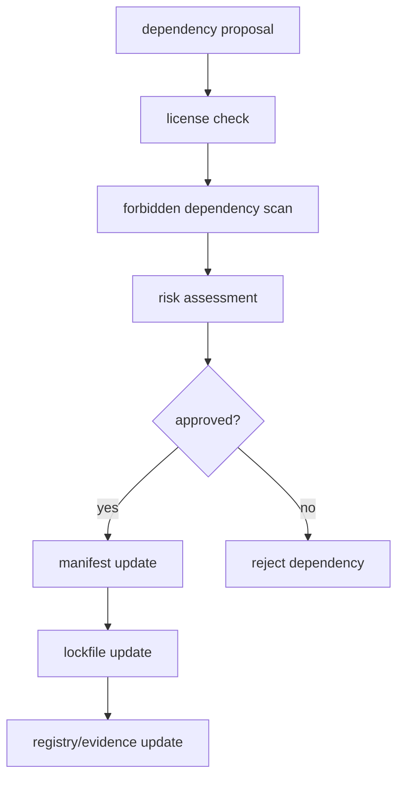
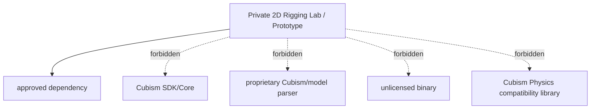

# Dependency Policy

## Status

Accepted

## Purpose

This policy defines how external dependencies are proposed, approved, licensed, recorded, and reviewed for the Private 2D Rigging Lab / Prototype.

It prevents Cubism SDK/Core, proprietary Cubism parsers, unlicensed binaries, incompatible licenses, untracked tool dependencies, and unauthorized dependency additions from entering runtime, editor, viewer, tests, fixtures, or demo tooling. The policy is required before implementation adds dependencies because dependency choices affect legal, runtime, test, and demo safety.

## Scope

### Applies to

- Runtime, editor, viewer, validator, operation, GUI, AI, acceptance, fixture, demo, and development dependencies.
- Package manager lockfiles.
- Binary dependencies.
- PSD and image tooling dependencies.
- Test and fixture generation tools.
- Dependency registry and license review evidence.

### Actors

- Implementer.
- Dependency proposer.
- Dependency reviewer.
- Rights/provenance reviewer.
- Test author.
- Clean Context Reviewer.

### Does not apply to

- Operating system tools already required by the local development environment unless vendored or committed.
- Historical research reports.
- Cubism SDK/Core, Cubism proprietary runtime, Cubism model parsers, Cubism file format libraries, or unlicensed binaries as allowed dependencies.

## Source Documents

### Primary

- `discussion/development_convention/basis/00_overview.md`
- `discussion/development_convention/basis/01_common_policy_template.md`
- `discussion/development_convention/basis/03_p1_policy_specs.md`
- `discussion/development_convention/basis/04_required_diagrams_and_tables.md`
- `discussion/_conventions.md`

### Supporting

- `discussion/acceptance-criteria/`
- `discussion/scenarios/`
- `discussion/design/module-contracts/`
- `discussion/tests/`
- `discussion/demo/streaming-demo-policy.md`
- `discussion/proposal/live2d-feature-proposal-template.md`

### Not implementation oracle

- `discussion/reports/**`
- Cubism SDK/Core behavior.
- Cubism Viewer output.
- Cubism Editor UI behavior.
- Cubism file formats.
- Cubism Physics compatibility.
- Existing Cubism models, third-party Live2D models, and official sample models.

## Required Decisions

### DEC-DEP-001: Dependency approval process

#### Question
How are dependencies added?

#### Decision
Every new dependency MUST have a dependency proposal with dependency name, version or range, purpose, license, scope, runtime/editor/test/dev classification, risk assessment, approval status, and evidence refs before it is committed to manifests or lockfiles.

#### Rationale
Dependencies affect licensing, security, runtime behavior, and demo safety.

#### Alternatives considered
Allowing implementers to add dependencies ad hoc was rejected.

#### Impact
Dependency changes require registry updates and review.

### DEC-DEP-002: Forbidden dependencies

#### Question
Which dependencies are forbidden?

#### Decision
The project MUST NOT depend on Cubism SDK/Core, Cubism proprietary runtime, Cubism model parser, Cubism file format parser, Cubism Physics compatibility library, unlicensed binary, dependency with incompatible license, third-party model pack, or any dependency whose license/provenance cannot be reviewed.

#### Rationale
The baseline forbids Cubism compatibility/oracle use and requires rights-clean demo/test assets.

#### Alternatives considered
Allowing dev-only Cubism tools was rejected because they can become hidden oracles.

#### Impact
Dependency scans must flag these as blocking.

### DEC-DEP-003: License categories

#### Question
How are licenses categorized?

#### Decision
License handling MUST use three categories: allowed, review-required, and forbidden. Allowed licenses may be used after registry entry and approval. Review-required licenses need explicit reviewer approval and documented conditions. Forbidden licenses or unknown licenses MUST NOT be used.

#### Rationale
License policy must be simple enough for agent workflows and strict enough to prevent accidental incompatible use.

#### Alternatives considered
No centralized license categorization was rejected.

#### Impact
License review evidence must classify every dependency.

### DEC-DEP-004: Binary dependency handling

#### Question
How are binary dependencies handled?

#### Decision
Binary dependencies MUST include source, checksum, license, purpose, allowed environment, redistribution rule, approval status, and update process. Unlicensed or provenance-unknown binaries are forbidden.

#### Rationale
Binaries are hard to inspect and can create redistribution or security risk.

#### Alternatives considered
Trusting package manager binaries without registry evidence was rejected for vendored or committed binaries.

#### Impact
Binary dependency table and scan results are required.

### DEC-DEP-005: PSD / image tooling dependency

#### Question
How are PSD parsers and image libraries handled?

#### Decision
PSD and image tooling MAY be used only after dependency approval, license review, provenance review, and scope classification. They MUST NOT parse, import, convert, or inspect Cubism formats. They SHOULD operate on rights-clean PSD/image inputs and project-defined package outputs only.

#### Rationale
Image tooling is useful but must not become a Cubism parser or rights bypass.

#### Alternatives considered
Treating PSD/image tooling as automatically allowed was rejected.

#### Impact
Import pipeline dependencies need explicit registry entries.

### DEC-DEP-006: Dev / test / runtime dependency distinction

#### Question
How are dependency scopes distinguished?

#### Decision
Dependency registry entries MUST classify scope as runtime, editor, viewer, test, fixture, demo, dev, or build. A dependency approved for one scope MUST NOT be used in another scope without review.

#### Rationale
Runtime/editor dependencies carry different risk from dev-only tools.

#### Alternatives considered
Single global dependency approval was rejected.

#### Impact
Reviewers must check import/use sites against approved scope.

### DEC-DEP-007: Dependency provenance evidence

#### Question
Where and how is dependency provenance recorded?

#### Decision
Dependency provenance MUST be recorded as a dependency registry, license review, lockfile diff, dependency scan result, and forbidden dependency scan result. Machine-readable dependency IDs MUST contain no spaces.

#### Rationale
Clean Context Review needs artifacts independent of implementer conversation.

#### Alternatives considered
Relying only on package manager manifests was rejected.

#### Impact
Dependency changes without evidence are blocking.

## Required Diagrams

### Diagram 1: Dependency Approval Flow

#### Mermaid type

flowchart TD

#### Purpose
Shows the required dependency proposal, license check, forbidden scan, approval, lockfile, and registry update flow.

#### Must include
- dependency proposal.
- license check.
- forbidden dependency scan.
- approval.
- lockfile update.
- registry update.

#### Must not imply
- Lockfile updates may occur before approval.



### Diagram 2: Forbidden Dependency Boundary

#### Mermaid type

graph TD

#### Purpose
Shows that allowed dependencies may connect to the project while forbidden Cubism/proprietary/unlicensed dependencies are blocked.

#### Must include
- project.
- allowed dependency.
- forbidden Cubism SDK/Core.
- forbidden proprietary parser.
- forbidden unlicensed binary.

#### Must not imply
- Dev-only forbidden dependencies are acceptable.



## Required Tables

### Table 1: Dependency Registry Table

This table defines the registry shape for dependencies.

| Dependency | Purpose | License | Scope | Status |
|---|---|---|---|---|
| example-approved-parser | rights-clean PSD/image parsing example | allowed-license | dev/test or editor as approved | review-required until approved |
| Cubism SDK/Core | none | proprietary/restricted | none | forbidden |
| Cubism proprietary runtime | none | proprietary/restricted | none | forbidden |
| Cubism model parser | none | proprietary/restricted or compatibility-risk | none | forbidden |
| unlicensed binary | none | unknown | none | forbidden |
| third-party model pack | none | asset/license risk | none | forbidden |

### Table 2: License Policy Table

This table defines license categories.

| License category | Handling | Notes |
|---|---|---|
| allowed | may be used after dependency registry entry and approval | must still match approved scope |
| review-required | requires explicit documented approval and conditions | includes unclear redistribution or copyleft impact |
| forbidden | must not be used | includes unknown, incompatible, proprietary restricted, or unavailable license |

### Table 3: Forbidden Dependency Table

This table defines forbidden dependency types.

| Dependency type | Reason | Handling |
|---|---|---|
| Cubism SDK/Core | forbidden dependency and oracle risk | reject/block |
| Cubism proprietary runtime | compatibility and license risk | reject/block |
| Cubism model parser or file format parser | forbidden format handling | reject/block |
| Cubism Physics compatibility library | forbidden compatibility target | reject/block |
| unlicensed binary | unknown rights/security | reject/block |
| incompatible license dependency | license risk | reject/block |
| license-unknown dependency | cannot review | reject/block |
| third-party model pack | rights and oracle risk | reject/block |
| dependency that embeds existing Cubism models | rights and oracle risk | reject/block |

### Table 4: Binary Dependency Table

This table defines required binary dependency records.

| Binary | Source | Checksum | License | Allowed? |
|---|---|---|---|---|
| approvedBinaryExample | recorded source URL or package | required | approved license | only after approval |
| unlicensedBinary | unknown or missing | missing or untrusted | unknown | no |
| cubismCoreBinary | Cubism SDK/Core distribution | any | proprietary/restricted | no |
| proprietaryModelParserBinary | third-party/proprietary parser | any | proprietary/unknown | no |

## Rules

### R-DEP-001: Dependency additions require approval evidence

Implementers MUST NOT add dependency manifest or lockfile changes without dependency proposal, license review, forbidden scan, approval status, and registry update.

#### Rationale
Dependencies are project-level risk, not local implementation detail.

#### Evidence
- dependency registry.
- license review.
- lockfile diff.
- dependency scan result.

### R-DEP-002: Cubism and proprietary parser dependencies are forbidden

The project MUST NOT depend on Cubism SDK/Core, Cubism proprietary runtime, Cubism model parsers, Cubism file format parsers, or Cubism Physics compatibility libraries in any scope.

#### Rationale
The project is not a Cubism-compatible editor, parser, viewer, runtime, or physics implementation.

#### Evidence
- forbidden dependency scan result.
- dependency registry.
- lockfile diff.

### R-DEP-003: Unknown or incompatible licenses are forbidden

Runtime, editor, viewer, tests, fixtures, demo tools, and build tools MUST NOT use dependencies with unknown, unavailable, or incompatible licenses.

#### Rationale
License uncertainty can block use, demo, redistribution, and future public clean subsets.

#### Evidence
- license review.
- dependency registry.

### R-DEP-004: Scope-specific approval is required

A dependency approved for one scope MUST NOT be used in another scope without updated review.

#### Rationale
Dev-only and runtime/editor dependencies carry different risks.

#### Evidence
- dependency registry.
- import/use-site review.

### R-DEP-005: Binary dependencies require provenance

Binary dependencies MUST include source, checksum, license, purpose, environment, redistribution rule, and approval status.

#### Rationale
Binaries are difficult to inspect and must be traceable.

#### Evidence
- binary dependency table.
- checksum record.
- license review.

## Forbidden

| Forbidden action | Applies to | Reason | Violation handling |
|---|---|---|---|
| Add Cubism SDK/Core in any scope | all dependencies | forbidden project boundary | blocking |
| Add Cubism proprietary runtime, model parser, file format parser, or Physics compatibility library | all dependencies | compatibility/license/oracle risk | blocking |
| Add unlicensed or license-unknown binary | all dependencies | rights/security risk | blocking |
| Add dependency with incompatible license | all dependencies | legal/project risk | blocking |
| Add third-party model pack or embedded existing Cubism model dependency | fixtures/demo/tests | rights and oracle risk | blocking |
| Update lockfile without dependency registry and license review | dependency changes | unreviewed dependency drift | blocking |
| Use dependency outside approved scope | implementation/tests | risk classification bypass | blocking |
| Use machine-readable dependency IDs with spaces | registry/evidence | violates ID requirement | blocking |

## Required Evidence

| Evidence | Producer | Consumer | Path / Ref | Required for |
|---|---|---|---|---|
| dependency registry | dependency proposer | reviewer, Clean Context Reviewer | `generated/dependencies/dependency-registry.json` or accepted registry path | dependency approval |
| license review | dependency reviewer | reviewer | `generated/dependencies/*.license-review.json` | license gate |
| lockfile diff | implementer | reviewer | PR/patch diff | dependency drift review |
| dependency scan result | dependency tool | reviewer | `generated/dependencies/*.dependency-scan.json` | manifest/lockfile verification |
| forbidden dependency scan result | dependency tool | reviewer | `generated/dependencies/*.forbidden-dependency-scan.json` | Cubism/proprietary/binary gate |
| binary checksum record | dependency proposer | reviewer | `generated/dependencies/*.binary-checksum.json` | binary provenance |

## Review Checklist

### Blocking

- [ ] Cubism SDK/Core is not present in manifests, lockfiles, vendored files, binaries, or tooling.
- [ ] Cubism proprietary runtime, model parser, file format parser, and Physics compatibility libraries are not present.
- [ ] Runtime/editor/viewer/test/demo dependencies have known, reviewed licenses.
- [ ] Dependency registry is updated for dependency changes.
- [ ] Forbidden dependency scan passes.
- [ ] Binary dependencies have source, checksum, license, purpose, allowed environment, and redistribution rule.
- [ ] Dependency scope matches actual import/use sites.

### Warning

- [ ] Review-required licenses have explicit conditions and reviewer notes.
- [ ] Dev-only dependencies are not imported by runtime/editor/viewer bundles.

### Suggestion

- [ ] Prefer dependencies with small scope, clear license, active maintenance, and no bundled model assets.
- [ ] Prefer structured parsers/tools with clear provenance over ad hoc binary tools.

## Conflict Handling

Implementers and reviewers MUST NOT resolve conflicts by silent invention. Any conflict among dependency proposal, license review, source documents, implementation needs, tests, rights/provenance, or this policy MUST be recorded before dependency changes proceed.

```md
# Conflict Resolution Log

## CONFLICT-0001: <Short title>

### Status
Open / Resolved / Superseded

### Found by
Human / Agent name / Reviewer role

### Found in
- `path/to/file-a.md`
- `path/to/file-b.md`

### Conflict
A says ...
B says ...

### Impact
How this affects implementation, tests, runtime/editor/demo safety, license handling, or review.

### Decision
Adopted interpretation or required document fix. Leave Open if not decided.

### Rationale
Why this decision is valid.

### Source of truth after resolution
File and section that become authoritative after resolution.

### Changed files
- `path/to/changed-file.md`

### Required follow-up
- [ ] ...

### Reviewer
- ...

### Resolved at
YYYY-MM-DD or commit / patch reference
```

### Current Conflict Resolution Log

#### CONFLICT-DEP-001: P1 policy output path differs from task write scope

##### Status
Resolved for this task.

##### Found by
Surface/Safety Agent.

##### Found in
- `discussion/development_convention/basis/03_p1_policy_specs.md`
- Current task allowed write scope.

##### Conflict
The basis specs list P1 policy output paths under `discussion/development/`.
The current task allows writing only `discussion/development_convention/dependency-policy.md`.

##### Impact
Writing to the basis path would violate the allowed write scope. Writing to the task path preserves the user-specified safety boundary but leaves the broader basis path mismatch unresolved outside this task.

##### Decision
For this task, write only to `discussion/development_convention/dependency-policy.md`.

##### Rationale
The explicit task allowed write scope is the operative safety boundary for this agent run.

##### Source of truth after resolution
For this task only: current task allowed write scope.

##### Changed files
- `discussion/development_convention/dependency-policy.md`

##### Required follow-up
- [ ] Decide separately whether the basis path references should be updated from `discussion/development/` to `discussion/development_convention/`.

##### Reviewer
- Not yet assigned.

##### Resolved at
2026-05-28.

## Change Process

### When this policy may change

- Dependency approval workflow changes.
- License categories change.
- Binary dependency handling changes.
- PSD/image tooling requirements change.
- Accepted AC, scenarios, module contracts, demo policy, or test design change.

### Required review

- Dependency reviewer approval for dependency workflow or license changes.
- Rights/provenance review for asset, model, or demo tooling dependencies.
- Development Compliance Review for dependency scope or forbidden-boundary changes.
- Clean Context Review for any change that affects acceptance, demo safety, or Cubism non-oracle requirements.

### Required updates

- Dependency registry table and evidence schema.
- License policy table.
- Forbidden dependency scan configuration.
- Binary dependency records.
- Related test and CI dependency checks.

## Completion Gate

- [ ] Status is set.
- [ ] Purpose is clear.
- [ ] Scope is clear.
- [ ] Source Documents are listed.
- [ ] Required Decisions are complete.
- [ ] Required Diagrams are present.
- [ ] Required Tables are present.
- [ ] Rules use MUST / SHOULD / MAY language.
- [ ] Forbidden actions are explicit.
- [ ] Required Evidence is defined.
- [ ] Review Checklist is present.
- [ ] Conflict Handling is defined.
- [ ] Change Process is defined.
