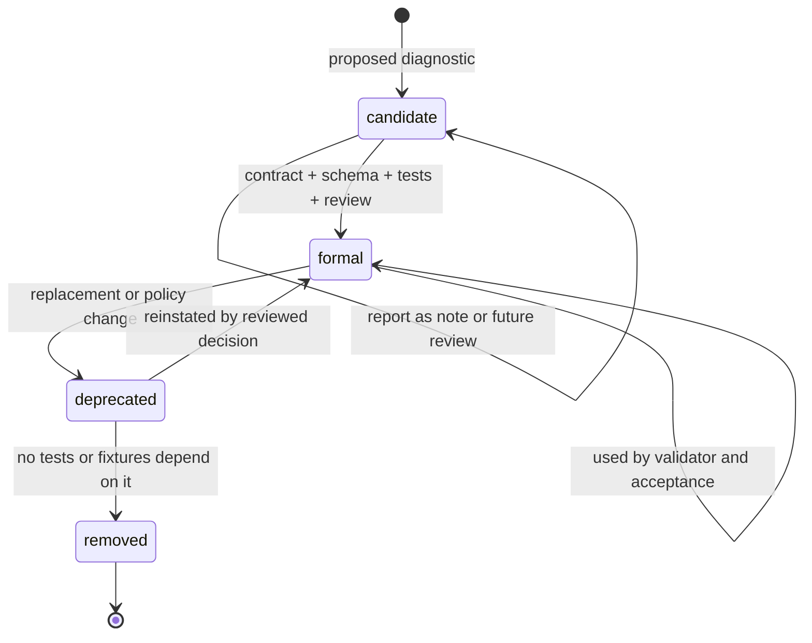

# Diagnostic Policy

## Status

Accepted

## Purpose

This policy defines validator diagnostics, formal and candidate diagnostic classification, severity, profile-specific behavior, diagnostic lifecycle, promotion requirements, and the relationship between diagnostics and MVP blocking acceptance tests.

It prevents MVP blocking tests from relying only on candidate diagnostics, diagnostic IDs from drifting away from schema and validator contracts, severity from being interpreted inconsistently across profiles, and validator diagnostics from becoming hidden implementation-specific behavior.

## Scope

### Applies to

- `discussion/design/module-contracts/validator-contract.md`
- `discussion/tests/runners/validator-profile-design.md`
- `discussion/tests/runners/acceptance-runner-design.md`
- `discussion/tests/traceability/**`
- `discussion/tests/fixtures/**`
- `discussion/tests/expected/**`
- future validator schemas, diagnostic registries, validation reports, repair candidates, and acceptance runner outputs

### Actors

- Validator implementer
- Test author
- Fixture author
- Acceptance runner implementer
- AI repair implementer
- Clean Context Reviewer
- Test Adequacy Reviewer
- Development Compliance Reviewer

### Does not apply to

- External proprietary validator behavior
- Cubism SDK/Core, Cubism Viewer, Cubism Editor, Cubism Physics, or Cubism file format behavior
- Candidate-only future diagnostics used outside MVP blocking gates

## Source Documents

### Primary

- `discussion/development_convention/basis/00_overview.md`
- `discussion/development_convention/basis/01_common_policy_template.md`
- `discussion/development_convention/basis/02_p0_policy_specs.md`
- `discussion/development_convention/basis/04_required_diagrams_and_tables.md`
- `discussion/_conventions.md`
- `discussion/design/module-contracts/validator-contract.md`
- `discussion/design/module-contracts/runtime-core-contract.md`
- `discussion/design/module-contracts/operation-contracts.md`
- `discussion/design/module-contracts/ai-command-contract.md`
- `discussion/tests/runners/validator-profile-design.md`
- `discussion/tests/runners/acceptance-runner-design.md`
- `discussion/tests/strategy/test-taxonomy.md`
- `discussion/tests/strategy/test-strategy.md`
- `discussion/tests/expected/expected-artifacts-policy.md`
- `discussion/tests/traceability/test-traceability-matrix.md`
- `discussion/tests/traceability/test-traceability-matrix.json`

### Supporting

- `discussion/tests/policies/demo-safe-test-policy.md`
- `discussion/tests/policies/rights-provenance-test-design.md`
- `discussion/tests/policies/ai-assistant-test-design.md`
- `discussion/demo/streaming-demo-policy.md`

### Not implementation or test oracles

- `discussion/reports/**`
- Cubism file formats, SDK/Core behavior, Viewer output, Editor UI behavior, or Physics compatibility
- existing Cubism models, official samples, third-party Live2D models, or commercial model behavior

## Required Decisions

### DEC-DIAG-001: Formal vs candidate diagnostics

#### Question

Which diagnostics can be used as acceptance oracles?

#### Decision

Diagnostics are classified as:

```text
formal:
  Present in the validator contract and allowed as an acceptance oracle.

candidate:
  Future or provisional diagnostic. It may be reported for notes or review, but cannot be the only MVP blocking oracle.
```

#### Rationale

MVP blocking results must be tied to stable contract behavior.

#### Alternatives considered

- Let any emitted diagnostic block MVP. Rejected because provisional diagnostics would destabilize acceptance.

#### Impact

MVP blocking Test IDs must reference formal diagnostics, explicit expected artifacts, or both.

### DEC-DIAG-002: Diagnostic ID format

#### Question

How are diagnostic IDs named?

#### Decision

Diagnostic IDs are machine-readable dotted identifiers with no spaces. They use stable semantic namespaces such as `runtime`, `dynamics`, `demo`, `rights`, `evidence`, `ai`, `mesh`, `mask`, `keyform`, `rigControl`, `binary`, `byteAvailability`, `persistentByteStorage`, `portableBundle`, and `transportCapability`.

Examples:

```text
runtime.stateSequenceLengthMismatch
dynamics.outputTargetDuplicate
demo.unsafeForbiddenTerm
rigControl.cycle
```

#### Rationale

Diagnostics must be stable in schemas, fixtures, reports, repair candidates, Test IDs, and acceptance runner joins.

#### Alternatives considered

- Human-readable diagnostic names with spaces. Rejected for machine-readable IDs.

#### Impact

Reports, fixture manifests, expected artifacts, and traceability must reject whitespace in diagnostic IDs.

### DEC-DIAG-003: Severity model

#### Question

What severity levels exist?

#### Decision

Diagnostics use these severity meanings:

| Severity | Meaning |
| --- | --- |
| `info` | Informational note; never blocks by itself. |
| `warning` | Reviewable issue; may produce `needs_review` depending on profile. |
| `error` | Invalid or missing required evidence; may fail strict or acceptance profiles. |
| `fail` | Blocking condition for the active profile. |
| `blocking` | Explicit MVP or gate blocker where the profile maps it to failure. |

#### Rationale

Severity must be distinct from profile behavior because the same condition can warn in interactive usage and fail in acceptance.

#### Alternatives considered

- Use one global severity behavior. Rejected because interactive and acceptance contexts differ.

#### Impact

Validation reports must include both diagnostic severity and profile behavior.

### DEC-DIAG-004: Profile-specific behavior

#### Question

How do profiles interpret diagnostics?

#### Decision

Profiles include at least `interactive`, `strict`, `acceptance`, and `demoSafe` behavior. `demoSafe` is a policy facet for demo/capture strictness; it does not require a separate validator profile ID unless the shared contract changes.

#### Rationale

Editor feedback, strict package checks, acceptance gates, and demo-safe capture have different failure thresholds.

#### Alternatives considered

- Create unrelated diagnostic sets per profile. Rejected because diagnostics must remain traceable.

#### Impact

Every formal diagnostic used by tests must define behavior for each profile used by the runner.

### DEC-DIAG-005: Candidate promotion process

#### Question

How does a candidate diagnostic become formal?

#### Decision

A candidate diagnostic becomes formal only after the validator contract, schema, profile behavior, expected artifacts, traceability, fixture references, and review evidence are updated.

#### Rationale

Promotion changes what can block MVP, so it must be reviewed as a contract change.

#### Alternatives considered

- Promote by first appearance in a validator report. Rejected.

#### Impact

Promotion requires Test Adequacy Review and Development Compliance Review when it affects MVP blocking behavior.

### DEC-DIAG-006: Diagnostic as test oracle

#### Question

When can diagnostics be test oracles?

#### Decision

An MVP blocking test may use diagnostics as an oracle only when the diagnostic is formal and present in the validator contract, or when the test also has an explicit expected artifact oracle that proves the condition independently. Candidate diagnostics alone cannot be MVP blocking oracles.

#### Rationale

Acceptance must remain stable while diagnostics evolve.

#### Alternatives considered

- Let candidate diagnostics block when they look correct. Rejected because that relies on reviewer invention.

#### Impact

Acceptance runner manifest integrity must fail candidate-only MVP blocking diagnostic oracles.

## Required Diagrams

### Diagram 1: Diagnostic Lifecycle



### Diagram 2: Diagnostic Use in Acceptance

```mermaid
flowchart TD
  report[Validator diagnostic] --> class{Registry class}
  class -->|formal| formal[Formal registry entry]
  class -->|candidate| candidate[Candidate diagnostic]
  formal --> test[Test ID]
  candidate --> note[Notes or future review only]
  note --> noBlock[Cannot be sole MVP blocking oracle]
  test --> mvp[MVP blocking test]
  mvp --> artifact{Explicit expected artifact also present?}
  artifact -->|formal diagnostic enough| result[Acceptance result]
  artifact -->|candidate only| fail[Manifest integrity fail]
  noBlock --> fail
```

## Required Tables

### Table 1: Diagnostic Registry Table

| Diagnostic ID | Formal/Candidate | Severity | Profile behavior | Used by tests |
| --- | --- | --- | --- | --- |
| `rights.provenanceMissing` | formal | error | fails `acceptance`; review/fail for rights gates | rights/provenance fixtures and demo-safe acceptance |
| `ref.drawableTextureMissing` | formal | error | fails `strict` and `acceptance` | drawable texture reference tests |
| `mesh.triangleIndexOutOfRange` | formal | error | fails `strict` and `acceptance` | mesh validity tests |
| `mask.sourceMissing` | formal | error | fails `strict` and `acceptance` | mask composition tests |
| `keyform.missingEndpoint` | formal | error | fails `strict` and `acceptance` | keyform endpoint tests |
| `keyform.grid2dMissingKey` | formal | error | fails `strict` and `acceptance` | two-axis keyform grid tests |
| `keyform.grid2dDuplicateKey` | formal | error | fails `strict` and `acceptance` | duplicate keyform tests |
| `rigControl.cycle` | formal | error | fails `strict` and `acceptance` | rig control graph tests |
| `dynamics.driverMissing` | formal | error | fails `strict` and `acceptance` | Minimum Open Dynamics v1 fixtures |
| `dynamics.outputMissing` | formal | error | fails `strict` and `acceptance` | Minimum Open Dynamics v1 fixtures |
| `dynamics.outputTargetDuplicate` | formal | error | fails `strict` and `acceptance` | dynamics output target tests |
| `dynamics.outputParameterOutOfRange` | formal | error | fails `strict` and `acceptance` | dynamics output range tests |
| `dynamics.outputClamped` | formal | warning/error by profile | may warn interactively; fails strict acceptance when expected replay disallows clamp | runtime clamp evidence tests |
| `dynamics.outputUsedAsDriver` | formal | error | fails `strict` and `acceptance` | dynamics dependency tests |
| `dynamics.groupCycle` | formal | error | fails `strict` and `acceptance` | dynamics graph cycle tests |
| `runtime.parameterClamped` | formal | warning/error by profile | may warn interactively; fails strict acceptance when policy disallows clamp | runtime parameter tests |
| `runtime.loadBlocking` | formal | fail | fails viewer, strict, and acceptance | runtime load tests |
| `runtime.stateSequenceLengthMismatch` | formal | fail | fails strict, acceptance, and demo-safe replay evidence | deterministic replay tests |
| `ai.dryRunMutatedPackage` | formal | fail | fails `aiDryRun` and acceptance | AI dry-run safety tests |
| `evidence.guiOperationLogMissing` | formal | fail | fails `acceptance` for GUI-authored MVP candidates | GUI evidence tests |
| `demo.unsafeDependencyClaim` | formal | fail | fails demo-safe and acceptance where capture/proposal surface is tested | demo-safe tests |
| `byteAvailability.currentSessionBytes.missing` | formal | error | fails `strict` and `acceptance` when current-session byte evidence is required | Wave34 byte availability direct-call fixtures and Product Preflight diagnostic refs |
| `persistentByteStorage.record.missing` | formal | error | fails `strict` and `acceptance` only when browser-local persistent storage evidence or an explicit persistent-storage expectation is supplied | persistent byte restore validator/workflow evidence |
| `portableBundle.digestMismatch` | formal | error | fails `strict` and `acceptance` for project-defined JSON bundle v0 import evidence | Wave36 portable bundle roundtrip evidence |
| `transportCapability.futureGated` | formal | blocking | fails when transport capability evidence records a future-gated transport boundary | Wave36/Wave37 transport capability evidence |
| `mesh.uvCountMismatch` | formal | error | fails `strict` and `acceptance` for semantic mesh topology/UV evidence | Wave38 topology/UV evidence |
| `rigControl.warpLatticeRuntimeEvidenceMismatch` | formal | error | fails `strict` and `acceptance` for project-defined `warpLattice2d` runtime evidence mismatch | Wave32 warp lattice evidence |
| `tutorial.unsupportedClaim` | formal | blocking | fails `acceptance` when tutorial readiness evidence contains unsupported claims | Product Preflight unsupported-claim fixtures |
| `dynamics.demoUnsafeInternalName` | formal | warning/error by profile | review or fail for demo-safe depending on fixture | demo-safe dynamics capture tests |
| `rights.displayNotAllowed` | candidate | warning | notes only until promoted | future rights review only |
| `rights.sourceUnknown` | candidate | warning | notes only unless explicit expected artifact blocks | future rights review only |
| `rights.aiUseUnrecorded` | candidate | warning | notes only until promoted | future AI rights review only |
| `evidence.guiSemanticStateMissing` | candidate | warning | notes only; MVP relies on required GUI artifacts or formal operation-log diagnostics | future GUI evidence refinement |
| `evidence.operationSurfaceMismatch` | candidate | warning | notes only until promoted | future GUI evidence refinement |
| `ai.targetAmbiguous` | candidate | warning | notes only; MVP relies on explicit semantic-target artifacts | future AI refinement |
| `ai.approvalRequired` | candidate | warning | notes only; MVP relies on approval-bound repair candidate artifacts | future AI refinement |
| `ai.repairCandidateMissingProvenance` | candidate | warning | notes only; MVP relies on repair candidate provenance artifacts | future AI refinement |
| `demo.internalSchemaVisible` | candidate | warning | notes only; MVP relies on demo preflight artifacts or formal unsafe dependency claims | future demo-safe refinement |

### Table 2: Candidate Promotion Table

| Step | Requirement | Required update |
| --- | --- | --- |
| 1 | State the diagnostic purpose, target, severity, and affected profiles. | diagnostic proposal or policy patch |
| 2 | Add the diagnostic to `validator-contract.md` or record why the contract is changing. | validator contract |
| 3 | Add schema/report fields and machine-readable ID with no spaces. | schema and report contract |
| 4 | Define profile behavior for `interactive`, `strict`, `acceptance`, and demo-safe facets. | validator profile design |
| 5 | Add or update fixtures and expected artifacts. | fixture manifest and expected artifacts |
| 6 | Connect the diagnostic to Test IDs and AC/scenario traceability. | traceability matrix |
| 7 | Run Test Adequacy Review. | review evidence |
| 8 | Run Development Compliance Review. | review evidence |
| 9 | Mark the diagnostic `formal`. | diagnostic registry |

### Table 3: Profile Severity Matrix

| Diagnostic | interactive | strict | acceptance | demoSafe |
| --- | --- | --- | --- | --- |
| `rights.provenanceMissing` | warning or error | error | fail | fail |
| `runtime.stateSequenceLengthMismatch` | warning for preview | fail | fail | fail when replay/capture deterministic state is required |
| `ai.dryRunMutatedPackage` | fail for AI surface | fail for AI checks | fail | fail when AI evidence touches demo output |
| `evidence.guiOperationLogMissing` | warning | error when GUI evidence required | fail for GUI-authored MVP candidates | fail when GUI capture claim requires authoring evidence |
| `demo.unsafeDependencyClaim` | warning | error for proposal/capture checks | fail where demo/proposal surface is tested | fail |
| `dynamics.demoUnsafeInternalName` | info or warning | warning | needs_review or fail by fixture | warning/fail by fixture |
| candidate diagnostics | note only | note only unless explicit expected artifact blocks | cannot be sole MVP blocker | cannot be sole MVP blocker |

### Table 4: Wave43 Namespace and Evidence Vocabulary Sync

This table records namespace-level policy for current Wave31-Wave42 diagnostic/evidence surfaces without replacing `packages/validator-core/src/check-catalog.ts` or `validator-contract.md`.

| Surface | Classification | Current IDs / vocabulary | Evidence and boundary |
| --- | --- | --- | --- |
| Byte availability | formal catalog-backed validator diagnostics | `byteAvailability.*`; representative IDs include `byteAvailability.currentSessionBytes.missing`, `byteAvailability.requiresReupload`, and `byteAvailability.verifiedSummary.stale` | Product Preflight artifact kind `byteAvailability`, category `assetBytes`; proves selected/package-local byte evidence, length, digest, and declared metadata only. |
| Persistent byte storage | formal catalog-backed validator diagnostics when persistent evidence or an explicit expectation is supplied | `persistentByteStorage.*`; representative IDs include `persistentByteStorage.backend.unavailable`, `persistentByteStorage.record.missing`, `persistentByteStorage.verification.missing`, and mismatch/unsupported variants | Browser-local, same-origin persistent byte evidence with verified reread/fallback only. `persistentByteStorage` is Product Preflight artifact vocabulary, but current builder requirements must not be rewritten here. |
| Portable bundle | formal catalog-backed validator diagnostics | `portableBundle.*`; representative IDs include `portableBundle.schemaInvalid`, `portableBundle.missingRequiredBinary`, `portableBundle.digestMismatch`, and `portableBundle.availabilityMismatch` | Project-defined JSON portable bundle v0 only; no ZIP/archive, File System Access API, parser, or image decode claim. |
| Transport capability | formal catalog-backed validator diagnostics | `transportCapability.evidenceMissing`, `transportCapability.schemaInvalid`, `transportCapability.unsupported`, `transportCapability.futureGated`, `transportCapability.dependencyGated` | Capability IDs/status/gates/issues describe supported, unsupported, future-gated, or dependency-gated transport boundaries without making those boundaries available. |
| Topology/UV | formal catalog-backed validator diagnostics | representative `mesh.*` IDs include `mesh.uvCountMismatch`, `mesh.uvCoordinateOutOfBounds`, `mesh.runtimeEvidenceMissing`, and `mesh.runtimeEvidenceMismatch` | Semantic topology/UV evidence only; no texture sampling, full renderer, or pixel oracle claim. |
| Warp lattice | formal catalog-backed validator diagnostics | `rigControl.warpLattice*` | Project-defined `warpLattice2d`, `controlPointOffsets`, and semantic bilinear runtime evidence only; no Cubism deformer or Physics compatibility claim. |
| Product Preflight | report vocabulary over targeted diagnostics/evidence refs, not a separate `productPreflight.*` check family | categories include `modelStructure`, `authoringWorkflowEvidence`, `runtimeViewerEvidence`, `meshTopologyUv`, `composition`, `rigControlDynamics`, `assetBytes`, `persistenceTransport`, `tutorialDemoReadiness`, and `unsupportedClaims`; statuses are `pass`, `warn`, `fail`, `not_supported`, and `not_evaluated` | Session-generated read-only report/diff/read/rerun surface. It is not a persisted/exported package artifact, release gate, demo gate, repair system, parser, archive/filesystem validator, renderer oracle, pixel oracle, or Cubism compatibility proof. |
| Codex proposal | proposal-local validation/preview/rerun issue and check vocabulary; not catalog-backed formal validator diagnostics in the current `check-catalog.ts` | issue codes include `schemaInvalid`, `operationCatalogMismatch`, `operationCatalogMissing`, `unsupportedOperation`, and `unsupportedBoundary`; local check IDs include `codexProposal.preview.*` and `codexProposal.rerunValidation.*` | Deterministic proposal intake, operation catalog, validation, dry-run diff preview, rerun validation, approval lifecycle, transcript/evidence recording, and Editor review workflow only. It does not add repo-side proposal generation, repair candidate generation/ranking, LLM/provider, natural-language repair, auto-fix, automatic commit, external transport, parser/decode, archive/filesystem, renderer/pixel oracle, or Cubism compatibility. |

## Rules

1. Formal diagnostics are contract-backed and may be used by MVP blocking tests.
2. Candidate diagnostics are provisional and cannot be the sole MVP blocking oracle.
3. A diagnostic ID is a machine-readable ID and must contain no spaces.
4. A validation report used by acceptance must include diagnostic ID, severity, status/profile behavior, target refs, evidence refs, source phase, and repair candidate refs when applicable.
5. The same diagnostic ID must mean the same semantic condition across validator, fixtures, expected artifacts, AI repair candidates, and acceptance runner results.
6. Profile behavior must be explicit; severity alone does not determine acceptance result.
7. Missing evidence must be represented as diagnostics or explicit missing-evidence entries, not silently ignored.
8. Diagnostics must be deterministic for the same package, profile, runtime context, input sequence, fixture manifest, and expected artifact set.
9. Demo-safe behavior is a facet of validation and acceptance unless a future accepted contract creates a separate profile.
10. Diagnostic promotion, deprecation, and removal must be reviewed when MVP blocking behavior changes.
11. Product Preflight category/status/report vocabulary must reference targeted diagnostics and evidence refs; it must not create an implied `productPreflight.*` formal diagnostic family.
12. `codexProposal.*` preview/rerun check IDs and Codex proposal issue codes remain proposal-local or result-local vocabulary unless a future validator contract/catalog change explicitly promotes them to catalog-backed formal validator diagnostics.

## Forbidden

- Using candidate diagnostics alone as MVP blocking acceptance oracles.
- Adding diagnostic IDs with spaces or unstable prose names.
- Treating Cubism SDK/Core, Cubism Viewer, Cubism Physics, Cubism Editor, Cubism file formats, or existing Cubism models as diagnostic oracles.
- Inferring validator diagnostics from external proprietary behavior.
- Changing profile severity behavior without updating fixtures, expected artifacts, traceability, and review evidence.
- Hiding missing evidence by omitting diagnostics or missing-evidence records.
- Resolving disagreement between validator contract and tests by implementation invention.

## Required Evidence

- validation report
- diagnostic registry or equivalent registry table
- formal/candidate classification
- profile severity behavior
- acceptance runner result for diagnostics used by acceptance
- fixture and Test ID traceability for diagnostics used by tests
- validator contract update record for new or promoted formal diagnostics
- expected artifact update when diagnostics are used as oracles
- Test Adequacy Review for MVP blocking diagnostic use
- Development Compliance Review for diagnostic contract changes

## Review Checklist

### Blocking

- [ ] MVP blocking tests do not rely only on candidate diagnostics.
- [ ] Every formal diagnostic used by acceptance exists in the validator contract.
- [ ] Diagnostic IDs follow the no-space machine-readable naming rule.
- [ ] Profile behavior is defined for every formal diagnostic used by tests.
- [ ] Acceptance runner behavior distinguishes `pass`, `fail`, and `needs_review`.
- [ ] Missing evidence is surfaced as a diagnostic or explicit missing-evidence entry.
- [ ] No Cubism-related or external model oracle is used.
- [ ] Promotion or deprecation includes required contract, fixture, traceability, expected artifact, and review updates.

## Conflict Handling

Conflicts must be logged instead of resolved by invention. Use the Conflict Resolution Log format whenever:

- a test references a diagnostic not present in the validator contract;
- a fixture marks a candidate diagnostic as the sole MVP blocking oracle;
- profile behavior differs between validator profile design and expected artifacts;
- a diagnostic ID differs between schema, report, fixture, expected artifact, and traceability;
- a demo-safe or rights diagnostic conflicts with demo policy or rights/provenance test design.

```md
# Conflict Resolution Log

## CONFLICT-0001

### Found in
- `path/to/file-a.md`
- `path/to/file-b.md`

### Conflict
A says ...
B says ...

### Impact
Implementation / test / acceptance impact.

### Decision
Adopted interpretation or required correction. If unresolved, write `Unresolved`.

### Source of truth after resolution
File that becomes authoritative after correction.

### Changed files
- ...

### Reviewer
- ...
```

Known conflict to resolve before implementation gate:

```md
## CONFLICT-DIAG-0001

### Found in
- `discussion/development_convention/basis/00_overview.md`
- `discussion/development_convention/basis/01_common_policy_template.md`
- task allowed write scope

### Conflict
The basis examples name output paths under `discussion/development/`, while this task allows and requests files under `discussion/development_convention/`.

### Impact
Future agents may look in the wrong directory for the accepted policy set.

### Decision
Unresolved. This task writes only to the user-approved `discussion/development_convention/` paths.

### Source of truth after resolution
To be decided by the policy owner.

### Changed files
- `discussion/development_convention/diagnostic-policy.md`

### Reviewer
- pending
```

## Change Process

1. Propose the diagnostic change with ID, classification, severity, profile behavior, target refs, evidence refs, and affected tests.
2. Check machine-readable ID naming and no-space constraints.
3. Update validator contract before using a diagnostic as formal.
4. Update fixtures, expected artifacts, traceability, and acceptance runner expectations.
5. Run Test Adequacy Review when the diagnostic affects test or acceptance adequacy.
6. Run Development Compliance Review when the diagnostic affects policy, module boundary, or MVP blocking behavior.
7. Record conflicts if any source documents disagree.

## Completion Gate

- [ ] All required common template sections are present.
- [ ] Diagnostic Lifecycle diagram is present.
- [ ] Diagnostic Use in Acceptance diagram is present.
- [ ] Diagnostic Registry Table is present.
- [ ] Candidate Promotion Table is present.
- [ ] Profile Severity Matrix is present.
- [ ] Formal and candidate diagnostics are separated.
- [ ] Diagnostic ID format forbids spaces.
- [ ] Candidate diagnostics alone are forbidden as MVP blocking oracles.
- [ ] Diagnostic lifecycle covers candidate, formal, deprecated, and removed.
- [ ] Profile-specific behavior is defined for interactive, strict, acceptance, and demoSafe contexts.
- [ ] Cubism formats, Cubism SDK/Core, Cubism Viewer consistency, Cubism Physics compatibility, and existing Cubism models are forbidden as diagnostic oracles.
