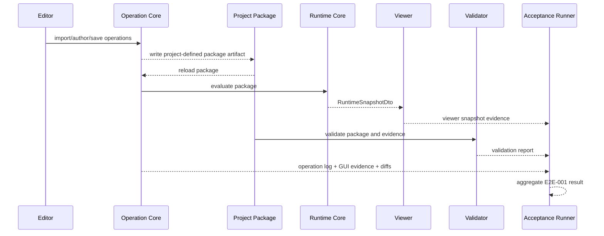
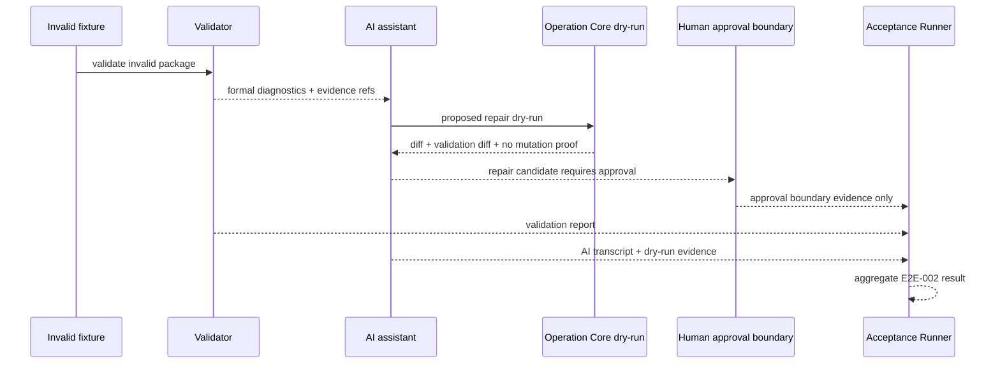
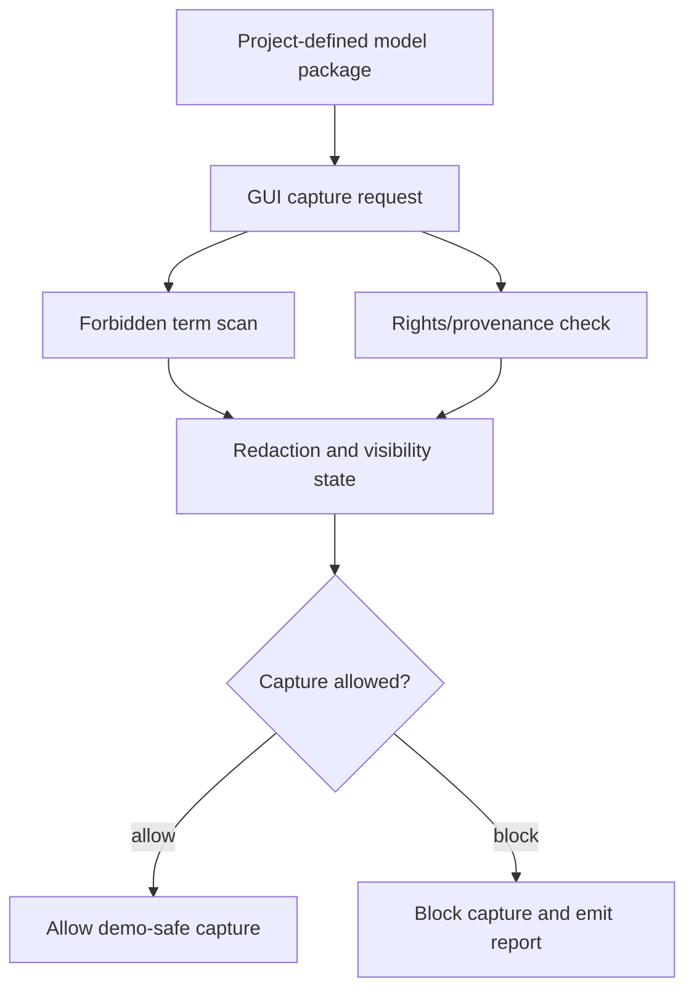
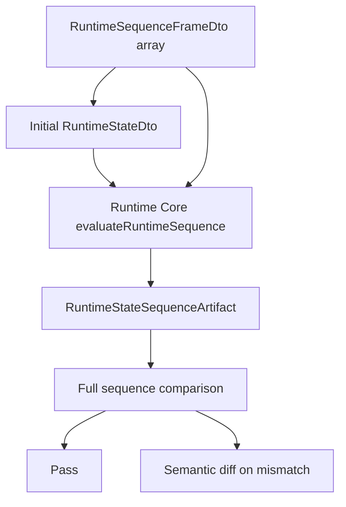

# E2E Test Policy

## Status

Accepted

## Purpose

This policy defines what counts as E2E testing for the Private 2D Rigging Lab / Prototype, which E2E journeys are required, how GUI and headless E2E differ, which fixtures and expected artifacts are required, how pass/fail/needs_review works, and how visual review, demo-safe preflight, rights/provenance, and AI assistant boundaries are handled.

It prevents E2E from becoming an ambiguous screenshot-only practice, GUI E2E from being confused with headless operation E2E, E2E results from bypassing the acceptance runner, demo-safe and rights/provenance checks from being omitted, and AI-assisted repair tests from crossing the human approval boundary.

## Scope

### Applies to

- `discussion/tests/**`
- `discussion/acceptance-criteria/**`
- `discussion/scenarios/**`
- `discussion/design/module-contracts/**`
- `discussion/development_convention/testing-and-acceptance-policy.md`
- `discussion/development_convention/diagnostic-policy.md`
- future E2E fixtures, expected artifacts, acceptance runner results, GUI evidence, AI transcripts, demo-safe reports, and rights/provenance reports

### Actors

- E2E test author
- Acceptance runner implementer
- GUI implementer
- Operation Core implementer
- Runtime Core implementer
- Validator implementer
- AI assistant implementer
- Demo-safe and rights/provenance reviewer
- Clean Context Reviewer

### Does not apply to

- Unit, contract, or isolated module tests that do not cross module boundaries
- External compatibility testing against Cubism formats, Cubism SDK/Core, Cubism Viewer, Cubism Physics, VTube Studio, or existing Cubism models
- Post-MVP public distribution, SDK, external integration, or streaming app compatibility

## Source Documents

### Primary

- `discussion/development_convention/basis/00_overview.md`
- `discussion/development_convention/basis/01_common_policy_template.md`
- `discussion/development_convention/basis/03_p1_policy_specs.md`
- `discussion/development_convention/basis/04_required_diagrams_and_tables.md`
- `discussion/_conventions.md`
- `discussion/development_convention/testing-and-acceptance-policy.md`
- `discussion/development_convention/diagnostic-policy.md`
- `discussion/acceptance-criteria/03_MVP_Acceptance_Criteria.md`
- `discussion/scenarios/03_MVP_Acceptance_Criteria.md`
- `discussion/design/module-contracts/runtime-core-contract.md`
- `discussion/design/module-contracts/operation-contracts.md`
- `discussion/design/module-contracts/gui-operation-contract.md`
- `discussion/design/module-contracts/validator-contract.md`
- `discussion/design/module-contracts/ai-command-contract.md`
- `discussion/tests/strategy/test-strategy.md`
- `discussion/tests/strategy/test-taxonomy.md`
- `discussion/tests/strategy/epsilon-determinism-policy.md`
- `discussion/tests/expected/expected-artifacts-policy.md`
- `discussion/tests/fixtures/fixture-manifest.md`
- `discussion/tests/traceability/test-traceability-matrix.md`
- `discussion/tests/runners/acceptance-runner-design.md`
- `discussion/tests/policies/gui-evidence-schema.md`
- `discussion/tests/policies/ai-assistant-test-design.md`
- `discussion/tests/policies/demo-safe-test-policy.md`
- `discussion/tests/policies/rights-provenance-test-design.md`

### Supporting

- `discussion/demo/streaming-demo-policy.md`
- `discussion/proposal/live2d-feature-proposal-template.md`

### Not implementation or test oracles

- `discussion/reports/**`
- Cubism file formats, Cubism SDK/Core behavior, Cubism Viewer output, Cubism Editor UI behavior, Cubism Physics compatibility, or VTube Studio compatibility
- existing Cubism models, official Cubism samples, third-party Live2D models, nizima assets, or commercial visual quality
- screenshots without structured operation, runtime, validation, GUI, demo-safe, and rights/provenance evidence

## Required Decisions

### DEC-E2E-001: Definition of E2E

#### Question

What is an E2E test in this project?

#### Decision

An E2E test crosses multiple modules and proves that a user or agent goal is achieved through fixture input, operation flow, project-defined package behavior, runtime evaluation, validator behavior, generated evidence, and acceptance result aggregation.

#### Rationale

The MVP is a workflow, not a single module. E2E tests must prove the workflow while still using structured evidence.

#### Alternatives considered

- Define E2E as any browser screenshot test. Rejected because screenshots are supplemental evidence.
- Define E2E as only GUI automation. Rejected because headless operation and deterministic replay E2E are required.

#### Impact

Every E2E must connect to a fixture, Test ID or acceptance runner entry, structured evidence, and review rule.

### DEC-E2E-002: GUI E2E vs headless E2E

#### Question

How are GUI, headless, runtime/validator, and AI E2E separated?

#### Decision

E2E categories are:

| Category | Definition |
| --- | --- |
| `guiE2E` | Drives the private GUI and must produce operation logs plus semantic GUI evidence. |
| `headlessOperationE2E` | Calls Operation Core directly without GUI and must not claim GUI authoring evidence. |
| `runtimeValidatorE2E` | Exercises Runtime Core and Validator over package/evidence artifacts, including deterministic replay. |
| `aiAssistedE2E` | Includes AI assistant inspection or repair suggestion, but only through dry-run and human approval boundary evidence. |
| `demoSafeE2E` | Exercises demo-safe preflight, forbidden term scan, redaction, rights/provenance, and capture allow/block logic. |

#### Rationale

Each category has different evidence and failure modes.

#### Alternatives considered

- Treat all E2E as GUI E2E. Rejected because deterministic replay and AI dry-run can be tested headlessly.

#### Impact

Headless E2E cannot substitute for GUI evidence when the AC requires GUI authoring.

### DEC-E2E-003: Required E2E journeys

#### Question

Which E2E journeys are required?

#### Decision

The required baseline E2E journeys are:

```text
E2E-001:
  PSD import -> authoring -> save -> reload -> Viewer snapshot -> Validator pass

E2E-002:
  invalid package -> Validator diagnostics -> AI dry-run repair suggestion -> human approval boundary

E2E-003:
  demo-safe capture -> forbidden term scan -> rights/provenance check -> capture allowed

E2E-004:
  deterministic replay -> RuntimeSequenceFrameDto[] -> RuntimeStateSequenceArtifact -> full sequence comparison
```

#### Rationale

These journeys cover authoring, validation/AI repair, demo-safe output, and Minimum Open Dynamics v1 determinism.

#### Alternatives considered

- Defer E2E until after MVP. Rejected because MVP acceptance requires cross-module evidence.

#### Impact

The acceptance runner must be able to execute or aggregate these journeys.

### DEC-E2E-004: E2E evidence

#### Question

What evidence must E2E produce?

#### Decision

Required evidence depends on category, but the E2E evidence set includes operation logs, package artifacts, runtime snapshots, RuntimeState artifacts, RuntimeState sequence artifacts, validation reports, model/runtime/validation diffs, GUI evidence, AI dry-run evidence, demo-safe preflight, rights/provenance report, acceptance runner result, and optional screenshots.

#### Rationale

E2E must be reviewable from artifacts without relying on private conversation context.

#### Alternatives considered

- Store only video/screenshot output. Rejected because visual artifacts do not prove semantic correctness.

#### Impact

E2E tests must write evidence in paths and shapes consumable by the acceptance runner.

### DEC-E2E-005: Visual review

#### Question

Does E2E include visual review?

#### Decision

Visual review is allowed as manual or hybrid review, but screenshots/captures are supplemental. The primary oracle is structured evidence. Visual review yields `needs_review` by default unless the fixture explicitly marks it blocking.

#### Rationale

Human visual inspection is useful for review but subjective as a default MVP blocker.

#### Alternatives considered

- Make all visual review blocking. Rejected because it would make MVP acceptance subjective too early.
- Remove visual review entirely. Rejected because GUI and viewer outputs need bounded inspection.

#### Impact

E2E review tables must mark whether visual review is required and whether it is blocking.

### DEC-E2E-006: E2E pass/fail

#### Question

What are E2E result statuses?

#### Decision

E2E results use `pass`, `fail`, or `needs_review`.

| Status | Meaning |
| --- | --- |
| `pass` | Required structured evidence exists, comparisons pass, no blocking diagnostics remain, and no required manual review remains. |
| `fail` | Required evidence is missing, a blocking gate fails, acceptance validation fails, AI dry-run mutates package, demo-safe or rights gate fails, or forbidden oracle/dependency appears. |
| `needs_review` | Structured evidence exists but manual visual review, warning escalation, rights ambiguity, demo-safe wording review, or candidate diagnostic review remains open. |

#### Rationale

The acceptance runner already uses this status model.

#### Alternatives considered

- Use boolean pass/fail only. Rejected because reviewable evidence must be separated from hard failure.

#### Impact

E2E output must be compatible with acceptance runner aggregation.

### DEC-E2E-007: E2E relation to acceptance runner

#### Question

How does the acceptance runner execute and aggregate E2E?

#### Decision

The acceptance runner either runs E2E directly or ingests E2E evidence manifests. It must join E2E IDs to Test IDs, fixtures, expected artifacts, diagnostics, evidence refs, review results, and AC/scenario results.

#### Rationale

E2E must contribute to MVP acceptance instead of living as isolated scripts.

#### Alternatives considered

- Keep E2E outside acceptance. Rejected.

#### Impact

E2E manifests must be machine-readable and must not contain spaces in IDs.

## Required Diagrams

### Diagram 1: Authoring-to-Viewer E2E



### Diagram 2: AI Repair E2E



### Diagram 3: Demo-safe E2E



### Diagram 4: Deterministic Replay E2E



## Required Tables

### Table 1: E2E Journey Table

| E2E ID | Journey | Modules | Fixture | Blocking? |
| --- | --- | --- | --- | --- |
| `E2E-001` | PSD import -> authoring -> save -> reload -> Viewer snapshot -> Validator pass | GUI, Operation Core, package format, Runtime Core, Viewer, Validator, Acceptance Runner | rights-clean layered PSD authoring fixture | yes when mapped to MVP authoring AC |
| `E2E-002` | invalid package -> Validator diagnostics -> AI dry-run repair suggestion -> human approval boundary | Validator, AI assistant, Operation Core dry-run, Acceptance Runner | invalid package fixture with formal diagnostic or explicit expected artifact | yes only with formal diagnostic or expected artifact oracle |
| `E2E-003` | demo-safe capture -> forbidden term scan -> rights/provenance check -> capture allowed | GUI, demo-safe preflight, rights/provenance, Acceptance Runner | rights-clean demo capture fixture | yes for demo-safe MVP claims |
| `E2E-004` | deterministic replay -> RuntimeSequenceFrameDto[] -> RuntimeStateSequenceArtifact -> full sequence comparison | Runtime Core, Validator, Acceptance Runner | Minimum Open Dynamics v1 replay fixture | yes for MVP Dynamics determinism |

### Table 2: E2E Evidence Matrix

| E2E ID | Required evidence | Optional evidence |
| --- | --- | --- |
| `E2E-001` | operation log, semantic GUI evidence, package artifact, reload result, runtime snapshot, validation report, acceptance runner result | screenshot, viewer capture, visual review |
| `E2E-002` | invalid fixture, validation report, formal diagnostic or explicit expected artifact, AI transcript, dry-run result, diff, repair candidate, approval boundary evidence, acceptance runner result | candidate diagnostic notes |
| `E2E-003` | demo-safe preflight report, forbidden term scan result, rights/provenance report, redaction/visibility state, acceptance runner result | redacted screenshot or video |
| `E2E-004` | initial RuntimeStateDto, RuntimeSequenceFrameDto[], inputFramesHash, runtimeEvaluationContext, evaluatorVersionSummary, RuntimeStateSequenceArtifact, semantic diff on mismatch, acceptance runner result | runtime snapshot summary hash |

### Table 3: E2E Oracle Table

| E2E ID | Primary oracle | Secondary evidence |
| --- | --- | --- |
| `E2E-001` | operation log, semantic GUI evidence, package reload semantics, RuntimeSnapshotDto, validation report | screenshot or visual review checklist |
| `E2E-002` | formal diagnostic or explicit expected artifact, dry-run diff, no-mutation proof, approval boundary evidence | candidate diagnostics as notes |
| `E2E-003` | demo-safe preflight report and rights/provenance report | redacted capture |
| `E2E-004` | full RuntimeState sequence comparison | runtime snapshot, sequence hash, final state |

### Table 4: E2E Review Table

| E2E ID | Requires visual review? | Requires clean context review? |
| --- | --- | --- |
| `E2E-001` | yes when fixture marks visual review required; screenshot is supplemental | yes for MVP blocking authoring claims |
| `E2E-002` | no by default | yes for MVP blocking AI repair or diagnostic claims |
| `E2E-003` | yes for capture surface wording/visibility review when required | yes for demo-safe or rights/provenance claims |
| `E2E-004` | no by default | yes for MVP Dynamics deterministic replay claims |

## Rules

1. E2E must cross multiple modules and must connect to AC/scenario evidence through Test IDs or acceptance runner mapping.
2. E2E IDs are machine-readable IDs and must contain no spaces.
3. GUI E2E must produce operation logs and semantic GUI evidence; screenshots alone are insufficient.
4. Headless operation E2E may prove operation/runtime/validator behavior but cannot claim GUI authoring evidence.
5. Runtime/validator E2E for deterministic replay must compare the full RuntimeState sequence.
6. AI-assisted E2E must use dry-run behavior and must preserve a human approval boundary. AI must not directly mutate the package as part of E2E repair.
7. Demo-safe E2E must include forbidden term scan, rights/provenance check, redaction/visibility state, and allow/block result.
8. Visual review is supplemental and reviewable; it is not the primary oracle.
9. Candidate diagnostics may be included as notes but cannot be the only MVP blocking oracle.
10. Acceptance runner aggregation is required for MVP E2E claims.

## Forbidden

- Calling a single-module unit or contract test E2E.
- Treating screenshots, videos, or visual impressions as primary E2E oracles.
- Substituting headless E2E for GUI evidence where GUI authoring is required.
- Allowing AI repair E2E to commit changes without human approval boundary evidence.
- Using candidate diagnostics alone for MVP blocking E2E.
- Using Cubism formats, Cubism SDK/Core, Cubism Viewer consistency, Cubism Physics compatibility, VTube Studio compatibility, or existing Cubism models as E2E oracles.
- Claiming demo-safe capture without forbidden term scan, rights/provenance, redaction/visibility state, and preflight result.
- Resolving missing journey, fixture, or oracle details by test author invention.

## Required Evidence

- operation log
- package artifact
- runtime snapshot
- runtime state artifact where required
- runtime state sequence artifact for deterministic replay
- validation report
- model, runtime, or validation diff where applicable
- GUI evidence for GUI E2E
- AI dry-run transcript, repair candidate, diff, and approval boundary evidence for AI E2E
- demo-safe preflight report for demo-safe E2E
- rights/provenance report for asset or capture E2E
- acceptance runner result
- optional screenshot or capture as supplemental evidence
- Test Adequacy Review and Development Compliance Review for MVP blocking E2E claims

## Review Checklist

### Blocking

- [ ] E2E crosses multiple modules.
- [ ] E2E connects to the acceptance runner or Test ID traceability.
- [ ] E2E uses structured evidence as the primary oracle.
- [ ] GUI E2E includes operation logs and semantic GUI evidence.
- [ ] Headless E2E does not claim GUI authoring evidence.
- [ ] AI E2E proves dry-run and human approval boundary.
- [ ] Demo-safe E2E includes rights/provenance and forbidden term scan.
- [ ] Exact replay E2E compares the full RuntimeState sequence.
- [ ] Candidate diagnostics are not the sole MVP blocking oracle.
- [ ] No Cubism-related or external model oracle is used.
- [ ] Machine-readable IDs contain no spaces.

## Conflict Handling

Conflicts must be recorded rather than resolved by invention. Use the Conflict Resolution Log format when:

- an E2E journey lacks a fixture, Test ID, or acceptance runner mapping;
- GUI and headless E2E evidence are confused;
- a screenshot is treated as the primary oracle;
- demo-safe or rights/provenance evidence disagrees with demo or rights policy;
- AI E2E attempts to cross the human approval boundary;
- E2E references candidate diagnostics as the only MVP blocking oracle;
- a required E2E path conflicts with AC, scenario, module contract, or test design.

```md
# Conflict Resolution Log

## CONFLICT-0001

### Found in
- `path/to/file-a.md`
- `path/to/file-b.md`

### Conflict
A says ...
B says ...

### Impact
Implementation / test / acceptance impact.

### Decision
Adopted interpretation or required correction. If unresolved, write `Unresolved`.

### Source of truth after resolution
File that becomes authoritative after correction.

### Changed files
- ...

### Reviewer
- ...
```

Known conflict to resolve before implementation gate:

```md
## CONFLICT-E2E-0001

### Found in
- `discussion/development_convention/basis/00_overview.md`
- `discussion/development_convention/basis/01_common_policy_template.md`
- task allowed write scope

### Conflict
The basis examples name output paths under `discussion/development/`, while this task allows and requests files under `discussion/development_convention/`.

### Impact
Future agents may look in the wrong directory for the accepted policy set.

### Decision
Unresolved. This task writes only to the user-approved `discussion/development_convention/` paths.

### Source of truth after resolution
To be decided by the policy owner.

### Changed files
- `discussion/development_convention/e2e-test-policy.md`

### Reviewer
- pending
```

## Change Process

1. Propose the E2E journey, category, fixture, Test ID, affected AC/scenarios, modules, required evidence, and review requirements.
2. Confirm whether the E2E is GUI, headless operation, runtime/validator, AI-assisted, demo-safe, or a combination.
3. Define primary oracle and supplemental evidence.
4. Update fixture manifest, expected artifacts, traceability, and acceptance runner mapping.
5. Run Test Adequacy Review for MVP blocking E2E.
6. Run Development Compliance Review for MVP blocking E2E.
7. Record conflicts instead of inventing missing requirements.

## Completion Gate

- [ ] All required common template sections are present.
- [ ] Authoring-to-Viewer E2E diagram is present.
- [ ] AI Repair E2E diagram is present.
- [ ] Demo-safe E2E diagram is present.
- [ ] Deterministic Replay E2E diagram is present.
- [ ] E2E Journey Table is present.
- [ ] E2E Evidence Matrix is present.
- [ ] E2E Oracle Table is present.
- [ ] E2E Review Table is present.
- [ ] E2E definition crosses multiple modules.
- [ ] GUI E2E, headless operation E2E, runtime/validator E2E, AI-assisted E2E, and demo-safe E2E are separated.
- [ ] Visual review is supplemental and bounded.
- [ ] Demo-safe and AI E2E boundaries are defined.
- [ ] Acceptance runner relation is defined.
- [ ] Candidate diagnostics alone are forbidden as MVP blocking E2E oracles.
- [ ] Cubism formats, Cubism SDK/Core, Cubism Viewer consistency, Cubism Physics compatibility, and existing Cubism models are forbidden as E2E oracles.
