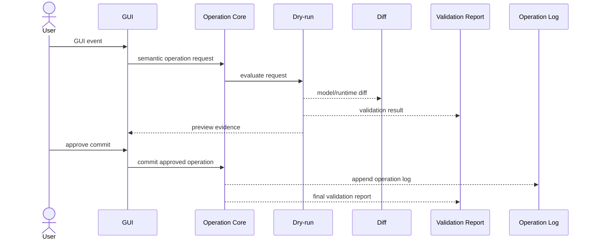
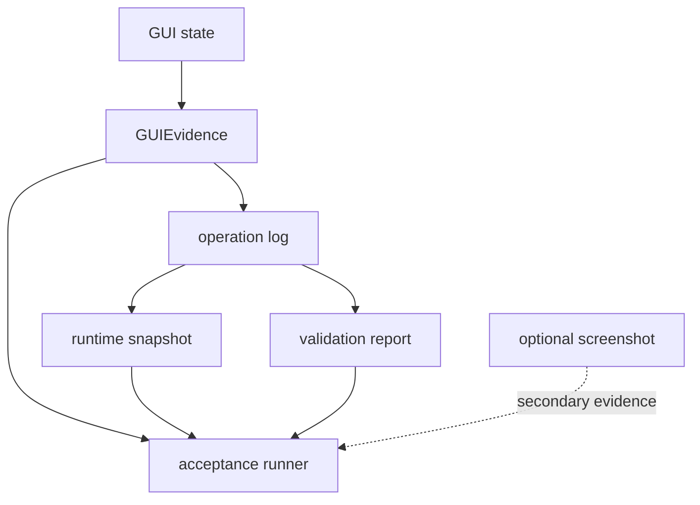
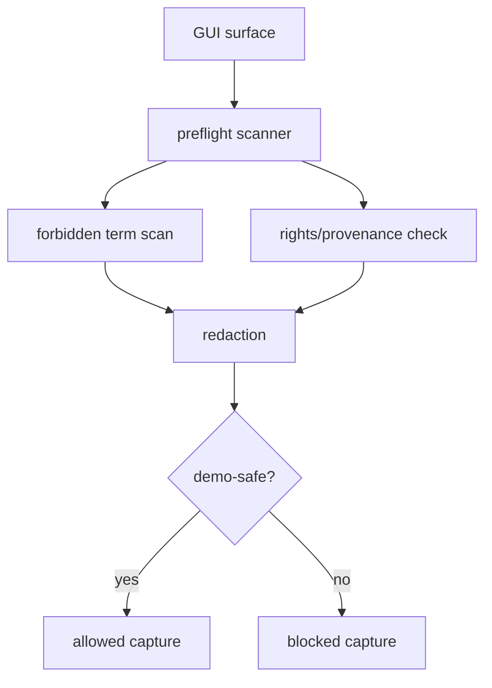

# GUI Implementation Policy

## Status

Accepted

## Purpose

This policy defines how the Editor GUI may observe, request, and evidence model changes for the Private 2D Rigging Lab / Prototype.

It prevents GUI code and GUI tests from becoming hidden implementation oracles, bypassing Operation Core, relying only on screenshots, exposing non-demo-safe details, or copying Cubism Editor behavior. The policy is required before GUI implementation begins because GUI actions are user-facing mutation entry points and must leave reviewable semantic evidence.

## Scope

### Applies to

- Editor GUI and viewer-facing GUI surfaces.
- GUI state inspection and test automation interfaces.
- GUI evidence export.
- Demo-safe GUI capture mode.
- GUI-driven operation requests, dry-runs, commits, validation, and preview.

### Actors

- GUI implementer.
- Operation Core implementer.
- Test author.
- Acceptance runner author.
- Clean Context Reviewer.
- Demo reviewer.

### Does not apply to

- Runtime Core internals.
- Historical research reports.
- Cubism Editor behavior, Cubism Viewer behavior, Cubism file formats, Cubism SDK/Core, Cubism Physics behavior, or existing Cubism models as implementation, test, or acceptance oracles.

## Source Documents

### Primary

- `discussion/development_convention/basis/00_overview.md`
- `discussion/development_convention/basis/01_common_policy_template.md`
- `discussion/development_convention/basis/03_p1_policy_specs.md`
- `discussion/development_convention/basis/04_required_diagrams_and_tables.md`
- `discussion/_conventions.md`

### Supporting

- `discussion/acceptance-criteria/`
- `discussion/scenarios/`
- `discussion/design/module-contracts/`
- `discussion/tests/`
- `discussion/demo/streaming-demo-policy.md`

### Not implementation oracle

- `discussion/reports/**`
- Cubism SDK/Core behavior.
- Cubism Viewer output.
- Cubism Editor UI behavior.
- Cubism file formats.
- Cubism Physics compatibility.
- Existing Cubism models, third-party Live2D models, and official sample models.

## Required Decisions

### DEC-GUI-001: GUI mutation boundary

#### Question
How may GUI events change the model package?

#### Decision
GUI events MUST be translated into semantic command or operation requests and sent to Operation Core for dry-run or commit. The GUI MUST NOT directly mutate package JSON, runtime graph data, fixture data, or generated artifacts.

#### Rationale
Operation Core is the mutation boundary that produces operation logs, diffs, validation output, and approval evidence.

#### Alternatives considered
Allowing GUI panels to edit package data directly was rejected because it hides mutation semantics from tests and review.

#### Impact
GUI tests and acceptance must correlate GUIEvidence with operation request IDs, operation logs, model diffs, runtime diffs, and validation reports.

### DEC-GUI-002: GUI semantic evidence

#### Question
What must GUI evidence record?

#### Decision
GUIEvidence MUST record active screen, active tool, selected object IDs, panel state, semantic target ID, operation request ID, hit-test result, visible and hidden panels, demo-safe visibility state, and relevant stable test IDs.

#### Rationale
Semantic evidence allows tests and reviewers to understand what the GUI did without relying on pixels as the primary oracle.

#### Alternatives considered
Screenshot-only evidence was rejected because it is brittle and insufficient for Clean Context Review.

#### Impact
The GUI evidence schema and test fixtures must include semantic fields with machine-readable IDs that contain no spaces.

### DEC-GUI-003: Stable test ID policy

#### Question
How are GUI test IDs named and changed?

#### Decision
Stable GUI test IDs MUST be machine-readable IDs with no spaces, MUST bind to semantic role or target, and MUST NOT be derived only from visual labels. Changing or removing a stable test ID used by tests is a breaking change that requires test updates and review.

#### Rationale
Agents and tests need stable selectors that survive copy, localization, layout, and visual label changes.

#### Alternatives considered
Using text labels or screen coordinates was rejected because they are unstable.

#### Impact
GUI component APIs must expose stable test IDs for testable controls and panels.

### DEC-GUI-004: Screenshot and visual evidence

#### Question
How are screenshots used?

#### Decision
Screenshots MAY be recorded as secondary evidence. The primary oracle MUST be structured evidence such as GUIEvidence, operation log, runtime snapshot, validation report, and acceptance result. Pixel-perfect comparison is not required for the initial MVP unless a later accepted test design explicitly requires it.

#### Rationale
The prototype needs reliable semantic acceptance before visual regression thresholds are formalized.

#### Alternatives considered
Pixel-perfect GUI acceptance was rejected for MVP because layout churn would make tests noisy.

#### Impact
Visual review can be manual or hybrid and must not replace structured evidence.

### DEC-GUI-005: GUI panel ownership

#### Question
Which GUI panels own which responsibilities?

#### Decision
Each major panel MUST have a documented responsibility, evidence production behavior, and whether it may call Operation Core. Panels include source asset import, hierarchy / part, mesh editor, parameter / keyform, parameter-grid-2d, rigControl, dynamics, validator, AI assistant, and demo-safe capture.

#### Rationale
Panel ownership prevents overlapping mutation paths and unclear test evidence.

#### Alternatives considered
Ad hoc panel ownership was rejected.

#### Impact
Panel changes require updates to the responsibility and test ID tables when responsibilities or selectors change.

### DEC-GUI-006: Demo-safe GUI mode

#### Question
What must demo-safe GUI mode hide or block?

#### Decision
Demo-safe GUI mode MUST hide or redact internal schema details, local source paths, forbidden terms, Cubism-related vocabulary, solver implementation details, third-party asset risk detail, non-demo-safe debug fields, and private research notes.

#### Rationale
The project separates Private Prototype, Streaming Demo Surface, Live2D Feature Proposal, and Future Public Clean Subset.

#### Alternatives considered
Showing the normal editor in captures was rejected because it risks exposing private implementation detail and misleading compatibility signals.

#### Impact
Demo-safe capture requires preflight evidence and may block capture.

### DEC-GUI-007: GUI accessibility for agents/tests

#### Question
How do agents and tests observe and operate the GUI?

#### Decision
GUI implementation SHOULD expose a semantic query API, stable test IDs, GUIEvidence export, headless GUI state inspection, and operation log correlation.

#### Rationale
Agent-driven testing needs structured access to GUI state without inventing screen-coordinate or pixel oracles.

#### Alternatives considered
Only browser-level screenshot inspection was rejected as insufficient.

#### Impact
GUI components must be designed for deterministic inspection and evidence export.

## Required Diagrams

### Diagram 1: GUI Mutation Flow

#### Mermaid type

sequenceDiagram

#### Purpose
Shows that GUI mutation requests must pass through Operation Core and produce reviewable evidence.

#### Must include
- User.
- GUI.
- Operation Core.
- dry-run.
- diff.
- commit.
- operation log.
- validation report.

#### Must not imply
- GUI directly mutates package data.



### Diagram 2: GUI Evidence Flow

#### Mermaid type

flowchart TD

#### Purpose
Shows how GUI semantic state connects to operation, runtime, validation, and acceptance evidence.

#### Must include
- GUI state.
- semantic evidence.
- operation log.
- runtime snapshot.
- validation report.
- acceptance runner.

#### Must not imply
- Screenshots are the primary oracle.



### Diagram 3: Demo-safe GUI Capture Flow

#### Mermaid type

flowchart TD

#### Purpose
Shows how GUI capture is allowed only after demo-safe preflight and redaction.

#### Must include
- GUI surface.
- preflight scanner.
- redaction.
- allowed capture.
- blocked capture.

#### Must not imply
- Normal mode is safe for streaming or publication.



## Required Tables

### Table 1: GUI Panel Responsibility Table

This table defines panel ownership and mutation behavior.

| Panel | Responsibility | Produces evidence | Calls operation? |
|---|---|---|---|
| sourceAssetImportPanel | Register rights-clean source assets and import requests | yes | yes |
| hierarchyPartPanel | Inspect and select package hierarchy / parts | yes | yes |
| meshEditorPanel | Edit drawable mesh through semantic operations | yes | yes |
| parameterKeyformPanel | Edit parameters and keyforms through Operation Core | yes | yes |
| parameterGrid2dPanel | Edit parameter-grid-2d controls through Operation Core | yes | yes |
| rigControlPanel | Edit project-defined rig controls through Operation Core | yes | yes |
| dynamicsPanel | Configure Minimum Open Dynamics v1 settings through Operation Core | yes | yes |
| validatorPanel | Display validation reports and repair candidates | yes | dry-run only unless approved |
| aiAssistantPanel | Request inspect, explain, validate, dry-run, and approval flows | yes | dry-run only unless approved |
| demoSafeCapturePanel | Run preflight, redaction, and capture decision | yes | no package mutation |

### Table 2: GUI Evidence Table

This table defines GUI evidence and its consumers.

| Evidence | Producer | Consumer | Required for |
|---|---|---|---|
| GUIEvidence | GUI | tests, acceptance runner, reviewer | GUI semantic oracle |
| operationRequestId | GUI | Operation Core, reviewer | mutation correlation |
| operation log | Operation Core | acceptance runner, reviewer | mutation audit |
| model diff | Operation Core | tests, reviewer | dry-run / commit review |
| runtime snapshot | Runtime Core | tests, acceptance runner | preview verification |
| validation report | Validator | GUI, tests, reviewer | diagnostic review |
| demo-safe preflight report | demo-safe capture panel | demo reviewer, acceptance runner | capture allow/block |
| optional screenshot | GUI/test runner | visual reviewer | secondary visual evidence |

### Table 3: Demo-safe Visibility Table

This table defines what the GUI shows in normal and demo-safe mode.

| Field / UI element | Normal mode | Demo-safe mode | Reason |
|---|---|---|---|
| localSourcePath | visible when useful | hidden/redacted | private machine data |
| internalSchemaDump | visible in debug tools | hidden | implementation detail |
| packageHash | visible if needed | hidden when sensitive | provenance/privacy |
| forbiddenTerms | may appear only in private policy/research contexts | blocked/redacted | avoid misleading compatibility signals |
| solverImplementationDetails | visible in debug tools | hidden | private implementation detail |
| thirdPartyAssetRiskDetail | visible to private reviewer | summarized or hidden | rights sensitivity |
| validationSummary | visible | visible if demo-safe | useful high-level evidence |
| aiDryRunSummary | visible | visible if redacted | useful high-level demo |

### Table 4: GUI Test ID Table

This table defines stable IDs for GUI automation. IDs are illustrative and become binding when adopted by implementation and tests.

| GUI element | Stable test ID | Semantic target |
|---|---|---|
| Source asset import panel | gui.panel.sourceAssetImport | source asset import workflow |
| Hierarchy / part panel | gui.panel.hierarchyPart | package hierarchy selection |
| Mesh editor canvas | gui.canvas.meshEditor | drawable mesh editing surface |
| Parameter / keyform panel | gui.panel.parameterKeyform | parameter and keyform editing |
| Parameter-grid-2d panel | gui.panel.parameterGrid2d | 2D parameter-grid editing |
| Rig control panel | gui.panel.rigControl | rigControl editing |
| Dynamics panel | gui.panel.dynamics | Minimum Open Dynamics v1 settings |
| Validator panel | gui.panel.validator | validation report display |
| AI assistant panel | gui.panel.aiAssistant | AI command surface |
| Demo-safe capture panel | gui.panel.demoSafeCapture | demo-safe capture workflow |

## Rules

### R-GUI-001: GUI must use Operation Core for mutation

GUI implementation MUST route all package mutation through Operation Core.

#### Rationale
Operation Core is the source of operation logs, diffs, validation, and approval evidence.

#### Evidence
- GUIEvidence.
- operation log.
- model diff.
- validation report.

### R-GUI-002: GUI evidence must be semantic

GUI tests and acceptance MUST use GUIEvidence and related structured artifacts as the primary oracle.

#### Rationale
Structured evidence survives layout changes and enables Clean Context Review.

#### Evidence
- GUIEvidence.
- operation request ID.
- runtime snapshot.
- validation report.

### R-GUI-003: Stable test IDs must be machine-readable

Stable GUI test IDs MUST contain no spaces and SHOULD use semantic names such as `gui.panel.rigControl`.

#### Rationale
Machine-readable IDs must be deterministic and tool-safe.

#### Evidence
- GUI Test ID Table.
- test code review.
- GUIEvidence.

### R-GUI-004: Demo-safe GUI capture must run preflight

Demo-safe capture MUST run forbidden-term, rights/provenance, and redaction checks before capture is allowed.

#### Rationale
Private implementation detail and compatibility signals must not leak to demo surfaces.

#### Evidence
- demo-safe preflight report.
- redaction report.
- rights/provenance report.

## Forbidden

| Forbidden action | Applies to | Reason | Violation handling |
|---|---|---|---|
| GUI directly mutates package JSON, runtime graph, fixtures, or generated artifacts | GUI implementation | bypasses Operation Core evidence | blocking |
| GUI test uses screenshot or pixel position as the only primary oracle | tests | brittle and not semantically reviewable | blocking |
| Stable test ID contains spaces | GUI/test APIs | violates machine-readable ID requirement | blocking |
| GUI exposes local source paths in demo-safe mode | demo-safe GUI | private data leak | blocking |
| GUI exposes internal schema dumps in demo-safe mode | demo-safe GUI | private implementation leak | blocking |
| GUI copies Cubism Editor UI or presents Cubism compatibility as project behavior | GUI surface | misleading product boundary | blocking |
| Cubism SDK/Core, Cubism Viewer, Cubism formats, Cubism Physics, or existing Cubism models are used as implementation/test/acceptance oracles | all GUI work | violates project baseline | blocking |

## Required Evidence

| Evidence | Producer | Consumer | Path / Ref | Required for |
|---|---|---|---|---|
| GUIEvidence | GUI | acceptance runner, reviewer | `generated/gui-evidence/*.gui-evidence.json` | GUI semantic verification |
| operation log | Operation Core | acceptance runner, reviewer | `generated/operations/*.operation-log.json` | mutation audit |
| model diff | Operation Core | reviewer, tests | `generated/diffs/*.model-diff.json` | dry-run / commit review |
| runtime snapshot | Runtime Core | acceptance runner | `generated/runtime/snapshots/*.runtime-snapshot.json` | preview verification |
| validation report | Validator | GUI, acceptance runner | `generated/validation/*.validation-report.json` | diagnostic verification |
| demo-safe preflight report | demo-safe tool | demo reviewer | `generated/demo/*.demo-safe-preflight.json` | capture allow/block |
| optional screenshot / capture | GUI/test runner | visual reviewer | `generated/screenshots/*` | secondary evidence |

## Review Checklist

### Blocking

- [ ] GUI routes all package mutation through Operation Core.
- [ ] GUIEvidence includes semantic state, selected object IDs, operation request ID, and demo-safe visibility state.
- [ ] GUI tests do not use screenshots as the only primary oracle.
- [ ] Stable test IDs contain no spaces and bind to semantic targets.
- [ ] Demo-safe mode hides internal schema, local paths, forbidden terms, and non-demo-safe debug fields.
- [ ] GUI surface does not imply Cubism compatibility, Cubism format support, or Cubism Editor imitation.

### Warning

- [ ] Screenshots are used only as secondary evidence unless a later accepted test design says otherwise.
- [ ] Visual review is clearly marked manual or hybrid when used.
- [ ] Panel responsibilities are updated when a panel gains a new operation path.

### Suggestion

- [ ] GUIEvidence includes enough panel state to reproduce the user-facing context.
- [ ] GUI test IDs are grouped consistently by screen and semantic target.

## Conflict Handling

Implementers and reviewers MUST NOT resolve conflicts by silent invention. Any conflict among AC, scenarios, module contracts, tests, demo policy, this policy, or implementation evidence MUST be recorded with the following format before implementation proceeds when the conflict affects behavior, tests, acceptance, or public/demo surface.

```md
# Conflict Resolution Log

## CONFLICT-0001: <Short title>

### Status
Open / Resolved / Superseded

### Found by
Human / Agent name / Reviewer role

### Found in
- `path/to/file-a.md`
- `path/to/file-b.md`

### Conflict
A says ...
B says ...

### Impact
How this affects implementation, tests, acceptance, review, GUI evidence, or demo-safe capture.

### Decision
Adopted interpretation or required document fix. Leave Open if not decided.

### Rationale
Why this decision is valid.

### Source of truth after resolution
File and section that become authoritative after resolution.

### Changed files
- `path/to/changed-file.md`

### Required follow-up
- [ ] ...

### Reviewer
- ...

### Resolved at
YYYY-MM-DD or commit / patch reference
```

### Current Conflict Resolution Log

#### CONFLICT-GUI-001: P1 policy output path differs from task write scope

##### Status
Resolved for this task.

##### Found by
Surface/Safety Agent.

##### Found in
- `discussion/development_convention/basis/03_p1_policy_specs.md`
- Current task allowed write scope.

##### Conflict
The basis specs list P1 policy output paths under `discussion/development/`.
The current task allows writing only `discussion/development_convention/gui-implementation-policy.md`.

##### Impact
Writing to the basis path would violate the allowed write scope. Writing to the task path preserves the user-specified safety boundary but leaves the broader basis path mismatch unresolved outside this task.

##### Decision
For this task, write only to `discussion/development_convention/gui-implementation-policy.md`.

##### Rationale
The explicit task allowed write scope is the operative safety boundary for this agent run.

##### Source of truth after resolution
For this task only: current task allowed write scope.

##### Changed files
- `discussion/development_convention/gui-implementation-policy.md`

##### Required follow-up
- [ ] Decide separately whether the basis path references should be updated from `discussion/development/` to `discussion/development_convention/`.

##### Reviewer
- Not yet assigned.

##### Resolved at
2026-05-28.

## Change Process

### When this policy may change

- GUI evidence schema changes.
- Operation boundary changes.
- Demo-safe capture requirements change.
- Stable test ID naming or lifecycle changes.
- Accepted AC, scenarios, module contracts, or test design change.

### Required review

- Development Compliance Review for GUI mutation or module boundary changes.
- Test Adequacy Review for GUI evidence or test selector changes.
- Clean Context Review for demo-safe, acceptance, or oracle changes.

### Required updates

- GUI panel responsibility table.
- GUI evidence schema and tests.
- Demo-safe policy and preflight expectations when capture behavior changes.
- Related AC / Scenario / Test ID traceability.

## Completion Gate

- [ ] Status is set.
- [ ] Purpose is clear.
- [ ] Scope is clear.
- [ ] Source Documents are listed.
- [ ] Required Decisions are complete.
- [ ] Required Diagrams are present.
- [ ] Required Tables are present.
- [ ] Rules use MUST / SHOULD / MAY language.
- [ ] Forbidden actions are explicit.
- [ ] Required Evidence is defined.
- [ ] Review Checklist is present.
- [ ] Conflict Handling is defined.
- [ ] Change Process is defined.
