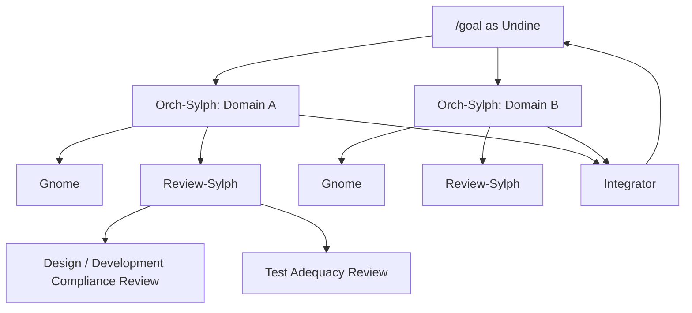
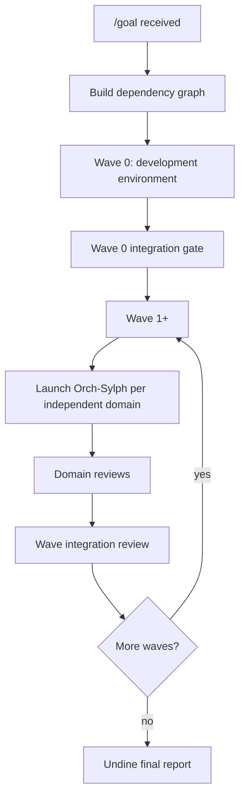
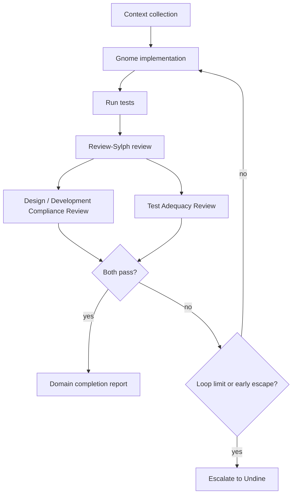
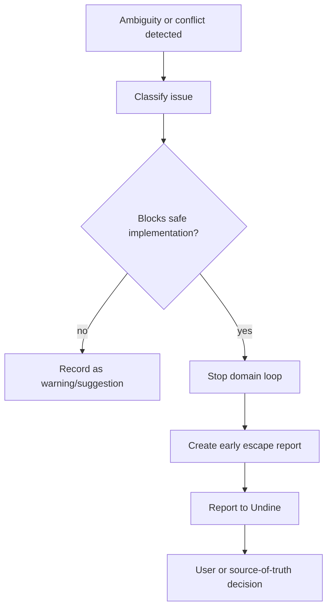
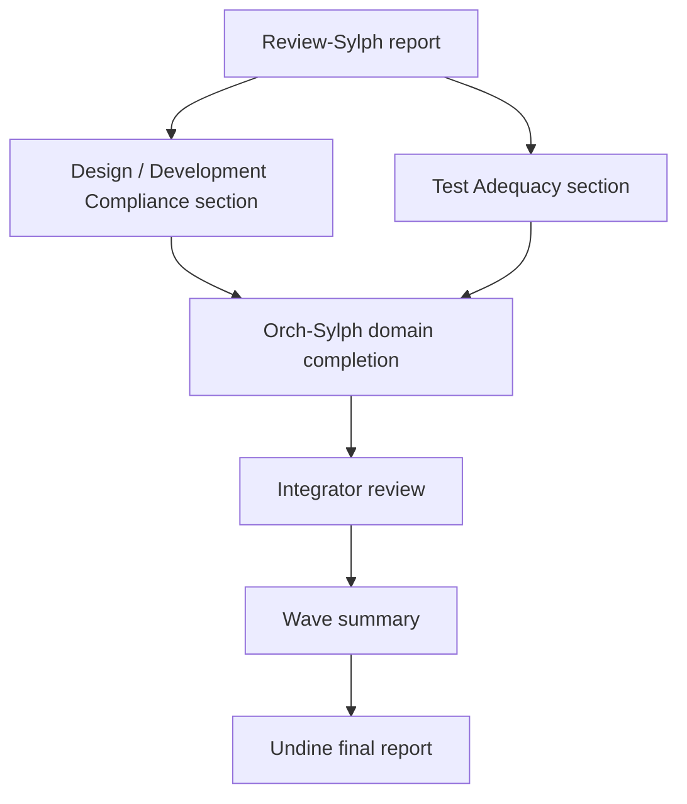

# Implementation Orchestration Policy

## Status

Draft

## Purpose

この規約は、Private 2D Rigging Lab / Prototype の実装フェーズにおいて、`/goal` を最上位オーケストレーターとして扱い、複数サブエージェントによる実装、テスト、レビュー、修正、統合を安全に進めるための実行モデルを定義する。

この規約は、既存の `implementation-orchestration` skill を概念原型として採用する。既存skillは、Undine → Orch-Sylph → Gnome / Review-Sylph という階層、wave分割、Gnomeによる実装、Review-Sylphによる設計・テスト適合レビュー、修正ループ、早期脱出、レビュー結果の永続化を定義している。本規約は、その原型を本プロジェクト専用に拡張した正式な開発規約である。

この規約が保証するものは以下である。

* `/goal` が Undine 相当の最上位オーケストレーターとして振る舞うこと。
* 実装作業を依存関係に基づいて wave 分割すること。
* Wave 0 で開発環境構築を行うこと。
* 各domain実装を Orch-Sylph が管理し、Gnome が実装すること。
* Review-Sylph が **Design / Development Compliance Review** と **Test Adequacy Review** を分離して実施すること。
* 実装・テスト・レビュー・修正のループを制御すること。
* Clean Context Review と Development Compliance Review を実装プロセスへ組み込むこと。
* RuntimeState / Dynamics / Operation / Validator / GUI / AI / Demo-safe / Rights などの横断的制約を実装中も維持すること。
* レビュー結果、wave結果、統合結果を evidence として永続化すること。
* 設計曖昧性、module境界不明、test oracle不明、Cubism関連リスクなどを検出した場合に、勝手に実装を進めず停止・報告すること。

---

## Scope

### Applies to

この規約は、以下に適用する。

* `/goal` によって実行される実装タスク
* core implementation
* test implementation
* fixture implementation
* expected artifact implementation
* validator / acceptance runner implementation
* GUI / AI / demo-safe / rights / dependency 関連実装
* subagent によるコード・テスト・文書・fixture修正
* implementation review
* integration review
* clean context review

### Does not apply to

この規約は、以下には直接適用しない。

* 開発規約本文の作成フェーズ
* 純粋な設計議論
* review memo の作成のみを目的とする作業
* research reports の整理
* Post-MVP機能の研究
* Cubism互換性調査

ただし、これらの作業から実装へ移る場合は、この規約に従う。

---

## Source Documents

### Primary

* `discussion/development_convention/source-of-truth-policy.md`
* `discussion/development_convention/repository-structure-policy.md`
* `discussion/development_convention/module-boundary-policy.md`
* `discussion/development_convention/schema-and-id-conventions.md`
* `discussion/development_convention/runtime-and-dynamics-implementation-policy.md`
* `discussion/development_convention/operation-policy.md`
* `discussion/development_convention/testing-and-acceptance-policy.md`
* `discussion/development_convention/diagnostic-policy.md`
* `discussion/development_convention/review-and-pr-policy.md`
* `discussion/development_convention/subagent-workflow-policy.md`
* `discussion/design/module-contracts/`
* `discussion/tests/`
* `discussion/acceptance-criteria/`
* `discussion/scenarios/`

### Source pattern

* Prior `implementation-orchestration` skill

### Not implementation oracle

以下は implementation / test / acceptance oracle として扱わない。

* `discussion/reports/**`
* Cubism SDK/Core behavior
* Cubism Viewer output
* Cubism Editor UI behavior
* Cubism file formats
* Cubism Physics behavior
* existing Cubism models
* official Live2D / Cubism sample models

---

## Core Model

このプロジェクトでは、`/goal` 本体を Undine と見なす。

```text
/goal as Undine
  ↓
Wave planning
  ↓
Orch-Sylph per domain
  ↓
Gnome implementation
  ↓
Review-Sylph review
    ├── Design / Development Compliance Review
    └── Test Adequacy Review
  ↓
Gnome fix loop
  ↓
Orch-Sylph completion report
  ↓
Integrator review
  ↓
Undine final report
```

---

## Agent Roles

| Role                       |     Level | Responsibility                                                                           |
| -------------------------- | --------: | ---------------------------------------------------------------------------------------- |
| `/goal` as Undine          |        L0 | 全体目的の解釈、依存グラフ作成、wave分割、Orch-Sylph起動、wave完了判定、最終報告                                        |
| Orch-Sylph                 |        L1 | 1 domain の実装サイクル管理、context収集、Gnome指示、Review-Sylph指示、修正ループ制御、domain完了報告                   |
| Gnome                      |        L2 | コード、テスト、fixture、expected artifact、必要な文書更新の実装                                             |
| Review-Sylph               |        L2 | Design / Development Compliance Review と Test Adequacy Review を分離して実施する                  |
| Clean Context Review-Sylph |        L2 | 作業担当者の会話文脈を共有せず、成果物と正本文書だけを根拠にreviewする                                                   |
| Integrator                 | L1 / L0補佐 | wave完了後のcross-module整合、DTO、schema、artifact ref、traceability、test fixture、diagnosticの統合確認 |

---

## Review Model

Review-Sylph は、単一の雑多なレビューを行ってはならない。
必ず以下の2つのreview laneを分離して実施する。

```text
1. Design / Development Compliance Review
2. Test Adequacy Review
```

両方がpassしない限り、domainを完了扱いにしてはならない。
ただし、documentation-only domain や test-only domain では、該当しないlaneを `Not Applicable` としてよい。その場合は理由を明記する。

---

## Design / Development Compliance Review

### Purpose

実装が、設計・契約・開発規約に適合しているかを確認する。

### Must check

* AC / Scenario への適合
* Module Contract への適合
* Development Convention への適合
* Module Boundary Policy への適合
* Operation Core mutation boundary
* RuntimeState / RuntimeStateSequence semantics
* Minimum Open Dynamics v1 scope
* formal / candidate diagnostic policy
* demo-safe / rights / IP guardrails
* Cubism non-oracle requirement
* machine-readable ID naming rules
* dependency policy compliance
* generated artifact / authored source boundary

### Typical blocking findings

* Runtime Core が hidden mutable state を持っている。
* GUI または AI が Operation Core を迂回して package をmutationしている。
* Dynamics が direct vertex physics を実装している。
* Cubism SDK/Core / Viewer / format を oracle にしている。
* MVP blocking test が candidate diagnostic だけを oracle にしている。
* machine-readable ID に空白が含まれている。
* RuntimeState sequence semantics が設計と異なる。
* demo-safe surface に forbidden term や internal schema が露出している。

---

## Test Adequacy Review

### Purpose

テストが、要求・設計・契約を十分に証明しているかを確認する。

### Must check

* Test ID が対象AC / Scenario / Module Contractを証明しているか。
* fixture と oracle の粒度が合っているか。
* expected artifact が十分か。
* `mvp-blocking` fixture がTest IDに接続されているか。
* exact deterministic replay が全RuntimeState sequence比較になっているか。
* final state のみを exact replay のpass条件にしていないか。
* formal diagnostic または explicit expected artifact を MVP blocking oracle にしているか。
* candidate diagnostic だけに依存していないか。
* failure時に原因追跡できるか。
* test result が実際にpassしているか。
* GUI evidence、AI dry-run evidence、demo-safe preflight、rights/provenance evidence が必要な箇所に存在するか。
* E2E test が required evidence を出しているか。

### Typical blocking findings

* Test ID が存在しない。
* fixture が manifest にあるが traceability matrix に接続されていない。
* exact deterministic replay が final state のみを比較している。
* validator diagnostic が candidate のまま MVP blocking oracle に使われている。
* expected artifact が不足している。
* GUI test が screenshot のみを primary oracle にしている。
* test result が添付されていない。
* Test ID と fixture と oracle の粒度が合っていない。

---

## Subagent Call Convention

サブエージェント呼び出し時は、各prompt冒頭に呼び出し元を明記する。

```text
[subagent-call] 呼び出し元: {エージェント名}
```

`/goal` が最上位の場合は、以下を使う。

```text
[subagent-call] 呼び出し元: Undine (/goal)
```

Orch-Sylph が Gnome または Review-Sylph を呼ぶ場合は、以下を使う。

```text
[subagent-call] 呼び出し元: Orch-Sylph
```

Clean Context Review を行う場合は、以下を使う。

```text
[subagent-call] 呼び出し元: Undine (/goal) - clean context review
```

---

## Wave Planning

Undine は、実装開始前に必ず wave plan を作る。

Wave plan は以下を含む。

* target goal
* dependency graph
* wave list
* domains per wave
* domain owner
* expected modified paths
* required tests
* required evidence
* early escape risks
* integration gate

---

## Wave 0: Development Environment Setup

Wave 0 は必須である。
Wave 0 では、feature implementation を始める前に、monorepo開発環境、基本tooling、test harness、artifact output、CI相当のlocal scriptsを整備する。

### Purpose

Wave 0 は、以降の Gnome / Review-Sylph / Acceptance Runner が共通の実行環境で動けるようにするための基盤である。

### Scope

Wave 0 で行うこと。

* monorepo workspace scaffold
* package manager setup
* TypeScript / lint / format / typecheck setup
* test runner setup
* schema package scaffold
* artifact output directory scaffold
* fixture directory scaffold
* basic CI/local check scripts
* dependency registry scaffold
* forbidden dependency scan scaffold
* generated evidence directory policy implementation
* initial README / developer bootstrap document
* no Cubism SDK/Core dependency
* no domain feature implementation beyond scaffolding

### Wave 0 Must Produce

* repository layout
* package/workspace config
* `packages/schema/` scaffold
* `packages/runtime-core/` scaffold
* `packages/operation-core/` scaffold
* `packages/validator/` scaffold
* `packages/acceptance-runner/` scaffold
* `fixtures/` scaffold
* `generated/` scaffold
* basic `test`, `typecheck`, `lint`, `format` scripts
* development environment report

### Wave 0 Must Not Produce

* Minimum Open Dynamics v1 implementation
* GUI feature implementation
* AI assistant behavior
* Cubism import/export
* Cubism SDK/Core dependency
* production viewer
* production editor
* auto-rigging
* direct vertex physics

### Wave 0 Completion Gate

```md
- [ ] monorepo workspace exists.
- [ ] package manager and lockfile exist.
- [ ] core package scaffolds exist.
- [ ] test runner can execute at least one smoke test.
- [ ] typecheck script exists.
- [ ] lint / format scripts exist or are explicitly deferred with reason.
- [ ] generated artifact directories exist or are created by scripts.
- [ ] no Cubism SDK/Core dependency exists.
- [ ] dependency policy is not violated.
- [ ] Wave 0 review report exists.
```

---

## Default Wave Model

Wave 0 is fixed.
Later waves are planned by Undine according to dependency graph.

A recommended initial split is:

|   Wave | Purpose                        | Example domains                                                        |
| -----: | ------------------------------ | ---------------------------------------------------------------------- |
| Wave 0 | Development environment        | monorepo, scripts, scaffolds, dependency registry                      |
| Wave 1 | Schema and artifact foundation | DTOs, package format, ID conventions, artifact refs, diagnostic base   |
| Wave 2 | Core runtime and mutation      | runtime-core, Minimum Open Dynamics v1, operation-core, validator core |
| Wave 3 | Evidence and acceptance        | fixtures, acceptance runner, deterministic replay, validation reports  |
| Wave 4 | Surfaces and assistants        | GUI editor, viewer, AI assistant, demo-safe, rights/provenance         |

Undine may change this split, but must record the reason.

---

## Wave Rules

### R-ORCH-001: Dependency rule

A wave MUST NOT start until all required upstream waves have passed integration review.

### R-ORCH-002: Parallelism rule

Domains in the same wave MAY run in parallel only if they do not edit the same files and do not depend on each other's unfinished outputs.

### R-ORCH-003: Same-file edit rule

Two Orch-Sylph domains MUST NOT modify the same file concurrently.

If same-file edits are required, Undine must serialize those domains or assign the file to Integrator.

### R-ORCH-004: Cross-module contract rule

If a domain modifies shared schema, DTOs, artifact refs, validator diagnostics, or operation payloads, Integrator review is required before dependent domains proceed.

---

## Orch-Sylph Domain Cycle

Each Orch-Sylph follows this cycle.

```text
1. Context collection
2. Implementation task construction
3. Gnome implementation
4. Test execution
5. Review-Sylph review
   5.1 Design / Development Compliance Review
   5.2 Test Adequacy Review
6. Fix loop
7. Domain completion report
```

---

## Step 1: Context Collection

Orch-Sylph MUST read:

* relevant AC / Scenario
* relevant module contracts
* relevant development conventions
* relevant test design
* existing code
* fixture manifest
* traceability matrix
* validator diagnostic registry
* dependency policy if dependency changes are involved

Orch-Sylph MUST NOT use research reports as implementation oracle.

---

## Step 2: Gnome Instruction

Orch-Sylph instructs Gnome with:

* task goal
* relevant source documents
* allowed edit paths
* forbidden edit paths
* expected tests
* expected evidence
* applicable development policies
* completion criteria
* early escape conditions

---

## Step 3: Gnome Implementation

Gnome MUST:

* implement code
* implement or update tests
* update fixtures if required
* update expected artifacts if required
* run required tests
* report changed files
* report assumptions
* report conflicts
* avoid direct mutation boundary violations
* avoid Cubism oracle usage

---

## Step 4: Review-Sylph Review

Review-Sylph MUST produce two independent review lanes.

### Lane 1: Design / Development Compliance Review

This review checks whether the implementation conforms to design, contracts, module boundaries, and development conventions.

### Lane 2: Test Adequacy Review

This review checks whether tests and evidence prove the relevant AC / Scenario / Contract requirements.

### Overall review verdict

A domain passes review only when both lanes pass.

```text
Design / Development Compliance Review: Pass
Test Adequacy Review: Pass
Overall Verdict: Pass
```

If either lane fails, the domain is `Needs Fix` or `Escalated`.

---

## Step 5: Fix Loop

If Review-Sylph reports blocking differences, Orch-Sylph returns a focused fix instruction to Gnome.

### Fix routing

| Failed lane                            | Primary fix target                                                               |
| -------------------------------------- | -------------------------------------------------------------------------------- |
| Design / Development Compliance Review | implementation, architecture, module boundary, development convention compliance |
| Test Adequacy Review                   | tests, fixtures, expected artifacts, traceability, oracle, diagnostic usage      |
| Both                                   | design/compliance first unless tests expose source-of-truth conflict             |

If review reveals source-of-truth ambiguity, Orch-Sylph MUST trigger early escape to Undine.

---

## Loop Control

| Domain type                                      | Default max loop | Max loop |
| ------------------------------------------------ | ---------------: | -------: |
| simple docs / config                             |                2 |        3 |
| normal implementation                            |                3 |        4 |
| core runtime / dynamics / validator / acceptance |                4 |        5 |
| cross-module schema changes                      |                4 |        5 |

If differences do not decrease for two consecutive loops, Orch-Sylph MUST stop and escalate to Undine.

Loop count and final status MUST be recorded in the review report.

---

## Early Escape Conditions

Orch-Sylph or Review-Sylph MUST stop the loop and report to Undine if any of the following occur.

| Condition                                                 | Required action                       |
| --------------------------------------------------------- | ------------------------------------- |
| accepted design and module contract conflict              | create conflict report                |
| missing source of truth                                   | stop and request decision             |
| multiple valid interpretations                            | stop and request decision             |
| module boundary unclear                                   | stop and request decision             |
| test oracle unclear                                       | stop and request decision             |
| candidate diagnostic is only oracle for MVP blocking test | stop and request contract/test update |
| Operation Core must be bypassed to implement feature      | stop and report                       |
| RuntimeState sequence semantics unclear                   | stop and report                       |
| Cubism compatibility or Cubism oracle appears necessary   | stop and report                       |
| dependency requires policy review                         | stop and request dependency decision  |
| rights/provenance missing for fixture/demo                | stop and report                       |

Early escape report MUST include:

* what is unclear
* where the ambiguity appears
* affected files
* why implementation cannot safely continue
* decision needed from Undine or user
* suggested options if known

---

## Review-Sylph Report

Review-Sylph MUST produce a persistent report.

### Path

```text
discussion/implementation/reviews/{wave}/{domain}/{task}.md
```

Example:

```text
discussion/implementation/reviews/wave1/schema/runtime-state-dto.md
```

### Required Content

```md
# Review Report: <Task>

## Summary

## Loop

## Verdict
Pass / Needs Fix / Escalated

## Reviewed Files

## Source Documents

## Design / Development Compliance Review

### Verdict
Pass / Needs Fix / Escalated

### Checked source documents

### Findings

### Design conformance

### Module contract conformance

### Development convention compliance

### Module boundary compliance

### Runtime / Dynamics semantics
If applicable.

### Operation boundary compliance
If applicable.

### Diagnostic policy compliance
If applicable.

### Demo / Rights / IP compliance
If applicable.

### Cubism non-oracle check

## Test Adequacy Review

### Verdict
Pass / Needs Fix / Escalated

### Checked test design

### Test IDs checked

### Fixtures checked

### Expected artifacts checked

### Test results

### Oracle adequacy

### Deterministic replay evidence
If applicable.

### GUI evidence
If applicable.

### AI dry-run evidence
If applicable.

### Demo-safe evidence
If applicable.

## Overall Verdict

Pass only if both review lanes pass.

## Discretionary Judgments

## Differences Found

## Required Fixes

## Remaining Risks

## Evidence Artifacts
```

---

## Orch-Sylph Completion Report

When a domain completes, Orch-Sylph reports to Undine.

### Path

```text
discussion/implementation/waves/{wave}/{domain}-completion.md
```

### Required Content

```md
# Domain Completion Report: <Domain>

## Wave

## Domain

## Loop Count

## Changed Files

## Tests Run

## Test Results

## Design / Development Compliance Review
Pass / Needs Fix / Escalated

## Test Adequacy Review
Pass / Needs Fix / Escalated

## Overall Review Result
Pass / Needs Fix / Escalated

## Evidence Artifacts

## Review Reports

## Accepted Discretionary Judgments

## Conflicts Found

## Remaining Risks

## Ready for Integration
Yes / No
```

---

## Domain Completion Rule

A domain MAY be completed only when:

```md
- [ ] Design / Development Compliance Review passes.
- [ ] Test Adequacy Review passes.
- [ ] Required tests pass.
- [ ] Any remaining warnings are documented and accepted.
- [ ] No unresolved blocking conflict remains.
```

### Exceptions

Documentation-only domain:

```md
Test Adequacy Review MAY be marked Not Applicable with reason.
```

Test-only domain:

```md
Design / Development Compliance Review still checks that tests follow accepted contracts and conventions.
```

---

## Integrator Review

After each wave, Integrator MUST perform cross-domain review.

### Path

```text
discussion/implementation/waves/{wave}/integration-review.md
```

### Integrator Checks

* schema / DTO consistency
* artifact ref consistency
* RuntimeState / RuntimeStateSequence semantics
* operation payload consistency
* validator diagnostic consistency
* formal / candidate diagnostic consistency
* fixture / traceability consistency
* mvp-blocking fixture execution path
* generated evidence path consistency
* dependency policy compliance
* no Cubism oracle usage
* no machine-readable ID with spaces
* no concurrent edit residue
* test profile consistency
* both review lanes are present for each domain

### Wave Completion Gate

```md
- [ ] All domain completion reports exist.
- [ ] All Review-Sylph reports exist.
- [ ] Design / Development Compliance Review passes for all domains, unless explicitly N/A.
- [ ] Test Adequacy Review passes for all domains, unless explicitly N/A.
- [ ] Integration review exists.
- [ ] No unresolved blocking conflict remains.
- [ ] Shared schema/DTO changes are consistent.
- [ ] Required tests pass.
- [ ] Generated evidence paths are valid.
- [ ] No Cubism oracle usage detected.
```

---

## Undine Final Report

At the end of a `/goal` implementation run, Undine MUST produce a final report.

### Path

```text
discussion/implementation/orchestration/{goal-id}-final-report.md
```

If no stable goal ID exists, use a descriptive slug.

### Required Content

```md
# Implementation Orchestration Final Report

## Goal

## Waves Executed

## Domains Completed

## Domains Deferred

## Changed Files

## Tests Run

## Evidence Artifacts

## Review Reports

## Integration Reviews

## Design / Development Compliance Summary

## Test Adequacy Summary

## Conflicts

## Early Escapes

## Remaining Risks

## Implementation Ready Status
```

---

## Mermaid Diagrams

## Diagram 1: Project-specific Orchestration Hierarchy



---

## Diagram 2: Wave Planning Flow



---

## Diagram 3: Domain Implementation Loop



---

## Diagram 4: Early Escape Flow



---

## Diagram 5: Review Artifact Flow



---

## Required Tables

## Agent Role Table

| Role             | Owns                       | Must produce                     | Must not do                       |
| ---------------- | -------------------------- | -------------------------------- | --------------------------------- |
| Undine (`/goal`) | wave plan and final report | wave plan, final report          | silently resolve design conflicts |
| Orch-Sylph       | one domain cycle           | domain completion report         | edit unrelated domains            |
| Gnome            | implementation             | code, tests, fixtures, artifacts | bypass policies                   |
| Review-Sylph     | review                     | two-lane review report           | rely on implementer intent        |
| Integrator       | cross-module consistency   | integration review               | ignore unresolved conflicts       |

---

## Review Lane Table

| Review lane                            | Purpose                           | Blocking if fails? |
| -------------------------------------- | --------------------------------- | ------------------ |
| Design / Development Compliance Review | 設計・契約・規約への適合確認                    | yes                |
| Test Adequacy Review                   | テスト・fixture・oracle・evidenceの妥当性確認 | yes                |

---

## Wave Gate Table

| Gate              | Required evidence                                 | Blocking if missing? |
| ----------------- | ------------------------------------------------- | -------------------- |
| Wave 0            | env report, scripts, scaffold, no forbidden deps  | yes                  |
| Domain completion | tests, two-lane review report, evidence artifacts | yes                  |
| Wave integration  | integration review                                | yes                  |
| Final             | final report                                      | yes                  |

---

## Review Scope Table

| Review scope             | Checked by                            | Required for                       |
| ------------------------ | ------------------------------------- | ---------------------------------- |
| Design conformance       | Review-Sylph                          | all domains                        |
| Development compliance   | Review-Sylph                          | all domains                        |
| Test adequacy            | Review-Sylph / Clean Context Reviewer | implementation with tests          |
| Cross-module consistency | Integrator                            | wave completion                    |
| Clean context review     | Clean Context Review-Sylph            | MVP blocking and high-risk changes |

---

## Loop Control Table

| Case                    | Action                                              |
| ----------------------- | --------------------------------------------------- |
| both lanes pass         | complete domain                                     |
| design lane fails       | implementation/compliance fix loop                  |
| test lane fails         | test/fixture/evidence fix loop                      |
| both fail               | prioritize design/compliance unless source conflict |
| no diff reduction twice | escalate                                            |
| max loop reached        | report residuals                                    |
| design ambiguity        | early escape                                        |

---

## Early Escape Table

| Trigger                      | Required report         |
| ---------------------------- | ----------------------- |
| source conflict              | conflict report         |
| module boundary unclear      | boundary question       |
| test oracle missing          | test design question    |
| candidate diagnostic only    | diagnostic escalation   |
| Cubism oracle pressure       | guardrail escalation    |
| Operation Core bypass needed | architecture escalation |

---

## Persistent Report Table

| Report                  | Path                                                                |
| ----------------------- | ------------------------------------------------------------------- |
| Review-Sylph report     | `discussion/implementation/reviews/{wave}/{domain}/{task}.md`       |
| Domain completion       | `discussion/implementation/waves/{wave}/{domain}-completion.md`     |
| Wave integration review | `discussion/implementation/waves/{wave}/integration-review.md`      |
| Final report            | `discussion/implementation/orchestration/{goal-id}-final-report.md` |

---

## Rules

### R-ORCH-001: `/goal` is Undine

`/goal` MUST act as Undine for implementation tasks.

### R-ORCH-002: Wave 0 is mandatory

Implementation MUST begin with Wave 0 development environment setup unless an accepted environment report already exists.

### R-ORCH-003: Every domain requires two-lane review

Every Gnome implementation MUST be reviewed through:

* Design / Development Compliance Review
* Test Adequacy Review

### R-ORCH-004: Domain completion requires both review lanes

A domain MUST NOT be completed unless both review lanes pass or are explicitly marked Not Applicable with reason.

### R-ORCH-005: Tests are required

Gnome MUST implement or update tests required by the relevant test design.

### R-ORCH-006: Review reports are persistent

Review-Sylph reports MUST be written to file.

### R-ORCH-007: Integrator review is required after every wave

A wave MUST NOT be considered complete without integration review.

### R-ORCH-008: Do not silently resolve conflicts

Agents MUST NOT silently resolve source-of-truth conflicts.

### R-ORCH-009: Development conventions are binding

All Gnome and Review-Sylph work MUST follow accepted development conventions.

---

## Forbidden

| Forbidden action                                     | Applies to   | Violation |
| ---------------------------------------------------- | ------------ | --------- |
| Skip Wave 0 without accepted environment report      | Undine       | blocking  |
| Run dependent wave before upstream gate              | Undine       | blocking  |
| Implement without tests where tests are required     | Gnome        | blocking  |
| Commit package mutation outside Operation Core       | Gnome        | blocking  |
| Use Cubism SDK/Core/Viewer as oracle                 | all          | blocking  |
| Use candidate diagnostic as only MVP blocking oracle | Gnome/Review | blocking  |
| Ignore Review-Sylph blocking finding                 | Orch-Sylph   | blocking  |
| Continue through design ambiguity                    | Orch-Sylph   | blocking  |
| Omit review report                                   | Review-Sylph | blocking  |
| Omit either review lane without N/A reason           | Review-Sylph | blocking  |
| Omit integration review                              | Integrator   | blocking  |

---

## Required Evidence

| Evidence                 | Producer          | Consumer                |
| ------------------------ | ----------------- | ----------------------- |
| Wave plan                | Undine            | all agents              |
| Environment report       | Wave 0 Orch-Sylph | Undine / Integrator     |
| Implementation changes   | Gnome             | Review-Sylph            |
| Test result              | Gnome             | Review-Sylph            |
| Two-lane review report   | Review-Sylph      | Orch-Sylph / Integrator |
| Domain completion report | Orch-Sylph        | Undine / Integrator     |
| Integration review       | Integrator        | Undine                  |
| Final report             | Undine            | user                    |
| Conflict report          | any agent         | Undine                  |
| Early escape report      | Orch-Sylph        | Undine                  |

---

## Review Checklist

### Blocking

* [ ] `/goal` produced or referenced a wave plan.
* [ ] Wave 0 was executed or an accepted environment report exists.
* [ ] Each domain has a Review-Sylph report.
* [ ] Each Review-Sylph report contains Design / Development Compliance Review.
* [ ] Each Review-Sylph report contains Test Adequacy Review.
* [ ] Both review lanes pass, or N/A is justified.
* [ ] Each wave has an integration review.
* [ ] Tests required by test design were implemented or explicitly blocked.
* [ ] No unresolved blocking conflict remains.
* [ ] No Cubism SDK/Core/Viewer/format oracle was used.
* [ ] Runtime / Dynamics changes preserve RuntimeState evidence semantics.
* [ ] Operation mutation boundary is preserved.
* [ ] MVP blocking tests use formal diagnostics or explicit expected artifacts.

### Warning

* [ ] Additional tests were added beyond test design and documented.
* [ ] Non-blocking residual risks are recorded.
* [ ] Discretionary implementation choices are recorded.

### Suggestion

* [ ] Wave split can be improved in future runs.
* [ ] Review report structure can be refined.

---

## Conflict Handling

If implementation orchestration exposes conflict between accepted design, module contracts, tests, or development conventions, the responsible Orch-Sylph MUST stop the affected loop and create a conflict report.

Conflict report MUST include:

* affected domain
* affected wave
* source documents
* conflict description
* impact
* options
* recommended next step
* whether user decision is required

---

## Change Process

This policy may change when:

* agent role model changes
* `/goal` execution model changes
* subagent workflow policy changes
* review requirements change
* implementation wave model changes
* evidence requirements change

Changes require:

* review of `subagent-workflow-policy.md`
* review of `review-and-pr-policy.md`
* review of `testing-and-acceptance-policy.md`
* update to basis documents if P0/P1 policy requirements change

---

## Completion Gate

This policy is complete when:

```md
- [ ] `/goal` as Undine is defined.
- [ ] Wave 0 development environment setup is defined.
- [ ] agent roles are defined.
- [ ] two-lane review model is defined.
- [ ] wave planning is defined.
- [ ] domain implementation loop is defined.
- [ ] review/fix loop control is defined.
- [ ] early escape conditions are defined.
- [ ] persistent report paths are defined.
- [ ] Integrator role is defined.
- [ ] Mermaid diagrams are present.
- [ ] required tables are present.
- [ ] Cubism non-oracle guardrail is included.
- [ ] RuntimeState / Dynamics / Operation / Diagnostic / Test evidence constraints are included.
```
