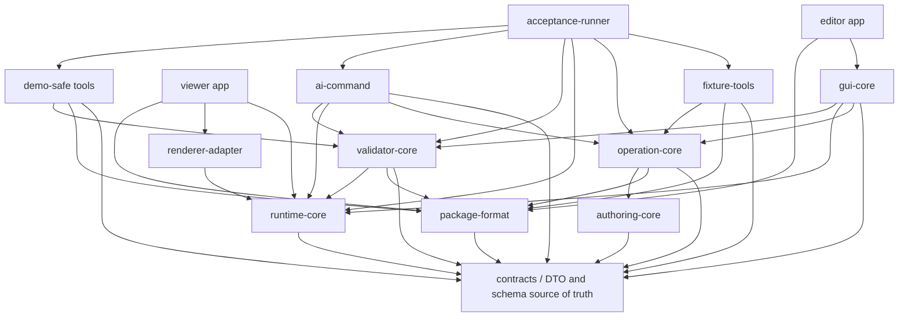
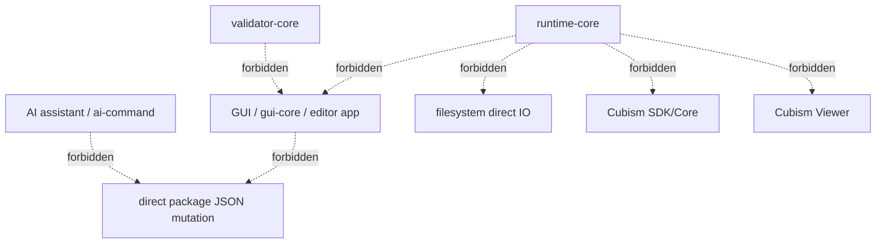
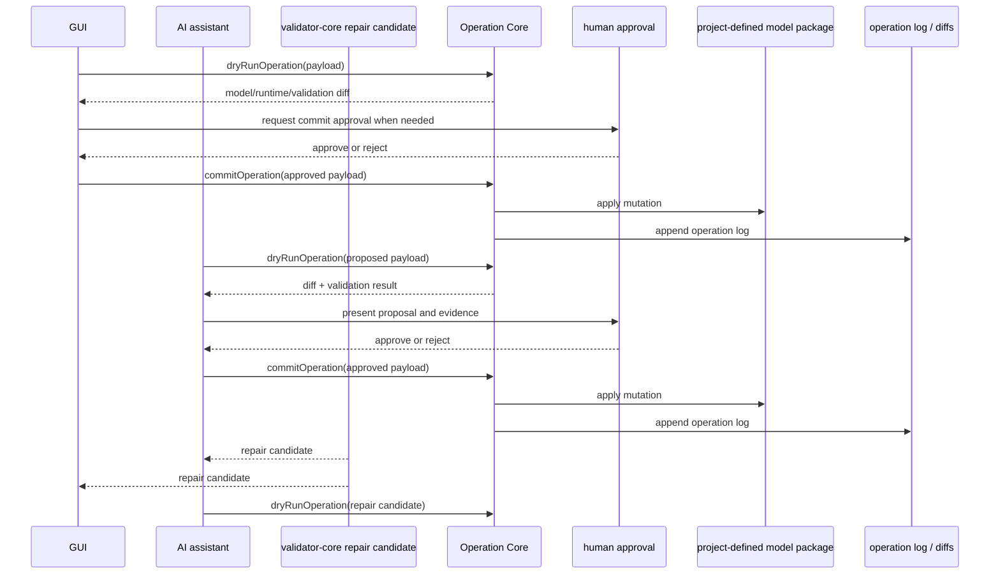

# Module Boundary Policy

## Status

Accepted

## Purpose

This policy defines module responsibilities, dependency direction, forbidden dependencies, and package mutation boundaries for the Private 2D Rigging Lab / Prototype.

It prevents hidden coupling between runtime, GUI, validator, AI, package IO, and acceptance tooling before MVP implementation starts. It also ensures that Minimum Open Dynamics v1, package mutation, validation, evidence generation, and review can be implemented without relying on Cubism formats, Cubism SDK/Core, Cubism Viewer behavior, Cubism Physics compatibility, or existing Cubism models as implementation, test, or acceptance oracles.

## Scope

### Applies to

- `discussion/design/module-contracts/module-boundaries.md`
- `discussion/design/module-contracts/typescript-contracts.md`
- `discussion/design/module-contracts/package-file-format-contract.md`
- `discussion/design/module-contracts/operation-contracts.md`
- `discussion/design/module-contracts/runtime-core-contract.md`
- `discussion/design/module-contracts/validator-contract.md`
- `discussion/design/module-contracts/ai-command-contract.md`
- `discussion/design/module-contracts/gui-operation-contract.md`
- `discussion/design/module-contracts/fixtures-and-contract-tests.md`
- Future monorepo modules under `packages/**`, `apps/**`, `fixtures/**`, `generated/**`, and `tests/**`.

### Actors

- Module implementer
- GUI implementer
- AI command implementer
- Runtime implementer
- Validator implementer
- Acceptance runner implementer
- Fixture author
- Clean Context Reviewer

### Does not apply to

- Historical research reports under `discussion/reports/**`.
- Cubism SDK/Core behavior, Cubism Viewer output, Cubism Editor behavior, Cubism Physics behavior, Cubism file formats, or existing Cubism models.
- Post-MVP direct vertex physics, cloth simulation, collision, IK, timeline bake, Cubism Physics compatibility, or Cubism format import/export.

## Source Documents

### Primary

- `discussion/development_convention/basis/00_overview.md`
- `discussion/development_convention/basis/01_common_policy_template.md`
- `discussion/development_convention/basis/02_p0_policy_specs.md`
- `discussion/development_convention/basis/04_required_diagrams_and_tables.md`
- `discussion/_conventions.md`
- `discussion/design/module-contracts/module-boundaries.md`
- `discussion/design/module-contracts/typescript-contracts.md`
- `discussion/design/module-contracts/package-file-format-contract.md`
- `discussion/design/module-contracts/operation-contracts.md`
- `discussion/design/module-contracts/runtime-core-contract.md`
- `discussion/design/module-contracts/validator-contract.md`
- `discussion/design/module-contracts/ai-command-contract.md`
- `discussion/design/module-contracts/gui-operation-contract.md`
- `discussion/design/module-contracts/fixtures-and-contract-tests.md`

### Supporting

- `discussion/acceptance-criteria/03_MVP_Acceptance_Criteria.md`
- `discussion/scenarios/03_MVP_Acceptance_Criteria.md`
- `discussion/tests/runners/acceptance-runner-design.md`
- `discussion/tests/traceability/test-traceability-matrix.md`
- `discussion/demo/streaming-demo-policy.md`
- `discussion/proposal/live2d-feature-proposal-template.md`

### Not implementation oracle

- `discussion/reports/**`
- Cubism SDK/Core behavior
- Cubism Viewer output
- Cubism Editor behavior
- Cubism file formats
- Cubism Physics behavior
- Existing Cubism models
- Official Live2D/Cubism sample models

## Required Decisions

### DEC-MODULE-001: Module list

#### Question

Which modules exist at P0 for the monorepo MVP implementation?

#### Decision

The P0 module set is:

- `contracts`
- `package-format`
- `authoring-core`
- `operation-core`
- `runtime-core`
- `validator-core`
- `renderer-adapter`
- `gui-core`
- `editor app`
- `viewer app`
- `ai-command`
- `fixture-tools`
- `acceptance-runner`
- `demo-safe tools`

#### Rationale

This set matches the accepted module contract vocabulary while preserving the P0 basis requirements for contracts/schema ownership, package format, operation gateway, runtime isolation, validator behavior, GUI/editor/viewer surfaces, AI command boundary, fixture tooling, acceptance evidence, and demo-safe preflight.

#### Alternatives considered

Combining GUI, runtime, validator, and AI into a single application module was rejected because it would obscure dependency direction and review evidence.

#### Impact

Implementation work MUST map every production package, app, fixture tool, generated artifact, and test runner to one of these modules or record a conflict before adding another module.

### DEC-MODULE-002: Module responsibilities

#### Question

What does each P0 module own?

#### Decision

Responsibilities are defined in the Module Responsibility Table. In short, `contracts` owns shared DTO and ID contracts, `package-format` owns project-defined model package IO, `operation-core` owns package mutation, `runtime-core` owns deterministic runtime evaluation and explicit `RuntimeStateDto` transitions, `validator-core` owns validation reports, GUI modules own interaction state, AI owns transport-independent commands, fixture tools own contract fixtures, acceptance runner owns end-to-end evidence orchestration, and demo-safe tools own capture preflight.

#### Rationale

Clear ownership prevents duplicate schema definitions, runtime/GUI coupling, validator/UI coupling, and direct package mutation.

#### Alternatives considered

Allowing each module to define local DTOs was rejected because it would cause drift between package, runtime, validator, AI, and test artifacts.

#### Impact

Reviewers MUST reject implementations where ownership is ambiguous or duplicated without a Conflict Resolution Log entry.

### DEC-MODULE-003: Dependency direction

#### Question

Which dependency directions are allowed?

#### Decision

Dependencies MUST follow the Module Dependency DAG and Allowed Dependency Table. The graph is acyclic. `contracts` is the shared source for external DTO and schema contracts. Runtime, validator, operation, GUI, AI, fixture tooling, acceptance runner, and demo-safe tools consume shared schemas instead of redefining them.

#### Rationale

Acyclic dependencies allow independent contract tests, clean context review, deterministic runtime evidence, and safe cross-module changes.

#### Alternatives considered

Bidirectional dependencies between GUI and operation/runtime were rejected because they would blur editor-only state, runtime-visible state, and mutation approval.

#### Impact

Every module import, package dependency, generated schema dependency, or test helper dependency MUST be explainable by the allowed dependency table.

### DEC-MODULE-004: Runtime Core isolation

#### Question

What must `runtime-core` not depend on?

#### Decision

`runtime-core` MUST NOT depend on GUI modules, editor app, viewer app, filesystem direct IO, package file IO, operation approval state, AI assistant, Cubism SDK/Core, Cubism Viewer, Cubism formats, or existing Cubism models.

#### Rationale

Runtime Core must be deterministic, replayable, and reviewable from explicit inputs: normalized runtime graph, frame inputs, evaluation context/options, and previous `RuntimeStateDto`.

#### Alternatives considered

Runtime session state or filesystem-backed runtime loading was rejected for MVP because it would weaken exact replay evidence.

#### Impact

Runtime evidence MUST be generated from explicit DTO input/output and not from hidden mutable runtime state.

### DEC-MODULE-005: Operation mutation boundary

#### Question

How may a project-defined model package be changed?

#### Decision

All package mutation MUST pass through `operation-core`. GUI, AI, validator repair candidates, fixture tools, and migration utilities MUST use operation dry-run, diff, approval where required, commit, and operation log paths. Direct JSON/package mutation by GUI, AI, validator repair, or tests is forbidden for MVP acceptance candidates.

#### Rationale

Operation Core is the only place that can enforce preconditions, produce model/runtime/validation diffs, write operation logs, and support undo/redo and review evidence.

#### Alternatives considered

Direct file editing by GUI or AI was rejected because it bypasses approval, evidence, validation, and operation traceability.

#### Impact

Acceptance evidence MUST include operation log entries for GUI-authored or AI-assisted mutation flows.

### DEC-MODULE-006: AI boundary

#### Question

What may the AI assistant do?

#### Decision

AI may inspect, explain, validate, request runtime snapshots, propose dry-run operations, compare diffs, create repair suggestions, and summarize provenance or demo-safe status from metadata. AI MUST NOT mutate package files directly, commit without human approval, infer complete rigging automatically, convert existing models, reconstruct Cubism model structures, or make rights/legal safety determinations.

#### Rationale

The AI boundary keeps agent assistance auditable and prevents unapproved package mutation or incompatible model conversion workflows.

#### Alternatives considered

Allowing AI to commit repair candidates automatically was rejected for MVP.

#### Impact

AI command evidence MUST include dry-run result, diff, validation result, approval boundary, and post-commit revalidation when a commit occurs.

### DEC-MODULE-007: Acceptance runner boundary

#### Question

Which modules may the acceptance runner invoke?

#### Decision

The acceptance runner may invoke fixture loading, `operation-core`, `runtime-core`, `validator`, `demo-safe tools`, AI dry-run interfaces, and evidence collectors. It MUST NOT replace those modules' logic with private runner-only behavior.

#### Rationale

Acceptance must verify production module contracts and evidence, not a parallel implementation.

#### Alternatives considered

Embedding validator or runtime logic inside the acceptance runner was rejected.

#### Impact

Acceptance runner results MUST reference the underlying module evidence they consumed.

## Required Diagrams

### Diagram 1: Module Dependency DAG

This diagram shows allowed dependency direction, contracts/schema source of truth, and the no-cycle requirement.



### Diagram 2: Forbidden Dependency Diagram

This diagram shows dependency edges that are blocking violations.



### Diagram 3: Mutation Boundary Flow

This diagram shows how GUI, AI, and validator repair candidates may reach package mutation only through Operation Core.



## Required Tables

### Table 1: Module Responsibility Table

| Module | Responsibility | Inputs | Outputs | Owns state? | Notes |
|---|---|---|---|---|---|
| `contracts` | Shared DTO schemas, branded IDs, common enums, diff/report/ref vocabulary | Accepted contracts | Zod schemas, TypeScript DTO types, generated schema artifacts where approved | no | External boundary source of truth |
| `package-format` | Project-defined package layout, parse/load/write, package normalization, provenance path mapping | Package directory, package DTOs, source asset metadata | Normalized package DTOs, package hash, package validation inputs | no | Owns file layout, not editor workflow |
| `authoring-core` | Dirty authoring graph, editor-visible model state, conversion to runtime graph | Package DTOs, committed operations | Authoring graph, normalized runtime graph | yes | Editor domain state only |
| `operation-core` | Operation registry, dry-run, commit, undo/redo, operation log | Operation request DTOs, authoring graph/package state | Operation result, model diff, runtime diff, validation diff, operation log | yes | Only package mutation gateway |
| `runtime-core` | Deterministic runtime evaluation, Minimum Open Dynamics v1, explicit RuntimeState transitions, snapshots | NormalizedRuntimeGraph, RuntimeSequenceFrameDto, RuntimeStateDto, evaluation context/options | RuntimeSnapshotDto, next RuntimeStateDto, RuntimeStateSequenceArtifact | no hidden state | No filesystem, GUI, AI, or Cubism dependency |
| `validator-core` | Check registry, validation profiles, validation reports, repair candidates | Package DTOs, authoring graph, runtime snapshots, evidence refs | ValidationReport, diagnostics, repair candidates | no | Does not own GUI workflow |
| `renderer-adapter` | Canvas/WebGL binding and snapshot presentation | RuntimeSnapshotDto, texture handles | Rendered frame, renderer diagnostics | yes | Owns renderer handles only |
| `gui-core` | Editor semantic state, panels, selection, hit-test, UI event mapping | User input, operation/runtime/validator results | GUI state, operation requests, GUI evidence | yes | Must mutate through operation-core |
| `editor app` | Integrated authoring application shell | gui-core, package-format, demo-safe status | Interactive editor session | yes | App composition layer |
| `viewer app` | Saved package inspection and runtime preview surface | package-format, runtime-core, renderer-adapter | Viewer snapshot/evidence | yes | Must share runtime semantics |
| `ai-command` | Transport-independent AI command boundary | Semantic state, package/runtime/validation refs, operation proposals | Dry-run result, diffs, repair suggestions, approval-gated commit requests | no | No direct package mutation |
| `fixture-tools` | Fixture manifests, expected artifacts, contract fixture generation/update rules | Fixture definitions, schemas, expected artifact policies | Fixtures, expected reports/snapshots/diffs | no | Contract evidence producer |
| `acceptance-runner` | Scenario execution and evidence orchestration | Fixtures, module APIs, test traceability | Acceptance runner result, evidence bundle | no | Must not duplicate module logic |
| `demo-safe tools` | Demo-safe preflight, forbidden term scan, rights/provenance check, redaction decision | Package refs, GUI/capture refs, rights metadata | DemoSafePreflightRef, allow/block decision | no | Private prototype and demo surfaces stay separate |

### Table 2: Allowed Dependency Table

| From | May depend on | Reason | Conditions |
|---|---|---|---|
| `package-format` | `contracts` | Parse and validate package DTOs | No GUI/runtime implementation imports |
| `authoring-core` | `contracts`, `package-format` DTOs | Build editor-visible graph from package data | No DOM or renderer handles |
| `operation-core` | `contracts`, `package-format`, `authoring-core`, `validator-core` interface | Validate and apply package mutations with diffs | Validator use must be via stable interface |
| `runtime-core` | `contracts` | Consume runtime DTOs and produce snapshots/states | No file IO, GUI, AI, Cubism, or package write dependency |
| `validator-core` | `contracts`, `package-format`, `runtime-core` interface | Validate packages and runtime artifacts | No GUI dependency |
| `renderer-adapter` | `runtime-core` DTOs | Render runtime snapshots | No package mutation or validator policy |
| `gui-core` | `contracts`, `operation-core`, `runtime-core`, `validator-core`, `renderer-adapter` | Authoring workflow and preview | Mutations only through `operation-core` |
| `editor app` | `gui-core`, `package-format`, `demo-safe tools` | Compose editor surface | No bypass of GUI/operation boundary |
| `viewer app` | `package-format`, `runtime-core`, `renderer-adapter`, `validator-core` | Inspect saved packages | Read-only package behavior unless routed to editor/operation |
| `ai-command` | `contracts`, `operation-core`, `runtime-core`, `validator-core`, `gui-core` read APIs | Inspect, dry-run, diff, validate, and approval-gated commit | Commit requires human approval |
| `fixture-tools` | `contracts`, `package-format`, `operation-core`, `runtime-core`, `validator-core` | Generate and verify expected artifacts | Updates follow fixture policy |
| `acceptance-runner` | `fixture-tools`, `operation-core`, `runtime-core`, `validator-core`, `ai-command`, `demo-safe tools` | Execute scenario evidence pipeline | Must reference consumed evidence |
| `demo-safe tools` | `contracts`, `package-format`, `validator-core` | Check capture safety and rights metadata | Does not expose private implementation details |

### Table 3: Forbidden Dependency Table

| From | Must not depend on | Reason | Violation handling |
|---|---|---|---|
| `runtime-core` | GUI, editor app, viewer app | Runtime must be deterministic and UI-independent | blocking |
| `runtime-core` | filesystem direct IO or package write APIs | Runtime must consume explicit DTOs | blocking |
| `runtime-core` | Cubism SDK/Core, Cubism Viewer, Cubism formats, Cubism Physics behavior | Cubism is not an implementation/test/acceptance oracle | blocking |
| `runtime-core` | AI assistant or operation approval state | Runtime evaluation is not an agent workflow | blocking |
| `validator-core` | GUI workflow, DOM, renderer drawing | Validator must be headless and reusable | blocking |
| `validator-core` | Cubism SDK/Core, Cubism Viewer, Cubism formats, existing Cubism models | External Cubism behavior is not an oracle | blocking |
| `gui-core` | Direct package JSON mutation | Mutation must be operation-gated and logged | blocking |
| `ai-command` | Direct package JSON mutation | AI changes require dry-run, diff, validation, and human approval | blocking |
| `acceptance-runner` | Private duplicate runtime or validator-core logic | Acceptance must test production contracts | blocking |
| Any module | Local duplicate external DTO/schema definitions | Schema drift breaks contracts | blocking |
| Any module | Dependency cycles | Cycles block clean module review and layering | blocking |

### Table 4: Mutation Boundary Table

| Actor | May mutate package directly? | Required path | Evidence |
|---|---:|---|---|
| Human via GUI | no | GUI event -> `operation-core.dryRunOperation` -> diff -> commit -> operation log | Operation log, model diff, validation report, GUI evidence |
| AI assistant | no | Inspect/read APIs -> `operation-core.dryRunOperation` -> diff/validation -> human approval -> commit | AI dry-run response, approval record, operation log, diffs, revalidation |
| Validator repair candidate | no | Report candidate -> GUI/AI selection -> operation dry-run -> approval when needed -> commit | Validation report, repair candidate ref, operation log |
| Fixture author | no for acceptance candidates | Fixture update tool or operation-core-generated package changes | Fixture manifest, expected artifacts, update review |
| Migration utility | no unless explicitly approved by migration policy | Migration operation registered in operation-core | Migration report, operation log, validation report |
| Acceptance runner | no | Executes module APIs and collects evidence | Acceptance runner result, evidence refs |
| Demo-safe tools | no | Read package/GUI/capture refs and produce allow/block report | Demo-safe preflight report |

## Rules

### R-MODULE-001: Module ownership must be explicit

Each production package, app, fixture tool, generated artifact, and test runner MUST declare or document its owning module.

#### Rationale

Unowned code causes duplicate contracts and unclear review responsibility.

#### Evidence

- Module responsibility table updates
- Development Compliance Review

### R-MODULE-002: Dependencies must follow the DAG

Module dependencies MUST follow the Module Dependency DAG and MUST NOT introduce dependency cycles.

#### Rationale

The monorepo is fixed, but module boundaries still need enforceable direction.

#### Evidence

- Dependency check result
- Clean Context Review

### R-MODULE-003: Runtime Core must remain isolated

`runtime-core` MUST consume explicit DTOs and MUST NOT depend on GUI, filesystem direct IO, AI assistant, editor app, viewer app, Cubism SDK/Core, Cubism Viewer, Cubism formats, Cubism Physics behavior, or existing Cubism models.

#### Rationale

Exact deterministic replay and RuntimeState evidence require explicit inputs and outputs.

#### Evidence

- Runtime API tests
- Dependency check result
- RuntimeStateSequenceArtifact

### R-MODULE-004: Operation Core is the mutation gateway

GUI, AI, validator repair candidates, fixture tools, and acceptance workflows MUST route package mutation through `operation-core`.

#### Rationale

Dry-run, diff, validation, approval, commit, undo/redo, and operation logs must be consistent.

#### Evidence

- Operation log
- ModelDiff
- RuntimeDiff
- ValidationReport

### R-MODULE-005: AI commits require human approval

AI command flows MUST NOT commit package changes without human approval.

#### Rationale

AI assistance must remain auditable and bounded.

#### Evidence

- AI dry-run response
- Approval record
- Operation log
- Post-commit validation report

### R-MODULE-006: Contract/schema definitions must not be duplicated

External boundary DTOs, enum values, artifact refs, and machine-readable ID schemas MUST be owned by `contracts` and consumed by other modules.

#### Rationale

Duplicate schema definitions cause cross-module drift.

#### Evidence

- Schema import/dependency review
- Contract tests

### R-MODULE-007: Machine-readable IDs must not contain spaces

Machine-readable IDs in module-facing artifacts, dependency checks, operation logs, validation reports, fixture manifests, test IDs, target kinds, file identifiers, and operation IDs MUST NOT contain spaces.

#### Rationale

Module boundaries depend on stable IDs that can be parsed, diffed, referenced, and scanned across the monorepo.

#### Evidence

- ID scan result
- Schema validation tests
- Development Compliance Review

## Forbidden

| Forbidden action | Applies to | Reason | Violation handling |
|---|---|---|---|
| Using Cubism SDK/Core as an implementation oracle | all modules | Project is not a Cubism-compatible editor/runtime | blocking |
| Using Cubism Viewer output as acceptance evidence | runtime, viewer, tests, acceptance | Viewer consistency is not a project oracle | blocking |
| Reading, writing, converting, or reconstructing Cubism formats | package, runtime, validator, AI, fixtures | Out of scope and forbidden by baseline | blocking |
| Using Cubism Physics compatibility as a test oracle | runtime, validator, tests | Minimum Open Dynamics v1 is project-defined | blocking |
| Using existing Cubism models or official samples as fixtures | fixtures, tests, demo | Fixtures must be rights-clean and project-defined | blocking |
| Runtime Core depending on GUI or filesystem direct IO | runtime-core | Breaks deterministic replay and module isolation | blocking |
| GUI or AI mutating package files without Operation Core | GUI, AI | Bypasses evidence and approval | blocking |
| Validator depending on GUI | validator | Validator must be headless | blocking |
| Machine-readable IDs with spaces | all modules and artifacts | IDs must be stable and parseable | blocking |
| Adding dependency cycles | all modules | Blocks clean module review | blocking |

## Required Evidence

| Evidence | Producer | Consumer | Path / Ref | Required for |
|---|---|---|---|---|
| Module dependency diagram | Architecture agent / reviewer | Implementers, reviewers | This policy | Dependency review |
| Dependency check result | Build/test tooling | Development Compliance Review | Future generated evidence path | Detect forbidden imports and cycles |
| Operation log | `operation-core` | Validator, acceptance runner, reviewer | `operations/log.jsonl` | Mutation traceability |
| ModelDiff | `operation-core` | GUI, AI, acceptance runner | Diff artifact ref | Dry-run/commit review |
| RuntimeDiff | `runtime-core` / `operation-core` | GUI, AI, acceptance runner | Diff artifact ref | Runtime impact review |
| ValidationReport | `validator` | GUI, AI, acceptance runner | `validation/reports/*.validation.json` | Validation evidence |
| RuntimeStateSequenceArtifact | `runtime-core` | Acceptance runner, reviewer | `runtime/state-sequences/*.runtime-state-sequence.json` | Exact replay where runtime behavior is involved |
| GUIEvidence | `gui-core` / editor app | Acceptance runner, reviewer | GUI evidence ref | GUI authoring proof |
| AI dry-run response | `ai-command` | Human approver, reviewer | AI evidence ref | AI boundary proof |
| Demo-safe preflight report | `demo-safe tools` | Demo reviewer, acceptance when applicable | DemoSafePreflightRef | Demo-safe capture decision |
| Development Compliance Review | Clean Context Reviewer | Integrator | Review artifact | Merge/acceptance gate |

## Review Checklist

### Blocking

- [ ] Every production module maps to the module list or has a Conflict Resolution Log entry.
- [ ] Runtime Core does not depend on GUI, filesystem direct IO, AI assistant, editor app, viewer app, Cubism SDK/Core, Cubism Viewer, Cubism formats, Cubism Physics behavior, or existing Cubism models.
- [ ] GUI and AI package mutations go through Operation Core.
- [ ] Validator does not depend on GUI.
- [ ] Schema definitions are not duplicated across modules.
- [ ] Dependency graph has no cycles.
- [ ] Machine-readable IDs in module-facing artifacts contain no spaces.
- [ ] Acceptance runner does not duplicate production runtime or validator logic.

### Warning

- [ ] A module has broad responsibilities that may need splitting before implementation.
- [ ] A dependency is allowed but lacks contract tests.
- [ ] Evidence paths are referenced but not yet implemented.

### Suggestion

- [ ] Add automated dependency checks once package names are scaffolded.
- [ ] Add generated module ownership reports for future PR review.

## Conflict Handling

Implementers, subagents, and reviewers MUST NOT silently resolve contradictions between AC, scenarios, module contracts, tests, and development policies. A contradiction MUST be recorded in the Conflict Resolution Log format below and treated as blocking when it affects implementation, test, acceptance, or review evidence.

### Conflict Resolution Log Format

```md
# Conflict Resolution Log

## CONFLICT-0001: <Short title>

### Status
Open / Resolved / Superseded

### Found by
Human / Agent name / Reviewer role

### Found in
- `path/to/file-a.md`
- `path/to/file-b.md`

### Conflict
A says ...
B says ...

### Impact
How this affects implementation, test, acceptance, or review.

### Decision
Adopted interpretation or correction plan. Use `Unresolved` when no decision exists.

### Rationale
Why the decision was made.

### Source of truth after resolution
File or section that becomes authoritative after resolution.

### Changed files
- `path/to/changed-file.md`

### Required follow-up
- [ ] ...

### Reviewer
- ...

### Resolved at
YYYY-MM-DD or commit / patch reference
```

### Current Conflict Resolution Log

## CONFLICT-MODULE-0001: Policy output path mismatch

### Status
Open

### Found by
Architecture Agent

### Found in

- `discussion/development_convention/basis/00_overview.md`
- `discussion/development_convention/basis/02_p0_policy_specs.md`
- User task allowed write scope

### Conflict

The basis documents list P0 target documents under `discussion/development/*.md`, while the user task permits writing only `discussion/development_convention/module-boundary-policy.md` and `discussion/development_convention/schema-and-id-conventions.md`.

### Impact

Future implementation agents may look under `discussion/development/` while this task's deliverables are under `discussion/development_convention/`.

### Decision

Unresolved for the repository-wide convention. For this task only, write the policy document at the explicitly allowed path and do not create or move files outside the allowed write scope.

### Rationale

The user task constrains write scope. Resolving the repository-wide target directory requires user or owner confirmation.

### Source of truth after resolution

Unresolved.

### Changed files

- `discussion/development_convention/module-boundary-policy.md`

### Required follow-up

- [ ] Decide whether accepted development policies live under `discussion/development/` or `discussion/development_convention/`.
- [ ] Update basis, maps, or file locations after that decision.

### Reviewer

- Pending

### Resolved at

Unresolved

## Change Process

### When this policy may change

- Module boundaries, module names, or monorepo package layout change.
- Operation Core mutation semantics change.
- Runtime Core state or evaluation boundary changes.
- AI approval boundary changes.
- Acceptance runner evidence requirements change.

### Required review

- Development Compliance Review for any module boundary, dependency, or mutation boundary change.
- Test Adequacy Review if fixtures, acceptance runner behavior, or evidence requirements change.
- Clean Context Review if MVP acceptance, oracle policy, or Cubism non-oracle guardrails are affected.

### Required updates

- `discussion/design/module-contracts/module-boundaries.md`
- Affected module contract documents under `discussion/design/module-contracts/`
- Affected test design under `discussion/tests/**`
- Affected acceptance/scenario traceability if the change modifies MVP behavior
- This policy's diagrams, tables, forbidden list, and completion gate

## Completion Gate

- [ ] Status is set.
- [ ] Purpose is clear.
- [ ] Scope is clear.
- [ ] Source Documents are listed.
- [ ] Required Decisions are complete.
- [ ] Required Diagrams are present.
- [ ] Required Tables are present.
- [ ] Rules use MUST / SHOULD / MAY language.
- [ ] Forbidden actions are explicit.
- [ ] Required Evidence is defined.
- [ ] Review Checklist exists.
- [ ] Conflict Handling is defined.
- [ ] Change Process is defined.
- [ ] Module responsibilities, dependency direction, mutation boundaries, and AI boundary are covered.
- [ ] Cubism formats, SDK/Core, Viewer consistency, Physics compatibility, and existing Cubism models are not used as oracles.
- [ ] Machine-readable ID spacing prohibition is included.
