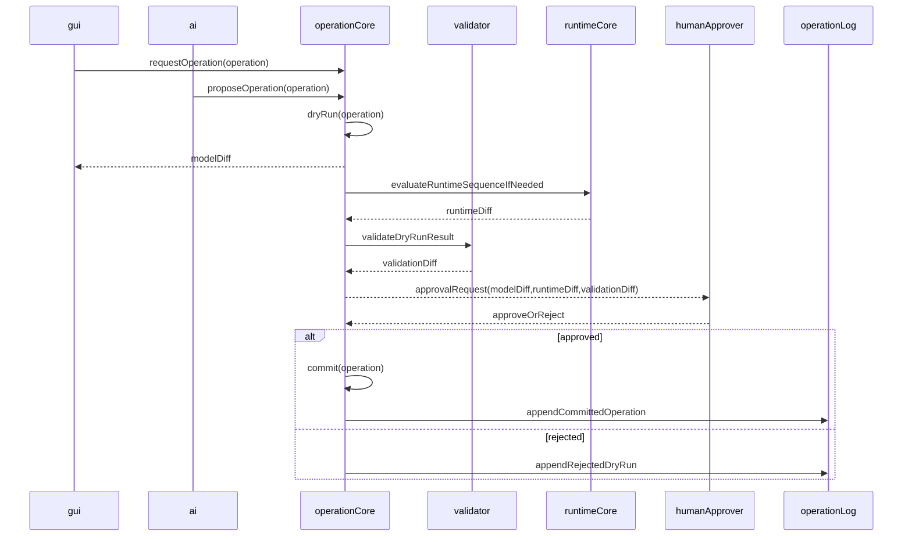
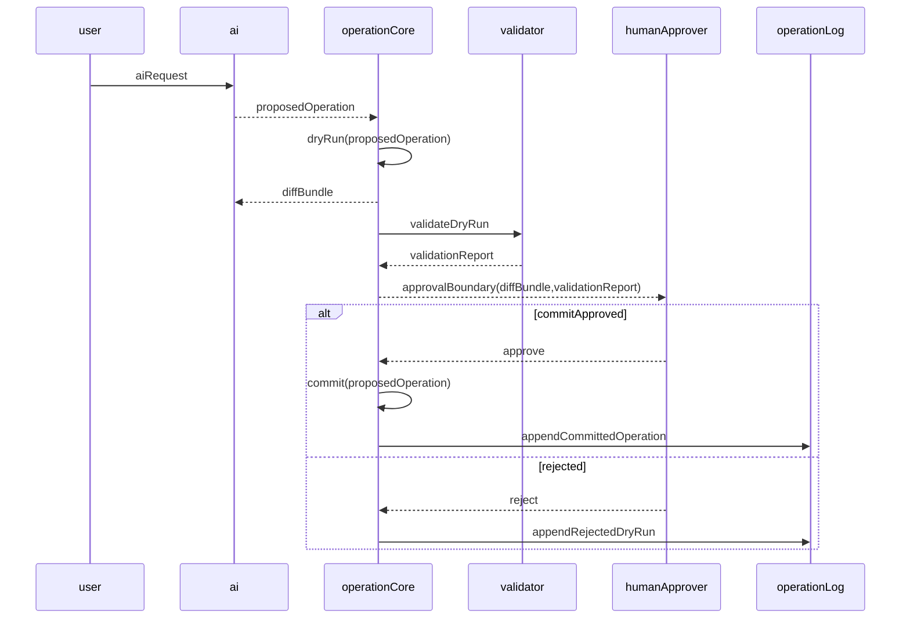

# Operation Policy

## Status

Accepted

## Purpose

This policy defines the only allowed mutation path for model packages in the Private 2D Rigging Lab / Prototype. GUI actions, AI suggestions, validator repairs, tests, and acceptance workflows must route package-changing work through Operation Core.

It prevents direct package JSON mutation, AI commits without human approval, unclear dry-run versus commit behavior, missing diffs, missing validation, and operation logs that cannot explain why a package changed.

## Scope

### Applies to

- Operation Core implementation in the fixed monorepo.
- GUI commands that create, update, or delete model package content.
- AI assistant proposed operations and dry-runs.
- Validator repair suggestions when they are represented as operations.
- Test fixtures and acceptance runner flows that mutate model packages.
- Operation logs, model diffs, runtime diffs, validation diffs, approval evidence, and commit evidence.

### Actors

- GUI implementer
- AI assistant implementer
- Operation Core implementer
- Validator implementer
- Test and acceptance runner implementer
- Human approver
- Clean Context Reviewer

### Does not apply to

- Runtime-only evaluation that does not mutate a model package, except where Operation Core records evidence operations such as `runDynamicsPreviewSequence`.
- Post-MVP undo/redo behavior beyond the MVP decision recorded in this policy.
- Cubism file import/export, Cubism SDK/Core behavior, Cubism Viewer consistency, Cubism Physics compatibility, or existing Cubism models as oracle sources.

## Source Documents

### Primary

- `discussion/development_convention/basis/00_overview.md`
- `discussion/development_convention/basis/01_common_policy_template.md`
- `discussion/development_convention/basis/02_p0_policy_specs.md`
- `discussion/development_convention/basis/04_required_diagrams_and_tables.md`
- `discussion/_conventions.md`
- `discussion/design/module-contracts/operation-contracts.md`
- `discussion/design/module-contracts/gui-operation-contract.md`
- `discussion/design/module-contracts/ai-command-contract.md`
- `discussion/design/module-contracts/validator-contract.md`
- `discussion/design/module-contracts/runtime-core-contract.md`
- `discussion/design/module-contracts/traceability-matrix.md`
- `discussion/tests/test_basis.md`

### Supporting

- `discussion/acceptance-criteria/`
- `discussion/scenarios/`
- `discussion/tests/fixtures/`
- `discussion/tests/expected/`
- `discussion/tests/traceability/`
- `discussion/demo/streaming-demo-policy.md`
- `discussion/proposal/live2d-feature-proposal-template.md`

### Not implementation, test, or acceptance oracle

- `discussion/reports/**`
- Cubism SDK/Core behavior.
- Cubism Viewer output.
- Cubism Editor UI behavior.
- Cubism file formats.
- Cubism Physics compatibility.
- Official, third-party, or existing Cubism models.

## Required Decisions

### DEC-OP-001: Operation Core as mutation gateway

#### Question

What is the required path for model package mutation?

#### Decision

All model package mutation must pass through Operation Core. GUI, AI, validator repair, tests, and acceptance runner must not mutate package data directly.

#### Rationale

A single mutation gateway makes diffs, validation, approval, operation logs, and review evidence consistent.

#### Alternatives considered

- GUI-owned direct edits: rejected because they bypass Operation Core evidence.
- AI direct patching: rejected because it bypasses approval and validation.
- Validator direct repair: rejected because it bypasses operation logging.

#### Impact

Every mutating workflow must produce an operation result with model diff, validation result or validation diff, and operation log entry.

### DEC-OP-002: Dry-run and commit boundary

#### Question

How are dry-run and committed operations separated?

#### Decision

Dry-run operations compute proposed effects without changing the package revision. Commit operations apply an approved operation to produce a new package revision.

Dry-run output must include:

- proposed operation.
- model diff.
- runtime diff when runtime-visible behavior may change.
- validation diff or validation report.
- approval requirement.
- generated evidence refs.

Commit output must include:

- committed operation.
- before and after revision.
- model diff.
- validation report.
- operation log entry.
- generated evidence refs.

#### Rationale

Dry-run output lets a human or test inspect the proposed change before mutation. Commit output proves what changed.

#### Alternatives considered

- Commit first and validate after: rejected because invalid changes can become package state.
- Dry-run without diffs: rejected because reviewers cannot understand the change.

#### Impact

Tests must assert that dry-run does not change package revision and commit does.

### DEC-OP-003: AI operation boundary

#### Question

What may the AI assistant do to a model package?

#### Decision

AI may request, propose, and dry-run operations. AI must not commit without human approval and must not mutate package data directly.

#### Rationale

AI suggestions are useful for authoring assistance, but package mutation must remain explicit, reviewable, and approval-bound.

#### Alternatives considered

- AI autonomous commit: rejected for MVP.
- AI direct JSON editing: rejected because it bypasses Operation Core.

#### Impact

AI flows must produce AI dry-run evidence and approval evidence before commit.

### DEC-OP-004: Operation log

#### Question

What must operation logs contain?

#### Decision

Operation logs must include at least:

- `operationId`
- actor
- surface
- target
- payload
- `dryRun`
- approval status
- before revision
- after revision for commit
- generated evidence refs
- model diff ref
- runtime diff ref when applicable
- validation report or validation diff ref

#### Rationale

Operation logs are the audit trail that lets Clean Context Review reconstruct why and how a package changed.

#### Alternatives considered

- Console-only logs: rejected because they are not durable evidence.
- Commit message only: rejected because it lacks structured evidence refs.

#### Impact

Operation result artifacts and acceptance evidence must reference operation logs.

### DEC-OP-005: Runtime sequence operation

#### Question

How are runtime/evidence operations that do not mutate packages handled?

#### Decision

Runtime/evidence operations such as `runDynamicsPreviewSequence` are non-mutating operations. They may be routed through Operation Core to produce operation logs, RuntimeState sequence artifacts, runtime diffs, and validation reports, but they must not change package revision.

#### Rationale

Runtime preview evidence needs the same auditability as package mutation without pretending that the model package changed.

#### Alternatives considered

- Treat runtime preview as package mutation: rejected because it creates false revisions.
- Run preview outside Operation Core with no evidence: rejected for replay and review.

#### Impact

Operation Type Table must distinguish mutating and non-mutating evidence operations.

### DEC-OP-006: Undo and redo

#### Question

Is undo/redo part of MVP operation semantics?

#### Decision

Undo/redo is Post-MVP unless a later accepted policy explicitly promotes it. MVP operation logs must still contain enough before/after revision information to support future undo/redo design.

#### Rationale

MVP needs reliable mutation, diffs, validation, and evidence before adding history editing semantics.

#### Alternatives considered

- Full undo/redo in MVP: rejected as unnecessary for P0 implementation start.

#### Impact

Tests must not require undo/redo for MVP acceptance. Reviewers may require durable before/after revision evidence.

## Required Diagrams

### Operation Mutation Flow



### AI Dry-run Flow



## Required Tables

### Operation Type Table

| Operation type | Mutates package? | Requires approval? | Evidence | Actor allowed |
| --- | --- | --- | --- | --- |
| `package.edit` | yes | yes for AI, conditional for GUI/test profiles | operation log, model diff, validation report | GUI, AI dry-run, test |
| `validator.repair.propose` | no | no | proposed operation, validation report | validator, AI, test |
| `validator.repair.commit` | yes | yes | approval evidence, operation log, model diff, validation report | human-approved GUI/test flow |
| `runDynamicsPreviewSequence` | no | no unless initiated from AI proposal requiring user confirmation | operation log, RuntimeState sequence artifact, runtime diff, validation report | GUI, AI dry-run, test, acceptance runner |
| `ai.proposeOperation` | no | no for proposal, yes before commit | AI dry-run response, diff bundle, validation report | AI |
| `package.commitApprovedOperation` | yes | yes | approval evidence, operation log, before/after revision, model diff | Operation Core |

### Actor Permission Table

| Actor | May dry-run | May commit | Conditions |
| --- | --- | --- | --- |
| GUI | yes | yes | Must call Operation Core; commit policy may require explicit user action. |
| AI | yes | no | May propose and dry-run only; human approval required for commit. |
| Validator | yes | no | May propose repair operations; must not mutate package directly. |
| Test runner | yes | yes | Only through Operation Core and only inside controlled test fixture setup. |
| Acceptance runner | yes | conditional | May commit only when the scenario explicitly requires a mutation and evidence is captured. |
| Human approver | no | approves only | Approval is recorded; Operation Core performs the commit. |
| Runtime Core | no | no | Runtime Core evaluates only and never mutates package data. |

### Operation Result Artifact Table

| Artifact | Produced by | Required? | Used by |
| --- | --- | --- | --- |
| operation log | Operation Core | yes | Clean Context Review, acceptance runner, audit trail |
| model diff | Operation Core | yes for mutating dry-run and commit | GUI, AI review, tests, reviewer |
| runtime diff | Runtime Core via Operation Core | yes when runtime-visible behavior may change | runtime tests, reviewer, acceptance runner |
| validation diff | Validator via Operation Core | yes for dry-run when validation result changes | GUI, AI review, reviewer |
| validation report | Validator via Operation Core | yes for commit and runtime evidence operations | acceptance runner, reviewer |
| AI dry-run response | AI and Operation Core | yes for AI proposed changes | human approver, reviewer |
| approval evidence | GUI or approval surface via Operation Core | yes before AI-originated commit | operation log, reviewer |
| before/after revision record | Operation Core | yes for commit | future undo/redo design, audit trail |
| RuntimeState sequence artifact | Runtime Core via Operation Core | yes for `runDynamicsPreviewSequence` | deterministic replay, runtime review |

## Rules

- Operation Core is the only model package mutation gateway.
- GUI must request operations through Operation Core instead of editing package data directly.
- AI may propose and dry-run operations but must not commit without human approval.
- Validator repair must be represented as proposed operations, not direct mutation.
- Dry-run must not change package revision.
- Commit must produce a new revision only after the operation passes required validation and approval checks.
- Mutating dry-runs and commits must produce model diffs.
- Runtime-visible operations must produce runtime diffs or an explicit evidence note explaining why runtime output is unchanged.
- Dry-run must produce validation diff or validation report evidence.
- Commit must append a durable operation log entry.
- Non-mutating runtime/evidence operations must be logged when they are used as acceptance evidence.
- Machine-readable operation IDs, actor IDs, target kinds, fixture IDs, test IDs, and artifact IDs must contain no spaces.

## Forbidden

- Direct model package mutation by GUI, AI, validator, tests, or acceptance runner outside Operation Core.
- AI commit without human approval.
- Treating dry-run as commit.
- Commit without operation log.
- Commit without required validation evidence.
- Mutating operation without model diff.
- Runtime-visible operation without runtime diff or explicit unchanged-runtime evidence.
- Use of Cubism formats, Cubism SDK/Core, Cubism Viewer consistency, Cubism Physics compatibility, or existing Cubism models as operation oracle.
- `.physics3.json` import/export or Cubism Physics compatibility operation types in MVP.
- Machine-readable identifiers with spaces.

## Required Evidence

- operation log
- model diff
- runtime diff when runtime-visible behavior may change
- validation diff for dry-run where applicable
- validation report
- AI dry-run response for AI-originated operations
- approval evidence before AI-originated commit
- before and after revision for commit
- RuntimeState sequence artifact for runtime sequence operations
- rejection log for rejected dry-runs when evidence was presented for review

## Review Checklist

### Blocking

- [ ] Every package mutation goes through Operation Core.
- [ ] GUI does not directly mutate package data.
- [ ] AI cannot commit without human approval.
- [ ] Validator repair does not directly mutate package data.
- [ ] Dry-run and commit are distinct in API, evidence, and revision behavior.
- [ ] Mutating operations produce model diffs.
- [ ] Runtime-visible operations produce runtime diffs or explicit unchanged-runtime evidence.
- [ ] Validation evidence is produced before commit.
- [ ] Operation logs include actor, surface, target, payload, dry-run flag, approval status, revisions, and evidence refs.
- [ ] MVP does not include Cubism file operations, Cubism Physics compatibility, or `.physics3.json` import/export.
- [ ] Machine-readable identifiers contain no spaces.

## Conflict Handling

Conflicts must not be resolved by implementation invention. If source documents disagree, record the issue in this format and block the affected implementation or test until the source of truth is corrected.

```md
# Conflict Resolution Log

## CONFLICT-0001

### Found in
- `path/to/file-a.md`
- `path/to/file-b.md`

### Conflict
A says ...
B says ...

### Impact
Implementation / test / acceptance impact.

### Decision
Adopted interpretation or correction plan. Use `Unresolved` when no decision exists.

### Source of truth after resolution
File that is authoritative after resolution.

### Changed files
- ...

### Reviewer
- ...
```

Known unresolved items for this policy:

| Conflict ID | Found in | Conflict | Impact | Decision | Source of truth after resolution | Changed files | Reviewer |
| --- | --- | --- | --- | --- | --- | --- | --- |
| None | N/A | No conflict recorded while drafting this policy. | N/A | N/A | N/A | N/A | N/A |

## Change Process

- Changes to this policy must preserve the common template sections.
- Any new mutating actor must be added to the Actor Permission Table before implementation.
- Any new mutating operation type must define approval, diff, validation, and operation log evidence before implementation.
- AI commit permissions cannot be expanded without explicit policy update and review.
- Undo/redo cannot enter MVP by implementation inference; it requires an accepted policy change.
- Any conflict discovered during implementation or review must be recorded before code or test behavior is changed.

## Completion Gate

- [ ] All Required Decisions are answered.
- [ ] All Required Diagrams are present and include the required elements.
- [ ] All Required Tables are present and include the required columns.
- [ ] Operation Core is defined as the only mutation gateway.
- [ ] Dry-run, commit, and approval boundaries are defined.
- [ ] AI propose/dry-run/commit limits are explicit.
- [ ] Model diff, runtime diff, validation diff/report, approval evidence, and operation log requirements are explicit.
- [ ] Non-mutating runtime sequence operations are covered.
- [ ] MVP undo/redo status is defined.
- [ ] Forbidden Cubism oracle and MVP operation constraints are explicit.
- [ ] Conflict Handling includes the Conflict Resolution Log format.
