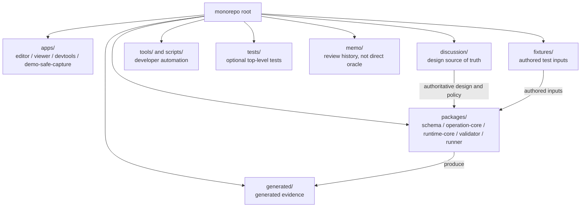
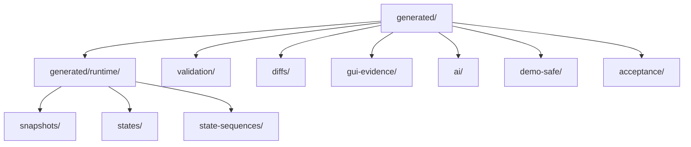
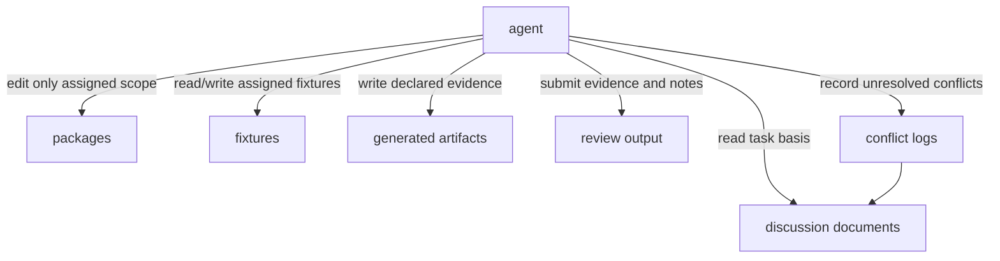

# Repository Structure Policy

## Status

Accepted

## Purpose

This policy defines the monorepo structure for the Private 2D Rigging Lab / Prototype, including top-level directories, package responsibilities, fixture placement, generated artifact placement, discussion document placement, and agent visibility.

It prevents schema, runtime, validator, tests, fixtures, generated evidence, and documentation from evolving under different assumptions. It also prevents authored source from being mixed with generated artifacts and prevents accidental placement of Cubism compatibility dependencies or oracle materials.

This policy is required before MVP implementation because implementation, tests, generated evidence, and Clean Context Review need stable paths and ownership rules.

## Scope

### Applies to

- Monorepo root
- `apps/**`
- `packages/**`
- `fixtures/**`
- `generated/**`
- `discussion/**`
- `tools/**`
- `scripts/**`
- `tests/**`, if used as a separate top-level directory
- `memo/**`, if retained for review history

### Actors

- Repository maintainer
- Implementation agent
- Test author
- Fixture author
- Acceptance runner author
- Clean Context Reviewer
- Policy maintainer

### Does not apply to

- Multi-repo layouts
- External distribution packaging
- Cubism SDK/Core, Cubism format import/export, Cubism Viewer compatibility, or Cubism Physics compatibility modules

## Source Documents

### Primary

- `discussion/_conventions.md`
- `discussion/development_convention/basis/00_overview.md`
- `discussion/development_convention/basis/01_common_policy_template.md`
- `discussion/development_convention/basis/02_p0_policy_specs.md`
- `discussion/development_convention/basis/04_required_diagrams_and_tables.md`
- `discussion/development_convention/source-of-truth-policy.md`
- `discussion/design/module-contracts/**`
- `discussion/tests/**`

### Supporting

- `discussion/acceptance-criteria/**`
- `discussion/scenarios/**`
- `discussion/demo/streaming-demo-policy.md`
- `discussion/proposal/live2d-feature-proposal-template.md`

### Not implementation, test, or acceptance oracle

- `discussion/reports/**`
- Cubism formats, including `.moc3`, `.cmo3`, `.model3.json`, `.motion3.json`, `.physics3.json`, and `.pose3.json`
- Cubism SDK/Core behavior
- Cubism Viewer output
- Cubism Physics compatibility
- Existing Cubism models, official samples, third-party Live2D models, and nizima assets

## Required Decisions

### DEC-REPO-001: Monorepo topology

#### Question

Should implementation be split across repositories?

#### Decision

No. The repository topology is fixed as a monorepo.

#### Rationale

Agent-driven implementation needs schema, runtime, validator, fixtures, tests, discussion documents, generated evidence, and review outputs visible in one workspace. Cross-module changes must update contracts, code, tests, fixtures, and documentation in the same patch or review bundle.

#### Alternatives considered

Multi-repo was rejected because it makes DTO alignment, fixture reuse, generated evidence review, and subagent context handoff harder.

#### Impact

All P0 implementation modules, fixtures, generated evidence, and development conventions must live under one workspace root.

### DEC-REPO-002: Top-level directory layout

#### Question

Which top-level directories are reserved?

#### Decision

The monorepo reserves `apps/`, `packages/`, `fixtures/`, `generated/`, `discussion/`, `tools/`, `scripts/`, optional `tests/`, and optional `memo/`.

#### Rationale

The layout separates applications, reusable packages, authored fixtures, generated evidence, design memory, developer tools, scripts, tests, and historical review records.

#### Alternatives considered

Putting fixtures under each package was rejected for shared MVP acceptance fixtures because acceptance and replay need a stable cross-module fixture root.

#### Impact

New root directories require policy update or Conflict Resolution Log entry.

### DEC-REPO-003: Apps layout

#### Question

Where should user-facing and developer-facing apps live?

#### Decision

Apps live under `apps/`, with expected paths:

- `apps/editor/`
- `apps/viewer/`
- `apps/devtools/`
- `apps/demo-safe-capture/`

#### Rationale

Apps are entrypoints and should depend on packages rather than define core DTOs or runtime semantics.

#### Alternatives considered

Embedding apps under `packages/` was rejected because it blurs app entrypoints and reusable modules.

#### Impact

Apps must not become source-of-truth owners for schema, runtime semantics, validation rules, or operation mutation rules.

### DEC-REPO-004: Packages layout

#### Question

Which package boundaries are expected before implementation?

#### Decision

The expected P0 package roots are:

- `packages/schema/`
- `packages/package-format/`
- `packages/operation-core/`
- `packages/runtime-core/`
- `packages/validator/`
- `packages/ai-command/`
- `packages/gui-core/`
- `packages/fixture-tools/`
- `packages/acceptance-runner/`
- `packages/demo-safe-tools/`

#### Rationale

These paths align implementation responsibility with module contracts and review boundaries.

#### Alternatives considered

A single package was rejected because it would hide module boundaries and make Clean Context Review weaker.

#### Impact

Package dependencies must follow the Package Responsibility Table and later Module Boundary Policy.

### DEC-REPO-005: Fixture placement

#### Question

Where are authored fixtures stored?

#### Decision

Authored fixtures live under `fixtures/`, separated by fixture type:

- `fixtures/source/`
- `fixtures/packages/`
- `fixtures/invalid/`
- `fixtures/runtime/`
- `fixtures/dynamics-sequences/`
- `fixtures/gui-evidence/`
- `fixtures/ai-dry-run/`
- `fixtures/demo-safe/`
- `fixtures/rights-provenance/`

#### Rationale

Fixtures are authored inputs and must not be mixed with generated evidence.

#### Alternatives considered

Placing fixtures under `generated/` was rejected because generated evidence is disposable and reproducible while fixtures are authored test inputs.

#### Impact

Fixtures must be rights-clean and project-defined. Existing Cubism models and official or third-party Live2D assets are forbidden.

### DEC-REPO-006: Generated artifact placement

#### Question

Where are generated artifacts stored?

#### Decision

Generated evidence lives under `generated/`:

- `generated/runtime/snapshots/`
- `generated/runtime/states/`
- `generated/runtime/state-sequences/`
- `generated/validation/`
- `generated/diffs/`
- `generated/gui-evidence/`
- `generated/ai/`
- `generated/demo-safe/`
- `generated/acceptance/`

Runtime state artifacts and runtime state sequence artifacts are distinct. Package-internal paths such as `runtime/states/` are generated evidence, not authored source.

#### Rationale

Acceptance requires repeatable evidence without mixing generated output into authored model or source directories.

#### Alternatives considered

Committing generated artifacts beside source files was rejected except where an accepted test policy explicitly requires checked-in golden artifacts.

#### Impact

Generated artifact producers and consumers must be declared. Acceptance runner use must be explicit.

### DEC-REPO-007: Discussion and design document placement

#### Question

How is `discussion/` used from implementation?

#### Decision

`discussion/` is the source location for design, AC, scenarios, test design, development conventions, demo policy, proposal policy, and research archive. Runtime code must not depend on `discussion/` at runtime.

#### Rationale

Design memory must be visible to agents and reviewers, but implementation packages must not import discussion documents as runtime dependencies.

#### Alternatives considered

Embedding design documents inside implementation packages was rejected because it fragments source authority.

#### Impact

Implementation must cite discussion documents in review evidence, not load them as runtime inputs.

### DEC-REPO-008: Tool visibility for agents

#### Question

What must agents be able to see and edit?

#### Decision

Agents must be given explicit read and write scope per task. Standard implementation context includes relevant `discussion/`, `packages/`, `fixtures/`, `generated/`, tests, and review output paths. Write access must be limited to the task scope.

#### Rationale

Agent work needs context breadth for correctness and write narrowness for repository safety.

#### Alternatives considered

Allowing agents to freely edit any repository path was rejected because unrelated changes and conflicting edits are likely in a shared workspace.

#### Impact

Handoffs must state source documents, editable paths, generated output paths, required evidence, and conflict logging rules.

## Required Diagrams

### Monorepo Layout



### Generated Artifact Placement



### Workspace Visibility for Agents



## Required Tables

### Top-level Directory Responsibility Table

| Directory | Purpose | Authored / Generated | Owner | Editable by agents | Notes |
|---|---|---|---|---|---|
| `apps/` | App entrypoints for editor, viewer, devtools, and demo-safe capture | Authored | App maintainers | limited | Must depend on packages for core behavior |
| `packages/` | Reusable implementation modules | Authored | Module maintainers | limited | Must follow package and module boundary rules |
| `fixtures/` | Rights-clean authored test inputs | Authored | Test and fixture maintainers | limited | Existing Cubism models are forbidden |
| `generated/` | Runtime snapshots, states, sequences, validation reports, diffs, GUI evidence, AI evidence, demo-safe reports, acceptance results | Generated | Tooling and test maintainers | yes, for declared outputs | Not authored source |
| `discussion/` | Design, AC, scenarios, test design, policies, demo/proposal boundaries, research archive | Authored | Discussion owners | limited | Runtime code must not depend on it |
| `tools/` | Developer tools with reusable logic | Authored | Tool maintainers | limited | Must not introduce forbidden dependencies |
| `scripts/` | Thin automation entrypoints | Authored | Tool maintainers | limited | Prefer calling package/tool logic |
| `tests/` | Optional top-level test suites when not colocated | Authored | Test maintainers | limited | Must link to test design and fixtures |
| `memo/` | Review history and fix summaries | Authored | Review owners | limited | Supporting context only |

### Package Responsibility Table

| Package | Responsibility | May depend on | Must not depend on | Primary tests |
|---|---|---|---|---|
| `packages/schema/` | Shared DTO and ID definitions | none or minimal internal utilities | Apps, GUI, runtime-specific stateful code, Cubism SDK/Core | Schema validation and ID convention tests |
| `packages/package-format/` | Project-defined model package read/write semantics | `packages/schema/` | Cubism format parsers, Cubism SDK/Core, apps | Package fixture roundtrip and validation tests |
| `packages/operation-core/` | Only allowed package mutation boundary | `packages/schema/`, `packages/package-format/`, `packages/validator/` as allowed by module policy | GUI-only state, direct Cubism conversion, hidden mutation paths | Operation log, model diff, dry-run tests |
| `packages/runtime-core/` | Deterministic runtime evaluation and RuntimeStateDto transitions | `packages/schema/`, `packages/package-format/` as needed | GUI, filesystem, AI assistant, Cubism SDK/Core, Cubism Viewer | Runtime snapshot, state, state sequence, replay tests |
| `packages/validator/` | Validation reports and diagnostics for packages and evidence artifacts | `packages/schema/`, `packages/package-format/` | GUI, AI assistant, Cubism Viewer output as oracle | Validation report and diagnostic tests |
| `packages/ai-command/` | AI proposal, dry-run, and approval-boundary command handling | `packages/schema/`, `packages/operation-core/`, `packages/validator/` | Direct package mutation without operation core | AI dry-run and approval-boundary tests |
| `packages/gui-core/` | Shared GUI state, commands, and evidence capture helpers | `packages/schema/`, `packages/operation-core/`, `packages/runtime-core/`, `packages/validator/` | Defining core DTOs or bypassing operation core | GUI contract and evidence tests |
| `packages/fixture-tools/` | Fixture creation, normalization, and checks | `packages/schema/`, `packages/package-format/`, `packages/validator/` | Third-party Live2D samples, Cubism parsers | Fixture manifest and rights/provenance tests |
| `packages/acceptance-runner/` | Acceptance execution and evidence collection | `packages/schema/`, `packages/validator/`, `packages/runtime-core/`, fixture tools | Cubism Viewer or Cubism Physics oracle | Acceptance runner and traceability tests |
| `packages/demo-safe-tools/` | Demo-safe scans, redaction, provenance checks, preflight reports | `packages/schema/`, `packages/validator/` | Private implementation disclosure, forbidden term leakage | Demo-safe preflight and rights tests |

### Generated Artifact Table

| Artifact type | Path | Producer | Consumer | Authored source? | Used by acceptance runner |
|---|---|---|---|---|---|
| Runtime snapshot | `generated/runtime/snapshots/` | Runtime Core, viewer tests | Acceptance runner, reviewers | no | yes |
| Runtime state | `generated/runtime/states/` | Runtime Core | Runtime replay tests, acceptance runner | no | yes |
| Runtime state sequence | `generated/runtime/state-sequences/` | Runtime Core replay tools | Acceptance runner, deterministic replay review | no | yes |
| Validation report | `generated/validation/` | Validator | Test runner, acceptance runner, reviewers | no | yes |
| Runtime or model diff | `generated/diffs/` | Operation core, runtime tools, test tools | Reviewers, acceptance runner | no | yes |
| GUI evidence | `generated/gui-evidence/` | GUI tests or capture tools | Reviewers, acceptance runner when required | no | conditional |
| AI dry-run evidence | `generated/ai/` | AI command package | Reviewers, acceptance runner for AI scenarios | no | conditional |
| Demo-safe preflight report | `generated/demo-safe/` | Demo-safe tools | Demo reviewers, acceptance runner for demo-safe scenarios | no | conditional |
| Acceptance runner result | `generated/acceptance/` | Acceptance runner | Reviewers and release gate | no | yes |

## Rules

- The repository is a monorepo. Multi-repo topology is not allowed for MVP implementation.
- `discussion/` is the design and policy memory, but runtime code must not import it as a runtime dependency.
- `packages/` contains implementation modules; apps must not own core DTOs, runtime semantics, validation semantics, or mutation rules.
- `fixtures/` contains authored, rights-clean inputs. Generated outputs do not belong there.
- `generated/` contains reproducible generated evidence. It is not authored source.
- RuntimeState artifacts and RuntimeState sequence artifacts must be distinct: `generated/runtime/states/` and `generated/runtime/state-sequences/`.
- Package-internal `runtime/states/`-style paths, if used by package fixtures or model packages, must be classified as generated evidence unless a later accepted policy explicitly marks them authored.
- Machine-readable IDs, package names, fixture IDs, test IDs, operation IDs, and artifact IDs must contain no spaces.
- Agent handoffs must state readable source documents, editable paths, generated output paths, and review evidence.
- Cross-module changes must update source documents, contracts, tests, fixtures, and generated evidence together when affected.

## Forbidden

- Do not introduce Cubism SDK/Core, Cubism format parser, Cubism Viewer oracle, Cubism Physics compatibility module, or existing Cubism model fixture location.
- Do not place authored source under `generated/`.
- Do not place generated acceptance evidence under `fixtures/`.
- Do not let apps mutate project packages except through Operation Core.
- Do not let runtime code depend on GUI, filesystem state, AI assistant state, Cubism SDK/Core, or Cubism Viewer output.
- Do not create new top-level directories for implementation, fixture, generated evidence, or policy authority without updating this policy or recording a blocking conflict.
- Do not use machine-readable identifiers with spaces.

## Required Evidence

- Repository layout document or patch showing the top-level directories used.
- Package responsibility table kept in sync with package creation.
- Generated artifact placement evidence for runtime snapshots, runtime states, runtime state sequences, validation reports, diffs, GUI evidence, AI dry-run evidence, demo-safe preflight reports, and acceptance runner results.
- Clean Context Review result for repository structure changes that alter package boundaries, generated artifact paths, or fixture paths.
- Conflict Resolution Log entry for any path, ownership, authored/generated, or forbidden dependency ambiguity.

## Review Checklist

- [ ] Monorepo topology is preserved.
- [ ] Top-level directories match this policy or a conflict is logged.
- [ ] Authored source and generated artifacts are separated.
- [ ] `generated/runtime/states/` and `generated/runtime/state-sequences/` are distinct.
- [ ] Package responsibilities are aligned with module contracts.
- [ ] Apps do not own core schema, runtime semantics, validation semantics, or mutation boundaries.
- [ ] Runtime code has no forbidden dependency on GUI, filesystem state, AI assistant state, Cubism SDK/Core, or Cubism Viewer output.
- [ ] Fixtures are rights-clean and do not include existing Cubism models or official/third-party Live2D samples.
- [ ] Machine-readable IDs contain no spaces.
- [ ] Agent read/write scope and generated output paths are explicit.

## Conflict Handling

### Conflict Resolution Log format

```md
# Conflict Resolution Log

## CONFLICT-0001

### Found in
- `path/to/file-a.md`
- `path/to/file-b.md`

### Conflict
A says ...
B says ...

### Impact
Implementation / test / acceptance にどう影響するか。

### Decision
採用した解釈または修正方針。未解決の場合は `Unresolved` と書く。

### Source of truth after resolution
修正後に正となるファイル。未解決の場合は `Unresolved` と書く。

### Changed files
- ...

### Reviewer
- ...
```

### Current local log

No unresolved conflicts were found while drafting this policy from the provided basis documents.

## Change Process

1. Record the reason for any repository structure change.
2. Check whether the change affects source authority, package boundaries, fixture placement, generated artifact placement, test runner behavior, or agent visibility.
3. If affected, update this policy and any relevant module contract or test design.
4. Record unresolved or conflicting path decisions in the Conflict Resolution Log format.
5. Run Clean Context Review for changes to package boundaries, generated evidence paths, or authored/generated classification.
6. Mark the policy `Accepted` only after required diagrams, tables, forbidden dependency checks, and completion gate are reviewed.

## Completion Gate

- [x] Status, Purpose, Scope, Source Documents, Required Decisions, Required Diagrams, Required Tables, Rules, Forbidden, Required Evidence, Review Checklist, Conflict Handling, Change Process, and Completion Gate are present.
- [x] Monorepo topology is fixed and explicit.
- [x] Monorepo Layout diagram is present.
- [x] Generated Artifact Placement diagram is present.
- [x] Workspace Visibility for Agents diagram is present.
- [x] Top-level Directory Responsibility Table is present.
- [x] Package Responsibility Table is present.
- [x] Generated Artifact Table is present.
- [x] Authored source and generated artifact separation is explicit.
- [x] RuntimeState and RuntimeStateSequence placement is explicit.
- [x] Cubism SDK/Core dependency and Cubism oracle paths are forbidden.
- [x] Machine-readable IDs with spaces are forbidden.
- [ ] Policy has been reviewed and marked `Accepted`.
