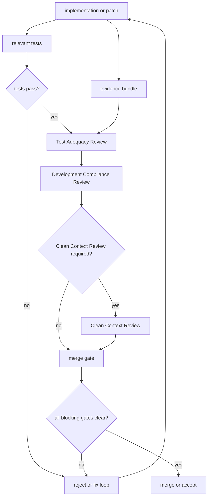
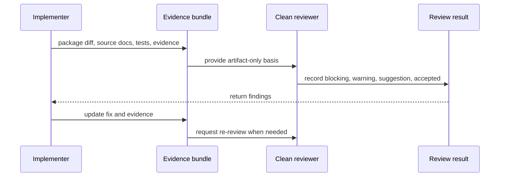

# Review and PR Policy

## Status

Accepted

## Purpose

This policy defines the review, evidence, and merge gates for implementation PRs, patches, and agent deliverables for the Private 2D Rigging Lab / Prototype.

It prevents test-free changes, review based on implementer intent instead of artifacts, missed fixture or diagnostic updates, module boundary violations, and use of candidate diagnostics or Cubism behavior as blocking oracles.

## Scope

### Applies to

- Implementation PRs and patches in the fixed monorepo.
- Agent deliverables that change implementation, tests, fixtures, generated evidence, contracts, or development conventions.
- Test Adequacy Review, Development Compliance Review, and Clean Context Review.
- Acceptance, validation, GUI, AI, demo-safe, rights/provenance, runtime, and operation evidence attached to a PR or patch.

### Actors

- Implementer
- Test author
- Integrator
- Test Adequacy Reviewer
- Development Compliance Reviewer
- Clean Context Reviewer
- Task owner

### Does not apply to

- Historical research reports under `discussion/reports/**` except as risk context.
- Direct implementation of Cubism formats, Cubism SDK/Core, Cubism Viewer consistency, Cubism Physics compatibility, or existing Cubism model behavior.

## Source Documents

### Primary

- `discussion/development_convention/basis/00_overview.md`
- `discussion/development_convention/basis/01_common_policy_template.md`
- `discussion/development_convention/basis/03_p1_policy_specs.md`
- `discussion/development_convention/basis/04_required_diagrams_and_tables.md`
- `discussion/_conventions.md`
- `discussion/acceptance-criteria/`
- `discussion/scenarios/`
- `discussion/design/module-contracts/`
- `discussion/tests/`

### Supporting

- `discussion/demo/streaming-demo-policy.md`
- `discussion/proposal/live2d-feature-proposal-template.md`

### Not implementation oracle

- `discussion/reports/**`
- Cubism SDK/Core behavior
- Cubism Viewer output
- Cubism Editor behavior
- Cubism file formats
- Cubism Physics behavior or compatibility
- Existing Cubism models
- Official Live2D/Cubism sample models

## Required Decisions

### DEC-REVIEW-001: PR / patch required sections

#### Question

What information must every PR, patch, or agent deliverable provide?

#### Decision

Every PR, patch, or agent deliverable MUST include Summary, Changed files, Related AC / Scenario / Test ID, Evidence artifacts, Tests run, Risks, Conflict log entries, and Reviewer notes.

#### Rationale

Reviewers must be able to judge the change from durable artifacts rather than conversation history or implementer intent.

#### Alternatives considered

Relying on free-form summaries only.

#### Impact

PR templates, agent handoffs, review notes, and merge gates must reject deliverables that omit required fields.

### DEC-REVIEW-002: Required review types

#### Question

Which review types are required before accepting a change?

#### Decision

Implementation review and Development Compliance Review are required for all implementation-affecting changes. Test Adequacy Review is required when tests, fixtures, acceptance, diagnostics, evidence, or oracles are affected. Clean Context Review is required for MVP acceptance changes, source-of-truth or oracle changes, cross-module contract changes, and any change the task owner marks as acceptance-critical.

#### Rationale

Different failure modes require different reviewers: code correctness, evidence adequacy, policy compliance, and context-independent acceptance.

#### Alternatives considered

One general reviewer for all changes.

#### Impact

PRs must name the required review types and attach their outcomes before merge.

### DEC-REVIEW-003: Clean Context Review definition

#### Question

What counts as Clean Context Review?

#### Decision

Clean Context Review MUST be performed by a reviewer or subagent that did not share the implementer's conversation context, work log, or private intent. The reviewer may use only accepted design, AC / Scenario, module contract, test design, development conventions, implementation diff, test evidence, generated artifacts, and explicit handoff artifacts.

#### Rationale

Acceptance must be recoverable from repository artifacts, not from transient chat context.

#### Alternatives considered

Letting the same implementer or context-sharing reviewer perform final acceptance review.

#### Impact

Clean Context Review requests must package an evidence bundle and exclude conversation-only rationale.

### DEC-REVIEW-004: Merge gate

#### Question

What must be true before a PR or patch can be merged or accepted?

#### Decision

A change can be merged or accepted only when relevant tests pass, MVP-blocking tests pass when affected, no blocking diagnostics remain, required evidence is present, required reviews are complete, and conflicts are resolved or explicitly accepted by the task owner in a Conflict Resolution Log.

#### Rationale

The prototype baseline requires evidence-first delivery and cannot rely on informal manual confirmation.

#### Alternatives considered

Merge with follow-up TODOs for missing evidence.

#### Impact

Missing evidence, missing required review, unresolved blocking conflict, or failed MVP-blocking test blocks acceptance.

### DEC-REVIEW-005: Evidence requirement

#### Question

What evidence must be attached to a review?

#### Decision

Evidence MUST include the relevant test result and, when applicable, acceptance result, validation report, operation log, runtime artifact, model or runtime diff, GUI evidence, AI dry-run evidence, demo-safe preflight report, rights/provenance report, and conflict log.

#### Rationale

Reviewers need traceable artifacts for behavior, policy compliance, and acceptance.

#### Alternatives considered

Relying on screenshots or prose summaries.

#### Impact

Evidence paths or artifact identifiers must be listed in the PR required fields.

### DEC-REVIEW-006: Review outcome categories

#### Question

How are review findings classified?

#### Decision

Review outcomes are `blocking`, `warning`, `suggestion`, and `accepted`. Machine-readable finding IDs MUST contain no spaces.

#### Rationale

Consistent severity labels make merge decisions auditable.

#### Alternatives considered

Free-form approval comments only.

#### Impact

Blocking findings must be fixed or formally resolved before merge. Warnings require recorded rationale. Suggestions do not block.

## Required Diagrams

### Diagram 1: PR Review Pipeline

This diagram shows the mandatory path from implementation through evidence and review gates to merge or rejection.



### Diagram 2: Clean Context Review Flow

This diagram shows that the clean reviewer receives artifacts, not the implementer's private conversation context.



## Required Tables

### Table 1: PR Required Field Table

| Field | Required? | Purpose |
|---|---|---|
| Summary | yes | State what changed and why. |
| Changed files | yes | Identify implementation, test, fixture, evidence, and document changes. |
| Related AC / Scenario / Test ID | yes | Connect the change to source requirements. |
| Evidence artifacts | yes | List artifact paths or IDs used for review. |
| Tests run | yes | Record commands, profiles, and results. |
| Risks | yes | Record known behavioral, review, or follow-up risks. |
| Conflict log entries | yes | Link conflicts found or state `none`. |
| Reviewer notes | yes | Record required review types and outcomes. |

### Table 2: Review Type Table

| Review type | Reviewer | Required when |
|---|---|---|
| Implementation review | Implementer peer or integrator | Any implementation-affecting change. |
| Test Adequacy Review | Clean Context Reviewer preferred | Tests, fixtures, acceptance, diagnostics, evidence, or oracles change. |
| Development Compliance Review | Clean Context Reviewer or integrator | Any implementation-affecting change. |
| Clean Context Review | Independent reviewer without implementer conversation context | MVP acceptance, source-of-truth, oracle, cross-module contract, or acceptance-critical change. |

### Table 3: Merge Gate Table

| Gate | Blocking? | Evidence |
|---|---|---|
| Required PR fields complete | yes | PR / patch description. |
| Relevant tests pass | yes | Test result. |
| MVP-blocking tests pass when affected | yes | Acceptance runner result or test result. |
| No blocking diagnostics remain | yes | Validation report or diagnostic report. |
| Required evidence present | yes | Evidence bundle. |
| Test Adequacy Review complete when required | yes | Review record. |
| Development Compliance Review complete | yes | Review record. |
| Clean Context Review complete when required | yes | Clean review record. |
| Conflicts resolved or accepted | yes | Conflict Resolution Log. |
| Warnings documented | no | Review record with rationale. |

### Table 4: Review Finding Table

| Finding type | Meaning | Required action |
|---|---|---|
| blocking | Merge or acceptance would be unsafe, non-compliant, or unproven. | Fix, split, or resolve through Conflict Resolution Log before merge. |
| warning | Acceptable only with recorded rationale or follow-up. | Record rationale and owner. |
| suggestion | Improvement that does not affect acceptance. | Optional follow-up. |
| accepted | Reviewer found no blocking issue in the reviewed scope. | Record reviewed scope and evidence. |

## Rules

### R-REVIEW-001: Required fields must be complete

Implementers MUST provide all PR Required Field Table entries before review starts.

#### Rationale

Review without traceability wastes reviewer context and hides missing evidence.

#### Evidence

- PR / patch description
- Handoff artifact

### R-REVIEW-002: Test Adequacy Review must inspect proof quality

Test Adequacy Review MUST verify that tests prove the referenced AC / Scenario / Module Contract with appropriate fixture, oracle, expected artifact, diagnostic, runtime state sequence, GUI evidence, AI dry-run evidence, and acceptance evidence.

#### Rationale

Passing tests are insufficient if the tests prove the wrong behavior.

#### Evidence

- Test Adequacy Review record
- Traceability entries
- Test result and artifacts

### R-REVIEW-003: Development Compliance Review must inspect policy boundaries

Development Compliance Review MUST verify module boundaries, operation boundaries, diagnostic classification, demo-safe and rights policy, machine-readable ID rules, and the Cubism non-oracle rule.

#### Rationale

Policy violations can pass local tests while undermining the architecture.

#### Evidence

- Development Compliance Review record
- Diff
- Evidence bundle

### R-REVIEW-004: Clean Context Review must be artifact-only

Clean Context Review MUST NOT depend on implementer conversation context, private intent, or unrecorded decisions.

#### Rationale

Future agents must be able to reproduce the review from durable artifacts.

#### Evidence

- Clean Context Review request
- Evidence bundle
- Clean Context Review result

### R-REVIEW-005: Blocking findings block merge

Any `blocking` finding MUST block merge or acceptance until fixed, split out, or resolved in a Conflict Resolution Log.

#### Rationale

Blocking findings indicate unsafe or unproven change.

#### Evidence

- Review record
- Fix diff or Conflict Resolution Log

## Forbidden

| Forbidden action | Applies to | Reason | Violation handling |
|---|---|---|---|
| Merging with missing required PR fields | Implementer, integrator | Review basis is incomplete. | blocking |
| Merging with unresolved blocking findings | Integrator, task owner | Acceptance is unsafe. | blocking |
| Treating Cubism SDK/Core behavior as an oracle | All reviewers and implementers | Project is not a Cubism-compatible editor or runtime. | blocking |
| Treating Cubism Viewer consistency as acceptance evidence | All reviewers and implementers | Viewer consistency is outside baseline. | blocking |
| Treating Cubism Physics compatibility as acceptance evidence | All reviewers and implementers | MVP uses Minimum Open Dynamics v1 only. | blocking |
| Using existing Cubism models as fixtures or acceptance oracles | Test author, reviewer | Fixtures must be rights-clean and project-defined. | blocking |
| Accepting machine-readable IDs with spaces | Implementer, reviewer | IDs must be stable and parseable. | blocking |
| Letting an MVP-blocking test depend only on candidate diagnostics | Test author, reviewer | Candidate diagnostics are not formal blocking oracles. | blocking |
| Performing Clean Context Review with implementer-only context | Clean reviewer, task owner | Breaks review independence. | blocking |

## Required Evidence

| Evidence | Producer | Consumer | Path / Ref | Required for |
|---|---|---|---|---|
| PR / patch description | Implementer | All reviewers | PR body or handoff artifact | Required fields and traceability |
| Test result | Implementer or CI | Test Adequacy Reviewer | Test output or CI artifact | Merge gate |
| Acceptance runner result | Acceptance runner | Test Adequacy Reviewer, Clean Context Reviewer | Acceptance artifact | MVP-blocking acceptance |
| Validation report | Validator | Reviewers | Validation artifact | Diagnostic and package checks |
| Operation log | Operation Core or test runner | Test Adequacy Reviewer | Operation evidence | Mutation traceability |
| Runtime artifact | Runtime Core or test runner | Test Adequacy Reviewer | Runtime snapshot/state/sequence artifact | Runtime proof |
| GUI evidence | GUI test or reviewer | Test Adequacy Reviewer | GUI evidence artifact | GUI-affecting changes |
| AI dry-run evidence | AI assistant test | Test Adequacy Reviewer | AI dry-run artifact | AI-affecting changes |
| Demo-safe preflight report | Demo preflight | Development Compliance Reviewer | Demo evidence artifact | Demo-safe changes |
| Rights/provenance report | Asset pipeline or demo preflight | Development Compliance Reviewer | Rights evidence artifact | Asset and demo changes |
| Conflict Resolution Log | Finder or task owner | Integrator, reviewers | Conflict log entry | Conflict handling |
| Review record | Reviewer | Integrator | Review comment or artifact | Merge gate |

## Review Checklist

### Blocking

- [ ] Required PR / patch fields are complete.
- [ ] Related AC / Scenario / Test ID entries are listed when applicable.
- [ ] Required evidence artifacts are attached or referenced.
- [ ] Relevant tests passed.
- [ ] MVP-blocking tests passed when affected.
- [ ] Test Adequacy Review is complete when required.
- [ ] Development Compliance Review is complete.
- [ ] Clean Context Review is complete when required.
- [ ] No unresolved blocking conflict remains.
- [ ] Cubism SDK/Core, Cubism Viewer, Cubism file formats, Cubism Physics compatibility, and existing Cubism models are not used as implementation, test, or acceptance oracles.
- [ ] Machine-readable IDs contain no spaces.

### Warning

- [ ] Warnings have an owner, rationale, and follow-up expectation.
- [ ] Non-blocking missing evidence is explicitly marked as outside the affected scope.

### Suggestion

- [ ] Suggestions are recorded separately from blocking and warning findings.

## Conflict Handling

Implementers, reviewers, and integrators MUST NOT silently resolve contradictions by invention. When AC, Scenario, Module Contract, Test Design, development convention, fixture, diagnostic, or review record conflicts, the finder MUST create or update a Conflict Resolution Log entry.

Conflicts with `blocking` severity stop merge or acceptance until resolved or explicitly accepted by the task owner. Conflicts with `warning` severity require a recorded rationale. Conflicts with `suggestion` severity may be deferred.

Conflict Resolution Log entries MUST use this format:

```md
# Conflict Resolution Log

## CONFLICT-0001: <Short title>

### Status
Open / Resolved / Superseded

### Found by
Human / Agent name / Reviewer role

### Found in
- `path/to/file-a.md`
- `path/to/file-b.md`

### Conflict
A says ...
B says ...

### Impact
How this affects implementation, test, acceptance, or review.

### Decision
Adopted interpretation or correction plan. Use `Unresolved` if no decision exists.

### Rationale
Why that decision was made.

### Source of truth after resolution
File or section that becomes authoritative after resolution.

### Changed files
- `path/to/changed-file.md`

### Required follow-up
- [ ] ...

### Reviewer
- ...

### Resolved at
YYYY-MM-DD or commit / patch reference
```

## Change Process

### When this policy may change

- Review gates change.
- Evidence requirements change.
- Test Adequacy Review, Development Compliance Review, or Clean Context Review scope changes.
- Source-of-truth, module contract, test design, or acceptance process changes.

### Required review

- Development Compliance Review is required for any change to this policy.
- Test Adequacy Review is required if test, fixture, evidence, or oracle requirements change.
- Clean Context Review is required if MVP acceptance gates, source-of-truth handling, or oracle rules change.

### Required updates

- Update affected development convention documents.
- Update PR templates or agent handoff templates when required fields change.
- Update test and acceptance documentation when review evidence changes.
- Record unresolved or conflicting requirements in Conflict Handling instead of inventing a resolution.

## Completion Gate

- [ ] Status is set.
- [ ] Purpose is clear.
- [ ] Scope is clear.
- [ ] Source Documents are listed.
- [ ] Required Decisions are complete.
- [ ] Required Diagrams are present.
- [ ] Required Tables are present.
- [ ] Rules use MUST / SHOULD / MAY language.
- [ ] Forbidden actions are explicit.
- [ ] Required Evidence is defined.
- [ ] Review Checklist is present.
- [ ] Conflict Handling is defined.
- [ ] Change Process is defined.
- [ ] PR gates include Test Adequacy Review, Development Compliance Review, Clean Context Review, evidence, conflict, and merge / reject handling.
