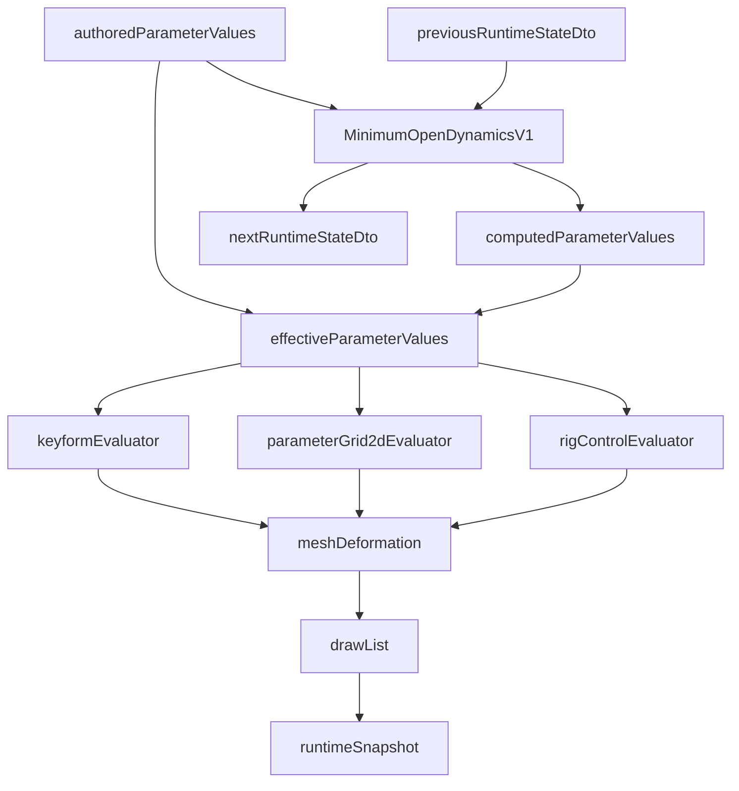
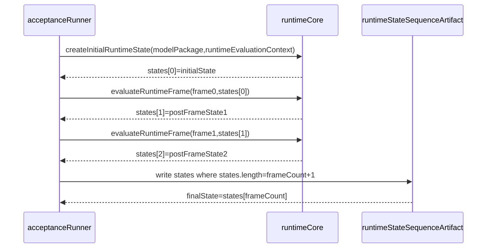
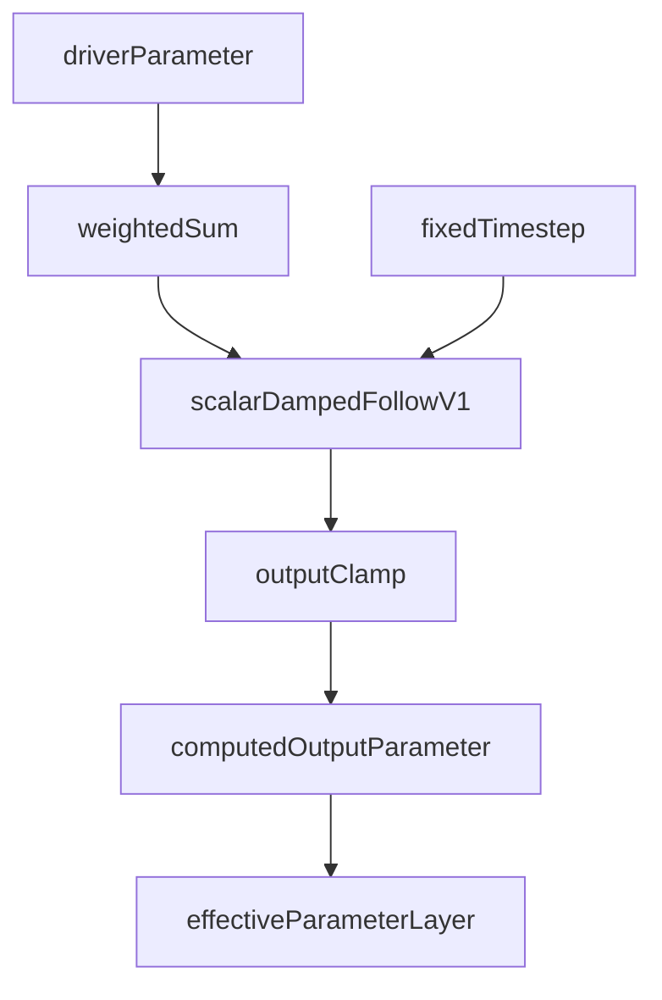

# Runtime and Dynamics Implementation Policy

## Status

Accepted

## Purpose

This policy defines implementation rules for Runtime Core, Minimum Open Dynamics v1, RuntimeState, RuntimeSnapshot, RuntimeStateSequence, runtime diffs, validation evidence, and deterministic replay in the Private 2D Rigging Lab / Prototype.

It prevents hidden mutable runtime state, non-deterministic dynamics behavior, final-state-only replay checks, dynamics code that directly mutates mesh vertices, GUI/filesystem coupling inside Runtime Core, and accidental use of Cubism Physics compatibility as an implementation or acceptance goal.

## Scope

### Applies to

- Runtime Core implementation in the fixed monorepo.
- Runtime DTOs, schema, fixtures, generated runtime artifacts, and acceptance evidence.
- Minimum Open Dynamics v1 evaluation.
- Deterministic replay tests and runtime diff generation.
- Runtime-facing validation reports.
- Runtime calls initiated by GUI, Operation Core, AI dry-run, tests, and acceptance runner.

### Actors

- Runtime implementer
- Dynamics implementer
- Operation Core implementer
- Validator implementer
- Test and acceptance runner implementer
- Clean Context Reviewer

### Does not apply to

- Direct vertex physics.
- Cloth simulation.
- Collision.
- IK.
- Timeline bake.
- Cubism Physics compatibility.
- `.physics3.json` import or export.
- Cubism SDK/Core, Cubism Viewer, Cubism formats, or existing Cubism models as oracle sources.

## Source Documents

### Primary

- `discussion/development_convention/basis/00_overview.md`
- `discussion/development_convention/basis/01_common_policy_template.md`
- `discussion/development_convention/basis/02_p0_policy_specs.md`
- `discussion/development_convention/basis/04_required_diagrams_and_tables.md`
- `discussion/_conventions.md`
- `discussion/design/module-contracts/runtime-core-contract.md`
- `discussion/design/module-contracts/operation-contracts.md`
- `discussion/design/module-contracts/validator-contract.md`
- `discussion/design/module-contracts/traceability-matrix.md`
- `discussion/tests/test_basis.md`

### Supporting

- `discussion/acceptance-criteria/`
- `discussion/scenarios/`
- `discussion/tests/strategy/`
- `discussion/tests/expected/`
- `discussion/demo/streaming-demo-policy.md`
- `discussion/proposal/live2d-feature-proposal-template.md`

### Not implementation, test, or acceptance oracle

- `discussion/reports/**`
- Cubism SDK/Core behavior.
- Cubism Viewer output.
- Cubism Editor UI behavior.
- Cubism file formats.
- Cubism Physics compatibility.
- Official, third-party, or existing Cubism models.

## Required Decisions

### DEC-RUNTIME-001: Runtime Core API

#### Question

Which API surface is the required Runtime Core boundary?

#### Decision

Runtime Core exposes, at minimum, `createInitialRuntimeState`, `evaluateRuntimeFrame`, and `evaluateRuntimeSequence`.

#### Rationale

The API separates initial state creation, single-frame evaluation, and replayable sequence evaluation so tests and acceptance evidence can verify each behavior independently.

#### Alternatives considered

- A stateful runtime object: rejected because it can hide mutable dynamics state.
- Final snapshot only: rejected because it cannot prove deterministic replay.

#### Impact

Runtime tests must cover each API. Operation Core and acceptance runner must call Runtime Core through these APIs rather than through GUI or renderer internals.

### DEC-RUNTIME-002: Explicit RuntimeStateDto

#### Question

May Runtime Core retain dynamics state internally across frames?

#### Decision

No. Runtime Core must treat `RuntimeStateDto` as explicit input and output. `evaluateRuntimeFrame` receives the previous `RuntimeStateDto` and returns the next `RuntimeStateDto` with the frame result.

#### Rationale

Explicit state makes runtime behavior replayable, serializable, diffable, and reviewable without relying on hidden in-memory state.

#### Alternatives considered

- Internal dynamics cache: rejected for deterministic replay and Clean Context Review.
- GUI-owned runtime state: rejected because Runtime Core must not depend on GUI state.

#### Impact

Generated evidence must include RuntimeState artifacts and RuntimeState sequence artifacts. Runtime implementers must make state transitions visible in DTO fields.

### DEC-RUNTIME-003: RuntimeState and RuntimeStateSequence artifacts

#### Question

How are a single RuntimeState artifact and a RuntimeState sequence artifact distinguished?

#### Decision

A RuntimeState artifact stores one `RuntimeStateDto`. A RuntimeState sequence artifact stores the ordered replay state series and frame metadata.

Required path patterns:

- `runtime/states/*.runtime-state.json`
- `runtime/state-sequences/*.runtime-state-sequence.json`

The sequence semantics are:

- `states[0] = initial state`
- `states[i + 1] = post-frame state`
- `states.length = frameCount + 1`

#### Rationale

Single-state evidence is useful for point checks, while deterministic replay requires the full sequence. Mixing the two would allow weak final-state-only tests.

#### Alternatives considered

- Store only final state: rejected.
- Store snapshots without state: rejected because dynamics memory cannot be verified.

#### Impact

Acceptance runner must compare full RuntimeState sequences for exact replay. Artifact refs must distinguish `RuntimeStateArtifactRef` from `RuntimeStateSequenceArtifactRef`.

### DEC-RUNTIME-004: Minimum Open Dynamics v1 scope

#### Question

What dynamics behavior is included in MVP?

#### Decision

Minimum Open Dynamics v1 is MVP scope and is limited to:

- driver parameter input.
- weighted sum.
- `scalarDampedFollowV1`.
- fixed timestep.
- output clamp.
- computed output parameter.
- effective parameter layer consumption.

It does not include direct vertex physics, cloth simulation, collision, IK, timeline bake, Cubism Physics compatibility, or `.physics3.json` import/export.

#### Rationale

This keeps MVP dynamics deterministic, inspectable, and independent from Cubism compatibility claims.

#### Alternatives considered

- Full physics engine: rejected as Post-MVP.
- Cubism Physics compatibility: rejected as outside the project baseline.

#### Impact

Dynamics tests must target parameter-to-parameter computation only. Mesh deformation may consume effective parameters, but dynamics must not directly write mesh vertices.

### DEC-RUNTIME-005: Parameter layers

#### Question

How are authored, computed, and effective parameter values separated?

#### Decision

Runtime evaluation uses three layers:

- `authoredParameterValues`: user-authored or operation-authored parameter input.
- `computedParameterValues`: runtime-computed outputs such as Minimum Open Dynamics v1 outputs.
- `effectiveParameterValues`: resolved values consumed by keyform, parameter-grid-2d, rigControl, and mesh deformation evaluators.

#### Rationale

Layer separation makes mutation ownership clear and avoids overwriting authored values with computed dynamics output.

#### Alternatives considered

- One shared parameter map: rejected because producer ownership becomes ambiguous.

#### Impact

Runtime diffs, validation reports, and replay evidence must identify which layer changed.

### DEC-RUNTIME-006: Deterministic replay

#### Question

What is the pass condition for exact deterministic replay?

#### Decision

Exact deterministic replay passes only when the full RuntimeState sequence and required runtime artifacts match under the accepted epsilon policy.

Required replay inputs and metadata:

- `inputFramesHash`
- `runtimeEvaluationContext`
- `evaluatorVersionSummary`
- fixed timestep
- initial `RuntimeStateDto`
- frame inputs
- epsilon policy

#### Rationale

Full-sequence comparison catches divergence that a final-state comparison can hide.

#### Alternatives considered

- Compare final RuntimeSnapshot only: rejected.
- Compare rendered pixels only: rejected for runtime correctness.

#### Impact

Replay tests must generate runtime state sequence artifacts, runtime snapshots, runtime diffs, and deterministic replay results.

### DEC-RUNTIME-007: RuntimeEvaluationContext

#### Question

Which context fields are required for runtime evaluation?

#### Decision

Runtime evaluation must receive an explicit `runtimeEvaluationContext` containing at least:

- `source.surface`
- `source.operationId`
- `policy.strictness`
- `policy.default({})`

#### Rationale

Context makes evaluation mode, caller, and strictness visible without coupling Runtime Core to GUI, filesystem, or agent state.

#### Alternatives considered

- Process-global runtime mode: rejected because it is hidden mutable state.

#### Impact

Operation logs, runtime artifacts, and validation reports must preserve enough context to reproduce runtime evaluation.

## Required Diagrams

### Runtime Evaluation Pipeline



### RuntimeState Sequence



### Dynamics Dataflow



## Required Tables

### Runtime API Table

| API | Input | Output | State handling | Deterministic? |
| --- | ----- | ------ | -------------- | -------------- |
| `createInitialRuntimeState` | model package, `runtimeEvaluationContext` | initial `RuntimeStateDto` | creates explicit state artifact input for frame 0 | yes |
| `evaluateRuntimeFrame` | model package, frame input, previous `RuntimeStateDto`, `runtimeEvaluationContext` | runtime frame result, next `RuntimeStateDto`, optional RuntimeSnapshotDto | no hidden mutable state; previous state in, next state out | yes |
| `evaluateRuntimeSequence` | model package, input frames, initial `RuntimeStateDto`, `runtimeEvaluationContext` | `RuntimeStateSequenceArtifact`, runtime snapshots, runtime diff candidates | writes full sequence where `states.length = frameCount + 1` | yes |

### Parameter Layer Table

| Layer | Producer | Consumer | Mutable by | Evidence |
| --- | --- | --- | --- | --- |
| `authoredParameterValues` | model package, approved Operation Core commit | Minimum Open Dynamics v1, effective parameter resolver | Operation Core only | model diff, operation log |
| `computedParameterValues` | Runtime Core dynamics evaluator | effective parameter resolver | Runtime Core only for the current evaluation result | RuntimeStateDto, runtime diff |
| `effectiveParameterValues` | Runtime Core parameter resolver | keyform, parameter-grid-2d, rigControl, mesh deformation | derived only; not directly mutated | RuntimeSnapshotDto, runtime diff |

### Dynamics Scope Table

| Feature | MVP? | Reason | Future status |
| --- | --- | --- | --- |
| driver parameter | yes | Required input to Minimum Open Dynamics v1 | MVP |
| weighted sum | yes | Required simple aggregation model | MVP |
| `scalarDampedFollowV1` | yes | Required deterministic follow behavior | MVP |
| fixed timestep | yes | Required for deterministic replay | MVP |
| output clamp | yes | Required bounded computed output | MVP |
| computed output parameter | yes | Required output handoff to effective layer | MVP |
| direct vertex physics | no | Violates parameter-to-parameter MVP scope | Post-MVP only by new policy |
| cloth simulation | no | Outside deterministic MVP scope | Post-MVP |
| collision | no | Outside deterministic MVP scope | Post-MVP |
| IK | no | Outside Minimum Open Dynamics v1 | Post-MVP |
| timeline bake | no | Not required for MVP replay | Post-MVP |
| Cubism Physics compatibility | no | Not project baseline and not oracle | Not MVP |
| `.physics3.json` import/export | no | Cubism format handling is forbidden for MVP | Not MVP |

### Replay Evidence Table

| Evidence | Required for exact replay? | Purpose | Path / field |
| --- | --- | --- | --- |
| Initial `RuntimeStateDto` | yes | Start replay from explicit state | `runtime/states/*.runtime-state.json` or sequence `states[0]` |
| Full RuntimeState sequence | yes | Prove every post-frame state | `runtime/state-sequences/*.runtime-state-sequence.json` |
| `inputFramesHash` | yes | Prove the same frame inputs were used | sequence metadata |
| `runtimeEvaluationContext` | yes | Prove same source and strictness | sequence metadata |
| `evaluatorVersionSummary` | yes | Prove same evaluator versions | sequence metadata |
| epsilon policy | yes | Define numeric comparison tolerance | replay result metadata |
| RuntimeSnapshotDto | yes | Show evaluated drawable result | generated runtime snapshot path |
| RuntimeDiff | yes | Explain replay differences | generated runtime diff path |
| validation report | yes | Confirm runtime artifact validity | generated validation report path |

## Rules

- Runtime Core must be pure with respect to model package mutation.
- Runtime Core must not depend on GUI, filesystem, process-global runtime mode, or AI assistant state.
- `RuntimeStateDto` is an explicit input and output of frame evaluation.
- RuntimeState artifacts and RuntimeState sequence artifacts are separate evidence types.
- Deterministic replay must compare full RuntimeState sequences, not only final state or rendered output.
- Minimum Open Dynamics v1 writes computed output parameters only.
- Mesh deformation consumes effective parameters and is not directly written by dynamics.
- Runtime diffs must identify changed state, snapshot, and parameter-layer fields.
- Validation reports must be generated for runtime artifacts used in acceptance evidence.
- Machine-readable IDs, operation IDs, fixture IDs, check IDs, artifact IDs, and target kinds must contain no spaces.

## Forbidden

- Hidden mutable dynamics or runtime state inside Runtime Core.
- Direct package mutation from Runtime Core.
- Dynamics directly writing mesh vertices.
- Direct vertex physics, cloth, collision, IK, timeline bake, Cubism Physics compatibility, or `.physics3.json` import/export in MVP.
- Treating Cubism formats, Cubism SDK/Core, Cubism Viewer consistency, Cubism Physics compatibility, or existing Cubism models as implementation, test, or acceptance oracles.
- Final-state-only deterministic replay claims.
- Runtime tests that depend on GUI rendering as the only oracle.
- Machine-readable identifiers with spaces.

## Required Evidence

- `RuntimeStateDto`
- `RuntimeSnapshotDto`
- `RuntimeStateSequenceArtifact`
- RuntimeDiff
- deterministic replay result
- validation report
- `inputFramesHash`
- `runtimeEvaluationContext`
- `evaluatorVersionSummary`
- epsilon policy reference
- operation log reference when runtime evaluation is triggered by Operation Core

## Review Checklist

### Blocking

- [ ] Runtime Core keeps no hidden mutable state.
- [ ] `RuntimeStateDto` is explicit input and output for frame evaluation.
- [ ] RuntimeState artifacts and RuntimeState sequence artifacts are distinct.
- [ ] RuntimeState sequence semantics match `states.length = frameCount + 1`.
- [ ] Exact replay compares the full RuntimeState sequence.
- [ ] Minimum Open Dynamics v1 is limited to parameter-to-parameter computation.
- [ ] Dynamics does not directly write mesh vertices.
- [ ] Runtime Core does not depend on GUI, filesystem, AI state, or process-global mode.
- [ ] Cubism formats, Cubism SDK/Core, Cubism Viewer, Cubism Physics compatibility, and existing Cubism models are not used as oracles.
- [ ] Machine-readable identifiers contain no spaces.

## Conflict Handling

Conflicts must not be resolved by implementation invention. If source documents disagree, record the issue in this format and block the affected implementation or test until the source of truth is corrected.

```md
# Conflict Resolution Log

## CONFLICT-0001

### Found in
- `path/to/file-a.md`
- `path/to/file-b.md`

### Conflict
A says ...
B says ...

### Impact
Implementation / test / acceptance impact.

### Decision
Adopted interpretation or correction plan. Use `Unresolved` when no decision exists.

### Source of truth after resolution
File that is authoritative after resolution.

### Changed files
- ...

### Reviewer
- ...
```

Known unresolved items for this policy:

| Conflict ID | Found in | Conflict | Impact | Decision | Source of truth after resolution | Changed files | Reviewer |
| --- | --- | --- | --- | --- | --- | --- | --- |
| None | N/A | No conflict recorded while drafting this policy. | N/A | N/A | N/A | N/A | N/A |

## Change Process

- Changes to this policy must preserve the common template sections.
- Changes that expand MVP dynamics scope require updates to acceptance criteria, scenarios, module contracts, tests, and this policy.
- Changes that introduce Post-MVP dynamics features must not be treated as MVP implementation permission.
- Any change touching RuntimeState sequence semantics must update runtime schema, fixtures, replay tests, and acceptance evidence expectations together.
- Any conflict discovered during implementation or review must be recorded before code or test behavior is changed.

## Completion Gate

- [ ] All Required Decisions are answered.
- [ ] All Required Diagrams are present and include the required elements.
- [ ] All Required Tables are present and include the required columns.
- [ ] `RuntimeStateDto` is explicit input and output.
- [ ] RuntimeState artifact and RuntimeState sequence artifact semantics are defined.
- [ ] Minimum Open Dynamics v1 scope is defined as MVP.
- [ ] Forbidden MVP dynamics and Cubism oracle constraints are explicit.
- [ ] Required Evidence is sufficient for Clean Context Review.
- [ ] Review Checklist contains blocking runtime and dynamics checks.
- [ ] Conflict Handling includes the Conflict Resolution Log format.
