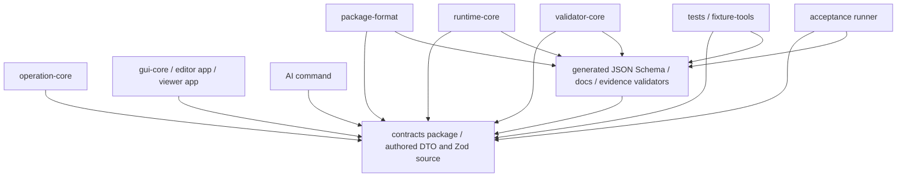

# Schema and ID Conventions

## Status

Accepted

## Purpose

This policy defines DTO, schema, enum, diagnostic ID, fixture ID, test ID, artifact reference, and machine-readable ID conventions for the Private 2D Rigging Lab / Prototype.

It prevents schema drift, DTO/schema naming mismatch, invalid artifact references, formal/candidate diagnostic confusion, and IDs such as `rig control` that contain spaces. It also separates authored schema boundaries from generated schema/artifact boundaries before MVP implementation starts.

## Scope

### Applies to

- External DTOs and schemas owned by the future `contracts` package.
- Project-defined package schemas under `package-format`.
- Runtime, operation, validator, GUI, AI, fixture, acceptance, and demo-safe artifact references.
- Machine-readable IDs in enum values, check IDs, fixture IDs, test IDs, target kinds, file identifiers, operation IDs, artifact refs, and generated evidence.
- Future files under `packages/**`, `apps/**`, `fixtures/**`, `generated/**`, `tests/**`, and package artifact directories.

### Actors

- Contracts implementer
- Package-format implementer
- Runtime implementer
- Operation implementer
- Validator implementer
- AI command implementer
- GUI implementer
- Fixture author
- Test author
- Acceptance runner implementer
- Clean Context Reviewer

### Does not apply to

- Natural-language prose, where terms such as `rig control` may use spaces.
- Historical research reports under `discussion/reports/**`.
- Cubism schemas, Cubism file formats, Cubism SDK/Core structures, Cubism Viewer output, Cubism Physics behavior, or existing Cubism model structures.

## Source Documents

### Primary

- `discussion/development_convention/basis/00_overview.md`
- `discussion/development_convention/basis/01_common_policy_template.md`
- `discussion/development_convention/basis/02_p0_policy_specs.md`
- `discussion/development_convention/basis/04_required_diagrams_and_tables.md`
- `discussion/_conventions.md`
- `discussion/design/module-contracts/typescript-contracts.md`
- `discussion/design/module-contracts/package-file-format-contract.md`
- `discussion/design/module-contracts/operation-contracts.md`
- `discussion/design/module-contracts/runtime-core-contract.md`
- `discussion/design/module-contracts/validator-contract.md`
- `discussion/design/module-contracts/ai-command-contract.md`
- `discussion/design/module-contracts/gui-operation-contract.md`
- `discussion/design/module-contracts/fixtures-and-contract-tests.md`

### Supporting

- `discussion/acceptance-criteria/03_MVP_Acceptance_Criteria.md`
- `discussion/scenarios/03_MVP_Acceptance_Criteria.md`
- `discussion/tests/expected/expected-artifacts-policy.md`
- `discussion/tests/fixtures/fixture-manifest.md`
- `discussion/tests/fixtures/fixture-manifest.json`
- `discussion/tests/traceability/test-traceability-matrix.md`
- `discussion/tests/runners/acceptance-runner-design.md`
- `discussion/tests/policies/gui-evidence-schema.md`
- `discussion/demo/streaming-demo-policy.md`
- `discussion/proposal/live2d-feature-proposal-template.md`

### Not implementation oracle

- `discussion/reports/**`
- Cubism SDK/Core behavior
- Cubism Viewer output
- Cubism Editor behavior
- Cubism file formats
- Cubism Physics behavior
- Existing Cubism models
- Official Live2D/Cubism sample models

## Required Decisions

### DEC-SCHEMA-001: DTO and Schema naming

#### Question

How are DTO types and Zod schemas named?

#### Decision

External boundary DTO types MUST use PascalCase with the `Dto` suffix. Their Zod schema constants MUST use the same base name with the `Schema` suffix.

Examples:

- `RuntimeStateDto` / `RuntimeStateDtoSchema`
- `RuntimeStateSequenceArtifactDto` / `RuntimeStateSequenceArtifactDtoSchema`
- `RuntimeStateArtifactRefDto` / `RuntimeStateArtifactRefDtoSchema`
- `ValidationReportDto` / `ValidationReportDtoSchema`
- `ProductPreflightReportDto` / `ProductPreflightReportDtoSchema`
- `ProductPreflightReportDiffDto` / `ProductPreflightReportDiffDtoSchema`
- `PackageTransportCapabilityDto` / `PackageTransportCapabilityDtoSchema`
- `CodexRiggingEditProposalDto` / `CodexRiggingEditProposalDtoSchema`
- `CodexProposalOperationCatalogDto` / `CodexProposalOperationCatalogDtoSchema`

Internal domain types MAY omit `Dto` when they are not serialized external boundaries.

#### Rationale

The naming convention keeps TypeScript DTOs, Zod schemas, tests, artifact refs, and generated schemas aligned.

#### Alternatives considered

Using schema names without `Dto` was rejected for external boundaries because it blurs DTOs and internal domain models.

#### Impact

Schema tests and contract reviews MUST verify DTO/schema name pairs for external boundaries.

### DEC-SCHEMA-002: Machine-readable ID naming

#### Question

What formats may machine-readable IDs use?

#### Decision

Machine-readable IDs MUST NOT contain spaces. Depending on ID type, they MUST use one of these formats:

- camelCase for target kinds and enum-like semantic values: `rigControl`, `dynamicsGroup`, `computedDynamics`, `scalarDampedFollowV1`.
- dot-separated lower camelCase segments for check IDs and operation names: `runtime.stateSequenceLengthMismatch`, `rigControl.rotation.create`.
- kebab-case with embedded camelCase where established by contract fixtures: `invalid-rigControl-cycle`, `minimal-dynamics-hairSway`.
- uppercase hyphenated test IDs for test cases: `TC-DYN-MISSING-DRIVER-001`.
- contract-owned prefixed stable IDs where contracts define prefixes: `rig_armLeft`, `dyn_hairSway`, `op_createRigControl001`.

Forbidden examples include `rig control`, `runtime state sequence mismatch`, and `invalid-rig control-cycle`.

#### Rationale

IDs are parsed, referenced, scanned, diffed, and validated across modules.

#### Alternatives considered

Allowing human-readable labels as IDs was rejected because it breaks stable references and automated scans.

#### Impact

ID scans MUST fail for spaces in machine-readable IDs.

### DEC-SCHEMA-003: Diagnostic ID convention

#### Question

How are diagnostic IDs named and classified?

#### Decision

Diagnostic IDs MUST use dot-separated lower camelCase segments:

- `runtime.stateSequenceLengthMismatch`
- `dynamics.outputTargetDuplicate`
- `demo.unsafeForbiddenTerm`
- `rigControl.cycle`

Each diagnostic MUST be classified as `formal` or `candidate` in the diagnostic registry or equivalent contract-owned registry. MVP blocking tests MUST NOT depend only on candidate diagnostics.

#### Rationale

Diagnostic IDs are shared by validator, runtime, GUI, AI, fixtures, acceptance runner, and reviews.

#### Alternatives considered

Module-local diagnostic strings were rejected because they cannot support traceability and formal/candidate separation.

#### Impact

Validator and test review MUST check diagnostic classification for MVP blocking evidence.

### DEC-SCHEMA-004: Test ID convention

#### Question

How are test IDs named?

#### Decision

Test IDs MUST use uppercase category prefixes, hyphen-separated tokens, and a zero-padded numeric suffix:

- `TC-DYN-MISSING-DRIVER-001`
- `TC-DEMO-UNSAFE-FORBIDDEN-TERM-001`
- `TC-RUNTIME-STATE-SEQUENCE-001`

Test IDs MUST contain no spaces and MUST be traceable to AC, scenario, fixture, and expected evidence.

#### Rationale

Test IDs are cross-references between test design, fixtures, runner results, and review findings.

#### Alternatives considered

Using prose scenario names as test IDs was rejected.

#### Impact

Traceability review MUST fail missing or space-containing test IDs.

### DEC-SCHEMA-005: Fixture ID convention

#### Question

How are fixture IDs named?

#### Decision

Fixture IDs MUST use kebab-case, MAY preserve established internal camelCase domain terms, and MUST contain no spaces.

Examples:

- `minimal-valid-package`
- `minimal-dynamics-hairSway`
- `invalid-dynamics-missing-driver`
- `invalid-rigControl-cycle`
- `demo-unsafe-forbidden-term`

Fixture IDs MUST be stable once referenced by traceability, expected artifacts, or acceptance runner results.

#### Rationale

Fixture IDs are directory names, manifest keys, artifact refs, and review anchors.

#### Alternatives considered

Renaming established mixed kebab/camel fixture IDs to pure kebab-case was rejected for this policy because existing module contracts already use names such as `invalid-rigControl-cycle`.

#### Impact

Fixture updates MUST preserve stable IDs unless a migration entry and review are provided.

### DEC-SCHEMA-006: Artifact ref convention

#### Question

How do artifact refs point to generated evidence?

#### Decision

Artifact refs MUST be contract-owned DTOs that point to path patterns, artifact IDs where applicable, kind, producer, and comparison semantics. Required path patterns include:

- `runtime/states/*.runtime-state.json`
- `runtime/state-sequences/*.runtime-state-sequence.json`
- `runtime/snapshots/*.runtime-snapshot.json`
- `validation/reports/*.validation.json`
- `operations/log.jsonl`

Artifact refs MUST distinguish authored package files from generated evidence files.

#### Rationale

Generated evidence is consumed by tests, acceptance runner, AI, and reviews; ambiguous refs make evidence non-replayable.

#### Alternatives considered

Free-form string paths were rejected for cross-module evidence.

#### Impact

Artifact ref validation tests MUST cover all MVP evidence refs.

### DEC-SCHEMA-007: RuntimeState sequence semantics

#### Question

What does a `RuntimeStateSequenceArtifact` contain?

#### Decision

RuntimeState sequence semantics are:

- `states[0] = initial state`
- `states[i + 1] = post-frame state`
- `states.length = frameCount + 1`

RuntimeState artifact and RuntimeState sequence artifact are distinct:

- `runtime/states/*.runtime-state.json` stores a single `RuntimeStateDto`.
- `runtime/state-sequences/*.runtime-state-sequence.json` stores the sequence artifact.

#### Rationale

Minimum Open Dynamics v1 exact replay requires full state sequence comparison, not only final state comparison.

#### Alternatives considered

Saving only final runtime state was rejected because it cannot prove deterministic replay.

#### Impact

Runtime tests and acceptance runner MUST compare the full sequence when exact replay evidence is required.

### DEC-SCHEMA-008: Deprecated schema handling

#### Question

How are deprecated or legacy schemas handled?

#### Decision

Deprecated schemas MUST be listed in the Deprecated Schema Table with replacement, allowed usage, and removal condition. New MVP contracts MUST NOT depend on deprecated schemas unless a Conflict Resolution Log entry explicitly permits a temporary compatibility path.

Examples that require registry attention if present:

- `RuntimeEvaluationProfileSchema`
- Legacy profile schemas
- Diagnostics such as `runtime.profileMismatch`

#### Rationale

Deprecated schemas can silently become new dependencies unless they are visible to reviewers.

#### Alternatives considered

Allowing deprecated schemas to remain undocumented was rejected.

#### Impact

Schema review MUST fail undocumented deprecated schema usage in MVP implementation.

### DEC-SCHEMA-009: Authored and generated schema boundary

#### Question

Which schemas are authored, and which artifacts are generated?

#### Decision

External boundary Zod schemas and TypeScript DTOs are authored source of truth. JSON Schema, generated docs, generated validation fixtures, runtime snapshots, runtime states, runtime state sequences, validation reports, diffs, GUI evidence, AI dry-run evidence, demo-safe preflight reports, and acceptance runner results are generated artifacts unless a specific contract says otherwise.

Generated artifacts MUST NOT become the source of truth for authored schema semantics.

#### Rationale

The monorepo needs generated evidence, but evidence should verify contracts, not redefine them.

#### Alternatives considered

Treating generated JSON Schema as MVP source of truth was rejected because module contracts state Zod/TypeScript as the source for MVP external DTOs.

#### Impact

Schema changes MUST update authored DTO/Zod definitions first, then regenerate derived artifacts and evidence.

### DEC-SCHEMA-010: Wave31-Wave42 report and evidence vocabulary

#### Question

How are newer byte availability, persistent byte storage, portable bundle, transport capability, Product Preflight, and Codex proposal IDs named?

#### Decision

These surfaces use the authored DTO/Zod schemas and machine-readable values listed in Table 4. Product Preflight artifact kinds such as `byteAvailability`, `persistentByteStorage`, `portableBundle`, and `transportCapability` are contract vocabulary; they do not by themselves require every current report builder path to supply every artifact kind. `codexProposal.*` preview/rerun check IDs and Codex proposal issue codes are proposal-local or result-local vocabulary unless a future validator catalog change promotes them.

#### Rationale

Wave31-Wave42 added report/evidence surfaces faster than this policy's examples. Recording their current names prevents agents from inventing alternate IDs or accidentally turning unsupported boundaries into capabilities.

#### Alternatives considered

Copying every validator check ID into this schema policy was rejected. The check catalog remains the detailed source for catalog-backed validator diagnostics.

#### Impact

Schema and ID reviews MUST preserve these exact machine-readable values when documenting or testing the corresponding surface.

## Required Diagrams

### Diagram 1: Schema Ownership Flow

This diagram shows schema source of truth and consumers.



### Diagram 2: Artifact Reference Structure

This diagram shows artifact ref schemas and their generated artifact path patterns.

```mermaid
graph TD
  RuntimeStateArtifactRef --> RuntimeStatePath["runtime/states/*.runtime-state.json"]
  RuntimeStateSequenceArtifactRef --> RuntimeStateSequencePath["runtime/state-sequences/*.runtime-state-sequence.json"]
  RuntimeSnapshotRef --> RuntimeSnapshotPath["runtime/snapshots/*.runtime-snapshot.json"]
  ValidationReportRef --> ValidationReportPath["validation/reports/*.validation.json"]
  DiffRef --> ModelDiffPath["generated/diffs/*.model-diff.json"]
  DiffRef --> RuntimeDiffPath["generated/diffs/*.runtime-diff.json"]
  DiffRef --> ValidationDiffPath["generated/diffs/*.validation-diff.json"]
  GUIEvidenceRef --> GUIEvidencePath["generated/gui-evidence/*.gui-evidence.json"]
  DemoSafePreflightRef --> DemoSafePreflightPath["generated/demo-safe/*.demo-safe-preflight.json"]
  OperationLogRef --> OperationLogPath["operations/log.jsonl"]
  AcceptanceResultRef --> AcceptanceResultPath["generated/acceptance/*.acceptance-result.json"]
```



## Required Tables

### Table 1: ID Naming Table

| ID type | Format | Valid example | Forbidden example | Owning document |
|---|---|---|---|---|
| Target kind | camelCase | `rigControl` | `rig control` | `discussion/design/module-contracts/typescript-contracts.md` |
| Dynamics target kind | camelCase | `dynamicsGroup` | `dynamics group` | `discussion/_conventions.md` |
| Solver kind | camelCase or versioned lower camelCase | `scalarDampedFollowV1` | `scalar damped follow v1` | `discussion/design/module-contracts/runtime-core-contract.md` |
| Diagnostic ID | dot-separated lower camelCase | `runtime.stateSequenceLengthMismatch` | `runtime state sequence mismatch` | `discussion/design/module-contracts/validator-contract.md` |
| Operation name | dot-separated lower camelCase | `rigControl.rotation.create` | `rig control.rotation.create` | `discussion/design/module-contracts/operation-contracts.md` |
| Test ID | uppercase hyphenated with number | `TC-DYN-MISSING-DRIVER-001` | `TC DYN MISSING DRIVER 001` | `discussion/tests/traceability/test-traceability-matrix.md` |
| Fixture ID | kebab-case with established camelCase domain terms allowed | `invalid-rigControl-cycle` | `invalid-rig control-cycle` | `discussion/design/module-contracts/fixtures-and-contract-tests.md` |
| Package ID | contract-owned prefix + safe token | `pkg_avatarClean` | `pkg avatar clean` | `discussion/design/module-contracts/typescript-contracts.md` |
| Runtime snapshot ID | contract-owned prefix + safe token | `snap_mvp001` | `snap mvp001` | `discussion/design/module-contracts/typescript-contracts.md` |
| File identifier | kebab-case / dot suffix path | `runtime-state-sequence` | `runtime state sequence` | This policy and package format contract |

### Table 2: Artifact Ref Table

| Artifact | Path pattern | Points to | Generated? | Used by |
|---|---|---|---:|---|
| `RuntimeStateArtifactRef` | `runtime/states/*.runtime-state.json` | Single `RuntimeStateDto` | yes | runtime-core, validator, acceptance runner |
| `RuntimeStateSequenceArtifactRef` | `runtime/state-sequences/*.runtime-state-sequence.json` | Full runtime state sequence artifact | yes | runtime-core, acceptance runner, replay review |
| `RuntimeSnapshotRef` | `runtime/snapshots/*.runtime-snapshot.json` | Evaluated drawable/runtime snapshot | yes | viewer, validator, AI, acceptance runner |
| `ValidationReportRef` | `validation/reports/*.validation.json` | Validator report | yes | GUI, AI, acceptance runner, review |
| `OperationLogRef` | `operations/log.jsonl` | Ordered operation log entries | yes for GUI/AI-authored candidates | validator, acceptance runner, review |
| `DiffRef` | `generated/diffs/*.model-diff.json`, `generated/diffs/*.runtime-diff.json`, `generated/diffs/*.validation-diff.json` | Model/runtime/validation diff evidence | yes | GUI, AI, acceptance runner |
| `GUIEvidenceRef` | `generated/gui-evidence/*.gui-evidence.json` | GUI authoring evidence metadata | yes | acceptance runner, GUI review |
| `DemoSafePreflightRef` | `generated/demo-safe/*.demo-safe-preflight.json` | Demo-safe allow/block report | yes | demo reviewer, acceptance when applicable |
| `RightsProvenanceRef` | `assets/provenance.json`, `assets/rights.json`, or generated report ref | Asset provenance and rights metadata/report | mixed | validator, demo-safe tools, review |
| `AcceptanceResultRef` | `generated/acceptance/*.acceptance-result.json` | Acceptance runner result | yes | integrator, clean context reviewer |
| `PackageManifestRef` | `manifest.json` | Authored package manifest | no | package-format, validator |
| `ModelGraphRef` | `model/graph.json` | Authored model graph | no | package-format, runtime-core, validator |

### Table 3: Deprecated Schema Table

| Deprecated schema | Replacement | Allowed usage | Removal condition |
|---|---|---|---|
| `RuntimeEvaluationProfileSchema` | `RuntimeEvaluationOptionsDtoSchema` plus validator profile schema, if confirmed by contract review | Read legacy drafts only when explicitly referenced by a migration or conflict log | No accepted contract, fixture, or test references it |
| Legacy runtime profile schema | Explicit runtime evaluation context/options DTOs | Migration review only | Runtime contract and tests no longer mention legacy profile |
| Legacy diagnostic strings without registry entry | Formal/candidate diagnostic registry entries | Historical reports only | Validator contract registry covers all active diagnostics |
| Free-form artifact path strings | Contract-owned artifact ref DTOs | Historical evidence only | All active tests use typed refs |

### Table 4: Wave43 Schema and Evidence ID Vocabulary

| Surface | DTO / schema owner | Stable values | Boundary |
|---|---|---|---|
| Byte availability | validator diagnostics and Product Preflight artifact refs | check ID family `byteAvailability.*`; artifact kind `byteAvailability`; generated path segment `byte-availability`; Product Preflight category `assetBytes` | Current-session or package-local byte evidence only; media type is declared metadata, not image decode. |
| Persistent byte storage | validator diagnostics and Product Preflight artifact refs | check ID family `persistentByteStorage.*`; artifact kind `persistentByteStorage`; generated path segment `persistent-byte-storage`; Product Preflight diagnostic category `assetBytes` | Same-origin browser-local persistent byte evidence with verified reread/fallback only. Do not treat it as required Product Preflight builder input or OS/cloud/quota/private-browsing guarantee without a future source/schema change. |
| Portable bundle | `portableBundle.*` validator diagnostics and transport binding | schema version `portable-package-bundle-v0`; bundle kind `project-defined-json-bundle-v0`; payload encoding `base64-v1`; artifact kind `portableBundle`; Product Preflight category `persistenceTransport` | Project-defined JSON bundle v0 only; no ZIP/archive standard, native filesystem, parser, or image decode claim. |
| Transport capability | `PackageTransportCapabilityDtoSchema` and `PackageTransportCapabilityCatalogDtoSchema` | schema versions `package-transport-capability-v0` and `package-transport-capabilities-v0`; capability IDs `projectDefinedJsonBundleV0`, `standardArchiveZipV0`, `fileSystemAccessApiV0`, `directoryPickerV0`, `dragDropFileIntakeV0`, `nativeFilesystemPersistenceV0`; statuses `supported`, `unsupported`, `future-gated`, `dependency-gated`; gate statuses `open`, `notRequired`; issue codes `transport.notImplemented`, `transport.unsupported`, `transport.futureScope`, `transport.dependencyApprovalRequired`, `transport.noArchiveCompatibilityClaim`, `transport.noFilesystemCompatibilityClaim`, `transport.noDragDropIntake` | Only `projectDefinedJsonBundleV0` may be documented as currently supported. Other capability records are boundary evidence, not implementation claims. |
| Product Preflight report | `ProductPreflightReportDtoSchema` and `ProductPreflightReportDiffDtoSchema` | schema versions `product-preflight-report-v0` and `product-preflight-report-diff-v0`; categories `modelStructure`, `authoringWorkflowEvidence`, `runtimeViewerEvidence`, `meshTopologyUv`, `composition`, `rigControlDynamics`, `assetBytes`, `persistenceTransport`, `tutorialDemoReadiness`, `unsupportedClaims`; statuses `pass`, `warn`, `fail`, `not_supported`, `not_evaluated` | Session-generated read-only report/diff/read/rerun surface over targeted diagnostics and evidence refs. It is not a persisted/exported package artifact, release gate, demo gate, or external-tool artifact. |
| Codex proposal | `CodexRiggingEditProposalDtoSchema`, `CodexProposalOperationCatalogDtoSchema`, `CodexProposalValidationResultDtoSchema`, `CodexProposalDiffPreviewResultDtoSchema`, `CodexProposalRerunValidationResultDtoSchema`, `CodexProposalApprovalEvidenceResponseDtoSchema` | schema versions `codex-rigging-edit-proposal-v0`, `codex-proposal-operation-catalog-v0`, `codex-proposal-validation-result-v0`, `codex-proposal-diff-preview-result-v0`, `codex-proposal-rerun-validation-result-v0`, `codex-proposal-approval-evidence-response-v0`; ID prefixes `proposal_`, `step_`, `preview_`, `approval_`, `evidence_`, `issue_`; issue codes `schemaInvalid`, `operationCatalogMismatch`, `operationCatalogMissing`, `unsupportedOperation`, `unsupportedBoundary`; local check ID families `codexProposal.preview.*` and `codexProposal.rerunValidation.*` | Deterministic proposal validation, preview, rerun, approval, and evidence vocabulary only. The repo does not generate proposals, rank repair candidates, host an LLM/provider, auto-fix, commit automatically, provide external proposal transport, parse/decode images, implement archive/filesystem transport, render pixel oracles, or prove Cubism compatibility. |

## Rules

### R-SCHEMA-001: External DTO schemas must be owned by contracts

External boundary DTOs, enum values, artifact refs, diagnostic IDs, and machine-readable ID validators MUST be owned by the contracts package or the accepted schema contract.

#### Rationale

Cross-module DTO drift breaks runtime, validator, AI, tests, and acceptance evidence.

#### Evidence

- Contract/schema tests
- Import/dependency review
- Contract test results

### R-SCHEMA-002: Machine-readable IDs must contain no spaces

Machine-readable IDs MUST NOT contain spaces.

#### Rationale

IDs must be stable, parseable, diffable, and safe as references.

#### Evidence

- ID scan result
- Schema validation tests

### R-SCHEMA-003: DTO and schema names must match

External DTO type names and schema constant names MUST follow `<Name>Dto` and `<Name>DtoSchema`.

#### Rationale

Matched names reduce ambiguity between authored DTOs, generated schemas, and tests.

#### Evidence

- Schema naming test
- Development Compliance Review

### R-SCHEMA-004: Artifact refs must use contract-owned structures

Evidence-producing modules MUST emit contract-owned artifact refs instead of free-form path strings when artifacts cross module boundaries.

#### Rationale

Typed refs make acceptance evidence replayable and reviewable.

#### Evidence

- Artifact ref validation tests
- Acceptance runner result

### R-SCHEMA-005: RuntimeState sequence semantics must be preserved

RuntimeState sequence artifacts MUST preserve `states[0] = initial state`, `states[i + 1] = post-frame state`, and `states.length = frameCount + 1`.

#### Rationale

Minimum Open Dynamics v1 deterministic replay requires complete state sequence evidence.

#### Evidence

- RuntimeStateSequenceArtifact
- Replay test result

### R-SCHEMA-006: Generated artifacts must not redefine authored schemas

Generated JSON Schema, generated docs, generated reports, snapshots, states, diffs, and runner results MUST NOT become the source of truth for authored DTO semantics.

#### Rationale

Generated artifacts verify or derive from contracts; they do not replace contracts.

#### Evidence

- Schema generation review
- Contract test result

### R-SCHEMA-007: Cubism structures must not be schema targets

Project schemas MUST NOT model Cubism formats, Cubism SDK/Core structures, Cubism Physics compatibility, or existing Cubism model structures as MVP implementation schemas.

#### Rationale

The project baseline is a project-defined model package, not Cubism compatibility.

#### Evidence

- Schema review
- Forbidden term/oracle review where applicable

## Forbidden

| Forbidden action | Applies to | Reason | Violation handling |
|---|---|---|---|
| Machine-readable ID with spaces | IDs, enum values, check IDs, fixture IDs, test IDs, operation IDs, artifact refs | Breaks parsing and traceability | blocking |
| Local duplicate DTO/schema definitions for external boundaries | all modules | Causes schema drift | blocking |
| Treating generated JSON Schema as MVP source of truth | schema generation, tests | Authored Zod/TypeScript contracts are source of truth | blocking |
| Free-form artifact path strings across module boundaries | runtime, validator, GUI, AI, acceptance | Evidence refs must be typed | blocking |
| MVP blocking tests depending only on candidate diagnostics | tests, validator, acceptance | Candidate diagnostics are not stable oracles | blocking |
| Using Cubism formats as schema targets | package-format, contracts, validator-core, AI | Project does not read/write/convert/reconstruct Cubism formats | blocking |
| Using Cubism SDK/Core or Viewer behavior as schema oracle | contracts, runtime-core, validator-core, tests | External Cubism behavior is not an oracle | blocking |
| Using existing Cubism models to derive accepted schema behavior | fixtures, tests, contracts | Fixtures must be project-defined and rights-clean | blocking |
| Collapsing RuntimeState artifact and RuntimeStateSequence artifact | runtime, tests, acceptance | Exact replay requires distinct artifacts | blocking |

## Required Evidence

| Evidence | Producer | Consumer | Path / Ref | Required for |
|---|---|---|---|---|
| Schema tests | contracts package / contract tests | implementers, reviewers | Future test output | DTO/schema validation |
| Artifact ref validation tests | contracts and acceptance tooling | acceptance runner, reviewer | Future test output | Evidence ref correctness |
| ID scan result | lint/test tooling | reviewer | Future generated evidence path | No spaces in machine-readable IDs |
| RuntimeStateSequenceArtifact | runtime-core | acceptance runner, replay reviewer | `runtime/state-sequences/*.runtime-state-sequence.json` | Minimum Open Dynamics v1 replay |
| ValidationReport | validator-core | GUI, AI, acceptance runner | `validation/reports/*.validation.json` | Diagnostic evidence |
| Operation log | operation-core | validator-core, acceptance runner | `operations/log.jsonl` | Mutation traceability |
| GUIEvidenceRef | gui-core / editor app | acceptance runner | `generated/gui-evidence/*.gui-evidence.json` | GUI authoring proof |
| AI dry-run response | ai-command | human approver, reviewer | AI evidence ref | AI boundary proof |
| DemoSafePreflightRef | demo-safe tools | demo reviewer | `generated/demo-safe/*.demo-safe-preflight.json` | Demo-safe decision |
| Convention compliance review | Clean Context Reviewer | integrator | Review artifact | Merge/acceptance gate |

## Review Checklist

### Blocking

- [ ] Machine-readable IDs contain no spaces.
- [ ] DTO and schema names follow `<Name>Dto` and `<Name>DtoSchema` for external boundaries.
- [ ] Artifact ref paths and example paths match this policy and package format contract.
- [ ] RuntimeState artifact and RuntimeState sequence artifact are distinct.
- [ ] RuntimeState sequence semantics are documented and tested.
- [ ] Deprecated schemas are not used by new MVP contracts unless a Conflict Resolution Log entry permits it.
- [ ] Formal and candidate diagnostics are not confused.
- [ ] MVP blocking tests do not depend only on candidate diagnostics.
- [ ] Cubism formats, SDK/Core, Viewer behavior, Physics compatibility, and existing Cubism models are not schema or test oracles.

### Warning

- [ ] A valid ID format is not yet covered by automated scans.
- [ ] A generated artifact path is provisional and needs implementation confirmation.
- [ ] A deprecated schema has historical references that need migration tracking.

### Suggestion

- [ ] Add a generated ID inventory for review.
- [ ] Add schema-to-artifact-ref documentation generated from authored DTOs.

## Conflict Handling

Implementers, subagents, and reviewers MUST NOT silently resolve contradictions between AC, scenarios, module contracts, tests, and development policies. A contradiction MUST be recorded in the Conflict Resolution Log format below and treated as blocking when it affects implementation, test, acceptance, or review evidence.

### Conflict Resolution Log Format

```md
# Conflict Resolution Log

## CONFLICT-0001: <Short title>

### Status
Open / Resolved / Superseded

### Found by
Human / Agent name / Reviewer role

### Found in
- `path/to/file-a.md`
- `path/to/file-b.md`

### Conflict
A says ...
B says ...

### Impact
How this affects implementation, test, acceptance, or review.

### Decision
Adopted interpretation or correction plan. Use `Unresolved` when no decision exists.

### Rationale
Why the decision was made.

### Source of truth after resolution
File or section that becomes authoritative after resolution.

### Changed files
- `path/to/changed-file.md`

### Required follow-up
- [ ] ...

### Reviewer
- ...

### Resolved at
YYYY-MM-DD or commit / patch reference
```

### Current Conflict Resolution Log

## CONFLICT-SCHEMA-0001: Policy output path mismatch

### Status
Open

### Found by
Architecture Agent

### Found in

- `discussion/development_convention/basis/00_overview.md`
- `discussion/development_convention/basis/02_p0_policy_specs.md`
- User task allowed write scope

### Conflict

The basis documents list P0 target documents under `discussion/development/*.md`, while the user task permits writing only `discussion/development_convention/module-boundary-policy.md` and `discussion/development_convention/schema-and-id-conventions.md`.

### Impact

Future implementation agents may look under `discussion/development/` while this task's deliverables are under `discussion/development_convention/`.

### Decision

Unresolved for the repository-wide convention. For this task only, write the policy document at the explicitly allowed path and do not create or move files outside the allowed write scope.

### Rationale

The user task constrains write scope. Resolving the repository-wide target directory requires user or owner confirmation.

### Source of truth after resolution

Unresolved.

### Changed files

- `discussion/development_convention/schema-and-id-conventions.md`

### Required follow-up

- [ ] Decide whether accepted development policies live under `discussion/development/` or `discussion/development_convention/`.
- [ ] Update basis, maps, or file locations after that decision.

### Reviewer

- Pending

### Resolved at

Unresolved

## Change Process

### When this policy may change

- External DTO naming or schema ownership changes.
- Artifact reference schema or path patterns change.
- RuntimeState or RuntimeStateSequence semantics change.
- Diagnostic, fixture, or test ID formats change.
- Authored/generated schema boundaries change.
- Deprecated schemas are removed or replaced.

### Required review

- Development Compliance Review for schema ownership, ID convention, or artifact ref changes.
- Test Adequacy Review if tests, fixtures, expected artifacts, or acceptance evidence are affected.
- Clean Context Review if MVP acceptance, oracle policy, RuntimeState sequence evidence, or Cubism non-oracle guardrails are affected.

### Required updates

- `discussion/design/module-contracts/typescript-contracts.md`
- `discussion/design/module-contracts/package-file-format-contract.md`
- `discussion/design/module-contracts/runtime-core-contract.md`
- `discussion/design/module-contracts/validator-contract.md`
- `discussion/design/module-contracts/fixtures-and-contract-tests.md`
- Affected test design under `discussion/tests/**`
- Affected traceability matrices and fixture manifests
- This policy's diagrams, tables, forbidden list, and completion gate

## Completion Gate

- [ ] Status is set.
- [ ] Purpose is clear.
- [ ] Scope is clear.
- [ ] Source Documents are listed.
- [ ] Required Decisions are complete.
- [ ] Required Diagrams are present.
- [ ] Required Tables are present.
- [ ] Rules use MUST / SHOULD / MAY language.
- [ ] Forbidden actions are explicit.
- [ ] Required Evidence is defined.
- [ ] Review Checklist exists.
- [ ] Conflict Handling is defined.
- [ ] Change Process is defined.
- [ ] DTO/schema ownership, machine-readable ID conventions, artifact refs, and generated/authored schema boundaries are covered.
- [ ] RuntimeState sequence semantics are covered.
- [ ] Cubism formats, SDK/Core, Viewer consistency, Physics compatibility, and existing Cubism models are not used as oracles.
- [ ] Machine-readable ID spacing prohibition is included.
