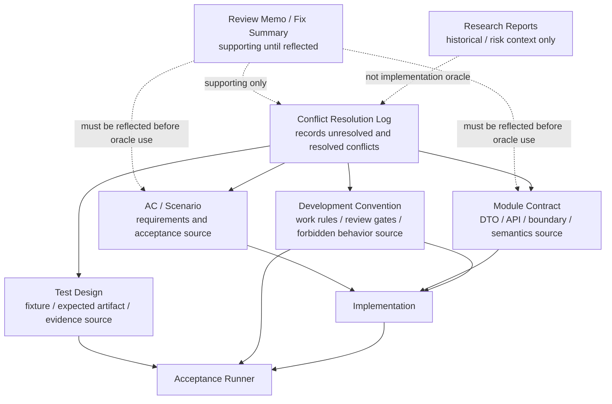
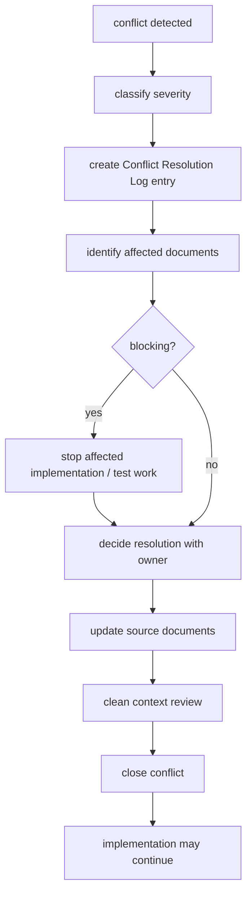

# Source of Truth Policy

## Status

Accepted

## Purpose

This policy defines which documents are authoritative for implementation, tests, acceptance, review, and future policy changes in the Private 2D Rigging Lab / Prototype.

It prevents implementers, subagents, and reviewers from silently filling gaps between AC, scenarios, module contracts, test design, and development conventions. It also prevents historical research, Cubism formats, Cubism SDK/Core behavior, Cubism Viewer output, Cubism Physics compatibility, or existing Cubism models from becoming implementation, test, or acceptance oracles.

This policy is required before MVP implementation because the monorepo will contain design documents, implementation modules, fixtures, tests, generated evidence, and review outputs side by side. All contributors need the same rule for what is source of truth and what is only supporting context.

## Scope

### Applies to

- `discussion/development_convention/**`
- `discussion/_conventions.md`
- `discussion/acceptance-criteria/**`
- `discussion/scenarios/**`
- `discussion/design/module-contracts/**`
- `discussion/tests/**`
- `discussion/demo/streaming-demo-policy.md`
- `discussion/proposal/live2d-feature-proposal-template.md`
- Future implementation, fixture, generated evidence, and review work in the monorepo

### Actors

- Implementation agent
- Test author
- Acceptance runner author
- Validator author
- Runtime author
- GUI author
- AI command author
- Clean Context Reviewer
- Policy maintainer

### Does not apply to

- External product documentation except as explicitly cited non-oracle context
- Historical research under `discussion/reports/**` except as risk review or capability observation
- Cubism compatibility work, because that work is outside the project baseline

## Source Documents

### Primary

- `discussion/_conventions.md`
- `discussion/development_convention/basis/00_overview.md`
- `discussion/development_convention/basis/01_common_policy_template.md`
- `discussion/development_convention/basis/02_p0_policy_specs.md`
- `discussion/development_convention/basis/04_required_diagrams_and_tables.md`
- `discussion/acceptance-criteria/**`
- `discussion/scenarios/**`
- `discussion/design/module-contracts/**`
- `discussion/tests/**`

### Supporting

- `discussion/demo/streaming-demo-policy.md`
- `discussion/proposal/live2d-feature-proposal-template.md`
- Review memos and fix summaries, only after their decisions are reflected into accepted design, contract, test design, or policy documents

### Not implementation, test, or acceptance oracle

- `discussion/reports/**`
- Cubism formats, including `.moc3`, `.cmo3`, `.model3.json`, `.motion3.json`, `.physics3.json`, and `.pose3.json`
- Cubism SDK/Core behavior
- Cubism Viewer output
- Cubism Editor behavior
- Cubism Physics compatibility
- Existing Cubism models, official samples, third-party Live2D models, and nizima assets

## Required Decisions

### DEC-SOT-001: Source document categories

#### Question

Which document categories exist, and what authority does each one have?

#### Decision

The policy recognizes AC / Scenario, Module Contract, Test Design, Development Convention, Review Memo / Fix Summary, Research Reports, and Demo / Proposal documents as separate categories with separate authority.

#### Rationale

The project needs requirement authority, implementation contract authority, proof/evidence authority, work-rule authority, and historical context to stay separate.

#### Alternatives considered

A single global priority order was considered and rejected because it would hide responsibility boundaries between requirements, contracts, tests, and conventions.

#### Impact

Implementation, tests, fixtures, generated evidence, and reviews must cite the category that authorizes the work. Research reports and review memos cannot become direct oracles.

### DEC-SOT-002: Source of truth priority model

#### Question

How are conflicts handled when multiple authoritative documents speak to the same topic?

#### Decision

Use a responsibility model, not a simple hierarchy:

- AC / Scenario defines what must be accepted.
- Module Contract defines DTOs, APIs, module boundaries, and runtime semantics.
- Test Design defines fixtures, expected artifacts, evidence, and acceptance proof.
- Development Convention defines work order, repository rules, review gates, and forbidden behavior.
- Review Memo / Fix Summary records judgment history until reflected into an accepted source document.
- Research Reports record historical or risk observations and are never implementation oracles.

#### Rationale

Different documents answer different questions. A conflict must identify which source document needs correction instead of being resolved by implementer preference.

#### Alternatives considered

Always letting AC override all other documents was rejected because AC should not define DTO shape, generated artifact paths, or package dependencies.

#### Impact

When documents conflict, the affected source documents must be updated or the conflict must remain open. Code must not encode an invented compromise.

### DEC-SOT-003: Conflict handling

#### Question

May an implementer or subagent resolve document conflicts without recording them?

#### Decision

No. Conflicts must be recorded using the Conflict Resolution Log format in this policy. Blocking conflicts stop affected implementation and test work until resolved.

#### Rationale

Silent conflict resolution creates undocumented behavior and makes Clean Context Review unreliable.

#### Alternatives considered

Allowing local implementation notes was rejected because they are easy to miss and do not update the source documents.

#### Impact

Every blocking conflict must name affected documents, impact, decision, post-resolution source of truth, changed files, and reviewer.

### DEC-SOT-004: Review memo handling

#### Question

Can review memos and fix summaries directly authorize implementation?

#### Decision

No. Review memos and fix summaries are supporting records. They authorize implementation only after their decisions are reflected into accepted design, module contract, test design, or development policy documents.

#### Rationale

Review memos often contain partial findings, tentative wording, or follow-up actions. Treating them as direct oracles can bypass accepted documents.

#### Alternatives considered

Using latest review memo as source of truth was rejected because it would make source authority chronological instead of structural.

#### Impact

Implementation PRs may cite review memos only as supporting evidence and must cite the accepted source document that absorbed the decision.

### DEC-SOT-005: Research report handling

#### Question

How are research reports used?

#### Decision

`discussion/reports/**` is a private research archive. It may be used for historical context, risk review, and capability observation. It must not define runtime behavior, validator expected output, fixture oracle, UI parity, file format compatibility, or acceptance criteria.

#### Rationale

The baseline is a project-defined Private 2D Rigging Lab / Prototype, not a Cubism-compatible editor or runtime.

#### Alternatives considered

Using reports as compatibility references was rejected because Cubism compatibility is outside scope.

#### Impact

Any test, fixture, validator diagnostic, runtime snapshot, or acceptance result based on Cubism behavior is blocking until replaced with project-defined sources.

### DEC-SOT-006: Conflict Resolution Log location

#### Question

Where are conflicts recorded?

#### Decision

For this P0 policy set, unresolved or conflicting items are recorded in the affected policy document under `## Conflict Handling` using the required log entry format. A future central log may be created at `discussion/development_convention/conflicts/conflict-resolution-log.md` only after that path is authorized for editing.

#### Rationale

The current write scope allows only the two P0 policy files. Recording the format and local entries keeps conflicts visible without writing outside scope.

#### Alternatives considered

Creating a central log immediately was rejected because it is outside the allowed write scope for this task.

#### Impact

Policy-local Conflict Resolution Log entries are authoritative until migrated to an accepted central log.

## Required Diagrams

### Source of Truth Relationship



### Conflict Resolution Flow



## Required Tables

### Source Document Responsibility Table

| Document category | Defines | Used by | Can be implementation oracle | Can be acceptance oracle | Conflict handling |
|---|---|---|---|---|---|
| AC / Scenario | Required behavior, acceptance conditions, user-visible outcomes | Implementers, test authors, acceptance runner, reviewers | Yes, for required behavior | Yes | Blocking if contradicted by contracts or tests |
| Module Contract | DTOs, APIs, module boundaries, runtime semantics | Implementers, validators, runtime, operation core, reviewers | Yes, for implementation contracts | Yes, when acceptance depends on contract conformance | Blocking if contradicted by AC or test design |
| Test Design | Fixtures, expected artifacts, evidence, runner behavior | Test authors, acceptance runner, reviewers | Yes, for proof method | Yes | Blocking if it cannot prove AC / Scenario |
| Development Convention | Work rules, repo layout, review gates, forbidden behavior | All agents and reviewers | Yes, for process and repository compliance | No, except as review gate evidence | Blocking if implementation bypasses a required rule |
| Review Memo / Fix Summary | Judgment history, findings, proposed fixes | Policy maintainers, reviewers | No | No | Must be reflected into accepted source documents |
| Research Reports | Historical observation, risk review, capability notes | Policy maintainers, reviewers | No | No | Any oracle use is blocking |
| Demo / Proposal documents | Demo-safe surface, proposal boundary, public/private separation | Demo authors, proposal authors, reviewers | Yes, only for demo/proposal handling | No | Blocking if private implementation or forbidden terms leak |

### Conflict Severity Table

| Severity | Meaning | Required action | Can implementation continue | Requires clean context review |
|---|---|---|---|---|
| blocking | Affects implementation behavior, test oracle, acceptance result, rights boundary, source authority, or forbidden Cubism dependency | Record log entry, stop affected work, update source documents, review fix | no | yes |
| warning | Does not change behavior but can confuse implementers or reviewers | Record log entry or policy issue, clarify before broad reuse | yes, outside affected area | yes, if source documents change |
| suggestion | Wording, organization, or future improvement without current ambiguity | Record as follow-up if useful | yes | no |

### Non-oracle Sources Table

| Source | Why not oracle | Allowed usage | Blocking if used as oracle |
|---|---|---|---|
| `discussion/reports/**` | Research archive, not accepted implementation design | Historical context, risk review, capability observation | yes |
| Cubism formats | Project does not read, write, parse, convert, or reconstruct Cubism formats | Non-goal and risk explanation only | yes |
| Cubism SDK/Core behavior | Project is not a Cubism SDK/Core replacement | Non-dependency statement and risk explanation | yes |
| Cubism Viewer output | Viewer consistency is not the acceptance target | Non-goal explanation only | yes |
| Cubism Physics compatibility | Minimum Open Dynamics v1 is project-defined and not `.physics3.json` compatible | Scope boundary explanation only | yes |
| Existing Cubism models | Rights, compatibility, and oracle contamination risk | Not allowed for fixtures, samples, demos, or acceptance | yes |
| Official or third-party Live2D samples | Rights and compatibility oracle risk | Not allowed for fixtures, samples, demos, or acceptance | yes |

## Rules

- The project baseline is `Private 2D Rigging Lab / Prototype`.
- The repository topology is monorepo; source authority must be readable from the same workspace as implementation, tests, fixtures, and generated evidence.
- AC / Scenario, Module Contract, Test Design, and Development Convention are separate source-of-truth categories.
- Do not convert responsibility conflicts into local implementation choices.
- Any unresolved or conflicting source item must be recorded using the Conflict Resolution Log format in this policy.
- Machine-readable IDs must contain no spaces. Use IDs such as `rigControl`, `runtimeStateSequence`, `computedDynamics`, `scalarDampedFollowV1`, and `CONFLICT-0001`.
- Review memos and fix summaries become implementation-relevant only after reflection into accepted source documents.
- Generated evidence must cite the source documents it proves.
- Acceptance must use project-defined AC, scenarios, module contracts, test design, fixtures, and expected artifacts.

## Forbidden

- Do not use Cubism formats, Cubism SDK/Core, Cubism Viewer consistency, Cubism Physics compatibility, or existing Cubism models as implementation, test, or acceptance oracles.
- Do not use `discussion/reports/**` as runtime, validator, fixture, expected-output, or acceptance oracle.
- Do not write machine-readable IDs with spaces.
- Do not treat latest chat, review memo, or fix summary as source of truth unless reflected into an accepted source document.
- Do not resolve source conflicts by inventing missing behavior in code, fixtures, tests, or generated artifacts.
- Do not mix `Private Prototype`, `Streaming Demo Surface`, `Live2D Feature Proposal`, and `Future Public Clean Subset` authority.

## Required Evidence

- Conflict Resolution Log entry for every blocking conflict.
- Source document update history for every resolved conflict.
- Clean Context Review result for blocking source authority changes.
- Accepted policy status before relying on this document as an implementation gate.
- Evidence bundle links from implementation, tests, and generated artifacts back to their source documents.

## Review Checklist

- [ ] The policy preserves the Private 2D Rigging Lab / Prototype baseline.
- [ ] Monorepo source visibility is assumed.
- [ ] AC / Scenario, Module Contract, Test Design, and Development Convention responsibilities are distinct.
- [ ] Research reports are not implementation, test, or acceptance oracles.
- [ ] Cubism formats, Cubism SDK/Core, Cubism Viewer output, Cubism Physics compatibility, and existing Cubism models are not oracles.
- [ ] Conflict Resolution Log format and local recording rule are present.
- [ ] Blocking conflicts stop affected work.
- [ ] Machine-readable IDs contain no spaces.
- [ ] Review memos are supporting context until reflected into accepted source documents.

## Conflict Handling

### Conflict Resolution Log format

```md
# Conflict Resolution Log

## CONFLICT-0001

### Found in
- `path/to/file-a.md`
- `path/to/file-b.md`

### Conflict
A says ...
B says ...

### Impact
Implementation / test / acceptance にどう影響するか。

### Decision
採用した解釈または修正方針。未解決の場合は `Unresolved` と書く。

### Source of truth after resolution
修正後に正となるファイル。未解決の場合は `Unresolved` と書く。

### Changed files
- ...

### Reviewer
- ...
```

### Current local log

No unresolved conflicts were found while drafting this policy from the provided basis documents.

## Change Process

1. Identify the affected source document category.
2. Record any contradiction or ambiguity as a Conflict Resolution Log entry when it can affect implementation, tests, acceptance, rights boundaries, or review gates.
3. Update the authoritative source document rather than only updating implementation.
4. Run Clean Context Review for blocking source authority changes.
5. Mark the policy `Accepted` only after required diagrams, tables, rules, forbidden items, evidence, and completion gate are reviewed.

## Completion Gate

- [x] Status, Purpose, Scope, Source Documents, Required Decisions, Required Diagrams, Required Tables, Rules, Forbidden, Required Evidence, Review Checklist, Conflict Handling, Change Process, and Completion Gate are present.
- [x] Source of Truth Relationship diagram is present.
- [x] Conflict Resolution Flow diagram is present.
- [x] Source Document Responsibility Table is present.
- [x] Conflict Severity Table is present.
- [x] Non-oracle Sources Table is present.
- [x] Conflict Resolution Log format is present.
- [x] Cubism formats, Cubism SDK/Core, Cubism Viewer consistency, Cubism Physics compatibility, and existing Cubism models are forbidden as oracles.
- [x] Machine-readable IDs with spaces are forbidden.
- [ ] Policy has been reviewed and marked `Accepted`.
