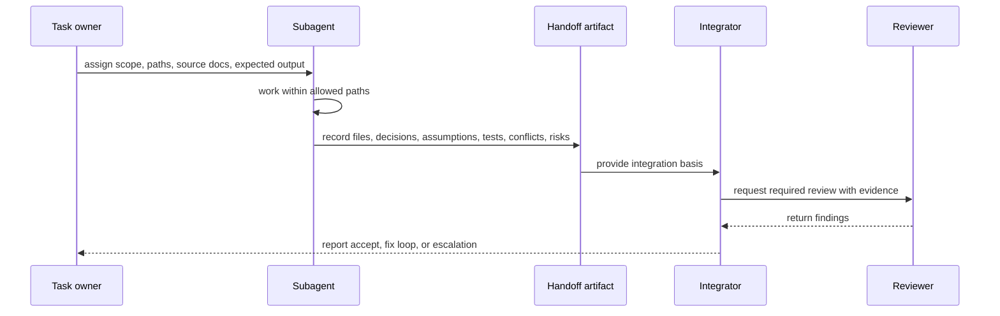
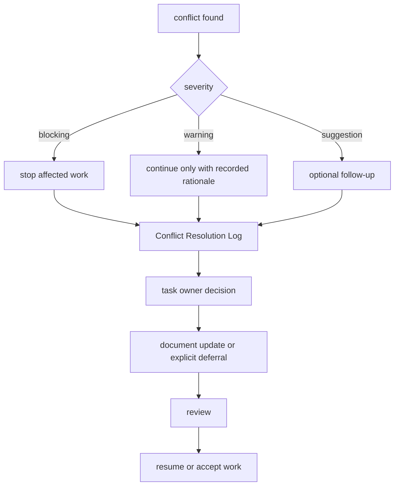
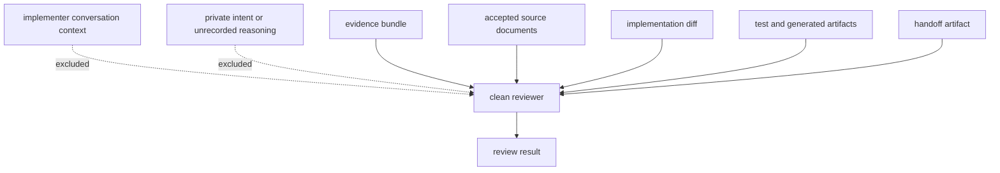

# Subagent Workflow Policy

## Status

Accepted

## Purpose

This policy defines how subagents are assigned, constrained, handed off, integrated, and reviewed for the Private 2D Rigging Lab / Prototype.

It prevents overlapping edits, path ownership confusion, missing handoff artifacts, silent conflict resolution, module-boundary drift, and loss of Clean Context Review independence.

## Scope

### Applies to

- Subagent work in the fixed monorepo.
- Task owner delegation and integration.
- Path ownership and allowed edit scopes.
- Handoff artifacts from subagents to integrators.
- Conflict escalation and Conflict Resolution Log entries.
- Clean Context Reviewer assignment and context boundaries.

### Actors

- Task owner
- Subagent
- Integrator
- Path owner
- Reviewer
- Clean Context Reviewer

### Does not apply to

- Final concrete agent staffing for future implementation waves.
- Historical research reports under `discussion/reports/**` except as risk context.
- Cubism compatibility implementation, Cubism SDK/Core replacement, Cubism Viewer matching, Cubism Physics compatibility, or existing Cubism model support.

## Source Documents

### Primary

- `discussion/development_convention/basis/00_overview.md`
- `discussion/development_convention/basis/01_common_policy_template.md`
- `discussion/development_convention/basis/03_p1_policy_specs.md`
- `discussion/development_convention/basis/04_required_diagrams_and_tables.md`
- `discussion/_conventions.md`
- `discussion/acceptance-criteria/`
- `discussion/scenarios/`
- `discussion/design/module-contracts/`
- `discussion/tests/`

### Supporting

- `discussion/demo/streaming-demo-policy.md`
- `discussion/proposal/live2d-feature-proposal-template.md`

### Not implementation oracle

- `discussion/reports/**`
- Cubism SDK/Core behavior
- Cubism Viewer output
- Cubism Editor behavior
- Cubism file formats
- Cubism Physics behavior or compatibility
- Existing Cubism models
- Official Live2D/Cubism sample models

## Required Decisions

### DEC-SUBAGENT-001: Subagent workflow scope

#### Question

What does this policy decide, and what remains undecided?

#### Decision

This policy defines the assignment format, allowed edit paths, forbidden edit paths, required handoff artifact, conflict reporting, integration responsibility, and review owner expectations. It does not decide the final concrete subagent roster for later implementation waves.

#### Rationale

Workflow rules must be stable before implementation, while actual staffing can be chosen per task.

#### Alternatives considered

Hard-coding a full future agent roster in this policy.

#### Impact

Every delegated task must include an explicit assignment and handoff expectation, but task owners may choose suitable agents later.

### DEC-SUBAGENT-002: Path ownership

#### Question

How are edit ownership and review ownership assigned?

#### Decision

Each subagent assignment MUST list allowed paths, forbidden paths, expected outputs, source documents, and reviewer. Shared schema, contract, fixture, test, and generated evidence paths MUST have an integrator or path owner assigned before editing.

#### Rationale

The monorepo enables cross-module work, but unconstrained cross-module edits are high-risk.

#### Alternatives considered

Letting each subagent infer ownership from the task description.

#### Impact

Subagents must stop or escalate when required changes fall outside their assigned paths.

### DEC-SUBAGENT-003: Concurrent edit rule

#### Question

When can multiple agents edit related files?

#### Decision

Concurrent edits to the same file are forbidden. Concurrent edits to tightly coupled files are allowed only when the task owner assigns a coordinating integrator and explicit path ownership. Shared schema changes require Integrator review. Contract changes require cross-module review.

#### Rationale

Overlapping edits cause hidden conflicts and inconsistent contracts.

#### Alternatives considered

Allowing optimistic concurrent edits with later merge cleanup.

#### Impact

Work must be split by file ownership or sequenced when the same file is involved.

### DEC-SUBAGENT-004: Handoff artifact

#### Question

What must a subagent provide when handing off work?

#### Decision

Every subagent handoff MUST include changed files, decisions made, assumptions, tests updated or run, evidence produced, conflicts found, remaining risks, and requested reviews.

#### Rationale

Integrators and clean reviewers need durable context without relying on chat history.

#### Alternatives considered

Free-form completion notes.

#### Impact

Integrator acceptance is blocked when a handoff artifact is missing or incomplete.

### DEC-SUBAGENT-005: Clean Context Reviewer assignment

#### Question

What context may a Clean Context Reviewer receive?

#### Decision

Clean Context Reviewers may receive accepted design, AC / Scenario, module contracts, test design, development conventions, implementation diff, test evidence, generated artifacts, and explicit handoff artifacts. They MUST NOT receive implementer conversation context, private intent, or unrecorded reasoning as review basis.

#### Rationale

Clean Context Review validates artifact sufficiency and source-of-truth alignment.

#### Alternatives considered

Passing the full implementation discussion to the reviewer.

#### Impact

Task owners must prepare evidence bundles and exclude non-durable context from clean review prompts.

### DEC-SUBAGENT-006: Escalation flow

#### Question

What happens when a subagent finds uncertainty, conflict, or missing design?

#### Decision

The subagent MUST record the issue in a Conflict Resolution Log entry or handoff artifact, stop affected work when the issue is blocking, and escalate to the task owner. The task owner decides whether to update source documents, split the work, request review, or defer with rationale.

#### Rationale

Subagents must not invent missing policy or silently choose between conflicting sources.

#### Alternatives considered

Allowing subagents to proceed with best-effort assumptions.

#### Impact

Blocking conflicts pause the affected implementation until resolved or explicitly accepted.

## Required Diagrams

### Diagram 1: Subagent Handoff Flow

This diagram shows how assigned work moves from task owner to subagent, integrator, and reviewer with a required handoff artifact.



### Diagram 2: Conflict Escalation Flow

This diagram shows that conflicts are logged and escalated rather than resolved by invention.



### Diagram 3: Clean Context Review Boundary

This diagram shows which context can cross into Clean Context Review and which context is excluded.



## Required Tables

### Table 1: Agent Assignment Table

| Agent role | Allowed paths | Forbidden paths | Reviewer |
|---|---|---|---|
| Task owner | Assignment docs, review requests, conflict routing | Unassigned implementation edits unless also implementer | Integrator or project owner |
| Subagent | Explicitly assigned paths only | Any unassigned path; same file assigned to another active agent | Assigned reviewer |
| Integrator | Integration paths named in assignment | Silent rewrites of unrelated user or agent changes | Task owner |
| Test author | Assigned test, fixture, traceability, expected evidence paths | Changing source contracts without assigned ownership | Test Adequacy Reviewer |
| Clean Context Reviewer | Read-only source docs, diff, evidence, handoff artifacts | Implementer conversation context; implementation edits during review | Task owner |
| Development Compliance Reviewer | Read-only policy, contract, diff, evidence | Inventing policy resolutions without Conflict Resolution Log | Task owner |

### Table 2: Handoff Artifact Table

| Field | Required? | Meaning |
|---|---|---|
| changedFiles | yes | Files changed by the subagent. |
| decisionsMade | yes | Decisions made within assigned authority. |
| assumptions | yes | Assumptions used; write `none` if none. |
| testsUpdated | yes | Tests, fixtures, or traceability changed. |
| testsRun | yes | Commands or profiles run and result. |
| evidenceProduced | yes | Evidence artifact paths or IDs. |
| conflictsFound | yes | Conflict IDs or `none`. |
| remainingRisks | yes | Known risks or `none`. |
| requestedReviews | yes | Required review types. |

### Table 3: Conflict Escalation Table

| Case | Action | Blocking? |
|---|---|---|
| Same file assigned to multiple active agents | Stop and ask task owner to sequence or split work. | yes |
| Required edit outside assigned paths | Stop affected edit and request scope change. | yes |
| AC conflicts with Module Contract | Record Conflict Resolution Log and escalate to task owner. | yes |
| Scenario fixture is missing from test traceability | Record Conflict Resolution Log and request test/design update. | yes |
| Candidate diagnostic used as MVP-blocking oracle | Stop affected acceptance path and request formal diagnostic decision. | yes |
| Machine-readable ID contains spaces | Fix within scope or escalate if source document conflict exists. | yes |
| Cubism SDK/Core, Viewer, Cubism file format, Cubism Physics, or existing Cubism model used as oracle | Stop and remove or escalate as blocking policy violation. | yes |
| Non-blocking wording ambiguity | Record warning and request owner decision if it affects implementation. | no |

### Table 4: Concurrent Edit Rule Table

| File type | Concurrent edit allowed? | Required coordination |
|---|---|---|
| Same file | no | Task owner must sequence ownership. |
| Shared schema or DTO contract | no, unless sequenced | Integrator review and cross-module review. |
| Module contract | no, unless sequenced | Path owner plus affected module reviewers. |
| Fixture manifest or traceability | no, unless sequenced | Test Adequacy Review. |
| Generated evidence | yes, if distinct artifact paths | Integrator verifies artifact references. |
| Independent implementation files | yes | Assignment must list non-overlapping paths. |
| Documentation in same policy file | no | One active editor or explicit handoff. |

## Rules

### R-SUBAGENT-001: Assignments must define scope

Task owners MUST give each subagent explicit source documents, allowed paths, forbidden paths, expected output, required evidence, and reviewer.

#### Rationale

Subagents cannot safely infer repository ownership from broad goals.

#### Evidence

- Agent assignment
- Handoff artifact

### R-SUBAGENT-002: Subagents must stay inside allowed paths

Subagents MUST NOT edit outside assigned paths without task owner approval and updated assignment.

#### Rationale

Path boundaries prevent unrelated edits and ownership conflicts.

#### Evidence

- Agent assignment
- Changed files list

### R-SUBAGENT-003: Same-file concurrent edits are forbidden

Task owners and integrators MUST NOT assign the same file to multiple active editors at the same time.

#### Rationale

Same-file overlap creates avoidable conflicts and lost intent.

#### Evidence

- Agent assignment table
- Handoff artifact

### R-SUBAGENT-004: Handoff artifacts are mandatory

Subagents MUST produce a handoff artifact before integration or review.

#### Rationale

Integrators and reviewers need durable context for decisions, evidence, and remaining risks.

#### Evidence

- Handoff artifact

### R-SUBAGENT-005: Conflicts must be escalated

Subagents MUST record and escalate source conflicts, missing required decisions, path ownership conflicts, and oracle-policy violations.

#### Rationale

Silent conflict resolution makes future acceptance untraceable.

#### Evidence

- Conflict Resolution Log
- Handoff artifact

### R-SUBAGENT-006: Clean Context Review must remain independent

Task owners MUST exclude implementer conversation context, private intent, and unrecorded reasoning from Clean Context Review packages.

#### Rationale

Clean review tests whether artifacts alone are sufficient.

#### Evidence

- Clean Context Review request
- Evidence bundle

## Forbidden

| Forbidden action | Applies to | Reason | Violation handling |
|---|---|---|---|
| Editing outside assigned paths | Subagent, integrator | Breaks path ownership and review scope. | blocking |
| Concurrent same-file edits | Task owner, subagent, integrator | Creates unresolved overlap. | blocking |
| Silent conflict resolution by invention | Subagent, integrator, reviewer | Conflicts must be recorded and owned. | blocking |
| Handoff without changed files, assumptions, tests, conflicts, and risks | Subagent | Integrator cannot evaluate the work. | blocking |
| Passing implementer conversation context to Clean Context Reviewer | Task owner, integrator | Breaks clean review boundary. | blocking |
| Using Cubism SDK/Core, Cubism Viewer, Cubism file formats, Cubism Physics compatibility, or existing Cubism models as implementation, test, or acceptance oracles | All actors | Outside project baseline. | blocking |
| Creating machine-readable IDs with spaces | All actors | Violates ID convention. | blocking |
| Reverting unrelated user or agent changes | Subagent, integrator | The worktree may contain unrelated work. | blocking |

## Required Evidence

| Evidence | Producer | Consumer | Path / Ref | Required for |
|---|---|---|---|---|
| Agent assignment | Task owner | Subagent, integrator, reviewer | Assignment note or task artifact | Scope control |
| Handoff artifact | Subagent | Integrator, reviewers | Handoff note or PR section | Integration |
| Changed files list | Subagent | Integrator | Handoff artifact | Ownership verification |
| Test result | Subagent or test runner | Integrator, Test Adequacy Reviewer | Test output or CI artifact | Review |
| Evidence bundle | Subagent or integrator | Reviewer, Clean Context Reviewer | Artifact list | Review basis |
| Conflict Resolution Log | Finder or task owner | Integrator, reviewer | Conflict log entry | Conflict escalation |
| Integrator review | Integrator | Task owner | Review record | Merge or acceptance |
| Clean Context Review result | Clean Context Reviewer | Task owner, integrator | Review record | Acceptance-critical work |

## Review Checklist

### Blocking

- [ ] Every subagent had explicit allowed paths and forbidden paths.
- [ ] No same-file concurrent edit occurred.
- [ ] Shared schema, contract, fixture, traceability, and generated evidence edits had assigned ownership.
- [ ] Handoff artifacts include changed files, decisions, assumptions, tests, evidence, conflicts, risks, and requested reviews.
- [ ] Conflicts were not silently resolved by invention.
- [ ] Clean Context Review packages excluded implementer conversation context.
- [ ] Cubism SDK/Core, Cubism Viewer, Cubism file formats, Cubism Physics compatibility, and existing Cubism models were not used as implementation, test, or acceptance oracles.
- [ ] Machine-readable IDs contain no spaces.
- [ ] Unrelated user or agent changes were not reverted.

### Warning

- [ ] Non-blocking assumptions are recorded and owned.
- [ ] Adjacent but non-overlapping path edits have an integrator note when they affect the same behavior.

### Suggestion

- [ ] Future assignments can be split more narrowly if review scope was too broad.

## Conflict Handling

Subagents, integrators, and reviewers MUST NOT resolve conflicts by their own invention. Blocking conflicts pause the affected work. Warning conflicts require recorded rationale. Suggestion conflicts may be deferred with owner approval.

Conflict Resolution Log entries MUST use this format:

```md
# Conflict Resolution Log

## CONFLICT-0001: <Short title>

### Status
Open / Resolved / Superseded

### Found by
Human / Agent name / Reviewer role

### Found in
- `path/to/file-a.md`
- `path/to/file-b.md`

### Conflict
A says ...
B says ...

### Impact
How this affects implementation, test, acceptance, or review.

### Decision
Adopted interpretation or correction plan. Use `Unresolved` if no decision exists.

### Rationale
Why that decision was made.

### Source of truth after resolution
File or section that becomes authoritative after resolution.

### Changed files
- `path/to/changed-file.md`

### Required follow-up
- [ ] ...

### Reviewer
- ...

### Resolved at
YYYY-MM-DD or commit / patch reference
```

## Change Process

### When this policy may change

- Subagent assignment format changes.
- Path ownership or concurrent edit rules change.
- Handoff artifact fields change.
- Clean Context Review boundary changes.
- Conflict escalation flow changes.

### Required review

- Development Compliance Review is required for any change to this policy.
- Test Adequacy Review is required if the change affects tests, fixtures, evidence, or acceptance handoff.
- Clean Context Review is required if the change affects clean review independence or MVP acceptance work.

### Required updates

- Update affected development convention documents.
- Update task owner delegation templates or handoff templates.
- Update review policy if review gates or reviewer responsibilities change.
- Record unresolved or conflicting requirements in Conflict Handling instead of inventing a resolution.

## Completion Gate

- [ ] Status is set.
- [ ] Purpose is clear.
- [ ] Scope is clear.
- [ ] Source Documents are listed.
- [ ] Required Decisions are complete.
- [ ] Required Diagrams are present.
- [ ] Required Tables are present.
- [ ] Rules use MUST / SHOULD / MAY language.
- [ ] Forbidden actions are explicit.
- [ ] Required Evidence is defined.
- [ ] Review Checklist is present.
- [ ] Conflict Handling is defined.
- [ ] Change Process is defined.
- [ ] Path ownership, no overlapping edits, handoff artifacts, conflict escalation, and Clean Context Review boundary are covered.
