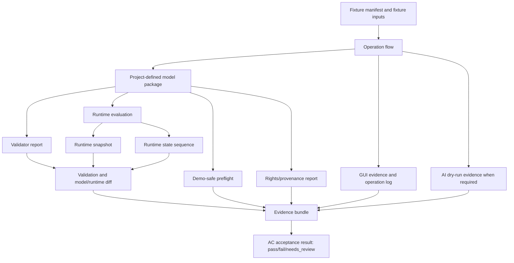
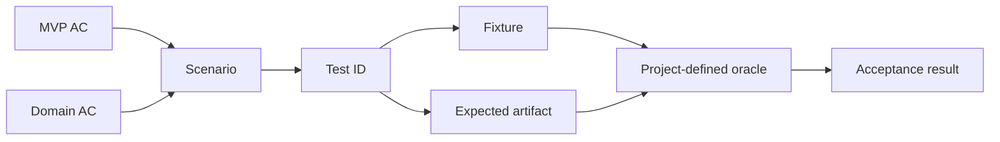
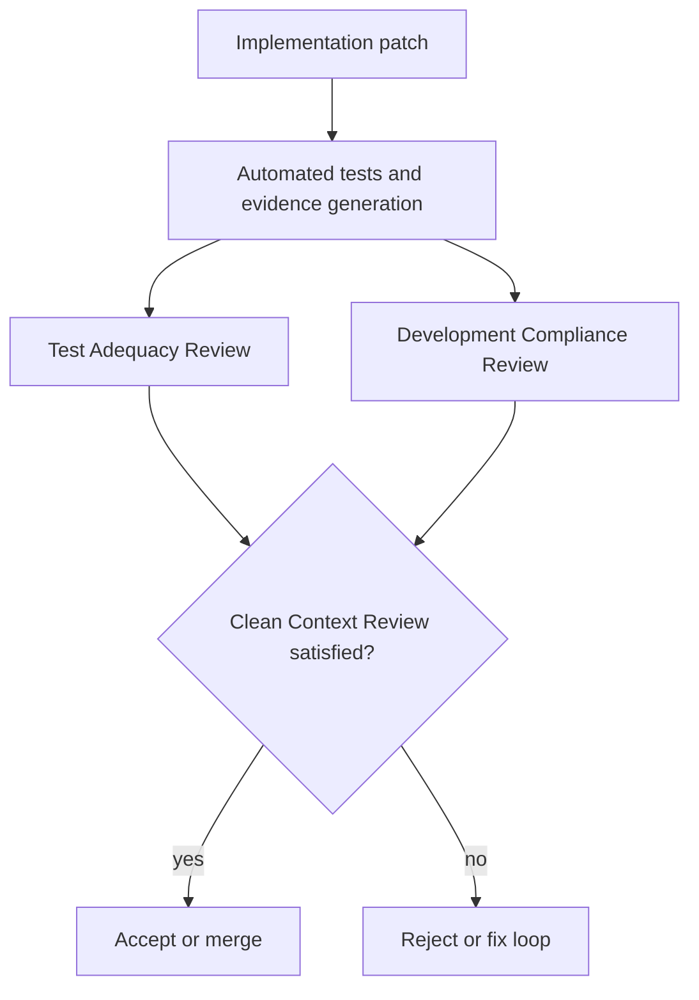
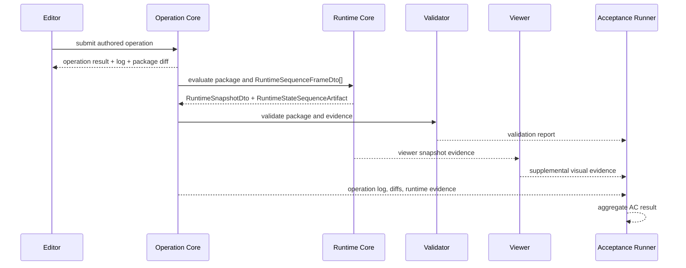

# Testing and Acceptance Policy

## Status

Accepted

## Purpose

This policy defines how tests, fixtures, expected artifacts, acceptance runner execution, review gates, E2E coverage, and clean context review are used to prove the Private 2D Rigging Lab / Prototype MVP.

It prevents implementation from moving ahead without corresponding tests, fixtures from existing without Test ID traceability, exact deterministic replay from checking only final state, MVP blocking tests from relying only on candidate diagnostics, and review from depending on the implementer's private intent or conversation context.

## Scope

### Applies to

- `discussion/tests/**`
- `discussion/acceptance-criteria/**`
- `discussion/scenarios/**`
- `discussion/design/module-contracts/**`
- future monorepo test packages, fixtures, generated evidence, and acceptance runner outputs
- implementation PRs or patches that claim MVP progress

### Actors

- Test author
- Fixture author
- Acceptance runner implementer
- Runtime, validator, operation, GUI, AI, and demo-safe implementers
- Clean Context Reviewer
- Test Adequacy Reviewer
- Development Compliance Reviewer

### Does not apply to

- Post-MVP direct vertex physics, cloth simulation, collision, IK, timeline bake, Cubism Physics compatibility, or `.physics3.json` import/export
- Cubism format conversion, Cubism SDK/Core replacement, Cubism Viewer consistency, or existing Cubism model behavior

## Source Documents

### Primary

- `discussion/development_convention/basis/00_overview.md`
- `discussion/development_convention/basis/01_common_policy_template.md`
- `discussion/development_convention/basis/02_p0_policy_specs.md`
- `discussion/development_convention/basis/04_required_diagrams_and_tables.md`
- `discussion/_conventions.md`
- `discussion/acceptance-criteria/03_MVP_Acceptance_Criteria.md`
- `discussion/acceptance-criteria/02_DomainAcceptanceCriteria/**`
- `discussion/scenarios/03_MVP_Acceptance_Criteria.md`
- `discussion/scenarios/02_DomainAcceptanceCriteria/**`
- `discussion/design/module-contracts/runtime-core-contract.md`
- `discussion/design/module-contracts/operation-contracts.md`
- `discussion/design/module-contracts/validator-contract.md`
- `discussion/design/module-contracts/ai-command-contract.md`
- `discussion/design/module-contracts/traceability-matrix.md`
- `discussion/tests/strategy/test-strategy.md`
- `discussion/tests/strategy/test-taxonomy.md`
- `discussion/tests/strategy/epsilon-determinism-policy.md`
- `discussion/tests/expected/expected-artifacts-policy.md`
- `discussion/tests/fixtures/fixture-manifest.md`
- `discussion/tests/fixtures/fixture-manifest.json`
- `discussion/tests/traceability/test-traceability-matrix.md`
- `discussion/tests/traceability/test-traceability-matrix.json`
- `discussion/tests/runners/acceptance-runner-design.md`
- `discussion/tests/runners/validator-profile-design.md`
- `discussion/tests/policies/gui-evidence-schema.md`
- `discussion/tests/policies/ai-assistant-test-design.md`
- `discussion/tests/policies/demo-safe-test-policy.md`
- `discussion/tests/policies/rights-provenance-test-design.md`

### Supporting

- `discussion/demo/streaming-demo-policy.md`
- `discussion/proposal/live2d-feature-proposal-template.md`

### Not implementation or test oracles

- `discussion/reports/**`
- Cubism file formats, including `.moc3`, `.cmo3`, `.model3.json`, `.motion3.json`, `.physics3.json`, and `.pose3.json`
- Cubism SDK/Core behavior
- Cubism Viewer, Cubism Editor, or Cubism Physics behavior
- VTube Studio compatibility
- existing Cubism models, official Cubism samples, third-party Live2D models, nizima assets, or commercial model behavior
- screenshots or captures without structured evidence

## Required Decisions

### DEC-TEST-001: Test implementation is mandatory

#### Question

Can implementation proceed without a corresponding test, fixture, or evidence path?

#### Decision

No. Every implementation patch that claims functional progress must update or reference the relevant Test ID, fixture, expected artifact, validation report, runtime evidence, GUI evidence, AI dry-run evidence, demo-safe evidence, or acceptance runner result.

#### Rationale

MVP completion is evidence-based. Manual confirmation alone cannot prove acceptance criteria.

#### Alternatives considered

- Allow test follow-up after implementation. Rejected because it permits unverified behavior to become design gravity.
- Require only unit tests. Rejected because MVP claims cross module boundaries.

#### Impact

Implementers must include evidence and reviewers must block missing evidence for MVP claims.

### DEC-TEST-002: Test design source

#### Question

Which documents define what tests must prove?

#### Decision

`discussion/tests/**` is the test-design source, joined with AC, scenarios, and module contracts. Prose Markdown is not parsed as the runtime oracle; machine-readable manifests and expected artifact refs are used where available.

#### Rationale

The test design already separates strategy, taxonomy, fixture manifest, traceability, expected artifacts, runner behavior, and profile behavior.

#### Alternatives considered

- Treat implementation behavior as the oracle. Rejected.
- Treat external Cubism behavior as the oracle. Forbidden.

#### Impact

Test authors must maintain traceability from AC and scenarios to Test IDs, fixtures, expected artifacts, and acceptance results.

### DEC-TEST-003: Acceptance runner responsibility

#### Question

What must the Acceptance Runner do?

#### Decision

The Acceptance Runner aggregates evidence for AC/scenario status and must perform or consume fixture loading, operation flow, runtime evaluation, validator reports, diffs, GUI evidence, AI dry-run evidence, demo-safe preflight, rights/provenance evidence, and AC result aggregation.

#### Rationale

MVP status must be reproducible from generated artifacts, not from a reviewer remembering what happened.

#### Alternatives considered

- Let each module self-report acceptance. Rejected because cross-module evidence would be inconsistent.

#### Impact

Acceptance results use only `pass`, `fail`, or `needs_review`.

### DEC-TEST-004: MVP blocking fixture handling

#### Question

How are `mvp-blocking` fixtures handled?

#### Decision

Every `mvp-blocking` fixture must connect to at least one machine-readable Test ID. If a fixture is unconnected, either traceability must be fixed or the fixture must be explicitly downgraded from MVP blocking by a documented decision.

#### Rationale

An unconnected blocking fixture cannot be enforced by the runner or reviewed cleanly.

#### Alternatives considered

- Keep unconnected fixtures as implied blockers. Rejected because implied blockers are invisible to automation.

#### Impact

Fixture manifest integrity is a blocking acceptance gate.

### DEC-TEST-005: Exact deterministic replay

#### Question

What proves exact deterministic replay for Minimum Open Dynamics v1?

#### Decision

Exact replay must compare the full `RuntimeStateSequenceArtifact.states[]`, not only a final `RuntimeStateDto`. Evidence must include `inputFramesHash`, `runtimeEvaluationContext`, `evaluatorVersionSummary`, an initial `RuntimeStateDto`, `RuntimeSequenceFrameDto[]`, fixed timestep policy, semantic diff on mismatch, and epsilon policy.

#### Rationale

Minimum Open Dynamics v1 is stateful, but Runtime Core must not hold hidden mutable state. Full sequence comparison proves frame-by-frame determinism.

#### Alternatives considered

- Compare only final state. Rejected because intermediate divergence can be hidden.
- Compare Cubism Physics or Cubism Viewer behavior. Forbidden.

#### Impact

Runtime, validator, acceptance, and E2E tests must preserve RuntimeState sequence evidence for exact replay.

### DEC-TEST-006: Clean Context Test Review

#### Question

Who reviews whether tests prove the requirement?

#### Decision

Test Adequacy Review is mandatory for MVP blocking claims and must be performed by a Clean Context Reviewer who did not share the implementer's private conversation context.

#### Rationale

The review must evaluate artifacts, source documents, and evidence rather than inferred intent.

#### Alternatives considered

- Let the implementer self-review adequacy. Rejected for MVP gates.

#### Impact

The evidence bundle must be sufficient for a reviewer to reconstruct the claim without chat history.

### DEC-TEST-007: Development Compliance Review

#### Question

What checks policy compliance beyond test pass/fail?

#### Decision

Development Compliance Review is mandatory for MVP blocking claims and must check module boundaries, source-of-truth usage, operation boundaries, RuntimeState explicitness, formal/candidate diagnostic separation, forbidden Cubism oracles, demo-safe rules, rights/provenance rules, and machine-readable ID naming.

#### Rationale

A passing test can still encode a forbidden oracle or boundary violation.

#### Alternatives considered

- Treat automated tests as sufficient. Rejected because compliance includes policy and evidence boundaries.

#### Impact

Merge or acceptance claims require both test results and compliance review evidence.

### DEC-TEST-008: E2E test category

#### Question

How is E2E represented in this testing policy?

#### Decision

E2E is a test category that crosses multiple modules and must connect to the E2E Test Policy, acceptance runner, Test IDs, fixtures, structured evidence, and review requirements.

#### Rationale

E2E coverage is required but must not become an ambiguous screenshot-only practice.

#### Alternatives considered

- Leave E2E to ad hoc manual testing. Rejected.

#### Impact

E2E details live in `discussion/development_convention/e2e-test-policy.md`; this P0 policy defines the gate relationship.

## Required Diagrams

### Diagram 1: Acceptance Runner Pipeline



### Diagram 2: Test Evidence Graph



### Diagram 3: Review Gate Flow



### Diagram 4: E2E Journey Flow



## Required Tables

### Table 1: Test Profile Matrix

| Profile | Runs | Blocking? | Required evidence |
| --- | --- | --- | --- |
| `dev-fast` | focused unit, schema, and contract checks for changed modules | no for MVP, yes for local readiness when declared | test result and changed Test IDs |
| `contract` | DTO, schema, module contract, validator contract, operation contract checks | yes for affected contract changes | contract test result, schema diff, validation report |
| `strict-determinism` | runtime snapshot and full RuntimeState sequence replay | yes for Dynamics MVP claims | `RuntimeStateSequenceArtifact`, semantic diff, epsilon policy record |
| `mvp-acceptance` | AC/scenario traceability, fixtures, expected artifacts, validator, runtime, GUI, AI, demo-safe, rights gates | yes | acceptance runner result and evidence bundle |
| `demo-safe` | capture preflight, forbidden term scan, rights/provenance, redaction state | yes for demo-safe claims | demo-safe preflight report and rights/provenance report |
| `manual-visual` | bounded visual review where fixture marks review required | `needs_review` by default; blocking only if fixture says so | visual review checklist and optional capture |

### Table 2: Evidence Requirement Table

| Test type | Required evidence | Optional evidence | Primary oracle |
| --- | --- | --- | --- |
| `unit` | test result, changed contract reference when applicable | focused fixture | project-defined schema or pure function expectation |
| `contract` | schema/DTO result, validation report, module contract link | generated schema diff | accepted module contract |
| `runtimeReplay` | full RuntimeState sequence, runtime snapshot, input hash, semantic diff on mismatch | summary hash | project-defined Runtime Core and epsilon policy |
| `validator` | validation report with formal diagnostic IDs and profile behavior | candidate diagnostic notes | validator contract and formal diagnostic registry |
| `guiEvidence` | operation log and semantic GUI evidence | screenshot or capture | operation log and semantic GUI state |
| `aiDryRun` | AI transcript, dry-run result, diff, repair candidate, approval boundary evidence | prompt metadata | dry-run operation result and validation diff |
| `demoSafe` | demo-safe preflight, forbidden term scan, rights/provenance report | redacted capture | demo-safe policy and rights metadata |
| `acceptance` | acceptance runner result, traceability join, required evidence bundle | reviewer notes | AC/scenario plus structured evidence |
| `e2e` | operation log, package artifact, runtime evidence, validation report, acceptance result | screenshots | structured evidence defined by E2E policy |

### Table 3: Review Requirement Table

| Review | Reviewer | Required for | Evidence checked |
| --- | --- | --- | --- |
| Test Adequacy Review | Clean Context Reviewer | every MVP blocking implementation/test claim | AC, scenario, Test ID, fixture, expected artifact, oracle, acceptance runner result |
| Development Compliance Review | Clean Context Reviewer or integration reviewer | every MVP blocking implementation/test claim | module boundaries, operation boundaries, RuntimeState explicitness, diagnostic class, non-oracle rules, IDs |
| Visual Review | human or hybrid reviewer | only when fixture or E2E marks visual review required | bounded checklist, supplemental capture, structured evidence |
| Demo-safe Review | reviewer using demo-safe policy | demo-safe capture or proposal-facing output | forbidden term scan, rights/provenance report, redaction state |
| AI Boundary Review | reviewer using AI command/test policy | AI-assisted E2E or repair claim | dry-run proof, diff, no mutation, human approval boundary |

### Table 4: E2E Test Table

| E2E ID | Journey | Evidence | Blocking |
| --- | --- | --- | --- |
| `E2E-001` | PSD import to authoring to save/reload to viewer snapshot to validator pass | operation log, package artifact, runtime snapshot, GUI evidence, validation report, acceptance result | yes for MVP authoring path when fixture is MVP blocking |
| `E2E-002` | invalid package to validator diagnostics to AI dry-run repair suggestion to human approval boundary | invalid fixture, formal diagnostics or expected artifact, AI transcript, dry-run diff, repair candidate, acceptance result | yes only when formal diagnostic or explicit expected artifact is present |
| `E2E-003` | demo-safe capture to forbidden term scan to rights/provenance check to capture allowed | demo-safe preflight, rights/provenance report, redaction state, optional capture | yes for demo-safe claims |
| `E2E-004` | deterministic replay to RuntimeSequenceFrameDto[] to RuntimeStateSequenceArtifact to full sequence comparison | initial RuntimeState, input frames hash, RuntimeState sequence, semantic diff, acceptance result | yes for Minimum Open Dynamics v1 deterministic replay |

## Rules

1. MVP completion is proven by evidence, not by manual observation alone.
2. The monorepo is fixed. Tests, fixtures, schemas, generated artifacts, acceptance results, and policy documents must be traceable in one workspace.
3. Minimum Open Dynamics v1 is part of MVP and exact replay must use full RuntimeState sequence comparison.
4. Runtime Core must be tested as explicit `RuntimeStateDto` input/output, not hidden mutable state.
5. Machine-readable IDs must not contain spaces. Use forms such as `rigControl.cycle`, `invalid-rigControl-cycle`, `dynamicsGroup`, `computedDynamics`, and `scalarDampedFollowV1`.
6. `mvp-blocking` fixtures must resolve to Test IDs and required evidence.
7. Candidate diagnostics may appear as notes, warnings, or future work, but cannot be the only MVP blocking oracle.
8. MVP blocking tests must use formal diagnostics, explicit expected artifacts, or both.
9. Acceptance results are limited to `pass`, `fail`, and `needs_review`.
10. Screenshots are supplemental evidence unless a human visual review checklist explicitly says otherwise. They are not primary acceptance oracles.
11. GUI MVP authoring evidence requires operation logs and semantic GUI evidence, not screenshots alone.
12. Demo-safe and rights/provenance gates are first-class acceptance gates when the tested scenario touches capture, proposal, public-facing output, or source assets.

## Forbidden

- Using Cubism formats, Cubism SDK/Core, Cubism Viewer, Cubism Editor, Cubism Physics compatibility, VTube Studio compatibility, or existing Cubism models as implementation, test, acceptance, or E2E oracles.
- Importing, reading, converting, reconstructing, or validating `.moc3`, `.cmo3`, `.model3.json`, `.motion3.json`, `.physics3.json`, or `.pose3.json` as project behavior.
- Treating candidate diagnostics alone as MVP blocking pass/fail evidence.
- Accepting exact deterministic replay from final state only.
- Accepting GUI authoring from screenshots alone.
- Treating visual quality, commercial polish, or pixel-perfect external viewer matching as MVP acceptance.
- Resolving AC, scenario, module contract, test design, or policy conflicts by implementer invention.

## Required Evidence

- test results
- acceptance runner result
- fixture manifest and traceability join
- operation log
- runtime snapshot
- runtime state artifact where required
- runtime state sequence artifact where exact replay is required
- validation report
- runtime diff, model diff, or validation diff as applicable
- GUI evidence
- AI dry-run evidence where AI is involved
- demo-safe preflight report where capture or demo surface is involved
- rights/provenance report where assets or captures are involved
- Test Adequacy Review
- Development Compliance Review
- Conflict Resolution Log entry for unresolved or resolved conflicts

## Review Checklist

### Blocking

- [ ] The implementation or policy claim has corresponding tests.
- [ ] The relevant AC and scenarios are connected to Test IDs.
- [ ] Every `mvp-blocking` fixture is connected to a Test ID.
- [ ] The primary oracle is project-defined structured evidence.
- [ ] MVP blocking tests do not rely only on candidate diagnostics.
- [ ] Exact replay compares the full RuntimeState sequence.
- [ ] GUI authoring evidence includes operation logs and semantic GUI evidence.
- [ ] Demo-safe and rights/provenance evidence are present when required.
- [ ] Test Adequacy Review was performed by a Clean Context Reviewer.
- [ ] Development Compliance Review was performed.
- [ ] No Cubism-related or external model oracle is used.
- [ ] Machine-readable IDs contain no spaces.

### Non-blocking unless marked by fixture or policy

- [ ] Visual review is complete when required.
- [ ] Candidate diagnostic notes are tracked for future promotion.
- [ ] Supplemental screenshots are linked to structured evidence.

## Conflict Handling

Conflicts must not be resolved by implementation invention. If AC, scenario, module contract, test design, fixture manifest, expected artifact, diagnostic registry, or this policy disagree, record a Conflict Resolution Log entry and identify the source document that must change.

Use this format:

```md
# Conflict Resolution Log

## CONFLICT-0001

### Found in
- `path/to/file-a.md`
- `path/to/file-b.md`

### Conflict
A says ...
B says ...

### Impact
Implementation / test / acceptance impact.

### Decision
Adopted interpretation or required correction. If unresolved, write `Unresolved`.

### Source of truth after resolution
File that becomes authoritative after correction.

### Changed files
- ...

### Reviewer
- ...
```

Known conflict to resolve before implementation gate:

```md
## CONFLICT-TEST-0001

### Found in
- `discussion/development_convention/basis/00_overview.md`
- `discussion/development_convention/basis/01_common_policy_template.md`
- task allowed write scope

### Conflict
The basis examples name output paths under `discussion/development/`, while this task allows and requests files under `discussion/development_convention/`.

### Impact
Future agents may look in the wrong directory for the accepted policy set.

### Decision
Unresolved. This task writes only to the user-approved `discussion/development_convention/` paths.

### Source of truth after resolution
To be decided by the policy owner.

### Changed files
- `discussion/development_convention/testing-and-acceptance-policy.md`

### Reviewer
- pending
```

## Change Process

1. Propose a change with affected AC, scenario, module contract, Test ID, fixture, expected artifact, acceptance runner behavior, and review impact.
2. If the change affects MVP blocking behavior, run Test Adequacy Review and Development Compliance Review.
3. If the change affects diagnostics, update Diagnostic Policy and validator contract or record a conflict.
4. If the change affects E2E behavior, update E2E Test Policy and acceptance runner mapping.
5. If the change affects demo-safe or rights/provenance gates, update the related test policy and demo policy references.
6. Record unresolved conflicts rather than inventing missing requirements.

## Completion Gate

- [ ] All required common template sections are present.
- [ ] Acceptance Runner Pipeline diagram is present.
- [ ] Test Evidence Graph diagram is present.
- [ ] Review Gate Flow diagram is present.
- [ ] E2E Journey Flow diagram is present.
- [ ] Test Profile Matrix is present.
- [ ] Evidence Requirement Table is present.
- [ ] Review Requirement Table is present.
- [ ] E2E Test Table is present.
- [ ] Acceptance runner responsibilities include fixture loading, operation flow, runtime evaluation, validator, diff, demo-safe preflight, and AC result aggregation.
- [ ] MVP blocking fixture handling is defined.
- [ ] Clean Context Review and Test Adequacy Review are mandatory for MVP blocking claims.
- [ ] Development Compliance Review is mandatory for MVP blocking claims.
- [ ] Candidate diagnostics alone are forbidden as MVP blocking oracles.
- [ ] Cubism formats, Cubism SDK/Core, Cubism Viewer consistency, Cubism Physics compatibility, and existing Cubism models are forbidden as implementation, test, and acceptance oracles.
