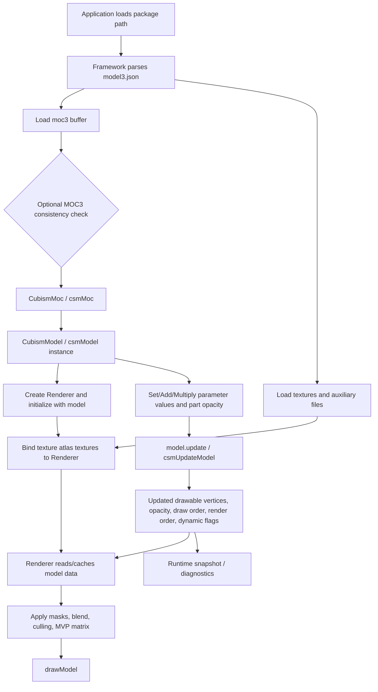

# Cubism Core / Framework runtime evaluation flow

> 公式 Live2D Cubism SDK / Core 資料から、モデル読み込み、parameter操作、`update`、Drawable state取得、Renderer描画までのruntime評価flowを整理する。Open Live2D Stackの設計オラクルではなく、Open Model Package / Shared Runtime evaluation core / runtime snapshot設計の参考資料として扱う。

## 0. 調査範囲と主な出典

調査日: 2026-05-25

主な公式出典:

- Live2D Cubism SDK Manual: <https://docs.live2d.com/en/cubism-sdk-manual/top/>
- About Models (Web): <https://docs.live2d.com/en/cubism-sdk-manual/model-web/>
- Parameter Operation: <https://docs.live2d.com/en/cubism-sdk-manual/parameters/>
- Cubism Core: <https://docs.live2d.com/en/cubism-sdk-manual/cubism-core/>
- Cubism Core API Reference: <https://docs.live2d.com/en/cubism-sdk-manual/cubism-core-api-reference/>
- NativeCoreAPIReference_jp_r15 PDF: <https://cubism.live2d.com/sdk-doc/reference/NativeCoreAPIReference_jp_r15.pdf>
- Verify model integrity: <https://docs.live2d.com/en/cubism-sdk-manual/moc3-consistency/>
- DrawableVertexPositions Range: <https://docs.live2d.com/en/cubism-sdk-manual/drawablevertexpositions/>
- DrawableVertexPosition Validation: <https://docs.live2d.com/en/cubism-sdk-manual/drawablevertexposition-checking/>

参照したリポジトリ文書:

- `discussion/_conventions.md`
- `discussion/reports/runtime-evaluation-semantics-reference/_map.md`
- `discussion/design/initial-design-decisions-and-open-questions.md`
- `discussion/acceptance-criteria/03_MVP_Acceptance_Criteria.md`
- `discussion/reports/cubism-sdk-runtime-structure/_map.md`
- `discussion/reports/viewer-preview-reference/_map.md`
- `discussion/reports/deformer-structure-technology/_map.md`

## 1. Official facts

### 1.1 Model package / model3.json / moc3 loading

- Cubismのモデル情報は基本的にModelerで作成され、parameterに対する頂点移動などは`.moc3`に記録される。physicsやArtMesh user dataなどは別ファイルとして出力され、`.model3.json`はモデル関連ファイル参照を保持する。
- Framework経由の読み込みでは、`.model3.json`から必要情報を抽出し、`CubismUserModel`派生インスタンスで保持することが想定されている。Webでは`CubismModelSettingJson`を作り、`ICubismModelSetting`から抽出した各要素を`CubismUserModel.load~~`系関数で読み込む。
- `.moc3`単体のruntime instance作成は、bufferを`CubismMoc.create`に渡して`CubismMoc`を作り、次に`CubismMoc.createModel`で`CubismModel`を作る。parameter操作と描画情報取得は、この`CubismModel` instanceを通じて行う。
- Core APIの低レベル手順では、`.moc3`を64byte aligned memoryへ読み、`csmReviveMocInPlace`で`csmMoc`を復元し、`csmGetSizeofModel`で必要なmodel memoryサイズを得て、16byte aligned memoryを`csmInitializeModelInPlace`に渡し`csmModel`を初期化する。

### 1.2 Core / Framework / Renderer の役割

| 層 | 公式資料から読み取れる役割 |
|---|---|
| Core | `.moc3`を扱うためのC APIを備えたライブラリ。Core自身はメモリ確保/破棄を行わず、描画機能も含まない。parameterに応じた頂点情報を計算し、計算済み頂点、UV、不透明度など描画に必要な情報を返す。 |
| Framework | `.model3.json`の解釈、`CubismMoc`/`CubismModel`のラップ、`CubismUserModel`、motion/expression/physics/poseなどのruntime補助、graphics API別Renderer reference実装を提供する層。CoreはApplicationからもFrameworkからも使われる。 |
| Renderer | graphics API依存の描画層。`CubismRenderer`派生クラスがモデルのtexture情報や描画関連情報を管理し、`CubismModel`を`initialize`で関連付ける。描画は`CubismModel`からではなく、関連付けられたRendererへ`drawModel`を命令して行う。 |

### 1.3 Parameter access and operations

- Frameworkのparameter操作は、ID型からのアクセスとindexからのアクセスの2系統がある。Native/Webでは`CubismIdHandle`が使われ、同じ文字列には同じhandle/instanceが返る。高頻度呼び出しでは、先にindexを取得してcacheする方法が推奨される。
- Framework APIには、overwrite、add、multiplyの3種類のparameter操作がある。Webでは代表的に`setParameterValueById`、`addParameterValueById`、`multiplyParameterValueById`があり、index版もある。第三引数の影響度は省略時1で、既存値への混合に使われる。
- 現在値取得には`getParameterValueById`/`GetParameterValue`系APIがある。parameter値の一時保存/復元には`saveParameters`/`loadParameters`がある。
- Core低レベルAPIでは、`csmGetParameterCount`、`csmGetParameterIds`、`csmGetParameterValues`、`csmGetParameterMinimumValues`、`csmGetParameterMaximumValues`、`csmGetParameterDefaultValues`、`csmGetParameterTypes`などでSOA配列を取得し、`csmGetParameterValues`で返る現在値配列へ書き込むことでparameterを操作する。
- Core API referenceでは、`csmUpdateModel()`時にparameter値が最小/最大範囲へclampされる。ただしparameterにrepeat設定がある場合はclampされない。part opacityは`csmUpdateModel`処理で0.0から1.0へclampされる。
- Frameworkの`CubismModel`には、`.moc3`内に存在しないparameter IDやpart opacity IDを扱う機能がある。これはmotionやposeなどで使われる。存在しないIDの最大/最小/初期値へアクセスするとerrorになる、と公式文書は注意している。
- parameter計算順序は表現結果に影響する。公式の一般説明では、overwrite、add、multiplyの順に適用するのが一般的とされ、overwriteを最後にすると先行計算が無視される。

### 1.4 `model.update()` / `csmUpdateModel`

- Framework文書では、parameterを設定した時点ではparameter値だけが書き換わり、頂点計算は行われない。parameter変更後、`CubismModel.update()`で頂点が計算され、その後Rendererの`drawModel()`で描画する。
- WebのAbout Modelsでは、`CubismModel.update()`は「CubismModel instance内のparameter操作をArtMesh頂点へ反映する」処理として説明されている。
- Core API referenceでは、parameterやpart opacityを変更した後、それをDrawableの頂点や不透明度へ反映する操作が`csmUpdateModel`である。影響対象として`csmGetDrawableDynamicFlags`、`csmGetDrawableVertexPositions`、`csmGetDrawableDrawOrders`、`csmGetDrawableOpacities`、`csmGetRenderOrders`が挙げられている。
- `csmResetDrawableDynamicFlags`は、次回`csmUpdateModel`で前回値との差分を`csmGetDrawableDynamicFlags`へ書き込ませるためのresetで、API説明では描画処理後に呼ぶタイミングが示されている。

### 1.5 Drawable / Part / Canvas / Mask / Draw order data

- Core APIはモデル情報を大きくParameter、Part、Drawableに分類する。描画に必要なデータの中心はDrawableであり、DrawableはCore内の描画単位、Editor上の1つのArtMeshに対応する。
- `csmReadCanvasInfo`でcanvas size、origin、pixels per unitを取得できる。Drawable vertex positionsはOpenGL準拠の座標系で、頂点はXY 2D、左下原点、polygon表面は反時計回りと説明される。
- CoreのSOA配列は、`Count`で個数を得て、対応する配列同士のindexを合わせて読む構造である。Drawable、Parameter、Partで同様にID配列から目的indexを探し、同じindexで各値へアクセスする。
- Drawableからは、count、ID、constant flags、dynamic flags、texture indices、draw orders、opacities、mask counts、masks、vertex counts、vertex positions、vertex UVs、index counts、indices、parent part indices、multiply colors、screen colors、blend modesなどが取得できる。
- `csmGetDrawableIndexCounts`は三角形index配列サイズを返し、値は0または3の倍数になる。末端などでindex count 0のDrawableがありうる。`csmGetDrawableIndices`や`csmGetDrawableMasks`では、count 0でも他Drawable用のaddress情報が入る場合があるため取り扱い注意とされる。
- Partからは、count、ID、opacity、parent part indices、offscreen indicesを取得できる。part treeはEditor操作で作成され、`.moc3`由来の`csmModel`でも保持される。parent indexが-1の場合はRoot直下を示す。親partのopacity操作は子のopacityにも適用される。
- Cubism 5.3以降のCore API reference r15では、offscreen count、blend modes、opacities、owner indices、multiply/screen colors、mask counts/masks、constant flagsが取得対象に含まれている。
- DrawOrderとRenderOrderは区別される。DrawOrderはEditor上の描画順値で、`csmGetDrawableDrawOrders`は描画順グループの計算を考慮しない。実際にDrawable/Offscreenを描く順序はRenderOrderで、`csmGetRenderOrders()`から取得する。r15では配列前半にDrawable、後半にOffscreenのindexが並ぶ説明が追加されている。
- clipping/maskは、描画sourceに対するmask群のalpha合成を掛ける仕様として説明される。mask Drawableの参照は`csmGetDrawableMaskCounts`と`csmGetDrawableMasks`で取得する。mask合成時はmask Drawableのopacityを1.0固定、blend modeはNormal固定として扱い、texture opacityとcullingは適用する。inverted mask flagが有効な場合、合成後mask alphaを反転する。

### 1.6 Integrity / consistency checks

- Cubism SDKは、モデル読み込み前に`.moc3`が改ざん等で不正データを含まないか検証できる。公式文書は、不特定のMOC3を読み込む想定では、`csmInitializeModelInPlace`で`csmMoc`を生成する前に整合性確認することを推奨している。ただし性能影響がある。
- 検証にはCoreの`csmHasMocConsistency()`を使う。Native/Web/Javaの`CubismMoc.create()`はmodel loading時にMOC3 integrityを検証でき、SDKサンプルではデフォルト有効だが設定で無効化できる。
- Cubism 5.3 SDK以降の一部では、`csmHasMocConsistency()`失敗時にもMOC versionを取得するための`GetMocVersionFromBuffer()`が追加されている。
- Core API上の配列仕様、index count 0、mask count 0、coordinate rangeなどはruntime検証に使える手掛かりだが、これらはOpen Stackのpackage validatorそのものではない。

## 2. Repository requirements

- `discussion/_conventions.md`は、公式事実、リポジトリ事実、仮説、設計判断、実験結果、未決事項を分離して記録することを要求している。
- Runtime評価セマンティクス調査トピックは、Cubism SDK/CoreをOpen Stackのオラクルではなく、Open Model PackageとShared Runtime evaluation core設計の参考資料として扱う。
- MVP ACは、Cubism Editor、Cubism SDK/Core、`.moc3`互換出力、`.model3.json`互換出力を必須依存にしないことを求める。一方で、Runtime / Viewerではpackage読み込み、parameter操作、評価済みdrawable state、vertex、visibility、opacity、draw order、mask状態、diagnosticsを構造化runtime stateとして取得できることを求める。
- 設計文書では、Editor previewとViewerが同じShared Runtime evaluation coreを共有し、Editor-only production support stateとruntime-visible model stateを混同しない方針が採用されている。
- deformer調査の既存判断では、Open Stack MVPの評価順序を「parameter値を決め、keyform補間で各deformer状態を決め、deformer treeを親から子へ評価し、drawable mesh、clipping/mask、opacity/visibility/draw orderを解決する」方向としている。

## 3. Runtime flow diagram

Ordered flow:

1. Applicationが`.model3.json`を取得し、Frameworkが`CubismModelSettingJson`/`ICubismModelSetting`として参照情報を読む。
2. `.model3.json`から`.moc3`、textures、physics、userdata、motion/expression/pose等の参照を解決する。
3. `.moc3` bufferを読み、必要に応じて`csmHasMocConsistency()`または`CubismMoc.create(..., shouldCheckMocConsistency)`で整合性を確認する。
4. `CubismMoc`/`csmMoc`を作り、`CubismModel`/`csmModel` runtime instanceを作る。
5. Rendererを作り、`initialize(model)`でmodelと関連付け、texture atlas番号とgraphics APIのtexture objectをbindする。
6. 毎frameまたは操作時に、motion/expression/input等がparameterをoverwrite/add/multiplyし、必要に応じてpart opacityも操作する。
7. `model.update()`/`csmUpdateModel()`でparameter/part操作をDrawableのvertex、opacity、draw order、render order、dynamic flagsへ反映する。
8. RendererがMVP matrix、texture、mask、blend、culling、render orderを使って`drawModel()`する。
9. runtime snapshotは、`update`後のParameter/Part/Drawable/Offscreen/Canvas/diagnostic情報を取得するのが自然である。

## 4. Runtime-observable fields for Open Stack snapshot design

| Category | Field / API examples | Static/Dynamic | Open Stack snapshot relevance |
|---|---|---|---|
| Package references | `.model3.json` via `ICubismModelSetting` | Load-time | Runtime package load diagnostics、asset reference確認。Core単体ではなくFramework/package層の観測値。 |
| Core/version | `csmGetVersion`, `csmGetMocVersion`, `GetMocVersionFromBuffer` | Load-time | compatibility diagnostics、unsupported feature warning。 |
| Integrity | `csmHasMocConsistency`, `CubismMoc.create(...shouldCheck...)` | Load-time | untrusted package load gate、validator結果、性能とのtradeoff記録。 |
| Canvas | `csmReadCanvasInfo`, Framework `getCanvasWidth`, `getCanvasHeight` | Static | Viewer framing、coordinate normalization、AI-readable bounds。 |
| Parameters | count, IDs, types, min/max/default/current values, repeat flags, key counts/key values | Current values dynamic | parameter panel、slider bounds、operation diff、range diagnostics。Coreはkey positionsを返すが、authoring keyform payload全体ではない。 |
| Part | count, IDs, opacities, parent part indices, offscreen indices | Opacity dynamic | part visibility/opacity state、part tree inspection、Editor-only lock/selectとの分離。 |
| Drawable identity | count, IDs, parent part indices | Mostly static | stable drawable snapshot key、part membership、AI target selection。 |
| Drawable mesh | vertex counts, vertex positions, vertex UVs, index counts, indices | positions dynamic, UV/index mostly static | evaluated mesh state、render diff、validator mesh checks。index count 0や3の倍数制約に注意。 |
| Drawable texture | texture indices | Static | atlas binding、missing texture diagnostics。 |
| Drawable opacity/visibility | drawable opacities, dynamic flags `csmIsVisible`, opacity change flag | Dynamic | runtime-visible state、hidden-by-evaluation detection。 |
| Drawable order | draw orders, render orders | Dynamic | draw order inspection。DrawOrderとRenderOrderを分けて保存する必要がある。 |
| Drawable flags | constant flags, dynamic flags | constant/static, dynamic/update-dependent | double-sided、inverted mask、visibility/draw/vertex changes。incremental renderingとsnapshot diffに有用。 |
| Mask | mask counts, masks, inverted mask flag | Mostly static relation, applied result dynamic | clipping graph inspection、mask reference validation、render diagnostics。 |
| Colors/blend | multiply colors, screen colors, blend modes | Version/feature dependent | rendering parity、color operation snapshot。Cubism 4.2/5.3以降のfeature差に注意。 |
| Offscreen | offscreen count, blend/opacities/owner/multiply/screen/masks/flags | Cubism 5.3+ | Post-MVPまたはcompat diagnostics候補。MVPで採用するならfeature version gateが必要。 |
| Renderer state | texture binding, MVP matrix, premultiplied alpha, graphics API state | Renderer-owned | Coreからは直接取得しない。Viewer snapshotに含める場合はOpen Runtime側のRenderer stateとして設計する。 |

## 5. Documented versus inferred

### Documented

- `.model3.json`はモデル関連ファイル参照を管理し、`.moc3`にはparameterに対する頂点移動等が記録される。
- `.moc3`から`CubismMoc`を作り、`CubismMoc.createModel()`から`CubismModel` runtime instanceを作る。
- Coreは描画機能を持たず、parameterに応じたvertex情報を計算し、描画に必要な情報を返す。
- Framework/Rendererはmodelとgraphics APIの橋渡しをし、描画はRendererの`drawModel()`で行う。
- parameter操作はoverwrite/add/multiplyがあり、IDまたはindexでアクセスできる。高頻度ではindex cacheが推奨される。
- `model.update()`/`csmUpdateModel`はparameter/part操作をDrawable vertex、opacity、draw/render order等へ反映する。
- Parameter、Part、Drawable、Canvas、Mask、Offscreenなどについて、Core APIから取得できる配列/API群が明示されている。
- MOC3整合性確認には`csmHasMocConsistency()`を使える。

### Assumptions / Inferences

- Cubism CoreのAPI listにdeformer tree、authoring keyform payload、PSD/layer provenance、Editor selection/lock状態を取得するAPIは見当たらない。したがって、これらはruntime-observable stateではなくauthoring package側で独自保持すべき情報と推定する。
- Coreの`csmGetParameterKeyCounts`/`csmGetParameterKeyValues`はparameterに設定されたkey位置を返すが、Open Stackのkeyform補間・deformer状態・drawable編集差分を復元できるauthoring情報ではないと扱うべきである。
- Cubismの`update`は「parameter値から評価済みDrawable stateを得る境界」として設計上有用だが、Open StackではCubism Core依存ではなくShared Runtime evaluation core内に同等の明示的評価境界を定義する必要がある。
- CubismのDynamicFlagはincremental renderer向けの差分信号であり、Open Stack snapshotでは完全snapshotと差分snapshotを分けて設計するのがよい。

## 6. Design implications

- Open Stack Runtimeは、`load package -> validate references -> instantiate model -> bind renderer resources -> apply parameter operations -> evaluate -> snapshot/draw`を明示的なpipelineにするべきである。
- Runtime state snapshotは`update`後の評価済み状態を基準にし、authoring stateとの差を明示する。Editor-onlyのselection、lock、hide、dirty overlayはruntime-visible stateへ混ぜない。
- Parameter操作APIはCubism同様、少なくとも`set`、`add`、`multiply`、`get`、`save/load`相当、ID/index両対応を持つと、motion/expression/preview/AI operationの順序検証がしやすい。
- Open Stackでは、parameter ID accessは安定ID、人間可読ID、internal index cacheを分離する。外部APIはIDを主にし、runtime hot pathはindex cacheを許可する。
- `update`境界では、parameter clamp/repeat、part opacity clamp、keyform/deformer評価、drawable mesh更新、opacity/visibility、draw order/render order、mask解決を一括して観測できるようにする。
- Snapshot schemaではDrawOrderとRenderOrderを分ける。DrawOrderは制作上の値、RenderOrderは実描画順であり、mask/offscreen導入後に差が出る。
- Validatorは、Cubism Core由来の観測可能な不変条件を参考にしつつ、Open Model Package独自にmesh index範囲、triangle degeneracy、mask参照、part tree、deformer循環、parameter範囲などを検証する必要がある。
- MOC3 integrity checkはCubism互換読み込み時の参考であり、Open Stack MVPではOpen Package署名/manifest/hash/schema validationなど、Cubism非依存のintegrity設計が別途必要である。

## 7. Open questions

- Open StackのRuntime snapshotは毎回完全snapshotを返すのか、Cubism DynamicFlagに似た差分flagも第一級に扱うのか。
- Open Stackのparameter repeatはMVPに含めるのか。含める場合、clamp対象外というCubism Core相当のsemanticsを採用するのか。
- `set/add/multiply`の標準適用順序をruntime API仕様として固定するのか、operation listの順序をそのまま評価するのか。
- Runtime-visible `visibility`を、opacity 0、part opacity、mask結果、explicit visible flagのどこまで含む概念として定義するのか。
- Offscreen相当をMVPで扱うか。Cubism 5.3+相当のoffscreen stateは強力だが、MVPのmask/draw order設計を複雑にする。
- Parameter key positionsだけをruntime snapshotに含める価値があるか。Open Stackではauthoring keyform payloadを別に持つため、runtime側に必要な範囲を決める必要がある。
- Cubism互換インポートを将来行う場合、Coreから観測できないdeformer/keyform authoring情報をどのように「推定不可」としてreportするか。
